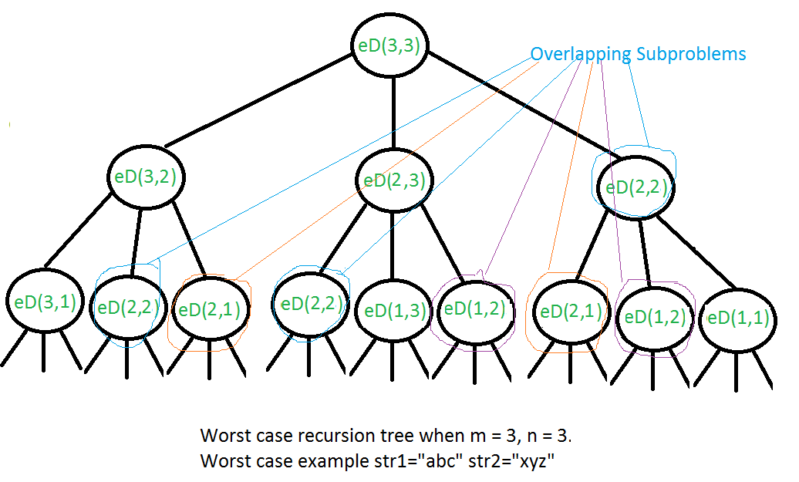

# 告别动态规划，连刷 40 道题，我总结了这些套路，看不懂你打我 

[Dynamic_programming](https://en.wikipedia.org/wiki/Dynamic_programming)

1. dynamic programming refers to simplifying a complicated problem by breaking it down into simpler sub-problems in a recursive manner. 
2. If sub-problems can be nested recursively inside larger problems, so that dynamic programming methods are applicable, then there is a relation between the value of the larger problem and the values of the sub-problems.

## Computer programming

There are two key attributes that a problem must have in order for dynamic programming to be applicable: [optimal substructure](https://en.wikipedia.org/wiki/Optimal_substructure) and [overlapping sub-problems](https://en.wikipedia.org/wiki/Overlapping_subproblemsl). **If a problem can be solved by combining optimal solutions to non-overlapping sub-problems, the strategy is called "[divide and conquer](https://en.wikipedia.org/wiki/Divide-and-conquer_algorithm)" instead**. This is why merge sort and quick sort are not classified as dynamic programming problems.

### overlapping sub-problems

[overlapping-subproblems in DP](https://www.geeksforgeeks.org/overlapping-subproblems-property-in-dynamic-programming-dp-1/)

Like Divide and Conquer, Dynamic Programming combines solutions to sub-problems. Dynamic Programming is mainly used when solutions of same subproblems are needed again and again. In dynamic programming, computed solutions to subproblems are stored in a table so that these don’t have to be recomputed. 

**So Dynamic Programming is not useful when there are no common (overlapping) subproblems because there is no point storing the solutions if they are not needed again**. For example, Binary Search doesn’t have common subproblems. If we take an example of following recursive program for Fibonacci Numbers, there are many subproblems which are solved again and again.

### Optimal substructure Property in DP

[Optimal substructure Property in DP](https://www.geeksforgeeks.org/optimal-substructure-property-in-dynamic-programming-dp-2/)

>Optimal Substructure: A given problems has Optimal Substructure Property if optimal solution of the given problem can be obtained by using optimal solutions of its subproblems.

the Shortest Path problem has following optimal substructure property:If a node x lies in the shortest path from a source node u to destination node v then the shortest path from u to v is combination of shortest path from u to x and shortest path from x to v

On the other hand, the Longest Path problem doesn’t have the Optimal Substructure property.

## 概述

1. 动态规划( **Dynamic Programming** )，通过 **将原问题分解为相对简单的子问题的方式来求解**。 
2. 通常许多子问题非常相似，所以为了优化动态规划的速度，我们需要试图为每个子问题只求值一次：一旦给定某个子问题的解，我们就可以将它存储起来，以便一下次解决同一个子问题时直接查表；
3. 动态规划只能应用于有 **最优子结构** 的


## 动态规划的三个步骤

1. 定义数组元素的含义。假设我们定义了一个一位数组 dp[]，那么我们的 dp[i] 代表的什么意思？
2. 找出数组元素之间的关系式
3. 找出初始值

## 动态规划和递归的关系

>参考 [transform word](###transform_word)

对于部分DP问题，我们很难直接想到如何去定义数组元素的含义。所以我们可以尝试： **先使用递归来解决问题，随后在递归中寻找 Overlapping subproblems**

当我们使用递归实现解决了问题之后，我们会发现：

1. 递归的退出条件就是DP的初始条件
2. 递归中的 **递归调用** 就是DP的数组元素之间的关系式

## example

### frog

>问题描述：一只青蛙一次可以跳上 1 级台阶，也可以跳上 2 级。求该青蛙跳上一个 n 级的台阶总共有多少种跳法。

#### 青蛙跳台阶：步骤一

我们定义 dp [i] 的含义为：跳上一个 i 级的台阶总共有 dp [i] 种跳法

#### 找出数组元素间的关系式

对于这道题，由于情况可以选择跳一级，也可以选择跳两级，所以青蛙到达第 n 级的台阶有两种方式

一种是从第 n-1 级跳上来

一种是从第 n-2 级跳上来

由于我们是要算所有可能的跳法的，所以有 **dp [n] = dp [n-1] + dp [n-2]。**

#### 找出初始条件

dp[1] = 1, dp[0] = 0

#### 实现

```c
#include <assert.h>
#include "stdio.h"
#include "stdlib.h"

size_t *frog_cal_cnt;
size_t *frog2_cal_cnt;
size_t *frog3_cal_cnt;

void init(size_t n)
{
    frog_cal_cnt  = malloc((n + 1) * sizeof(size_t));
    frog2_cal_cnt = malloc((n + 1) * sizeof(size_t));
    frog3_cal_cnt = malloc((n + 1) * sizeof(size_t));
    for (size_t i = 0; i <= n; ++i)
    {
        frog_cal_cnt[i]  = 0;
        frog2_cal_cnt[i] = 0;
        frog3_cal_cnt[i] = 0;
    }
}

void destroy()
{
    free(frog_cal_cnt);
    free(frog2_cal_cnt);
    free(frog3_cal_cnt);
}

void prt_cnt(size_t n)
{

    printf("===================%zu===================\n", n);

    for (size_t i = 0; i < n; ++i)
    {
        printf("i = %zu, f1 = %4zu, f2 = %4zu, f3 = %4zu\n",
                i, frog_cal_cnt[i], frog2_cal_cnt[i], frog3_cal_cnt[i]);
    }

    printf("===================%zu===================\n", n);
}

// 最简单的递归算法，空间复杂度是指数级，并且我们在计算过程中对每一个元素都计算了多次
int frog(size_t n)
{
    ++frog_cal_cnt[n];
    if (n <= 2)
        return n;
    return frog(n - 1) + frog(n - 2);
}

int frog2(size_t n)
{
    ++frog2_cal_cnt[n];
    if (n <= 2)
        return n;

    size_t memoize[n + 1];
    for (int i = 0; i <= n; ++n)
        memoize[i] = -1;
    memoize[0] = 0;
    memoize[1] = 1;
    memoize[2] = 2;

    return 0;
}

// 自底向上，这样的空间复杂度为 O(n)
int frog3(size_t n)
{
    int memoize[n + 1];
    memoize[0] = 0;
    memoize[1] = 1;
    memoize[2] = 2;

    for (size_t i = 3; i <= n; ++i)
    {
        memoize[i] = memoize[i - 1] + memoize[i - 2];
        ++frog3_cal_cnt[i];
    }

    return memoize[n];
}

int main(int argc, char **argv)
{
    size_t n = 10;

    for (size_t i = 0; i < n; ++i)
    {
        init(i);
        assert(frog(i) == frog3(i));
        prt_cnt(i);
        destroy();
    }
}
```

### robot

>一个机器人位于一个 m x n 网格的左上角，机器人每次只能向下或者向右移动一步。机器人试图达到网格的右下角，问总共有多少条不同的路径

#### 思路

从动态规划的思路来讲，可以到达点 P 的路径等于 **(可以到达点P的上方的点的路径) + (可以到达点P左侧的点的路径)**

#### 步骤一：定义数组的元素

我们定义二维数组 dp[m][n]，其中 dp[i][j] 是可以到达点 p[i][j] 的路径数量。

#### 步骤二：找出状态转换

dp[i][j] = dp[i - 1][j] + dp[i][j - 1]

#### 步骤三：找出初始状态

1. dp[0][0] == 0
2. dp[0][1] == 1
3. dp[1][0] == 1

#### 实现

```c
#include <assert.h>
#include "stdio.h"

int uniquePaths(int m, int n)
{
    if (m <= 0 || n <= 0)
        return 0;
    if (m == 1 || n == 1)
        return 1;

    int dp[n][m];
    dp[0][0] = 0;
    for (int i = 0; i < m; ++i)
    {
        dp[0][i] = 1;
    }
    for (int j = 0; j < n; ++j)
    {
        dp[j][0] = 1;
    }

    for (int i = 1; i < n; ++i)
    {
        for (int j = 1; j < m; ++j)
        {
            dp[i][j] = dp[i - 1][j] + dp[i][j - 1];
        }
    }

    return dp[n - 1][m - 1];
}

int main(int argc, char **argv)
{
    assert(uniquePaths(0, 0) == 0);
    assert(uniquePaths(1, 1) == 1);
    assert(uniquePaths(1, 2) == 1);
    assert(uniquePaths(2, 2) == 2);
    printf("%d\n", uniquePaths(3, 2));
    assert(uniquePaths(3, 2) == 3);
}
```

>O (n*m) 的空间复杂度可以优化成 O (min (n, m)) 的空间复杂度的，不过这里先不讲

### min sum path

>给定一个包含非负整数的 m x n 网格，请找出一条从左上角到右下角的路径，使得路径上的数字总和为最小。

#### 思路

假设我们要去的是点 sum(m, n)，那么 min(sum(m, n)) 就等于 min(min(sum(m-1,n)), min(sum(m, n-1))) + p(m, n)

#### 定义数组元素的含义

假设 dp[m][n] 表示的是到达点 P(m, n) 的最小路径和

#### 找到初始元素

1. 当 m == 0 时，sum(m, n) = P(0, 0) + P(0, 1) + ... + P(0, m)
2. 当 n == 0 时，sum(m, n) = P(0, 0) + P(1, 0) + ... + P(n, 0)
3. 当 m != 0 && n != 0时，sum(m, n) = min(sum(m - 1, n), sum(m, n - 1)) + p(m, n)

#### 实现

```c
#include "stdio.h"
#include "stdlib.h"

int minPathSum(int **grid, int gridSize, int *gridColSize)
{
    int m = *gridColSize, n = gridSize;

    int dp[m][n];

    int *start = *grid;

    dp[0][0] = *start;
    for (int col = 1; col < n; ++col)
    {
        dp[0][col] = start[col] + dp[0][col - 1];
    }
    for (int row = 1; row < m; ++row)
    {
        dp[row][0] = start[row * m] + dp[row - 1][0];
    }


    for (int col = 1; col < m; ++col)
    {
        for (int row = 1; row < n; ++row)
        {
            int up = dp[col - 1][row];
            int left   = dp[col][row - 1];
            int min  = up > left ? left : up;
            dp[col][row] = min + start[col * m + row];
        }
    }

    return dp[m - 1][n - 1];
}

int main(int argc, char **argv)
{
    int rows = 3, columns = 3;

    int numbers[9];
    numbers[0] = 1;
    numbers[1] = 3;
    numbers[2] = 1;
    numbers[3] = 1;
    numbers[4] = 5;
    numbers[5] = 1;
    numbers[6] = 4;
    numbers[7] = 2;
    numbers[8] = 1;

    int *p = numbers;
    int **pp = &p;
    printf("%d\n", minPathSum(&p, rows, &columns));
}
```

### transform_word

<font size='8'>[**edit distance**](https://www.geeksforgeeks.org/edit-distance-dp-5/)</font>

>给定两个单词 word1 和 word2，计算出将 word1 转换成 word2 所使用的最少操作数 。
><br/>
>你可以对一个单词进行如下三种操作：
><br/>
>插入一个字符 删除一个字符 替换一个字符

#### 思路

>问题 1：如果 word1 [0..i-1] 到 word2 [0..j-1] 的变换需要消耗 k 步，那 word1 [0..i] 到 word2 [0..j] 的变换需要几步呢？

先使用 k 步，把 word1 [0..i-1] 变换到 word2 [0..j-1]，消耗 k 步。再把 word1 [i] 改成 word2 [j]，就行了。如果 word1 [i] == word2 [j]，什么也不用做，一共消耗 k 步，否则需要修改，一共消耗 k + 1 步。

>问题 2：如果 word1 [0..i-1] 到 word2 [0..j] 的变换需要消耗 k 步，那 word1 [0..i] 到 word2 [0..j] 的变换需要消耗几步呢？

先经过 k 步，把 word1 [0..i-1] 变换到 word2 [0..j]，消耗掉 k 步，再把 word1 [i] 删除，这样，word1 [0..i] 就完全变成了 word2 [0..j] 了。一共 k + 1 步。

>问题 3：如果 word1 [0..i] 到 word2 [0..j-1] 的变换需要消耗 k 步，那 word1 [0..i] 到 word2 [0..j] 的变换需要消耗几步呢？

先经过 k 步，把 word1 [0..i] 变换成 word2 [0..j-1]，消耗掉 k 步，接下来，再插入一个字符 word2 [j], word1 [0..i] 就完全变成了 word2 [0..j] 了。


#### naive recursive

如果我们要把 src[0...m] 转换为 dst[0...n]，那么整个过程应该是如下的转换：

>src[0...m] -> by-prd-0 -> ... -> by-prd-n -> dst[0...n]

而 by-prd-n 的状态一定是：

1. dst[0...n-1]		其中 dst[0] 到 dst[n-1] 的字符相同
2. dst[0...n+1]		其中 dst[0] 到 dst[n] 全部相同
3. dst[0...n]		其中 dst[0] 到 dst[n-1] 的字符相同，但是 dst[n] 不同

三种状态中的一种，分别可以通过 insert，delete，replace， 来得到最终状态，那么问题就转换为了求下面三种变换的最小值：

1. src[0...m]   -> dst[0...n-1]
2. src[0...m-1] -> dst[0...n]
3. src[0...m-1] -> dst[0...n-1]

对于第一种情况，意味着 dst 比 by-prd-n 多一个字符，所以将 dst 的长度减一，insert(dst[n])
对于第二种情况，意味着 dst 比 by-prd-n 少一个字符，所以将 src 的长度减一，delete(src[n])
对于第三种情况，意味着 dst 和 by-prd-n 相同的长度，所以将 dst 和 src 的长度都减一，replace(src[n], dst[n]) 

现在我们来思考递归的退出条件：

1. m == 0 && n != 0：通过 insert 来向 src 插入字符
2. m != 0 && n == 0：通过 delete 删除 src 中的字符
3. m == 0 && n == 0：此时已经转换完毕

**还有一个必须要注意的，当 src[x] == dst[x] 时，我们可以直接跳过这个点**

```cpp
// A Naive recursive C++ program to find minimum number 
// operations to convert str1 to str2 
#include<bits/stdc++.h> 
using namespace std; 
  
// Utility function to find minimum of three numbers 
int min(int x, int y, int z) 
{ 
   return min(min(x, y), z); 
} 
  
int editDist(string str1 , string str2 , int m ,int n) 
{ 
    // If first string is empty, the only option is to 
    // insert all characters of second string into first 
    if (m == 0) return n; 
  
    // If second string is empty, the only option is to 
    // remove all characters of first string 
    if (n == 0) return m; 
  
    // If last characters of two strings are same, nothing 
    // much to do. Ignore last characters and get count for 
    // remaining strings. 
    if (str1[m-1] == str2[n-1]) 
        return editDist(str1, str2, m-1, n-1); 
  
    // If last characters are not same, consider all three 
    // operations on last character of first string, recursively 
    // compute minimum cost for all three operations and take 
    // minimum of three values. 
    return 1 + min ( editDist(str1,  str2, m, n-1),    // Insert 
                     editDist(str1,  str2, m-1, n),   // Remove 
                     editDist(str1,  str2, m-1, n-1) // Replace 
                   ); 
} 
```

>The time complexity of above solution is exponential. In worst case, we may end up doing O(3m) operations. The worst case happens when none of characters of two strings match.
><br/>
>We can see that many subproblems are solved, again and again, for example, eD(2,2) is called three times. Since same suproblems are called again, this problem has Overlapping Subprolems property. 
><br/>
>**Like other typical Dynamic Programming(DP) problems, recomputations of same subproblems can be avoided by constructing a temporary array that stores results of subproblems.**

[Optimal Substructure Property in Dynamic Programming | DP-2](https://www.geeksforgeeks.org/optimal-substructure-property-in-dynamic-programming-dp-2/)



<font size='4'>因为这个问题包含了DP的两个条件：Overlapping subproblems 和 optimal substructure，所以我们可以通过DP来优化它。优化的方式就是通过将 eD(2, 2) 这种重复计算多次的结果存放在一个二维数组中。**所以我们可以很轻松的知道这个二维数组中的 dp [i][j] 就是将长度为 i 的字符转换为一个长度为 j 的字符的最少步骤**</font>

```cpp
#include <assert.h>
#include "stdio.h"
#include "string.h"

int min(int x, int y)
{
    return x < y ? x : y;
}

int min2(int x, int y, int z)
{
    return min(min(x, y), z);
}

int minDistance(char *word1, char *word2)
{
    if (word1 == NULL || word2 == NULL)
    {
        return 0;
    }
    size_t len1 = strlen(word1), len2 = strlen(word2);
    int    dp[len1 + 1][len2 + 1];

    for (size_t i = 0; i <= len1; ++i)
    {
        for (size_t j = 0; j <= len2; ++j)
        {
            if (i == 0)
            {
                dp[i][j] = j;
            }
            else if (j == 0)
            {
                dp[i][j] = i;
            }
            else
            {
                if (word1[i-1] == word2[j-1])
                {
                    dp[i][j] = dp[i - 1][j - 1];
                }
                else
                {
                    dp[i][j] = 1 + min2(dp[i - 1][j], dp[i][j - 1], dp[i - 1][j - 1]);
                }
            }
        }
    }

    return dp[len1][len2];
}

int main(int argc, char **argv)
{
    char *word1 = "horse";
    char *word2 = "ros";

    assert(minDistance(word1, word2) == 3);
    assert(minDistance(word1, word1) == 0);
    assert(minDistance(word2, word2) == 0);

    word1 = "intention";
    word2 = "execution";
    assert(minDistance(word1, word2) == 5);
}
```

## 优化

### frog 优化

```c
int frog4(size_t n)
{
    if (n <= 2)
        return n;
    int prev = 1, prev2 = 2, step = 3;

    for (size_t i = 3; i < n; ++i)
    {
        prev = prev2;
        prev2 = step;
        step = prev + prev2;
    }

    return step;
}
```

### robot优化

>一个机器人位于一个 m x n 网格的左上角，机器人每次只能向下或者向右移动一步。机器人试图达到网格的右下角，问总共有多少条不同的路径

#### 未优化代码

```c
#include <assert.h>
#include "stdio.h"

int uniquePaths(int m, int n)
{
    if (m <= 0 || n <= 0)
        return 0;
    if (m == 1 || n == 1)
        return 1;

    int dp[n][m];
    dp[0][0] = 0;
    for (int i = 0; i < m; ++i)
    {
        dp[0][i] = 1;
    }
    for (int j = 0; j < n; ++j)
    {
        dp[j][0] = 1;
    }

    for (int i = 1; i < n; ++i)
    {
        for (int j = 1; j < m; ++j)
        {
            dp[i][j] = dp[i - 1][j] + dp[i][j - 1];
        }
    }

    return dp[n - 1][m - 1];
}
```

>假设我们处理一个 m == 4 && n == 4 的路径图

---

>初始化完表格，尚未开始实际的DP时的表格状态

|   | 1 | 2 | 3 | 4 |
|---|---|---|---|---|
| 1 | 1 | 1 | 1 | 1 |
| 2 |   |   |   |   |
| 3 |   |   |   |   |
| 4 |   |   |   |   |

---

>内部的 for 循环第一次循环，我们发现一个问题
><br/>
>对于计算 dp[n] 的这一行，我们只需要用到 dp[n-1] 的这一行的数据以及 dp[n] 这一行的某一个特定值

|   | 1 | 2 | 3 | 4 |
|---|---|---|---|---|
| 1 | 1 | 1 | 1 | 1 |
| 2 | 1 | 2 | 3 | 4 |
| 3 |   |   |   |   |
| 4 |   |   |   |   |

---

#### robot优化代码实现

1. 我们声明了 dp[n] 数组用于存放 dp 数组，初始存放了到达 dp[1][j+1](其中j是dp的索引) 的 uniquePaths 数量
2. 在 for 循环中，i 是行索引，j 是列索引。
	- 在内层循环未执行之前, dp[0] 到 dp[n-1] 中存放的是到达 dp[i+1][j+1](其中 j 是 dp 的索引) 列的 uniquePaths 数量
	- 内层循环的每一次执行，更新的值是 dp[j]，这个值就被更新为到达 dp[i+1][j+1] 列的 uniquePaths 值 
3. 经过 <1>，我们 dp 存放了 dp[1][j+1] 的路径数
4. 经过第一次内层循环，我们 dp 存放了 dp[2][j+1] 的路径数

```c
int uniquePathsOptimized(int m, int n)
{
    if (m <= 0 || n <= 0)
        return 0;

    int dp[n];
    for (int i = 0; i < n; ++i)
        dp[i] = 1;

    for (int i = 1; i < m; ++i)
    {
        for (int j = 1; j < n; ++j)
        {
            dp[j] += dp[j-1];
        }
    }

    return dp[n-1];
}

```
