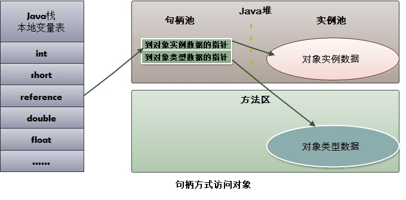
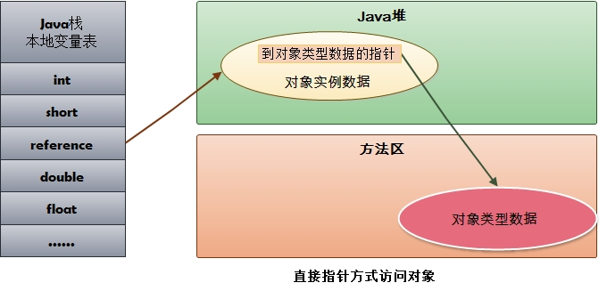
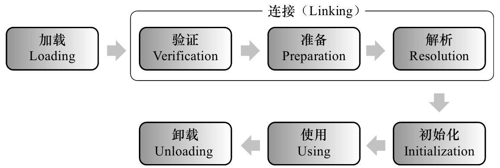
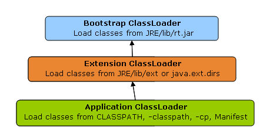

# [Java 虚拟机底层原理知识总结](https://github.com/doocs/jvm)

## [JVM 内存结构](https://github.com/doocs/jvm/blob/master/docs/01-jvm-memory-structure.md)

- Java 虚拟机的内存空间分为 5 个部分：
	- 程序计数器
	- Java 虚拟机栈
	- 本地方法栈
	- 堆
	- 方法区

JDK 1.8 同 JDK 1.7 比，最大的差别就是：元数据区取代了永久代。元空间的本质和永久代类似，都是对 JVM 规范中方法区的实现。不过元空间与永久代之间最大的区别在于： **元数据空间并不在虚拟机中，而是使用本地内存。**

### 程序计数器（PC 寄存器）

- 当前线程正在执行的那条字节码指令的地址
- 若当前线程正在执行的是一个本地方法，那么此时程序计数器为 `Undefined`

### Java 虚拟机栈（Java 栈）

- Java 虚拟机栈是描述 Java 方法运行过程的内存模型。
- Java 虚拟机栈和其他语言的方法栈功能差不多， **每个方法调用的时候创建，方法返回的时候销毁对应的栈**
- 栈帧是当前正在执行的活动栈，也就是当前正在执行的方法，PC 寄存器也会指向这个地址
- **局部变量表随着栈帧的创建而创建，它的大小在编译时确定** ，创建时只需分配事先规定的大小即可。在方法运行过程中，局部变量表的大小不会发生改变。 **类似C语言，C语言的数组大小都是固定大小，动态大小的数组都必须分配在堆上**

### 本地方法栈

- 本地方法栈是为 JVM 运行 Native 方法准备的空间

### 堆

- 用来存放对象的内存空间

### 方法区

>方法区类似于 C 的内存模型中： .text, .data, .bss 的集合

1. Java 虚拟机规范中定义方法区是堆的一个逻辑部分。方法区存放以下信息：
	- 已经被虚拟机加载的类信息
	- 常量
	- 静态变量
	- 即时编译器编译后的代码
2. 方法区的特点
	- 线程共享。 方法区是堆的一个逻辑部分
	- 永久代。 方法区中的信息一般需要长期存在，而且它又是堆的逻辑分区，因此用堆的划分方法，把方法区称为“永久代”。
	- 内存回收效率低。

### 直接内存（堆外内存）

>直接内存是除 Java 虚拟机之外的内存，但也可能被 Java 使用。

#### 操作直接内存

1. NIO 提供了一个存储在堆中的对象 `DirectByteBuffer` 来直接操作堆外内存，而无需将外部内存中的数据复制到堆中再进行操作

#### 直接内存与堆内存比较

- 直接内存申请空间耗费更高的性能
- 直接内存读取 IO 的性能要优于普通的堆内存。
- 直接内存作用链： 本地 IO -> 直接内存 -> 本地 IO
- 堆内存作用链：本地 IO -> 直接内存 -> 非直接内存 -> 直接内存 -> 本地 IO

## [HotSpot 虚拟机对象探秘](https://github.com/doocs/jvm/blob/master/docs/02-hotspot-jvm-object.md)

### 对象的内存布局

#### 对象头

>对象头记录了对象在运行过程中所需要使用的一些数据：

- 哈希码
- GC 分代年龄
- 锁状态标志
- 线程持有的锁
- 偏向线程 ID
- 偏向时间戳

**对象头可能包含类型指针，通过该指针能确定对象属于哪个类。如果对象是一个数组，那么对象头还会包括数组长度。**

#### 实例数据

实例数据部分就是成员变量的值，其中包括父类成员变量和本类成员变量。

#### 对齐填充

用于内存对齐

### 对象的创建过程

>内存的创建过程就是三步：
> 
>1. 类加载检查：否则不知道对象需要多少内存以及其他信息
> 
>2. 分配内存
> 
>3. 初始化

#### 类加载检查

虚拟机在解析 `.class` 文件时，若遇到一条 new 指令，首先它会去检查常量池中是否有这个类的符号引用，并且检查这个符号引用所代表的类是否已被加载、解析和初始化过。如果没有，那么必须先执行相应的类加载过程。

#### 为新生对象分配内存

对象所需内存的大小在类加载完成后便可完全确定，接下来从堆中划分一块对应大小的内存空间给新的对象。分配堆中内存有两种方式：

- 指针碰撞 : 如果 Java 堆中内存绝对规整（说明采用的是“复制算法”或“标记整理法”），**空闲内存和已使用内存中间放着一个指针作为分界点指示器**  ，那么分配内存时只需要把指针向空闲内存挪动一段与对象大小一样的距离，这种分配方式称为“指针碰撞”。
- 空闲列表 ： 如果 Java 堆中内存并不规整，已使用的内存和空闲内存交错（说明采用的是标记-清除法，有碎片），此时没法简单进行指针碰撞， VM 必须维护一个列表，记录其中哪些内存块空闲可用。分配之时从空闲列表中找到一块足够大的内存空间划分给对象实例。这种方式称为“空闲列表”。

>想一下C语言的 mallo/free，指针碰撞可能就是每次向后申请空间分配，回收时原地回收，当内存不够时需要整理并回收。这种会造成大量的外部内存碎片。
> 
>空闲链表类似于分离链表管理，分配内存时需要从空闲列表中获取，释放时会将内存加入到空闲链表。并且需要处理合并小的空闲链表的逻辑。这种方式可能会造成内部内存碎片

#### 初始化

分配完内存后，为对象中的成员变量赋上初始值，设置对象头信息，调用对象的构造函数方法进行初始化。

### 对象的访问方式

对象存储在堆中分配，而引起分配这个对象的语句 `new Object()` 却是在Java栈上执行的，并且在栈上分配的。

也就是说在建立一个对象时两个地方都分配内存，在堆中分配的内存实际建立这个对象，而在堆栈中分配的内存只是一个指向这个堆对象的指针（引用）而已。  **那么根据引用存放的地址类型的不同，对象有不同的访问方式。**

#### 句柄访问方式

堆中需要有一块叫做“句柄池”的内存空间，句柄中包含了对象实例数据与类型数据各自的具体地址信息。

引用类型的变量存放的是该对象的句柄地址（reference）。访问对象时，首先需要通过引用类型的变量找到该对象的句柄，然后根据句柄中对象的地址找到对象。

#### 直接指针访问

引用类型的变量直接存放对象的地址，从而不需要句柄池，通过引用能够直接访问对象。但对象所在的内存空间需要额外的策略存储对象所属的类信息的地址。

需要说明的是，HotSpot 采用第二种方式，即直接指针方式来访问对象，只需要一次寻址操作，所以在性能上比句柄访问方式快一倍。但像上面所说，它需要 **额外的策略** 来存储对象在方法区中类信息的地址。

### 类加载的时机

#### 类的生命周期

加载、验证、准备、初始化和卸载这 5 个阶段的顺序是确定的，类的加载过程必须按照这种顺序按部就班地开始（注意是“开始”，而不是“进行”或“完成”），而解析阶段则不一定：它在某些情况下可以在初始化后再开始，这是为了支持 Java 语言的运行时绑定。

#### 类加载过程中“初始化”开始的时机

Java 虚拟机规范没有强制约束类加载过程的第一阶段（即：加载）什么时候开始，但对于“初始化”阶段，有着严格的规定。有且仅有 5 种情况必须立即对类进行“初始化”：

- 在遇到 new、putstatic、getstatic、invokestatic 字节码指令时，如果类尚未初始化，则需要先触发其初始化。
- 对类进行反射调用时，如果类还没有初始化，则需要先触发其初始化。
- 初始化一个类时，如果其父类还没有初始化，则需要先初始化父类。
- 虚拟机启动时，用于需要指定一个包含 main() 方法的主类，虚拟机会先初始化这个主类。
- 当使用 JDK 1.7 的动态语言支持时，如果一个 java.lang.invoke.MethodHandle 实例最后的解析结果为 REF_getStatic、REF_putStatic、REF_invokeStatic 的方法句柄，并且这个方法句柄所对应的类还没初始化，则需要先触发其初始化。

这 5 种场景中的行为称为对一个类进行 **主动引用**，除此之外，其它所有引用类的方式都不会触发初始化，称为 **被动引用**。

## [类加载的过程](https://github.com/doocs/jvm/blob/master/docs/09-load-class-process.md)

### 加载

#### 加载的过程

1. 通过类的全限定名获取该类的二进制字节流。
2. 将二进制字节流所代表的静态结构转化为 **方法区** 的运行时数据结构。
3. 在内存中创建一个代表该类的 java.lang.Class 对象，作为方法区这个类的各种数据的访问入口。

#### 获取二进制字节流

不一定是从编译好的 .class 文件，还可以从 zip 包读取，从网络流读取等

#### “非数组类”与“数组类”加载比较

- 非数组类加载阶段可以使用系统提供的引导类加载器，也可以由用户自定义的类加载器完成，开发人员可以通过定义自己的类加载器控制字节流的获取方式（如重写一个类加载器的 loadClass() 方法）
- 数组类本身不通过类加载器创建，它是由 Java 虚拟机直接创建的，再由类加载器创建数组中的元素类。

### 注意事项

- 虚拟机规范未规定 Class 对象的存储位置，对于 HotSpot 虚拟机而言，Class 对象比较特殊，它虽然是对象，但存放在方法区中。
- 加载阶段与连接阶段的部分内容交叉进行，加载阶段尚未完成，连接阶段可能已经开始了。但这两个阶段的开始时间仍然保持着固定的先后顺序。

### 验证

验证阶段确保 Class 文件的字节流中包含的信息符合当前虚拟机的要求，并且不会危害虚拟机自身的安全。

### 准备

准备阶段是正式为类变量（或称“静态成员变量”）分配内存并设置 **初始值(一般是 0 或者 null)** 的阶段。这些变量（不包括实例变量）所使用的内存都在方法区中进行分配。

### 解析

解析阶段是虚拟机将常量池内的符号引用替换为直接引用的过程。

### 初始化

类初始化阶段是类加载过程的最后一步，是执行类构造器 <clinit>() 方法的过程。

<clinit>() 方法是由编译器自动收集类中的所有类变量的赋值动作和静态语句块（static {} 块）中的语句合并产生的，编译器收集的顺序是由语句在源文件中出现的顺序所决定的。

<clinit>() 方法不需要显式调用父类构造器，虚拟机会保证在子类的 <clinit>() 方法执行之前，父类的 <clinit>() 方法已经执行完毕。

## 类加载器

### 类与类加载器

#### 判断类是否“相等”

任意一个类，都由 **加载它的类加载器** 和 **这个类本身** 一同确立其在 Java 虚拟机中的唯一性，每一个类加载器，都有一个独立的类名称空间。

这里的“相等”，包括代表类的 Class 对象的 equals() 方法、isInstance() 方法的返回结果，也包括使用 instanceof 关键字做对象所属关系判定等情况。

#### 加载器种类

### 双亲委派模型

#### 什么是双亲委派模型

双亲委派模型是描述类加载器之间的层次关系。它要求除了顶层的启动类加载器外，其余的类加载器都应当有自己的父类加载器。（父子关系一般不会以继承的关系实现，而是以组合关系来复用父加载器的代码）

#### 工作过程

如果一个类加载器收到了类加载的请求，它首先不会自己去尝试加载这个类，而是把这个请求委派给父类加载器去完成，每一个层次的类加载器都是如此，因此所有的加载请求最终都应该传送到顶层的启动类加载器中，只有当父加载器反馈自己无法完成这个加载请求（找不到所需的类）时，子加载器才会尝试自己去加载。

#### 为什么使用双亲委派模型

像 java.lang.Object 这些存放在 rt.jar 中的类，无论使用哪个类加载器加载，最终都会委派给最顶端的启动类加载器加载，从而使得不同加载器加载的 Object 类都是同一个。

相反，如果没有使用双亲委派模型，由各个类加载器自行去加载的话，如果用户自己编写了一个称为 java.lang.Object 的类，并放在 classpath 下，那么系统将会出现多个不同的 Object 类，Java 类型体系中最基础的行为也就无法保证。
