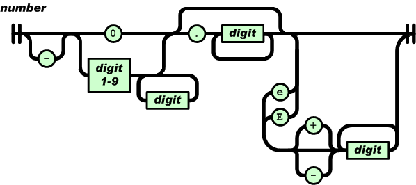
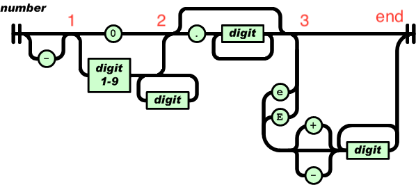

# [从零开始的 JSON 库教程](https://zhuanlan.zhihu.com/json-tutorial)

## tutorial01

### JSON 语法子集

```
JSON-text = ws value ws
ws = *(%x20 / %x09 / %x0A / %x0D)
value = null / false / true 
null  = "null"
false = "false"
true  = "true"
```

当中 `%xhh` 表示以 16 进制表示的字符，`/` 是多选一，`*` 是零或多个，`()` 用于分组。

那么第一行的意思是，JSON 文本由 3 部分组成，首先是空白（whitespace），接着是一个值，最后是空白。

第二行告诉我们，所谓空白，是由零或多个空格符（space U+0020）、制表符（tab U+0009）、换行符（LF U+000A）、回车符（CR U+000D）所组成。

第三行是说，我们现时的值只可以是 null、false 或 true，它们分别有对应的字面值（literal）。

### 宏的编写技巧

有些同学可能不了解 `EXPECT_EQ_BASE` 宏的编写技巧，简单说明一下。反斜线代表该行未结束，会串接下一行。而如果宏里有多过一个语句（statement），就需要用 `do { /*...*/ } while(0)` 包裹成单个语句，否则会有如下的问题：

```c
#define M() a(); b()

if (cond)
    M();
else
    c();

/* 预处理后 */

if (cond)
    a(); b(); /* b(); 在 if 之外     */
else          /* <- else 缺乏对应 if */
    c();
```

只用 `{ }` 也不行：

```c
#define M() { a(); b(); }

/* 预处理后 */

if (cond)
    { a(); b(); }; /* 最后的分号代表 if 语句结束 */
else               /* else 缺乏对应 if */
    c();
```

用 do while 就行了：

```c
#define M() do { a(); b(); } while(0)

/* 预处理后 */

if (cond)
    do { a(); b(); } while(0);
else
    c();
```

### 关于断言

初使用断言的同学，可能会错误地把含副作用的代码放在 assert() 中：

```c
assert(x++ == 0); /* 这是错误的! */
```

这样会导致 debug 和 release 版的行为不一样。

另一个问题是，初学者可能会难于分辨何时使用断言，何时处理运行时错误（如返回错误值或在 C++ 中抛出异常）。

简单的答案是， **如果那个错误是由于程序员错误编码所造成的（例如传入不合法的参数），那么应用断言；如果那个错误是程序员无法避免，而是由运行时的环境所造成的，就要处理运行时错误（例如开启文件失败）。**

### 代码实现总结

>对于 `LEPT_PARSE_ROOT_NOT_SINGULAR` 这个异常，我的实现是在 `lept_parse_true` 这些函数中实现；
><br/>
>而 answer 中的代码是在 `lept_parse` 中实现。
><br/>
>answer 的代码更好，因为 **每次 parse 完特定类型之后之后都需要做这个异常检查**

```c
static int lept_parse_false(lept_context* c, lept_value* v) {
    EXPECT(c, 'f');
    if (c->json[0] != 'a' || c->json[1] != 'l' || c->json[2] != 's' || c->json[3] != 'e')
    {
        return LEPT_PARSE_INVALID_VALUE;
    }
    c->json += 4;
    lept_parse_whitespace(c);
    if (*c->json != '\0')
    {
        return LEPT_PARSE_ROOT_NOT_SINGULAR;
    }
    else
    {
        v->type = LEPT_FALSE;
        return LEPT_PARSE_OK;
    }
}
```

```c
int lept_parse(lept_value* v, const char* json) {
    lept_context c;
    int ret;
    assert(v != NULL);
    c.json = json;
    v->type = LEPT_NULL;
    lept_parse_whitespace(&c);
    if ((ret = lept_parse_value(&c, v)) == LEPT_PARSE_OK) {
        lept_parse_whitespace(&c);
        if (*c.json != '\0')
            ret = LEPT_PARSE_ROOT_NOT_SINGULAR;
    }
    return ret;
}
```

## tutorial02

### JSON 数字语法

```
number = [ "-" ] int [ frac ] [ exp ]
int = "0" / digit1-9 *digit
frac = "." 1*digit
exp = ("e" / "E") ["-" / "+"] 1*digit
```

number 是以十进制表示，它主要由 4 部分顺序组成：负号、整数、小数、指数。只有整数是必需部分。注意和直觉可能不同的是，正号是不合法的。

整数部分如果是 0 开始，只能是单个 0；而由 1-9 开始的话，可以加任意数量的数字（0-9）。也就是说，0123 不是一个合法的 JSON 数字。

小数部分比较直观，就是小数点后是一或多个数字（0-9）。

JSON 可使用科学记数法，指数部分由大写 E 或小写 e 开始，然后可有正负号，之后是一或多个数字（0-9）。



### 总结

1. 为什么要把一些测试代码以 `#if 0 ... #endif` 禁用？

因为在做第 1 个练习题时，我希望能 100% 通过测试，方便做重构。另外，使用 #if 0 ... #endif 而不使用 /* ... */，是因为 C 的注释不支持嵌套（nested），而 #if ... #endif 是支持嵌套的。代码中已有注释时，用 #if 0 ... #endif 去禁用代码是一个常用技巧，而且可以把 0 改为 1 去恢复。

---

### **`个人总结`**

- 字面值数组的长度是字符长度+1：`sizeof("true") == 5`
- 在对数组进行 for 循环时可以使用如下技巧

```c
// 执行完之后 i 就是数组的长度
size_t i;
for (i = 0; literal[i]; ++i)
{
	// work
}
```

#### 语法手写为校验规则



1. 整个图分为 1，2，3 三个状态，我们每次的目的是达到 end。如果不能达到 end 那么 valid 失败
2. 要到达 `1`，我们可以通过两个途径，接受一个 `-` 或者 `""`
3. 根据代码，我们每一个模块可以到达下一个状态。
4. 在从一个状态到另外一个状态的过程中，可能还会有 `3 -> end` 这种比较复杂的状态变换，其实它相当于这个图的一个子模块。

```c
static int valid_number2(lept_context *c, char **end)
{
    const char *p = c->json;
    if (*p == '-')
        ++p;
	// 到达状态1

    if (*p == '0')
    {
        ++p;
    }
    else if (ISDIGIT1TO9(*p))
    {
        for (p++; ISDIGIT(*p); p++);
    }
    else
    {
        return LEPT_PARSE_INVALID_VALUE;
    }
	// 到达状态2

    if (*p == '.')
    {
        p++;
        if (!ISDIGIT(*p))
            return LEPT_PARSE_INVALID_VALUE;
        for (p++; ISDIGIT(*p); p++);
    }
	// 到达状态3

    if (*p == 'e' || *p == 'E')
    {
        p++;
        if (*p == '+' || *p == '-')
        {
            p++;
        }
        if (!ISDIGIT(*p))
            return LEPT_PARSE_INVALID_VALUE;
        for (p++; ISDIGIT(*p); p++){};
    }
	// 到达 end

    *end = p;
    return LEPT_PARSE_OK;
}
```

## tutorial03

### JSON 字符串语法


```
string = quotation-mark *char quotation-mark
char = unescaped /
   escape (
       %x22 /          ; "    quotation mark  U+0022
       %x5C /          ; \    reverse solidus U+005C
       %x2F /          ; /    solidus         U+002F
       %x62 /          ; b    backspace       U+0008
       %x66 /          ; f    form feed       U+000C
       %x6E /          ; n    line feed       U+000A
       %x72 /          ; r    carriage return U+000D
       %x74 /          ; t    tab             U+0009
       %x75 4HEXDIG )  ; uXXXX                U+XXXX
escape = %x5C          ; \
quotation-mark = %x22  ; "
unescaped = %x20-21 / %x23-5B / %x5D-10FFFF
```

简单翻译一下，JSON 字符串是由前后两个双引号夹着零至多个字符。字符分为 `无转义字符` 或 `转义序列`。转义序列有 9 种，都是以反斜线开始，如常见的 \n 代表换行符。比较特殊的是 \uXXXX，当中 XXXX 为 16 进位的 UTF-16 编码，本单元将不处理这种转义序列，留待下回分解。

### 2. 字符串表示

- JSON 允许 '\0' 字符，例如 "Hello\u0000World"

了解需求后，我们考虑实现。lept_value 事实上是一种变体类型（variant type），我们通过 type 来决定它现时是哪种类型，而这也决定了哪些成员是有效的。首先我们简单地在这个结构中加入两个成员：

```c
typedef struct {
    char* s;
    size_t len;
    double n;
    lept_type type;
}lept_value;
```

然而我们知道，一个值不可能同时为数字和字符串，因此我们可使用 C 语言的 union 来节省内存：

```c
typedef struct {
    union {
        struct { char* s; size_t len; }s;  /* string */
        double n;                          /* number */
    }u;
    lept_type type;
}lept_value;
```

### 3. 内存管理

由于字符串的长度不是固定的，我们要动态分配内存。为简单起见，我们使用标准库 `<stdlib.h>` 中的 `malloc()`、`realloc()` 和 `free()` 来分配／释放内存。

```c
void lept_set_string(lept_value* v, const char* s, size_t len) {
    assert(v != NULL && (s != NULL || len == 0));
    lept_free(v);
    v->u.s.s = (char*)malloc(len + 1);
    memcpy(v->u.s.s, s, len);
    v->u.s.s[len] = '\0';
    v->u.s.len = len;
    v->type = LEPT_STRING;
}
```

那么，再看看 lept_free()：

```c
void lept_free(lept_value* v) {
    assert(v != NULL);
    if (v->type == LEPT_STRING)
        free(v->u.s.s);
    v->type = LEPT_NULL;
}
```

但也由于我们会检查 `v` 的类型，在调用所有访问函数之前，我们必须初始化该类型。所以我们加入 lept_init(v)，因非常简单我们用宏实现：

```c
#define lept_init(v) do { (v)->type = LEPT_NULL; } while(0)
```

用上 `do { ... } while(0)` 是为了把表达式转为语句，模仿无返回值的函数。

其实在前两个单元中，我们只提供读取值的 API，没有写入的 API，就是因为写入时我们还要考虑释放内存。我们在本单元中把它们补全：

```c
#define lept_set_null(v) lept_free(v)

int lept_get_boolean(const lept_value* v);
void lept_set_boolean(lept_value* v, int b);

double lept_get_number(const lept_value* v);
void lept_set_number(lept_value* v, double n);

const char* lept_get_string(const lept_value* v);
size_t lept_get_string_length(const lept_value* v);
void lept_set_string(lept_value* v, const char* s, size_t len);
```

### 4. 缓冲区与堆栈

我们解析字符串（以及之后的数组、对象）时，需要把解析的结果先储存在一个临时的缓冲区，最后再用 lept_set_string() 把缓冲区的结果设进值之中。

**如果每次解析字符串时，都重新建一个动态数组，那么是比较耗时的。我们可以重用这个动态数组，每次解析 JSON 时就只需要创建一个。** 而且我们将会发现，无论是解析字符串、数组或对象，我们也只需要以先进后出的方式访问这个动态数组。换句话说，我们需要一个动态的堆栈（stack）数据结构。

我们把一个动态堆栈的数据放进 lept_context 里：

```c
typedef struct {
    const char* json;
    char* stack;
    size_t size, top;
}lept_context;
```

然后，我们实现堆栈的压入及弹出操作。和普通的堆栈不一样，我们这个堆栈是以字节储存的。每次可要求压入任意大小的数据，它会返回数据起始的指针（会 C++ 的同学可再参考[1]）：

```c
#ifndef LEPT_PARSE_STACK_INIT_SIZE
#define LEPT_PARSE_STACK_INIT_SIZE 256
#endif

static void* lept_context_push(lept_context* c, size_t size) {
    void* ret;
    assert(size > 0);
	// 如果超过栈的大小，就扩容
    if (c->top + size >= c->size) {
		// 初始化
        if (c->size == 0)
            c->size = LEPT_PARSE_STACK_INIT_SIZE;
		// 计算新的 size
        while (c->top + size >= c->size)
            c->size += c->size >> 1;  /* c->size * 1.5 */

		// realloc 复制数据到新的地址
        c->stack = (char*)realloc(c->stack, c->size);
    }

	// 返缓冲区的地址，缓冲区提供的大小为 size(不是 c->size)
    ret = c->stack + c->top;
	// 修改栈指针，这是信任外部的操作的。
	// 因为用户完全可以使用超过栈的空间
    c->top += size;
    return ret;
}

static void* lept_context_pop(lept_context* c, size_t size) {
    assert(c->top >= size);
    return c->stack + (c->top -= size);
}
```

解析字符串

```c
static int lept_parse_string(lept_context* c, lept_value* v) {
    size_t head = c->top, len;
    const char* p;
    EXPECT(c, '\"');
    p = c->json;
    for (;;) {
        char ch = *p++;
        switch (ch) {
			// 遇到 " 就退出并计算长度，这里注意。
			// 每次 PUTC 都会修改 c->top，那么结束是的 c->top - 开始时的 c->top 就是实际长度
            case '\"':
                len = c->top - head;
                lept_set_string(v, (const char*)lept_context_pop(c, len), len);
                c->json = p;
                return LEPT_PARSE_OK;
            case '\0':
                c->top = head;
                return LEPT_PARSE_MISS_QUOTATION_MARK;
            default:
                PUTC(c, ch);
        }
    }
}
```

### 个人总结

- 可以在 lept_value 中使用 `union` 来节省内存
- 字符串必须存放在动态分配的空间中，我们使用 `malloc()` 和 `free()` 来管理内存，同时 `free()` 可以封装成 `lept_free()` 函数
- 我们在解析字符串的时候：
	- 我们可以直接分配某个 `size` 的堆空间，然后在空间不够的时候扩展这个堆，最后将 lept_value 指向这个堆上的数据。 **优点是，可以节省一次从缓存上拷贝数据到 `stack` 的开销，缺点是会浪费一些内存**
	- 也可以和我们的例子中，在 `lept_context` 上分配一个缓存，所有的字符串都在这个缓存上读写，最后将数据从缓存上复制到 `stack` 上

#### 解析 boolean 错误

>这是开始的实现。因为 `v->type` 是一个枚举类型，所以 LEPT_TRUE 和 LEPT_FALSE 都不等于零。
><br/>
>后来我又实现为 `return v->type == LEPT_FALSE`，这会导致 v->type == LEPT_FALSE 时返回 1，从而返回完全相反的结果。

```c
int lept_get_boolean(const lept_value* v) {
    assert(v != NULL);
	// 错误的实现
    return v->type;
}

void lept_set_boolean(lept_value* v, int b) {
    assert(v != NULL);
    v->type = ((b == 0) ? LEPT_FALSE : LEPT_TRUE);
}
```

#### 性能优化的思考

如果整个字符串都没有转义符，我们不就是把字符复制了两次？第一次是从 json 到 stack，第二次是从 stack 到 v->u.s.s。我们可以在 json 扫描 '\0'、'\"' 和 '\\' 3 个字符（ ch < 0x20 还是要检查），直至它们其中一个出现，才开始用现在的解析方法。这样做的话，前半没转义的部分可以只复制一次。缺点是，代码变得复杂一些，我们也不能使用 lept_set_string()。>

## tutorial04

### 2. 需求

对于 JSON字符串中的 `\uXXXX` 是以 16 进制表示码点 `U+0000` 至 `U+FFFF`，我们需要：

1. 解析 4 位十六进制整数为码点；
2. 由于字符串是以 UTF-8 存储，我们要把这个码点编码成 UTF-8。

同学可能会发现， **4 位的 16 进制数字只能表示 0 至 0xFFFF，但之前我们说 UCS 的码点是从 0 至 0x10FFFF**，那怎么能表示多出来的码点？

其实，U+0000 至 U+FFFF 这组 Unicode 字符称为 **基本多文种平面**（basic multilingual plane, BMP）， **还有另外 16 个平面。**

那么 BMP 以外的字符，JSON 会使用代理对（surrogate pair）表示 **\uXXXX\uYYYY**。在 BMP 中，保留了 2048 个代理码点。如果第一个码点是 U+D800 至 U+DBFF，我们便知道它的代码对的高代理项（high surrogate），之后应该伴随一个 U+DC00 至 U+DFFF 的低代理项（low surrogate）。然后，我们用下列公式把代理对 (H, L) 变换成真实的码点：

```
codepoint = 0x10000 + (H − 0xD800) × 0x400 + (L − 0xDC00)
```

举个例子，高音谱号字符 `𝄞` → U+1D11E 不是 BMP 之内的字符。在 JSON 中可写成转义序列 \uD834\uDD1E，我们解析第一个 \uD834 得到码点 U+D834，我们发现它是 U+D800 至 U+DBFF 内的码点，所以它是高代理项。然后我们解析下一个转义序列 \uDD1E 得到码点 U+DD1E，它在 U+DC00 至 U+DFFF 之内，是合法的低代理项。我们计算其码点：

```
H = 0xD834, L = 0xDD1E
codepoint = 0x10000 + (H − 0xD800) × 0x400 + (L − 0xDC00)
          = 0x10000 + (0xD834 - 0xD800) × 0x400 + (0xDD1E − 0xDC00)
          = 0x10000 + 0x34 × 0x400 + 0x11E
          = 0x10000 + 0xD000 + 0x11E
          = 0x1D11E
```

这样就得出这转义序列的码点，然后我们再把它编码成 UTF-8。如果只有高代理项而欠缺低代理项，或是低代理项不在合法码点范围，我们都返回 `LEPT_PARSE_INVALID_UNICODE_SURROGATE` 错误。如果 \u 后不是 4 位十六进位数字，则返回 `LEPT_PARSE_INVALID_UNICODE_HEX` 错误。

>简单来讲，就是 Unicode 默认为基本字符序列，表示 [0x0000, 0xD800) U (0xDBFF, 0xFFFF]
><br/>
>如果 Unicode 解析到了 [0xDB00, 0xDBFF] 这个区间，那么就需要继续解析下一个 Unicode 字符，并根据公式计算结果

### 3. UTF-8 编码

**UTF-8 的编码单元为 8 位（1 字节），每个码点编码成 1 至 4 个字节**。它的编码方式很简单，按照码点的范围，把码点的二进位分拆成 1 至最多 4 个字节：

| 码点范围           | 码点位数 | 字节1    | 字节2    | 字节3    | 字节4    |
|--------------------|----------|----------|----------|----------|----------|
| U+0000 ~ U+007F    | 7        | 0xxxxxxx |          |          |          |
| U+0080 ~ U+07FF    | 11       | 110xxxxx | 10xxxxxx |          |          |
| U+0800 ~ U+FFFF    | 16       | 1110xxxx | 10xxxxxx | 10xxxxxx |          |
| U+10000 ~ U+10FFFF | 21       | 11110xxx | 10xxxxxx | 10xxxxxx | 10xxxxxx |

>**简单来讲，就是用 `最高位` 来表示编码的字节数。如果最高位为 0，那么说明只占用一个字节，第七位用来表示 [0, 127] 这正好是对应 ASCII 的**
><br/>
>其次，如果高位为 `1` 开头，那么我们就需要读取 `1` 直到碰到一个 `0`。 `1` 的数量代码编码占用的字节数。
><br/>
>所有的编码字节都是 **从高位往低位读，当读到第一个 `0` 时，从这个 `0` 的下一位才是真正的编**

### 总结

>有同学可能觉得奇怪，最终也是写进一个 char，为什么要做 `x & 0xFF` 这种操作呢？这是因为 u 是 unsigned 类型，一些编译器可能会警告这个转型可能会截断数据。但实际上，配合了范围的检测然后右移之后，可以保证写入的是 0~255 内的值。为了避免一些编译器的警告误判，我们加上 x & 0xFF。一般来说，编译器在优化之后，这与操作是会被消去的，不会影响性能。

## tutorial05

### 1. JSON 数组

```
array = %x5B ws [ value *( ws %x2C ws value ) ] ws %x5D
```

- `%x5B` == `[`
- `%x2C` == `,`
- `%x5D` == `]`
- `ws` == `white space`

### 2. 数据结构

JSON 数组存储零至多个元素，最简单就是使用 C 语言的数组。数组最大的好处是能以 $O(1)$ 用索引访问任意元素，次要好处是内存布局紧凑， **省内存之余还有高缓存一致性（cache coherence）** 。但数组的缺点是不能快速插入元素，而且我们在解析 JSON 数组的时候，还不知道应该分配多大的数组才合适。

另一个选择是链表（linked list），它的最大优点是可快速地插入元素（开端、末端或中间），但需要以 $O(n)$ 时间去经索引取得内容。如果我们只需顺序遍历，那么是没有问题的。还有一个小缺点，就是相对数组而言，链表在存储每个元素时有额外内存开销（存储下一节点的指针），而且遍历时元素所在的内存可能不连续，令缓存不命中（cache miss）的机会上升。

我见过一些 JSON 库选择了链表，而这里则选择了数组。我们将会通过之前在解析字符串时实现的堆栈，来解决解析 JSON 数组时未知数组大小的问题。

```c
typedef struct lept_value lept_value;

struct lept_value {
    union {
        struct { lept_value* e; size_t size; }a; /* array */
        struct { char* s; size_t len; }s;
        double n;
    }u;
    lept_type type;
};
```

>这里使用了指向自身类型的指针，因为根据 JSON 的数组定义，一个数组的元素可以是 JSON 的任意类型中的一种

### 3. 解析过程

**和字符串有点不一样，如果把 JSON 当作一棵树的数据结构，JSON 字符串是叶节点，而 JSON 数组是中间节点。**

在整个解析过程中，我们不断的去重复：

1. 碰到 `[` 只有进入 `parse_array`
2. 解析碰到的任意对象，可能是 `array`, `string` 或者任意的 JSON 类型
3. 如果是 `除了array` 之外的任意类型，我们就把读取到的数据缓存到 `stack` 上，并且在读取结束的时候，将 `stack` 上的对象弹出，并构造出 `array 的一个元素`。 **并将这个元素压到 `stack` 上**
4. 如果是 `array`，回退到 `1`

### 实现

```c
static int lept_parse_value(lept_context* c, lept_value* v);

static int lept_parse_array(lept_context* c, lept_value* v) {
    size_t size = 0, i;
    int ret;
    EXPECT(c, '[');
    lept_parse_whitespace(c);
    /* 碰到 ] 时退出解析 array，并将 array 的最后一个元素设置为 NULL */
    /* 为什么要在这里增加一个判断，是因为 empty array 是一个特殊的结构 */
    /* 它是一个数组，但是它的指针 v->u.a.e 不指向一个元素（这个元素也是数组的实际数据的首地址），而是指向 NULL */
    if (*c->json == ']') {
        c->json++;
        v->type = LEPT_ARRAY;
        v->u.a.size = 0;
        v->u.a.e = NULL;
        return LEPT_PARSE_OK;
    }
    for (;;)
    {
        lept_value e;
        lept_parse_whitespace(c);
        lept_init(&e);
        /* 解析当前节点数据，可能是任意一个类型：array，string */
        /* 我们在结构体中存储的只是一个指针和基本类型，实际的数据（string， array）都存放在 stack 上 */
        if ((ret = lept_parse_value(c, &e)) != LEPT_PARSE_OK)
        {
            break;
        }
        /* 将解析的第一个元素压栈 */
        memcpy(lept_context_push(c, sizeof(lept_value)), &e, sizeof(lept_value));
        size++;
        lept_parse_whitespace(c);
        if (*c->json == ',')
            c->json++;
        else if (*c->json == ']') {
            c->json++;
            v->type = LEPT_ARRAY;
            v->u.a.size = size;
            size *= sizeof(lept_value);
            /* 注意，这里我们有一个非常重要的点：我们存储的数据结构是一个数组。
             * 所以我们的 lept_value 中并不需要一个指针 lept_value *next 来指向下一个元素
             * 内存模型应该为：
             *
             * lept_value1|lept_value2|...
             *
             * 对于 ["hello", [1,2], true] 这个 JSON 的内存应该为：
             *
             *     ['h', 'e', 'l', 'l', 'o', '\0']
             *     |
             *     |
             * lept_value_ptr:size_t:string|lept_value_ptr:size_t:array|nothing:true
             *                                  |
             *                                  |
             *                                  [1, 2]
             */
            memcpy(v->u.a.e = (lept_value*)malloc(size), lept_context_pop(c, size), size);
            return LEPT_PARSE_OK;
        }
        else {
            ret = LEPT_PARSE_MISS_COMMA_OR_SQUARE_BRACKET;
            break;
        }
    }

    /* 必须注意，我们在解析异常的时候，必须释放所有的内存 */
    for (i = 0; i < size; i++)
        lept_free((lept_value*)lept_context_pop(c, sizeof(lept_value)));
    return ret;
}

static int lept_parse_value(lept_context* c, lept_value* v) {
    switch (*c->json) {
        case 't':  return lept_parse_literal(c, v, "true", LEPT_TRUE);
        case 'f':  return lept_parse_literal(c, v, "false", LEPT_FALSE);
        case 'n':  return lept_parse_literal(c, v, "null", LEPT_NULL);
        default:   return lept_parse_number(c, v);
        case '"':  return lept_parse_string(c, v);
        case '[':  return lept_parse_array(c, v);
        case '\0': return LEPT_PARSE_EXPECT_VALUE;
    }
}
```

### 5. bug 的解释

**这个 bug 源于压栈时，会获得一个指针 e，指向从堆栈分配到的空间。`所有返回一个指针或者一个在堆上对象的引用都必须考虑一个问题：对象的生命周期`。在这个例子中，我们返回一个指向堆上的指针，而后续的调用中会使用到这个堆上的 `stack`。然而，这个 `stack` 可能会被 `realloc` 修改，这个时候会导致之前返回的一个指针指向一个错误的位置**

```c
    for (;;) {
        /* bug! */
        lept_value* e = lept_context_push(c, sizeof(lept_value));
        lept_init(e);
        size++;
        if ((ret = lept_parse_value(c, e)) != LEPT_PARSE_OK)
            return ret;
        /* ... */
    }
```

然后，我们把这个指针调用 lept_parse_value(c, e)，这里会出现问题，因为 lept_parse_value() 及之下的函数都需要调用 lept_context_push()，而 lept_context_push() 在发现栈满了的时候会用 realloc() 扩容。这时候，我们上层的 e 就会失效，变成一个悬挂指针（dangling pointer），而且 lept_parse_value(c, e) 会通过这个指针写入解析结果，造成非法访问。

**在使用 C++ 容器时，也会遇到类似的问题。从容器中取得的迭代器（iterator）后，如果改动容器内容，之前的迭代器会失效。这里的悬挂指针问题也是相同的。**

也可以将 `lept_context_push()` 的 API 修改为：

```c
static void lept_context_push(lept_context* c, const void* data, size_t size);
```

## tutorial06

### 1. JSON 对象

```
member = string ws %x3A ws value
object = %x7B ws [ member *( ws %x2C ws member ) ] ws %x7D
```

- `%x7B` == `{`
- `%x7D` == `}`
- `%x3A` == `:`
- `value` == 任何 JSON 对象
- `object` 由 member 数组组成

### 总结

#### lept_parse_string 重构

1. 在我个人重构的版本中，我在 `lept_parse_string_raw` 中解析了字符串， **并且把 `stack` 上的字符串拷贝到了 `heap` 上，并返回指向 `heap` 的指针**
2. 在 `lept_parse_string` 中，我也没有调用 `lept_set_string` 而是手动的去给 `lept_value` 赋值。
3. 主要是因为，我不希望返回一个指向 `lept_context` 内部的 `stack` 的指针，这可能带来一定的危险。

```c
static int lept_parse_string_raw(lept_context* c, char **str, size_t *len) {
    size_t head = c->top;
    unsigned u, u2;
    const char* p;
    EXPECT(c, '\"');
    p = c->json;
    for (;;) {
        char ch = *p++;
        switch (ch) {
            case '\"':
                *len = c->top - head;
                *str = (char *) (malloc(*len + 1));
                memcpy(*str, (const char*)lept_context_pop(c, *len), *len);
                *(*str + *len) = '\0';
                c->json = p;
                return LEPT_PARSE_OK;
            case '\\':
                switch (*p++) {
                    case '\"': PUTC(c, '\"'); break;
                    case '\\': PUTC(c, '\\'); break;
                    case '/':  PUTC(c, '/' ); break;
                    case 'b':  PUTC(c, '\b'); break;
                    case 'f':  PUTC(c, '\f'); break;
                    case 'n':  PUTC(c, '\n'); break;
                    case 'r':  PUTC(c, '\r'); break;
                    case 't':  PUTC(c, '\t'); break;
                    case 'u':
                        if (!(p = lept_parse_hex4(p, &u)))
                            STRING_ERROR(LEPT_PARSE_INVALID_UNICODE_HEX);
                        if (u >= 0xD800 && u <= 0xDBFF) { /* surrogate pair */
                            if (*p++ != '\\')
                                STRING_ERROR(LEPT_PARSE_INVALID_UNICODE_SURROGATE);
                            if (*p++ != 'u')
                                STRING_ERROR(LEPT_PARSE_INVALID_UNICODE_SURROGATE);
                            if (!(p = lept_parse_hex4(p, &u2)))
                                STRING_ERROR(LEPT_PARSE_INVALID_UNICODE_HEX);
                            if (u2 < 0xDC00 || u2 > 0xDFFF)
                                STRING_ERROR(LEPT_PARSE_INVALID_UNICODE_SURROGATE);
                            u = (((u - 0xD800) << 10) | (u2 - 0xDC00)) + 0x10000;
                        }
                        lept_encode_utf8(c, u);
                        break;
                    default:
                        STRING_ERROR(LEPT_PARSE_INVALID_STRING_ESCAPE);
                }
                break;
            case '\0':
                STRING_ERROR(LEPT_PARSE_MISS_QUOTATION_MARK);
            default:
                if ((unsigned char)ch < 0x20)
                    STRING_ERROR(LEPT_PARSE_INVALID_STRING_CHAR);
                PUTC(c, ch);
        }
    }
}

static int lept_parse_string(lept_context* c, lept_value* v) {
    char *str;
    size_t len;
    int ret;
    if ((ret = lept_parse_string_raw(c, &str, &len)) != LEPT_PARSE_OK)
        return ret;

    v->u.s.s = str;
    v->u.s.len = len;
    v->type = LEPT_STRING;
    return LEPT_PARSE_OK;
}

```

## tutorial07

```c
/* 如果 s 过长，可能会导致 lept_context 多次的扩容 */
static void lept_stringify_string(lept_context* c, const char* s, size_t len) {
    size_t i;
    char ch;
    PUTC(c, '"');
    for (i = 0; i < len; ++i)
    {
        ch = s[i];
        /* 如果是特殊字符就需要编码 */
        switch (ch)
        {
			case '\"': PUTS(c, "\\\"", 2); break;
			case '\\': PUTS(c, "\\\\", 2); break;
			/* \ 的转义是可选的，读的时候 \/ 和 / 都是 /，输出的时候直接输出 / 即可 */
			/*case '/':  PUTS(c, "\\/", 2); break;*/
			case '\b': PUTS(c, "\\b", 2); break;
			case '\f': PUTS(c, "\\f", 2); break;
            case '\n': PUTS(c, "\\n", 2); break;
			case '\r': PUTS(c, "\\r", 2); break;
			case '\t': PUTS(c, "\\t", 2); break;
			default:
				if (ch < 0x20u) {
					char buffer[7];
					sprintf(buffer, "\\u%04X", ch);
					PUTS(c, buffer, 6);
				}
				else if (ch < 0x80u)
					PUTC(c, ch);
        }
    }
    PUTC(c, '"');
}

static void lept_stringify_value(lept_context* c, const lept_value* v);

static void lept_stringify_array(lept_context* c, const lept_value *v) {
	size_t i;
	assert(v != NULL && v->type == LEPT_ARRAY);
	PUTC(c, '[');
	for (i = 0; i < v->u.a.size; ++i)
	{
		lept_value va = v->u.a.e[i];
		lept_stringify_value(c, &va);
		/* 这种最后一次不需要输出的可以有一个比较简单的优化 */
		if (i != v->u.a.size - 1)
		{
			PUTC(c, ',');
		}
	}

	/*
	for (i = 0; i < v->u.o.size; i++) {
		if (i > 0)
			PUTC(c, ',');
	}
	 */
	PUTC(c, ']');
}

static void lept_stringify_object(lept_context *c, const lept_value *v)
{
	size_t i, len;
	lept_member *p;
	assert(v != NULL && v->type == LEPT_OBJECT);
	PUTC(c, '{');
	len = v->u.o.size;
	p = v->u.o.m;
	for (i = 0; i < len; ++i)
	{
		lept_stringify_string(c, p[i].k, p[i].klen);
		PUTC(c, ':');
		lept_stringify_value(c, &p[i].v);
		if (i != len - 1)
			PUTC(c, ',');
	}
	PUTC(c, '}');
}

static void lept_stringify_value(lept_context* c, const lept_value* v) {
    switch (v->type) {
        case LEPT_NULL:   PUTS(c, "null",  4); break;
        case LEPT_FALSE:  PUTS(c, "false", 5); break;
        case LEPT_TRUE:   PUTS(c, "true",  4); break;
        case LEPT_NUMBER: c->top -= 32 - sprintf(lept_context_push(c, 32), "%.17g", v->u.n); break;
        case LEPT_STRING: lept_stringify_string(c, v->u.s.s, v->u.s.len); break;
        case LEPT_ARRAY:  lept_stringify_array(c, v); break;
        case LEPT_OBJECT: lept_stringify_object(c, v); break;
        default: assert(0 && "inalid type");
    }
}
```

### 3. 优化 lept_stringify_string()

```c
static void* lept_context_push(lept_context* c, size_t size) {
    void* ret;
    assert(size > 0);
    if (c->top + size >= c->size) { // (1)
        if (c->size == 0)
            c->size = LEPT_PARSE_STACK_INIT_SIZE;
        while (c->top + size >= c->size)
            c->size += c->size >> 1;  /* c->size * 1.5 */
        c->stack = (char*)realloc(c->stack, c->size);
    }
    ret = c->stack + c->top;       // (2)
    c->top += size;                // (3)
    return ret;                    // (4)
}
```

1. 中间最花费时间的， **应该会是 (1)，需要计算而且作分支检查**。即使使用 C99 的 inline 关键字（或使用宏）去减少函数调用的开销，这个分支也无法避免。

所以，一个优化的点子是，预先分配足够的内存，每次加入字符就不用做这个检查了。但多大的内存才足够呢？我们可以看到，每个字符可生成最长的形式是 \u00XX，占 6 个字符，再加上前后两个双引号，也就是共 len * 6 + 2 个输出字符。那么，使用 char* p = lept_context_push() 作一次分配后，便可以用 *p++ = c 去输出字符了。最后，再按实际输出量调整堆栈指针。

**但是相对来讲，会浪费一些额外的空间。**

## tutorial08

### 3. 复制、移动与交换

本单元的重点，在于修改数组和对象的内容。我们将会实现一些接口做修改的操作，例如，为对象设置一个键值，我们可能会这么设计：

```c
void lept_set_object_value(lept_value* v, const char* key, size_t klen, const lept_value* value);

void f() {
    lept_value v, s;
    lept_init(&v);
    lept_parse(&v, "{}");
    lept_init(&s);
    lept_set_string(&s, "Hello", 5);
    lept_set_object_keyvalue(&v, "s", &s); /* {"s":"Hello"} */
    lept_free(&v)
    lept_free(&s);  /* 第二次释放！*/
}
```

凡涉及赋值，都可能会引起资源拥有权（resource ownership）的问题。值 s 并不能以指针方式简单地写入对象 v，因为这样便会有两个地方都拥有 s，会做成重复释放的 bug。我们有两个选择：

1. 在 **lept_set_object_value()** 中，把参数 value **深度复制（deep copy）**一个值，即把整个树复制一份，写入其新增的键值对中。
2. 在 **lept_set_object_value()** 中， **把参数 value 拥有权转移至新增的键值对**，再把 value 设置成 null 值。这就是所谓的 `移动语意（move semantics）`。

`深度复制` 是一个常用功能，使用者也可能会用到，例如把一个 JSON 复制一个版本出来修改，保持原来的不变。所以，我们实现一个公开的深度复制函数：

```c
void lept_copy(lept_value* dst, const lept_value* src) {
    size_t i;
    assert(src != NULL && dst != NULL && src != dst);
    switch (src->type) {
        case LEPT_STRING:
            lept_set_string(dst, src->u.s.s, src->u.s.len);
            break;
        case LEPT_ARRAY:
            /* \todo */
            break;
        case LEPT_OBJECT:
            /* \todo */
            break;
        default:
            lept_free(dst);
            memcpy(dst, src, sizeof(lept_value));
            break;
    }
}
```


C++11 加入了右值引用的功能，可以从语言层面区分复制和移动语意。而在 C 语言中，我们也可以通过实现不同版本的接口（不同名字的函数），实现这两种语意。但为了令接口更简单和正交（orthgonal），我们修改了 `lept_set_object_value()` 的设计，让它返回新增键值对的值指针，所以我们可以用 lept_copy() 去复制赋值，也可以简单地改变新增的键值：

```c
/* 返回新增键值对的指针 */
lept_value* lept_set_object_value(lept_value* v, const char* key, size_t klen);

void f() {
    lept_value v;
    lept_init(&v);
    lept_parse(&v, "{}");
    lept_set_string(lept_set_object_value(&v, "s"), "Hello", 5);
    /* {"s":"Hello"} */
    lept_copy(
        lept_add_object_keyvalue(&v, "t"),
        lept_get_object_keyvalue(&v, "s", 1));
    /* {"s":"Hello","t":"Hello"} */
    lept_free(&v);
}
```

我们还提供了 `lept_move()`，它的实现也非常简单：

```c
void lept_move(lept_value* dst, lept_value* src) {
    assert(dst != NULL && src != NULL && src != dst);
    lept_free(dst);
    memcpy(dst, src, sizeof(lept_value));
	/* 注意，这里是 init 而不是 free */
    lept_init(src);
}
```
