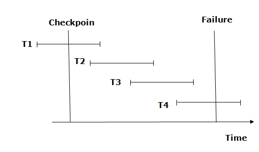
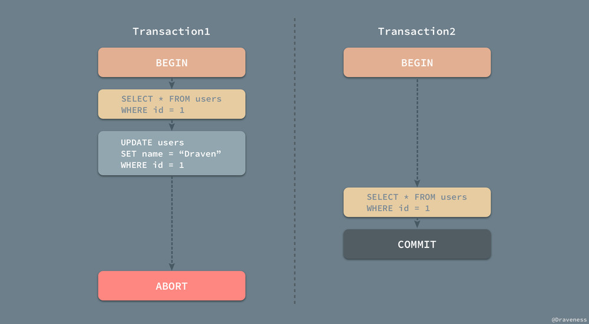
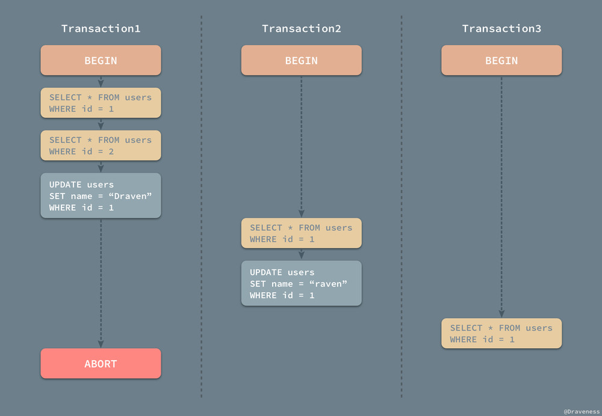
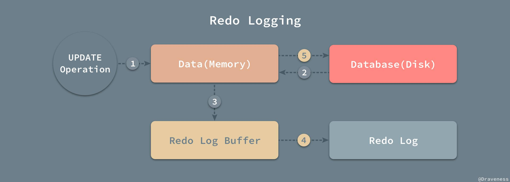

# 『浅入深出』MySQL 中事务的实现

- Atomicity
- Consistency
- Isolation
- Durability

## 总结

>InnoDB 存储行的结构

对于无主键的表，InnoDB 会为每一行生成一个隐藏的主键，同时还会有隐藏的 transaction-id 用于 mvcc，也会有一个指针，指向历史版本用于回滚。 

>什么是 undo log

undo log 可以用于实现原子性。

在一个事务中，假设我们执行了一个 `update`, `insert`，`delete` 之类的语句，那么假设在我们需要进行事务回滚的时候，我们可以通过这个 undo log 将状态返回到这个语句执行之前，undo log 的使用如下：

1. client 发起一次修改操作
2. storage engine 针对修改操作生成相应的 undo log，**并持久化**
3. storage engine 执行修改操作
4. 事务commit -> 删除 undo log；
5. 事务rollback -> 根据 undo log 还原数据。

>什么是 redo log

redo log 是用于确保持久性的。

在一个事务中，当我们执行一个修改语句时，我们需要确保这个语句一定被成功的写入到硬盘。

1. client 发起一个修改操作；
2. storage engine 生成 redo log，并且将 redo log **持久化**
3. storage engine 执行修改操作；
4. 事务 commit -> 删除 redo log
5. 事务 rollback -> 无需操作

`redo log` 和 `undo log` 可以结合起来使用，假设我们在一次 transaction 中机器重启了。那么这个时候我们可以选择 **继续执行事务** 或者 **将事务回滚**。

如果选择继续执行事务，那么该事务执行成功。可以给用户返回执行成功。如果选择回滚事务，那么该事务执行失败，并且所有的状态都已经回滚到事务开始之前。

>什么是 checkpoint

如果数据库访问量很大，日志量也很大，那么当 recovery system 执行试图宕机恢复的性能会非常差，这个时候我们需要通过 checkpoint 来优化它。

简单的理解一下就是，checkpoint 实际上是一个滑动窗口。对于每一个事务我们都可以分为 `[Ti-start, Ti-commit]`，这个对应于我们的事务中的 `begin` 和 `commit`，那么对于如下的事务：

```sql
begin;
select * from transaction;
update transaction set value = '10' where id = 1;
commit;
```

在 recovery system 执行 recovery 的时候，如果我们看到一个事务的 [Ti-start, Ti-commit] 或者 [, Ti-commit] 被包含在 [checkpoint, failure] 的滑动窗口中时，我们将他添加到 redo-list 中。

如果 [Ti-start, ] 被包含在 [checkpoint, failure] 的滑动窗口中时，我们将他添加到 undo-list 中。

>什么是 Nonrecoverable Transaction 和 Recoverable Transaction

简单来说，就是假设有两个并行执行的事务 T1 和 T2，T2 的执行依赖于 T1。

- 如果 T2 比 T1 先提交，那么 T2 就是 Nonrecoverable Transaction
- 如果 T1 比 T2 先提交，那么 T1 就是 Recoverable Transaction

| time | tx1                                | tx2                                |
|------|------------------------------------|------------------------------------|
| 1    | begin;                             | begin;                             |
| 2    | update transaction set value = 10; |                                    |
| 3    |                                    | update transaction set value = 20; |
| 4    |                                    | commit;                            |
| 5    | rollback;                          |                                    |

在上面的这种情况中，我们会发现 tx1 没办法正常回滚！**因为 <2> 这里生成的 undo log 可能会影响 tx2 的状态。**

也就是说，如果我们想要回滚 tx1 的话，我们需要同时也回滚 tx2，这种情况就叫级联回滚。

这个的避免也比较简单，我们的 tx1 将进行排它处理，并且阻塞 tx2 直到 tx1 提交。

>事务的四个隔离级别，以及 dirty read，repeatable read，phantom read

- dirty read 就是可能会读取到最终没有被写入到 mysql 的数据
- repeatable read 表示在一次事务中，读取到的数据前后完全一致
- phantom read 表示在事务中有可能在两次查询中查询到一个新的行

>什么是 mvcc？mvcc 引入了什么新的问题？

MVCC - multiple version concurrency control。

主要用于提供数据库的并发访问，并且提升性能。

实现原理是：对于数据库里的每一行，我们都会有一个 tx-id 以及时间戳来表示它的版本（tx-id 由 DB 保证自增），根据隔离级别的不同我们有不同的逻辑，以默认的 repeatable read 为例子：

| time | tx1                                | tx2                        |
|------|------------------------------------|----------------------------|
| 1    | begin;                             | begin;                     |
| 2    | select * from transaction;         | select * from transaction; |
| 3    | update transaction set value = 10; |                            |
| 4    |                                    | select * from transaction; |
| 5    | commit;                            |                            |
| 6    |                                    | select * from transaction; |
| 7    |                                    | commit;                    |

我们可以发现，在三次查询中，tx1 commit 前/后。查询的结果都是一致的。因为我们 tx2 的查询中，会对比当前事务对应的时间戳和数据库中的存在的几个版本的时间戳。

tx1 更新后的版本的时间戳大于 tx2 事务记录的时间戳，所以在 select 的时候没有使用 tx2 更新后的版本。

**但是同时，MVCC 也带来了一个问题：如何删除那些废弃的 version。**

## reference

- [『浅入深出』MySQL 中事务的实现](https://draveness.me/mysql-transaction/)
- [undo log与redo log原理分析](https://zhuanlan.zhihu.com/p/35574452)
- [MYSQL解密：INNODB存储引擎重做日志漫游](https://www.qiancheng.me/post/coding/mysql-001)
- [说说MySQL中的Redo log Undo log都在干啥](https://www.cnblogs.com/xinysu/p/6555082.html)
- [DBMS - Data Recovery](https://www.tutorialspoint.com/dbms/dbms_data_recovery.htm)

## 原子性

事务就是一系列的操作，要么全部都执行，要都不执行，这其实就是对事务原子性的刻画；

### 回滚日志(undo log) 和 重做日志(redo log)

假设数据库在操作时，按如下约定记录日志：

```
1. 事务开始时，记录START T
2. 事务修改时，记录（T，x，v），说明事务T操作对象x，x的值为v 
3. 事务结束时，记录COMMIT T 
```

#### undo log原理

**undo log是把所有没有COMMIT的事务回滚到事务开始前的状态，系统崩溃时，可能有些事务还没有COMMIT，在系统恢复时，这些没有COMMIT的事务就需要借助undo log来进行回滚。**

使用 undo 日志时要求：

```
1. 记录修改日志时，(T，x，v）中v为x修改前的值，这样才能借助这条日志来回滚；
2. 事务提交后，必须在事务的所有修改（包括记录的修改日志）都持久化后才能写COMMIT T日志；这样才能保证，宕机恢复时，已经COMMIT的事务的所有修改都已经持久化，不需要回滚。 
```

使用undo log时事务执行顺序

```
1. 记录START T 
2. 记录需要修改的记录的旧值（要求持久化）
3. 根据事务的需要更新数据库（要求持久化）
4. 记录COMMIT T 
```

使用undo log进行宕机回滚

```
1. 扫描日志，找出所有已经START,还没有COMMIT的事务。
2. 针对所有未COMMIT的日志，根据undo log来进行回滚。 
```

#### checkpoint

>Recovery with Concurrent Transactions
><br />
>When more than one transaction are being executed in parallel, the logs are interleaved. At the time of recovery, it would become hard for the recovery system to backtrack all logs, and then start recovering. To ease this situation, most modern DBMS use the concept of 'checkpoints'.

如果数据库访问很多，日志量也会很大，宕机恢复时，回滚的工作量也就很大，为了加快回滚，可以通过checkpoint机制来加速回滚。



- The recovery system reads log files from the end to start. It reads log files from T4 to T1.
- Recovery system maintains two lists, a **redo-list**, and an **undo-list**.
- The transaction is put into redo state if the recovery system sees a log with <Tn, Start> and <Tn, Commit> or just <Tn, Commit>. In the redo-list and their previous list, all the transactions are removed and then redone before saving their logs.
- **For example**: In the log file, transaction T2 and T3 will have <Tn, Start> and <Tn, Commit>. The T1 transaction will have only <Tn, commit> in the log file. That's why the transaction is committed after the checkpoint is crossed. Hence it puts T1, T2 and T3 transaction into redo list.
- The transaction is put into undo state if the recovery system sees a log with <Tn, Start> but no commit or abort log found. In the undo-list, all the transactions are undone, and their logs are removed.
- **For example**: Transaction T4 will have <Tn, Start>. So T4 will be put into undo list since this transaction is not yet complete and failed amid.

### undo log 和 redo log 的简化过程

假设数据库有如下表

| id | value |
|----|-------|
| a  | 1     |
| b  | 2     |

我们有如下 SQL 语句

```sql
begin;
update table set value = 3 where id = 'a';
update table set value = 4 where id = 'b';
commit;
```

1. 事务开始.
2. 记录A=1到undo log.
3. 修改A=3.
4. 记录A=3到redo log.
5. 记录B=2到undo log.
6. 修改B=4.
7. 记录B=4到redo log.
8. 将redo log写入磁盘。
9. 事务提交

**在遇到需要回滚的时候，我们可以根据前面提到的 checkpoint 的机制，来决定使用 redo 还是 undo。**

### 事务的状态

从宏观的角度上来讲，事务只有三个不同的状态：

- Active
- Commited
- Failed


但是从更细粒度来看，事务分为多种状态：


- Active：事务的初始状态，表示事务正在执行；
- Partially Commited：在最后一条语句执行之后；
- Failed：发现事务无法正常执行之后；
- Aborted：事务被回滚并且数据库恢复到了事务进行之前的状态之后；
- Commited：成功执行整个事务；

### 并行事务的原子性



当 Transaction1 在执行的过程中对 id = 1 的用户进行了读写，但是没有将修改的内容进行提交或者回滚，在这时 Transaction2 对同样的数据进行了读操作并提交了事务；也就是说 Transaction2 是依赖于 Transaction1 的，当 Transaction1 由于一些错误需要回滚时，因为要保证事务的原子性，需要对 Transaction2 进行回滚，但是由于我们已经提交了 Transaction2，所以我们已经没有办法进行回滚操作，在这种问题下我们就发生了问题，Database System Concepts 一书中将这种现象称为不可恢复安排（**Nonrecoverable Schedule**），那什么情况下是可以恢复的呢？

>A recoverable schedule is one where, for each pair of transactions Ti and Tj such that Tj reads a data item previously written by Ti , the commit operation of Ti appears before the commit operation of Tj .

简单来说，就是如下顺序是可以回滚的：

1. Ti 写入数据
2. Tj 读取 <1> 写入的数据
3. Ti commit
4. Tj commit

**简单理解一下，如果 Transaction2 依赖于事务 Transaction1，那么事务 Transaction1 必须在 Transaction2 提交之前完成提交的操作：**

然而这样还不算完，当事务的数量逐渐增多时，整个恢复流程也会变得越来越复杂，如果我们想要从事务发生的错误中恢复，也不是一件那么容易的事情。



在上图所示的一次事件中，Transaction2 依赖于 Transaction1，而 Transaction3 又依赖于 Transaction1，当 Transaction1 由于执行出现问题发生回滚时，为了保证事务的原子性，就会将 Transaction2 和 Transaction3 中的工作全部回滚，这种情况也叫做级联回滚（Cascading Rollback），级联回滚的发生会导致大量的工作需要撤回，是我们难以接受的，不过如果想要达到绝对的原子性，这件事情又是不得不去处理的，我们会在文章的后面具体介绍如何处理并行事务的原子性。

## 持久性

当事务已经被提交之后，就无法再次回滚了，唯一能够撤回已经提交的事务的方式就是创建一个相反的事务对原操作进行『补偿』，这也是事务持久性的体现之一。


### 重做日志

重做日志由两部分组成，一是内存中的重做日志缓冲区，因为重做日志缓冲区在内存中，所以它是易失的，另一个就是在磁盘上的重做日志文件，它是持久的。



1. 启动一个 update 操作；
2. 从硬盘中读取 old value 到内存；
3. 将 old value 存入 buffer
4. buffer 写入硬盘，这个时候 undo log 已经写入硬盘
5. 开始 update 操作，如果 update 操作失败，则可以通过 undo log 进行回滚。

## 隔离性

### 事务的隔离级别

- RAED UNCOMMITED	可能会产生脏读
- READ COMMITED		可能会产生 nonrepeatable read
- Repeatable Read	可能会产生幻读
- Serializable		以上都不可能

#### dirty read

```sql
drop table if exists transaction;
create table transaction (id bigint, value varchar(10));
insert into `transaction`(id, value) values(1, '1')
```

| 时刻 | 事务1                                                     | 事务2                                                     |
|------|-----------------------------------------------------------|-----------------------------------------------------------|
| 1    | SET SESSION TRANSACTION ISOLATION LEVEL READ UNCOMMITTED; | SET SESSION TRANSACTION ISOLATION LEVEL READ UNCOMMITTED; |
| 2    | select * from `transaction`;                              | select * from `transaction` ;                             |
| 3    | update `transaction` set value = 5000;                    |                                                           |
| 4    |                                                           | select * from `transaction`;                              |
| 5    | rollback;                                                 |                                                           |
| 6    |                                                           | select * from `transaction`;                              |

在 `4` 我们会产生脏读，读到了一个最终没有被写入到 mysql 的值。

#### nonrepeatable read

```sql
drop table if exists transaction;
create table transaction (id bigint, value varchar(10));
insert into `transaction`(id, value) values(1, '1')
```

| 时刻 | 事务1                                                   | 事务2                                                   |
|------|---------------------------------------------------------|---------------------------------------------------------|
| 1    | SET SESSION TRANSACTION ISOLATION LEVEL READ COMMITTED; | SET SESSION TRANSACTION ISOLATION LEVEL READ COMMITTED; |
| 2    | begin;                                                  | begin                                                   |
| 3    | select * from `transaction` ;                           | select * from `transaction` ;                           |
| 4    | update `transaction` set value = 5000;                  |                                                         |
| 5    |                                                         | select * from `transaction` ;                           |
| 6    | commit;                                                 |                                                         |
| 7    |                                                         | select * from `transaction` ;                           |

- 在 `5` 我们发现读取到的值仍然是 1，而不是 5000；
- 在 `7` 我们发现读到的值是 5000

也就是说，对于同一个查询语句我们可能会在一个事务中读取到两个不同的值

#### repeatable read

```sql
drop table if exists transaction;
create table transaction (id bigint, value varchar(10));
insert into `transaction`(id, value) values(1, '1')
```

| 时刻 | 事务1                                                   | 事务2                                                   |
|------|---------------------------------------------------------|---------------------------------------------------------|
| 1    | SET SESSION TRANSACTION ISOLATION LEVEL READ COMMITTED; | SET SESSION TRANSACTION ISOLATION LEVEL READ COMMITTED; |
| 2    | begin;                                                  | begin                                                   |
| 3    | select * from `transaction` ;                           | select * from `transaction` ;                           |
| 4    | update `transaction` set value = 5000;                  |                                                         |
| 5    |                                                         | select * from `transaction` ;                           |
| 6    | commit;                                                 |                                                         |
| 7    |                                                         | select * from `transaction` ;                           |
| 8    |                                                         | commit                                                  |
| 9    |                                                         | select * from `transaction` ;                           |

可以看到，在我们的 `5`, `7`, `9` 三次查询中是完全一致的。

#### phantom read

```sql
drop table if exists transaction;
create table transaction (id bigint, value varchar(10));
insert into `transaction`(id, value) values(1, '1')
```

| 时刻 | 事务1                                                   | 事务2                                                   |
|------|---------------------------------------------------------|---------------------------------------------------------|
| 1    | SET SESSION TRANSACTION ISOLATION LEVEL READ COMMITTED; | SET SESSION TRANSACTION ISOLATION LEVEL READ COMMITTED; |
| 2    | begin;                                                  | begin                                                   |
| 3    | select * from `transaction` ;                           | select * from `transaction` ;                           |
| 4    | insert into `transaction`(id, value) values(2, '2');    |                                                         |
| 5    |                                                         | select * from `transaction` ;                           |
| 6    | commit;                                                 |                                                         |
| 7    |                                                         | select * from `transaction` ;                           |
| 8    |                                                         | update `transaction` set value = 5000 where id = 2;     |
| 9    |                                                         | select * from `transaction` ;                           |

可以看到，在 `5`, `7` 两次查询，我们都查询到了我们想要的结果。但是当我们执行一次 update 语句时，却发现可以更新一个不存在的记录。并且再次查询的时候能查询到这条记录

### 隔离级别的实现

事务的隔离是通过三个方式实现的：

- 锁
- CAS，这个就是所谓的乐观锁。
- MVCC

锁和 CAS 都比较简单，这里只记录一下 MVVC

[CAS原理](https://www.jianshu.com/p/ab2c8fce878b)

### MVCC

Multiversion concurrency control (MCC or MVCC), is a concurrency control method commonly used by database management systems to provide concurrent access to the database and in programming languages to implement transactional memory.[1]

#### Description

Without concurrency control, if someone is reading from a database at the same time as someone else is writing to it, it is possible that the reader will see a half-written or inconsistent piece of data. For instance, when making a wire transfer between two bank accounts if a reader reads the balance at the bank when the money has been withdrawn from the original account and before it was deposited in the destination account, it would seem that money has disappeared from the bank. Isolation is the property that provides guarantees in the concurrent accesses to data. Isolation is implemented by means of a concurrency control protocol. The simplest way is to make all readers wait until the writer is done, which is known as a read-write lock. **Locks are known to create contention especially between long read transactions and update transactions. MVCC aims at solving the problem by keeping multiple copies of each data item**. 

In this way, **each user connected to the database sees a snapshot of the database at a particular instant in time**. Any changes made by a writer will not be seen by other users of the database until the changes have been completed (or, in database terms: until the transaction has been committed.)

**When an MVCC database needs to update a piece of data, it will not overwrite the original data item with new data, but instead creates a newer version of the data item.** Thus there are multiple versions stored. The version that each transaction sees depends on the isolation level implemented. The most common isolation level implemented with MVCC is snapshot isolation. With snapshot isolation, a transaction observes a state of the data as when the transaction started.

**MVCC introduces the challenge of how to remove versions that become obsolete and will never be read.** In some cases, a process to periodically sweep through and delete the obsolete versions is implemented. This is often a stop-the-world process that traverses a whole table and rewrites it with the last version of each data item. PostgreSQL adopts this approach with its VACUUM process. Other databases split the storage blocks into two parts: the data part and an undo log. The data part always keeps the last committed version. The undo log enables the recreation of older versions of data. The main inherent limitation of this latter approach is that when there are update-intensive workloads, the undo log part runs out of space and then transactions are aborted as they cannot be given their snapshot. For a document-oriented database it also allows the system to optimize documents by writing entire documents onto contiguous sections of disk—when updated, the entire document can be re-written rather than bits and pieces cut out or maintained in a linked, non-contiguous database structure.

#### Implementation

MVCC uses timestamps (TS), and incrementing transaction IDs, to achieve transactional consistency. MVCC ensures a transaction (T) never has to wait to Read a database object (P) by maintaining several versions of the object. 

**Each version of object P has both a Read Timestamp (RTS) and a Write Timestamp (WTS) which lets a particular transaction Ti read the most recent version of the object which precedes the transaction's Read Timestamp RTS(Ti).**

#### InnoDB MVCC 实现原理


