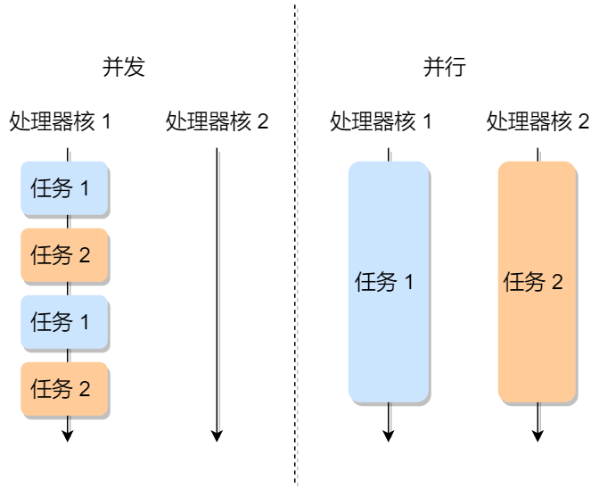

# 进程，线程，协程

## 参考

- [Thread context switch Vs. process context switch](https://stackoverflow.com/questions/5440128/thread-context-switch-vs-process-context-switch)
- [一文让你明白CPU上下文切换](https://zhuanlan.zhihu.com/p/52845869)
- [进程、线程及其内存模型](https://buptjz.github.io/2014/04/23/processAndThreads)
- [Difference between Process and Thread](https://www.geeksforgeeks.org/difference-between-process-and-thread/)
- [进程、线程基础知识全家桶，30 张图一套带走](https://www.cnblogs.com/xiaolincoding/p/13289992.html)
- [多进程与多线程的深度比较](http://www.embeddedlinux.org.cn/html/xianchengjincheng/201201/26-1957.html)
- [Introduction of Process Management](https://www.geeksforgeeks.org/introduction-of-process-management/)

## 一文让你明白CPU上下文切换

### 什么是 CPU 上下文

**注意，这里讨论的是 `CPU context` 而不是 `process context`**

CPU 寄存器和程序计数器就是 CPU 上下文，因为它们都是 CPU 在运行任何任务前，必须的依赖环境。

### CPU 上下文切换的类型

1. 进程上下文切换
2. 线程上下文切换
3. 中断上下文切换

### 系统调用

从用户态到内核态的转变，需要通过系统调用来完成。CPU 的上下文切换是：

1. 保存 CPU 寄存器里原来用户态的指令位
2. 为了执行内核态代码，CPU 寄存器需要更新为内核态指令的新位置。
3. 跳转到内核态运行内核任务
4. 当系统调用结束后，CPU 寄存器需要恢复原来保存的用户态，然后再切换到用户空间，继续运行进程。

所以， **一次系统调用的过程，其实是发生了两次 CPU 上下文切换**。 （用户态-内核态-用户态）

不过，需要注意的是，**系统调用过程中，并不会涉及到虚拟内存等进程用户态的资源，也不会切换进程**。这跟我们通常所说的进程上下文切换是不一样的：**进程上下文切换，是指从一个进程切换到另一个进程运行；而系统调用过程中一直是同一个进程在运行。**

所以，**系统调用过程通常称为特权模式切换，而不是上下文切换**。系统调用属于同进程内的 CPU 上下文切换。但实际上，系统调用过程中，CPU 的上下文切换还是无法避免的。

### 进程上下文切换跟系统调用又有什么区别呢

>首先， **进程是由内核来管理和调度的，进程的切换只能发生在内核态**。 所以，`进程的上下文不仅包括了虚拟内存、栈、全局变量等用户空间的资源，还包括了内核堆栈、寄存器等内核空间的状态。`

因此，**进程的上下文切换就比系统调用时多了一步**：在保存内核态资源（当前进程的内核状态和 CPU 寄存器）之前，需要先把该进程的用户态资源（虚拟内存、栈等）保存下来；而加载了下一进程的内核态后，还需要刷新进程的虚拟内存和用户栈。

### 线程上下文切换

`线程是调度的基本单位，而进程则是资源拥有的基本单位`：说白了，所谓内核中的任务调度，实际上的调度对象是线程；而进程只是给线程提供了虚拟内存、全局变量等资源。

- 当进程只有一个线程时，可以认为进程就等于线程。
- 当进程拥有多个线程时，这些线程会共享相同的虚拟内存和全局变量等资源。这些资源在上下文切换时是不需要修改的
- 另外，线程也有自己的私有数据，比如栈和寄存器等，这些在上下文切换时也是需要保存的。

### 进程线程对比

| 维度           | 多进程                                    | 多线程                                     |
|----------------|-------------------------------------------|--------------------------------------------|
| 数据共享、同步 | 数据是分开的:共享复杂，需要用IPC;同步简单 | 多线程共享进程数据：`共享简单`；`同步复杂` |
| 内存、CPU      | 占用内存多，切换复杂，CPU利用率低         | 占用内存少，切换简单，CPU利用率高          |
| 创建销毁、切换 | 创建销毁、切换复杂，速度慢                | 创建销毁、切换简单，速度快                 |
| 编程调试       | 编程简单，调试简单                        | 编程复杂，调试复杂                         |
| 可靠性         | 进程间不会相互影响                        | 一个线程挂掉将导致整个进程挂掉             |

### 进程地址空间

每个程序都能看到一片完整连续的地址空间，这些空间并没有直接关联到物理内存，而是操作系统提供了内存的一种抽象概念，使得每个进程都有一个连续完整的地址空间，在程序的运行过程，再完成虚拟地址到物理地址的转换。我们同样知道，进程的地址空间是分段的，存在所谓的数据段，代码段，bbs段，堆，栈等等

1. 从0xc000000000到0xFFFFFFFF共1G的大小是内核地址空间（后面再探讨内核地址空间，先重点关注用户地址空间），余下的低地址3G空间则是用户地址空间。
2. Code VMA: 即程序的代码段，CPU执行的机器指令部分。通常，这一段是可以共享的，即多线程共享进程的代码段。并且，此段是只读的，不能修改。
3. Data VMA: 即程序的数据段，包含ELF文件在中的data段和bss段。
4. 堆和栈
5. 共享库和mmap内容映射区：位于栈和堆之间，例如程序使用的printf，函数共享库printf.o固定在某个物理内存位置上，让许多进程映射共享。mmap是一个系统函数，可以把磁盘文件的一部分直接映射到内存，这样文件中的位置直接就有对应的内存地址。此处参考后面的第三条。

### 换页机制

```
if(数据在物理内存中)
{
    虚拟地址转换成物理地址
    读数据
}
else
{
    if(数据在磁盘中)
    {
        if(物理内存还有空闲)
        {
            把数据从磁盘中读到物理内存
            虚拟地址转换成物理地址
            读数据
        }
        else
        {
            把物理内存中某页的数据存入磁盘
            把要读的数据从磁盘读到该页的物理内存中
            虚拟地址转换成物理地址
            读数据
        }
    }
    else
    {
        报错
    }
}
```

### 多线程共享的以及不共享的

>一个进程空间里同时运行多个线程的程序。每个线程有自己的线程上下文，其中包括

1. 唯一的线程ID，TID；
2. `栈`
3. 栈指针
4. 程序计数器
5. 通用目的寄存器
6. 条件码

>所有运行在一个进程内的线程共享该进程的整个虚拟地址空间，包括：

1. 代码段
2. 数据段
3. 堆
4. 共享库
5. 打开的文件

### Thread context switch VS process context switch

The main distinction between a thread switch and a process switch is that during a thread switch, the virtual memory space remains the same, while it does not during a process switch. Both types involve handing control over to the operating system kernel to perform the context switch. The process of switching in and out of the OS kernel along with the cost of switching out the registers is the largest fixed cost of performing a context switch.

A more fuzzy cost is that a context switch messes with the processors cacheing mechanisms. Basically, when you context switch, all of the memory addresses that the processor "remembers" in its cache effectively become useless. The one big distinction here is that when you change virtual memory spaces, the processor's Translation Lookaside Buffer (TLB) or equivalent gets flushed making memory accesses much more expensive for a while. This does not happen during a thread switch.

## Difference between Process and Thread

### Process

Process means any program is in execution. Process control block controls the operation of any process. Process control block contains information about processes for example Process priority, process id, process state, CPU, register, etc. A process can creates other processes which are known as Child Processes. Process takes more time to terminate and **it is isolated means it does not share memory with any other process.**

### Thread

Thread is the segment of a process means a process can have multiple threads and these multiple threads are contained within a process. A thread have 3 states: running, ready, and blocked.

### Difference between Process and Thread:

| Process                                               | Thread                                                                                             |
|-------------------------------------------------------|----------------------------------------------------------------------------------------------------|
| Process is less efficient in term of communication.   | Thread is more efficient in term of communication.                                                 |
| Process is isolated.                                  | Threads share memory.                                                                              |
| Process switching uses interface in operating system. | Thread switching does not require to call a operating system and cause an interrupt to the kernel. |

## 并发和并行有什么区别？


