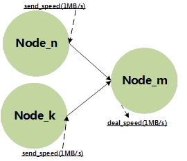
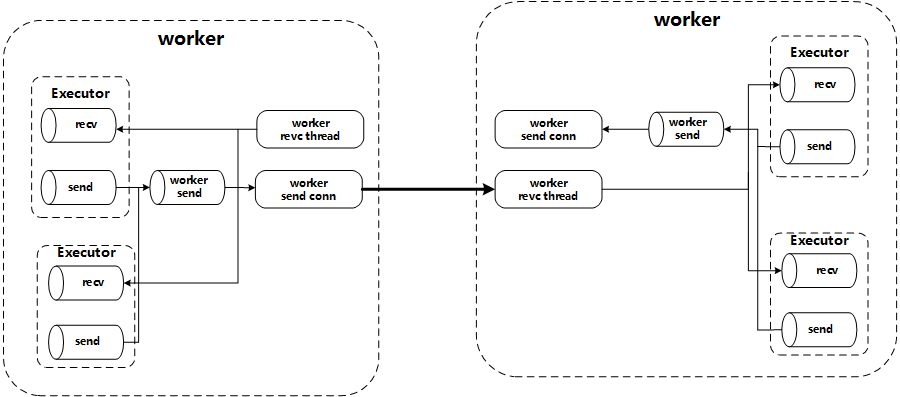
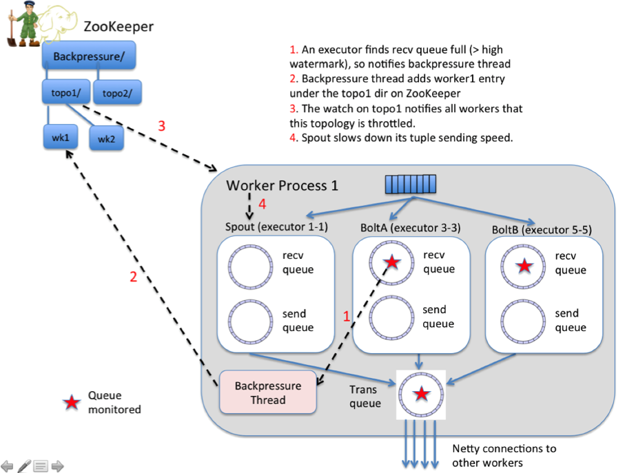

# Storm & Flink反压机制分析

## reference

[Understanding the Internal Message Buffers of Storm](https://www.michael-noll.com/blog/2013/06/21/understanding-storm-internal-message-buffers/)

## storm

### ret

1. `Intra-worker` communication in Storm (inter-thread on the same Storm node): `LMAX Disruptor`
2. `Inter-worker` communication (node-to-node across the network): `ZeroMQ or Netty`
3. Inter-topology communication: nothing built into Storm, you must take care of this yourself with e.g. a messaging system such as Kafka/RabbitMQ, a database, etc.

### Illustration

Let us start with a picture before we discuss the nitty-gritty details in the next section.

Figure 1: Overview of a worker's internal message queues in Storm. **Queues related to a worker process are colored in red, queues related to the worker's various executor threads are colored in green**. For readability reasons I show only one worker process (though normally a single Storm node runs multiple such processes) and only one executor thread within that worker process (of which, again, there are usually many per worker process).

### Detailed description

#### Worker processes

1. To manage its incoming and outgoing messages each worker process has a single receive thread that listens on the worker’s TCP port
2. each worker has a single send thread that is responsible for reading messages from the worker’s transfer queue and sending them over the network to downstream consumers. 

#### Executors

Each worker process controls one or more executor threads. **Each executor thread has its own `incoming queue` and `outgoing queue`. **

## content

Storm是2011年开源的分布式流失流式处理系统，这个系统在最初的时候是没有反压机制。也许是在Nathan Marz大神的眼中，这不应该是问题，本人深深折服于Storm代码精简高效。但是像我这样的凡人们就没法做到了，于是反压的问题就产生了。世界上还是凡人多，所以Storm后面还是加上了反压机制。而Flink作为后来者，则对这方面做了思考，设计的也很是简洁有效。

在对比两者之间的反压机制前，首先对于反压进行一下解释。对于一个分布式计算系统来说，反压产生的原因非常简单，对于一个如下图1所示的计算关系中，Node_m的处理能力要低于它的接收速度，那么它就要将这个能力不匹配的问题告知它的上游节点(Node_n, Node_k)或者更上游的节点，这就是反压过程。由此可知，反压过程就是一个负反馈的过程(懂模电的应该知道这个名词)。由此图可知，如果系统没有反压，Node_m可能会被冲垮，或者消息丢失。在对比两种反压机制之前，我们首先来分析一下这两个系统数据传输的过程。

Storm的worker间的数据传输结构如下图2所示。在Storm内部，各个计算单元以Executor运行。多个Executor运行在一个Worker中，所以当一个Executor输出数据时，会先将数据写入Executor内部Send Disruptor Queue,然后会有内部转移线程将其统一写入Worker的发送DisruptorQueue中。然后内部后发送送线程会下游的worker建立连接，然后把数据发送到下游的worker中。如下图2所示，recv thread主动监听端口，等待上游的worker来连接，而上游的worker的send thread则主动的连接下游的worker。由此可知， **Storm内部的数据发送模式是一个Push的模式。**

然后我们分析Storm内部的反压是怎么做的。下图3是Storm反压机制的示意图，在图中详细的标明了Storm反压的工作步骤。首先是下游Bolt的recv queue在出现高水位时触发内部的反压线程向ZooKeeper上写入一个反压产生的通知事件，然后所有的Spout节点监听了该事件，所有的Spout减慢(实际是停止)其数据的发送过程。Storm为什么会这样去实现其反压机制？ 个人以为这样做的原因与它内部的数据的传输原理有关。如图2和图3所示，如果executor的send queue中数据堆积满后，在次写入的语义是丢弃数据，这里丢弃的数据会需要依靠ack机制在Spout端重发。所以这样来分析，当被压产生时，不如在Spout端停止发送。个人以为这样做的原因与它内部的数据的传输原理有关。如图2和图3所示，如果executor的send queue中数据堆积满后，在次写入的语义是丢弃数据，这里丢弃的数据会需要依靠ack机制在Spout端重发。所以这样来分析，当被压产生时，不如在Spout端停止发送。

对比Storm与Flink的反压实现过程。发现两者在反压的探测都放在了高压力节点的输入端，这是因为这是最先感知到压力的地方。但是两者在探测到了压力的后采取的措施就有所不同。Storm的策略是关闭源头的输入，让这个应用中的数据都流干净后，在开始继续消费。但是这样的反压机制有点过于简单粗暴，当被压产生时，Spout端停止发送，此时产生被压的节点与Spout间的节点还有大量数据，此时产生的停顿时间必然比较长，势必影响系统吞吐。然后当节点恢复时，整个topology内部，可以说时在空转中，然后会产生很强的消费能力，此时会形成一个消费浪涌，在流式处理过程中，这种震荡一定会影响系统的性能，同时也会对上下游系统带来不必要的压力。而Flink的处理策略是将压力渐渐的逐级向上传递，直到最后在Source端停止消费。这样做的好处是系统不会出现在Storm中的震荡。坏处是会在应用中会积压很多的数据，当没用开启CheckPoint时，数据丢失会比较严重。
