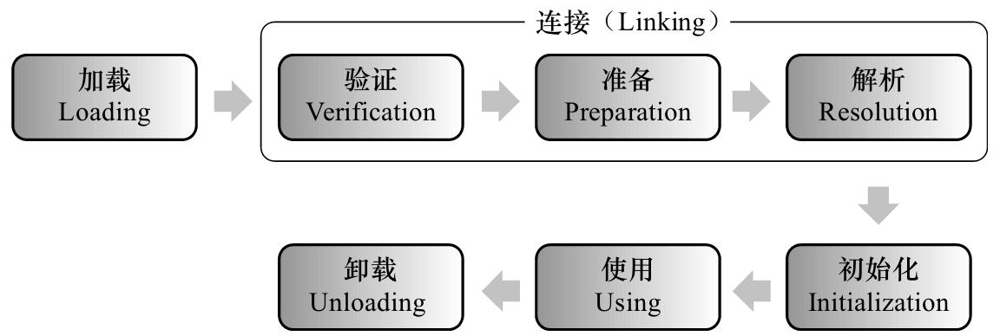

# Java 类加载器

- [类文件结构](https://github.com/doocs/jvm/blob/main/docs/07-class-structure.md)
- [类加载的时机](https://github.com/doocs/jvm/blob/main/docs/08-load-class-time.md)
- [类加载的过程](https://github.com/doocs/jvm/blob/main/docs/09-load-class-process.md)
- [类加载器](https://github.com/doocs/jvm/blob/main/docs/10-class-loader.md)
- [Java中的类加载器](https://blog.csdn.net/zhangjg_blog/article/details/16102131)

## 类文件结构

一个 `.class` 文件，我们可以用它他来判断他是否是某一个类，也可以用它来实例化一个类。

那么换句话说，**我们需要实例化一个对象的所有信息都必须存放在 `.class` 文件中。**

例如：类全限定名，类中所有的常量，父类和实现的接口，字段表和方法表等。

### Class 文件结构

- magic num
- 版本信息
- 常量池
- 访问标志
- 类索引、父类索引、接口索引集合
- 字段表集合
- 方法表集合
- 属性表集合

#### 常量池

版本信息之后就是常量池，常量池中存放两种类型的常量：

1. 字面值常量，字面值常量就是我们在程序中定义的字符串、被 final 修饰的值。
2. 符号引用，符号引用就是我们定义的各种名字：类和接口的全限定名、字段的名字和描述符、方法的名字和描述符。

#### 访问标志

在常量池结束之后，紧接着的两个字节代表访问标志，这个标志用于识别一些类或者接口层次的访问信息，包括：这个 Class 是类还是接口；是否定义为 public 类型；是否被 abstract/final 修饰。

#### 类索引、父类索引、接口索引集合

Class 文件中由这三项数据来确定类的继承关系。类索引用于确定这个类的全限定名，父类索引用于确定这个类的父类的全限定名。

由于 Java 不允许多重继承，所以父类索引只有一个，除了 java.lang.Object 之外，所有的 Java 类都有父类，因此除了 java.lang.Object 外，所有 Java 类的父类索引都不为 0。一个类可能实现了多个接口，因此用接口索引集合来描述。

#### 字段表集合

**字段表集合存储本类涉及到的 `成员变量`**，包括实例变量和类变量，但不包括方法中的局部变量。

>**字段表集合中不会出现从父类（或接口）中继承而来的字段**，**但有可能出现原本 Java 代码中不存在的字段**，譬如在内部类中为了保持对外部类的访问性，会自动添加指向外部类实例的字段。

#### 方法表集合

方法表结构与属性表类似。

volatile 关键字 和 transient 关键字不能修饰方法，所以方法表的访问标志中没有 ACC_VOLATILE 和 ACC_TRANSIENT 标志。

方法表的属性表集合中有一张 Code 属性表，用于存储当前方法经编译器编译后的字节码指令。

#### 属性表集合

## 类加载的时机



加载、验证、准备、初始化和卸载这 5 个阶段的顺序是确定的，类的加载过程必须按照这种顺序按部就班地开始（注意是“开始”，而不是“进行”或“完成”）， **而解析阶段则不一定：它在某些情况下可以在初始化后再开始，这是为了支持 Java 语言的运行时绑定。**

## 类加载的过程

### 加载

“加载”是“类加载”过程的一个阶段，不能混淆这两个名词。 **加载阶段主要是为了将 `.class` 文件加载到内存中。**

#### 加载的过程

在加载阶段，虚拟机需要完成 3 件事：

- 通过类的全限定名获取该类的二进制字节流。
- 将二进制字节流所代表的静态结构转化为方法区的运行时数据结构。
- 在内存中创建一个代表该类的 java.lang.Class 对象，作为方法区这个类的各种数据的访问入口。

### 验证

验证阶段确保 Class 文件的字节流中包含的信息符合当前虚拟机的要求，并且不会危害虚拟机自身的安全。

### `准备`

准备阶段是正式为类变量（或称“静态成员变量”） **分配内存** 并 **设置初始值** 的阶段。这些变量（不包括实例变量）所使用的内存都在方法区中进行分配。

初始值“通常情况下”是数据类型的零值（0, null...），假设一个类变量的定义为：

```java
public static int value = 123;
```

那么变量 value 在准备阶段过后的初始值为 0 而不是 123，因为这时候尚未开始执行任何 Java 方法。

存在“特殊情况”：如果类字段的字段属性表中存在 ConstantValue 属性，那么在准备阶段 value 就会被初始化为 ConstantValue 属性所指定的值，假设上面类变量 value 的定义变为：

```java
public static final int value = 123;
```

那么在准备阶段虚拟机会根据 ConstantValue 的设置将 value 赋值为 123。

### 解析

**解析阶段是虚拟机将常量池内的符号引用替换为直接引用的过程。**

### 初始化

类初始化阶段是类加载过程的最后一步，是执行类构造器 `<clinit>()` 方法的过程。

`<clinit>()` 方法是由编译器自动收集类中的所有类变量的赋值动作和静态语句块（static {} 块）中的语句合并产生的，编译器收集的顺序是由语句在源文件中出现的顺序所决定的。

```java
public class TestStatic {

    static {
        num = 10;
//        Illegal forward reference
//        System.out.println(num);
    }

    private static int num = 0;

    public static void main(String[] args) {
        System.out.println(TestStatic.num );
        // 0
    }

}

```

## 类加载器

### 类与类加载器

#### 判断类是否“相等”

任意一个类，都 **由加载它的类加载器和这个类本身一同确立其在 Java 虚拟机中的唯一性** ，每一个类加载器，都有一个独立的类名称空间。

#### 加载器种类

`系统` 提供了 3 种类加载器：

- 启动类加载器（Bootstrap ClassLoader）： 负责将存放在 `<JAVA_HOME>\lib` 目录中的，并且能被虚拟机识别的（仅按照文件名识别，如 rt.jar，名字不符合的类库即使放在 lib 目录中也不会被加载）类库加载到虚拟机内存中。
- 扩展类加载器（Extension ClassLoader）： 负责加载 `<JAVA_HOME>\lib\ext` 目录中的所有类库，开发者可以直接使用扩展类加载器。
- 应用程序类加载器（Application ClassLoader）： 由于这个类加载器是 ClassLoader 中的 getSystemClassLoader() 方法的返回值，所以一般也称它为“系统类加载器”。它负责加载用户类路径（classpath）上所指定的类库，开发者可以直接使用这个类加载器，如果应用程序中没有自定义过自己的类加载器，一般情况下这个就是程序中默认的类加载器。


### 双亲委派模型

双亲委派模型是描述类加载器之间的层次关系。 **它要求除了顶层的启动类加载器外，其余的类加载器都应当有自己的父类加载器**。（父子关系一般不会以继承的关系实现，而是以组合关系来复用父加载器的代码）

#### 工作过程

如果一个类加载器收到了类加载的请求，它首先不会自己去尝试加载这个类，而是把这个请求委派给父类加载器去完成，每一个层次的类加载器都是如此，因此所有的加载请求最终都应该传送到顶层的启动类加载器中，只有当父加载器反馈自己无法完成这个加载请求（找不到所需的类）时，子加载器才会尝试自己去加载。

在 java.lang.ClassLoader 中的 loadClass() 方法中实现该过程。

#### 为什么使用双亲委派模型

像 `java.lang.Object` 这些存放在 `rt.jar` 中的类， **无论使用哪个类加载器加载，最终都会委派给最顶端的启动类加载器加载，从而使得不同加载器加载的 Object 类都是同一个。**

相反，如果没有使用双亲委派模型，由各个类加载器自行去加载的话，如果用户自己编写了一个称为 java.lang.Object 的类，并放在 classpath 下，那么系统将会出现多个不同的 Object 类，Java 类型体系中最基础的行为也就无法保证。

## Java中的类加载器

### 类加载器的三个特性

类加载器有三个特性，分别为 **委派** ， **可见性和单一性**，其他文章上对这三个特性的介绍如下：

- 委托机制是指将加载一个类的请求交给父类加载器，如果这个父类加载器不能够找到或者加载这个类，那么再加载它。
- 可见性的原理是子类的加载器可以看见所有的父类加载器加载的类，而父类加载器看不到子类加载器加载的类。
- 单一性原理是指仅加载一个类一次，这是由委托机制确保子类加载器不会再次加载父类加载器加载过的类。

### 系统类加载器和线程上下文类加载器

```java
public class TestClassLoader {

    public static void main(String[] args) {
		// 线程类加载器
        ClassLoader threadClassLoader = Thread.currentThread().getContextClassLoader();
        ClassLoader classClassLoader = TestClassLoader.class.getClassLoader();
		// 系统类加载器
        ClassLoader systemClassLoader = ClassLoader.getSystemClassLoader();

        System.out.println(threadClassLoader);
        System.out.println(classClassLoader);
        System.out.println(systemClassLoader);

        assert threadClassLoader == classClassLoader;
        assert classClassLoader == systemClassLoader;
    }

}

```

每个 `线程` **都会有一个上下文类加载器** ,由于在线程执行时加载用到的类,默认情况下是父线程的上下文类加载器, 也就是AppClassLoader。
