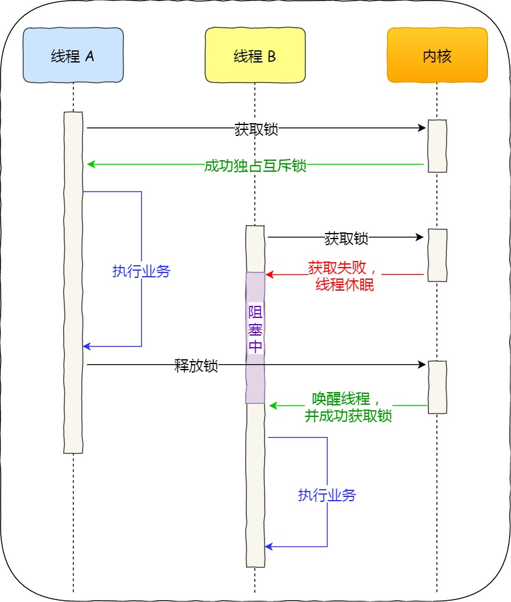
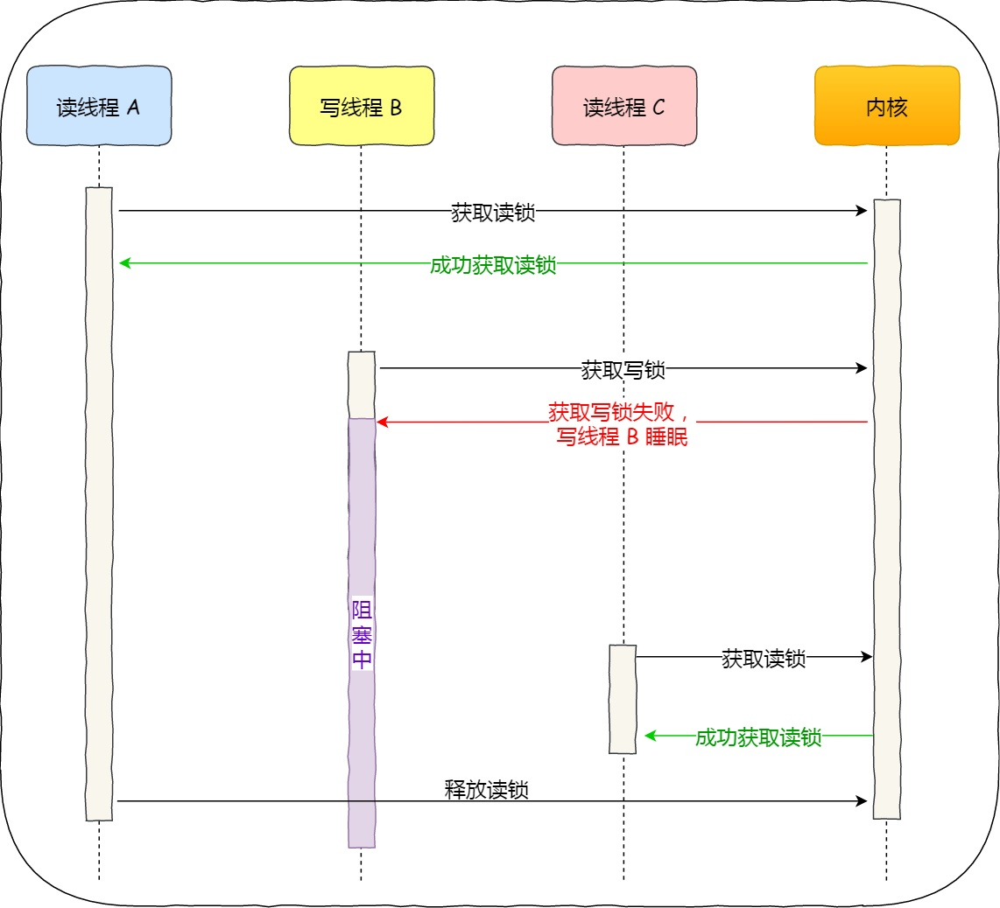
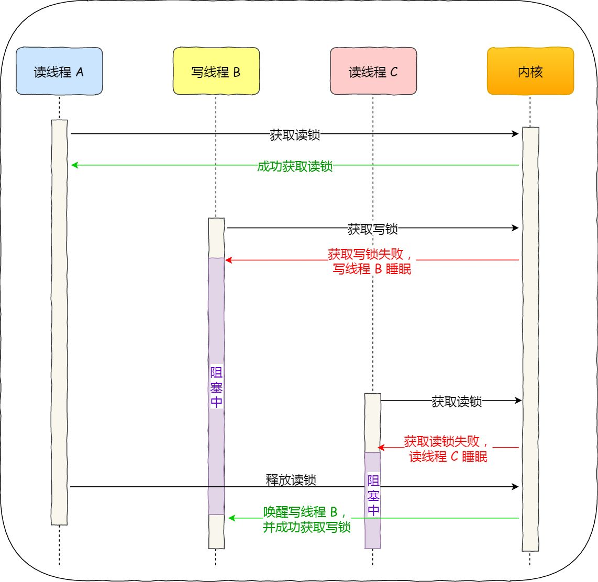

# 锁

## reference

- [Lifecycle and States of a Thread in Java](https://www.geeksforgeeks.org/lifecycle-and-states-of-a-thread-in-java/)
- [Java线程的6种状态及切换](https://blog.csdn.net/pange1991/article/details/53860651)

## Lifecycle and States of a Thread in Java


```java
    public enum State {
        /**
         * Thread state for a thread which has not yet started.
         */
        NEW,

        /**
         * Thread state for a runnable thread.  A thread in the runnable
         * state is executing in the Java virtual machine but it may
         * be waiting for other resources from the operating system
         * such as processor.
         */
        RUNNABLE,

        /**
         * Thread state for a thread blocked waiting for a monitor lock.
         * A thread in the blocked state is waiting for a monitor lock
         * to enter a synchronized block/method or
         * reenter a synchronized block/method after calling
         * {@link Object#wait() Object.wait}.
         */
        BLOCKED,

        /**
         * Thread state for a waiting thread.
         * A thread is in the waiting state due to calling one of the
         * following methods:
         * <ul>
         *   <li>{@link Object#wait() Object.wait} with no timeout</li>
         *   <li>{@link #join() Thread.join} with no timeout</li>
         *   <li>{@link LockSupport#park() LockSupport.park}</li>
         * </ul>
         *
         * <p>A thread in the waiting state is waiting for another thread to
         * perform a particular action.
         *
         * For example, a thread that has called <tt>Object.wait()</tt>
         * on an object is waiting for another thread to call
         * <tt>Object.notify()</tt> or <tt>Object.notifyAll()</tt> on
         * that object. A thread that has called <tt>Thread.join()</tt>
         * is waiting for a specified thread to terminate.
         */
        WAITING,

        /**
         * Thread state for a waiting thread with a specified waiting time.
         * A thread is in the timed waiting state due to calling one of
         * the following methods with a specified positive waiting time:
         * <ul>
         *   <li>{@link #sleep Thread.sleep}</li>
         *   <li>{@link Object#wait(long) Object.wait} with timeout</li>
         *   <li>{@link #join(long) Thread.join} with timeout</li>
         *   <li>{@link LockSupport#parkNanos LockSupport.parkNanos}</li>
         *   <li>{@link LockSupport#parkUntil LockSupport.parkUntil}</li>
         * </ul>
         */
        TIMED_WAITING,

        /**
         * Thread state for a terminated thread.
         * The thread has completed execution.
         */
        TERMINATED;
    }
```

## 互斥锁、自旋锁、读写锁、悲观锁、乐观锁的应用场景

- 互斥锁
- 自旋锁
- 读写锁
- 悲观锁
- 乐观锁
- 公平锁，非公平锁

## 互斥锁与自旋锁：谁更轻松自如？

**最底层的两种就是会「`互斥锁和自旋锁`」，有很多高级的锁都是基于它们实现的，你可以认为它们是各种锁的地基，所以我们必须清楚它俩之间的区别和应用。**

当已经有一个线程加锁后，其他线程加锁则就会失败，互斥锁和自旋锁对于加锁失败后的处理方式是不一样的：

- 互斥锁加锁失败后，线程会释放 CPU ，给其他线程；
- 自旋锁加锁失败后，线程会忙等待，直到它拿到锁；

**对于互斥锁加锁失败而阻塞的现象，是由操作系统内核实现的**。当加锁失败时，内核会将线程置为「睡眠」状态，等到锁被释放后，内核会在合适的时机唤醒线程，当这个线程成功获取到锁后，于是就可以继续执行。如下图：



所以，互斥锁加锁失败时，会从用户态陷入到内核态，让内核帮我们切换线程，虽然简化了使用锁的难度，但是存在一定的性能开销成本。

那这个开销成本是什么呢？**会有两次线程上下文切换的成本：**

- 当线程加锁失败时，内核会把线程的状态从「运行」状态设置为「睡眠」状态，然后把 CPU 切换给其他线程运行；
- 接着，当锁被释放时，之前「睡眠」状态的线程会变为「就绪」状态，然后内核会在合适的时间，把 CPU 切换给该线程运行。

线程的上下文切换的是什么？当两个线程是属于同一个进程，因为虚拟内存是共享的，所以在切换时，虚拟内存这些资源就保持不动，只需要切换线程的私有数据、寄存器等不共享的数据。

所以， **如果你能确定被锁住的代码执行时间很短，就不应该用互斥锁，而应该选用自旋锁，否则使用互斥锁。**

**自旋锁是通过 CPU 提供的 `CAS` 函数（Compare And Swap），在「`用户态`」完成加锁和解锁操作，不会主动产生线程上下文切换，所以相比互斥锁来说，会快一些，开销也小一些。**

一般加锁的过程，包含两个步骤：

- 第一步，查看锁的状态，如果锁是空闲的，则执行第二步；
- 第二步，将锁设置为当前线程持有；

CAS 函数就把这两个步骤合并成一条硬件级指令，形成原子指令，这样就保证了这两个步骤是不可分割的，要么一次性执行完两个步骤，要么两个步骤都不执行。

使用自旋锁的时候，当发生多线程竞争锁的情况，加锁失败的线程会「忙等待」，直到它拿到锁。这里的「忙等待」可以用 while 循环等待实现，不过最好是使用 CPU 提供的 PAUSE 指令来实现「忙等待」，因为可以减少循环等待时的耗电量。

自旋锁是最比较简单的一种锁，一直自旋，利用 CPU 周期，直到锁可用。

>需要注意，在单核 CPU 上，需要抢占式的调度器（即不断通过时钟中断一个线程，运行其他线程）。否则，自旋锁在单 CPU 上无法使用，因为一个自旋的线程永远不会放弃 CPU。

**有一个非常重要的点，自旋锁有两个非常重要需要注意的点：**

1. 在单核CPU上，spinlock 需要抢占式的调度器，否则将会使得线程进入死循环
2. 在多核CPU上，spinlock 有可能会占用大量的资源，因为 spinlock 会一直尝试去获取CPU资源，所以一个线程可能在一个CPU执行完之后很快的去另外一个CPU上执行。

自旋锁与互斥锁使用层面比较相似，但实现层面上完全不同： **当加锁失败时，互斥锁用「线程切换」来应对，自旋锁则用「忙等待」来应对。**

它俩是锁的最基本处理方式，更高级的锁都会选择其中一个来实现，比如读写锁既可以选择互斥锁实现，也可以基于自旋锁实现。

### 读写锁：读和写还有优先级区分？

读写锁从字面意思我们也可以知道，它由「读锁」和「写锁」两部分构成，如果只读取共享资源用「读锁」加锁，如果要修改共享资源则用「写锁」加锁。

所以， **读写锁适用于能明确区分读操作和写操作的场景。**

读写锁的工作原理是：

- 当「写锁」没有被线程持有时，多个线程能够并发地持有读锁，这大大提高了共享资源的访问效率，因为「读锁」是用于读取共享资源的场景，所以多个线程同时持有读锁也不会破坏共享资源的数据。
- 但是，一旦「写锁」被线程持有后，读线程的获取读锁的操作会被阻塞，而且其他写线程的获取写锁的操作也会被阻塞。

所以说，写锁是独占锁，因为任何时刻只能有一个线程持有写锁，类似互斥锁和自旋锁，而读锁是共享锁，因为读锁可以被多个线程同时持有。

知道了读写锁的工作原理后，我们可以发现， **读写锁在读多写少的场景，能发挥出优势。**

另外，根据实现的不同，读写锁可以分为「读优先锁」和「写优先锁」。

读优先锁期望的是，读锁能被更多的线程持有，以便提高读线程的并发性，它的工作方式是：当读线程 A 先持有了读锁，写线程 B 在获取写锁的时候，会被阻塞，并且在阻塞过程中，后续来的读线程 C 仍然可以成功获取读锁，最后直到读线程 A 和 C 释放读锁后，写线程 B 才可以成功获取写锁。如下图：



而写优先锁是优先服务写线程，其工作方式是：当读线程 A 先持有了读锁，写线程 B 在获取写锁的时候，会被阻塞，并且在阻塞过程中，后续来的读线程 C 获取读锁时会失败，于是读线程 C 将被阻塞在获取读锁的操作，这样只要读线程 A 释放读锁后，写线程 B 就可以成功获取读锁。如下图：



读优先锁对于读线程并发性更好，但也不是没有问题。我们试想一下，如果一直有读线程获取读锁，那么写线程将永远获取不到写锁，这就造成了写线程「饥饿」的现象。

写优先锁可以保证写线程不会饿死，但是如果一直有写线程获取写锁，读线程也会被「饿死」。

既然不管优先读锁还是写锁，对方可能会出现饿死问题，那么我们就不偏袒任何一方，搞个「`公平读写锁`」。

**公平读写锁比较简单的一种方式是：用队列把获取锁的线程排队，不管是写线程还是读线程都按照先进先出的原则加锁即可，这样读线程仍然可以并发，也不会出现「饥饿」的现象。**

互斥锁和自旋锁都是最基本的锁，读写锁可以根据场景来选择这两种锁其中的一个进行实现。

### 乐观锁与悲观锁：做事的心态有何不同？

悲观锁做事比较悲观， **它认为多线程同时修改共享资源的概率比较高，于是很容易出现冲突，所以访问共享资源前，先要上锁。**

那相反的，如果多线程同时修改共享资源的概率比较低，就可以采用乐观锁。

乐观锁做事比较乐观，它假定冲突的概率很低，它的工作方式是：先修改完共享资源，再验证这段时间内有没有发生冲突，如果没有其他线程在修改资源，那么操作完成，如果发现有其他线程已经修改过这个资源，就放弃本次操作。

可见，乐观锁的心态是，不管三七二十一，先改了资源再说。另外，你会发现乐观锁全程并没有加锁，所以它也叫无锁编程。

实际上，我们常见的 SVN 和 Git 也是用了乐观锁的思想，先让用户编辑代码，然后提交的时候，通过版本号来判断是否产生了冲突，发生了冲突的地方，需要我们自己修改后，再重新提交。

乐观锁虽然去除了加锁解锁的操作，但是一旦发生冲突，重试的成本非常高，所以只有在冲突概率非常低，且加锁成本非常高的场景时，才考虑使用乐观锁。
