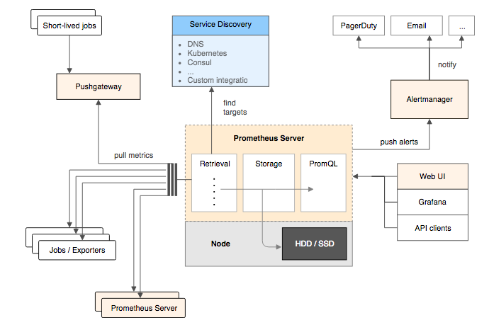

# prometheus-book

- prometheus
- node_exporter
- grafana

## Prometheus简介

1. 在《SRE: Google运维解密》一书中指出，**监控系统需要能够有效的支持白盒监控和黑盒监控**。通过白盒能够了解其内部的实际运行状态，通过对监控指标的观察能够预判可能出现的问题，从而对潜在的不确定因素进行优化。而黑盒监控，常见的如HTTP探针，TCP探针等，可以在系统或者服务在发生故障时能够快速通知相关的人员进行处理

### Prometheus的优势

1. Prometheus核心部分只有一个单独的二进制文件，不存在任何的第三方依赖(数据库，缓存等等)
2. Prometheus基于Pull模型的架构方式，可以在任何地方（本地电脑，开发环境，测试环境）搭建我们的监控系统
3. **基于Prometheus丰富的Client库，用户可以轻松的在应用程序中添加对Prometheus的支持，从而让用户可以获取服务和应用内部真正的运行状态**


4. 所有采集的监控数据均以指标(metric)的形式保存在内置的时间序列数据库当中(TSDB)。所有的样本除了基本的指标名称以外，还包含一组用于描述该样本特征的标签。

>http_request_status{code='200',content_path='/api/path', environment='produment'} => [value1@timestamp1,value2@timestamp2...]
>http_request_status{code='200',content_path='/api/path2', environment='produment'} => [value1@timestamp1,value2@timestamp2...]

5. 基于 docker 安装

```bash
docker run -p 9090:9090 prom/prometheus
```

## 使用Node Exporter采集主机数据

在Prometheus的架构设计中，Prometheus Server并不直接服务监控特定的目标，其主要任务负责数据的收集，存储并且对外提供数据查询支持。

[Node Exporter](https://github.com/prometheus/node_exporter)

Node Exporter 中每一个监控指标之前都会有一段类似于如下形式的信息：

```
# HELP node_cpu Seconds the cpus spent in each mode.
# TYPE node_cpu counter
node_cpu{cpu="cpu0",mode="idle"} 362812.7890625
# HELP node_load1 1m load average.
# TYPE node_load1 gauge
node_load1 3.0703125
```

- 其中HELP用于解释当前指标的含义
- TYPE则说明当前指标的数据类型

在上面的例子中node_cpu的注释表明当前指标是cpu0上idle进程占用CPU的总时间，CPU占用时间是一个只增不减的度量指标，从类型中也可以看出node_cpu的数据类型是 `计数器(counter)`，与该指标的实际含义一致

又例如node_load1该指标反映了当前主机在最近一分钟以内的负载情况，系统的负载情况会随系统资源的使用而变化，因此node_load1反映的是当前状态，数据可能增加也可能减少，从注释中可以看出当前指标类型为 `仪表盘(gauge)`

## 使用PromQL查询监控数据

## 监控数据可视化

```bash
docker run -d -p 3000:3000 grafana/grafana
```

### 任务和实例

当我们需要采集不同的监控指标(例如：主机、MySQL、Nginx)时，我们只需要运行相应的监控采集程序，并且让Prometheus Server知道这些Exporter实例的访问地址

在Prometheus中，每一个暴露监控样本数据的HTTP服务称为一个实例。例如在当前主机上运行的node exporter可以被称为一个实例(Instance)。

而一组用于相同采集目的的实例，或者同一个采集进程的多个副本则通过一个一个任务(Job)进行管理。

```yaml
* job: node
    * instance 2: 1.2.3.4:9100
    * instance 4: 5.6.7.8:9100
```

>可以通过访问 [http://localhost:9090/targets](http://localhost:9090/targets) 直接从Prometheus的UI中查看当前所有的任务以及每个任务对应的实例信息。

## Prometheus 核心组件



### Prometheus Server

Prometheus Server是Prometheus组件中的核心部分，负责实现对监控数据的 `Retrieval`，`Storage` 以及 `PromQL`

### Exporters

Exporter将监控数据采集的端点通过 `HTTP` 服务的形式暴露给Prometheus Server

- 直接采集：这一类Exporter直接内置了对Prometheus监控的支持，比如cAdvisor，Kubernetes，Etcd，Gokit等，都直接内置了用于向Prometheus暴露监控数据的端点。
- 间接采集：间接采集，原有监控目标并不直接支持Prometheus，因此我们需要通过Prometheus提供的Client Library编写该监控目标的监控采集程序。例如： Mysql Exporter，JMX Exporter，Consul Exporter等。

### AlertManager

在AlertManager中我们可以与邮件，Slack等等内置的通知方式进行集成，也可以通过Webhook自定义告警处理方式

### PushGateway

由于Prometheus数据采集基于Pull模型进行设计，因此在网络环境的配置上必须要让Prometheus Server能够直接与Exporter进行通信。 当这种网络需求无法直接满足时，就可以利用PushGateway来进行中转。可以通过PushGateway将内部网络的监控数据主动Push到Gateway当中。而Prometheus Server则可以采用同样Pull的方式从PushGateway中获取到监控数据。

## 第2章 探索PromQL

### 理解时间序列

#### 样本

Prometheus会将所有采集到的样本数据以时间序列（time-series）的方式保存在内存数据库中，并且定时保存到硬盘上。

time-series是按照时间戳和值的序列顺序存放的，我们称之为向量(vector). 每条time-series通过指标名称(metrics name)和一组标签集(labelset)命名。

如下所示，可以将time-series理解为一个以时间为Y轴的数字矩阵：

```
  ^
  │   . . . . . . . . . . . . . . . . .   . .   node_cpu{cpu="cpu0",mode="idle"}
  │     . . . . . . . . . . . . . . . . . . .   node_cpu{cpu="cpu0",mode="system"}
  │     . . . . . . . . . .   . . . . . . . .   node_load1{}
  │     . . . . . . . . . . . . . . . .   . .  
  v
    <------------------ 时间 ---------------->
```

在time-series中的每一个 `点` 称为一个 `样本`（sample），样本由以下三部分组成：

- `指标(metric)`：metric name和描述当前样本特征的labelsets;
- `时间戳(timestamp)`：一个精确到毫秒的时间戳;
- `样本值(value)`： 一个float64的浮点型数据表示当前样本的值。

```
<--------------- metric ---------------------><-timestamp -><-value->
http_request_total{status="200", method="GET"}@1434417560938 => 94355
http_request_total{status="200", method="GET"}@1434417561287 => 94334

http_request_total{status="404", method="GET"}@1434417560938 => 38473
http_request_total{status="404", method="GET"}@1434417561287 => 38544

http_request_total{status="200", method="POST"}@1434417560938 => 4748
http_request_total{status="200", method="POST"}@1434417561287 => 4785
```

#### 指标(Metric)

在形式上，所有的指标(Metric)都通过如下格式标示：

```
<metric name>{<label name>=<label value>, ...}
```

以 `__` 作为前缀的标签，是系统保留的关键字，只能在系统内部使用。标签的值则可以包含任何Unicode编码的字符。

```
api_http_requests_total{method="POST", handler="/messages"}
```

等同于

```
{__name__="api_http_requests_total"，method="POST", handler="/messages"}
```

### Metrics类型

Prometheus定义了4种不同的指标类型(metric type)：Counter（计数器）、Gauge（仪表盘）、Histogram（直方图）、Summary（摘要）

- Counter：只增不减的计数器


```SQL
# 获取HTTP请求量的增长率
rate(http_requests_total[5m])
# 查询当前系统中，访问量前10的HTTP地址：
topk(10, http_requests_total)
```
