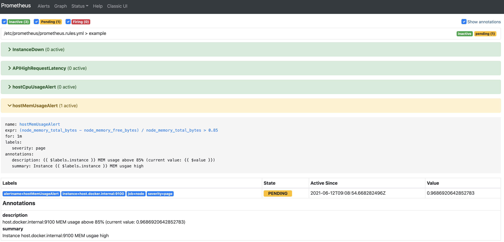
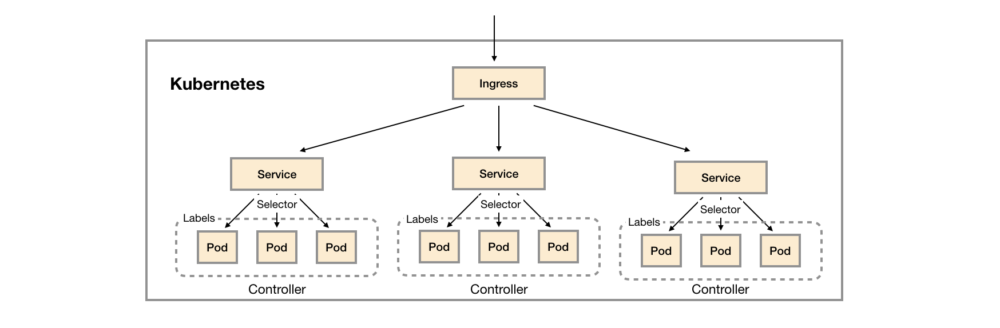

# 	prometheus-book

- prometheus
- node_exporter
- grafana

## 第1章 - Prometheus简介

1. 在《SRE: Google运维解密》一书中指出，**监控系统需要能够有效的支持白盒监控和黑盒监控**。通过白盒能够了解其内部的实际运行状态，通过对监控指标的观察能够预判可能出现的问题，从而对潜在的不确定因素进行优化。而黑盒监控，常见的如HTTP探针，TCP探针等，可以在系统或者服务在发生故障时能够快速通知相关的人员进行处理

### Prometheus的优势

1. Prometheus核心部分只有一个单独的二进制文件，不存在任何的第三方依赖(数据库，缓存等等)
2. Prometheus基于Pull模型的架构方式，可以在任何地方（本地电脑，开发环境，测试环境）搭建我们的监控系统
3. **基于Prometheus丰富的Client库，用户可以轻松的在应用程序中添加对Prometheus的支持，从而让用户可以获取服务和应用内部真正的运行状态**


4. 所有采集的监控数据均以指标(metric)的形式保存在内置的时间序列数据库当中(TSDB)。所有的样本除了基本的指标名称以外，还包含一组用于描述该样本特征的标签。

>http_request_status{code='200',content_path='/api/path', environment='produment'} => [value1@timestamp1,value2@timestamp2...]
>http_request_status{code='200',content_path='/api/path2', environment='produment'} => [value1@timestamp1,value2@timestamp2...]

5. 基于 docker 安装

```bash
docker run -p 9090:9090 prom/prometheus
```

### 使用Node Exporter采集主机数据

在Prometheus的架构设计中，Prometheus Server并不直接服务监控特定的目标，其主要任务负责数据的收集，存储并且对外提供数据查询支持。

[Node Exporter](https://github.com/prometheus/node_exporter)

Node Exporter 中每一个监控指标之前都会有一段类似于如下形式的信息：

```
# HELP node_cpu Seconds the cpus spent in each mode.
# TYPE node_cpu counter
node_cpu{cpu="cpu0",mode="idle"} 362812.7890625
# HELP node_load1 1m load average.
# TYPE node_load1 gauge
node_load1 3.0703125
```

- 其中HELP用于解释当前指标的含义
- TYPE则说明当前指标的数据类型

在上面的例子中node_cpu的注释表明当前指标是cpu0上idle进程占用CPU的总时间，CPU占用时间是一个只增不减的度量指标，从类型中也可以看出node_cpu的数据类型是 `计数器(counter)`，与该指标的实际含义一致

又例如node_load1该指标反映了当前主机在最近一分钟以内的负载情况，系统的负载情况会随系统资源的使用而变化，因此node_load1反映的是当前状态，数据可能增加也可能减少，从注释中可以看出当前指标类型为 `仪表盘(gauge)`

### 使用PromQL查询监控数据

### 监控数据可视化

```bash
docker run -d -p 3000:3000 grafana/grafana
```

### 任务和实例

当我们需要采集不同的监控指标(例如：主机、MySQL、Nginx)时，我们只需要运行相应的监控采集程序，并且让Prometheus Server知道这些Exporter实例的访问地址

在Prometheus中，每一个暴露监控样本数据的HTTP服务称为一个实例。例如在当前主机上运行的node exporter可以被称为一个实例(Instance)。

而一组用于相同采集目的的实例，或者同一个采集进程的多个副本则通过一个一个任务(Job)进行管理。

```yaml
* job: node
    * instance 2: 1.2.3.4:9100
    * instance 4: 5.6.7.8:9100
```

>可以通过访问 [http://localhost:9090/targets](http://localhost:9090/targets) 直接从Prometheus的UI中查看当前所有的任务以及每个任务对应的实例信息。

### Prometheus 核心组件


### Prometheus Server

Prometheus Server是Prometheus组件中的核心部分，负责实现对监控数据的 `Retrieval`，`Storage` 以及 `PromQL`

### Exporters

Exporter将监控数据采集的端点通过 `HTTP` 服务的形式暴露给Prometheus Server

- 直接采集：这一类Exporter直接内置了对Prometheus监控的支持，比如cAdvisor，Kubernetes，Etcd，Gokit等，都直接内置了用于向Prometheus暴露监控数据的端点。
- 间接采集：间接采集，原有监控目标并不直接支持Prometheus，因此我们需要通过Prometheus提供的Client Library编写该监控目标的监控采集程序。例如： Mysql Exporter，JMX Exporter，Consul Exporter等。

### AlertManager

在AlertManager中我们可以与邮件，Slack等等内置的通知方式进行集成，也可以通过Webhook自定义告警处理方式

### PushGateway

由于Prometheus数据采集基于Pull模型进行设计，因此在网络环境的配置上必须要让Prometheus Server能够直接与Exporter进行通信。 当这种网络需求无法直接满足时，就可以利用PushGateway来进行中转。可以通过PushGateway将内部网络的监控数据主动Push到Gateway当中。而Prometheus Server则可以采用同样Pull的方式从PushGateway中获取到监控数据。

## 第2章 - 探索PromQL

### 理解时间序列

#### 样本

Prometheus会将所有采集到的样本数据以时间序列（time-series）的方式保存在内存数据库中，并且定时保存到硬盘上。

time-series是按照时间戳和值的序列顺序存放的，我们称之为向量(vector). 每条time-series通过指标名称(metrics name)和一组标签集(labelset)命名。

如下所示，可以将time-series理解为一个以时间为Y轴的数字矩阵：

```
  ^
  │   . . . . . . . . . . . . . . . . .   . .   node_cpu{cpu="cpu0",mode="idle"}
  │     . . . . . . . . . . . . . . . . . . .   node_cpu{cpu="cpu0",mode="system"}
  │     . . . . . . . . . .   . . . . . . . .   node_load1{}
  │     . . . . . . . . . . . . . . . .   . .  
  v
    <------------------ 时间 ---------------->
```

在time-series中的每一个 `点` 称为一个 `样本`（sample），样本由以下三部分组成：

- `指标(metric)`：metric name和描述当前样本特征的labelsets;
- `时间戳(timestamp)`：一个精确到毫秒的时间戳;
- `样本值(value)`： 一个float64的浮点型数据表示当前样本的值。

><--------------- metric ---------------------><-timestamp -><-value->
>
>http_request_total{status="200", method="GET"}@1434417560938 => 94355
>
>http_request_total{status="200", method="GET"}@1434417561287 => 94334
>
>
>
>http_request_total{status="404", method="GET"}@1434417560938 => 38473
>
>http_request_total{status="404", method="GET"}@1434417561287 => 38544
>
>
>
>http_request_total{status="200", method="POST"}@1434417560938 => 4748
>
>http_request_total{status="200", method="POST"}@1434417561287 => 4785

#### 指标(Metric)

在形式上，所有的指标(Metric)都通过如下格式标示：

```
<metric name>{<label name>=<label value>, ...}
```

以 `__` 作为前缀的标签，是系统保留的关键字，只能在系统内部使用。标签的值则可以包含任何Unicode编码的字符。

```
api_http_requests_total{method="POST", handler="/messages"}
```

等同于

```
{__name__="api_http_requests_total"，method="POST", handler="/messages"}
```

### Metrics类型

Prometheus定义了4种不同的指标类型(metric type)：Counter（计数器）、Gauge（仪表盘）、Histogram（直方图）、Summary（摘要）

- Counter：只增不减的计数器


```SQL
# 获取HTTP请求量的增长率
rate(prometheus_http_requests_total[5m])
# 查询当前系统中，访问量前10的HTTP地址：
topk(10, prometheus_http_requests_total)
```

#### Counter：只增不减的计数器

常测量对象：
- 请求的数量
- 任务完成的数量
- 函数调用次数
- 错误发生次数

#### Gauge：可增可减的仪表盘

与Counter不同，Gauge类型的指标侧重于反应系统的当前状态。例如：node_memory_MemFree（主机当前空闲的内容大小）、node_memory_MemAvailable（可用内存大小）

- 温度
- 内存用量
- 并发请求数

#### 使用 Histogram 和 Summary 分析数据分布情况

Histogram和Summary主用用于统计和分析样本的分布情况。

在大多数情况下人们都倾向于使用某些量化指标的平均值，例如CPU的平均使用率、页面的平均响应时间。这种方式的问题很明显，以系统API调用的平均响应时间为例：如果大多数API请求都维持在100ms的响应时间范围内，而个别请求的响应时间需要5s，那么就会导致某些WEB页面的响应时间落到中位数的情况，而这种现象被称为长尾问题。

为了区分是平均的慢还是长尾的慢，最简单的方式就是按照请求延迟的范围进行分组。例如，统计延迟在0~10ms之间的请求数有多少而10~20ms之间的请求数又有多少。通过这种方式可以快速分析系统慢的原因。Histogram和Summary都是为了能够解决这样问题的存在，通过Histogram和Summary类型的监控指标，我们可以快速了解监控样本的分布情况。

例如，指标prometheus_tsdb_wal_fsync_duration_seconds的指标类型为Summary。 它记录了Prometheus Server中wal_fsync处理的处理时间，通过访问Prometheus Server的/metrics地址，可以获取到以下监控样本数据：

```
# HELP prometheus_tsdb_wal_fsync_duration_seconds Duration of WAL fsync.
# TYPE prometheus_tsdb_wal_fsync_duration_seconds summary
prometheus_tsdb_wal_fsync_duration_seconds{quantile="0.5"} 0.012352463
prometheus_tsdb_wal_fsync_duration_seconds{quantile="0.9"} 0.014458005
prometheus_tsdb_wal_fsync_duration_seconds{quantile="0.99"} 0.017316173
prometheus_tsdb_wal_fsync_duration_seconds_sum 2.888716127000002
prometheus_tsdb_wal_fsync_duration_seconds_count 216
```

`quantile` 是分位数，是指将一个随机变量的概率分布范围分为几个等份的数值点，常用的有中位数（即二分位数）、四分位数、百分位数等

在上面的例子中我们可以看到：

- wal_fsync 的总操作次数是 216
- wal_fsync 的总操作时间是 2.888716127000002
- `{quantile="0.5"} 0.012352463` 表示 50% 的 wal_fsync 时间少于 `0.012352463`, 50% 的 wal_fsync 时间超过 `0.012352463`
- `{quantile="0.9"} 0.014458005` 表示 90% 的 wal_fsync 时间少于 `0.014458005`，10% 的 wal_fsync 时间超过 `0.014458005`
- `{quantile="0.99"} 0.017316173` 表示 99% 的 wal_fsync 时间少于 `0.017316173`，1% 的 wal_fsync 时间超过 `0.017316173`


>具体实现：Histogram 会根据观测的样本生成如下数据：

inf 表无穷值，a1，a2，……是单调递增的数值序列。

- [basename]_count：数据的个数，类型为 counter
- [basename]_sum：数据的加和，类型为 counter
- [basename]_bucket{le=a1}：处于 [-inf,a1] 的数值个数
- [basename]_bucket{le=a2}：处于 [-inf,a2] 的数值个数
- ...
- [basename]_bucket{le=<+inf>}：处于 [-inf,+inf] 的数值个数，Prometheus 默认额外生成，无需用户定义

#### Histogram 实例

histogram是柱状图，在Prometheus系统中的查询语言中，有三种作用：

1. 对每个采样点进行统计（并不是一段时间的统计），打到各个桶(bucket)中
2. 对每个采样点值累计和(sum)
3. 对采样点的次数累计和(count)

```java
    private static void testHistogram() {
        Histogram histogram = Histogram.build("histogram", "histogram")
                .buckets(0, 2, 5, 10)
                .create();
        for (int i = 0; i < 10; ++i) {
            histogram.observe(i);
        }

        List<MetricFamilySamples> collect = histogram.collect();
        for (MetricFamilySamples metric : collect) {
            List<Sample> samples = metric.samples;
            for (Sample sample : samples) {
                System.out.println(sample);
            }
        }
    }

```

>output

```
Name: histogram_bucket LabelNames: [le] labelValues: [0.0]  Value: 1.0 TimestampMs: null
Name: histogram_bucket LabelNames: [le] labelValues: [2.0]  Value: 3.0 TimestampMs: null
Name: histogram_bucket LabelNames: [le] labelValues: [5.0]  Value: 6.0 TimestampMs: null
Name: histogram_bucket LabelNames: [le] labelValues: [10.0] Value: 10.0 TimestampMs: null
Name: histogram_bucket LabelNames: [le] labelValues: [+Inf] Value: 10.0 TimestampMs: null
Name: histogram_count LabelNames: [] labelValues: [] Value: 10.0 TimestampMs: null
Name: histogram_sum LabelNames: [] labelValues: [] Value: 45.0 TimestampMs: null
Name: histogram_created LabelNames: [] labelValues: [] Value: 1.622465017968E9 TimestampMs: null
```

#### Summary 实例

summary是采样点分位图统计。 它也有三种作用：

1. 在客户端对于一段时间内（默认是10分钟）的每个采样点进行统计，并形成分位图。（如：正态分布一样，统计低于60分不及格的同学比例，统计低于80分的同学比例，统计低于95分的同学比例）
2. 统计班上所有同学的总成绩(sum)
3. 统计班上同学的考试总人数(count)

```java
    private static void testSummary() {
        Summary summary = Summary.build("summary", "summary")
                .quantile(0.2, 0.0)
                .quantile(0.5, 0.0)
                .quantile(0.99, 0.0)
                .create();

        for (int i = 0; i < 10; ++i) {
            summary.observe(i);
        }
        List<MetricFamilySamples> collect = summary.collect();
        for (MetricFamilySamples metric : collect) {
            List<Sample> samples = metric.samples;
            for (Sample sample : samples) {
                System.out.println(sample);
            }
        }
    }
```

>output

>Name: summary LabelNames: [quantile] labelValues: [0.2] Value: 1.0 TimestampMs: null
>
>Name: summary LabelNames: [quantile] labelValues: [0.5] Value: 4.0 TimestampMs: null
>
>Name: summary LabelNames: [quantile] labelValues: [0.99] Value: 8.0 TimestampMs: null
>
>Name: summary_count LabelNames: [] labelValues: [] Value: 10.0 TimestampMs: null
>
>Name: summary_sum LabelNames: [] labelValues: [] Value: 45.0 TimestampMs: null
>
>Name: summary_created LabelNames: [] labelValues: [] Value: 1.622463923128E9 TimestampMs: null

#### Histogram 和 Summary 的区别

>Histogram 在统计的时候统计的是区间范围的值，它统计到的 `quantile` 是一个估算值。例如当求解 0.9 quantile 的采样值时会用 (0.75, 0.95) 两个相邻的的 bucket 来线性近似。

### 初识PromQL

#### 查询时间序列

```
prometheus_http_requests_total
```

等同于

```
prometheus_http_requests_total{}
```

该表达式会返回指标名称为prometheus_http_requests_total的所有时间序列：

```
prometheus_http_requests_total{code="200",handler="alerts",instance="localhost:9090",job="prometheus",method="get"}=(20889@1518096812.326)
prometheus_http_requests_total{code="200",handler="graph",instance="localhost:9090",job="prometheus",method="get"}=(21287@1518096812.326)
```

使用 `=` 匹配

```
prometheus_http_requests_total{instance="localhost:9090"}
```

使用 `!=` 匹配

```
prometheus_http_requests_total{instance!="localhost:9090"}
```

除了使用完全匹配的方式对时间序列进行过滤以外，PromQL还可以支持使用 `正则表达式` 作为匹配条件，多个表达式之间使用|进行分离：

- 使用 `label=~regx` 表示选择那些标签符合正则表达式定义的时间序列；
- 反之使用 `label!~regx` 进行排除；

```
prometheus_http_requests_total{environment=~"staging|testing|development",method!="GET"}
```

#### 范围查询

直接通过类似于PromQL表达式http_requests_total查询时间序列时，返回值中只会包含该时间序列中的 `最新` 的一个样本值，这样的返回结果我们称之为 `瞬时向量`。而相应的这样的表达式称之为 `瞬时向量表达式`。

而如果我们想过去一段时间范围内的样本数据时，我们则需要使用 `区间向量表达式`。时间范围通过时间范围选择器`[]`进行定义。


```
prometheus_http_requests_total{}[1m]
```


#### 时间位移操作

```
prometheus_http_requests_total{} # 瞬时向量表达式，选择当前最新的数据
prometheus_http_requests_total{}[5m] # 区间向量表达式，选择以当前时间为基准，5分钟内的数据

prometheus_http_requests_total{} offset 5m # 5分钟前的瞬时样本数据
prometheus_http_requests_total{}[1d] offset 1d # 5分钟前为基准，5分钟内的数据
```

#### 使用聚合操作

一般来说，如果描述样本特征的标签(label)在并非唯一的情况下，通过PromQL查询数据，会返回多条满足这些特征维度的时间序列。

```
# sum
sum(prometheus_http_requests_total{code!="200"})
# avg
avg(prometheus_http_requests_total{code!="200"})
# 查询 prometheus_http_requests_total 指标下所有 code != 200，并根据 code 分组
sum(prometheus_http_requests_total{code!="200"})  by (code)
```

#### 标量和字符串

除了使用瞬时向量表达式和区间向量表达式以外，PromQL还直接支持用户使用标量(Scalar)和字符串(String)。

```
# 标量（Scalar）：一个浮点型的数字值，没有时序
10
直接使用字符串，作为PromQL表达式，则会直接返回字符串。
"this is a string"
'these are unescaped: \n \\ \t'
`these are not unescaped: \n ' " \t`
```

#### 合法的PromQL表达式

所有的PromQL表达式都必须至少包含一个指标名称(例如 prometheus_http_requests_total)，或者一个`不会匹配到空字符串`的标签过滤器(例如{code="200"})。

同时，除了使用`<metric name>{label=value}`的形式以外，我们还可以使用内置的`__name__`标签来指定监控指标名称：

```
{__name__="node_cpu_seconds_total"}
```

### PromQL操作符

#### 数学运算

```
# 空闲内存字节数
# node_memory_free_bytes{instance="host.docker.internal:9100", job="node"}     212561920
node_memory_free_bytes

# 空闲内存MB
# {instance="host.docker.internal:9100", job="node"}                   202.7148
node_memory_free_bytes / (1024 * 1024)
```

当瞬时向量与 `标量` 之间进行数学运算时，数学运算符会依次作用域瞬时向量中的每一个样本值，从而得到一组新的时间序列。

而如果是瞬时向量与瞬时向量之间进行数学运算时，过程会相对复杂一点。

例如，如果我们想根据 `node_disk_written_bytes_total` 和 `node_disk_read_bytes_total` 获取主机磁盘IO的总量，可以使用如下表达式：

```
# 获取主机磁盘IO总量
node_disk_written_bytes_total + node_disk_read_bytes_total
```

那这个表达式是如何工作的呢？**依次找到与左边向量元素匹配（标签完全一致）的右边向量元素进行运算，如果没找到匹配元素，则直接丢弃**。同时新的时间序列将不会包含指标名称。 该表达式返回结果的示例如下所示：

```
{device="disk0", instance="host.docker.internal:9100", job="node"}              242636120064
```

#### 使用布尔运算过滤时间序列

```
# 查询内存使用率
(node_memory_total_bytes - node_memory_free_bytes) / node_memory_total_bytes

# 查询内存使用率>95的
(node_memory_total_bytes - node_memory_free_bytes) / node_memory_total_bytes > 0.95
```

瞬时向量与标量进行布尔运算时，PromQL依次比较向量中的所有时间序列样本的值，**如果比较结果为`true`则保留**，反之丢弃。

#### 使用集合运算符

使用瞬时向量表达式能够获取到一个包含多个时间序列的集合，我们称为瞬时向量。 通过集合运算，可以在两个瞬时向量与瞬时向量之间进行相应的集合操作。目前，Prometheus支持以下集合运算符：

- `and`
- `or`
- `unless`

***vector1 and vector2*** 会产生一个由vector1的元素组成的新的向量。该向量包含vector1中完全匹配vector2中的元素组成。

***vector1 or vector2*** 会产生一个新的向量，该向量包含vector1中所有的样本数据，以及vector2中没有与vector1匹配到的样本数据。

***vector1 unless vector2*** 会产生一个新的向量，新向量中的元素由vector1中没有与vector2匹配的元素组成。

#### 匹配模式详解

向量与向量之间进行运算操作时会基于默认的匹配规则：**依次找到与左边向量元素匹配（标签完全一致）的右边向量元素进行运算，如果没找到匹配元素，则直接丢弃。**

接下来将介绍在PromQL中有两种典型的匹配模式：一对一（one-to-one）,多对一（many-to-one）或一对多（one-to-many）。

##### 一对一匹配

一对一匹配模式会从操作符两边表达式获取的瞬时向量依次比较并找到唯一匹配(标签完全一致)的样本值。默认情况下，使用表达式：

```
vector1 <operator> vector2
```

在操作符两边表达式标签不一致的情况下，可以使用 `on(label list)` 或者`ignoring(label list)`来修改便签的匹配行为。使用ignoreing可以在匹配时忽略某些便签。而on则用于将匹配行为限定在某些便签之内。

```
<vector expr> <bin-op> ignoring(<label list>) <vector expr>
<vector expr> <bin-op> on(<label list>) <vector expr>
```

例如存在样本：

>method_code:http_errors:rate5m{method="get", code="500"}  24
>
>method_code:http_errors:rate5m{method="get", code="404"}  30
>
>method_code:http_errors:rate5m{method="put", code="501"}  
>
>method_code:http_errors:rate5m{method="post", code="500"} 6
>
>method_code:http_errors:rate5m{method="post", code="404"} 21
>
>
>
>method:http_requests:rate5m{method="get"}  600
>
>method:http_requests:rate5m{method="del"}  34
>
>method:http_requests:rate5m{method="post"} 120

使用PromQL表达式：

```
method_code:http_errors:rate5m{code="500"} / ignoring(code) method:http_requests:rate5m
```

会得到：

```
{method="get"}  0.04            //  24 / 600
{method="post"} 0.05            //   6 / 120
```

同时由于method为put和del的样本找不到匹配项，因此不会出现在结果当中。

##### 多对一和一对多

多对一和一对多两种匹配模式指的是“一”侧的每一个向量元素可以与"多"侧的多个元素匹配的情况。在这种情况下，必须使用group修饰符：group_left或者group_right来确定哪一个向量具有更高的基数（充当“多”的角色）。

```
<vector expr> <bin-op> ignoring(<label list>) group_left(<label list>) <vector expr>
<vector expr> <bin-op> ignoring(<label list>) group_right(<label list>) <vector expr>
<vector expr> <bin-op> on(<label list>) group_left(<label list>) <vector expr>
<vector expr> <bin-op> on(<label list>) group_right(<label list>) <vector expr>
```

**多对一和一对多两种模式一定是出现在操作符两侧表达式返回的向量标签不一致的情况**。因此需要使用ignoring和on修饰符来排除或者限定匹配的标签列表。

例如,使用表达式：

```
method_code:http_errors:rate5m / ignoring(code) group_left method:http_requests:rate5m
```

该表达式中，左向量 `method_code:http_errors:rate5m` 包含两个标签method和code。而右向量 `method:http_requests:rate5m` 中只包含一个标签method，因此匹配时需要使用ignoring限定匹配的标签为code。 在限定匹配标签后，右向量中的元素可能匹配到多个左向量中的元素 因此该表达式的匹配模式为多对一，需要使用group修饰符group_left指定左向量具有更好的基数。

>在不使用 group 的情况下，我们指定了 `ingoring(code)`，并且在返回的结果中没有包含 `code` 这个 label。
>
>而如果我们需要 `code`作为返回值，那么存在一个问题，在 `method`匹配的时候，可能存在多个不同的 `code`。使用 `group_left` 之后可以达到为每个不同的 `code` 都执行一数学运算。

```
{method="get", code="500"}  0.04            //  24 / 600
{method="get", code="404"}  0.05            //  30 / 600
{method="post", code="500"} 0.05            //   6 / 120
{method="post", code="404"} 0.175           //  21 / 120
```

### PromQL聚合操作

`sum` (求和)

`min` (最小值)

`max` (最大值)

`avg` (平均值)

`stddev` (标准差)

`stdvar` (标准方差)

`count` (计数)

`count_values` (对value进行计数)

`bottomk` (后n条时序)

`topk` (前n条时序)

`quantile` (分位数)

使用聚合操作的语法如下：

```
<aggr-op>([parameter,] <vector expression>) [without|by (<label list>)]
```

其中只有`count_values`, `quantile`, `topk`, `bottomk`支持参数(parameter)。

without用于从计算结果中移除列举的标签，而保留其它标签。by则正好相反，结果向量中只保留列出的标签，其余标签则移除。通过without和by可以按照样本的问题对数据进行聚合。

例如：

```
sum(prometheus_http_requests_total) without(instance)
```

等价于

```
sum(prometheus_http_requests_total) by(code,handler,job)
```

count_values用于**时间序列中每一个样本值出现的次数**。count_values会为每一个唯一的样本值输出一个时间序列，并且每一个时间序列包含一个额外的标签。

```
# 对于指标 prometheus_http_requests_total，先根据 code 进行分组
# 然后对于组的每一份数据统计样本值出现的次数
# 类似于SQL的 select count(1) (group by code) (group by count) 两次分组。
# 返回 {code="200", count="674"}    1
count_values("count", prometheus_http_requests_total) by(code)

# 逻辑和上面的参数相同，只不过在统计完之后的标签不一样
# 返回 {code="200", sum="674"}    1
count_values("sum", prometheus_http_requests_total) by(code)
```

例如对于以下输入

>method_code:http_errors:rate5m{method="put", code="501"}  10
>
>method_code:http_errors:rate5m{method="put", code="501"}  10
>
>method_code:http_errors:rate5m{method="get", code="500"}  24
>
>method_code:http_errors:rate5m{method="post", code="500"} 6

执行

```
count_values("count", method_code:http_errors:rate5m) by(code)
```

得到的结果是

> {code="501", count="10"}  2
>
> {code="500", count="24"} 1
>
> {code="500", count="6"}  1

执行

```
count_values("sum", method_code:http_errors:rate5m) by(code)
```

得到的结果是：

>{code="501", sum="10"}  2
>
>{code="500", sum="24"} 1
>
>{code="500", sum="6"}  1

topk和bottomk则用于对样本值进行排序，返回当前样本值前n位，或者后n位的时间序列。

获取HTTP请求数前5位的时序样本数据，可以使用表达式：

```
# 根据 code 分组之后，查询HTTP请求前5的样本数据
topk(5, prometheus_http_requests_total) by(code)
```

quantile用于计算当前样本数据值的分布情况quantile(φ, express)其中0 ≤ φ ≤ 1。

例如，当φ为0.5时，即表示找到当前样本数据中的中位数：

```
quantile(0.5, prometheus_http_requests_total)
```

### PromQL内置函数

- `increase` 区间增长`量`，容易陷入“长尾问题”当中
- `rate` 区间平均增长`率`，容易陷入“长尾问题”当中
- `irate` 避免在时间窗口范围内的“长尾问题”，并且体现出更好的灵敏度的区间增长率
- `predict_linear` 预测时间序列v在t秒后的值

#### 计算Counter指标增长率

我们知道Counter类型的监控指标其特点是只增不减，在没有发生重置（如服务器重启，应用重启）的情况下其样本值应该是不断增大的。**为了能够更直观的表示样本数据的变化剧烈情况，需要计算样本的增长速率。**

increase(v range-vector)函数是PromQL中提供的众多内置函数之一。其中`参数v是一个区间向量`，increase函数获取区间向量中的**第一个和最后一个样本并返回其增长量**。因此，可以通过以下表达式Counter类型指标的增长率：

```
increase(node_cpu_seconds_total{cpu="0",mode="idle"}[2m]) / 120
```

这里通过node_cpu_seconds_total[2m]获取时间序列最近两分钟的所有样本，increase计算出最近两分钟的增长量，最后除以时间120秒得到node_cpu_seconds_total样本在最近两分钟的平均增长率。并且这个值也近似于主机节点最近两分钟内的cpu请求使用率。

rate 可以直接用来计算增长率：

```
# 等同于上面的指令
rate(node_cpu_seconds_total{cpu="0",mode="idle"}[2m])
```

irate函数是通过区间向量中**最后两个样本数据**来计算区间向量的增长速率。

```
# 等同于上面的指令
irate(node_cpu_seconds_total{cpu="0",mode="idle"}[2m])
```

irate函数相比于rate函数提供了更高的灵敏度，不过当需要分析长期趋势或者在告警规则中，irate的这种灵敏度反而容易造成干扰。因此在**长期趋势分析或者告警中更推荐使用rate函数**。

#### 预测Gauge指标变化趋势

在一般情况下，系统管理员为了确保业务的持续可用运行，会针对服务器的资源设置相应的告警阈值。例如，当磁盘空间只剩512MB时向相关人员发送告警通知。 这种基于阈值的告警模式对于当资源用量是平滑增长的情况下是能够有效的工作的。 但是如果资源不是平滑变化的呢？ 比如有些某些业务增长，存储空间的增长速率提升了高几倍。这时，如果基于原有阈值去触发告警，当系统管理员接收到告警以后可能还没来得及去处理问题，系统就已经不可用了。 因此阈值通常来说不是固定的，需要定期进行调整才能保证该告警阈值能够发挥去作用。 那么还有没有更好的方法吗？

predict_linear函数可以预测时间序列v在t秒后的值。它基于简单线性回归的方式，对时间窗口内的样本数据进行统计，从而可以对时间序列的变化趋势做出预测。例如，基于2小时的样本数据，来预测主机可用磁盘空间的是否在4个小时候被占满，可以使用如下表达式：

```
predict_linear(node_filesystem_free_bytes{job="node"}[2h], 4 * 3600) < 0
```

#### 统计Histogram指标的分位数

Histogram和Summary都可以用于统计和分析数据的分布情况。区别在于Summary是直接在客户端计算了数据分布的分位数情况。而Histogram的分位数计算需要通过`histogram_quantile(φ float, b instant-vector)`函数进行计算。其中φ（0<φ<1）表示需要计算的分位数，如果需要计算中位数φ取值为0.5。summary 的性能响度来说差一些。

```
# 统计 prometheus_http_request_duration_seconds_bucket 指标的中位数
histogram_quantile(0.5, prometheus_http_request_duration_seconds_bucket{handler="/"})
```

#### 动态标签替换

一般来说来说，使用PromQL查询到时间序列后，可视化工具会根据时间序列的标签来渲染图表。例如通过up指标可以获取到当前所有运行的Exporter实例以及其状态：

>up{instance="localhost:8080",job="cadvisor"}    1
>
>up{instance="localhost:9090",job="prometheus"}    1
>
>up{instance="localhost:9100",job="node"}    1

这是可视化工具渲染图标时可能根据，instance和job的值进行渲染，为了能够让客户端的图标更具有可读性，可以通过label_replace标签为时间序列添加额外的标签。label_replace的具体参数如下：

```
label_replace(v instant-vector, dst_label string, replacement string, src_label string, regex string)
```

该函数会依次对v中的每一条时间序列进行处理，通过regex匹配src_label的值，并将匹配部分replacement写入到dst_label标签中。如下所示：

```
label_replace(up, "host", "$1", "instance",  "(.*):.*")
```

该函数会依次对v中的每一条时间序列进行处理，通过regex匹配src_label的值，并将匹配部分relacement写入到dst_label标签中。如下所示：

```
# 修改 up 函数并为 up 函数添加一个新的 label="host"，host 的值是 instance 的正则表达式的匹配部分
label_replace(up, "host", "$1", "instance",  "(.*):.*")
```

函数处理后，时间序列将包含一个host标签，host标签的值为Exporter实例的IP地址：

>up{host="localhost",instance="localhost:8080",job="cadvisor"}    1
>
>up{host="localhost",instance="localhost:9090",job="prometheus"}    1
>
>up{host="localhost",instance="localhost:9100",job="node"} 1

除了label_replace以外，Prometheus还提供了label_join函数，该函数可以将时间序列中v多个标签src_label的值，通过separator作为连接符写入到一个新的标签dst_label中:

```
label_join(v instant-vector, dst_label string, separator string, src_label_1 string, src_label_2 string, ...)
```

例如：

```
label_join(up, "join", "instance", "job")
```

会得到：

>up{join="localhost:8080&cadvisor", host="localhost",instance="localhost:8080",job="cadvisor"}    1
>
>up{join="localhost:8080&prometheus",host="localhost",instance="localhost:9090",job="prometheus"}    1
>
>up{join="localhost:8080&node",host="localhost",instance="localhost:9100",job="node"} 1

### 最佳实践：4个黄金指标和USE方法

#### 4个黄金指标

主要关注与以下四种类型的指标：延迟，通讯量，错误以及饱和度：

- 延迟：服务请求所需时间。重点是要区分成功请求的延迟时间和失败请求的延迟时间。 例如在数据库或者其他关键服务端服务异常触发HTTP 500的情况下，用户也可能会很快得到请求失败的响应内容，如果不加区分计算这些请求的延迟，可能导致计算结果与实际结果产生巨大的差异。
- 通讯量：监控当前系统的流量，用于衡量服务的容量需求。
- 错误：监控当前系统所有发生的错误请求，衡量当前系统错误发生的速率。
- 饱和度：衡量当前服务的饱和度。主要强调最能影响服务状态的受限制的资源。 例如，如果系统主要受内存影响，那就主要关注系统的内存状态，如果系统主要受限与磁盘I/O，那就主要观测磁盘I/O的状态。

## 第3章 - Prometheus告警处理

> 在Prometheus Server中定义告警规则以及产生告警，Alertmanager组件则用于处理这些由Prometheus产生的告警。

### Prometheus告警简介


在Prometheus中一条告警规则主要由以下几部分组成：

- 告警名称
- 告警规则

### Alertmanager特性


#### 分组

分组机制可以将详细的告警信息合并成一个通知。

#### 抑制

抑制是指当某一告警发出后，可以停止重复发送由此告警引发的其它告警的机制。

例如，当集群不可访问时触发了一次告警，通过配置Alertmanager可以忽略与该集群有关的其它所有告警。这样可以避免接收到大量与实际问题无关的告警通知。

#### 静默

静默提供了一个简单的机制可以快速根据标签对告警进行静默处理。如果接收到的告警符合静默的配置，Alertmanager则不会发送告警通知。

### 自定义Prometheus告警规则

Prometheus中的告警规则允许你基于PromQL表达式定义告警触发条件，Prometheus后端对这些触发规则进行周期性计算，当满足触发条件后则会触发告警通知。

#### 定义告警规则

一条典型的告警规则如下所示：

```yaml
groups:
- name: example
  rules:
  - alert: HighErrorRate
    expr: job:request_latency_seconds:mean5m{job="myjob"} > 0.5
    for: 10m
    labels:
      severity: page
    annotations:
      summary: High request latency
      description: description info
```

在告警规则文件中，我们可以将一组相关的规则设置定义在一个`group`下，注意，**example 是 group 的名称而不是告警的名称**。在每一个group中我们可以定义多个告警规则(rule)。一条告警规则主要由以下几部分组成：

- alert：告警规则的名称。
- expr：基于PromQL表达式告警触发条件，用于计算是否有时间序列满足该条件。
- for：评估等待时间，可选参数。用于表示只有当触发条件持续一段时间后才发送告警。在等待期间新产生告警的状态为pending。
- labels：自定义标签，允许用户指定要附加到告警上的一组附加标签。
- annotations：用于指定一组附加信息，比如用于描述告警详细信息的文字等，annotations的内容在告警产生时会一同作为参数发送到Alertmanager。

为了能够让Prometheus能够启用定义的告警规则，我们需要在Prometheus全局配置文件中通过**rule_files**指定一组告警规则文件的访问路径，Prometheus启动后会自动扫描这些路径下规则文件中定义的内容，并且根据这些规则计算是否向外部发送通知：

```yaml
rule_files:
  [ - <filepath_glob> ... ]
```

我们在启动 prometheus 需要指定该文件：

```bash
docker run -p 9090:9090 \
    -v ~/tool/prometheus-2.24.1.darwin-amd64/prometheus.yml:/etc/prometheus/prometheus.yml \
    -v ~/tool/prometheus-2.24.1.darwin-amd64/prometheus.rules.yml:/etc/prometheus/prometheus.rules.yml prom/prometheus \
    > ~/logs/prometheus.log &
```

默认情况下Prometheus会每分钟对这些告警规则进行计算，如果用户想定义自己的告警计算周期，则可以通过`evaluation_interval`来覆盖默认的计算周期：

```yaml
global:
  [ evaluation_interval: <duration> | default = 1m ]
```

#### 模板化

一般来说，在告警规则文件的annotations中使用`summary`描述告警的概要信息，`description`用于描述告警的详细信息。

通过`$labels.<labelname>`变量可以访问当前告警实例中指定标签的值。`$value` 则可以获取当前PromQL表达式计算的样本值。

> \# To insert a firing element's label values:
>
> {{ $labels.<labelname> }}
>
> \# To insert the numeric expression value of the firing element:
>
> {{ $value }}

例如，可以通过模板化优化summary以及description的内容的可读性：

```yaml
groups:
- name: example
  rules:

  # Alert for any instance that is unreachable for >5 minutes.
  - alert: InstanceDown
    expr: up == 0
    for: 5m
    labels:
      severity: page
    annotations:
      summary: "Instance {{ $labels.instance }} down"
      description: "{{ $labels.instance }} of job {{ $labels.job }} has been down for more than 5 minutes."

  # Alert for any instance that has a median request latency >1s.
  - alert: APIHighRequestLatency
    expr: api_http_request_latencies_second{quantile="0.5"} > 1
    for: 10m
    annotations:
      summary: "High request latency on {{ $labels.instance }}"
      description: "{{ $labels.instance }} has a median request latency above 1s (current value: {{ $value }}s)"
```

#### 查看告警状态

如下所示，用户可以通过Prometheus WEB界面中的Alerts菜单查看当前Prometheus下的所有告警规则，以及其当前所处的活动状态。

**同时对于已经pending或者firing的告警，Prometheus也会将它们存储到时间序列ALERTS{}中。**

```
ALERTS{alertname="<alert name>", alertstate="pending|firing", <additional alert labels>}
```

添加一个新的告警规则：

```yaml
- name: hostStatsAlert
  rules:
  - alert: hostCpuUsageAlert
    expr: sum(avg without (cpu)(irate(node_cpu_seconds_total{mode!='idle'}[5m]))) by (instance) > 0.85
    for: 1m
    labels:
      severity: page
    annotations:
      summary: "Instance {{ $labels.instance }} CPU usgae high"
      description: "{{ $labels.instance }} CPU usage above 85% (current value: {{ $value }})"
  - alert: hostMemUsageAlert
    expr: (node_memory_total_bytes -  node_memory_free_bytes)/node_memory_total_bytes > 0.85
    for: 1m
    labels:
      severity: page
    annotations:
      summary: "Instance {{ $labels.instance }} MEM usgae high"
      description: "{{ $labels.instance }} MEM usage above 85% (current value: {{ $value }})"
```

重新加载规则：

```bash
kill -HUP $PID
```

可以看到规则已经生效：



### 部署AlertManager

首先是配置文件

```yaml
global:
  resolve_timeout: 5m

route:
  group_by: ['alertname']
  group_wait: 10s
  group_interval: 10s
  repeat_interval: 1h
  receiver: 'web.hook'
receivers:
- name: 'web.hook'
  webhook_configs:
  - url: 'http://localhost:5001/'
inhibit_rules:
  - source_match:
      severity: 'critical'
    target_match:
      severity: 'warning'
    equal: ['alertname', 'dev', 'instance']
```

通过 docker 部署

```bash
docker run -d -p 9093:9093 -v ~/tool/alter_manager/alert_manager.yml:/etc/alertmanager/config.yml prom/alertmanager
```

Alertmanager的配置主要包含两个部分：`路由(route)`以及`接收器(receivers)`。所有的告警信息都会从配置中的顶级路由(route)进入路由树，根据路由规则将告警信息发送给相应的接收器。

在Alertmanager中可以定义一组接收器，比如可以按照角色(比如系统运维，数据库管理员)来划分多个接收器。接收器可以关联邮件，Slack以及其它方式接收告警信息。

#### 关联Prometheus与Alertmanager

编辑Prometheus配置文件prometheus.yml,并添加以下内容

```yaml
alerting:
  alertmanagers:
    - static_configs:
        - targets: ['host.docker.internal:9093']
```

#### Alertmanager配置概述

Alertmanager配置中一般会包含以下几个主要部分：

- 全局配置（global）：用于定义一些全局的公共参数，如全局的SMTP配置，Slack配置等内容；
- 模板（templates）：用于定义告警通知时的模板，如HTML模板，邮件模板等；
- 告警路由（route）：根据标签匹配，确定当前告警应该如何处理；
- 接收人（receivers）：接收人是一个抽象的概念，它可以是一个邮箱也可以是微信，Slack或者Webhook等，接收人一般配合告警路由使用；
- 抑制规则（inhibit_rules）：合理设置抑制规则可以减少垃圾告警的产生

```yaml
global:
  [ resolve_timeout: <duration> | default = 5m ]
  [ smtp_from: <tmpl_string> ] 
  [ smtp_smarthost: <string> ] 
  [ smtp_hello: <string> | default = "localhost" ]
  [ smtp_auth_username: <string> ]
  [ smtp_auth_password: <secret> ]
  [ smtp_auth_identity: <string> ]
  [ smtp_auth_secret: <secret> ]
  [ smtp_require_tls: <bool> | default = true ]
  [ slack_api_url: <secret> ]
  [ victorops_api_key: <secret> ]
  [ victorops_api_url: <string> | default = "https://alert.victorops.com/integrations/generic/20131114/alert/" ]
  [ pagerduty_url: <string> | default = "https://events.pagerduty.com/v2/enqueue" ]
  [ opsgenie_api_key: <secret> ]
  [ opsgenie_api_url: <string> | default = "https://api.opsgenie.com/" ]
  [ hipchat_api_url: <string> | default = "https://api.hipchat.com/" ]
  [ hipchat_auth_token: <secret> ]
  [ wechat_api_url: <string> | default = "https://qyapi.weixin.qq.com/cgi-bin/" ]
  [ wechat_api_secret: <secret> ]
  [ wechat_api_corp_id: <string> ]
  [ http_config: <http_config> ]

templates:
  [ - <filepath> ... ]

route: <route>

receivers:
  - <receiver> ...

inhibit_rules:
  [ - <inhibit_rule> ... ]
```

在全局配置中需要注意的是`resolve_timeout`，该参数定义了当Alertmanager持续多长时间未接收到告警后标记告警状态为resolved（已解决）

#### 基于标签的告警处理路由

一个最简单的route定义如下所示：

```yaml
route:
  group_by: ['alertname']
  receiver: 'web.hook'
receivers:
- name: 'web.hook'
  webhook_configs:
  - url: 'http://127.0.0.1:5001/'
```

如上所示：在Alertmanager配置文件中，我们只定义了一个路由，那就意味着所有由Prometheus产生的告警在发送到Alertmanager之后都会通过名为`web.hook`的receiver接收。

route的完整定义如下：

```yaml
[ receiver: <string> ]
[ group_by: '[' <labelname>, ... ']' ]
[ continue: <boolean> | default = false ]

match:
  [ <labelname>: <labelvalue>, ... ]

match_re:
  [ <labelname>: <regex>, ... ]

[ group_wait: <duration> | default = 30s ]
[ group_interval: <duration> | default = 5m ]
[ repeat_interval: <duration> | default = 4h ]

routes:
  [ - <route> ... ]
```

#### 路由匹配

每一个告警都会从配置文件中顶级的route进入路由树，需要注意的是顶级的route必须匹配所有告警(即不能有任何的匹配设置match和match_re)，每一个路由都可以定义自己的接受人以及匹配规则。默认情况下，告警进入到顶级route后会遍历所有的子节点，直到找到最深的匹配route，并将告警发送到该route定义的receiver中。

但如果route中设置**continue**的值为false，那么告警在匹配到第一个子节点之后就直接停止。如果**continue**为true，报警则会继续进行后续子节点的匹配。如果当前告警匹配不到任何的子节点，那该告警将会基于当前路由节点的接收器配置方式进行处理。

其中告警的匹配有两种方式可以选择。

1. 基于字符串验证，通过设置**match**规则判断当前告警中是否存在标签labelname并且其值等于labelvalue。
2. 基于正则表达式，通过设置**match_re**验证当前告警标签的值是否满足正则表达式的内容。

如果警报已经成功发送通知, 如果想设置发送告警通知之前要等待时间，则可以通过**repeat_interval**参数进行设置。

#### 告警分组

在之前的部分有讲过，Alertmanager可以对告警通知进行分组，将多条告警合合并为一个通知。这里我们可以使用**group_by**来定义分组规则。基于告警中包含的标签，如果满足**group_by**中定义标签名称，那么这些告警将会合并为一个通知发送给接收器，例如

>up{cluster="mysql",host="localhost",instance="localhost:8080",job="cadvisor"}    1
>
>up{cluster="mysql",host="localhost",instance="localhost:8080",job="cadvisor"}    2

这两个将会被合并成一个通知发送到接收器，因为他们的标签 cluster 是一样的： `cluster="mysql"`

当使用Prometheus监控多个集群以及部署在集群中的应用和数据库服务，并且定义以下的告警处理路由规则来对集群中的异常进行通知。

```yaml
route:
  receiver: 'default-receiver'
  group_wait: 30s
  group_interval: 5m
  repeat_interval: 4h
  group_by: [cluster, alertname]
  routes:
  - receiver: 'database-pager'
    group_wait: 10s
    match_re:
      service: mysql|cassandra
  - receiver: 'frontend-pager'
    group_by: [product, environment]
    match:
      team: frontend
```

上面的配置声明了以下规则：

| name                                         | desc                                                         |
| -------------------------------------------- | ------------------------------------------------------------ |
| group_by:[cluster, alername]                 | 按照 label 为 cluster 以及 altername 进行分组                |
| group_wait: 30s                              | 30s 之内 group 收到的告警将会合并为一个通知                  |
| group_interval: 5m                           | 在收到第一个告警时等待 5m，允许抑制告警或者收集同一个 group 的多次告警在一个batch中发送 |
| repeat_interval: 4h                          | 在发送了一个告警之后，等待 4h 才会发送下一个相同的 group 的告警 |
| routes:                                      | 子路由，由于这里没有定义group_by等属性，这些属性的配置信息将从上级路由继承，database-pager将会接收到按cluster和alertname进行分组的告警通知。 |
| receiver: 'database-pager'                   | 定义一个 database-pager 的路由                               |
| match_re:<br />    service: mysql\|cassandra | 对于 {service="mysql"} 和 {service="cassandra"} 的指标，则由该路由告警 |
| team: frontend                               | 如果匹配到告警中包含标签team，并且team的值为frontend，Alertmanager将会按照标签product和environment对告警进行分组 |

#### 使用Receiver接收告警信息

告警接收器可以通过以下形式进行配置：

```yaml
receivers:
  - <receiver> ...
```

每一个receiver具有一个全局唯一的名称，并且对应一个或者多个通知方式：

```yaml
name: <string>
email_configs:
  [ - <email_config>, ... ]
hipchat_configs:
  [ - <hipchat_config>, ... ]
pagerduty_configs:
  [ - <pagerduty_config>, ... ]
pushover_configs:
  [ - <pushover_config>, ... ]
slack_configs:
  [ - <slack_config>, ... ]
opsgenie_configs:
  [ - <opsgenie_config>, ... ]
webhook_configs:
  [ - <webhook_config>, ... ]
victorops_configs:
  [ - <victorops_config>, ... ]
```

##### 集成邮件系统

这里，以Gmail邮箱为例，我们定义了一个全局的SMTP配置，并且通过route将所有告警信息发送到default-receiver中:

```yaml
global:
  smtp_smarthost: smtp.gmail.com:587
  smtp_from: <smtp mail from>
  smtp_auth_username: <username>
  smtp_auth_identity: <username>
  smtp_auth_password: <password>

route:
  group_by: ['alertname']
  receiver: 'default-receiver'

receivers:
  - name: default-receiver
    email_configs:
      - to: <mail to address>
        send_resolved: true
```

##### 集成企业微信

```yaml
# Whether or not to notify about resolved alerts.
[ send_resolved: <boolean> | default = false ]

# The API key to use when talking to the WeChat API.
[ api_secret: <secret> | default = global.wechat_api_secret ]

# The WeChat API URL.
[ api_url: <string> | default = global.wechat_api_url ]

# The corp id for authentication.
[ corp_id: <string> | default = global.wechat_api_corp_id ]

# API request data as defined by the WeChat API.
[ message: <tmpl_string> | default = '{{ template "wechat.default.message" . }}' ]
[ agent_id: <string> | default = '{{ template "wechat.default.agent_id" . }}' ]
[ to_user: <string> | default = '{{ template "wechat.default.to_user" . }}' ]
[ to_party: <string> | default = '{{ template "wechat.default.to_party" . }}' ]
[ to_tag: <string> | default = '{{ template "wechat.default.to_tag" . }}' ]
```

具体配置参考如下：

```yaml
global:
  resolve_timeout: 10m
  wechat_api_url: 'https://qyapi.weixin.qq.com/cgi-bin/'
  wechat_api_secret: '应用的secret，在应用的配置页面可以看到'
  wechat_api_corp_id: '企业id，在企业的配置页面可以看到'
templates:
- '/etc/alertmanager/config/*.tmpl'
route:
  group_by: ['alertname']
  group_wait: 30s
  group_interval: 5m
  repeat_interval: 12h
  routes:
  - receiver: 'wechat'
    continue: true
inhibit_rules:
- source_match:
receivers:
- name: 'wechat'
  wechat_configs:
  - send_resolved: false
    corp_id: '企业id，在企业的配置页面可以看到'
    to_user: '@all'
    to_party: ' PartyID1 | PartyID2 '
    message: '{{ template "wechat.default.message" . }}'
    agent_id: '应用的AgentId，在应用的配置页面可以看到'
    api_secret: '应用的secret，在应用的配置页面可以看到'
```

#### 告警模板详解

默认情况下Alertmanager使用了系统自带的默认通知模板，模板源码可以从https://github.com/prometheus/alertmanager/blob/master/template/default.tmpl获得。Alertmanager的通知模板基于[Go的模板系统](http://golang.org/pkg/text/template)。Alertmanager也支持用户定义和使用自己的模板，一般来说有两种方式可以选择。

第一种，基于模板字符串。用户可以直接在Alertmanager的配置文件中使用模板字符串，例如:

```yaml
receivers:
- name: 'slack-notifications'
  slack_configs:
  - channel: '#alerts'
    text: 'https://internal.myorg.net/wiki/alerts/{{ .GroupLabels.app }}/{{ .GroupLabels.alertname }}'
```

第二种方式，自定义可复用的模板文件。例如，可以创建自定义模板文件custom-template.tmpl，如下所示：

```yaml
{{ define "slack.myorg.text" }}https://internal.myorg.net/wiki/alerts/{{ .GroupLabels.app }}/{{ .GroupLabels.alertname }}{{ end}}
```

#### 屏蔽告警通知

##### 抑制机制

Alertmanager的抑制机制可以避免当某种问题告警产生之后用户接收到大量由此问题导致的一系列的其它告警通知。

在Alertmanager配置文件中，使用inhibit_rules定义一组告警的抑制规则：

```yaml
inhibit_rules:
  [ - <inhibit_rule> ... ]
```

每一条抑制规则的具体配置如下：

```yaml
target_match:
  [ <labelname>: <labelvalue>, ... ]
target_match_re:
  [ <labelname>: <regex>, ... ]

source_match:
  [ <labelname>: <labelvalue>, ... ]
source_match_re:
  [ <labelname>: <regex>, ... ]

[ equal: '[' <labelname>, ... ']' ]
```

当已经发送的告警通知匹配到target_match和target_match_re规则，当有新的告警规则如果满足source_match或者定义的匹配规则，并且已发送的告警与新产生的告警中equal定义的标签完全相同，则启动抑制机制，新的告警不会发送。

例如，定义如下抑制规则：

```yaml
- source_match:
    alertname: NodeDown
    severity: critical
  target_match:
    severity: critical
  equal:
    - node
```

例如当集群中的某一个主机节点异常宕机导致告警NodeDown被触发，同时在告警规则中定义了告警级别severity=critical。

如果有新的告警级别为severity=critical，并且告警中标签node的值与NodeDown告警的相同，则说明新的告警是由NodeDown导致的，则启动抑制机制停止向接收器发送通知。

##### 临时静默

除了基于抑制机制可以控制告警通知的行为以外，用户或者管理员还可以直接通过Alertmanager的UI临时屏蔽特定的告警通知。

## 第4章 Exporter详解

Exporter的实例称为一个Target。Prometheus通过轮询的方式定时从这些Target中获取监控数据样本，并且存储在数据库当中。

### Exporter是什么


#### Exporter的来源

Prometheus社区提供了丰富的Exporter实现，如 MySQL Exporter, Redis Exporter, Kafka Exporter 等

除了直接使用社区提供的Exporter程序以外，用户还可以基于Prometheus提供的Client Library创建自己的Exporter程序

#### Exporter的运行方式

1. 独立运行的：由于操作系统不直接支持 prometheus，因此，用户只能通过独立运行一个程序的方式，通过操作系统提供的相关接口，将系统的运行状态数据转换为可供Prometheus读取的监控数据。
2. 集成到应用中的：在源码中直接使用Prometheus的Client Library。

##### Exporter规范

Exporter返回的样本数据，主要由三个部分组成：样本的一般注释信息（HELP），样本的类型注释信息（TYPE）和样本。Prometheus会对Exporter响应的内容逐行解析：

如果当前行以# HELP开始，Prometheus将会按照以下规则对内容进行解析，得到当前的指标名称以及相应的说明信息：

```
# HELP <metrics_name> <doc_string>
```

如果当前行以# TYPE开始，Prometheus会按照以下规则对内容进行解析，得到当前的指标名称以及指标类型:

```
# TYPE <metrics_name> <metrics_type>
```

TYPE注释行必须出现在指标的第一个样本之前。如果没有明确的指标类型需要返回为untyped。 除了# 开头的所有行都会被视为是监控样本数据。 每一行样本需要满足以下格式规范:

```
metric_name [
  "{" label_name "=" `"` label_value `"` { "," label_name "=" `"` label_value `"` } [ "," ] "}"
] value [ timestamp ]
```

#### 使用Java自定义Exporter

如果使用Gradle作为项目构建工具，可以通过向build.gradle添加simpleclient依赖：

```xml
<dependency>
    <groupId>io.prometheus</groupId>
    <artifactId>simpleclient</artifactId>
    <version>0.11.0</version>
</dependency>
```

当无法直接修改监控目标时，可以通过自定义Collector的方式，实现对监控样本收集，该收集器需要实现collect()方法并返回一组监控样本，如下所示：

```java
public class YourCustomCollector extends Collector {
    public List<MetricFamilySamples> collect() {
        List<MetricFamilySamples> mfs = new ArrayList<MetricFamilySamples>();

        String metricName = "my_guage_1";

        // Your code to get metrics

        MetricFamilySamples.Sample sample = new MetricFamilySamples.Sample(metricName, Arrays.asList("l1"), Arrays.asList("v1"), 4);
        MetricFamilySamples.Sample sample2 = new MetricFamilySamples.Sample(metricName, Arrays.asList("l1", "l2"), Arrays.asList("v1", "v2"), 3);

        MetricFamilySamples samples = new MetricFamilySamples(metricName, Type.GAUGE, "help", Arrays.asList(sample, sample2));

        mfs.add(samples);
        return mfs;
    }
}
```

直接使用MetricFamilySamples.Sample和MetricFamilySamples的方式适用于当某监控指标的样本之间的标签可能不一致的情况。

而如果所有样本的是一致的情况下，我们还可以使用client_java针对不同指标类型的实现GaugeMetricFamily，CounterMetricFamily，SummaryMetricFamily等，例如：

```java
class YourCustomCollector2 extends Collector {
  List<MetricFamilySamples> collect() {
    List<MetricFamilySamples> mfs = new ArrayList<MetricFamilySamples>();

    // With no labels.
    mfs.add(new GaugeMetricFamily("my_gauge_2", "help", 42));

    // With labels
    GaugeMetricFamily labeledGauge = new GaugeMetricFamily("my_other_gauge", "help", Arrays.asList("labelname"));
    labeledGauge.addMetric(Arrays.asList("foo"), 4);
    labeledGauge.addMetric(Arrays.asList("bar"), 5);
    mfs.add(labeledGauge);

    return mfs;
  }
}
```

##### 使用HTTP Server暴露样本数据

```xml
<dependency>
    <groupId>io.prometheus</groupId>
    <artifactId>simpleclient_httpserver</artifactId>
    <version>0.11.0</version>
</dependency>
```

添加依赖之后，就可以在Exporter程序的main方法中启动一个HTTPServer实例：

```java
    public static void main(String[] args) throws IOException {
        HTTPServer server = new HTTPServer(1234);
        new TestCustomCollector().register();
    }
```

随后就可以在 http://localhost:1234/ 访问了

```
# HELP my_gauge help
# TYPE my_gauge gauge
my_gauge{l1="v1",} 4.0
my_gauge{l1="v1",l2="v2",} 3.0
```

当然HTTPServer中并不存在什么黑魔法，其内部实现如下所示：


当调用Collector实例register()方法时，会将该实例保存到`CollectorRegistry`当中，CollectorRegistry负责维护当前系统中所有的Collector实例。 HTTPServer在接收到HTTP请求之后，会从CollectorRegistry中拿到所有的Collector实例，并调用其collect()方法获取所有样本，最后格式化为Prometheus的标准输出。

##### 使用内置的Collector

client_java还提供了多个内置的Collector模块，以simpleclient_hotspot为例，该模块中内置了对JVM虚拟机运行状态（GC，内存池，JMX，类加载，线程池等）数据的Collector实现

```xml
<dependency>
    <groupId>io.prometheus</groupId>
    <artifactId>simpleclient_hotspot</artifactId>
    <version>0.11.0</version>
</dependency>
```

##### 在业务代码中进行监控埋点

在client_java中除了使用Collector直接采集样本数据以外，还直接提供了对Prometheus中4种监控类型的实现分别是：Counter、Gauge、Summary和Histogram。

##### 与PushGateway集成

```xml
<dependency>
    <groupId>io.prometheus</groupId>
    <artifactId>simpleclient_pushgateway</artifactId>
    <version>0.11.0</version>
</dependency>
```

PushGateway的实现类可以从所有注册到defaultRegistry的Collector实例中获取样本数据并直接推送 到外部部署的PushGateway服务中。

```java
public class PushGatewayIntegration {
    public void push() throws IOException {
        CollectorRegistry registry = CollectorRegistry.defaultRegistry;
        PushGateway pg = new PushGateway("127.0.0.1:9091");
        pg.pushAdd(registry, "my_batch_job");
    }

}
```

## 第5章 数据与可视化

### Grafana的基本概念

#### 数据源（Data Source）

- InfluxDB
- OpenTSDB
- Prometheus
- Elasticsearch

#### 仪表盘（Dashboard）

在Grafana中，我们通过Dashboard来组织和管理我们的数据可视化图表：

在一个Dashboard中一个最基本的可视化单元为一个**Panel（面板）**，Panel通过如趋势图，热力图的形式展示可视化数据。 并且在Dashboard中每一个Panel是一个完全独立的部分，通过Panel的**Query Editor（查询编辑器）**我们可以为每一个Panel自己查询的数据源以及数据查询方式

每个Panel是完全独立的，因此在一个Dashboard中，往往可能会包含来自多个Data Source的数据。

除了Panel以外，在Dashboard页面中，我们还可以定义一个**Row（行）**，来组织和管理一组相关的Panel。

#### 组织和用户

在Grafana中Dashboard是属于一个**Organization（组织）**，通过Organization，可以在更大规模上使用Grafana，例如对于一个企业而言，我们可以创建多个Organization，其中**User（用户）**可以属于一个或多个不同的Organization。 并且在不同的Organization下，可以为User赋予不同的权限。 从而可以有效的根据企业的组织架构定义整个管理模型。

### Grafana与数据可视化

#### 认识面板（Panel）

Grafana中所有的面板均以插件的形式进行使用，当前内置了5种类型的面板，分别是：Graph，Singlestat，Heatmap, Dashlist，Table以及Text。

Grafana提供了对PromQL的完整支持，在Query Editor中，可以添加任意个Query，并且使用PromQL表达式从Prometheus中查询相应的样本数据。

```PromQL
avg(irate(node_cpu_seconds_total{mode!='idle'}[2m])) without(cpu)
```

每个PromQL表达式都可能返回多条时间序列。**Legend format**用于控制如何格式化每条时间序列的图例信息。Grafana支持通过模板的方式，根据时间序列的标签动态生成图例名称，例如：使用表示使用当前时间序列中的instance标签的值作为图例名称：

```
{{instance}}-{{mode}}
```


在我们上面的图中，我们修改了这些：

1. `Legend` 设置为 `{{instance}}-{{mode}}`，所以所有的图例从 **{instance="host.docker.internal:9100", job="node", mode="nice"}** 变成了 `host.docker.internal:9100-nice` 
2. 选择 `As Table` 图表显式图例
3. 显示 `min`, `max`,`avg`,`current`,`total`

#### 计算CPU 使用率

我们可以使用 `node_cpu_seconds_total{cpu, instance, job, mode}` 来计算 CPU 的使用率，node_cpu_seconds_total 是一个 `Counter` 类型，表示的是 CPU 在不同模式下消耗的秒数。

因为它是一个 `Counter`，所以我们可以以下函数表示它每秒所花费的时间

```
# CPU 每秒空闲的时间
irate(node_cpu_seconds_total{job="node",mode="idle"}[5m])
```

对所有的CPU的每个核取平均值，就得到了CPU的负载

```
# 注意 irate 函数的括号不能少，否则会被识别为聚合函数
avg by (instance) (irate(node_cpu_seconds_total{job="node",mode="idle"}[5m]))
```

转换一下格式就得到了CPU的负载的百分比

```
100 - (avg by (instance) (irate(node_cpu_seconds_total{job="node",mode="idle"}[5m])) * 100)
```

### 模板化Dashboard

通过模板化，我们可以给 PromQL 传递参数

#### 变量

1. 点击 `Dashboard Settings`-> `Variables` 进入参数设置；
2. 填写参数 `cpu`，之后可以通过 `$cpu` 引用该变量；
3. `query` 填写 `node_cpu_seconds_total`，随后通过它来查询对应的指标
4. `Regex` 填写 `/.*cpu="([^"]*).*/`，这个正则表达式用来匹配 `query` 返回的结果，并从结果中取对应的值；
5. 选择 `Multi-value`,`Include All option`

随后，我们的参数查询就设置好了：


#### 变量定义

Grafana目前支持6种不同的变量类型，而能和Prometheus一起工作的主要包含以下5种类型：

| 类型       | 工作方式                                                     |
| ---------- | ------------------------------------------------------------ |
| Query      | 允许用户通过DataSource查询表达式的返回值动态生成变量的可选值 |
| Interval   | 该变量代表时间跨度，通过Interval类型的变量，可以动态改变PromQL区间向量表达式中的时间范围。如rate(node_cpu[2m]) |
| Datasource | 允许用户动态切换当前Dashboard的数据源，特别适用于同一个Dashboard展示多个数据源数据的情况 |
| Custom     | 用户直接通过手动的方式，定义变量的可选值                     |
| Constant   | 常量，在导入Dashboard时，会要求用户设置该常量的值            |

Label属性用于指定界面中变量的显示名称，Hide属性则用于指定在渲染界面时是否隐藏该变量的下拉框。

#### query

`query` 除了可以直接填写 `metrics` 之外，grafana 还提供了函数来操作 `metrics`

例如，我们还可以使用 `lable_values` 函数来代替我们的正则表达式

```
label_values(node_cpu_seconds_total, cpu)
```

| 函数                        | 作用                                                         |
| --------------------------- | ------------------------------------------------------------ |
| label_values(label)         | 返回Promthues所有监控指标中，标签名为label的所有可选值       |
| label_values(metric, label) | 返回Promthues所有监控指标metric中，标签名为label的所有可选值 |
| metrics(metric)             | 返回所有指标名称满足metric定义正则表达式的指标名称           |
| query_result(query)         | 返回prometheus查询语句的查询结果                             |

例如，当需要监控Prometheus所有采集任务的状态时，可以使用如下方式，获取当前所有采集任务的名称：

```
label_values(up, job)
```

#### 使用变量动态创建Panel和Row

有的时候，我们需要根据变量自动生成 Panel 和 Row。例如，我们需要监控所有当前存活的组件，如：

- pushgateway
- prometheus
- node exporter

那么我们需要如下操作：

1. 增加变量 `job`
   1. `query` label_values(up, job)；
   2. 勾选 `Multi-value`，这个非常重要，不勾选的话没办法正常遍历 Pane；
2. Panel 中添加 `Query`
   1. `PromQL` 为 `up{job="$job"}`，必须根据参数来查询，否则所有的时间序列会被返回一条记录中，无法遍历
   2. `Repeat options` 选择按照 `job` 遍历


## 第6章 集群与高可用

Prometheus内置了一个基于本地存储的时间序列数据库。在Prometheus设计上，使用本地存储可以降低Prometheus部署和管理的复杂度同时减少高可用（HA）带来的复杂性。 在默认情况下，用户只需要部署多套Prometheus，采集相同的Targets即可实现基本的HA。同时由于Promethus高效的数据处理能力，单个Prometheus Server基本上能够应对大部分用户监控规模的需求。

当然本地存储也带来了一些不好的地方，首先就是数据持久化的问题，特别是在像Kubernetes这样的动态集群环境下，如果Promthues的实例被重新调度，那所有历史监控数据都会丢失。 其次本地存储也意味着Prometheus不适合保存大量历史数据(一般Prometheus推荐只保留几周或者几个月的数据)。最后本地存储也导致Prometheus无法进行弹性扩展。为了适应这方面的需求，Prometheus提供了remote_write和remote_read的特性，支持将数据存储到远端和从远端读取数据。通过将监控与数据分离，Prometheus能够更好地进行弹性扩展。

### 本地存储

#### 本地存储

Prometheus 2.x 采用自定义的存储格式将样本数据保存在本地磁盘当中。如下所示，按照两个小时为一个时间窗口，将两小时内产生的数据存储在一个块(Block)中，每一个块中包含该时间窗口内的所有样本数据(chunks)，元数据文件(meta.json)以及索引文件(index)。

```
t0                                      t1                                        t2                                    now
 ┌───────────┐  ┌───────────┐  ┌───────────┐
 │                                 │  │                                 │  │                                 │                       ┌──────┐
 │                                 │  │                                 │  │                    mutable  │ <─── write─┤ Prometheus │
 │                                 │  │                                 │  │                                 │                       └──────┘
 └───────────┘  └───────────┘  └───────────┘                        ^
       └──────────────┬───────┬──────┘                                             │
                                                    │                                                                                          │  query
                                                    │                                                                                          │
                                                 merge ─────────────────────────────┘
```

在文件系统中这些块保存在单独的目录当中，Prometheus保存块数据的目录结构如下所示：

```
./data 
   |- 01BKGV7JBM69T2G1BGBGM6KB12 # 块
      |- meta.json  # 元数据
      |- wal        # 写入日志
        |- 000002
        |- 000001
   |- 01BKGTZQ1SYQJTR4PB43C8PD98  # 块
      |- meta.json  #元数据
      |- index   # 索引文件
      |- chunks  # 样本数据
        |- 000001
      |- tombstones # 逻辑数据
   |- 01BKGTZQ1HHWHV8FBJXW1Y3W0K
      |- meta.json
      |- wal
        |-000001
```

```bash
➜  ~ docker exec -it 83b998b3aa4a ls /prometheus
01F81A75NBDJZ1XXMJV9M6H8MJ  chunks_head
01F81VVRXY5VQAS3ZJ6YV27809  lock
01F81VVRZ20S96MXC071C5DQBC  queries.active
01F81VVS0BTXDVYPXBCQ5E7762  wal
01F822QJ5PW1VR79T1THMP3FCB
```

```bash
➜  ~ docker exec -it 83b998b3aa4a cat /prometheus/01F81A75NBDJZ1XXMJV9M6H8MJ/meta.json
```

```json
{
	"ulid": "01F81A75NBDJZ1XXMJV9M6H8MJ",
	"minTime": 1623508390773,
	"maxTime": 1623520800000,
	"stats": {
		"numSamples": 234254,
		"numSeries": 921,
		"numChunks": 2543
	},
	"compaction": {
		"level": 2,
		"sources": [
			"01F80QWAMWECWS8XDB522629QA",
			"01F80YM7RP972PWGC9TFHCMN8V"
		],
		"parents": [
			{
				"ulid": "01F80QWAMWECWS8XDB522629QA",
				"minTime": 1623508390773,
				"maxTime": 1623513600000
			},
			{
				"ulid": "01F80YM7RP972PWGC9TFHCMN8V",
				"minTime": 1623515454668,
				"maxTime": 1623520800000
			}
		]
	},
	"version": 1
}
```

#### 本地存储配置

| 启动参数                          | 默认值 | 含义                                                         |
| --------------------------------- | ------ | ------------------------------------------------------------ |
| --storage.tsdb.path               | data/  | Base path for metrics storage                                |
| --storage.tsdb.retention          | 15d    | How long to retain samples in the storage                    |
| --storage.tsdb.min-block-duration | 2h     | The timestamp range of head blocks after which they get persisted |
| --storage.tsdb.max-block-duration | 36h    | The maximum timestamp range of compacted blocks,It's the minimum duration of any persisted block. |
| --storage.tsdb.no-lockfile        | false  | Do not create lockfile in data directory                     |

### 远程存储

#### Remote Write

用户可以在Prometheus配置文件中指定Remote Write(远程写)的URL地址，一旦设置了该配置项，Prometheus将采集到的样本数据通过HTTP的形式发送给适配器(Adaptor)。而用户则可以在适配器中对接外部任意的服务。外部服务可以是真正的存储系统，公有云的存储服务，也可以是消息队列等任意形式。


#### Remote Read

> 注意：启用远程读设置后，只在数据查询时有效，对于规则文件的处理，以及Metadata API的处理都只基于Prometheus本地存储完成。


## 第7章 Prometheus服务发现

### Prometheus与服务发现

对于Nagias这类基于Push模式传统监控软件就意味着必须在每一个节点上安装相应的Agent程序，并且通过配置指向中心的Nagias服务，受监控的资源与中心监控服务器之间是一个强耦合的关系，要么直接将Agent构建到基础设施镜像当中，要么使用一些自动化配置管理工具(如Ansible、Chef)动态的配置这些节点。

而对于Prometheus这一类基于Pull模式的监控系统，显然也无法继续使用的static_configs的方式静态的定义监控目标。而对于Prometheus而言其解决方案就是引入一个中间的代理人（服务注册中心），这个代理人掌握着当前所有监控目标的访问信息，Prometheus只需要向这个代理人询问有哪些监控目标即可， 这种模式被称为服务发现。

在不同的场景下，会有不同的东西扮演代理人（服务发现与注册中心）这一角色。比如在AWS公有云平台或者OpenStack的私有云平台中，由于这些平台自身掌握着所有资源的信息，此时这些云平台自身就扮演了代理人的角色。

Prometheus通过使用平台提供的API就可以找到所有需要监控的云主机。在Kubernetes这类容器管理平台中，Kubernetes掌握并管理着所有的容器以及服务信息，那此时Prometheus只需要与Kubernetes打交道就可以找到所有需要监控的容器以及服务对象。

### 基于文件的服务发现

在Prometheus支持的众多服务发现的实现方式中，基于文件的服务发现是最通用的方式。这种方式不需要依赖于任何的平台或者第三方服务。对于Prometheus而言也不可能支持所有的平台或者环境。通过基于文件的服务发现方式下，Prometheus会定时从文件中读取最新的Target信息，因此，你可以通过任意的方式将监控Target的信息写入即可。

用户可以通过JSON或者YAML格式的文件，定义所有的监控目标。例如，在下面的JSON文件中分别定义了3个采集任务，以及每个任务对应的Target列表：

```json
[
  {
    "targets": [ "localhost:8080"],
    "labels": {
      "env": "localhost",
      "job": "cadvisor"
    }
  },
  {
    "targets": [ "localhost:9104" ],
    "labels": {
      "env": "prod",
      "job": "mysqld"
    }
  },
  {
    "targets": [ "localhost:9100"],
    "labels": {
      "env": "prod",
      "job": "node"
    }
  }
]	
```

#### 基于Consul的服务发现

```bash
docker run -d -p 8500:8500 \
	-v /Users/dhy/tool/consul:/consul/data \
	-e CONSUL_BIND_INTERFACE='eth0' \
	--name=consul_server_1 consul agent \
	-server -bootstrap \
	-ui \
	-node=1 \
	-client='0.0.0.0
```

## 第8章 监控Kubernetes

Kubernetes将一系列的主机看做是一个受管理的海量资源，这些海量资源组成了一个能够方便进行扩展的操作系统。而在Kubernetes中运行着的容器则可以视为是这个操作系统中运行的“进程”，通过Kubernetes这一中央协调器，解决了基于容器应用程序的调度、伸缩、访问负载均衡以及整个系统的管理和监控的问题

### Kubernetes应用管理模型

- `Ingress` 工作在7层的负载均衡器，其负责代理外部进入集群内的请求，并将流量转发到对应的 `Service` 中。
- `Service` 在Kubernetes集群内扮演了服务发现和负载均衡的作用。
- `Pod` Kubernetes中的最小调度资源。Pod中会包含一组容器，它们一起工作，并且对外提供一个（或者一组）功能
- `Selector` 标签选择器，用于匹配 `Lables`
- `Lables` `Pod` 实例都会包含一组描述自身信息的 `Lable`
- `Controller` 用户可以在 `Controller` 定义 `Pod` 的调度规则、运行的副本数量以及升级策略等等信息
- `Namespace` 隔离资源



Pod是Kubernetes中的最小调度资源。Pod中会包含一组容器，它们一起工作，并且对外提供一个（或者一组）功能。对于这组容器而言它们共享相同的网络和存储资源，因此它们之间可以直接通过本地网络（127.0.0.1）进行访问。当Pod被创建时，调度器（kube-schedule）会从集群中找到满足条件的节点运行它。

如果部署应用程序时，需要启动多个实例（副本），则需要使用到控制器（Controller）。用户可以在Controller定义Pod的调度规则、运行的副本数量以及升级策略等等信息，当某些Pod发生故障之后，Controller会尝试自动修复，直到Pod的运行状态满足Controller中定义的预期状态为止。Kubernetes中提供了多种Controller的实现，包括：Deployment（无状态应用）、StatefulSet（有状态应用）、Daemonset（守护模式）等，以支持不同类型应用的部署和调度模式。

接下来需要解决如何使用这些部署在Kubernetes集群中的应用。Kubernetes将这一问题划分为两个问题域，

1. 集群内的应用如何通信。
2. 外部的用户如何访问部署在集群内的应用？

对于第一个问题，在Kubernetes中通过定义Service（服务）来解决。Service在Kubernetes集群内扮演了服务发现和负载均衡的作用。**在Kubernetes下部署的Pod实例都会包含一组描述自身信息的Lable，而创建Service，可以声明一个Selector（标签选择器）**。Service通过Selector，找到匹配标签规则的Pod实例，并将对Service的请求转发到代理的Pod中。Service创建完成后，集群内的应用就可以通过使用Service的名称作为DNS域名进行相互访问。

而对于第二个问题，Kubernetes中定义了单独的资源Ingress（入口）。Ingress是一个工作在7层的负载均衡器，其负责代理外部进入集群内的请求，并将流量转发到对应的服务中。

最后，对于同一个Kubernetes集群其可能被多个组织使用，为了隔离这些不同组织创建的应用程序，Kubernetes定义了Namespace（命名空间）对资源进行隔离。

### Kubernetes架构模型


1. `Kubernetes Master` Matser组件提供了集群层面的管理功能，它们负责响应用户请求并且对集群资源进行统一的调度和管理
   1. `kube-apiserver` 负责对外暴露Kubernetes API；
   2. `etcd` 用于存储Kubernetes集群的所有数据；
   3. `kube-scheduler` 负责为新创建的Pod选择可供其运行的节点
   4. `kube-controller-manager` 包含Node Controller，Deployment Controller，Endpoint Controller等等，通过与apiserver交互使相应的资源达到预期状态。
2. `K8s Minions` Node组件会运行在集群的所有节点上，它们负责管理和维护节点中运行的Pod，为Kubernetes集群提供运行时环境。
   1. `kubelet`：负责维护和管理节点上Pod的运行状态；
   2. `kube-proxy`：负责维护主机上的网络规则以及转发。
   3. `Container Runtime`：如Docker,rkt,runc等提供容器运行时环境。

### Kubernetes监控策略

从物理结构上讲Kubernetes主要用于 **整合和管理底层的基础设施资源**，对外提供应用容器的自动化部署和管理能力，这些基础设施可能是物理机、虚拟机、云主机等等。因此，我们需要关注集群中各个节点的主机负载，CPU使用率、内存使用率、存储空间以及网络吞吐等监控指标。

Kubernetes集群本身我们需要评价其自身的服务质量，主要关注在Kubernetes的API响应时间，以及Pod的启动时间等指标上。

#### 搭建本地Kubernetes集群

为了能够更直观的了解和使用Kubernetes，我们将在本地通过工具 [Minikube ](https://github.com/kubernetes/minikube)搭建一个本地的Kubernetes测试环境

```bash
brew cask install minikube
```

启动Kubernetes集群:

```bash
minikube start

# 😄  minikube v1.21.0 on Darwin 10.15.7
#✨  Automatically selected the docker driver. Other choices: hyperkit, virtualbox, ssh
#👍  Starting control plane node minikube in cluster minikube
#🚜  Pulling base image ...
#💾  Downloading Kubernetes v1.20.7 preload ...
```

打开 dashboard

```bash
minikube dashboard

```

查找当前集群虚拟ip

```bash
minikube ip
```

找到Dashboard对应的Service对外暴露的端口

```bash
kubectl get service --namespace=kube-system
```

如下所示，创建了一个名为nginx-deployment文件：

```yaml
apiVersion: apps/v1
kind: Deployment
metadata:
  name: nginx-deployment
  labels:
    app: nginx
spec:
  replicas: 3
  selector:
    matchLabels:
      app: nginx
  template:
    metadata:
      labels:
        app: nginx
    spec:
      containers:
      - name: nginx
        image: nginx:1.7.9
        ports:
        - containerPort: 80
```

在该YAML文件中，我们定义了需要创建的资源类型为Deployment，在metadata中声明了该Deployment的名称以及标签。spec中则定义了该Deployment的具体设置，通过replicas定义了该Deployment创建后将会自动创建3个Pod实例。运行的Pod以及进行则通过template进行定义。

deploy nginx

```bash
# deploy nginx
kubectl create -f nginx-deployment.yml
```

查看 deployment 状态

```bash
kubectl get deployments

#NAME               READY   UP-TO-DATE   AVAILABLE   AGE
#nginx-deployment   3/3     3            3           2m48s
```

查看运行的 pod 实例

```bash
kubectl get pods
#NAME                                               READY   STATUS    RESTARTS   AGE
#nginx-deployment-5d59d67564-5d9pr   1/1     Running      0                3m47s
#nginx-deployment-5d59d67564-5l4vp   1/1     Running       0                3m47s
#nginx-deployment-5d59d67564-fgqnh   1/1     Running      0                3m47s
```

为了能够让用户或者其它服务能够访问到Nginx实例，这里通过一个名为nginx-service.yml的文件定义Service资源：

```yaml
kind: Service
apiVersion: v1
metadata:
  name: nginx-service
spec:
  selector:
    app: nginx
  ports:
  - protocol: TCP
    port: 80
    targetPort: 80
  type: NodePort
```

默认情况下，Service资源只能通过集群网络进行访问(type=ClusterIP)。这里为了能够直接访问该Service，需要将容器端口映射到主机上，因此定义该Service类型为NodePort。

```bash
kubectl create -f nginx-service.yml
```

查看所有 Service

```bash
kubectl get svc

#NAME            TYPE        CLUSTER-IP      EXTERNAL-IP   PORT(S)           AGE
#kubernetes      ClusterIP   10.96.0.1            <none>             443/TCP         21m
#nginx-service   NodePort    10.97.232.177   <none>             80:31371/TCP   95s
```

查看 Service 的 url

```bash
minikube service --url nginx-service

#🏃  Starting tunnel for service nginx-service.
#|-----------|---------------|-------------|------------------------|
#| NAMESPACE |     NAME      | TARGET PORT |          URL           |
#|-----------|---------------|-------------|------------------------|
#| default   | nginx-service |             | http://127.0.0.1:54881 |
#|-----------|---------------|-------------|------------------------|
#http://127.0.0.1:54881
```

### 部署Prometheus

#### 使用ConfigMaps管理应用配置

当使用Deployment管理和部署应用程序时，用户可以方便了对应用进行扩容或者缩容，从而产生多个Pod实例。**为了能够统一管理这些Pod的配置信息**，在Kubernetes中可以使用ConfigMaps资源定义和管理这些配置，并且通过环境变量或者文件系统挂载的方式让容器使用这些配置。

创建prometheus-config.yml文件

```yaml
apiVersion: v1
kind: ConfigMap
metadata:
  name: prometheus-config
data:
  prometheus.yml: |
    global:
      scrape_interval:     15s 
      evaluation_interval: 15s
    scrape_configs:
      - job_name: 'prometheus'
        static_configs:
        - targets: ['localhost:9090']
```


```bash
kubectl create -f prometheus-config.yml
```

#### 使用Deployment部署Prometheus

当ConfigMap资源创建成功后，我们就可以通过Volume挂载的方式，将Prometheus的配置文件挂载到容器中。 这里我们通过Deployment部署Prometheus Server实例，创建prometheus-deployment.yml文件，并写入以下内容:

```yaml
apiVersion: v1
kind: "Service"
metadata:
  name: prometheus
  labels:
    name: prometheus
spec:
  ports:
  - name: prometheus
    protocol: TCP
    port: 9090
    targetPort: 9090
  selector:
    app: prometheus
  type: NodePort
---
apiVersion: apps/v1
kind: Deployment
metadata:
  labels:
    name: prometheus
  name: prometheus
spec:
  replicas: 1
  template:
    metadata:
      labels:
        app: prometheus
    spec:
      containers:
      - name: prometheus
        image: prom/prometheus:v2.2.1
        command:
        - "/bin/prometheus"
        args:
        - "--config.file=/etc/prometheus/prometheus.yml"
        ports:
        - containerPort: 9090
          protocol: TCP
        volumeMounts:
        - mountPath: "/etc/prometheus"
          name: prometheus-config
      volumes:
      - name: prometheus-config
        configMap:
          name: prometheus-config
```
