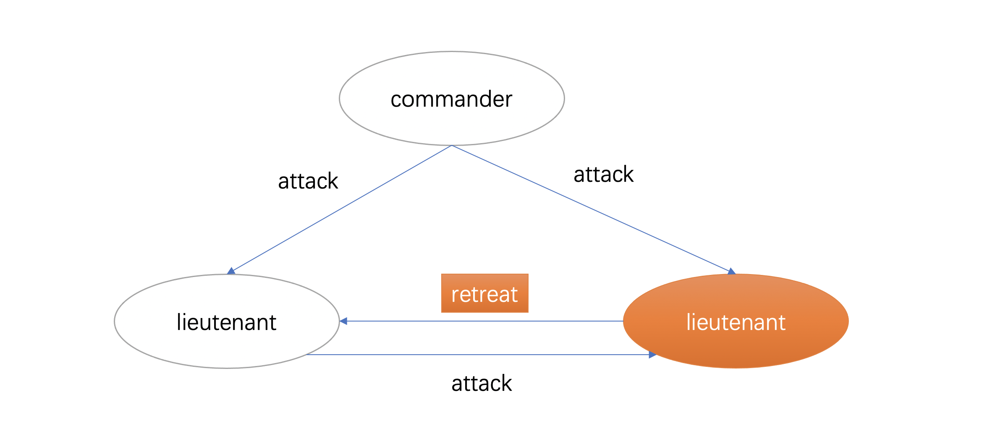
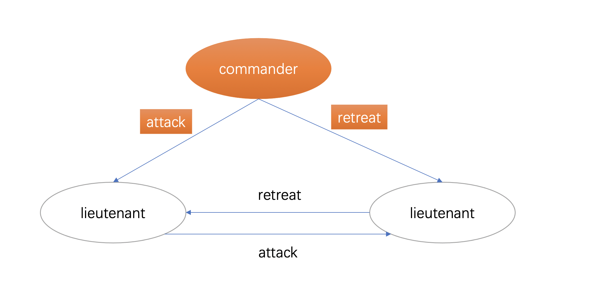
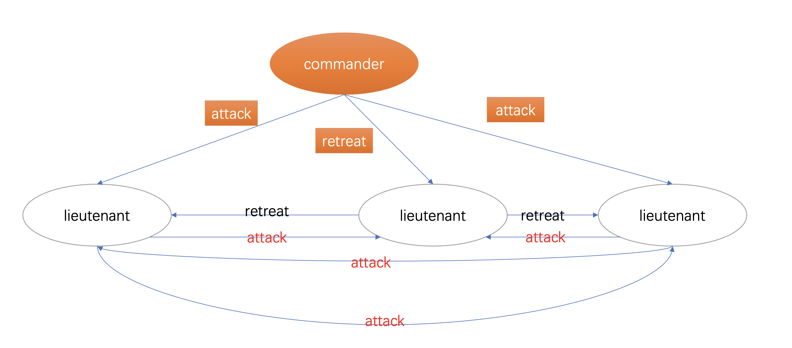
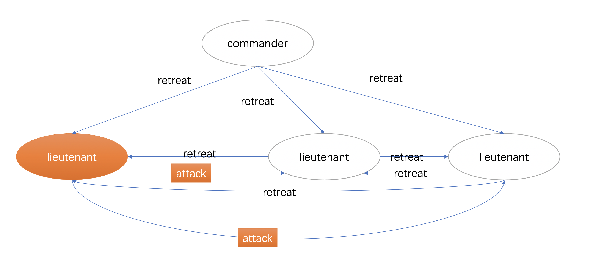

# 一致性问题

- [如何理解拜占庭问题](https://www.zhihu.com/question/23167269)
- [拜占庭将军问题 (The Byzantine Generals Problem)](https://zhuanlan.zhihu.com/p/107439021)

## 拜占庭将军问题

### 描述

假设拜占庭有 n 个部队分别驻扎在不同的城市，这 n 个部队之间只能靠传递消息来进行通信，然后可以分成两种不同的模型：

1. 所有的部队的指挥官（commander）都是忠诚的，只是消息传递的过程中可能会丢失；
2. commander 可能存在叛徒，他会恶意的篡改传递的消息；

---

#### 简化模型

为了保证那些忠诚的将军达成一致，我们必须要满足两个条件：

A. 所有诚实的将军们必须达成相同的行动计划；

B. 当只有少数将军是叛徒的时候，这些叛徒不能导致诚实的将军采纳一个糟糕的计划。

假设 `v(i)` 表示第i个将军决定。每个将军需要使用某种方法来根据收到的信息v(1),v(2)……v(n)来拟定作战计划，这里的n表示将军总数。

将军们可以互相传递各自的v(i)，但是为了满足条件A, 也就是要保证所有诚实的将军应该收到相同v(1),v(2)……v(n)序列。但是一个叛徒可能会给不同的将军发送不同的观察结果，所以将军没有必要直接使用一个从第i个将军那收到的v(i)值，可能采用从其他将军们处收到的v(i)的值，而采用从其他将军处收到的v(i)值存在叛徒篡改了v(i)值可能性，这样即使第i将军是诚实的，但是经过叛徒修改转发的值已不确定了。所以为了满足条件A，等价于需要满足下面条件：

1. 一致性：每个诚实的将军必须得到相同的v(1),v(2)……v(n)，也就是得到相同的作战计划。
2. 正确性：如果第i个将军是诚实的，那么其他诚实的将军必须使用他发送的值作为v(i)的值。

一致性很好理解，如果每个诚实的将军收到的作战计划不一样，那么这些诚实的将军得到的最终作战计划也可能是不一样的。

正确性则是为了保证诚实的将军的作战计划能够正确传递。例如，假设将军 i 是诚实的将军，他的作战计划 `v[i] = attack`，但是在经过传递之后被叛徒们篡改，最后所有的城市的将军的作战计划中 `v[i] = retreat`，那么我们是不能够满足条件 `2` 的。

**在 `1` 中，条件是针对于所有将军的，而条件 `2` 则是针对单个将军的。而 `1` 我们可以简化为**:

>1' 任意两个诚实的将军使用相同的v(i)值

我们可以看到条件1和1’是完全等价的，同时看到条件1’和2现在都只涉及一个将军i如何向其他将军传达自己的值v(i)， **因此可以进一步简化，不妨只考虑一个将军如何发送他的值给其他将军，即指挥官-副官模式** ，因为其他将军发送各自的值过程一样的，**这就是论文所说的拜占庭将军问题**。在这定义发送消息的将军为指挥官，其他为副官。

在有n个将军（包括指挥官和n-1个副官）情况下，指挥官向他的n-1个副官发送命令，需要满足以下充分条件：

**IC1. 所有诚实的副官都遵守相同的命令，即一致性；**

**IC2. 如果指挥官是诚实的，那么每个诚实的副官必须遵守指挥官的命令，即正确性。**

#### 失效边界、不可能性证明

**论文在探索失效边界得出的结论是在诚实将军不超过2/3的时候无解**。证明方案是先通过构造一个3将军模型证明无解，然后通过反证法，假设3m个将军中有m个叛徒时候有解，在推算到3将军模型时与之前的3将军模型无解的结论相矛盾。

#### 模型2：存在将军是叛徒

在上面的模型中，很明显忠诚的 `lieutenant` 现在没办法决定到底是 attack 还是 retreat 了。

在上面的模型中，两个忠诚的 `lieutenant` 都没办法决定是 attack 还是 retreat 了。

在上面的模型中，每个 `lieutenant` 收到的票都是 `2 票 attack，1 票 retreat`，也就是最后可以达成共识。

但是这又面临了一个问题： **假设 `retreat` 才是正确的决定呢？**

这里，是 commander 是叛徒的情况下，而实际上，所有的人都会投票：也就是说 **还存在另外三次投票，这三次投票的 commander 都是忠诚的。** 而在这三次投票中，每次 commander 都会投票到正确的决策。

可以这么理解，假设 `retreat` 作为正确的决定。那么在这次叛徒作为 commander 的投票中，attack 得到了一票。而在另外三次忠诚的将领作为 commander 的投票中，retreat 得到了三次投票。

最后的结果就是大家一起 `retreat`的将领作为 commander 的投票中，retreat 得到了三次投票，而 attack 只得到了一票投票。那么三个忠诚的将领可以一起撤退了。

在上面的模型中，忠诚的将领作为 commander 投票 `retreat`，并且无论叛徒 `lieutenant` 投票 `retreat` 还是 `attack` 都影响不了最终的决定。

### 口头消息算法的解

在给出具体解算法之前，先明确下口头消息的含义。我们将满足以下是哪个条件的方式叫做口头消息协议:

1. 每个发送的消息都会被正确传输
2. 消息的接收者知道发送者是谁
3. 消息的缺席或丢失可以检测出来

`1` 和 `2` 是防止叛徒接入其他两个将军的通信中，根据 `1`,叛徒无法妨碍其他两位将军发送的消息，根据 `2`,叛徒不能伪造身份来误导其他将军的交流。`3` 是为了防止一个叛徒通过简单的不发送消息来影响最终的决定。

针对A3,当一个指挥官是叛徒时，他可能会不发送任何命令。由于诚实的副官们必须遵守相同的命令，针对这种情况，诚实的副官们必须有一个默认的命令。沿用论文中的RETREAT（撤退）作为默认命令。

#### 口头消息算法的实现

1. 定义口头消息算法为 `OM(f)`，其中 f 为叛徒的数量。
2. 定义函数 `majority`，它接受一个数组 `[v1, v2, v3, ..., vn]` 作为参数，并返回出现次数超过半数的值 `v`，否则默认值为 `retreat`

>OM(f) 算法过程如下：

OM(0)：

1. commander 向所有的 lieutenant 发送值 `v`
2. 所有的 lieutenant **直接使用** 从 commander 接收到的值 `v` 作为指挥官的值，如果没有则使用默认值 `retreat`

OM(f):

1. commander 向所有的 lieutenant 发送值 `v`
2. 对于任意的 lieutenant，vi 代表从 commander 那边接收的值，如果没有收到则使用默认值 `retreat`。这位副官i将开始扮演 `OM(f-1)` 中的 commander，向剩余的 `n-2` 位副官发送值 `vi`（这相当于告诉其他的 lieutenant，我从指挥官那里收到的值是 `vi`）
3. 对于任意的 lieutenant[i]，并且 `i != j`，v[j] 代表从步骤 `2` 从 lieutenant[i] 那里收到的值。**当 lieutenant[i] 收到了 `n-1` 个值（表示投票已经完成）或者超时（所有没有收到的投票都是用默认值）**。调用 `majority(v1, v2, ..., vn-1)`，并将得到的结果作为实际的值。

整个过程相当于，首先 commander 向所有的 lieutenant 说，我的值是 `v`，然后每一 lieutenant 又告诉除了自身和 commander 之外的机器，commander 的值是 `v`。最终所有的人去根据这个互相传播的消息来达成共识。

#### f = 1, n = 4

>对于 `f = 1, n = 4` 的情况，我们总共需要 `4 * 3 * 2` 轮投票。

.png)

以 `lieutenant1` 作为 commander 发起 `OM(1)` 为例子，并且 `lieutenant2` 为叛徒。

1. lieutenant1 向 lieutenant2, lieutenant3, lieutenant4 发起 `OM(1)` 投票，假设发出的值是 `v`。此时 lieutenant2 = [v], lieutenant3 = [v], lieutenant4 = [v]
2. lieutenant2 发起 `OM(0)` 投票，由于 lieutenant2 是叛徒，所以他发出的值是未知的，我们假设为 `x` 和 `y`。此时 lieutenant2 = [v], lieutenant3 = [v, x], lieutenant4 = [v, y]
3. lieutenant3 发起 `OM(0)` 投票，他使用了 lieutenant1 的值 `v`，此时 lieutenant2 = [v, v], lieutenant3 = [v, x], lieutenant4 = [v, y, v]
4. lieutenant4 发起 `OM(0)` 投票，他使用了 lieutenant1 的值 `v`，此时 lieutenant2 = [v, v, v], lieutenant3 = [v, x, v], lieutenant4 = [v, y, v]

可以看到，不管 lieutenant2 如何投票，都不会影响最终的结果。那么 lieutenant3 和 lieutenant4 都知道结果是 `v` 了。然后重复的以其他三个将军作为 commander 投票即可。

## zookeeper leader election
