# TiDB in Action

## 第一部分 TIDB 原理和特性

### 第1章 TiDB 整体架构

相比传统的单机数据库，TiDB 有以下的一些优势：

- 分布式架构
- 支持并兼容大部分 MySQL 语法
- 默认支持高可用
- 支持 ACID 事务
- 工具链生态完善

整体的架构拆分成多个大的模块，大的模块之间互相通信，组成完整的 TiDB 系统


这三个大模块相互通信，每个模块都是分布式的架构，在 TiDB 中，对应的这几个模块叫做：


1. TiDB (tidb-server, https://github.com/pingcap/tidb): SQL 层，对外暴露 MySQL 协议的连接 endpoint，负责接受客户端的连接，执行 SQL 解析和优化，最终生成分布式执行计划。**无状态**
2. TiKV (tikv-server, https://github.com/pingcap/tikv) : 分布式 KV 存储，类似 NoSQL 数据库。TiKV 的 API 能够在 KV 键值对层面提供对分布式事务的原生支持，默认提供了 **SI （Snapshot Isolation）的隔离级别**，这也是 TiDB 在 SQL 层面支持分布式事务的核心，上面提到的 TiDB SQL 层做完 SQL 解析后，会将 SQL 的执行计划转换为实际对 TiKV API 的调用。
3. Placement Driver (pd-server，简称 PD，https://github.com/pingcap/pd): 整个 TiDB 集群的元信息管理模块，负责存储每个 TiKV 节点实时的数据分布情况和集群的整体拓扑结构，提供 Dashboard 管控界面，并为分布式事务分配事务 ID。PD 不仅仅是单纯的元信息存储，同时 PD 会根据 TiKV 节点实时上报的数据分布状态，下发数据调度命令给具体的 TiKV 节点，可以说是整个集群的「大脑」，另外 PD 本身也是由至少 3 个对等节点构成，拥有高可用的能力。
4. TiFlash 是一类特殊的存储节点，和普通 TiKV 节点不一样的是，在 TiFlash 内部，数据是以列式的形式进行存储，主要的功能是为分析型的场景加速。

### 第2章 说存储

#### 2.1 Key-Value Pairs (键值对)

TiKV 的选择是 Key-Value 模型，并且提供 **有序遍历** 方法

1. 这是一个巨大的 Map（可以类比一下 C++ 的 std::map），也就是存储的是 Key-Value Pairs（键值对）
2. 这个 Map 中的 Key-Value pair 按照 **Key 的二进制顺序有序**，也就是可以 Seek 到某一个 Key 的位置，然后不断地调用 Next 方法以递增的顺序获取比这个 Key 大的 Key-Value。

> **TiKV 的 KV 存储模型和 SQL 中的 Table 无关！**

#### 2.2 本地存储（RocksDB）

开发一个单机存储引擎工作量很大，所以直接选择 RocksDB 作为存储引擎。

#### 2.3 Raft 协议

接下来 TiKV 的实现面临一件更难的事情：如何保证单机失效的情况下，数据不丢失，不出错？

Raft 提供几个重要的功能：

1. Leader（主副本）选举
2. 成员变更（如添加副本、删除副本、转移 Leader 等操作）
3. 日志复制


#### 2.4 Region

前面提到，我们将 TiKV 看做一个巨大的有序的 KV Map，那么为了实现存储的水平扩展，我们需要将数据分散在多台机器上。对于一个 KV 系统，将数据分散在多台机器上有两种比较典型的方案：

- Hash：按照 Key 做 Hash，根据 Hash 值选择对应的存储节点
- Range：按照 Key 分 Range，某一段连续的 Key 都保存在一个存储节点上

TiKV 选择了第二种方式，将整个 Key-Value 空间分成很多段，每一段是一系列连续的 Key，将每一段叫做一个 Region，并且会尽量保持每个 Region 中保存的数据不超过一定的大小，目前在 TiKV 中默认是 96MB。每一个 Region 都可以用 [StartKey，EndKey) 这样一个左闭右开区间来描述。


将数据划分成 Region 后，TiKV 将会做两件重要的事情：

1. 以 Region 为单位，将数据分散在集群中所有的节点上，并且尽量保证每个节点上服务的 Region 数量差不多
2. 以 Region 为单位做 Raft 的复制和成员管理

对于第一点，PD 会负责：

1. 使得 Region 尽可能的均匀的分布在不同的节点，以实现水平扩容和负载均衡；
2. 记录 Region 在节点上的分布情况，也就是通过 key 可以查询 key 在哪个 Region 中，以及 Region 在哪个节点上。

对于第二点：

一个 Region 会拥有多个副本（称之为 Replica）并分布在多个不同的几点上，构成一个 Raft Group。**读和写操作都在 leader 上完成，读只需要在 leader 上完成，写在 leader 上完成之后通过 Raft 复制到 follower**


#### 2.5 MVCC(Multi-Version Concurrency Control)

TiKV 的 MVCC 实现是通过在 Key 后面添加版本号来实现，简单来说，没有 MVCC 之前，可以把 TiKV 看做这样的：

```
Key1 -> Value
Key2 -> Value
……
KeyN -> Value
```

有了 MVCC 之后，TiKV 的 Key 排列是这样的：

```
Key1_Version3 -> Value
Key1_Version2 -> Value
Key1_Version1 -> Value
……
Key2_Version4 -> Value
Key2_Version3 -> Value
Key2_Version2 -> Value
Key2_Version1 -> Value
……
KeyN_Version2 -> Value
KeyN_Version1 -> Value
……
```

**注意，对于同一个 Key 的多个版本，我们把版本号较大的放在前面，版本号小的放在后面（回忆一下 Key-Value 一节我们介绍过的 Key 是有序的排列）**

这样当用户通过一个 Key + Version 来获取 Value 的时候，可以通过 Key 和 Version 构造出 MVCC 的 Key，也就是 Key_Version。然后可以直接通过 RocksDB 的 SeekPrefix(Key_Version) API，定位到第一个大于等于这个 Key_Version 的位置。

#### 2.6 分布式 ACID 事务

TiKV 的事务采用的是 Google 在 BigTable 中使用的事务模型：[Percolator](https://research.google.com/pubs/pub36726.html)

在 TiKV 层的事务 API 的语义类似下面的伪代码：

```
tx = tikv.Begin()
    tx.Set(Key1, Value1)
    tx.Set(Key2, Value2)
    tx.Set(Key3, Value3)
tx.Commit()
```

### 第3章 谈计算

#### 3.1 表数据与 Key-Value 的映射关系

TiDB 数据到 kv 的映射主要分为两个部分：

1. 表中每一行的数据，称之为 `表数据`
2. 表中索引的数据，称之为 `索引数据`

##### 3.1.1 表数据与 Key-Value 的映射关系

在关系型数据库中，一个表可能有很多列。要将一行中各列数据映射成一个 (Key, Value) 键值对 ，需要考虑如何构造 Key。

1. OLTP 场景下有大量针对单行或者多行的增、删、改、查等操作，要求数据库具备快速读取一行数据的能力。因此，对应的 Key 最好有一个唯一 ID （显示或隐式的 ID），以方便快速定位。
2. 很多 OLAP 型查询需要进行全表扫描。如果能够将一个表中所有行的 Key 编码到一个区间内，就可以通过范围查询高效完成全表扫描的任务，**因为不同的表存储在一个 TiKV 集群中**

基于上述考虑：

1. 为了保证同一个表的数据放在一起，方便查找，TiDB 会为每个表分配一个表 ID，用 `TableID` 表示。表 ID 是一个整数，在整个集群内唯一。
2. TiDB 会为表中每行数据分配一个行 ID，用 `RowID` 表示。行 ID 也是一个整数，在表内唯一。对于行 ID，TiDB 做了一个小优化，如果某个表有整数型的主键，TiDB 会使用主键的值当做这一行数据的行 ID。

每行数据按照如下规则编码成 (Key, Value) 键值对：

```
Key:   tablePrefix{TableID}_recordPrefixSep{RowID}
Value: [col1, col2, col3, col4]
```

其中 `tablePrefix` 和 `recordPrefixSep` 都是特定的字符串常量，用于在 Key 空间内区分其他数据。其具体值在后面的小结中给出。

##### 3.1.2 索引数据和 Key-Value 的映射关系

TiDB 同时支持主键和二级索引（包括唯一索引和非唯一索引）。与表数据映射方案类似，TiDB 为表中每个索引分配了一个索引 ID，用 `IndexID` 表示。

对于主键和唯一索引，我们需要根据键值快速定位到对应的 `RowID`，因此，按照如下规则编码成 (Key, Value) 键值对：

```
Key:   tablePrefix{tableID}_indexPrefixSep{indexID}_indexedColumnsValue
Value: RowID
```

对于主键和唯一索引，我们需要根据键值快速定位到对应的 RowID，因此，按照如下规则编码成 (Key, Value) 键值对：

```
Key:   tablePrefix{tableID}_indexPrefixSep{indexID}_indexedColumnsValue
Value: RowID
```

对于不需要满足唯一性约束的普通二级索引，一个键值可能对应多行，我们需要根据键值范围查询对应的 RowID。 因此，按照如下规则编码成 (Key, Value) 键值对：

```
Key:   tablePrefix{TableID}_indexPrefixSep{IndexID}_indexedColumnsValue_{RowID}
Value: null
```

##### 3.1.3 映射关系小结

最后，上述所有编码规则中的 `tablePrefix`，`recordPrefixSep` 和 `indexPrefixSep` 都是字符串常量，用于在 Key 空间内区分其他数据，定义如下：

```
tablePrefix     = []byte{'t'}
recordPrefixSep = []byte{'r'}
indexPrefixSep  = []byte{'i'}
```

上述方案中，无论是表数据还是索引数据的 Key 编码方案，一个表内所有的行都有相同的 Key 前缀，一个索引的所有数据也都有相同的前缀。

表内的行的前缀是

```
tablePrefix{TableID}_recordPrefixSep
```

主键索引，唯一索引，二级索引的前缀是

```
tablePrefix{tableID}_indexPrefixSep{indexID}_
```

这样具有相同的前缀的数据，在 TiKV 的 Key 空间内，是排列在一起的。因此只要小心地设计后缀部分的编码方案，保证编码前和编码后的比较关系不变，就可以将表数据或者索引数据有序地保存在 TiKV 中。**采用这种编码后，一个表的所有行数据会按照 `RowID` 顺序地排列在 TiKV 的 Key 空间中，某一个索引的数据也会按照索引数据的具体的值（编码方案中的 `indexedColumnsValue` ）顺序地排列在 Key 空间内。**

##### 3.1.4 Key-Value 映射关系的一个例子

假设 TiDB 中有如下这个表：

```sql
CREATE TABLE User {
    ID int,
    Name varchar(20),
    Role varchar(20),
    Age int,
    PRIMARY KEY (ID),
    KEY idxAge (Age)
};
```

假设该表中有 3 行数据：

```
1, "TiDB", "SQL Layer", 10
2, "TiKV", "KV Engine", 20
3, "PD", "Manager", 30
```

首先每行数据都会映射为一个 (Key, Value) 键值对，同时该表有一个 `int` 类型的主键，所以 `RowID` 的值即为该主键的值。假设该表的 `TableID` 为 10，则其存储在 TiKV 上的表数据为：**注意，这里 TiDB 使用了主键索引的值作为这一行数据的行ID，所以不需要先通过索引查找行ID，再通过行ID查找实际的value。**

```
t10_r1 --> ["TiDB", "SQL Layer", 10]
t10_r2 --> ["TiKV", "KV Engine", 20]
t10_r3 --> ["PD", "Manager", 30]
```

除了主键外，该表还有一个非唯一的普通二级索引 `idxAge`，假设这个索引的 `IndexID` 为 1，则其存储在 TiKV 上的索引数据为：

```
t10_i1_10_1 --> null
t10_i1_20_2 --> null
t10_i1_30_3 --> null
```

> 前面提到，TiKV 提供了 `有序遍历`，那么只要这些 key 编码前和编码后顺序不变，那么他们也是应该有序排列的。
>
> 在这个例子中，主键索引的前缀是 `t10_i`，二级索引的前缀是 `t10_i1_`
>
> 当我们有以下SQL的时候
>
> ```sql
> # 查询主键索引
> SELECT * FROM User WHERE ID = 1;
> ```
>
> 我们可以直接定位到 `t10_i1` 并查询对应的值；
>
> 当我们有以下SQL的时候
>
> ```sql
> # 查询二级索引
> SELECT * FROM User WHERE Age = 10;
> ```
>
> ```java
> // TODO 在搜索二级索引的时候，是否是先定位到前缀然后遍历？
> ```
>
> 我们可以定位到前缀 `t10_i1_10_`，然后顺序遍历直到前缀不同的地方就是我们的二级索引包含的行。

#### 3.2 元信息管理

TiDB 中每个 `Database` 和 `Table` 都有元信息，也就是其定义以及各项属性。这些信息也需要持久化，TiDB 将这些信息也存储在了 TiKV 中。

每个 `Database`/`Table` 都被分配了一个唯一的 ID，这个 ID 作为唯一标识，并且在编码为 Key-Value 时，这个 ID 都会编码到 Key 中，再加上 `m_` 前缀。这样可以构造出一个 Key，Value 中存储的是序列化后的元信息。

除此之外，TiDB 还用一个专门的 (Key, Value) 键值对存储当前所有表结构信息的最新版本号。这个键值对是全局的，每次 DDL 操作的状态改变时其版本号都会加1。目前，TiDB 把这个键值对存放在 pd-server 内置的 etcd 中，其Key 为"/tidb/ddl/global_schema_version"

#### 3.3 SQL 层简介

SQL 层即 `tidb-server`，负责将 SQL 翻译成 KV 操作，查询 TiKV 并组装 TiKV 返回结果。**节点是无状态的。**

##### 3.3.1 SQL 运算

```sql
select count(*) from user where name = "TiDB"
```

以上 SQL 的执行流程为：

1. 构造出 Key Range：一个表中所有的 `RowID` 都在 `[0, MaxInt64)` 这个范围内，那么我们用 `0` 和 `MaxInt64` 根据行数据的 `Key` 编码规则，就能构造出一个 `[StartKey, EndKey)`的左闭右开区间。
2. 扫描 Key Range：根据上面构造出的 Key Range，读取 TiKV 中的数据
3. 过滤数据：对于读到的每一行数据，计算 `name = "TiDB"` 这个表达式，如果为真，则向上返回这一行，否则丢弃这一行数据
4. 计算 `Count(*)`：对符合要求的每一行，累计到 `Count(*)` 的结果上面


这个方案的性能并不好：

1. 每一行都有一次RPC调用；
2. 每一行都读取数据，有大量无效IO
3. 读取行属性其实无意义，在列比较长的时候无效IO过多

##### 3.3.2 分布式 SQL 运算

优化的方法是

1. 将条件计算下推到存储节点，减少无效RPC调用和网络IO
2. 将聚合计算下推到存储节点，避免网络IO

实际：

1. SQL 中的谓词下推，可以只读取符合条件的行，并且只需要一次 RPC
2. 聚合计算下推，不需要返回每个节点的 `Count(*)`


##### 3.3.3 SQL 层架构

下面这个图列出了重要的模块以及调用关系：


### 第4章 讲调度

PD 负责全局元信息的存储以及 TiKV 集群负载均衡调度

#### 4.1 调度概述

##### 4.1.1 为什么要进行调度

请思考下面这些问题：

- 如何保证同一个 Region 的多个 Replica 分布在不同的节点上？更进一步，如果在一台机器上启动多个 TiKV 实例，会有什么问题？
- TiKV 集群进行跨机房部署的时候，如何保证一个机房掉线，不会丢失 Raft Group 的多个 Replica？
- 添加一个节点进入 TiKV 集群之后，如何将集群中其他节点上的数据搬过来?
- 当一个节点掉线时，会出现什么问题？整个集群需要做什么事情？
  - 从节点的恢复时间来看
    - 如果节点只是短暂掉线（重启服务），如何处理？
    - 如果节点是长时间掉线（磁盘故障，数据全部丢失），如何处理？
  - 假设集群需要每个 Raft Group 有 N 个副本，从单个 Raft Group 的 Replica 个数来看
    - Replica 数量不够（例如节点掉线，失去副本），如何处理？
    - Replica 数量过多（例如掉线的节点又恢复正常，自动加入集群），如何处理？
- 读/写都是通过 Leader 进行，如果 Leader 只集中在少量节点上，会对集群有什么影响？
- 并不是所有的 Region 都被频繁的访问，可能访问热点只在少数几个 Region，这个时候我们需要做什么？
- 集群在做负载均衡的时候，往往需要搬迁数据，这种数据的迁移会不会占用大量的网络带宽、磁盘 IO 以及 CPU，进而影响在线服务？

##### 4.1.2 调度的需求

**作为一个分布式高可用存储系统，必须满足的需求，包括四种：**

- 副本数量不能多也不能少
- 副本需要分布在不同的机器上
- 新加节点后，可以将其他节点上的副本迁移过来
- 自动下线失效节点，同时将该节点的数据迁移走

**作为一个良好的分布式系统，需要优化的地方，包括：**

- 维持整个集群的 Leader 分布均匀
- 维持每个节点的储存容量均匀
- 维持访问热点分布均匀
- 控制负载均衡的速度，避免影响在线服务
- 管理节点状态，包括手动上线/下线节点

满足第一类需求后，整个系统将具备强大的容灾功能。满足第二类需求后，可以使得系统整体的负载更加均匀

##### 4.1.3 调度的基本操作

调度基本可以抽象为以下三个操作：

1. 增加一个 Replica
2. 删除一个 Replica
3. 将 Leader 角色在一个 Raft Group 的不同 Replica 之间 transfer（迁移）。

刚好 Raft 协议通过 `AddReplica`、`RemoveReplica`、`TransferLeader` 这三个命令，可以支撑上述三种基本操作。

##### 4.1.4 信息收集

TiKV 集群会向 PD 汇报两类消息，TiKV 节点信息和 Region 信息：

**每个 TiKV 节点会定期向 PD 汇报节点的状态信息**

TiKV 节点（Store）与 PD 之间存在心跳包，一方面 PD 通过心跳包检测每个 Store 是否存活，以及是否有新加入的 Store；另一方面，心跳包中也会携带这个 [Store 的状态信息](https://github.com/pingcap/kvproto/blob/release-3.1/proto/pdpb.proto#L421)，主要包括：

- 总磁盘容量
- 可用磁盘容量
- 承载的 Region 数量
- ...

**每个 Raft Group 的 `Leader` 会定期向 PD 汇报 Region 的状态信息**

每个 Raft Group 的 Leader 和 PD 之间存在心跳包，用于汇报这个[ Region 的状态](https://github.com/pingcap/kvproto/blob/release-3.1/proto/pdpb.proto#L271)，主要包括下面几点信息：

- Leader 的位置
- Followers 的位置
- 掉线 Replica 的个数
- 数据写入/读取的速度

##### 4.1.5 调度的策略

- 保证 Region 的 Replica 数量正常，不能多也不能少
- 一个 Raft Group 中的 Region 不在一个位置（不在一个节点，不在一个机架，不在一个机房，不在一个IDC等）,可以给节点配置 [labels](https://github.com/tikv/tikv/blob/v4.0.0-beta/etc/config-template.toml#L140) 并且通过在 PD 上配置 [location-labels](https://github.com/pingcap/pd/blob/v4.0.0-beta/conf/config.toml#L100) 来指名哪些 label 是位置标识，需要在 Replica 分配的时候尽量保证一个 Region 的多个 Replica 不会分布在具有相同的位置标识的节点上
- 副本在 `Store` 之间分配均匀
- Leader 数量在 `Store` 上均匀分配
- 访问热点在 `Store` 上均匀分配
- 每个 Store 占用存储空间大致相等
- 控制调度速度

#### 4.2 弹性调度

##### 4.2.2 自动伸缩

Region 的热点调度分为以下几种情况：

1. 请求分布相对平均，范围广
2. 请求分布相对平均，区域小
3. 请求分布不平均，集中在多个点
4. 请求分布不均匀，集中在单个点

第一种不需要特殊处理；

第三种和第四种如何去做动态调整：

> 根据负载动态分裂（Load Base Splitting）

热点数据集中在几个 Region 中，造成无法利用多台机器资源的情况。TiDB 4.0 中引入了根据负载动态分裂特性，即根据负载自动拆分 Region。其主要的思路借鉴了 CRDB 的[实现](https://www.cockroachlabs.com/docs/stable/load-based-splitting.html)，会根据设定的 QPS 阈值来进行自动的分裂。其主要原理是，若对该 Region 的请求 QPS 超过阈值则进行采样，对采样的请求分布进行判断。采样的方法是通过蓄水池采样出请求中的 20 个 key，然后统计请求在这些 key 的左右区域的分布来进行判断，如果分布比较平均并能找到合适的 key 进行分裂，则自动地对该 Region 进行分裂。

> 热点隔离（Isolate Frequently Access Region）

**由于 TiKV 的分区是按 Range 切分的，在 TiDB 的实践中自增主建、递增的索引的写入等都会造成单一热点的情况（很明显，自增主键的写入会在某个 Region 一直写入）**，另外如果用户没有对 workload 进行分区，且访问是 non-uniform 的，也会造成单一热点问题。

根据过去的最佳实践经验，往往需要用户调整表结构，采用分区表，使用 shard_bits 等方式来使得单一分区变成多分区，才能进行负载均衡。而在云环境中，在用户不用调整 workload 或者表结构的情况下，TiDB 可以通过在云上弹性一个高性能的机器，并由 PD 通过识别自动将单一热点调度到该机器上，达到热点隔离的目的。该方法也特别适用于时事、新闻等突然出现爆发式业务热点的情况。

### 第六章 TiDB 事务模型

TiDB 实现了快照隔离级别的分布式事务，支持悲观锁、乐观锁，同时也解决了业界的难点之一：大事务。

- 乐观事务
- 悲观事务
- 大事务

#### 6.1 乐观事务

本章介绍 TiDB 基于 Percolator 实现的乐观事务以及在使用上的最佳实践。

##### 6.1.1 事务

- Atomicity
- Consistency
- Isolation
- Durability

###### 6.1.1.1 隔离级别

对用户最友好的事务是 `串行事务`，但这种事务性能较差，所以在权衡后提供了一些新的事务隔离级别；

| Isolation Level  | Dirty Write  | Dirty Read   | Fuzzy Read   |   Phantom    |
| :--------------- | :----------- | :----------- | :----------- | :----------: |
| READ UNCOMMITTED | Not Possible | Possible     | Possible     |   Possible   |
| READ COMMITTED   | Not Possible | Not possible | Possible     |   Possible   |
| REPEATABLE READ  | Not Possible | Not possible | Not possible |   Possible   |
| SERIALIZABLE     | Not Possible | Not possible | Not possible | Not possible |

###### 6.1.1.2 并发控制

- 乐观并发控制（OCC）：在事务提交阶段检测冲突
- 悲观并发控制（PCC）：在事务执行阶段检测冲突

乐观并发控制期望事务间数据冲突不多，悲观并发控制更适合数据冲突较多的场景，能够避免乐观事务在这类场景下事务因冲突而回滚的问题。

##### 6.1.2 TiDB 乐观事务实现

TiDB 基于 Google [Percolator](https://storage.googleapis.com/pub-tools-public-publication-data/pdf/36726.pdf) 实现了支持完整 ACID、基于快照隔离级别（Snapshot Isolation）的分布式乐观事务。**TiDB 乐观事务需要将事务的所有修改都保存在 `内存`**中，直到提交时才会写入 TiKV 并检测冲突。

###### 6.1.2.1 Snapshot Isolation

Percolator 使用多版本并发控制（MVCC）来实现快照隔离级别，与可重复读的区别在于**整个事务是在一个一致的快照上执行**。TiDB 使用 [PD](https://github.com/pingcap/pd) 作为全局授时服务（TSO）来提供单调递增的版本号：

- 事务开始时获取 start timestamp，也是快照的版本号；事务提交时获取 commit timestamp，同时也是数据的版本号
- 事务只能读到在事务 start timestamp 之前最新已提交的数据
- 事务在提交时会根据 timestamp 来检测数据冲突

###### 6.1.2.2 两阶段提交（2PC）

TiDB 使用两阶段提交(Two-Phase Commit）来保证分布式事务的原子性，分为 Prewrite 和 Commit 两个阶段：

- Prewrite：对事务修改的每个 Key 检测冲突并写入 lock 防止其他事务修改。对于每个事务，TiDB 会从涉及到改动的所有 Key 中选中一个作为当前事务的 Primary Key，事务提交或回滚都需要先修改 Primary Key，以它的提交与否作为整个事务执行结果的标识。
- Commit：Prewrite 全部成功后，先同步提交 Primary Key，成功后事务提交成功，其他 Secondary Keys 会异步提交。

> Percolator 将事务的所有状态都保存在底层支持高可用、强一致性的存储系统中，从而弱化了传统两阶段提交中协调者（Coordinator）的作用，所有的客户端都可以根据存储系统中的事务状态对事务进行提交或回滚。

###### 6.1.2.3 两阶段提交过程

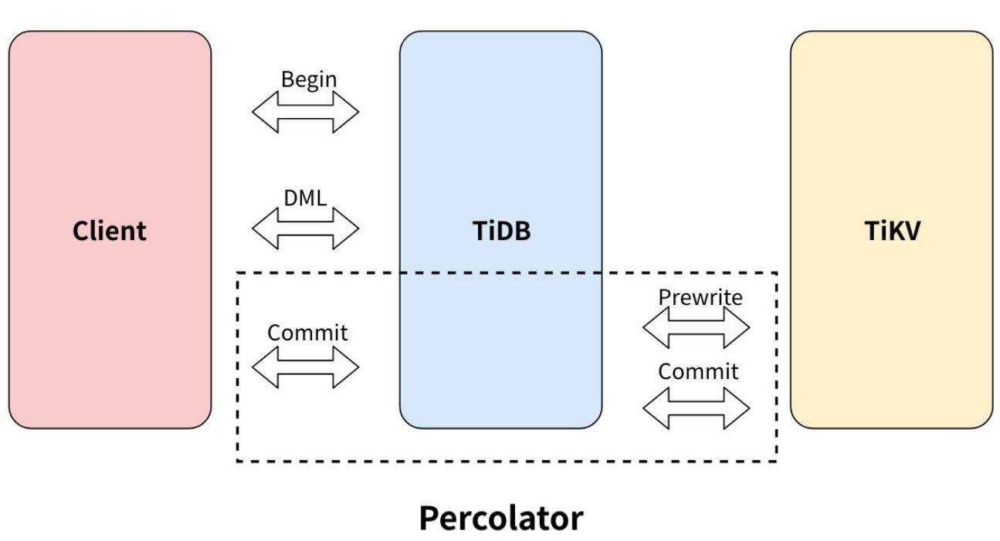

1. 客户端开始一个事务。
2. TiDB 向 `PD` 获取 `tso` 作为当前事务的 start timestamp。
3. 客户端发起读或写请求。
4. 客户端发起 Commit。
5. TiDB 开始**两阶段提交**，保证分布式事务的原子性，让数据真正落盘。
   1. i. TiDB 从当前要写入的数据中选择一个 Key 作为当前事务的 Primary Key。
   2. ii. TiDB 并发地向所有涉及的 TiKV 发起 Prewrite 请求。TiKV 收到 Prewrite 请求后，检查数据版本信息是否存在冲突，符合条件的数据会被加锁。**write 和 lock 都会检测。**
   3. iii. TiDB 收到所有 Prewrite 响应且所有 Prewrite 都成功。
   4. iv. TiDB 向 PD 获取第二个全局唯一递增版本号，定义为本次事务的 commit timestamp。
   5. v. TiDB 向 Primary Key 所在 TiKV 发起第二阶段提交。TiKV 收到 Commit 操作后，检查锁是否存在并清理 Prewrite 阶段留下的锁。
6. TiDB 向客户端返回事务提交成功的信息。
7. TiDB 异步清理本次事务遗留的锁信息。

##### 6.1.3 最佳实践

###### 6.1.3.1 小事务

从上面得知，每个事务提交需要经过 4 轮 RTT（Round trip time）：

- 从 PD 获取 2 次 Timestamp；
- 提交时的 Prewrite 和 Commit。

为了降低网络交互对于小事务的影响，建议将小事务打包来做。以如下 query 为例，当 `autocommit = 1` 时，下面三条语句各为一个事务：

```sql
UPDATE my_table SET a='new_value' WHERE id = 1;
UPDATE my_table SET a='newer_value' WHERE id = 2;
UPDATE my_table SET a='newest_value' WHERE id = 3;
```

此时每一条语句都需要经过两阶段提交，频繁的网络交互致使延迟率高。为提升事务执行效率，可以选择使用显式事务，即在一个事务内执行三条语句。优化后版本：

```sql
START TRANSACTION;
UPDATE my_table SET a='new_value' WHERE id = 1;
UPDATE my_table SET a='newer_value' WHERE id = 2;
UPDATE my_table SET a='newest_value' WHERE id = 3;
COMMIT;
```

同理，执行 `INSERT` 语句时，也建议使用显式事务。

###### 6.1.3.2 大事务

修改数据的单个事务过大时会存在以下问题：

- 客户端在提交之前，数据都写在内存中，而数据量过多时易导致 OOM (Out of Memory) 错误。
- 在第一阶段写入数据耗时增加，与其他事务出现读写冲突的概率会指数级增长，容易导致事务提交失败。
- 最终导致事务完成提交的耗时增加。

###### 6.1.3.3 事务冲突

(1) 冲突检测 乐观事务下，检测底层数据是否存在写写冲突是一个很重的操作。具体而言，TiKV 在 Prewrite 阶段就需要读取数据进行检测。为了优化这一块性能，TiDB 集群会在内存里面进行一次冲突预检测。作为一个分布式系统，TiDB 在内存中的冲突检测主要在两个模块进行：

- TiDB 层，如果在 TiDB 实例本身发现存在写写冲突，那么第一个写入发出去后，后面的写入就已经能清楚地知道自己冲突了，没必要再往下层 TiKV 发送请求去检测冲突。
- TiKV 层，主要发生在 Prewrite 阶段。因为 TiDB 集群是一个分布式系统，TiDB 实例本身无状态，实例之间无法感知到彼此的存在，也就无法确认自己的写入与别的 TiDB 实例是否存在冲突，所以会在 TiKV 这一层检测具体的数据是否有冲突。

(2) 事务的重试 使用乐观事务模型时，在高冲突率的场景中，事务很容易提交失败。比如 2 个事务同时修改相同行，提交时会有一个事务报错：

> ERROR 8005 (HY000) : Write Conflict, txnStartTS is stale

而 MySQL 内部使用的是悲观事务模型，在执行 SQL 语句的过程中进行冲突检测，所以提交时很难出现异常。为了兼容 MySQL 的悲观事务行为，降低用户开发和迁移的成本，TiDB 乐观事务提供了重试机制。当事务提交后，如果发现冲突，TiDB 内部重新执行包含写操作的 SQL 语句。可以通过设置 `tidb_disable_txn_auto_retry = off` 开启自动重试，并通过 `tidb_retry_limit` 设置重试次数

```sql
set @@global.tidb_disable_txn_auto_retry = 0;
set @@global.tidb_retry_limit = 10;
```

(3) 重试的局限性 TiDB 默认不进行事务重试，因为重试事务可能会导致更新丢失，从而破坏可重复读的隔离级别。事务重试的局限性与其原理有关。事务重试可概括为以下三个步骤：

1. 重新获取 start timestamp。
2. 重新执行包含写操作的 SQL 语句。
3. 再次进行两阶段提交。

第二步中，重试时仅重新执行包含写操作的 SQL 语句，并不涉及读操作的 SQL 语句。但是当前事务中读到数据的时间与事务真正开始的时间发生了变化，写入的版本变成了重试时获取的 start timestamp 而非事务一开始时获取的 start timestamp。

因此，当事务中存在依赖查询结果来更新的语句时，重试将无法保证事务原本可重复读的隔离级别，最终可能导致结果与预期出现不一致。在这种场景下可以使用 `SELECT FOR UPDATE` 来保证事务提交成功时原先查询的结果没有被修改，但包含 `SELECT FOR UPDATE` 的事务无法自动重试。

###### 6.1.3.4 垃圾回收（GC）

TiDB 的事务的实现采用了 MVCC（多版本并发控制）机制，当新写入的数据覆盖旧的数据时，旧的数据不会被替换掉，而是与新写入的数据同时保留，并以时间戳来区分版本。数据版本过多会占用大量空间，同时影响数据库的查询性能，GC 的任务便是清理不再需要的旧数据。

##### 6.1.5 如何判断集群的事务健康

###### 6.1.5.1 tikv监控--server板块

lock 的大小应该是比较小。

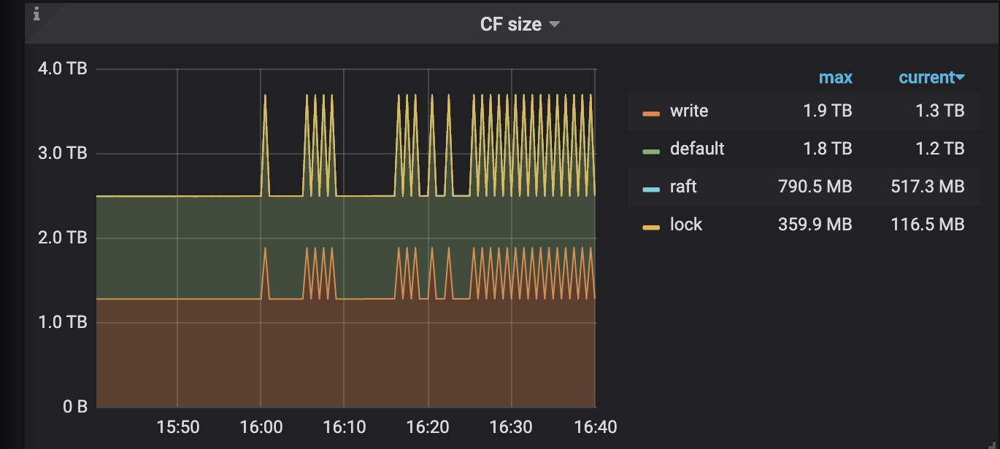

###### 6.1.5.2 tidb监控-transaction板块

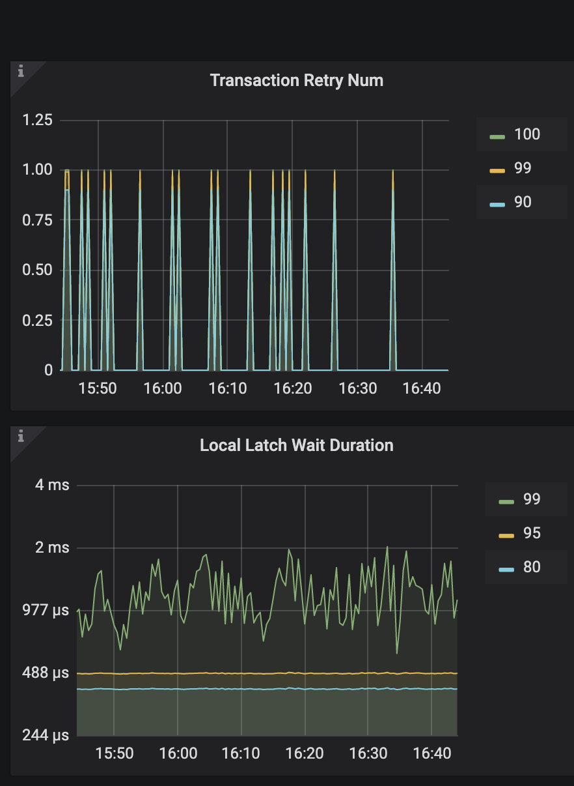

#### 6.2 悲观事务

##### 6.2.1 悲观锁解决的问题

通过支持悲观事务，降低用户修改代码的难度甚至不用修改代码：

- 在 v3.0.8 之前，TiDB 默认使用的乐观事务模式会导致事务提交时因为冲突而失败。为了保证事务的成功率，需要修改应用程序，加上重试的逻辑。
- 乐观事务模型在冲突严重的场景和重试代价大的场景无法满足用户需求，支持悲观事务可以 弥补这方面的缺陷，拓展 TiDB 的应用场景。

###### 6.2.2 基于 Percolator 的悲观事务

悲观事务在 Percolator 乐观事务基础上实现，在 Prewrite 之前增加了 Acquire Pessimistic Lock 阶段用于避免 Prewrite 时发生冲突：

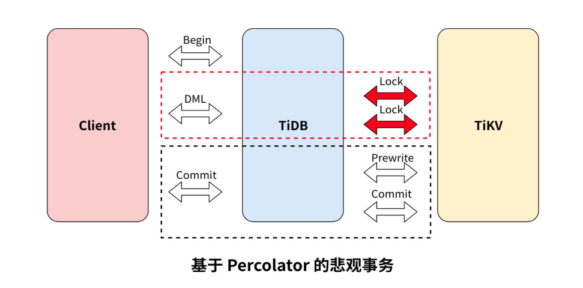

###### 6.2.2.1 等锁顺序

TiKV 中实现了 `Waiter Manager` 用于管理等锁的事务，当悲观事务加锁遇到其他事务的锁时，将会进入 `Waiter Manager` 中等待锁被释放，TiKV 会尽可能按照事务 start timestamp 的顺序来依次获取锁，从而避免事务间无用的竞争。

###### 6.2.2.2 分布式死锁检测

在 `Waiter Manager` 中等待锁的事务间可能发生死锁，而且可能发生在不同的机器上，`TiDB` 采用分布式死锁检测来解决死锁问题：

- 在整个 TiKV 集群中，有一个死锁检测器 leader。
- 当要等锁时，其他节点会发送检测死锁的请求给 leader。

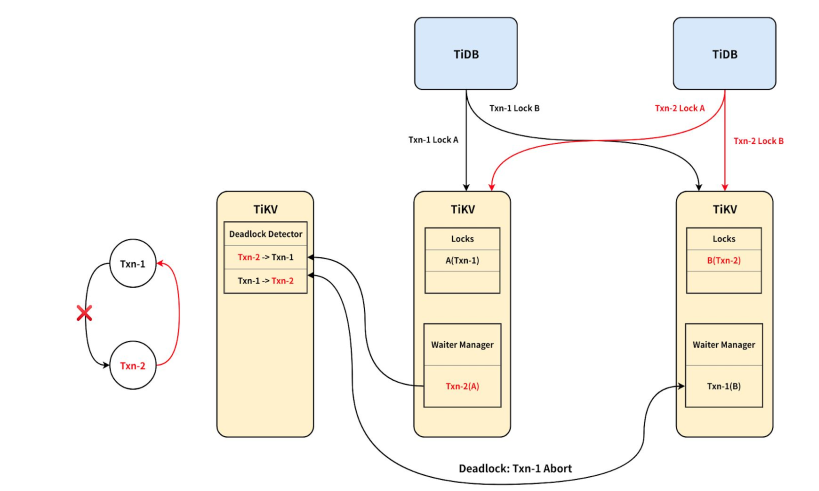

##### 6.2.3 最佳实践

###### 6.2.3.1 事务模型的选择

TiDB 支持乐观事务和悲观事务，并且**允许在同一个集群中混合使用事务模式**。

- 乐观事务：事务间没有冲突或允许事务因数据冲突而失败；追求极致的性能。
- 悲观事务：事务间有冲突且对事务提交成功率有要求；因为加锁操作的存在，性能会比乐观事务差。

###### 6.2.3.2 使用方法

- 执行 `BEGIN PESSIMISTIC`; 语句开启的事务，会进入悲观事务模式。
- 执行 `set @@tidb_txn_mode = 'pessimistic';`
- 执行 `set @@global.tidb_txn_mode = 'pessimistic';`

###### 6.2.3.3 Batch DML

```sql
BEGIN;
INSERT INTO my_table VALUES (1);
INSERT INTO my_table VALUES (2);
INSERT INTO my_table VALUES (3);
COMMIT;
```

下面的Batch DML性能更好

```sql
BEGIN;
INSERT INTO my_table VALUES (1), (2), (3);
COMMIT;
```

###### 6.2.3.4 隔离级别的选择

TiDB 在悲观事务模式下支持了 2 种隔离级别。

一 、默认的与 MySQL 行为基本相同的可重复读隔离级别（Repeatable Read）隔离级别。

二 、可设置 `SET SESSION TRANSACTION ISOLATION LEVEL READ COMMITTED;` 使用与 Oracle 行为相同的读已提交隔离级别 （Read Committed）。

### 第 7 章 TiDB DDL

本章主要分为四个章节，分别如下：

1. 表结构设计最佳实践。
2. 如何查看 DDL 状态。
3. Sequence
4. AutoRandom

#### 7.1 表结构设计最佳实践

##### 7.1.2 背景知识

TiDB 以 Region 为单位对数据进行切分，每个 Region 有大小限制（默认为 96MB）。Region 的切分方式是范围切分。每个 Region 会有多个副本，每一组副本，称为一个 Raft Group。每个 Raft Group 中由 Leader 负责执行这块数据的读和写（TiDB 即将支持 [Follower-Read](https://zhuanlan.zhihu.com/p/78164196)）。Leader 会自动地被 PD 组件均匀调度在不同的物理节点上，以均分读写压力。

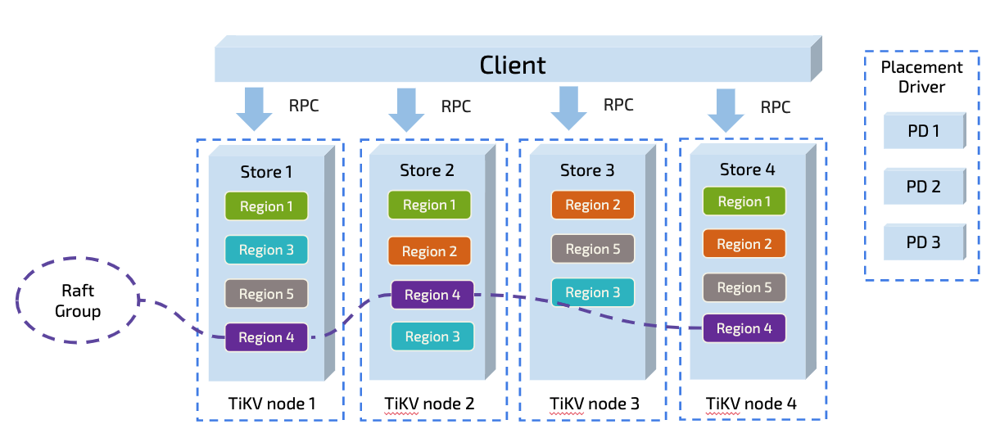

> 每个表对应了多个 Region，一个 Region 只会对应一个表，每一个 Region 里是一组有序的数据库记录。

##### 7.1.3 典型场景 - 大表高并发写入的性能瓶颈

###### 场景描述

在 TiDB 中，一个表被逻辑的按照主键顺序切分成了多个 Region ，所以如果 TiDB 中也是用递增主键的话，写入的数据就会主要写入到最后一个 Region 里，Region 又是 PD 调度的最小单位，所以这个 Region 在业务写入量较大的情况下，就会是一个热点 Region ，该 Region 所在的 TiKV 的能力决定了这个表甚至集群的写入能力。如果是多个 Region 出现热点读写，TiDB 的热点调度程序是可以将多个热点 Region 调度到不同的 TiKV 实例上来分散压力的。但是这个场景下只有一个热点 Region，因此无法通过调度来解决。

###### 如何定位

首先查看 Grafana 监控：`pd -> Statistics - hot write`

通过 pd-ctl 找到写入量最大的 Region 的 region_id：

```bash
pd-ctl -u 9.143.117.36:2379 region topwrite
```

然后通过 region_id 找到对应的表或者索引：

```bash
curl http://{{tidb-instance}}:10080/regions/{{region_id}}
```

###### 如何解决

既然 Region 是调度的最小单位，那就要想办法把写入的数据尽量打散到不同的 Region，以通过 Region 的调度来解决此类写入瓶颈问题。TiDB 的隐藏主键可以实现此类打散功能。

>TiDB 对于 PK 非整数或没有 PK 的表，会使用一个隐式的自增主键 rowID：_tidb_rowid，这个隐藏的自增主键可以通过设置 `SHARD_ROW_ID_BITS` 来把 rowID 打散写入多个不同的 Region 中，缓解写入热点问题。但是设置的过大也会造成 RPC 请求数放大，增加 CPU 和网络开销。

- SHARD_ROW_ID_BITS = 4 表示 2^4（16） 个分片

使用示例：

```sql
CREATE TABLE t (c int) SHARD_ROW_ID_BITS = 4;
ALTER TABLE t SHARD_ROW_ID_BITS = 4;
```

SHARD_ROW_ID_BITS 的值可以动态修改，每次修改之后，只对新写入的数据生效。可以根据业务并发度来设置合适的值来尽量解决此类热点 Region 无法打散的问题。

另外在 TiDB 3.1.0 版本中还引入了一个新的关键字 `AUTO_RANDOM` （实验功能），这个关键字可以声明在表的整数类型主键上，替代 `AUTO_INCREMENT`，让 TiDB 在插入数据时自动为整型主键列分配一个值，消除行 ID 的连续性，从而达到打散热点的目的，更详细的信息可以参考 [AUTO_RANDOM 详细说明](https://github.com/pingcap/docs-cn/blob/master/reference/sql/attributes/auto-random.md)。

##### 7.1.3 典型场景 - 新表高并发读写的瓶颈问题

###### 场景描述

这个场景和 [TiDB 高并发写入常见热点问题及规避方法](https://pingcap.com/docs-cn/stable/reference/best-practices/high-concurrency/) 中的 case 类似。

有一张简单的表：

```sql
CREATE TABLE IF NOT EXISTS TEST_HOTSPOT(
      id         BIGINT PRIMARY KEY,
      age        INT,
      user_name  VARCHAR(32),
      email      VARCHAR(128)
)
```

这个表的结构非常简单，除了 `id` 为主键以外，没有额外的二级索引。将数据写入该表的语句如下，`id` 通过随机数离散生成：

```sql
INSERT INTO TEST_HOTSPOT(id, age, user_name, email) values(%v, %v, '%v', '%v');
```

> 以上操作看似符合理论场景中的 TiDB 最佳实践，业务上没有热点产生。实际却和预想的不一样。

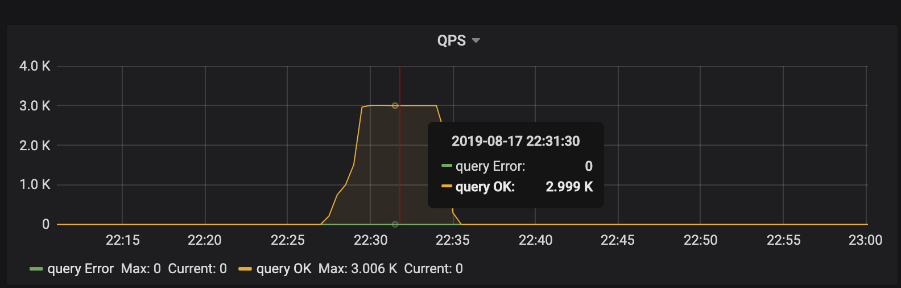

客户端在短时间内发起了“密集”的写入，TiDB 收到的请求是 3K QPS。理论上，压力应该均摊给 6 个 TiKV 节点。但是从 TiKV 节点的 CPU 使用情况上看，存在明显的写入倾斜（tikv - 3 节点是写入热点）：

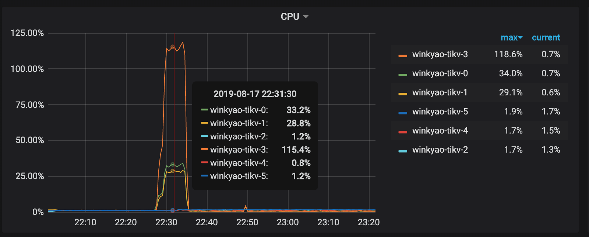

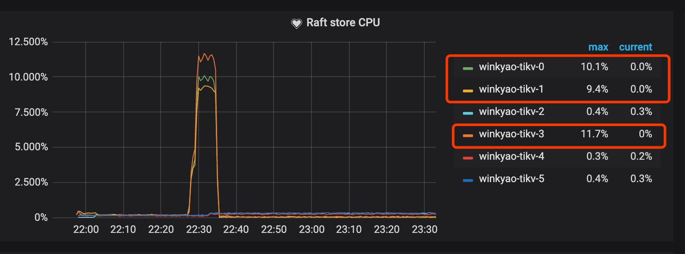

从 PD 的监控中也可以证明热点的产生：

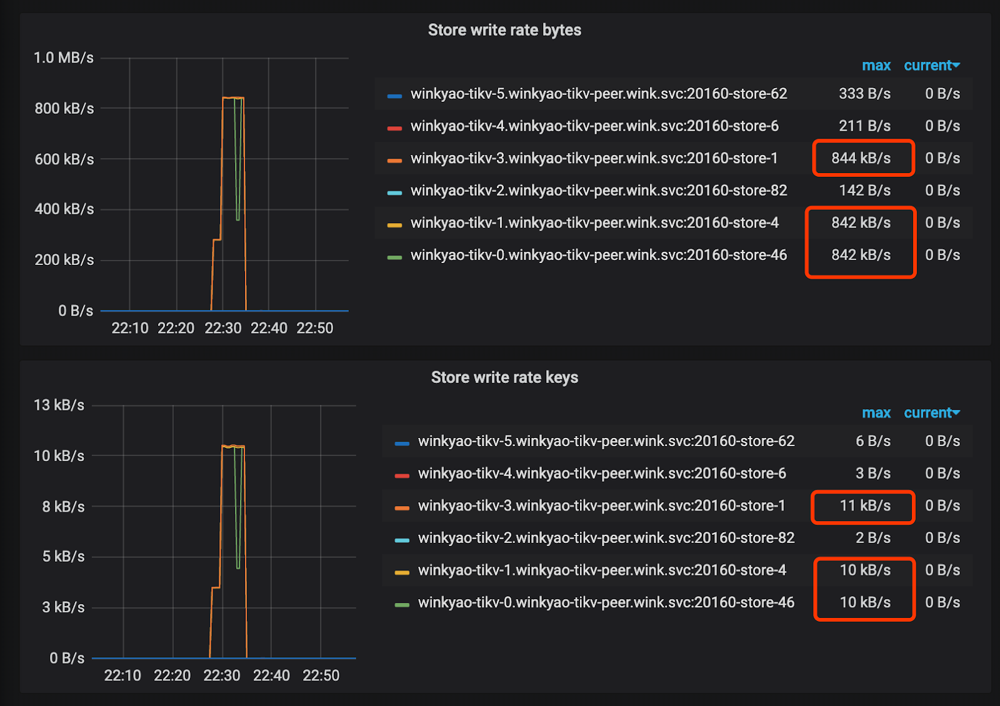

###### 热点问题产生的原因

刚创建表的时候，这个表在 TiKV 中只会对应为一个 Region，范围是：

> [CommonPrefix + TableID, CommonPrefix + TableID + 1)

短时间内大量数据会持续写入到同一个 Region 上。

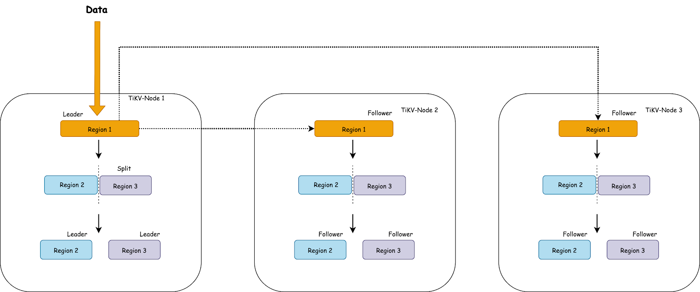

上图简单描述了这个过程，随着数据持续写入，TiKV 会将一个 Region 切分为多个。但因为首先发起选举的是原 Leader 所在的 Store，所以 **新切分好的两个 Region 的 Leader 很可能还会在原 Store 上**。新切分好的 Region 2，3 上，也会重复之前发生在 Region 1 上的过程。也就是压力会密集地集中在 TiKV-Node 1 上。

在持续写入的过程中，PD 发现 Node 1 中产生了热点，会将 Leader 均分到其他的 Node 上。如果 TiKV 的节点数多于副本数的话，TiKV 会尽可能将 Region 迁移到空闲的节点上。这两个操作在数据插入的过程中，也能在 PD 监控中得到印证：

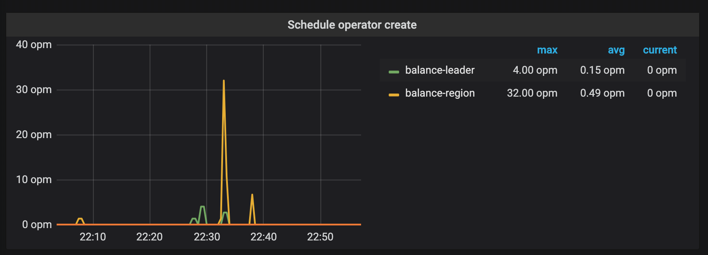

**在持续写入一段时间后，整个集群会被 PD 自动地调度成一个压力均匀的状态，到那个时候整个集群的能力才会真正被利用起来**。在大多数情况下，以上热点产生的过程是没有问题的，这个阶段属于表 Region 的预热阶段。

>但是对于高并发批量密集写入场景来说，应该避免这个阶段。

###### 热点问题的规避方法

为了达到场景理论中的最佳性能，可跳过这个预热阶段，直接将 Region 切分为预期的数量，提前调度到集群的各个节点中。

TiDB 在 v3.0.x 以及 v2.1.13 后支持一个叫 [Split Region](https://docs.pingcap.com/zh/tidb/v4.0/sql-statement-split-region) 的新特性。这个特性提供了新的语法：

```sql
SPLIT TABLE table_name [INDEX index_name] BETWEEN (lower_value) AND (upper_value) REGIONS region_num
```

```sql
SPLIT TABLE table_name [INDEX index_name] BY (value_list) [, (value_list)]
```

但是 TiDB 并不会自动提前完成这个切分操作。原因如下：

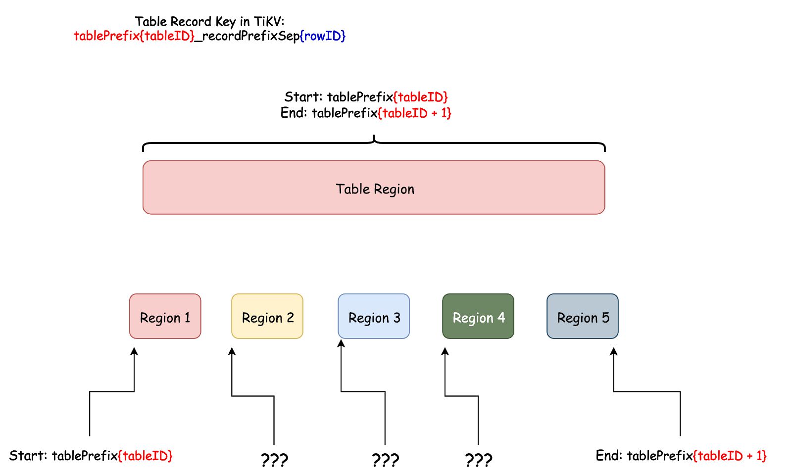

从上图可知，根据行数据 key 的编码规则，行 ID (rowID) 是行数据中唯一可变的部分。在 TiDB 中，rowID 是一个 Int64 整型。但是用户不一定能将 Int64 整型范围均匀切分成需要的份数，然后均匀分布在不同的节点上，还需要结合实际情况。

如果行 ID 的写入是完全离散的，那么上述方式是可行的。如果行 ID 或者索引有固定的范围或者前缀（例如，只在 `[2000w, 5000w)` 的范围内离散插入数据），这种写入依然在业务上不产生热点，但是如果按上面的方式进行切分，那么有可能一开始数据仍只写入到某个 Region 上。

##### 7.1.3 典型场景 - 3.普通表清理大量数据相关问题

###### 场景描述

在互联网场景下，线上数据库中的数据一般都有默认的保留时间，比如保留最近三个月、一年和三年等。这样就会有大量的线上过期数据 delete 操作，因为 TiDB 的 KV 层存储用的是 RocksDB，所以 delete 操作过程可以简单描述为：

1. TiDB 从 TiKV 读取符合条件的数据
2. 执行 delete 操作
3. 在 TiKV 写入这条记录的删除记录
4. 等待 RocksDB Compaction 之后，这条记录才被真正的删除

###### 如何解决

针对这个场景，TiDB 的分区表可以比较好的解决，分区表的每一个分区都可以看做是一个独立的表，这样如果业务要按照日期清理数据，只需要按照日期建立分区，然后定期去清理指定的日期之前的分区即可。清理分区走的是 Delete Ranges 逻辑，简单过程是：

1. 将要清理的分区写入 TiDB 的 gc_delete_range 表
2. Delete Ranges 会 gc_delete_range 表中时间戳在 safe point 之前的区间进行快速的物理删除

这样就减少了 TiDB 和 TiKV 的数据交互，既避免了往 TiKV写入大量的 delete 记录，又避免了 TiKV 的 RocksDB 的 compaction 引起的性能抖动问题，从而彻底的解决了清理数据慢影响大的问题。

#### 7.2 如何查看 DDL 状态

##### 7.2.1 TiDB DDL 特点

TiDB 上的 DDL 操作，不会阻塞任何该数据库上正在执行的 SQL，对业务的 SQL 访问和对 DBA 运维都极为友好，这也是 TiDB 相较于其他数据库产品的一大优势所在。

#### 7.3 Sequence

Sequence 是数据库系统按照一定规则自增的数字序列，具有唯一和单调递增的特性。

>Create Sequence 语法

```sql
CREATE [TEMPORARY] SEQUENCE [IF NOT EXISTS] sequence_name
[ INCREMENT [ BY | = ] INCREMENT ]
[ MINVALUE [=] minvalue | NO MINVALUE | NOMINVALUE ]
[ MAXALUE [=] maxvalue | NO MAXVALUE | NOMAXVALUE ]
[ START [ WITH | = ] start ]
[ CACHE [=] cache | NOCACHE | NO CACHE]
[ CYCLE | NOCYCLE | NO CYCLE]
[ ORDER | NOORDER | NO ORDER]
[table_options]
```

###### 7.3.1 用例介绍 并发应用需要获取单调递增的序列号

(1) 首先新建一个 Sequence

```sql
CREATE SEQUENCE seq_for_unique START WITH 1 INCREMENT BY 1 CACHE 1000 NOCYCLE;
```

(2) 从不同的 TiDB 节点获取到的 Sequence 值顺序有所不同

如果两个应用节点同时连接至同一个 `TiDB` 节点，两个节点取到的则为连续递增的值

```sql
节点 A：tidb[test]> SELECT NEXT VALUE FOR seq_for_unique;
+-------------------------------+
| NEXT VALUE FOR seq_for_unique |
+-------------------------------+
|                             1 |
+-------------------------------+
1 row in set (0.00 sec)

节点 A：tidb[test]> SELECT NEXT VALUE FOR seq_for_unique;
+-------------------------------+
| NEXT VALUE FOR seq_for_unique |
+-------------------------------+
|                             2 |
+-------------------------------+
1 row in set (0.00 sec)

```

(3) 如果两个应用节点分别连接至不同 `TiDB` 节点，两个节点取到的则为区间递增（每个 TiDB 节点上为连续递增）但不连续的值

```sql
节点 A：tidb[test]> SELECT NEXT VALUE FOR seq_for_unique;
+-------------------------------+
| NEXT VALUE FOR seq_for_unique |
+-------------------------------+
|                             1 |
+-------------------------------+
1 row in set (0.00 sec)

节点 B：tidb[test]> SELECT NEXT VALUE FOR seq_for_unique;
+-------------------------------+
| NEXT VALUE FOR seq_for_unique |
+-------------------------------+
|                          1001 |
+-------------------------------+
1 row in set (0.00 sec)
```

###### 7.3.1 用例介绍 在一张表里面需要有多个自增字段

MySQL 语法中每张表仅能新建一个 `auto_increment` 字段，且该字段必须定义在主键或是索引列上。在 TiDB 中通过 `Sequence` 和生成列，我们可以实现多自增字段需求。

(1) 首先新建如下两个 Sequence

```sql
CREATE SEQUENCE seq_for_autoid START WITH 1 INCREMENT BY 2 CACHE 1000 NOCYCLE;
CREATE SEQUENCE seq_for_logid START WITH 100 INCREMENT BY 1 CACHE 1000 NOCYCLE;
```

(2) 在新建表的时候通过 `default nextval(seq_name)` 设置列的默认值

```sql
CREATE TABLE `user` (
    `userid` varchar(32) NOT NULL,
    `autoid` int(11) DEFAULT 'nextval(`test`.`seq_for_autoid`)',
    `logid` int(11) DEFAULT 'nextval(`test`.`seq_for_logid`)',
    PRIMARY KEY (`userid`)
)
```

(3) 接下来我们插入几个用户信息进行测试：

```sql
INSERT INTO user (userid) VALUES ('usera');
INSERT INTO user (userid) VALUES ('userb');
INSERT INTO user (userid) VALUES ('userc');
```

(4) 查询 `user` 表，可以发现 `autoid` 和 `logid` 字段的值按照不同的步长进行自增，且主键仍然在列 `userid` 上：

```SQL
tidb[test]> select * from user;
+--------+--------+-------+
| userid | autoid | logid |
+--------+--------+-------+
| usera  |      1 |   100 |
| userb  |      3 |   101 |
| userc  |      5 |   102 |
+--------+--------+-------+
3 rows in set (0.01 sec)
```

###### 7.3.1 用例介绍 更新数据表中一列值为连续自增的值

假设我们有一张数据表，表中有 20 万行数据，我们需要更新其中一列的值为连续自增且唯一的整数，如果没有 Sequence，我们只能通过应用一条条读取记录，并用 `update` 更新值，同时还需要分批次提交，但现在我们有了 Sequence，一切都会变的特别简单。

(1) 新建一张测试表

```SQL
tidb[test]> CREATE TABLE t( a int, name varchar(32));
Query OK, 0 rows affected (0.01 sec)
```

(2) 新建一个 Sequence

```SQL
tidb[test]> CREATE SEQUENCE test;
Query OK, 0 rows affected (0.00 sec)
```

(3) 插入 1 万条记录

```bash
for i in $(seq 1 10000)
do
   echo "insert into t values($(($RANDOM%1000)),'user${i}');" >> user.sql
done
```

```SQL
tidb[test]> select count(*) from t;
+----------+
| count(*) |
+----------+
|    10000 |
+----------+
1 row in set (0.05 sec)
tidb[test]> select * from t;
+------+-----------+
| a    | name      |
+------+-----------+
|  355 | user1     |
|  729 | user2     |
|  684 | user3     |
|  815 | user4     |
|   39 | user5     |
|  294 | user6     |
|  407 | user7     |
|  767 | user8     |
|  246 | user9     |
|  755 | user10    |
|  496 | user11    |
...
```

(4) 更新为连续的值

```SQL
update t set a=nextval(test);
```

(5) 查询结果集,可以看到字段 `a` 的值已经连续自增且唯一

```SQL
tidb[test]> select * from t;
+-------+-----------+
| a     | name      |
+-------+-----------+
|     1 | user1     |
|     2 | user2     |
|     3 | user3     |
|     4 | user4     |
|     5 | user5     |
|     6 | user6     |
|     7 | user7     |
|     8 | user8     |
|     9 | user9     |
|    10 | user10    |
|    11 | user11    |
|    12 | user12    |
|    13 | user13    |
|    14 | user14    |
|    15 | user15    |
|    16 | user16    |
|    17 | user17    |
|    18 | user18    |
|    19 | user19    |
|    20 | user20    |
...
```

#### 7.4 AutoRandom

> AutoRandom 是 TiDB 4.0 提供的一种扩展语法，用于解决整数类型主键通过 AutoIncrement 属性隐式分配 ID 时的写热点问题。

##### 7.4.1 AutoRandom 功能介绍

在前面的章节提到过，TiDB 的每一行数据都包含一个隐式的 `_tidb_rowid`。`_tidb_rowid` 会被编码到存储引擎的 Key 上，在 TiKV 中，这决定了数据在 TiKV 中的 Region 位置。

如果表的主键为整数类型，则 TiDB 会把表的主键映射为 `_tidb_rowid`，即使用“主键聚簇索引”。在这种情况下，如果表使用了 `AUTO_INCREMENT` 就会造成主键的热点问题，并无法使用 `SHARD_ROW_ID_BITS` 来打散热点。

针对上述热点问题，如果使用 `AUTO_INCREMENT` 仅仅只是用来保证主键唯一性（不需要连续或递增），那么我们可以将 `AUTO_INCREMENT` 改为 `AUTO_RANDOM`，插入数据时让 TiDB 自动为整型主键列分配一个值，消除行 ID 的连续性，从而达到打散热点的目的。

AutoRandom 提供以下的功能：

- 唯一性：TiDB 始终保持填充数据在表范围内的唯一性。
- 高性能：TiDB 能够以较高的吞吐分配数据，并保证数据的随机分布以配合 `PRE_SPLIT_REGION` 语法共同使用，避免大量写入时的写热点问题。
- 支持隐式分配和显式写入：类似列的 AutoIncrement 属性，列的值既可以由 TiDB Server 自动分配，也可以由客户端直接指定写入。该需求来自于使用 Binlog 进行集群间同步时，保证上下游数据始终一致。

##### 7.4.2 AutoRandom 语法介绍

```sql
column_definition:
    data_type [NOT NULL | NULL] [DEFAULT default_value]
      [AUTO_INCREMENT | AUTO_RANDOM [(length)]]
      [UNIQUE [KEY] | [PRIMARY] KEY]
      [COMMENT 'string']
      [reference_definition]
```

注意，AutoRandom 仅支持主键列，唯一索引列尚不支持，目前也没有支持计划。`AUTO_RANDOM` 关键字后可以指定 Shard Bits 数量，默认为 5。

##### 7.4.3 AutoRandom 使用示例

使用 AUTO_RANDOM 功能前，须在 TiDB 配置文件 `experimental` 部分设置 `allow-auto-random = true`。该参数详情可参见 [allow-auto-random](https://pingcap.com/docs-cn/dev/reference/configuration/tidb-server/configuration-file#allow-auto-random)。

```sql
create table t (a int primary key auto_random);
```

```SQL
tidb> insert into t values (), ();
Query OK, 2 rows affected (0.00 sec)
Records: 2  Duplicates: 0  Warnings: 0

tidb> select * from t;
+-----------+
| a         |
+-----------+
| 201326593 |
| 201326594 |
+-----------+
2 rows in set (0.00 sec)

tidb> insert into t values (), ();
Query OK, 2 rows affected (0.01 sec)
Records: 2  Duplicates: 0  Warnings: 0

tidb> select * from t;
+------------+
| a          |
+------------+
|  201326593 |
|  201326594 |
| 2080374787 |
| 2080374788 |
+------------+
4 rows in set (0.00 sec)

tidb> select last_insert_id();
+------------------+
| last_insert_id() |
+------------------+
|       2080374787 |
+------------------+
1 row in set (0.00 sec)
```

- 如果该 INSERT 语句没有指定整型主键列（a 列）的值，TiDB 会为该列自动分配值。该值不保证自增，不保证连续，只保证唯一，避免了连续的行 ID 带来的热点问题。
- 如果该 INSERT 语句显式指定了整型主键列的值，和 AutoIncrement 属性类似，TiDB 会保存该值。
- 若在单条 INSERT 语句中写入多个值，AutoRandom 属性会保证分配 ID 的连续性，同时 `LAST_INSERT_ID()` 返回第一个分配的值，这使得可以通过 `LAST_INSERT_ID()` 结果推断出所有被分配的 ID。

##### 7.4.5 AutoRandom 与其它方案的比较

与 AutoRandom 相比，TiDB 还可以通过其他的方式避免主键自动分配时的写热点问题：

- 使用 [alter-primary-key 配置选项](https://pingcap.com/docs-cn/dev/reference/configuration/tidb-server/configuration-file/#alter-primary-key)关闭主键聚簇索引，使用 AutoIncrement + `SHARD_ROW_ID_BITS`。在这种方式下，主键索引被当做普通的唯一索引处理，使得数据的写入可以由 SHARD_ROW_ID_BITS 语法打散避免热点，但缺点在于，主键仍然存在索引写入的热点，同时在查询时，由于关闭了聚簇索引，针对主键的查询需要进行一次额外的回表。
- 在主键指定 `UUID()` 函数。

### 第8章 - Titan 简介与实战

RocksDB 使用了 LSM-Tree，LSM-tree 的实现原理决定了，RocksDB 存在着数十倍的写入放大效应。在写入量大的应用场景中，这种放大效可能会触发 IO 带宽和 CPU 计算能力的瓶颈影响在线写入性能。

Titan 是 PingCAP 研发的基于 RocksDB 的高性能单机 key-value 存储引擎，**通过把大 value 同 key 分离存储的方式减少写入 LSM-tree 中的数据量级**。在 value 较大的场景下显著缓解写入放大效应，降低 RocksDB 后台 compaction 对 IO 带宽和 CPU 的占用，同时提高 SSD 寿命的效果。

#### 8.1 Titan 原理介绍

Titan 存储引擎的主要设计灵感来源于 USENIX FAST 2016 上发表的一篇论文 [WiscKey](https://www.usenix.org/system/files/conference/fast16/fast16-papers-lu.pdf)。WiscKey 提出了一种高度基于 SSD 优化的设计，利用 SSD 高效的随机读写性能，通过将 value 分离出 LSM-tree 的方法来达到降低写放大的目的。

##### 8.1.1 设计目标

我们为 Titan 设定了下面的四个目标：

- 将大 value 从 LSM-tree 中分离出来单独存储，降低 value 部分的写放大。
- 现有 RocksDB 实例无需长期停机转换数据，可在线升级 Titan
- 100% 兼容 TiKV 使用的全部 RocksDB 特性
- 尽量减少对 RocksDB 的侵入性改动，提升 Titan 同未来新版本 RocksDB 的兼容性。

##### 8.1.2 架构与实现

Titan 维持 RocksDB 的写入流程不变，**在 Flush 和 Compaction 时刻将大 value 从 LSM-tree 中进行分离并存储到 BlobFile 中**。同 RocksDB 相比，Titan 增加了 `BlobFile`，`TitanTableBuilder` 和 `Garbage Collection（GC）`等组件，下面我们将会对这些组件逐一介绍。

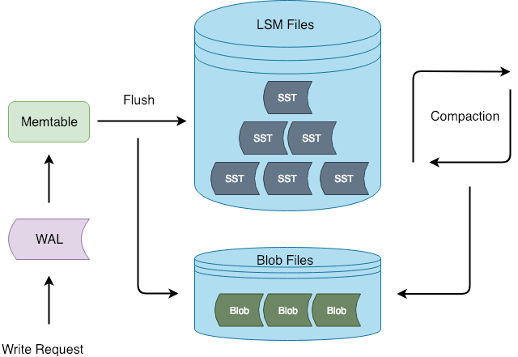

###### 8.1.2.1 BlobFile

BlobFile 是存放 LSM-tree 中分离得到的 KV 记录的文件，它由 header、record 、meta block、meta index 和 footer 组成。其中每个 record 用于存放一个 key-value 对；meta block 用于在未来保存用户自定义数据；而 meta index 则用于检索 meta block。

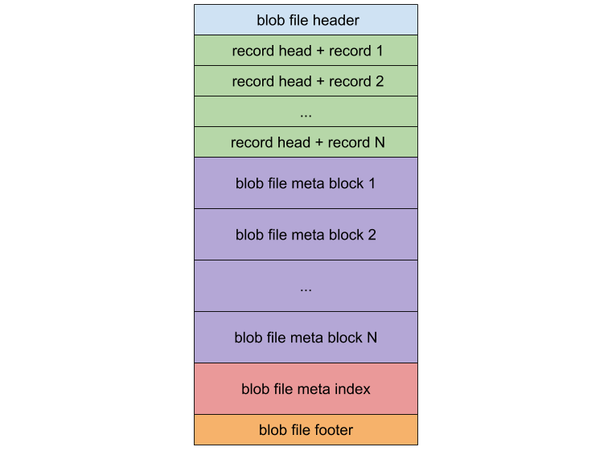

为了充分利用 prefetch 机制提高顺序扫描数据时的性能，BlobFile 中的 key-value 是按照 key 的顺序有序存放的。除了从 LSM-tree 中分离出的 value 之外，blob record 中还保存了一份 key 的数据。在这份额外存储的 key 的帮助下，Titan 用较小的写放大收获了 GC 时快速查询 key 最新状态的能力。GC 则会利用 key 的更新信息来确定 value 是否已经过期可以被回收。考虑到 Titan 中存储的 value 大小偏大，将其压缩则可以获得较为显著的空间收益。BlobFile 可以选择 [Snappy](https://github.com/google/snappy)、[LZ4](https://github.com/lz4/lz4) 或 [Zstd](https://github.com/facebook/zstd) 在单个记录级别对数据进行压缩，目前 Titan 默认使用的压缩算法是 LZ4。

##### 8.1.2.2 TitanTableBuilder

RocksDB 提供了 TableBuilder 机制供用户自定义的 table 实现。Titan 则利用了这个能力实现了 TitanTableBuilder，在不对 RocksDB 构建 table 流程做侵入型改动的前提下，实现了将大 value 从 LSM-tree 中分离的功能。

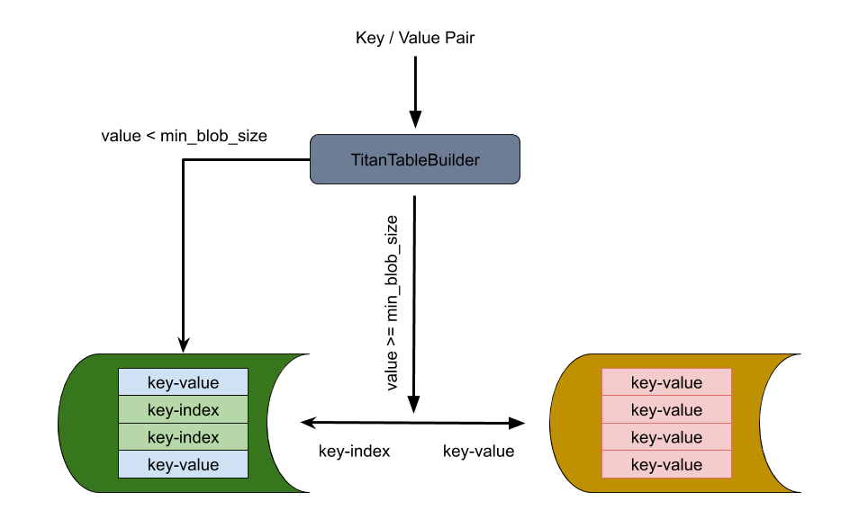

在 RocksDB 将数据写入 SST 时，TitanTableBuilder 根据 value 大小决定是否需要将 value 分离到外部 BlobFile 中。如果 value 大小小于 Titan 设定的大 value 阈值，数据会直接写入到 RocksDB 的 SST 中；反之，value 则会持久化到 BlobFile 中，相应的位置检索信息将会替代 value 被写入 RocksDB 的 SST 文件中用于在读取时定位 value 的实际位置。同样利用 RocksDB 的 TableBuilder 机制，我们可以在 RocksDB 做 Compaction 的时候将分离到 BlobFile 中的 value 重新写入到 SST 文件中完成从 Titan 到 RocksDB 的降级。

###### 8.1.2.3 Garbage Collection

RocksDB 在 LSM-tree Compaction 时对已删除数据进行空间回收。同样 Titan 也具备 Garbage Collection (GC) 组件用于已删除数据的空间回收。在 Titan 中存在两种不同的 GC 方式分别应对不同的适用场景。下面我们将分别介绍「传统 GC」和「Level-Merge GC」的工作原理。

> 传统GC

通过定期整合重写删除率满足设定阈值条件的 Blob 文件，我们可以回收已删除数据所占用的存储空间。这种 GC 的原理是非常直观容易理解的，我们只需要考虑何时进行 GC 以及挑选哪些文件进行 GC 这两个问题。在 GC 目标文件被选择好后我们只需对相应的文件进行一次重写只保留有效数据即可完成存储空间的回收工作。

首先 Titan 需要决定何时开始进行 GC 操作，显然选择同 RocksDB 一样在 compaction 时丢弃旧版本数据回收空间是最适当的。每当 RocksDB 完成一轮 compaction 并删除了部分过期数据后，在 BlobFile 中所对应的 value 数据也就随之失效。因此 **Titan 选择监听 RocksDB 的 compaction 事件来触发 GC 检查**，通过搜集比对 compaction 中输出和产出 SST 文件对应的 BlobFile 的统计信息（BlobFileSizeProperties）来跟踪对应 BlobFile 的可回收空间大小。

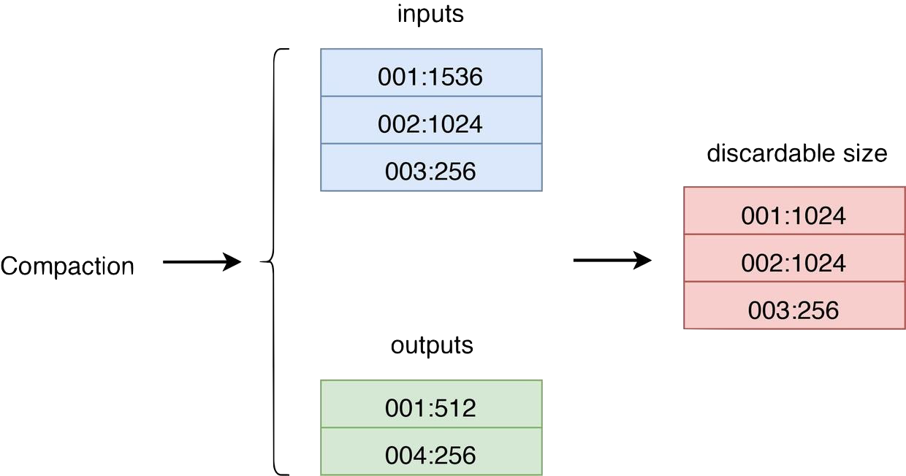

图中 inputs 代表所有参与本轮 compaction 的 SST 文件计算的得到的 BlobFileSizeProperties 统计信息（BlobFile ID : 有效数据大小），outputs 则代表新生成的 SST 文件对应的统计信息。通过计算这两组统计信息的变化，我们可以得出每个 BlobFile 可被丢弃的数据大小，图中 discardable size 的第一列是文件 ID 第二列则是对应文件可被回收数据的大小。

接下来我们来关注 BlobFileSizeProperties 统计信息是如何计算得到的。我们知道原生 RocksDB 提供了 TablePropertiesCollector 机制来计算每一个 SST 文件的属性数据。Titan 通过这个扩展功能自定义了 BlobFileSizeCollector 用于计算 SST 中被保存在 BlobFile 中数据的统计信息。

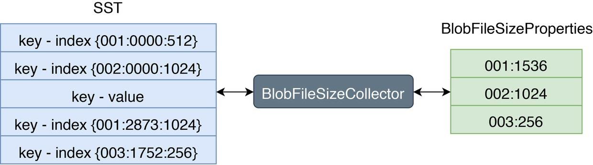

**BlobFileSizeCollector 的工作原理非常直观，通过解析 SST 中 KV 分离类型数据的索引信息，它可以得到当前 SST 文件引用了多少个 BlobFile 中的数据以及这些数据的实际大小。**

为了更加有效的计算 GC 候选目标 BlobFile，Titan 在内存中为每一个 BlobFile 维护了一份 discardable size 的统计信息。在 RocksDB 每次 compaction 完成后，可以将每一个 BlobFile 文件新增的可回收数据大小累加到内存中对应的 discardable size 上。在重启后，这份统计信息可以从 BlobFile 数据和 SST 文件属性数据重新计算出来。考虑到我们可以容忍一定程度的空间放大（数据暂不回收）来缓解写入放大效应，**只有当 BlobFile 可丢弃的数据占全部数据的比例超过一定阈值后才会这个 BlobFile 进行 GC**。 在 GC 开始时我们只需要从满足删除比例阈值的候选 BlobFile 中选择出 discardable size 最大的若干个进行 GC。

对于筛选出待 GC 的文件集合，Titan 会依次遍历 BlobFile 中每一个 record，使用 record key 到 LSM-tree 中查询 blob index 是否存在或发生过更新。丢弃所有已删除或存在新版本的 blob record，剩余的有效数据则会被重写到新的 BlobFile 中。同时这些存储在新 BlobFile 中数据的 blob index 也会同时被回写到 LSM-tree 中供后续读取。需要注意的是，为了避免删除影响当前活跃的 snapshot 读取，在 GC 完成后旧文件并不能立刻删除。Titan 需要确保没有 snapshot 会访问到旧文件后才可以安全的删除对应的 BlobFile。而这个保障可以通过记录 GC 完成后 RocksDB 最新的 sequence number，并等待所有活跃 snapshot 的 sequence number 超过记录值而达成。

> Level-Merged

核心思想是在 LSM-tree compaction 时将 SST 文件相对应的 BlobFile 进行归并重写并生成新的 BlobFile。 重写的过程不但避免了 GC 引起的额外 LSM-tree 读写开销，而且通过不断的合并重写过程降低了 BlobFile 之间相互重叠的的比例，使得提升了数据物理存储有序性进而提高 Scan 的性能。

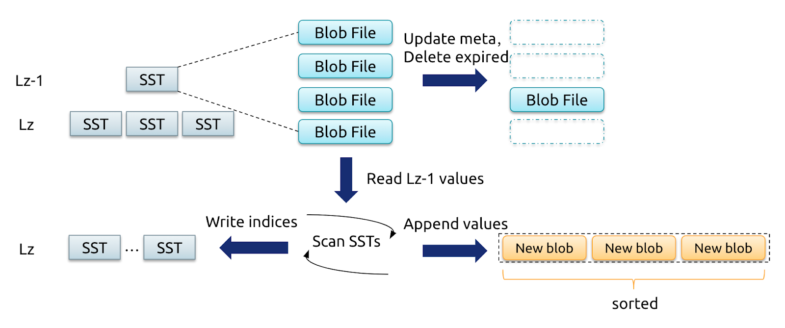

Level-Merge 在 RocksDB 对 level z-1 和 level z 的 SST 进行 compaction 时，对所有 KV 对进行一次有序读写，这时就可以对这些 SST 中所使用的 BlobFile 的 value 有序写到新的 BlobFile 中，并在生成新的 SST 时直接保存对应记录的新 blob index。由于 compaction 中被删除的 key 不会被写入到新 BlobFile 中，在整个重新操作完成的同时也就相当于完成了相应 BlobFile 的 GC 操作。考虑到 LSM-tree 中 99% 的数据都落在最后两层，为了避免分层 Level-Merge 时带来的写放大问题，Titan 仅对 LSM-tree 中最后两层数据对应的 BlobFile 进行 Level-Merge。

### 第9章 TiFlash 简介与 HTAP 实战

#### 9.1 TiDB HTAP 的特点

> HTAP 是 Hybrid Transactional / Analytical Processing 的缩写。

###### 2. 可更新列式存储引擎 Delta Tree

TiFlash 配备了可更新的列式存储引擎。列存更新的主流设计是 Delta Main 方式，**基本思想是，由于列存块本身更新消耗大，因此往往设计上使用缓冲层容纳新写入的数据。然后再逐渐和主列存区进行合并。**TiFlash 也使用了类似的 Delta Main 设计，从这个意义而言，LSM 也可用于列存更新。具体来说，Delta Tree 利用树状结构和双层 LSM 结合的方式处理更新，以规避单纯使用 LSM 设计时需要进行的多路归并。通过这种方式，TiFlash 在支持更新的同时也具备高速的读性能。

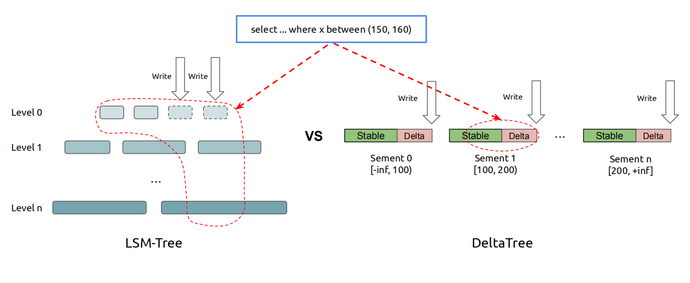

###### 3. 实时且一致的复制体系

TiFlash 无缝融入整个 TiDB 的 Multi-Raft 体系。它通过 Raft Learner 进行数据复制，通过这种方式 TiFlash 的稳定性并不会对 TiKV 产生影响。例如 TiFlash 节点宕机或者网络延迟，TiKV 仍然可以继续运行无碍且不会因此产生抖动。于此同时，该复制协议允许在读时进行极轻量的校对以确保数据一致性。另外，TiFlash 可以与 TiKV 一样的方式进行在线扩容缩容，且能自动容错以及负载均衡。

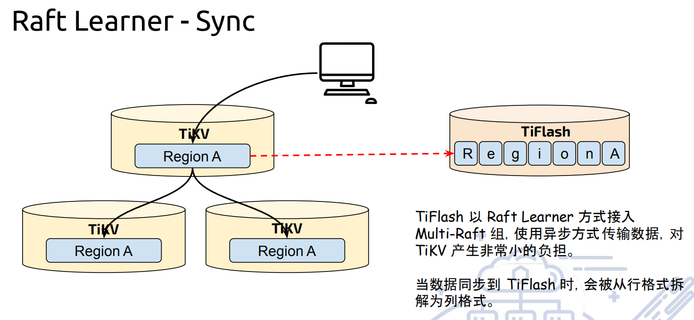

###### 4. 完整的业务隔离

由于 TiFlash 的列存复制设计，用户可以选择单独使用与 TiKV 不同的另一组节点存放列存数据。另外不论是 TiDB 还是 TiSpark，计算层都可以强制选择行存或者列存，这样用户可以毫无干扰地查询在线业务数据，为实时 BI 类应用提供强力支持。

###### 智能的行列混合模式

如果不使用上述隔离模式进行查询，TiDB 也可经由优化器自主选择行列。这套选择的逻辑与选择索引类似：优化器根据统计信息估算读取数据的规模，并对比选择列存与行存访问开销，做出最优选择。通过这种模式，用户可以在同一套系统方便地同时满足不同特型的业务需求。例如一套物流系统需要同时支持点查某订单信息，也需要进行大规模聚合统计某一时间段内货物派送和分发的汇总信息，利用 TiDB 的行列混合体系可以很简单实现，且完全无需担心不同系统间数据复制带来的不一致。

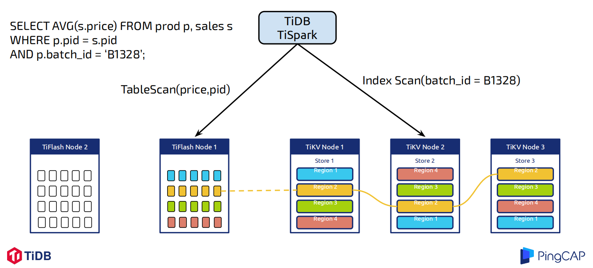

上面的图，首先通过 `p.batch_id='B1328'` 点查询所有的匹配条件的 `prod`，随后通过 列查询搜索 `s.pid` 以及 `s.price`。

#### 9.2 TiFlash 架构与原理

##### 9.2.1 基本架构

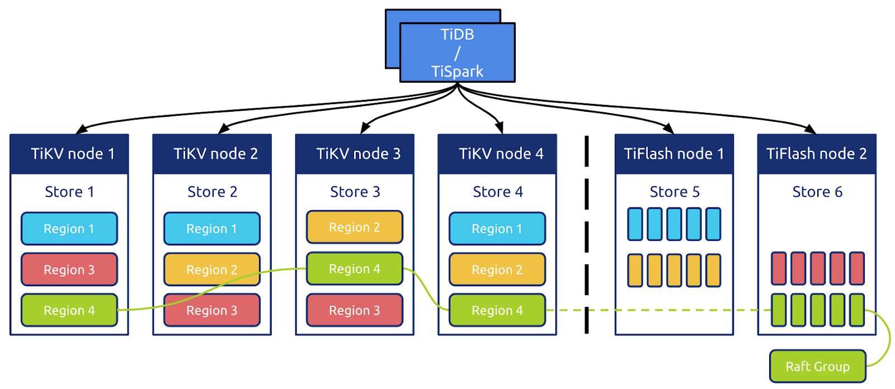

如上图所示，TiFlash 能以 Raft Learner Store 的角色无缝接入 TiKV 的分布式存储体系。TiKV 基于 Key 范围做数据分片并将一个单元命名为 Region，同一 Region 的多个 Peer（副本）分散在不同存储节点上，共同组成一个 Raft Group。每个 Raft Group 中，Peer 按照角色划分主要有 Leader、Follower、Learner。在 TiKV 节点中，Peer 的角色可按照一定的机制切换，但考虑到底层数据的异构性，所有存在于 TiFlash 节点的 Peer 都只能是 Learner（在协议层保证）。TiFlash 对外可以视作特殊的 TiKV 节点，接受 PD 对于 Region 的统一管理调度。TiDB 和 TiSpark 可按照和 TiKV 相同的 Coprocessor 协议下推任务到 TiFlash。

在 TiDB 的体系中，每个 Table 含有 Schema、Index（索引）、Record（实际的行数据） 等内容。由于 TiKV 本身没有 Table 的概念，TiDB 需要将 Table 数据按照 Schema 编码为 Key-Value 的形式后写入相应 Region，通过 Multi-Raft 协议同步到 TiFlash，再由 TiFlash 根据 Schema 进行解码拆列和持久化等操作。

##### 9.2.2 原理

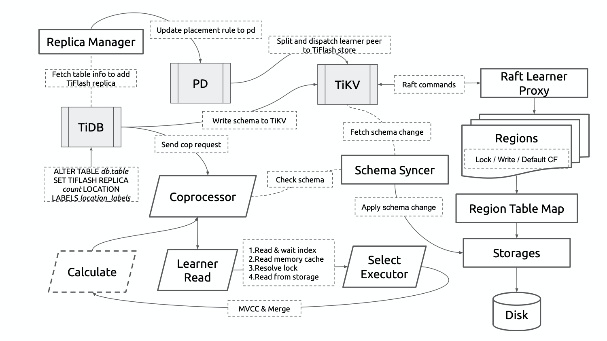

###### 1. Replica Manager

### 第10章 TiDB 安全

#### 10.1 权限管理

> TiDB 的权限管理系统提供了基本的权限访问控制功能，保障数据不被非授权的篡改。

###### 10.1.1 权限管理系统可以做什么

- 权限管理系统可以创建和删除用户，授予和撤销用户权限。
- 只有有相应权限的用户才可以进行操作，比如只有对某个表有写权限的用户，才可以对这个表进行写操作。
- 通过为每个用户设定严格的权限，保障数据不被恶意篡改。

###### 10.1.2 权限管理系统原理

在权限管理模块中，有三类对象：用户，被访问的对象（数据库，表）以及权限。

所有对象的具体信息都会被记录在几张系统表中：

- mysql.user：mysql.user 表主要记录了用户的信息和用户拥有的全局权限
- mysql.tables_priv：主要记录了将权限授予给用户的表信息
- mysql.db：主要记录了将权限授予给用户的库信息

所有的授权，撤销权限，创建用户，删除用户操作，实际上都是对于这三张用户表的修改操作。 TiDB 的权限管理器负责将系统表解析到内存中，方便快速的进行鉴权操作。在进行权限修改操作后，权限管理器会重新加载系统表。

###### 10.1.3 权限管理系统操作示例

创建用户

```sql
CREATE USER 'developer0'@'%' IDENTIFIED BY 'test_user';
```

授予给 developer 用户在 read_table 表上的读权限，write_table 表上的写权限。

```sql
GRANT SELECT ON lol_shequ_eogd.match_history_details TO 'developer0'@'%';
GRANT INSERT, UPDATE ON lol_shequ_eogd.match_history_details TO 'developer0'@'%';
```

###### 10.2 RBAC(Role-Based Access Control)

###### 10.2.2 RBAC 实现原理

主要依赖以下系统表：

- mysql.user 复用用户表，区别是 Account_Locked 字段，角色的值是 Y，也就是不能登陆.



```sql
+------+------+----------+-------------+-------------+-------------+-------------+-------------+-----------+--------------+------------+-----------------+------------+--------------+------------+-----------------------+------------------+--------------+------------------+----------------+---------------------+--------------------+------------+------------------+------------+--------------+------------------+----------------+----------------+---------------+
| Host | User | Password | Select_priv | Insert_priv | Update_priv | Delete_priv | Create_priv | Drop_priv | Process_priv | Grant_priv | References_priv | Alter_priv | Show_db_priv | Super_priv | Create_tmp_table_priv | Lock_tables_priv | Execute_priv | Create_view_priv | Show_view_priv | Create_routine_priv | Alter_routine_priv | Index_priv | Create_user_priv | Event_priv | Trigger_priv | Create_role_priv | Drop_role_priv | Account_locked | Shutdown_priv |
+------+------+----------+-------------+-------------+-------------+-------------+-------------+-----------+--------------+------------+-----------------+------------+--------------+------------+-----------------------+------------------+--------------+------------------+----------------+---------------------+--------------------+------------+------------------+------------+--------------+------------------+----------------+----------------+---------------+
| %    | root |          | Y           | Y           | Y           | Y           | Y           | Y         | Y            | Y          | Y               | Y          | Y            | Y          | Y                     | Y                | Y            | Y                | Y              | Y                   | Y                  | Y          | Y                | Y          | Y            | Y                | Y              | N              | Y             |
| %    | r_1  |          | N           | N           | N           | N           | N           | N         | N            | N          | N               | N          | N            | N          | N                     | N                | N            | N                | N              | N                   | N                  | N          | N                | N          | N            | N                | N              | Y              | N             |
| %    | r_2  |          | N           | N           | N           | N           | N           | N         | N            | N          | N               | N          | N            | N          | N                     | N                | N            | N                | N              | N                   | N                  | N          | N                | N          | N            | N                | N              | Y              | N             |
+------+------+----------+-------------+-------------+-------------+-------------+-------------+-----------+--------------+------------+-----------------+------------+--------------+------------+-----------------------+------------------+--------------+------------------+----------------+---------------------+--------------------+------------+------------------+------------+--------------+------------------+----------------+----------------+---------------+
```

- mysql.role_edges 描述了角色和角色，角色和用户之间的授予关系。 例如将角色 r1 授予给 test 后，会出现这样一条记录：

```sql
+-----------+-----------+---------+---------+-------------------+
| FROM_HOST | FROM_USER | TO_HOST | TO_USER | WITH_ADMIN_OPTION |
+-----------+-----------+---------+---------+-------------------+
| %         | r1        | %       | test    | N                 |
+-----------+-----------+---------+---------+-------------------+
```

- mysql.default_roles 记录每个用户默认启用的角色，启用后的角色才能生效。

```sql
+------+------+-------------------+-------------------+
| HOST | USER | DEFAULT_ROLE_HOST | DEFAULT_ROLE_USER |
+------+------+-------------------+-------------------+
| %    | test | %                 | r_1               |
+------+------+-------------------+-------------------+
```

###### 10.2.4 查看一个完整的例子

创建角色

```sql
create role reader@'%';
```

针对角色进行授权

```sql
grant select on mysql.role_edges to reader@'%';
```

创建用户

```sql
create user bi_user@'%';
```

将只读角色 reader 授予 bi_user 用户

```sql
grant reader to bi_user@'%';
```

登录 bi_user 账号

```sql
mycli --host 127.0.0.1 --port 4000 -u bi_user
```

账号无权限

```sql
mysql bi_user@127.0.0.1:(none)> show databases;
+--------------------+
| Database           |
+--------------------+
| INFORMATION_SCHEMA |
+--------------------+
```

切换用户

```sql
set role reader;
```


###### 


