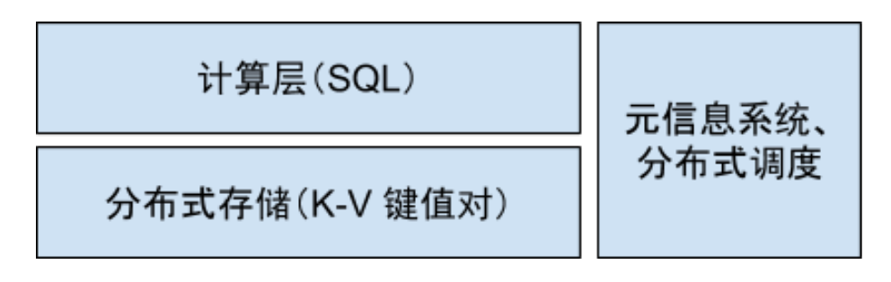
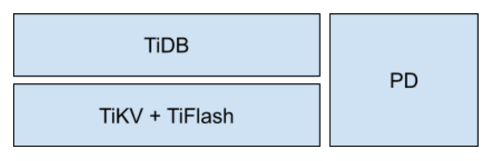
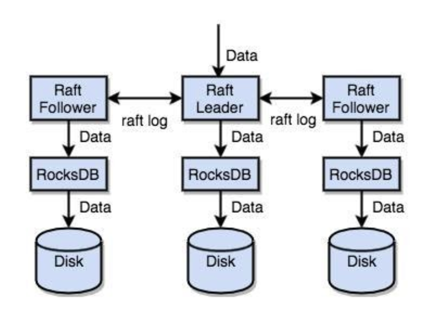
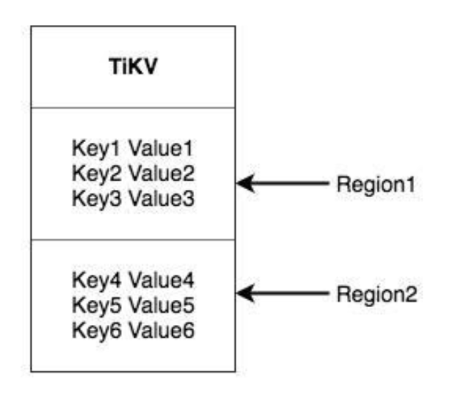
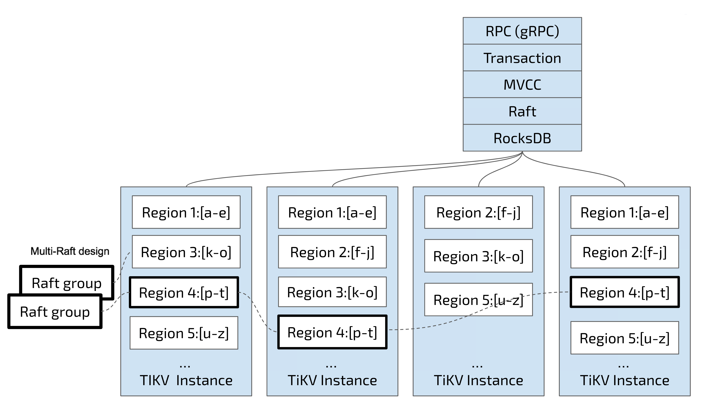
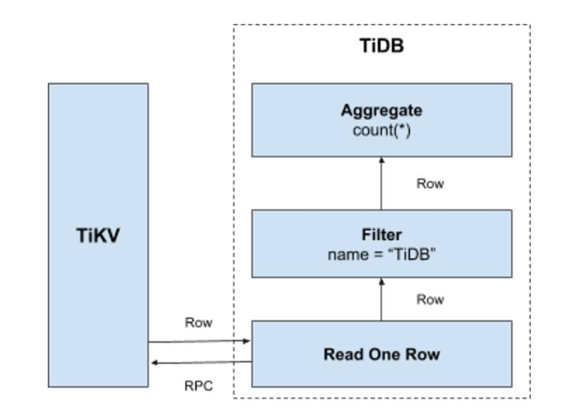
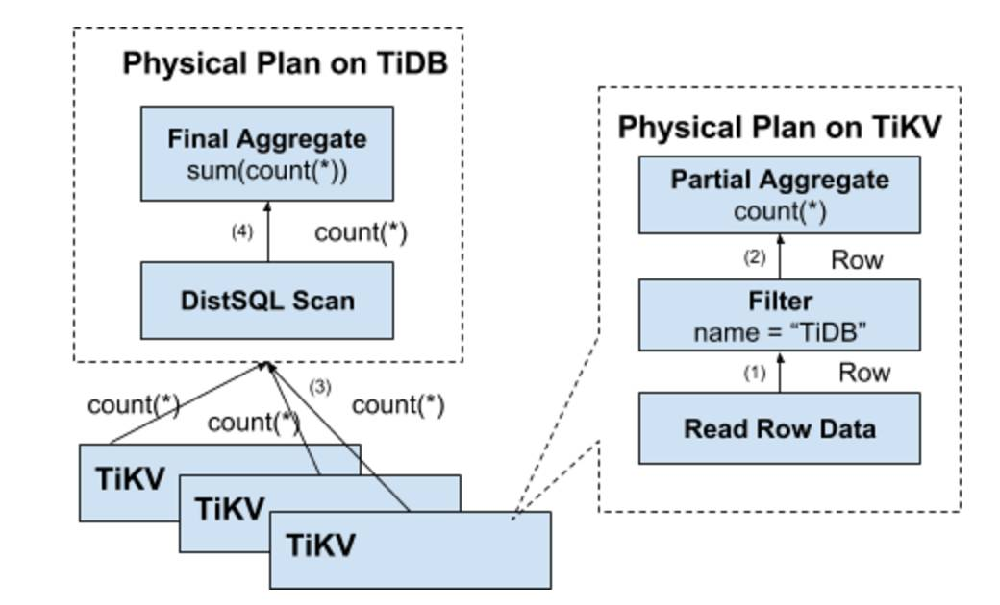
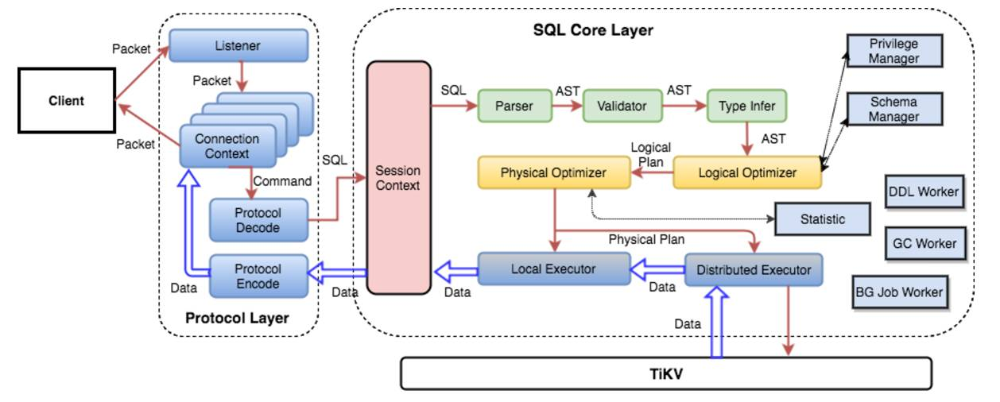

# TiDB in Action

## 第一部分 TIDB 原理和特性

### 第1章 TiDB 整体架构

相比传统的单机数据库，TiDB 有以下的一些优势：

- 分布式架构
- 支持并兼容大部分 MySQL 语法
- 默认支持高可用
- 支持 ACID 事务
- 工具链生态完善

整体的架构拆分成多个大的模块，大的模块之间互相通信，组成完整的 TiDB 系统



这三个大模块相互通信，每个模块都是分布式的架构，在 TiDB 中，对应的这几个模块叫做：



1. TiDB (tidb-server, https://github.com/pingcap/tidb): SQL 层，对外暴露 MySQL 协议的连接 endpoint，负责接受客户端的连接，执行 SQL 解析和优化，最终生成分布式执行计划。**无状态**
2. TiKV (tikv-server, https://github.com/pingcap/tikv) : 分布式 KV 存储，类似 NoSQL 数据库。TiKV 的 API 能够在 KV 键值对层面提供对分布式事务的原生支持，默认提供了 **SI （Snapshot Isolation）的隔离级别**，这也是 TiDB 在 SQL 层面支持分布式事务的核心，上面提到的 TiDB SQL 层做完 SQL 解析后，会将 SQL 的执行计划转换为实际对 TiKV API 的调用。
3. Placement Driver (pd-server，简称 PD，https://github.com/pingcap/pd): 整个 TiDB 集群的元信息管理模块，负责存储每个 TiKV 节点实时的数据分布情况和集群的整体拓扑结构，提供 Dashboard 管控界面，并为分布式事务分配事务 ID。PD 不仅仅是单纯的元信息存储，同时 PD 会根据 TiKV 节点实时上报的数据分布状态，下发数据调度命令给具体的 TiKV 节点，可以说是整个集群的「大脑」，另外 PD 本身也是由至少 3 个对等节点构成，拥有高可用的能力。
4. TiFlash 是一类特殊的存储节点，和普通 TiKV 节点不一样的是，在 TiFlash 内部，数据是以列式的形式进行存储，主要的功能是为分析型的场景加速。

### 第2章 说存储

#### 2.1 Key-Value Pairs (键值对)

TiKV 的选择是 Key-Value 模型，并且提供 **有序遍历** 方法

1. 这是一个巨大的 Map（可以类比一下 C++ 的 std::map），也就是存储的是 Key-Value Pairs（键值对）
2. 这个 Map 中的 Key-Value pair 按照 **Key 的二进制顺序有序**，也就是可以 Seek 到某一个 Key 的位置，然后不断地调用 Next 方法以递增的顺序获取比这个 Key 大的 Key-Value。

> **TiKV 的 KV 存储模型和 SQL 中的 Table 无关！**

#### 2.2 本地存储（RocksDB）

开发一个单机存储引擎工作量很大，所以直接选择 RocksDB 作为存储引擎。

#### 2.3 Raft 协议

接下来 TiKV 的实现面临一件更难的事情：如何保证单机失效的情况下，数据不丢失，不出错？

Raft 提供几个重要的功能：

1. Leader（主副本）选举
2. 成员变更（如添加副本、删除副本、转移 Leader 等操作）
3. 日志复制



#### 2.4 Region

前面提到，我们将 TiKV 看做一个巨大的有序的 KV Map，那么为了实现存储的水平扩展，我们需要将数据分散在多台机器上。对于一个 KV 系统，将数据分散在多台机器上有两种比较典型的方案：

- Hash：按照 Key 做 Hash，根据 Hash 值选择对应的存储节点
- Range：按照 Key 分 Range，某一段连续的 Key 都保存在一个存储节点上

TiKV 选择了第二种方式，将整个 Key-Value 空间分成很多段，每一段是一系列连续的 Key，将每一段叫做一个 Region，并且会尽量保持每个 Region 中保存的数据不超过一定的大小，目前在 TiKV 中默认是 96MB。每一个 Region 都可以用 [StartKey，EndKey) 这样一个左闭右开区间来描述。



将数据划分成 Region 后，TiKV 将会做两件重要的事情：

1. 以 Region 为单位，将数据分散在集群中所有的节点上，并且尽量保证每个节点上服务的 Region 数量差不多
2. 以 Region 为单位做 Raft 的复制和成员管理

对于第一点，PD 会负责：

1. 使得 Region 尽可能的均匀的分布在不同的节点，以实现水平扩容和负载均衡；
2. 记录 Region 在节点上的分布情况，也就是通过 key 可以查询 key 在哪个 Region 中，以及 Region 在哪个节点上。

对于第二点：

一个 Region 会拥有多个副本（称之为 Replica）并分布在多个不同的几点上，构成一个 Raft Group。**读和写操作都在 leader 上完成，读只需要在 leader 上完成，写在 leader 上完成之后通过 Raft 复制到 follower**



#### 2.5 MVCC(Multi-Version Concurrency Control)

TiKV 的 MVCC 实现是通过在 Key 后面添加版本号来实现，简单来说，没有 MVCC 之前，可以把 TiKV 看做这样的：

```
Key1 -> Value
Key2 -> Value
……
KeyN -> Value
```

有了 MVCC 之后，TiKV 的 Key 排列是这样的：

```
Key1_Version3 -> Value
Key1_Version2 -> Value
Key1_Version1 -> Value
……
Key2_Version4 -> Value
Key2_Version3 -> Value
Key2_Version2 -> Value
Key2_Version1 -> Value
……
KeyN_Version2 -> Value
KeyN_Version1 -> Value
……
```

**注意，对于同一个 Key 的多个版本，我们把版本号较大的放在前面，版本号小的放在后面（回忆一下 Key-Value 一节我们介绍过的 Key 是有序的排列）**

这样当用户通过一个 Key + Version 来获取 Value 的时候，可以通过 Key 和 Version 构造出 MVCC 的 Key，也就是 Key_Version。然后可以直接通过 RocksDB 的 SeekPrefix(Key_Version) API，定位到第一个大于等于这个 Key_Version 的位置。

#### 2.6 分布式 ACID 事务

TiKV 的事务采用的是 Google 在 BigTable 中使用的事务模型：[Percolator](https://research.google.com/pubs/pub36726.html)

在 TiKV 层的事务 API 的语义类似下面的伪代码：

```
tx = tikv.Begin()
    tx.Set(Key1, Value1)
    tx.Set(Key2, Value2)
    tx.Set(Key3, Value3)
tx.Commit()
```

### 第3章 谈计算

#### 3.1 表数据与 Key-Value 的映射关系

TiDB 数据到 kv 的映射主要分为两个部分：

1. 表中每一行的数据，称之为 `表数据`
2. 表中索引的数据，称之为 `索引数据`

##### 3.1.1 表数据与 Key-Value 的映射关系

在关系型数据库中，一个表可能有很多列。要将一行中各列数据映射成一个 (Key, Value) 键值对 ，需要考虑如何构造 Key。

1. OLTP 场景下有大量针对单行或者多行的增、删、改、查等操作，要求数据库具备快速读取一行数据的能力。因此，对应的 Key 最好有一个唯一 ID （显示或隐式的 ID），以方便快速定位。
2. 很多 OLAP 型查询需要进行全表扫描。如果能够将一个表中所有行的 Key 编码到一个区间内，就可以通过范围查询高效完成全表扫描的任务，**因为不同的表存储在一个 TiKV 集群中**

基于上述考虑：

1. 为了保证同一个表的数据放在一起，方便查找，TiDB 会为每个表分配一个表 ID，用 `TableID` 表示。表 ID 是一个整数，在整个集群内唯一。
2. TiDB 会为表中每行数据分配一个行 ID，用 `RowID` 表示。行 ID 也是一个整数，在表内唯一。对于行 ID，TiDB 做了一个小优化，如果某个表有整数型的主键，TiDB 会使用主键的值当做这一行数据的行 ID。

每行数据按照如下规则编码成 (Key, Value) 键值对：

```
Key:   tablePrefix{TableID}_recordPrefixSep{RowID}
Value: [col1, col2, col3, col4]
```

其中 `tablePrefix` 和 `recordPrefixSep` 都是特定的字符串常量，用于在 Key 空间内区分其他数据。其具体值在后面的小结中给出。

##### 3.1.2 索引数据和 Key-Value 的映射关系

TiDB 同时支持主键和二级索引（包括唯一索引和非唯一索引）。与表数据映射方案类似，TiDB 为表中每个索引分配了一个索引 ID，用 `IndexID` 表示。

对于主键和唯一索引，我们需要根据键值快速定位到对应的 `RowID`，因此，按照如下规则编码成 (Key, Value) 键值对：

```
Key:   tablePrefix{tableID}_indexPrefixSep{indexID}_indexedColumnsValue
Value: RowID
```

对于主键和唯一索引，我们需要根据键值快速定位到对应的 RowID，因此，按照如下规则编码成 (Key, Value) 键值对：

```
Key:   tablePrefix{tableID}_indexPrefixSep{indexID}_indexedColumnsValue
Value: RowID
```

对于不需要满足唯一性约束的普通二级索引，一个键值可能对应多行，我们需要根据键值范围查询对应的 RowID。 因此，按照如下规则编码成 (Key, Value) 键值对：

```
Key:   tablePrefix{TableID}_indexPrefixSep{IndexID}_indexedColumnsValue_{RowID}
Value: null
```

##### 3.1.3 映射关系小结

最后，上述所有编码规则中的 `tablePrefix`，`recordPrefixSep` 和 `indexPrefixSep` 都是字符串常量，用于在 Key 空间内区分其他数据，定义如下：

```
tablePrefix     = []byte{'t'}
recordPrefixSep = []byte{'r'}
indexPrefixSep  = []byte{'i'}
```

上述方案中，无论是表数据还是索引数据的 Key 编码方案，一个表内所有的行都有相同的 Key 前缀，一个索引的所有数据也都有相同的前缀。

表内的行的前缀是

```
tablePrefix{TableID}_recordPrefixSep
```

主键索引，唯一索引，二级索引的前缀是

```
tablePrefix{tableID}_indexPrefixSep{indexID}_
```

这样具有相同的前缀的数据，在 TiKV 的 Key 空间内，是排列在一起的。因此只要小心地设计后缀部分的编码方案，保证编码前和编码后的比较关系不变，就可以将表数据或者索引数据有序地保存在 TiKV 中。**采用这种编码后，一个表的所有行数据会按照 `RowID` 顺序地排列在 TiKV 的 Key 空间中，某一个索引的数据也会按照索引数据的具体的值（编码方案中的 `indexedColumnsValue` ）顺序地排列在 Key 空间内。**

##### 3.1.4 Key-Value 映射关系的一个例子

假设 TiDB 中有如下这个表：

```sql
CREATE TABLE User {
    ID int,
    Name varchar(20),
    Role varchar(20),
    Age int,
    PRIMARY KEY (ID),
    KEY idxAge (Age)
};
```

假设该表中有 3 行数据：

```
1, "TiDB", "SQL Layer", 10
2, "TiKV", "KV Engine", 20
3, "PD", "Manager", 30
```

首先每行数据都会映射为一个 (Key, Value) 键值对，同时该表有一个 `int` 类型的主键，所以 `RowID` 的值即为该主键的值。假设该表的 `TableID` 为 10，则其存储在 TiKV 上的表数据为：**注意，这里 TiDB 使用了主键索引的值作为这一行数据的行ID，所以不需要先通过索引查找行ID，再通过行ID查找实际的value。**

```
t10_r1 --> ["TiDB", "SQL Layer", 10]
t10_r2 --> ["TiKV", "KV Engine", 20]
t10_r3 --> ["PD", "Manager", 30]
```

除了主键外，该表还有一个非唯一的普通二级索引 `idxAge`，假设这个索引的 `IndexID` 为 1，则其存储在 TiKV 上的索引数据为：

```
t10_i1_10_1 --> null
t10_i1_20_2 --> null
t10_i1_30_3 --> null
```

> 前面提到，TiKV 提供了 `有序遍历`，那么只要这些 key 编码前和编码后顺序不变，那么他们也是应该有序排列的。
>
> 在这个例子中，主键索引的前缀是 `t10_i`，二级索引的前缀是 `t10_i1_`
>
> 当我们有以下SQL的时候
>
> ```sql
> # 查询主键索引
> SELECT * FROM User WHERE ID = 1;
> ```
>
> 我们可以直接定位到 `t10_i1` 并查询对应的值；
>
> 当我们有以下SQL的时候
>
> ```sql
> # 查询二级索引
> SELECT * FROM User WHERE Age = 10;
> ```
>
> ```java
> // TODO 在搜索二级索引的时候，是否是先定位到前缀然后遍历？
> ```
>
> 我们可以定位到前缀 `t10_i1_10_`，然后顺序遍历直到前缀不同的地方就是我们的二级索引包含的行。

#### 3.2 元信息管理

TiDB 中每个 `Database` 和 `Table` 都有元信息，也就是其定义以及各项属性。这些信息也需要持久化，TiDB 将这些信息也存储在了 TiKV 中。

每个 `Database`/`Table` 都被分配了一个唯一的 ID，这个 ID 作为唯一标识，并且在编码为 Key-Value 时，这个 ID 都会编码到 Key 中，再加上 `m_` 前缀。这样可以构造出一个 Key，Value 中存储的是序列化后的元信息。

除此之外，TiDB 还用一个专门的 (Key, Value) 键值对存储当前所有表结构信息的最新版本号。这个键值对是全局的，每次 DDL 操作的状态改变时其版本号都会加1。目前，TiDB 把这个键值对存放在 pd-server 内置的 etcd 中，其Key 为"/tidb/ddl/global_schema_version"

#### 3.3 SQL 层简介

SQL 层即 `tidb-server`，负责将 SQL 翻译成 KV 操作，查询 TiKV 并组装 TiKV 返回结果。**节点是无状态的。**

##### 3.3.1 SQL 运算

```sql
select count(*) from user where name = "TiDB"
```

以上 SQL 的执行流程为：

1. 构造出 Key Range：一个表中所有的 `RowID` 都在 `[0, MaxInt64)` 这个范围内，那么我们用 `0` 和 `MaxInt64` 根据行数据的 `Key` 编码规则，就能构造出一个 `[StartKey, EndKey)`的左闭右开区间。
2. 扫描 Key Range：根据上面构造出的 Key Range，读取 TiKV 中的数据
3. 过滤数据：对于读到的每一行数据，计算 `name = "TiDB"` 这个表达式，如果为真，则向上返回这一行，否则丢弃这一行数据
4. 计算 `Count(*)`：对符合要求的每一行，累计到 `Count(*)` 的结果上面



这个方案的性能并不好：

1. 每一行都有一次RPC调用；
2. 每一行都读取数据，有大量无效IO
3. 读取行属性其实无意义，在列比较长的时候无效IO过多

##### 3.3.2 分布式 SQL 运算

优化的方法是

1. 将条件计算下推到存储节点，减少无效RPC调用和网络IO
2. 将聚合计算下推到存储节点，避免网络IO

实际：

1. SQL 中的谓词下推，可以只读取符合条件的行，并且只需要一次 RPC
2. 聚合计算下推，不需要返回每个节点的 `Count(*)`



##### 3.3.3 SQL 层架构

下面这个图列出了重要的模块以及调用关系：



### 第4章 讲调度

PD 负责全局元信息的存储以及 TiKV 集群负载均衡调度

#### 4.1 调度概述

##### 4.1.1 为什么要进行调度

请思考下面这些问题：

- 如何保证同一个 Region 的多个 Replica 分布在不同的节点上？更进一步，如果在一台机器上启动多个 TiKV 实例，会有什么问题？
- TiKV 集群进行跨机房部署的时候，如何保证一个机房掉线，不会丢失 Raft Group 的多个 Replica？
- 添加一个节点进入 TiKV 集群之后，如何将集群中其他节点上的数据搬过来?
- 当一个节点掉线时，会出现什么问题？整个集群需要做什么事情？
  - 从节点的恢复时间来看
    - 如果节点只是短暂掉线（重启服务），如何处理？
    - 如果节点是长时间掉线（磁盘故障，数据全部丢失），如何处理？
  - 假设集群需要每个 Raft Group 有 N 个副本，从单个 Raft Group 的 Replica 个数来看
    - Replica 数量不够（例如节点掉线，失去副本），如何处理？
    - Replica 数量过多（例如掉线的节点又恢复正常，自动加入集群），如何处理？
- 读/写都是通过 Leader 进行，如果 Leader 只集中在少量节点上，会对集群有什么影响？
- 并不是所有的 Region 都被频繁的访问，可能访问热点只在少数几个 Region，这个时候我们需要做什么？
- 集群在做负载均衡的时候，往往需要搬迁数据，这种数据的迁移会不会占用大量的网络带宽、磁盘 IO 以及 CPU，进而影响在线服务？

##### 4.1.2 调度的需求

**作为一个分布式高可用存储系统，必须满足的需求，包括四种：**

- 副本数量不能多也不能少
- 副本需要分布在不同的机器上
- 新加节点后，可以将其他节点上的副本迁移过来
- 自动下线失效节点，同时将该节点的数据迁移走

**作为一个良好的分布式系统，需要优化的地方，包括：**

- 维持整个集群的 Leader 分布均匀
- 维持每个节点的储存容量均匀
- 维持访问热点分布均匀
- 控制负载均衡的速度，避免影响在线服务
- 管理节点状态，包括手动上线/下线节点

满足第一类需求后，整个系统将具备强大的容灾功能。满足第二类需求后，可以使得系统整体的负载更加均匀

##### 4.1.3 调度的基本操作

调度基本可以抽象为以下三个操作：

1. 增加一个 Replica
2. 删除一个 Replica
3. 将 Leader 角色在一个 Raft Group 的不同 Replica 之间 transfer（迁移）。

刚好 Raft 协议通过 `AddReplica`、`RemoveReplica`、`TransferLeader` 这三个命令，可以支撑上述三种基本操作。

##### 4.1.4 信息收集

TiKV 集群会向 PD 汇报两类消息，TiKV 节点信息和 Region 信息：

**每个 TiKV 节点会定期向 PD 汇报节点的状态信息**

TiKV 节点（Store）与 PD 之间存在心跳包，一方面 PD 通过心跳包检测每个 Store 是否存活，以及是否有新加入的 Store；另一方面，心跳包中也会携带这个 [Store 的状态信息](https://github.com/pingcap/kvproto/blob/release-3.1/proto/pdpb.proto#L421)，主要包括：

- 总磁盘容量
- 可用磁盘容量
- 承载的 Region 数量
- ...

**每个 Raft Group 的 `Leader` 会定期向 PD 汇报 Region 的状态信息**

每个 Raft Group 的 Leader 和 PD 之间存在心跳包，用于汇报这个[ Region 的状态](https://github.com/pingcap/kvproto/blob/release-3.1/proto/pdpb.proto#L271)，主要包括下面几点信息：

- Leader 的位置
- Followers 的位置
- 掉线 Replica 的个数
- 数据写入/读取的速度

##### 4.1.5 调度的策略

- 保证 Region 的 Replica 数量正常，不能多也不能少
- 一个 Raft Group 中的 Region 不在一个位置（不在一个节点，不在一个机架，不在一个机房，不在一个IDC等）,可以给节点配置 [labels](https://github.com/tikv/tikv/blob/v4.0.0-beta/etc/config-template.toml#L140) 并且通过在 PD 上配置 [location-labels](https://github.com/pingcap/pd/blob/v4.0.0-beta/conf/config.toml#L100) 来指名哪些 label 是位置标识，需要在 Replica 分配的时候尽量保证一个 Region 的多个 Replica 不会分布在具有相同的位置标识的节点上
- 副本在 `Store` 之间分配均匀
- Leader 数量在 `Store` 上均匀分配
- 访问热点在 `Store` 上均匀分配
- 每个 Store 占用存储空间大致相等
- 控制调度速度

#### 4.2 弹性调度

##### 4.2.2 自动伸缩

Region 的热点调度分为以下几种情况：

1. 请求分布相对平均，范围广
2. 请求分布相对平均，区域小
3. 请求分布不平均，集中在多个点
4. 请求分布不均匀，集中在单个点

第一种不需要特殊处理；

第三种和第四种如何去做动态调整：

> 根据负载动态分裂（Load Base Splitting）

热点数据集中在几个 Region 中，造成无法利用多台机器资源的情况。TiDB 4.0 中引入了根据负载动态分裂特性，即根据负载自动拆分 Region。其主要的思路借鉴了 CRDB 的[实现](https://www.cockroachlabs.com/docs/stable/load-based-splitting.html)，会根据设定的 QPS 阈值来进行自动的分裂。其主要原理是，若对该 Region 的请求 QPS 超过阈值则进行采样，对采样的请求分布进行判断。采样的方法是通过蓄水池采样出请求中的 20 个 key，然后统计请求在这些 key 的左右区域的分布来进行判断，如果分布比较平均并能找到合适的 key 进行分裂，则自动地对该 Region 进行分裂。

> 热点隔离（Isolate Frequently Access Region）

**由于 TiKV 的分区是按 Range 切分的，在 TiDB 的实践中自增主建、递增的索引的写入等都会造成单一热点的情况（很明显，自增主键的写入会在某个 Region 一直写入）**，另外如果用户没有对 workload 进行分区，且访问是 non-uniform 的，也会造成单一热点问题。

根据过去的最佳实践经验，往往需要用户调整表结构，采用分区表，使用 shard_bits 等方式来使得单一分区变成多分区，才能进行负载均衡。而在云环境中，在用户不用调整 workload 或者表结构的情况下，TiDB 可以通过在云上弹性一个高性能的机器，并由 PD 通过识别自动将单一热点调度到该机器上，达到热点隔离的目的。该方法也特别适用于时事、新闻等突然出现爆发式业务热点的情况。

### 第六章 TiDB 事务模型

TiDB 实现了快照隔离级别的分布式事务，支持悲观锁、乐观锁，同时也解决了业界的难点之一：大事务。

- 乐观事务
- 悲观事务
- 大事务

#### 6.1 乐观事务

本章介绍 TiDB 基于 Percolator 实现的乐观事务以及在使用上的最佳实践。

##### 6.1.1 事务

- Atomicity
- Consistency
- Isolation
- Durability

###### 6.1.1.1 隔离级别

对用户最友好的事务是 `串行事务`，但这种事务性能较差，所以在权衡后提供了一些新的事务隔离级别；

| Isolation Level  | Dirty Write  | Dirty Read   | Fuzzy Read   |   Phantom    |
| :--------------- | :----------- | :----------- | :----------- | :----------: |
| READ UNCOMMITTED | Not Possible | Possible     | Possible     |   Possible   |
| READ COMMITTED   | Not Possible | Not possible | Possible     |   Possible   |
| REPEATABLE READ  | Not Possible | Not possible | Not possible |   Possible   |
| SERIALIZABLE     | Not Possible | Not possible | Not possible | Not possible |

###### 6.1.1.2 并发控制

- 乐观并发控制（OCC）：在事务提交阶段检测冲突
- 悲观并发控制（PCC）：在事务执行阶段检测冲突

乐观并发控制期望事务间数据冲突不多，悲观并发控制更适合数据冲突较多的场景，能够避免乐观事务在这类场景下事务因冲突而回滚的问题。

##### 6.1.2 TiDB 乐观事务实现

TiDB 基于 Google [Percolator](https://storage.googleapis.com/pub-tools-public-publication-data/pdf/36726.pdf) 实现了支持完整 ACID、基于快照隔离级别（Snapshot Isolation）的分布式乐观事务。**TiDB 乐观事务需要将事务的所有修改都保存在 `内存`**中，直到提交时才会写入 TiKV 并检测冲突。

###### 6.1.2.1 Snapshot Isolation

Percolator 使用多版本并发控制（MVCC）来实现快照隔离级别，与可重复读的区别在于**整个事务是在一个一致的快照上执行**。TiDB 使用 [PD](https://github.com/pingcap/pd) 作为全局授时服务（TSO）来提供单调递增的版本号：

- 事务开始时获取 start timestamp，也是快照的版本号；事务提交时获取 commit timestamp，同时也是数据的版本号
- 事务开始时获取 start timestamp，也是快照的版本号；事务提交时获取 commit timestamp，同时也是数据的版本号
- 事务在提交时会根据 timestamp 来检测数据冲突

###### 6.1.2.2 两阶段提交（2PC）

TiDB 使用两阶段提交(Two-Phase Commit）来保证分布式事务的原子性，分为 Prewrite 和 Commit 两个阶段：


