# 分布式系统理论基础 - 一致性、2PC和3PC

## reference

[分布式系统理论基础 - 一致性、2PC和3PC](https://zhuanlan.zhihu.com/p/21994882)

[分布式事务/系统之底层原理揭秘](https://strikefreedom.top/distributed-transaction-theorems-uncovering)

[Paxos Made Simple](https://lamport.azurewebsites.net/pubs/paxos-simple.pdf)

## 写在前面

在后面的理论中，暂时不考虑因为 tcp 消息发送引起的问题（其实是因为我还没有想明白）。

我们假定 tcp 消息的发送是可靠的，例如 **coordinator 给 participant 发送 commit/abort，要么成功，要么失败。不考虑由于 tcp 发送引起的 coordinator 认为失败，participant 认为成功的情况。**

举例说明：

1. coordinator 向 participant 发送 commit 数据包；
2. participant 接收到数据包，并回复 ack；
3. <2> 中回复的 ack 丢包，participant 在没有收到 ack 超时之后开始重传数据包；
4. coordinator 继续回复 ack；
5. <4> 中回复的 ack 丢包，participant 再次重传；
6. 重复上述过程，直到 coordinator 重试次数用完；
7. 此时出现一个问题，coordinator 没有收到 participant 的 ack，所以 coordinator 认为数据发送失败；participant 收到消息并发送 ack，**并且 participant 并不知道自己的 ack 丢包了，**所以 participant 认为数据发送成功。**此时，participant 和 coordinator 出现数据不一致**
8. 我想到的一个解决办法是，在收到多次回传之后，participant 直接不回复任何 ack 并且执行 abort，所以此时 participant 和 coordinator 都是执行 abort 的。

## 分布式事务/系统之底层原理揭秘

### 事务

事务内的所有步骤必须作为一个单一的、不可分割的单元去执行，因此事务的结果只有两种：

1. 全部步骤都执行完成
2. 任一步骤执行失败则整个事务回滚。

数据库事务严格遵循 `ACID` 原则，属于刚性事务，一开始数据库事务仅限于对单一数据库资源对象的访问控制，这一类事务称之为**本地事务** (Local Transaction)，后来随着分布式系统的出现，数据的存储也不可避免地走向了分布式，**分布式事务**（Distributed Transaction）便应运而生。

### 刚性事务

刚性事务（如单一数据库事务）完全遵循 `ACID` 规范，即数据库事务的四大基本特性：

**刚性事务也能够以分布式 CAP 理论中的 CP 事务来作为定义**。

### 柔性事务（soft transaction）

在电商领域等互联网场景下，传统的事务在数据库性能和处理能力上都遇到了瓶颈。因此，柔性事务被提了出来，柔性事务基于分布式 `CAP` 理论以及延伸出来的 `BASE` 理论，相较于数据库事务这一类完全遵循 `ACID` 的刚性事务来说，柔性事务保证的是 “基本可用，最终一致”，`CAP` 原理相信大家都很熟悉了，这里我们讲一下 `BASE` 原则：

 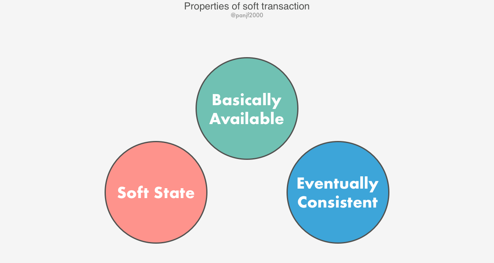

- 基本可用（**B**asically **A**vailable）：系统能够基本运行、一直提供服务。
- 软状态（**S**oft-state）：系统不要求一直保持强一致状态
- 最终一致性（**E**ventual consistency）：系统需要在某一时刻后达到一致性要求

柔性事务，降低了一致性和隔离性的要求以提高吞吐量。**但是仍然要求 `ACID` 原则**

### 本地事务

**本地事务**（Local Transaction）指的是仅仅对单一节点/数据库资源对象进行访问/更新的事务，在这种事务模式下，`BASE` 理论派不上用场，事务完全遵循 `ACID` 规范，确保事务为刚性事务。

### 分布式事务

访问/更新由多个服务器管理的资源对象的**平面事务**或者**嵌套事务**称之为**分布式事务**（Distributed Transaction），分布式事务是相对于本地事务来说的。

- 平面事务：单一事务，访问多个服务器节点的资源对象，一个平面事务完成一次请求之后才能发起下一个请求。
- 嵌套事务：多事务组成，顶层事务可以不断创建子事务，子事务又可以进一步地以任意深度嵌套子事务。

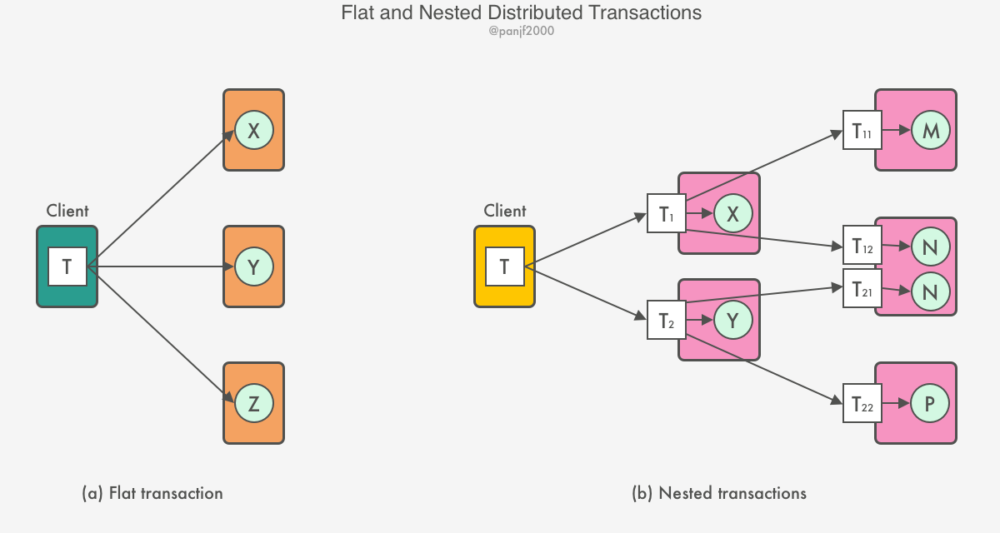

对于分布式事务来说，有两个核心问题：

1. 如何管理分布式事务的 commit/abort？
2. 如何保证并发事务在多个节点的资源和对象上的访问的可串行性，避免死锁？如果事务 T 对某一个服务器节点上的资源对象 S 的并发访问在事务 U 之前，那么我们需要保证在所有服务器节点上对 S 和其他资源对象的冲突访问，T 始终在 U 之前。

### 原子提交协议

> 原子性是分布式事务的前置性约束，没有原子性则分布式事务毫无意义。

以分布式事务的原子性来分析，客户端请求访问/更新多个服务器节点上的资源对象，在客户端提交或放弃该事务从而结束事务之后，多个服务器节点的最终状态要么是该事务里的所有步骤都执行成功之后的状态，要么恢复到事务开始前的状态，不存在中间状态。满足这种约束的分布式事务协议则称之为原子提交协议。

当一个分布式事务结束时，事务的原子特性要求所有参与该事务的服务器节点必须全部提交或者全部放弃该事务，为了实现这一点，必须引入一个`协调者（Coordinator）`的角色，从参与事务的所有服务器节点中挑选一个作为协调者，由它来保证在所有服务器节点上最终获得同样的结果。**协调者的工作原理取决于分布式事务选用的协议**。

一般来说，分布式事务中包含的两个最基础的角色就是：

> - Coordinator -- 协调者
> - Participants -- 参与者

#### 单阶段原子提交协议

**单阶段原子提交协议**（one-phase atomic commit protocol, 1APC）是最简单的一种原子提交协议，它通过设置一个协调者并让它不断地向所有参与者发送提交（commit）或放弃（abort）事务的请求，直到所有参与者确认已执行完相应的操作。

优点：

1. 实现简单

缺点：

1. 不满足复杂场景的事务，因为该协议不允许任何服务器节点单方面放弃事务，事务的放弃必须由协调者来发起；

首先因为只有一次通信，协调者并不会收集所有参与者的本地事务执行的情况，所以协调者决定提交还是放弃事务只基于自己的判断，在参与者执行事务期间可能会遇到错误从而导致最终事务未能真正提交，错误一般与事务的并发控制有关，比如事务执行期间对资源对象加锁，遇到死锁，需要放弃事务从而解开死锁，而协调者并不知道，因此在发起下一个请求之前，客户端完全不知道事务已被放弃。另一种情况就是利用乐观并发控制机制访问资源对象，某一个服务器节点的验证失败将导致事务被放弃，而协调者完全不知情。

### 两阶段提交协议

#### 定义

> **两阶段提交协议**（two-phase commit protocol, 2PC）的设计初衷是为了解决 1APC 不允许任意一个服务器节点自行放弃它自己的那部分本地事务的痛点，2PC 允许任何一个参与者自行决定要不要放弃它的本地事务，而由于原子提交协议的约束，任意一个本地事务被放弃将导致整个分布式事务也必须放弃掉。

两阶段提交协议基于以下几个假设：

- 存在一个节点作为协调者（Coordinator），分布式事务通常由协调者发起（当然也可以由参与者发起），其余节点作为参与者（Participants），且节点之间可以自由地进行网络通信，协调者负责启动两阶段提交流程以及决定事务最终是被提交还是放弃。
- 每个节点会记录该节点上的本地操作日志（op logs），日志必须持久化在可靠的存储设备上（比如磁盘），以便在节点重启之后需要恢复操作日志。另外，**不记录全局操作日志**。
- 所有节点不能发生永久性损坏，也就是说节点就算是损坏了也必须能通过可靠性存储恢复如初，不允许出现数据永久丢失的情况。
- 参与者对协调者的回复必须要去除掉那些受损和重复的消息。
- 整个集群不会出现拜占庭故障（Byzantine Fault）-- 服务器要么崩溃，要么服从其发送的消息。

#### 原理

整个过程需要分为两个阶段：

1. 准备阶段（Prepare Phase）
2. 提交阶段（Commit Phase）

在进行两阶段提交的过程中，协调者会在以下四种状态间流转：

1. `init`
2. `preparing`
3. `committed`
4. `aborted`

而参与者则会在以下三种状态间流转：

1. `working`
2. `prepared`
3. `committed`

##### 阶段一（投票表决阶段）

> 1. 参与者的初始状态为 `working`，协调者的初始状态为 `init`。
> 2. 参与者和协调者都**在每次状态变更的时候**需要记录日志到可靠性存储设备以便于事务失败或者机器宕机等情况下的回滚：
>    1. `ready T`， `don't commit T` 参与者表示本地事务执行成功或者失败；
>    2. `prepared T` 协调者表示事务已经准备好，准备向所有的参与者发起投票；
>    3. `abort T` 协调者表示事务执行失败，要求所有参与者回滚；
>    4. `commit T` 协调者表示事务执行完成，要求所有参与者提交。
> 3. 在两个阶段，有以下不同的消息：
>    1. `ready T` 参与者表名本地事务已经执行成功；
>    2. `canCommit?` 协调者要求所有的参与者执行本地事务； 
>    3. `doCommit` 协调者要求所有执行者提交本地事务；
>    4. `doAbort` 协调者要求所有执行者回滚本地事务；
>    5. `haveCommited` 参与者通知协调者本地事务提交成功。

1. 任意一个参与者发起 **本地事务** 并执行本地事务成功，将一条 `<ready T>` 写入到可靠性存储设备上，从 `working` 状态变更到 `prepared`，并向协调者发送 `<prepare T>` 消息；
2. 协调者收到来自参与者的 `<prepare T>` 消息之后，将一条 `<prepared T>` 写入到可靠性存储设备上，从 `init` 状态变更到 `preparing`，接着向其他的分布式事务参与者发出一条 `canCommit?` 消息，**发起事务表决过程**。
3. 当参与者收到 `canCommit?` 消息之后，除了发起事务的那个参与者之外，其他还在 `working` 的参与者会先尝试执行本地事务，如果本地事务执行成功，则会往可靠性存储设备写入一条 `<ready T>`,**但不提交事务。**从`working`状态变更到 `prepared` 状态，然后回复一条 `<ready T>` 消息对事务投票 YES；如果本地事务执行失败，则会往可靠性存储设备写入一条 `<don't commit T>`，然后回复一条 `<don't commit>` 投票 NO。

##### 阶段二（收集投票结果完成事务）

4. 协调者收集所有的投票（包括它自己的投票）；
   1. 如果所有的投票都是 `ready T`，则表示没有故障发生，那么协调者决定提交该事务，首先它会在其本地日志中追加一条 `<commit T>` 记录，从 `preparing` 状态进入 `committed` 状态，然后向所有的参与者发送 `doCommit` 请求消息，要求参与者提交它们的本地事务；
   2. 如果有任一个投票是 No，则协调者决定放弃掉该事务，首先它会往本地日志中追加一条 记录，从 `preparing` 状态进入 `aborted` 状态，然后发送 `doAbort` 请求消息给所有的参与者，通知它们回滚各自的本地事务。
5. 投了 YES 票的参与者阻塞等待协调者给它发来 `doCommit` 或 `doAbort` 消息，如果接收到的是 `doCommit` 消息则提交本地事务并在此过程中记录日志 `<commit T>`，然后进入 `committed` 状态，最后回复一个 `haveCommitted` 的消息通知协调者本地事务已经成功提交；反之，如果收到的是 `doAbort` 消息则回滚本地事务并写入日志 `<abort T>`，然后进入 `aborted`状态。

上面的过程是一种更通用的流程，即由任意的参与者发起一个分布式事务，而在实践中一般把分布式事务的发起交给协调者来做，减少事务发起者确认该事务已被提交所需等待的网络消息延迟：

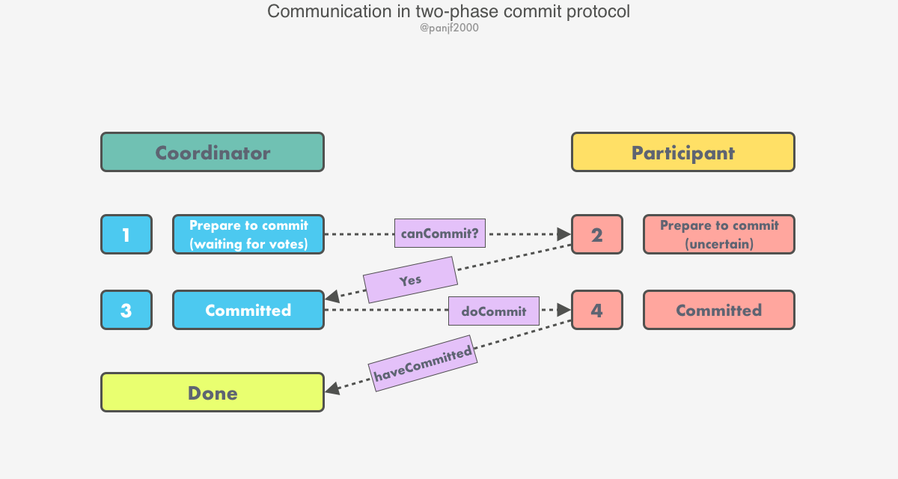

#### 性能

##### 网络I/O开销

假设两阶段提交过程一切运行正常，即协调者和参与者都不出现崩溃和重启，网络通信也都正常。那么假设有一个协调者和 N 个参与者，两阶段提交过程中将会发送如下的消息：

- 任意一个参与者从 `working` 状态进入 `prepared` 状态并发送 `Prepared` 消息给协调者，1 条消息。
- 协调者收到消息后，向其他参与者发送 `canCommit?` 请求消息，N - 1 条消息。
- 收到 `canCommit?` 消息的参与者各自回复协调者投票消息，N - 1 条消息。
- 协调者统计投票情况之后，发送 `doCommit` 消息给其他参与者，N 条消息。

所以，事务发起者在经过 4 条网络消息延迟之后确认该分布式事务已被提交，而整个过程共计发送 3N - 1 条网络消息（因为 `haveCommitted` 在 2PC 仅仅是用于最后通知协调者而已，属于可有可无的一次网络消息，2PC 在该消息缺省的情况下也能正常运行，因此 `haveCommitted` 一般不计入网络延迟成本中）。

前面我们提到，在实践中一般是由协调者来发起事务，如果考虑这种情况的话，事务发起者 -- 协调者在经过 3 条网络消息延迟之后确认该分布式事务已经被提交，而整个过程实际发送的网络消息则变成 3N 条。

总而言之，两阶段提交协议的网络通信开销和集群节点的数量成 3 倍正比。

##### 本地存储设备 I/O 开销

每个节点会通过日志来记录在本地执行的操作，以便在节点发生故障并重启节点之后能利用日志恢复到故障前的状态

- 发起事务的参与者执行本地事务，1 次写操作。
- 其余参与者执行各自的本地事务，N - 1 次写操作。
- 协调者统计投票结果并决定提交事务，1 次写操作。

##### 恢复

1. 如果 T 的最后一条日志记录是 `<commit T>`，那么说明协调者在节点发生故障时的全局决策是提交 T，根据本地事务所使用的日志方式，在该节点上可能需要执行 `redo T`。
2. 如果 T 的最后一条日志记录是 `<abort T>`，那么说明协调者在节点发生故障时的全局决策是中止 T，根据本地事务所使用的日志方式，在该节点上可能需要执行 `undo T`。
3. 如果 T 的最后一条日志记录是 `<don't commit T>`，则和第 2 中情况类似，执行 `undo T`。
4. 如果 T 的最后一条日志记录是 `<ready T>`，这种情况比较麻烦，因为恢复节点无法确认在它故障之后协调者发出的最终全局决策是什么，因此它必须要和集群中其余至少一个节点取得联系，询问 T 的最终结果是什么：恢复节点先尝试询问协调者，如果此时协调者正在工作，则告知恢复节点 T 的最终结果，如果是提交就执行 `redo T`，中止就执行 `undo T`；如果协调者因故不在工作，则恢复节点可以要求其他某一个参与者节点去查看本地日志以找出 T 的最终结果并告知恢复节点。在最坏的情况下，恢复节点无法和集群中其他所有节点取得联系，这时恢复节点只能阻塞等待，直至得知 T 的最终结果是提交还是中止。
5. 如果本地日志中没有记录任何关于 T 在两阶段提交过程中的操作，那么根据前面的两阶段提交流程可知恢复节点还没来得及回复协调者的 `canCommit?` 请求消息就发生了故障，因此根据两阶段算法，恢复节点只能执行 `undo T`

##### 缺陷

1. **同步阻塞**：两阶段提交协议是一个阻塞的协议，在第二阶段期间，参与者在事务未提交之前会一直锁定其占有的本地资源对象，直到接收到来自协调者的 `doCommit` 或 `doAbort` 消息。
2. **单点故障**：两阶段提交协议中只有一个协调者，而由于在第二阶段中参与者在收到协调者的进一步指示之前会一直锁住本地资源对象，如果唯一的协调者此时出现故障而崩溃掉之后，那么所有参与者都将无限期地阻塞下去，也就是一直锁住本地资源对象而导致其他进程无法使用。
3. **数据不一致**：如果在两阶段提交协议的第二阶段中，协调者向所有参与者发送 `doCommit` 消息之后，发生了局部网络抖动或者异常，抑或是协调者在只发送了部分消息之后就崩溃了，那么就只会有部分参与者接收到了 `doCommit` 消息并提交了本地事务；其他未收到 `doCommit` 消息的参与者则不会提交本地事务，因而导致了数据不一致问题。

##### 几种异常场景下的例子（协调者发起事务）

1. 在协调者收到事务请求，并向所有的机器发起 `canCommit?` 消息要求执行本地事务。
   1. 网络抖动导致部分消息收到，部分消息未收到：此时部分消息未收到的会因为超时导致协调者发起 `abort`，收到消息的参与者可以通过 `ready T` 消息进行 `undo`。
   2. 发出 `canCommit?` 消息之后协调者宕机，参与者由于接受 `doCommit`/`doAbort` 消息超时进行 `undo`。

##### XA 标准接口

2PC 两阶段提交协议本身只是一个通用协议，不提供具体的工程实现的规范和标准，在工程实践中为了统一标准，减少行业内不必要的对接成本，需要制定标准化的处理模型及接口标准，国际开放标准组织 Open Group 定义了分布式事务处理模型 **DTP**（Distributed Transaction Processing）Model，现在 XA 已经成为 2PC 分布式事务提交的事实标准，很多主流数据库如 Oracle、MySQL 等都已经实现 XA。

两阶段事务提交采用的是 X/OPEN 组织所定义的 [DTP Model](http://pubs.opengroup.org/onlinepubs/009680699/toc.pdf) 所抽象的 AP（应用程序）, TM（事务管理器）和 RM（资源管理器） 概念来保证分布式事务的强一致性。 其中 TM 与 RM 间采用 XA 的协议进行双向通信。 与传统的本地事务相比，XA 事务增加了准备阶段，**数据库除了被动接受提交指令外，还可以反向通知调用方事务是否可以被提交**。 `TM` 可以收集所有分支事务的准备结果，并于最后进行原子提交，以保证事务的强一致性。


Java 通过定义 JTA 接口实现了 XA 模型，JTA 接口中的 `ResourceManager` 需要数据库厂商提供 XA 驱动实现， `TransactionManager` 则需要事务管理器的厂商实现，传统的事务管理器需要同应用服务器绑定，因此使用的成本很高。 而嵌入式的事务管器可以以 jar 包的形式提供服务，同 Apache ShardingSphere 集成后，可保证分片后跨库事务强一致性。

### 三阶段提交协议

三阶段提交协议是对两阶段提交协议的扩展，它在特定假设下避免了同步阻塞的问题。该协议基于以下两个假设：

1. > 1. 集群不发生网络分区；
   > 2. 故障节点数不超过 K 个（K 是预先设定的一个数值）。

基于这两个假设，三阶段提交协议通过引入***超时机制***和一个***额外的阶段***来解决阻塞问题，三阶段提交协议把两阶段提交协议的第一个阶段拆分成了两步：1) 评估，2) 资源对象加锁，最后才真正提交：

1. **CanCommit 阶段**：协调者发送 `CanCommit` 请求消息，询问各个参与者节点，参与者节点各自评估本地事务是否可以执行并回复消息（可以执行则回复 YES，否则回复 NO），此阶段不执行事务，只做判断；
2. **PreCommit 阶段**：协调者根据上一阶段收集的反馈决定通知各个参与者节点执行（但不提交）或中止本地事务；有两种可能：1) 所有回复都是 YES，则发送 `PreCommit` 请求消息，要求所有参与者执行事务并追加记录到 undo 和 redo 日志，如果事务执行成功则参与者回复 ACK 响应消息，并等待下一阶段的指令；2) 反馈消息中只要有一个 NO，或者等待超时之后协调者都没有收到参与者的回复，那么协调者会中止事务，发送 `Abort` 请求消息给所有参与者，参与者收到该请求后中止本地事务，或者参与者超时等待仍未收到协调者的消息，同样也中止当前本地事务。
3. **DoCommit 阶段**：协调者根据上一阶段收集到的反馈决定通知各个参与者节点提交或回滚本地事务，分三种情况：1) 协调者收到全部参与者回复的 ACK，则向所有参与者节点广播 `DoCommit` 请求消息，各个参与者节点收到协调者的消息之后决定提交事务，然后释放资源对象上的锁，成功之后向协调者回复 ACK，协调者接收到所有参与者的 ACK 之后，将该分布式事务标记为 `committed`；2) 协调者没有收到全部参与者回复的 ACK（可能参与者回复的不是 ACK，也可能是消息丢失导致超时），那么协调者就会中止事务，首先向所有参与者节点广播 `Abort` 请求消息，各个参与者收到该消息后利用上一阶段的 undo 日志进行事务的回滚，释放占用的资源对象，然后回复协调者 ACK 消息，协调者收到参与者的 ACK 消息后将该分布式事务标记为 `aborted`；3) 参与者一直没有收到协调者的消息，等待超时之后会直接提交事务。

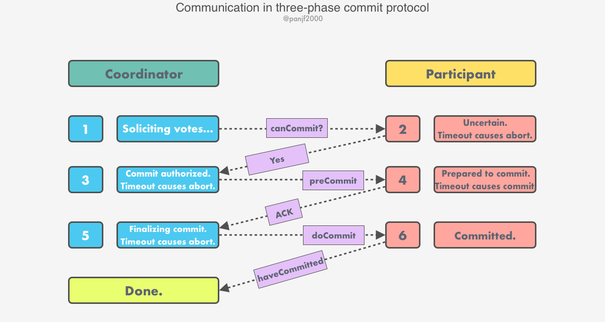

事实上，在最后阶段，协调者不是通过追加本地日志的方式记录提交决定的，而是首先保证让至少 K 个参与者节点知道它决定提交该分布式事务。如果协调者发生故障了，那么剩下的参与者节点会重新选举一个新的协调者，这个新的协调者就可以在集群中不超过 K 个参与者节点故障的情况下学习到旧协调者之前是否已经决定要提交分布式事务，若是，则重新开始协议的第三阶段，否则就中止该事务，重新发起分布式事务。

三阶段提交协议主要着重于解决两阶段提交协议中因为协调者单点故障而引发的同步阻塞问题，虽然相较于两阶段提交协议有所优化，但**还是没解决可能发生的数据不一致问题**，比如由于网络异常导致部分参与者节点没有收到协调者的 `Abort` 请求消息，超时之后这部分参与者会直接提交事务，从而导致集群中的数据不一致，另外三阶段提交协议也无法解决脑裂问题，同时也因为这个协议的网络开销问题，导致它并没有被广泛地使用，有关该协议的具体细节可以参阅本文最后的延伸阅读一节中的文献进一步了解，这里不再深入。

### 共识算法

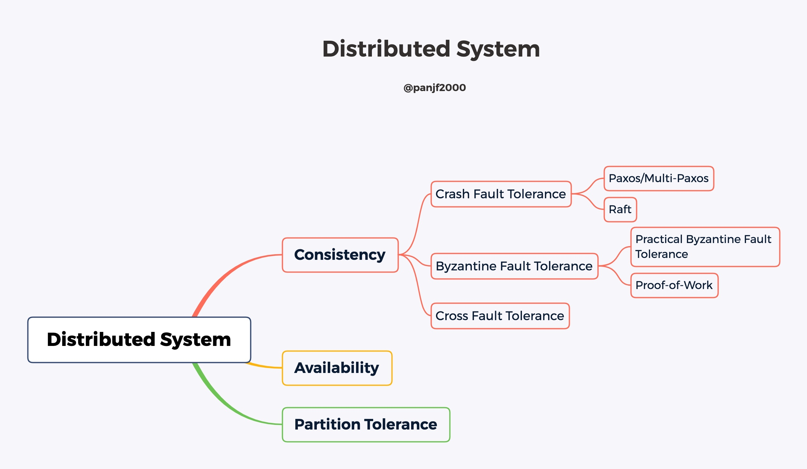

对于分布式系统来讲，各个节点通常都是相同的确定性状态机模型（又称为状态机复制问题，State-Machine Replication），从**相同初始状态开始接收相同顺序的指令，则可以保证相同的结果状态**。因此，系统中多个节点最关键的是对多个事件的顺序进行共识，即排序。

算法共识/一致性算法有两个最核心的约束：1) 安全性（Safety），2) 存活性（Liveness）：

- Safety：保证决议（Value）结果是对的，无歧义的，不会出现错误情况。
  - 只有是被提案者提出的提案才可能被最终批准；
  - 在一次执行中，只批准（chosen）一个最终决议。被多数接受（accept）的结果成为决议；
- Liveness：保证决议过程能在有限时间内完成。
  - 决议总会产生，并且学习者最终能获得被批准的决议。

#### Paxos

[参考 Paxos Made Simple](#Paxos Made Simple)

#### Multi-Paxos

Basic Paxos 算法有几个天然缺陷：

> 1. 只能就单个值（Value）达成共识，不支持多值共识。在实际的工程实践中往往是需要对一系列的操作达成共识，比如分布式事务，由很多执行命令组成。
> 2. 至少需要 2 轮往返 4 次 ***prepare*** 和 ***accept*** 网络通信才能基于一项提案达成共识。对于一个分布式系统来说，网络通信是最影响性能的因素之一，过多的网络通信往往会导致系统的性能瓶颈。
> 3. 不限制 Proposer 数量导致非常容易发生提案冲突。极端情况下，多 Proposer 会导致系统出现『活锁』，破坏分布式共识算法的两大约束之一的活性（liveness）。

让我们设想一种场景：两个 Proposers (记为 P1 和 P2) 轮替着发起提案，导致两个 Paxos 流程重叠了：

> 1. 首先，P1 发送编号 N1 的 ***prepare*** 请求到 Acceptors 集合，收到了过半的回复，完成阶段一。
> 2. 紧接着 P2 也进入阶段一，发送编号 N2 的 ***prepare*** 请求到过半的 Acceptors 集合，也收到了过半的回复，Acceptors 集合承诺不再接受编号小于 N2 的提案。
> 3. 然后 P1 进入阶段二，发送编号 N1 的 ***accept*** 请求被 Acceptors 忽略，于是 P1 重新进入阶段一发送编号 N3 的 ***prepare*** 请求到 Acceptors 集合，Acceptors 又承诺不再接受编号小于 N3 的提案。
> 4. 紧接着 P2 进入阶段二，发送编号 N2 的 ***accept*** 请求，又被 Acceptors 忽略。
> 5. 不断重复上面的过程......

Multi-Paxos 算法在 Basic Paxos 的基础上做了两点改进：

> 1. **多 Paxos 实例**：针对每一个需要达成共识的单值都运行一次 Basic Paxos 算法的实例，并使用 Instance ID 做标识，最后汇总完成多值共识。
> 2. **选举单一的 Leader Proposer**：选举出一个 Leader Proposer，所有提案只能由 Leader Proposer 来发起并决策，Leader Proposer 作为 Paxos 算法流程中唯一的提案发起者，『活锁』将不复存在。此外，由于单一 Proposer 不存在提案竞争的问题，Paxos 算法流程中的阶段一中的 ***prepare*** 步骤也可以省略掉，从而将两阶段流程变成一阶段，大大减少网络通信次数。

关于多值共识的优化，如果每一个 Basic Paxos 算法实例都设置一个 Leader Proposer 来工作，还是会产生大量的网络通信开销，因此，多个 Paxos 实例可以共享同一个 Leader Proposer，这要求该 Leader Proposer 必须是稳定的，也即 Leader 不应该在 Paxos 流程中崩溃或改变。

####  Google Chubby 的 Multi-Paxos 实现

首先，Chubby 通过引入 Master 节点，实现了 Lamport 在论文中提到的 single distinguished proposer，也就是 Leader Proposer，Leader Proposer 作为 Paxos 算法流程中唯一的提案发起者，规避了多 Proposers 同时发起提案的场景，也就不存在提案冲突的情况了，从而解决了『活锁』的问题，保证了算法的活性（liveness）。

Lamport 在论文中指出，选择 Leader Proposer 的过程必须是可靠的，那么具体如何选择一个 Leader Proposer 呢？在 Chubby 中，集群利用 Basic Paxos 算法的共识功能来完成对 Leader Proposer 的选举，这个实现是具有天然合理性的，因为 Basic Paxos 本身就是一个非常可靠而且经过严格数学证明的共识算法，用来作为选举算法再合适不过了，在 Multi-Paxos 流程期间，Master 会通过不断续租的方式来延长租期（Lease）。比如在实际场景中，一般在长达几天的时期内都是同一个服务器节点作为 Master。万一 Master 故障了，那么剩下的 Slaves 节点会重新发起 Paxos 流程票选出新的 Master，也就是说主节点是一直存在的，而且是唯一的。

此外，Lamport 在论文中提到的过一种优化网络通信的方法：“当 Leader Proposer 处于稳定状态时，可以跳过阶段一，直接进入阶段二”，在 Chubby 中也实现了这个优化机制，Leader Proposer 在为多个 Paxos 算法实例服务的时候直接跳过阶段一进入阶段二，只发送 ***accept*** 请求消息给 Acceptors 集合，将算法从两阶段优化成了一阶段，大大节省网络带宽和提升系统性能。

最后，Multi-Paxos 是一个"脑裂"容错的算法思想，**就是说当 Multi-Paxos 流程中因为网络问题而出现多 Leaders 的情况下，该算法的安全性（safety ）约束依然能得到保证，因为在这种情况下，Multi-Paxos 实际上是退化成了 Basic Paxos，而 Basic Paxos 天然就支持多 Proposers**。

在分布式事务中，Paxos 算法能够提供比两阶段提交协议更加可靠的一致性提交：**通过将提交/放弃事务的决定从原来两阶段协议中单一的协调者转移到一个由 Proposer + Acceptors 组成的集群中**。Lamport 曾经发表过一篇[《Consensus on Transaction Commit》](https://lamport.azurewebsites.net/video/consensus-on-transaction-commit.pdf)的论文，通过将两阶段提交协议和基于 Paxos 实现的分布式提交协议做对比，对基于 Paxos 实现的提交协议有非常精彩的论述，感兴趣的读者不妨一读。

#### Raft

Raft 算法实际上是 Multi-Paxos 的一个变种，通过新增两个约束：

1. **追加日志约束**：Raft 中追加节点的日志必须是**串行连续**的，而 Multi-Paxos 中则可以**并发追加**日志（实际上 Multi-Paxos 的并发也只是针对日志追加，最后应用到内部 State Machine 的时候还是必须保证顺序）。
2. **选主限制**：Raft 中只有那些拥有最新、最全日志的节点才能当选 Leader 节点，而 Multi-Paxos 由于允许并发写日志，因此无法确定一个拥有最新、最全日志的节点，因此可以选择任意一个节点作为 Leader，但是选主之后必须要把 Leader 节点的日志补全。

对比一下 Multi-Paxos 和 Raft 下集群中可能存在的日志顺序：

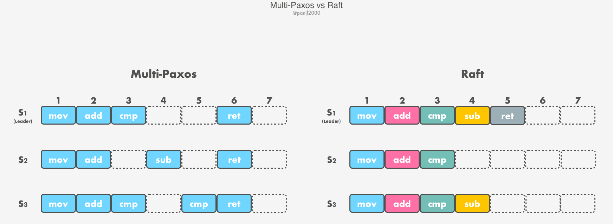

#### 算法类型

- Crash Fault Tolerance (CFT) 
- Byzantine Fault Tolerance（BFT）

### 并发控制

#### 锁并发控制

在分布式事务中，某个对象的锁总是本地持有的（在同一个服务器节点上）。是否加锁是由本地锁管理器（Local Lock Manager，LLM）决定的。LLM 决定是满足客户端持锁的请求，还是阻塞客户端发起的分布式事务。但是，事务在所有服务器节点上被提交或者放弃之前，LLM 不能释放任何锁。在使用加锁机制的并发控制中，原子提交协议在进行的过程中资源对象始终被锁住，并且是排他锁，其他事务无法染指这些资源对象。但如果事务在两阶段提交协议的阶段一就被放弃，则互斥锁可以提前释放。

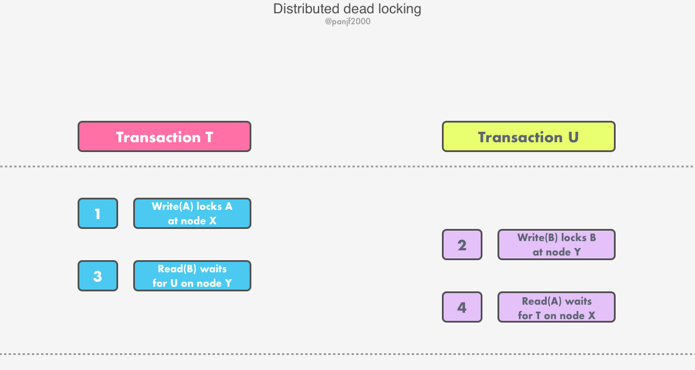

分布式死锁需要通过特定的方法/算法来检测并解除，一旦检测到死锁，则必须放弃其中的某个事务来解除死锁，然后通知事务协调者，它将会放弃该事务所涉及的所有参与者上的事务

#### 时间戳并发控制

对于单一服务器节点的事务来说，协调者在每个事务启动时会为其分配一个全局唯一的时间戳。通过按照访问资源对象的事务时间戳顺序提交资源对象的版本来强制保证以事务执行的串行等价性。在分布式事务中，协调者必须保证每个事务都会附带全局唯一的时间戳。全局唯一的时间戳由事务访问的第一个协调者发给客户端。如果任意一个服务器节点上的资源对象执行了事务中的一个操作，那么事务时间戳会被发送给该服务器节点上的协调者。

分布式事务中的所有服务器节点共同保证事务以串行等价的方式执行。例如，如果在某服务器节点上，由事务 U 访问的资源对象版本在事务 T 访问之后提交；而在另一个服务器节点上，事务 T 和事务 U 又访问了同一个资源对象，那么它们也必须按照相同的次序提交资源对象。为了保证所有服务器节点上的事务执行的相同顺序，协调者必须就时间戳排序达成一致。时间戳是一个二元组 < 本地时间戳，服务器 ID > 对。在时间戳的比较排序过程中，首先比较本地时间戳，然后再比较服务器 ID。

#### 乐观并发控制

1. **锁的维护带来了很多新的开销**。这些开销在不支持对共享数据并发访问的系统中是不存在的。即使是只读事务（如查询），就算这一类事务不会改变数据的完整性，却仍然需要利用锁来保证数据在读取过程中不会被其他事务修改，然而锁却只在最极端的情况下才会发挥作用。
2. **锁机制非常容易引发死锁**。预防死锁会严重降低并发度，因此必须利用超时或者死锁检测来解除死锁，但这些死锁解除方案对于交互式的程序来说并不是很理想。
3. **锁周期过长**。为了避免事务的连锁（雪崩）放弃，锁必须保留到事务结束之时才能释放，这再一次严重降低了系统的并发度。

在大多数应用中两个客户端事务访问同一个资源对象的可能性其实很低，事务总是能够成功执行，就好像事务之间不存在冲突一样。

所以事务的乐观并发控制的基本思路就是：各个并发事务只有在执行完成之后并且发出 `closeTransaction` 请求时，再去检测是否有冲突，如果确实存在冲突，那么就放弃一些事务，然后让客户端重新启动这些事务进行重试。

在乐观并发控制中，每个事务在提交之前都必须进行验证。事务在验证开始时首先要附加一个事务号，事务的串行化就是根据这些事务号的顺序实现的。分布式事务的验证由一组独立的服务器节点共同完成，每个服务器节点验证访问自己资源对象的事务。这些验证在两阶段提交协议的第一个阶段进行。

## 分布式系统理论基础 - 一致性、2PC和3PC

### 一致性(consensus)

假设一个具有N个节点的分布式系统，当其满足以下条件时，我们说这个系统满足一致性：

1. **全认同(agreement)**: 所有N个节点都认同一个结果
2. **值合法(validity)**: 该结果必须由N个节点中的节点提出
3. **可结束(termination)**: 决议过程在一定时间内结束，不会无休止地进行下去

它面临着这些问题：

- **消息传递异步无序(asynchronous)**: 现实网络不是一个可靠的信道，存在消息延时、丢失，节点间消息传递做不到同步有序(synchronous)
- **节点宕机(fail-stop)**: 节点持续宕机，不会恢复
- **节点宕机恢复(fail-recover)**: 节点宕机一段时间后恢复，在分布式系统中最常见
- **网络分化(network partition)**: 网络链路出现问题，将N个节点隔离成多个部分
- **拜占庭将军问题(byzantine failure)**[2]: 节点或宕机或逻辑失败，甚至不按套路出牌抛出干扰决议的信息

```text
我: 老王，今晚7点老地方，搓够48圈不见不散！
……
（第二天凌晨3点） 隔壁老王: 没问题！       // 消息延迟
我: ……
----------------------------------------------
我: 小张，今晚7点老地方，搓够48圈不见不散！
小张: No ……                           
（两小时后……）
小张: No problem！                     // 宕机节点恢复
我: ……
-----------------------------------------------
我: 老李头，今晚7点老地方，搓够48圈不见不散！
老李: 必须的，大保健走起！               // 拜占庭将军
（这是要打麻将呢？还是要大保健？还是一边打麻将一边大保健……
```

我们把以上所列的问题称为系统模型(system model)，讨论分布式系统理论和工程实践的时候，必先划定模型。例如有以下两种模型：

1. 异步环境(asynchronous)下，节点宕机(fail-stop)
2. 异步环境(asynchronous)下，节点宕机恢复(fail-recover)、网络分化(network partition)

一致性还具备两个属性:

- 强一致(safety)，它要求所有节点状态一致、共进退
- 可用(liveness)，它要求分布式系统24*7无间断对外服务

工程实践上根据具体的业务场景，或保证强一致(safety)，或在节点宕机、网络分化的时候保证可用(liveness)。2PC、3PC是相对简单的解决一致性问题的协议，下面我们就来了解2PC和3PC。

### 2pc

2pc是一个非常经典的**强一致、中心化的原子提交协议**。这里所说的中心化是指协议中有两类节点：一个是`中心化`**协调者节点（coordinator）**和**N个参与者节点（partcipant）**。

|                名词                | 描述                                                     |
| :--------------------------------: | -------------------------------------------------------- |
|        协调者(coordinator)         | 提议的节点                                               |
|  参与者(participants, 或cohorts)   | 参与决议节点称                                           |
| 协调者备份（coordinator watchdog） | 当coordinator宕机时，需要另外一个角色将状态转换为 `结束` |

2PC(two phase commit)两阶段提交顾名思义它分成两个阶段，先由一方进行提议(propose)并收集其他节点的反馈(vote)，再根据反馈决定提交(commit)或中止(abort)事务。我们将提议的节点称为协调者(coordinator)，其他参与决议节点称为参与者(participants, 或cohorts)：

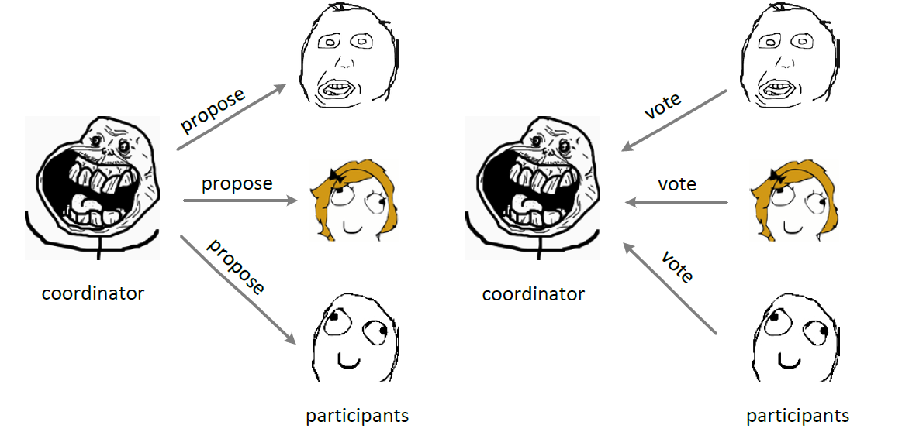

#### 2pc, phase one

在阶段1中，coordinator发起一个提议，分别问询各participant是否接受。

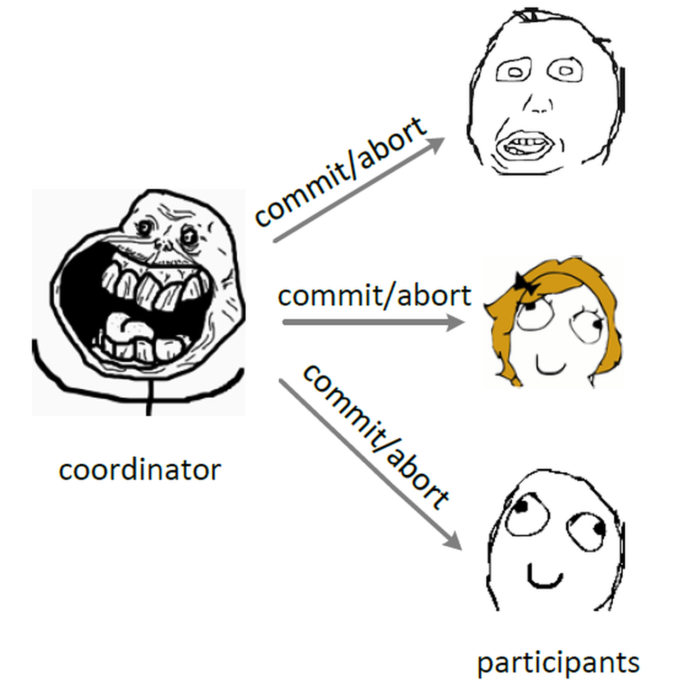

#### 2pc, phase two

在阶段2中，coordinator根据participant的反馈，提交或中止事务，如果participant全部同意则提交，只要有一个participant不同意就中止。

> 在异步环境(asynchronous)并且**没有节点宕机(fail-stop)**的模型下，2PC可以满足全认同、值合法、可结束，是解决一致性问题的一种协议。但如果再加上节点宕机(fail-recover)的考虑，2PC是否还能解决一致性问题呢？

coordinator如果在发起提议后宕机，那么participant将进入阻塞(block)状态、一直等待coordinator回应以完成该次决议。这时需要另一角色把系统从不可结束的状态中带出来，我们把新增的这一角色叫协调者备份(coordinator watchdog)。coordinator宕机一定时间后，watchdog接替原coordinator工作，通过问询(query) 各participant的状态，决定阶段2是提交还是中止。**这也要求 coordinator/participant 记录(logging)历史状态，以备coordinator宕机后watchdog对participant查询、coordinator宕机恢复后重新找回状态。**

从coordinator接收到一次事务请求、发起提议到事务完成，经过2PC协议后增加了2次RTT(propose+commit)，带来的时延(latency)增加相对较少。

#### 2pc，总结

> 以下都以1个coordinator，2个participant作为示例，假设 coordinator 为 c，2个 participant 分别为 p1, p2

在 2pc 下，我们整个过程可以总结为以下步骤：

1. coordinator 发起 propose；
2. participants 收到 propose；
   1. p1 收到 propose；
   2. p2 收到 propose；
3. participants 执行 propose 并根据 propose 结果进行 vote；
   1. p1 vote
   2. p2 vote
4. Cordinator 收到所有的 vote，根据 vote 的结果决定执行 commit/abort
   1. 向 p1 发送 commit/abort
   2. 向 p2 发送 commit/abort
5. participants 收到 commit/abort 之后根据收到的讯息执行 commit/abort

2pc 可能在异步环境，节点宕机，节点宕机恢复的问题下可能出现错误的情况：

| 错误                                                    | 处理                                           |
| ------------------------------------------------------- | ---------------------------------------------- |
| coordinator 发起 propose 全部失败                       | 事务直接失败，无需发送 abort；                 |
| coordinator 发起 propose 到 participants 中的某一台失败 | coordinator 向所有的 participants 发送 abort； |

## Paxos Made Simple

### 一、前言

本文根据《Paxos Made Simple》重新描述Paxos协议，提供两种证明方法，以及理解中常见的误区。希望读者只需通过本文，再结合《Paxos Made Simple》就能在理论上彻底理解基本的Paxos协议。

### 二、基本概念

Proposal Value：   提议的值

Proposal Number：  提议编号，要求提议编号不能冲突

Proposal：      提议 = 提议的值 + 提议编号

Proposer：      提议发起者

Acceptor：      提议接受者

Learner：      提议学习者

协议中Proposer有两个行为，一个是向Acceptor发Prepare请求，另一个是向Acceptor发Accept请求；Acceptor则根据协议规则，对Proposer的请求作出应答；最后Learner可以根据Acceptor的状态，学习最终被确定的值。

**方便讨论，记{n，v}为提议编号为n，提议的值为v的提议，记(m，{n，v})为承诺了Prepare（m）请求，并接受了提议{n，v}。**

### 三、协议过程

> 图解中，虚线表示请求丢失

#### 第一阶段 A：

Proposer选择一个提议编号n，向所有的Acceptor广播Prepare（n）请求，**注意，Prepare 请求是不带 Proposal Value 的**。

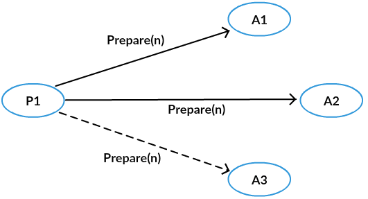

#### 第一阶段B：

Acceptor接收到Prepare（n）请求，若提议编号n比之前接受的Prepare请求都要大，则承诺将不会接受提议编号比n小的提议，并且带上之前Accept的提议中编号小于n的最大的提议，否则不予理会，**下图所有的 Acceptor 都是第一次接受 Prepare 请求**。

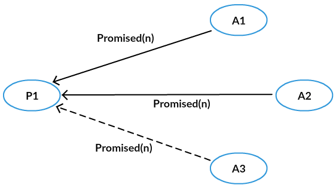

#### 第二阶段A

proposer得到了多数Acceptor的承诺后，如果没有发现有一个Acceptor接受过一个值，那么向所有的Acceptor发起自己的值和提议编号n，否则，从所有接受过的值中选择对应的提议编号最大的，作为提议的值，提议编号仍然为n。

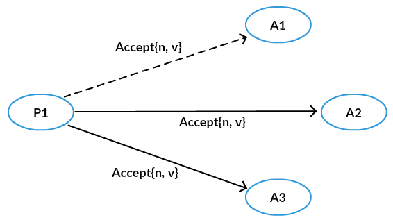

#### 第二阶段B：

Acceptor接收到提议后，如果该提议编号不违反自己做过的承诺，则接受该提议。

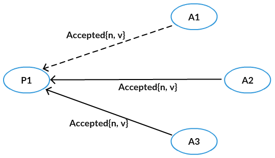

需要注意的是，Proposer发出Prepare（n）请求后，得到多数派的应答，然后可以随便再选择一个多数派广播Accept请求，而**不一定要将Accept请求发给有应答的Acceptor**，这是常见的Paxos理解误区。

上面的图例中，P1广播了Prepare请求，但是给A3的丢失，不过A1、A2成功返回了，即该Prepare请求得到多数派的应答，然后它可以广播Accept请求，但是给A1的丢了，不过A2，A3成功接受了这个提议。因为这个提议被多数派（A2，A3形成多数派）接受，我们称被多数派接受的提议对应的值被Chosen。

这个图例中，三个Acceptor之前都没有接受过Accept请求，所以不用返回接受过的提议，但是如果接受过提议，则根据第一阶段B，要带上之前Accept的提议中编号小于n的最大的提议。

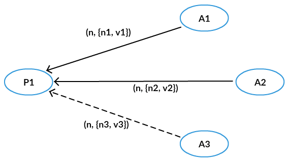

Proposer广播Prepare请求之后，收到了A1和A2的应答，应答中携带了它们之前接受过的{n1, v1}和{n2, v2}，Proposer则根据n1，n2的大小关系，选择较大的那个提议对应的值，比如n1 >n2，那么就选择v1作为提议的值，最后它向Acceptor广播提议{n, v1}。

#### Paxos 协议最终解决了什么问题

当一个提议被多数派接受后，这个提议对应的值被Chosen(选定)，一旦有一个值被Chosen，那么只要按照协议的规则继续交互，后续被Chosen的值都是同一个值，也就是这个Chosen值的一致性问题。

### 协议证明

#### Paxos 原命题

> 如果一个提议｛n0，v0｝被大多数Acceptor接受，那么不存在提议｛n1，v1｝被大多数Acceptor接受，其中n0 < n1，v0 != v1。**需要注意的是，根据 Paxos 的定义，一个提议只需要被大多数 Acceptor 接受即可认为是接受。**

#### Paxos 原命题加强

> 如果一个提议｛n0，v0｝被大多数Acceptor接受，那么不存在Acceptor接受提议｛n1，v1｝，其中n0 < n1，v0 != v1。

#### Paxos 原命题进一步加强

> 如果一个提议｛n0，v0｝被大多数Acceptor接受，那么不存在Proposer发出提议｛n1，v1｝，其中n0 < n1，v0 != v1。

#### 归纳法证明

>假设提议｛m，v｝（简称提议m）被多数派接受，那么提议m到n（如果存在）对应的值都为v，其中 `n>=m`。

当n=m时，结论显然成立。

设n=k时结论成立，即如果提议｛m，v｝被多数派接受，那么提议m到k对应的值都为v，其中 `k >= m`。那么提议m到k对应的值都为v，其中k不小于m。

当n=k+1时，若提议k+1不存在，那么结论成立。

若提议k+1存在，对应的值为v1，则提议为 `{ k+1,  v1 }`，因为提议m已经被多数派接受，所以 `(m, { k+1, v1})` 的Prepare被多数派承诺并返回结果。

基于两个多数派必有交集，易知提议k+1的第一阶段B有带提议回来。那么v1是从返回的提议中选出来的，不妨设这个值是选自提议｛t，v1｝。

根据第二阶段A，因为t是返回的提议中编号最大，所以t >= m。

又由第一阶段B（承诺不会接受小于编号 t 的请求），知道t < n。所以根据假设t对应的值为v。

即有v1 = v。所以由n = k结论成立可以推出n = k+1成立。

于是对于任意的提议编号不小于m的提议n，对应的值都为v。

所以命题成立。

#### 反证法证明

假设存在，不妨设n1是满足条件的最小提议编号。

> 1. 即存在提议｛n1，v1｝，其中n0 < n1，v0 != v1。-------------（A）
> 2. 那么提议n0，n0 + 1，n0 + 2，...，n1 - 1对应的值为v0。-------------（B）

由于存在提议｛n1，v1｝，则说明大多数Acceptor已经接受n1的Prepare，并承诺将不会接受提议编号比n1小的提议。

又因为｛n0，v0｝被大多数Acceptor接受，所以存在一个Acceptor既对n1的Prepare进行了承诺，又接受了提议n0。

由协议的第一阶段B知，这个Acceptor先接受了｛n0，v0｝（**因为如果先接受 { n1, v1 }，那么第一阶段B将忽略这个 Prepare 请求**）。

所以发出｛n1，v1｝提议的Proposer会从大多数的Acceptor返回中得知（**Proposer 只有在得到了大多数 Acceptor 的 Promise 之后，才会发起 Accept，而在 Promise 阶段，收到 Promise 的 Acceptor 会返回之前 Accept 的提议提议中编号小于 n 的最大提议。**）：

> 至少某个编号不小于n0而且值为v0的提议已经被接受。-------------（C）

由协议的第二阶段A知，

> 该Proposer会从已经被接受的值中选择一个提议编号最大的，作为提议的值。

由（C）知该提议编号不小于n0，由协议第二阶段B知，该提议编号小于n1，

于是由（B）知v1 == v0，与（A）矛盾。

所以命题成立。

#### 总结

##### 为什么要被多数派接受？

因为两个多数派之间必有交集，所以Paxos协议一般是2F+1个Acceptor，然后允许最多F个Acceptor停机，而保证协议依然能够正常进行，最终得到一个确定的值。

##### **为什么需要做一个承诺？**

可以保证第二阶段A中Proposer的选择不会受到未来变化的干扰。

另外，对于一个Acceptor而言，这个承诺决定了它回应提议编号较大的Prepare请求，和接受提议编号较小的Accept请求的先后顺序。

##### 为什么第二阶段A要从返回的协议中选择一个编号最大的？

这样选出来的提议编号一定不小于已经被多数派接受的提议编号，进而可以根据假设得到该提议编号对应的值是Chosen的那个值。


