# TiDB 事务

## reference

[Large-scale Incremental Processing Using Distributed Transactions and Notifications](https://www.usenix.org/legacy/event/osdi10/tech/full_papers/Peng.pdf)

[Google Percolator 的事务模型](http://andremouche.github.io/transaction/percolator.html)

[Transaction in TiDB](https://andremouche.github.io/tidb/transaction_in_tidb.html)

## Google Percolator 的事务模型

### Percolator 简介

> Percolator 是标准的 `乐观锁` 模型。

Percolator是由Google公司开发的、为大数据集群进行 **增量处理更新的系统**。

Percolator的特点如下：

- 为增量处理定制
- 处理结果强一致
- 针对大数据量（小数据量用传统的数据库即可）

Percolator为可扩展的增量处理提供了两个主要抽象：

- 基于随机存取库的ACID事务
- 观察者(observers)–一种用于处理增量计算的方式

### 架构

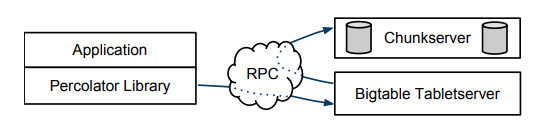

> **percolator底层依赖bigtable，bigtable底层依赖gfs；另外percolator依赖timestamp oracle来分配全局的单调递增的时间戳。**

### Columns in Bigtable

Percolator在BigTable上抽象了五个`Columns`，其中三个跟事务相关，其定义如下

#### Lock

事务产生的锁，未提交的事务会写本项，会包含`primary lock`的位置。其映射关系为

${key,start_ts}=>${primary_key,lock_type,..etc}

- ${key} 数据的key
- ${start_ts} 事务开始时间
- ${primary} 该事务的`primary`的引用. `primary`是在事务执行时，从待修改的`keys`中选择一个作为`primary`,其余的则作为`secondary`.

#### Write

已提交的数据信息，存储数据所对应的时间戳，**可以看做是一个指向 `Data` 的指针** 。其映射关系为

${key,commit_ts}=>${start_ts}

- ${key} 数据的key
- ${commit_ts} 事务的提交时间
- ${start_ts} 该事务的开始时间,指向该数据在`data`中的实际存储位置。

#### Data

具体存储数据集，映射关系为

${key,start_ts} => ${value}

- ${key} 真实的key
- ${start_ts} 对应事务的开始时间
- ${value} 真实的数据值

### 多版本并发控制

percolator通过多版本并发控制来实现snapshot isolation隔离级别的分布式事务，percolator中每行row的一个column对应底层bigtable的多个column，通过这种方式来记录每个column的多版本及锁的信息：

| key  |     bal:data      |  bal:lock   |      bal:write       |
| :--: | :---------------: | :---------: | :------------------: |
| Bob  | 6: <br />5: `$10` | 6: <br />5: | 6: data @ 5 <br />5: |
| Joe  | 6: <br />5: `$2`  | 6: <br />5: | 6: data @ 5 <br />5: |

如上面的表格所示，percolator的balance（余额）这个column对应底层bigtable的bal:data、bal:lock、bal:write这3个column。我们知道bigtable可以看成一个多维的map，key是<row、column、timestamp>，另外bigtable提供单row的跨column的事务能力(bigtable行级的事务指的是read-modify-write这种原子的操作的能力，不是CAS)。上面的表格的含义是Bob的余额是10，这个余额是通过一个事务设置的，事务的开始时间是5，事务的提交时间戳是6；Joe的余额是2，也是通过同样的事务提交的。

#### 两阶段提交

下面通过paper中转账的例子，从Bob账户中转账7美元到Joe的账户，来看下Percolator事务执行的流程。Percolator的事务是通过两阶段提交协议来实现的，事务的执行分成两个步骤，PreWrite和Commit。

笼统的来说，两阶段提交分为以下几个步骤：

1. 修改 (start_timestamp, Bob, lock)对 (start_timestamp, Bob, data) 加锁，并修改 (start_timestamp, Bob, data)；
2. 修改 (start_timestamp, Joe , lock) 对 (start_timestamp, Joe, data) 加锁，并且持有的锁是 `(start_timestamp, Bob, data) ` 的引用，并修改 (start_timestamp, Joe, data)； 
3. 修改 (commit_timestamp, Bob, write) 并删除 (commit_timestamp, Bob, lock) 提交记录；
4. 修改 (commit_timestamp, Joe, write) 并删除 (commit_timestamp, Joe, lock) 提交记录。

> PreWrite阶段1：事务开始时先向timestamp oracle请求最新的时间戳作为事务的开始时间(start_ts)，在这个例子中，事务的开始时间是7。锁住记录，并插入转账后的余额$3。

| key  | bal:data                       | bal:lock                          | bal:write                     |
| :--: | ------------------------------ | :-------------------------------- | :---------------------------- |
| Bob  | 7: `$3`<br />6: <br />5: `$10` | 7: I am primary <br />6: <br />5: | 7: <br />6: data @ 5 <br />5: |
| Joe  | 6: <br />5: `$2`               | 6: <br />5:                       | 6: data @ 5 <br />5:          |

> PreWrite阶段2：锁住Joe的balance这个column，同时写入数据。这里需要注意的是，Joe的锁是一个指针，指向primary。

| key  | bal:data                       | bal:lock                                   | bal:write                     |
| :--: | ------------------------------ | :----------------------------------------- | :---------------------------- |
| Bob  | 7: `$3`<br />6: <br />5: `$10` | 7: I am primary <br />6: <br />5:          | 7: <br />6: data @ 5 <br />5: |
| Joe  | 7: `$9`<br />6: <br />5: `$2`  | 7: primary @ Bob.bal:lock<br />6: <br />5: | 7:<br />6: data @ 5 <br />5:  |

> Commit阶段1：先向timestamp oracle请求时间戳作为事务的commit_ts，在这个例子中，事务的提交时间是8。然后通过删除Bob的primary锁来提交事务，这里需要注意的是，Bob的锁删除之后，实际上Joe的锁也被删除了，因为Joe的锁只是一个指针。

| key  | bal:data                                 | bal:lock                                   | bal:write                                       |
| :--: | :--------------------------------------- | :----------------------------------------- | :---------------------------------------------- |
| Bob  | 8: <br />7: `$3` <br />6: <br />5: `$10` | 8: <br />7: <br />6: <br />5:              | 8: data @ 7 <br />7: <br />6: data @ 5 <br />5: |
| Joe  | 7: `$9` <br />6: <br />5: `$2`           | 7: primary @ Bob.bal:lock<br />6: <br />5: | 7: <br />6: data @ 5 <br />5:                   |

> Commit阶段2：同时提交Joe的记录，清理Joe的锁。

| key  | bal:data                                 | bal:lock                      | bal:write                                       |
| :--: | :--------------------------------------- | :---------------------------- | :---------------------------------------------- |
| Bob  | 8: <br />7: `$3` <br />6: <br />5: `$10` | 8: <br />7: <br />6: <br />5: | 8: data @ 7 <br />7: <br />6: data @ 5 <br />5: |
| Joe  | 8: <br />7: `$9` <br />6: <br />5: `$2`  | 8: <br />7: <br />6: <br />5: | 8: data @ 7<br/>7: <br />6: data @ 5 <br />5:   |

### 冲突处理

percolator提供的是snapshot isolation隔离级别的分布式事务，每个事务看到的是这个事务开始时间start_ts的一个快照，所以并发的读之间不会冲突，通过mvcc机制已经记录的多个版本，直接读快照的版本就可以了；一般情况下，并发的读和并发的写也不会冲突，读的是快照，写是插入新的版本；并发的写和并发的写之间肯定是会冲突的，这个要避免。

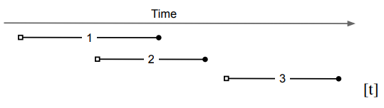

如上图所示， open square表示事务的开始时间start_ts，closed circle表示的是事务的提交时间commit_ts。在这个例子中，事务2看不到事务1的更新，因为事务2的开始时间在事务1的提交时间前面，每个事务只能看到在他开始时间之前已提交的事务；事务3可以看到事务1、事务2的更新；如果事务1、事务2都更新了某条记录的同一个字段的话，只会有一个事务会成功提交，另外一个事务会中止(abort)。

> 注意对某个cell的Prewrite中的所有的步骤都是在bigtable一个行级的事务中完成的，保证了冲突判断和加锁的原子性。

```c++
  // Prewrite tries to lock cell w, returning false in case of conflict.
  bool Prewrite(Write w, Write primary) {
    Column c = w.col;
    // 对于需要修改的行开启 bigtable 事务
    bigtable::Txn T = bigtable::StartRowTransaction(w.row);

    // 根据 SI 的定义
    // 如果存在一个 timestamp 小于本事务的 start_timestamp 的 write，那么直接返回
    // 因为这说明在本事务开始之后，有其他事务已经提交了对这个cell的修改，在这种情况下，为了防止写冲突，直接中止本事务。
    if (T.Read(w.row, c + "write", [start ts, ∞])) return false;
    // 如果存在任意的锁，则表明有事务正在修改本行，也直接返回
    // 这说明有其他的事务已经对这个cell加锁了，也中止本事务 (percolator用的是乐观锁)；
    // 注意这里存在一种情况，就是其他的事务已经提交了，但锁还没有全部释放，在这种情况下，本事务实际上是可以继续执行的，但这种情况发生的概率比较小，所有这里统一处理了。(论文中的原文：It’s possible that the other transaction is just being slow to release its lock after having already committed below our start timestamp, but we consider this unlikely, so we abort. )
    if (T.Read(w.row, c + "lock", [0, ∞])) return false;

    // 先修改 data，再进行加锁，因为 cell 的更改在一个行级事务中。
    // 这里先修改 data 不会引起数据读取（Get）错误，因为在 Get 方法中
    // 会首先通过 latest write = T.Read(row, c + "write", [0, start ts]); 查找小于它的 start_ts 的最后一次的 "write"
    // 而在我们 Prewrite 阶段是没有的，所以 Get 要么获取到之前的数据，要么查询不到数据。
    T.Write(w.row, c + "data", start ts, w.value);
    T.Write(w.row, c + "lock", start ts, 
            {primary.row, primary.col} // The primary’s location.
     ); 
    return T.Commit();
  }
```

```c++
  bool Commit() {
    // 从待修改的 Write 中选取一个作为 primary
    Write primary = writes[0];
    vector < Write > secondaries(writes.begin() + 1, writes.end());
    // 尝试进入 Prewrite 状态，由 Prewrite 的伪代码可以知道
    // 只要有另外一个事务在修改本值会直接 abort 当前事务
    if (!Prewrite(primary, primary)) return false;
    for (Write w: secondaries)
      if (!Prewrite(w, primary)) return false;

    int commit ts = oracle.GetTimestamp();

    // 先提交 Primary
    Write p = primary;
    // 开启 bigtable 行事务
    bigtable::Txn T = bigtable::StartRowTransaction(p.row);
    // 先判断当前的锁是否存在，它的作用是协调异常
    // 有可能本事务执行的比较慢、卡住等其他场景，导致这个事务已经被其他的client给roll back了
    if (!T.Read(p.row, p.col + "lock", [start ts, start ts]))
      return false; // aborted while working
    // 在 write 中写入数据，将 data 指向在 Prewrite 阶段修改后的数据（所以要包含 start_ts）
    T.Write(p.row, p.col + "write", commit ts,
      start ts);
    // 删除锁
    T.Erase(p.row, p.col + "lock", commit ts);
    if (!T.Commit()) return false; // commit point

    // 对 vector<Write> 中所有的数据进行提交
    // 所有的数据写入，都已经在 Prewrite 中完成，所以当 Primary 提交成功时，我们的事务已经执行成功了。
    // 所以我们只需要让所有的数据都指向最新的版本，并且清理锁即可
    for (Write w: secondaries) {
      bigtable::Write(w.row, w.col + "write", commit ts, start ts);
      bigtable::Erase(w.row, w.col + "lock", commit ts);
    }
    return true;
  }
```

```c++
  bool Get(Row row, Column c, string * value) {
    while (true) {
      bigtable::Txn T = bigtable::StartRowTransaction(row);
      // 这里为什么要获取 [0, start_ts] 的锁呢？根据 IS 的定义，难道不是直接读取上个版本的数据即可吗？
      // 这里是为了保证，事务3和事务2符合IS定义。根据IS定义，事务3必须能够读取到事务2的提交。
      if (T.Read(row, c + "lock", [0, start ts])) {
        // There is a pending lock; try to clean it and wait
        BackoffAndMaybeCleanupLock(row, c);
        continue;
      }

      // 获取到锁，我们可以开始读取数据了
      // 找到所有版本号小于 start_ts 的一个锁，根据 IS 的定义这是我们能读取的最新版本了。
      // Find the latest write below our start timestamp.
      latest write = T.Read(row, c + "write", [0, start ts]);
      if (!latest write.found()) return false; // no data
      int data ts = latest write.start timestamp();
      * value = T.Read(row, c + "data", [data ts, data ts]);
      return true;
    }
  }
```

### 全部的伪代码

```c++
class Transaction {
  // 等到 update 的行，列，值
  struct Write {
    Row row;
    Column col;
    string value;
  };
  // 一次事务，可能会更新多个不同的行，列到新的值。
  vector < Write > writes;
  // 开始的时间戳
  int start ts;

  Transaction(): start ts(oracle.GetTimestamp()) {}
  void Set(Write w) {
    writes.push back(w);
  }
  bool Get(Row row, Column c, string * value) {
    while (true) {
      bigtable::Txn T = bigtable::StartRowTransaction(row);
      // Check for locks that signal concurrent writes.
      if (T.Read(row, c + "lock", [0, start ts])) {
        // There is a pending lock; try to clean it and wait
        BackoffAndMaybeCleanupLock(row, c);
        continue;
      }

      // Find the latest write below our start timestamp.
      latest write = T.Read(row, c + "write", [0, start ts]);
      if (!latest write.found()) return false; // no data
      int data ts = latest write.start timestamp();
      * value = T.Read(row, c + "data", [data ts, data ts]);
      return true;
    }
  }
  // Prewrite tries to lock cell w, returning false in case of conflict.
  bool Prewrite(Write w, Write primary) {
    Column c = w.col;
    bigtable::Txn T = bigtable::StartRowTransaction(w.row);

    // Abort on writes after our start timestamp . . .
    if (T.Read(w.row, c + "write", [start ts, ∞])) return false;
    // . . . or locks at any timestamp.
    if (T.Read(w.row, c + "lock", [0, ∞])) return false;

    T.Write(w.row, c + "data", start ts, w.value);
    T.Write(w.row, c + "lock", start ts, {
      primary.row,
      primary.col
    }); // The primary’s location.
    return T.Commit();
  }
  bool Commit() {
    Write primary = writes[0];
    vector < Write > secondaries(writes.begin() + 1, writes.end());
    if (!Prewrite(primary, primary)) return false;
    for (Write w: secondaries)
      if (!Prewrite(w, primary)) return false;

    int commit ts = oracle.GetTimestamp();

    // Commit primary first.
    Write p = primary;
    bigtable::Txn T = bigtable::StartRowTransaction(p.row);
    if (!T.Read(p.row, p.col + "lock", [start ts, start ts]))
      return false; // aborted while working
    T.Write(p.row, p.col + "write", commit ts,
      start ts); // Pointer to data written at start ts .
    T.Erase(p.row, p.col + "lock", commit ts);
    if (!T.Commit()) return false; // commit point

    // Second phase: write out write records for secondary cells.
    for (Write w: secondaries) {
      bigtable::Write(w.row, w.col + "write", commit ts, start ts);
      bigtable::Erase(w.row, w.col + "lock", commit ts);
    }
    return true;
  }
} // class Transaction
```

### 异常处理

在事务执行的任何阶段，事务的协调者percolator worker都有可能挂掉、异常终止、卡死，等各种原因导致事务无法正常执行完成，由于事务的所有的状态都是持久化存储在bigtable中的，其他的client读取事务的状态，**判断事务在commit point之前roll back，在commit point之后roll forward即可**。这也是primary cell lock的作用，协调在异常场景下事务的执行与回滚。其他的worker要如何判断事务是否要回滚呢？Percolator是使用Chubby lockservice，每个percolator的worker会写入这个worker的token，并在token中周期性的保持心跳存活时间，其他的worker判断事务执行的worker没有心跳时间较老，或者token不在了，说明worker卡死或者异常退出了，这时候，可以执行事务的清理了(roll back或者roll forward)。

### Timestamp Oracle

Percolator中的Timestamp Oracle用来分配单调递增的时间戳，用来实现snapshot isolation隔离级别的分布式事务，从上面的流程中可以看到，只读的事务至少请求一次timestamp oracle，读写的事务至少请求两次timestamp oracle，timestamp oracle的性能对整个percolator的性能至关重要。

在Percolator中，Timestamp Oracle会分配一批timestamp到内存中，然后把这批timestamp最大的持久化存储到分布式存储中，当timestamp oracle重启的时候，会从持久化分布式存储中读取最大的这个值，然后从这个值再继续分配timestamp(会造成一部分timestamp浪费，问题不大)。

另外percolator的worker向timestamp oracle请求分配timestamp的时候，会产生大量的rpc请求，为了进一步优化，percolator worker和timestamp oracle只保持一个pending的rpc请求，所有相关的事务timestamp请求聚合在一起，批量请求分配timestamp。

假设有两个事务Tr和Tw，Tr的start_ts在Tw的commit_ts之后， 说明start_ts要么在commit_ts之后，要么start_ts和commit_ts在一个批量的请求中分配的，Tw在加锁之后才会请求commit_ts，所以Tr要么看到Tw的锁，要么看到Tw已经提交了，在前一种情况，Tr会阻塞直到锁被删除为止，所以Tr能看到Tw的修改，所以保证了snapshot隔离级别的语义：Get() returns all committed writes before the transaction’s start timestamp。

> start_ts------Tw------commit_ts
>
> ​                                                             start_ts------Tr------commit_ts

## Transaction in TiDB

本文将详细介绍事务在 `tidb` 中实现，主要内容包括

- 基本概念
- `tidb` 中一致性事务的实现
- `tikv` 中事务相关的接口逻辑
- `tidb` 事务如何做到 `ACID`

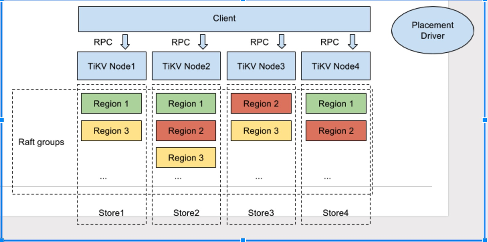

pd 提供两大功能

- 提供包括物理时间的全局唯一递增时间戳 tso
- 管理 raft-kv 集群

`tikv` 对外提供分布式 `kv` 存储引擎，同时实现了 `mvcc` 相关的接口－－方便客户端实现 `ACID` 事务。

### Columns in TIKV

 `tikv` 底层用 `raft+rocksdb` 组成的 `raft-kv` 作为存储引擎，具体落到 `rocksdb` 上的 `column` 有四个，除了一个用于维护 `raft` 集群的元数据外，其它 3 个皆为了保证事务的 `mvcc`, 分别为 `lock`, `write`, `default`，详情如下：

#### Lock

事务产生的锁，未提交的事务会写本项，会包含`primary lock`的位置。其映射关系为

> ${key}=>${start_ts,primary_key,..etc}

#### Write

已提交的数据信息，存储数据所对应的时间戳。其映射关系为

> ${key}_${commit_ts}=>${start_ts}

#### default

具体存储数据集，映射关系为

> ${key}_${start_ts} => ${value}

#### Primary

`TiDB` 对于每个事务，会从涉及到改动的所有 `Key` 中选中一个作为当前事务的 `Primary Key`。 在最终提交时，以 `Primary` 提交是否成功作为整个事务是否执行成功的标识，从而保证了分布式事务的原子性。

有了 `Primary key` 后，简单地说事务两阶段提交过程如下：

1. 从当前事务涉及改动的 keys 选中一个作为 `primary key`, 剩余的则为 `secondary keys`
2. 并行 `prewrite` 所有 `keys`。 这个过程中，所有 key 会在系统中留下一个指向 `primary key` 的锁。
3. 第二阶段提交时，首先 `commit` primary key ,若此步成功，则说明当前事务提交成功。
4. 异步并行 `commit secondary keys`

一个读取过程如下：

1. 读取 key 时，若发现没有冲突的锁，则返回对应值，结束。
2. 若发现了锁，且当前锁对应的 key 为 `primary`： 若锁尚未超时，等待。若锁已超时，Rollback 它并获取上一版本信息返回，结束。
3. 若发现了锁，且当前锁对应的 `key` 为 `secondary`, 则根据其锁里指定的 `primary` 找到 `primary`所在信息，根据 `primary` 的状态决定当前事务是否提交成功，返回对应具体值。

### TIDB 事务处理流程

#### tidb commit transaction

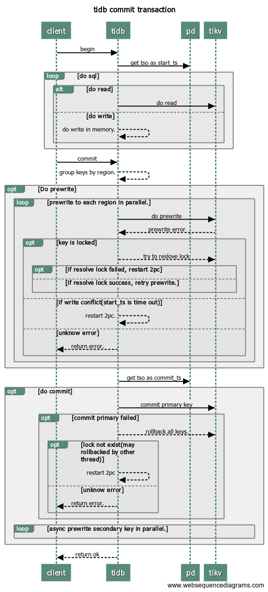

> 注意：所有涉及重新获取 tso 重启事务的两阶段提交的地方，会先检查当前事务是否可以满足重试条件：只有单条语句组成的事务才可以重新获取tso作为start_ts。

1. `client` 向 `tidb` 发起开启事务 `begin`
2. `tidb` 向 `pd` 获取 `tso` 作为当前事务的 `start_ts`
3. `client` 向 `tidb` 执行以下请求：
   - 读操作，从 `tikv` 读取版本 `start_ts` 对应具体数据.
   - 写操作，写入 `memory` 中。
4. `client` 向 `tidb` 发起 `commit` 提交事务请求
5. `tidb` 开始两阶段提交。
6. `tidb` 按照 `region` 对需要写的数据进行分组。
7. `tidb` 开始 `prewrite` 操作：向所有涉及改动的 `region` 并发执行 `prewrite` 请求。若其中某个`prewrite` 失败，根据错误类型决定处理方式：
   - `KeyIsLock`：尝试 `Resolve Lock` 后，若成功，则重试当前 region 的 `prewrite`[步骤7]。否则，重新获取 `tso` 作为 `start_ts `启动 2pc 提交（步骤5）。
   - `WriteConflict` 有其它事务在写当前 `key`, 重新获取 `tso` 作为 `start_ts `启动 2pc 提交（步骤5）。
   - 其它错误，向 client 返回失败。
8. `tidb` 向 `pd` 获取 tso 作为当前事务的 `commit_ts`。
9. `tidb` 开始 `commit`:`tidb` 向 `primary` 所在 `region` 发起 `commit`。 若 `commit primary` 失败，则先执行 `rollback keys`,然后根据错误判断是否重试:
   - `LockNotExist` 重新获取 `tso` 作为 `start_ts `启动 2pc 提交（步骤5）。
   - 其它错误，向 client 返回失败。
10. `tidb` 向 `tikv` 异步并发向剩余 `region` 发起 `commit`。
11. `tidb` 向 `client` 返回事务提交成功信息。

#### Prewrite(start_ts, data_list)

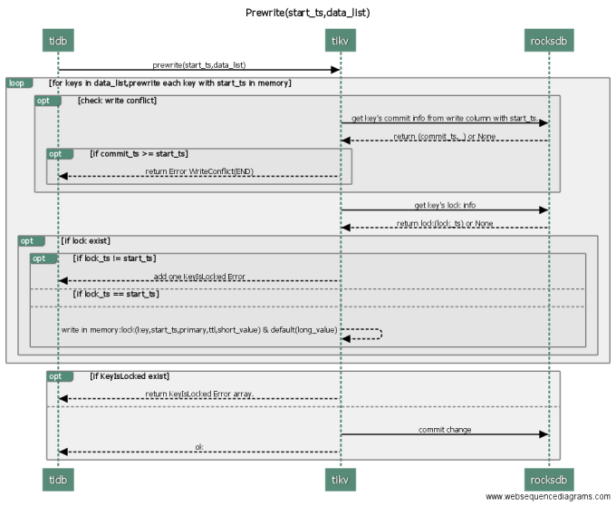

Prewrite是事务两阶段提交的第一步，其从`pd`获取代表当前物理时间的全局唯一时间戳作为当前事务的 `start_ts`，尝试对所有被写的元素加锁(为应对客户端故障，`tidb` 为所有需要写的key选出一个作为`primary`,其余的作为`secondary`)，将实际数据存入 `rocksdb`。其中每个key的处理过程如下，中间出现失败，则整个`prewrite`失败：

1. 检查 `write-write` 冲突：从 `rocksdb` 的`write` 列中获取当前 `key` 的最新数据，若其 `commit_ts` 大于等于`start_ts`,说明存在更新版本的已提交事务，向 `tidb` 返回 `WriteConflict` 错误，结束。
2. 检查 `key` 是否已被锁上，如果 `key` 的锁已存在，收集 `KeyIsLock` 的错误，处理下一个 `key`
3. 往内存中的 `lock` 列写入 `lock(start_ts,key)` 为当前key加锁,若当前key被选为 `primary`, 则标记为 `primary`,若为`secondary`,则标明指向`primary`的信息。
4. 若当前 `value` 较小，则与 `lock` 存在一起，否则，内存中存入 `default(start_ts,key,value)`。

处理完所有数据后，若存在 `KeyIsLock` 错误，则向 `tidb` 返回所有 `KeyIsLocked` 信息。

否则，提交数据到 `raft-kv` 持久化，当前 `prewrite` 成功。

#### Commit

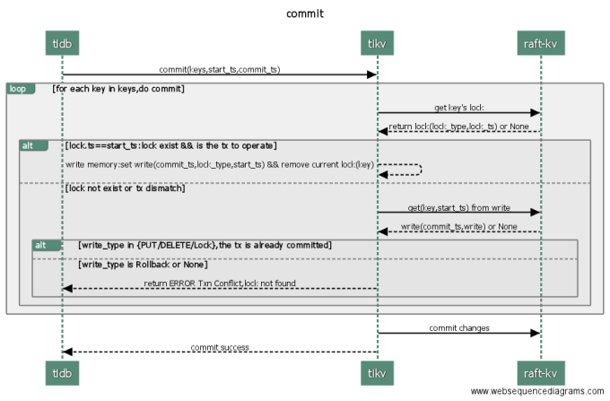

1. `tidb` 向 `tikv` 发起第二阶段提交 `commit(keys,commit_ts,start_ts)`
2. 对于每个 key 依次检查其是否合法，并在内存中更新（步骤3-4）
3. 检查 key 的锁，若锁存在且为当前 start_ts 对应的锁，则在内存中添加 write(key,commit_ts,start_ts),删除 lock(key,start_ts)，继续执行下一个 key(跳至步骤3)。否则，执行步骤 4
4. 获取当前 key 的 `start_ts` 对应的数据 `write(key,start_ts,commit_ts)`, 若存在，说明已被提交过，继续执行下一个 key(跳至步骤4)。否则，返回未找到锁错误到 `tidb`，结束。
5. 到底层 raft-kv 中更新 2-4 步骤产生的所有数据－－这边保证了原子性。
6. `tikv` 向 `tidb` 返回 `commit` 成功。

#### Rollback

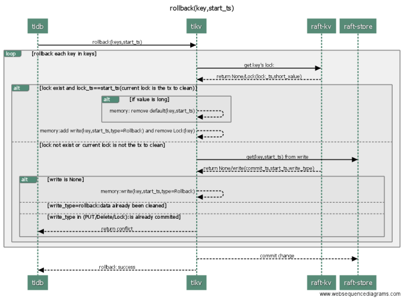


1. `tidb` 向 `tikv` 发起 `rollback(keys,start_ts)`, 回滚当前 `region` 中 `start_ts` 所在的 key 列表；
2. 对于每个 `key`, `tikv` 依次检查其合法性，并进行回滚(依次对每个 key 执行 3-4)
3. 检查当前 `key` 的锁，情况如下：
   - \* 若当前 (start_ts,key) 所对应的锁存在，则在内存中删除该锁,继续回滚下一个 `key`(跳至步骤2）
   - \* 若当前事务所对应的锁不存在，则进入步骤 4 检查提交情况
4. `tikv` 从 `raft-kv` 中获取到当前 (key,start_ts) 对应的提交纪录：
   - 若 commit(key,commit_ts,start_ts) 存在，且状态为PUT／DELETE， 则返回 `tidb` 告知事务已被提交，回滚失败，结束。
   - 若 commit(key,commit_ts,start_ts) 存在，且状态为 `Rollback`, 说明当前 `key` 已被 `rollback` 过，继续回滚下一个 `key`(跳至步骤2)
   - 若 (key,start_ts) 对应的提交纪录不存在，说明当前 key 尚未被 prewrite 过，为预防 prewrite 在之后过来，在这里留下 (key,start_ts,rollback), 继续回滚下一个 key(跳至步骤2)
5. 将步骤 2-4 中更新的内容持久化到 `raft-kv`
6. `tikv` 向 `tidb` 返回回滚成功。

>若当前 (start_ts,key) 所对应的锁存在，则在内存中删除该锁,继续回滚下一个 `key`(跳至步骤2）
>
>这是因为，lock 是在 Prewrite 阶段在一个事务中修改：
>
>- 修改 data
>- 添加 lock
>
>随后在 Commit 阶段：
>
>- Primary：在一个事务中修改：
>  - 修改 write
>  - 删除 lock
>- Secondary：不在一个事务中：
>  - 修改 write
>  - 删除 lock
>
>所以只会存在以下情况：
>
>1. 事务在 Prewrite 阶段，因为没有修改 write，所以无需执行物理回滚；
>2. 事务在 Commit 阶段，lock 不存在说明已经可以提交（当Primary提交时我们可以认为事务已经执行成功）

#### Resolve Lock

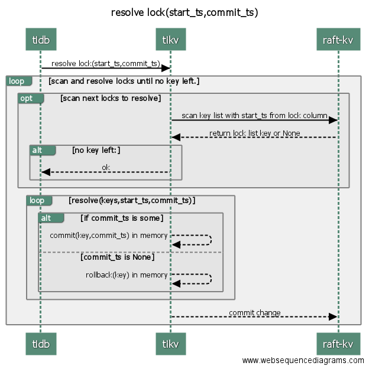

1. `tidb` 向 `tikv` 发起 `Resolve(start_ts,commit_ts)`
2. `tikv` 依次找出所有 `lock.ts==start_ts` 的锁并执行对应的清锁操作（循环执行步骤3-5）。
3. `tikv` 向 `raft-kv` 获取下一堆`lock.ts==start_ts` 的锁。
4. 若没有剩余锁，退出循环，跳至步骤6。
5. 对本批次获取到的锁，根据情况进行清锁操作
   - \* 若 commit_ts 为空，则执行回滚
   - \* 若 commit_ts 有值，则执行提交。
6. 将2-5 产生的更新持久化到 `raft-kv`
7. `tikv` 向 `tidb` 返回清锁成功。

#### Get

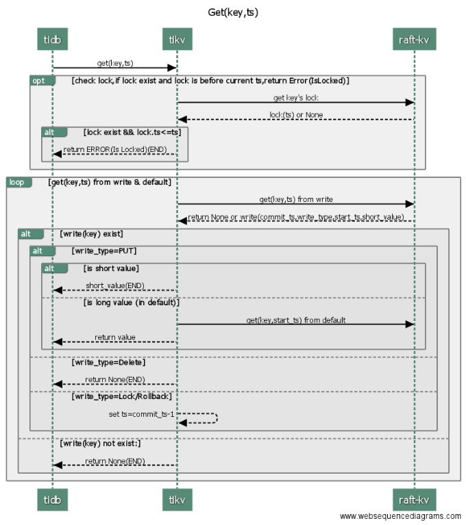

1. `tidb` 向 `tikv` 发起 `get(key,start_ts)` 操作
2. `tikv` 检查当前 `key` 的锁状态：若锁存在且 `lock.ts<start_ts`, 即 `start_ts` 这一刻该值是被锁住的，则返回 `tidb` 被锁住错误，结束。
3. 尝试获取 `start_ts` 之前的最近的有效提交，初始化 版本号`version` 为 `start_ts－1`
4. 从 `write` 中获取 commit_ts<=version 的最大 commit_ts 对应纪录：
   - \* 若 `write_type=PUT`,即有效提交，返回 `tidb` 当前版本对应值。
   - \* 若 `write 不存在或者 write_type=DEL`, 即没有出现过该值，或该值最近已被删除，返回`tidb`空
   - \* 若 `write_type=rollback,commit_ts`，则 version=commit_ts-1, 继续查找下一个最近版本（跳至步骤3）

### ACID in TIDB

- 原子性：通过 `primary` 来保证；`primary key` commit 成功与否决定事务成功与否。
- 一致性：通过 Raft 来保证一致性；
- 隔离性：通过 2PC 来保证隔离级别为 `RR`
- 持久性：通过 tikv 来保证持久性

### Why 2 PC?

#### 1 PC 存在的问题

> 1 pc 无法保证隔离性为 `RR`.

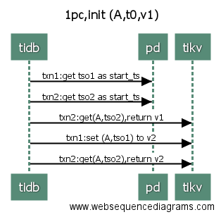

#### 2 PC 保证隔离级别

第一阶段 prewrite:

1. 获取一个包含当前物理时间的、全局唯一递增的时间戳 t1 作为当前事务的 start_ts
2. lock(key,start_ts), save data(key,start_ts,data)

第二阶段 commit 数据：

1. 获取一个包含当前物理时间的、全局唯一递增的时间戳 t2 作为当前事务的 commit_ts
2. commit(key,commit_ts, start_ts)

事务读取数据步骤如下：

1. 获取一个包含当前物理时间的、全局唯一递增的时间戳 t1 作为当前事务的 start_ts.
2. 检查当前查询 key 的锁，若锁存在，且 lock.ts<t1, 说明这一刻 key 正在被写入，需要等待写入事务完成再读取。
3. 到这一步时，说明 要么 锁不存在，要么 lock.ts > t1, 这两种情况都能说明， 下一个该 key 的 commit_ts 一定会大于当前的 t1, 所以可以直接读取当前小于 t1 的最大 commit_ts 对应的数据。

> 综上，两阶段提交可以保证事务的隔离级别为 RR，示例如下：

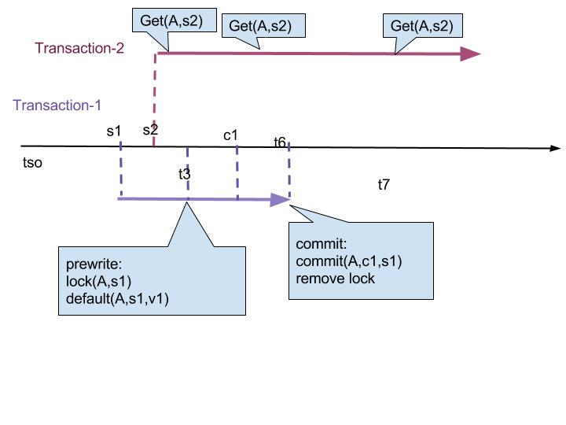

假设初始状态下，`(A,t0)=>v1`, 现有事务1－txn1, 事务2-txn2。其中 txn-1 将会修改 A 的值为 v2。假设 txn－1 的 start_ts=s1, prewrite=p1, commit_ts=c1, 事务 txn-2 的 start_ts=s2，而 Get(A, s1) 执行时间为 g2，那么有：

1. `s2 < s1`
   1. s2 < g2 < s1，`(A, t0)=>v1`;
   2. s2 < s1 < g2 < p1，`(A, t0)=>v1`；
   3. s2 < s2 < p1 < g2 < c1，此时，由于 prewrite 阶段持有锁，tx2 必须等待 tx1 结束，相当于及进入步骤 <1.4>
   4. s2 < s1 < p1 < c1 < g2，此时数据已经正常写入，存在 `(A, t0)=>v1` 和 `(A, c1)=>v2` 两个版本，按照IS的定义，我们会读取 `小于 s2` 的最新版本，也就是 `(A, t0)=>v1`。
2. `s2 > s1`，当 s1 > s1 时，分为两种情况：`s2 > c1 > s1` 和 `c2 > s2 > s1`
   1. `s2 > c1 > s1`：由于 s2 > c1，所以不管什么时候读，读取到的都是 `(A, c1)=>v2`
   2. `c2 > s2 > s1`：
      1. `s2 < p1` 读取到旧值 `(A, t0)=>v1`;
      2. `p1 < s2` 由于 prewrite 阶段持有锁，tx2 必须等待 tx1 结束，存在 `(A, t0)=>v1` 和 `(A, c1)=>v2` 两个版本，按照IS的定义，我们会读取 `小于 s2` 的最新版本，也就是 `(A, t0)=>v1`


