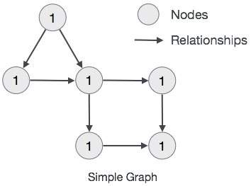

# neo4j

## neo4j 教程

### Neo4j - 需要图形数据库

>简单地说，我们可以说图数据库主要用于存储更多的连接数据。

#### project 1：Google+

在上图中，轮廓“A”具有圆圈以连接到其他轮廓：家庭圈（B，C，D）和朋友圈（B，C）。


再次，如果我们打开配置文件“B”，我们可以观察以下连接的数据。


像这样，这些应用程序包含 **大量的结构化，半结构化和非结构化的连接数据**。 在 RDBMS 数据库中表示这种非结构化连接数据并不容易。

> 以上面的例子来说，如果我们要在 DBMS 中表示这个关系，可能是这样的

```sql
create table Friend(srcId varchar(64), dstId varchar(64));
create table Family(srcId varchar(64), dstId varchar(64));
```


```sql
# A 的家人
insert into `Family`(`srcId`, `dstId`) values ('A', 'B'), ('A', 'C'), ('A', 'D');
# A 的朋友
insert into `Friend`(`srcId`, `dstId`) values ('A', 'B'), ('A', 'C');

# B 的家人
insert into Family(srcId, dstId)
	values
	('B', 'A'),
	('B', 'C'),
	('B', 'D')
# B 的朋友
insert into Friend(srcId, dstId)
	values
	('B', 'X'),
	('B', 'Z')
```

#### Project 2 : facebook


A likes 了一些朋友，comments 了一些朋友，给一些朋友发送了 messages，跟随他喜欢的一些名人。

### Neo4j - 特点和优势

- **SQL就像简单的查询语言Neo4j CQL**
- 它遵循属性图数据模型
- **它通过使用Apache Lucence支持索引**
- **它支持UNIQUE约束**
- 它包含一个用于执行CQL命令的UI：Neo4j数据浏览器
- **它支持完整的ACID（原子性，一致性，隔离性和持久性）规则**
- 它采用原生图形库与本地GPE（图形处理引擎）
- 它支持查询的数据导出到JSON和XLS格式
- **它提供了REST API，可以被任何编程语言（如Java，Spring，Scala等）访问**
- 它提供了可以通过任何UI MVC框架（如Node JS）访问的Java脚本
- 它支持两种Java API：Cypher API和Native Java API来开发Java应用程序

### Neo4j - 数据模型

- 表示 node，relationships 和 attr 中的数据
- node和 relationships 都包含 attracts
- relationships 连接 node
- attr 是键值对
- node 用圆圈表示，relationships 用方向键表示。
- connection 具有方向：单向和双向。
- 每个关系包含“开始node”或“从node”和“到node”或“结束node”

图形数据库数据模型的主要构建块是：

- node
- relationships
- attr



### Neo4j - 图形理论基础

> **图形是一组节点和连接这些节点的关系**。 图形以属性的形式将数据存储在节点和关系中。 属性是用于表示数据的键值对。

最简单的图可能是单个节点


为节点添加一些属性


复杂的示例图


## Neo4j - CQL简介

### create

> A label is a named graph construct that is used to group nodes into sets; all nodes labeled with the same label belongs to the same set。

#### Neo4j CQL创建一个没有属性的节点

Neo4j CQL“CREATE”命令用于创建没有属性的节点。 它只是创建一个没有任何数据的节点。

```sql
CREATE (<node-name>:<label-name>)
```

1、Neo4j数据库服务器使用此<node-name>将此节点详细信息存储在Database.As中作为Neo4j DBA或Developer，我们不能使用它来访问节点详细信息。

2、Neo4j数据库服务器创建一个<label-name>作为内部节点名称的别名。作为Neo4j DBA或Developer，我们应该使用此标签名称来访问节点详细信息。

```sql
# 它在数据库中创建一个带有标签名“Employee”的节点“emp”。
CREATE (emp:Employee)
```

- emp -> 节点名
- Employee -> emp 节点的标签名称

```sql
# 它在数据库中创建一个标签名为“Dept”的节点“dept”。
CREATE (dept:Dept)
```

#### Neo4j CQL创建具有属性的节点

Neo4j CQL“CREATE”命令用于创建带有属性的节点。 它创建一个具有一些属性（键值对）的节点来存储数据。

```sql
CREATE (
   <node-name>:<label-name>
   { 	
      <Property1-name>:<Property1-Value>
      ........
      <Propertyn-name>:<Propertyn-Value>
   }
)
```

```sql
# 创建一个标签名为 Dept 的节点 dept，节点包含了三个属性
CREATE (dept:Dept { deptno:10,dname:"Accounting",location:"Hyderabad" })
```

```sql
CREATE (emp:Employee{id:123,name:"Lokesh",sal:35000,deptno:10})
```

### match

```sql
MATCH 
(
   <node-name>:<label-name>
)
```

以上语句执行会抛出异常，因为 match 必须和其他的语句配合使用

```sql
# 查询Dept下的内容
MATCH (dept:Dept) return dept

# 查询Employee标签下 id=123，name="Lokesh"的节点
MATCH (p:Employee {id:123,name:"Lokesh"}) RETURN p

## 查询Employee标签下name="Lokesh"的节点，使用（where命令）
MATCH (p:Employee)
WHERE p.name = "Lokesh"
RETURN p
```

#### --

> The symbol `--` means **related to**, without regard to type or direction of the relationship

```sql
match (director:Person)--(movie) where director.name = 'Hugo Weaving' return movie.title
#╒════════════════════════╕
#│"movie.title"           │
#╞════════════════════════╡
#│"Cloud Atlas"           │
#├────────────────────────┤
#│"V for Vendetta"        │
#├────────────────────────┤
#│"The Matrix Revolutions"│
#├────────────────────────┤
#│"The Matrix Reloaded"   │
#├────────────────────────┤
#│"The Matrix"            │
#└────────────────────────┘
```

> 下面这个语句和上面的区别是，它只选择了 `related to` 的 `Moive`，虽然结果是一样的。

```sql
match (:Person {name: 'Hugo Weaving'})--(movie:Movie) return movie.title
```

#### Outgoing relationships

> When the direction of a relationship is of interest, it is shown by using `-->` or `<--`, like this:

```sql
# 查询所有有 outgoing 关系的电影
match (:Person {name: 'Hugo Weaving'})-->(movie:Movie) return movie.title
```

```sql
# 查询所有有 outgoing 关系的电影的 relationship 的 类型
match (:Person {name: 'Hugo Weaving'})-[r]->(movie:Movie) return type(r)
```


```sql
# 查询所有和电影 "V for Vendetta" 有一个单向关系 "ACTED_IN" 的演员的名字
match (v:Movie {title:"V for Vendetta"})<-[:ACTED_IN]-(actor) return actor.name
```

### return

```sql
RETURN 
   <node-name>.<property1-name>,
   ........
   <node-name>.<propertyn-name>
```

```sql
# 查询 label Dept 下包含 deptno 属性并且 deptno == 10 的节点 dept，并返回其 deptno 属性。
match(dept:Dept{deptno:10}) return dept.deptno
```

### MATCH & RETURN

```sql
MATCH Command
RETURN Command
```

RETURN 如果返回了节点不包含的属性，那么该属性是 `NULL`

```sql
MATCH (dept: Dept)
RETURN dept.deptno,dept.dname
```

|             |            |              |
| ----------- | ---------- | ------------ |
| dept.deptno | dept.dname |              |
| 1           | *null*     | *null*       |
| 2           | 10         | "Accounting" |
| 3           | *null*     |              |

### create + match + return

> 创建一个 label 为 Customer，包含了 id，name， dob 等属性的节点 e

```sql
CREATE (e:Customer{id:"1001",name:"Abc",dob:"01/10/1982"})
```

>创建一个 label 为 CreditCard，包含了 id，number，cvv，expiredate 等属性的节点 cc

```sql
CREATE (cc:CreditCard{id:"5001",number:"1234567890",cvv:"888",expiredate:"20/17"})
```

> 查询 e:Customer 的所有属性

```sql
MATCH (e:Customer)
RETURN e.id,e.name,e.dob
```

### 关系基础

Neo4j关系被分为两种主要类型。

- 单向关系
- 双向关系

### create 创建关系

> 单个标签到节点

```sql
CREATE (<node-name>:<label-name>)
```

> 多个标签到节点

```sql
CREATE (<node-name>:<label-name1>:<label-name2>.....:<label-namen>)
```

> 单个标签到关系

```sql
CREATE (<node1-name>:<label1-name>)-
	[(<relationship-name>:<relationship-label-name>)]
	->(<node2-name>:<label2-name>)
```

#### 实例

```sql
CREATE (google1:GooglePlusProfile)

CREATE (m:Movie:Cinema:Film:Picture)

# 增加两个节点 p1:Porfile1 和 p2:Profile2
# 并且节点 p1 和 p2 之间存在关系标签为 LIKES 的关系 r1
CREATE (p1:Profile1)-[r1:LIKES]->(p2:Profile2)
```

### where

```sql
# 简单语法
WHERE <condition>
# 复杂 where 子句查询
WHERE <condition> <boolean-operator> <condition>
# <condition> 语法
<property-name> <comparison-operator> <value>
```

#### boolean-operator

| 布尔运算符 | 描述 |
| ---------- | ---- |
| AND        |      |
| OR         |      |
| NOT        |      |
| XOR        |      |

#### comparison-operator

| comparionsion-operator | desc |
| ---------------------- | ---- |
| =                      |      |
| <>                     | !=   |
| <                      |      |
| >                      |      |
| <=                     |      |
| >=                     |      |

> instance

```sql
# 查询 Employee 下的 emp 节点
MATCH (emp:Employee)
RETURN emp.empid,emp.name,emp.salary,emp.deptno

# 查询 Employee 下包含属性 {name:'Lokesh'} 的节点
match(x:Employee) where x.name = 'Lokesh' return x

# 查询 Employee 下包含属性 {name:'Lokesh'} 或者不存在属性 name 的节点
match(x:Employee) where x.name = 'Lokesh' or x.name is null return x
```

> 使用WHERE子句创建关系

```sql
MATCH (<node1-label-name>:<node1-name>),(<node2-label-name>:<node2-name>) 
WHERE <condition>
CREATE (<node1-label-name>)-[<relationship-label-name>:<relationship-name>
       {<relationship-properties>}]->(<node2-label-name>) 
```

```sql
# 查询 Customer
MATCH (cust:Customer) RETURN cust.id,cust.name,cust.dob
# 查询 CreditCard
MATCH (cc:CreditCard) RETURN cc.id,cc.number,cc.expiredate,cc.cvv
# 使用where子句创建关系
# 使用 where 条件过滤了 Customer 和 CreditCard 下的不满足条件的节点
# 然后连接了节点之间的关系。
match (cust:Customer),(cc:CreditCard) 
where cust.id = "1001" and cc.id= "5001" 
create (cust)-[r:DO_SHOPPING_WITH{shopdate:"12/12/2014",price:55000}]->(cc)
```

### delete

```sql
DELETE <node-name-list>
```

```sql
MATCH (e: Employee) DELETE e
```

> DELETE节点和关系子句语法

```sql
DELETE <node1-name>,<node2-name>,<relationship-name>
```

> 从数据库永久删除节点及其关联节点和关系

```sql
# 查询关系
match (cc:CreditCard)-[r]-(c:Customer) return r
# 删除节点cc，c以及关系r
match (cc:CreditCard)-[r]-(c:Customer) delete cc,r,c
```

### remove

> remove 命令用于：
>
> 1. 删除节点或者关系的标签
> 2. 删除节点或者关系的属性
>
> remove 和 delete 命令的主要区别在于
>
> - DELETE操作用于删除节点和关联关系
> - REMOVE操作用于删除标签和属性

```sql
REMOVE <property-name-list>
```

```sql
# 创建节点
CREATE (book:Book {id:122,title:"Neo4j Tutorial",pages:340,price:250}) 
# 查询节点
# |═══════════════════════════════════════════════════════════╕
#│"book"                                                     │
#╞═══════════════════════════════════════════════════════════╡
#│{"pages":340,"id":122,"title":"Neo4j Tutorial","price":250}│
#└───────────────────────────────────────────────────────────┘
match (book:Book) return book
# 删除 price 属性
match (book:Book) remove book.price
#╒═══════════════════════════════════════════════╕
#│"book"                                         │
#╞═══════════════════════════════════════════════╡
#│{"pages":340,"id":122,"title":"Neo4j Tutorial"}│
#└───────────────────────────────────────────────┘
```

### set

> - 向现有节点和关系添加新的属性
> - 添加或者更新属性

```sql
match (book:Book) return book
#╒═══════════════════════════════════════════════╕
#│"book"                                         │
#╞═══════════════════════════════════════════════╡
#│{"pages":340,"id":122,"title":"Neo4j Tutorial"}│
#└───────────────────────────────────────────────┘

# 设置节点属性
match (book:Book) set book.title = 'Super star'
# 设置节点属性并返回
match (book:Book) set book.title = 'Super star' return book
#╒═══════════════════════════════════════════╕
#│"book"                                     │
#╞═══════════════════════════════════════════╡
#│{"pages":340,"id":122,"title":"Super star"}│
#└───────────────────────────────────────────┘
```

### order by

> 在 match 命令中使用 `order by` 对返回结果进行排序

```sql
# 插入数据
create (emp0:Employee {empid:1001, name:"Abc", salary:25000, deptno:10}),
       (emp1:Employee {empid:1002, name:"Pqr", salary:45000, deptno:20}),
       (emp2:Employee {empid:1003, name:"Mno", salary:5000,  deptno:10}),
       (emp3:Employee {empid:1004, name:"Xyz", salary:15000, deptno:30})

match (emp:Employee) return emp order by emp.deptno
#╒══════════════════════════════════════════════════════╕
#│"emp"                                                 │
#╞══════════════════════════════════════════════════════╡
#│{"name":"Abc","empid":1001,"salary":25000,"deptno":10}│
#├──────────────────────────────────────────────────────┤
#│{"name":"Mno","empid":1003,"salary":5000,"deptno":10} │
#├──────────────────────────────────────────────────────┤
#│{"name":"Pqr","empid":1002,"salary":45000,"deptno":20}│
#├──────────────────────────────────────────────────────┤
#│{"name":"Xyz","empid":1004,"salary":15000,"deptno":30}│
#└──────────────────────────────────────────────────────┘

match (emp:Employee) return emp order by emp.deptno desc
#╒══════════════════════════════════════════════════════╕
#│"emp"                                                 │
#╞══════════════════════════════════════════════════════╡
#│{"name":"Xyz","empid":1004,"salary":15000,"deptno":30}│
#├──────────────────────────────────────────────────────┤
#│{"name":"Pqr","empid":1002,"salary":45000,"deptno":20}│
#├──────────────────────────────────────────────────────┤
#│{"name":"Abc","empid":1001,"salary":25000,"deptno":10}│
#├──────────────────────────────────────────────────────┤
#│{"name":"Mno","empid":1003,"salary":5000,"deptno":10} │
#└──────────────────────────────────────────────────────┘
```

### union

> union 将两组结果中的 `公共行` 合并返回到一组结果中，它不从两个节点返回重复的行。
>
> **如果两个查询不返回相同的列名和数据类型，那么他抛出一个错误。**

```sql
<MATCH Command1>
   UNION
<MATCH Command2>
```

```sql
# 插入数据
create (c0:DebitCard {id:0, name: '0', number:'0'}),
       (c1:DebitCard {id:1, name: '1', number:'1'}),
       (c2:DebitCard {id:2, name: '2', number:'2'}),
       (c3:DebitCard {id:3, name: '3', number:'3'}),
       (c4:DebitCard {id:4, name: '4', number:'4'})

# 通过 union 进行联合查询
match (c0:DebitCard) where c0.id = 0 return c0
union
match (c0:DebitCard) where c0.name = '1' return c0
#╒════════════════════════════════╕
#│"c0"                            │
#╞════════════════════════════════╡
#│{"name":"0","number":"0","id":0}│
#├────────────────────────────────┤
#│{"name":"1","number":"1","id":1}│
#└────────────────────────────────┘

# 下面的语句会有问题
# 因为列名应该包含前缀，所以两个查询的列名是 c0.id 和 c1.id，他们是不一样的。
match (c0:DebitCard) where c0.id = 0 return c0
union
match (c1:DebitCard) where c1.name = '1' return c1
#All sub queries in an UNION must have the same column names (line 2, column 1 (offset: 58))
#"union"
# ^

# 可以通过 as 语法来赋予别名
match (c0:DebitCard) where c0.id = 0 return c0 as c
union
match (c1:DebitCard) where c1.name = '1' return c1 as c
#╒════════════════════════════════╕
#│"c"                             │
#╞════════════════════════════════╡
#│{"name":"0","number":"0","id":0}│
#├────────────────────────────────┤
#│{"name":"1","number":"1","id":1}│
#└────────────────────────────────┘
```

### union all

> 返回两个结果集的 union，但是它不会对重复行进行处理

```sql
# union 会对重复的行进行去重
match (c0:DebitCard) where c0.id = 0 return c0.id as id,c0.name as name
union
match (c1:DebitCard) where c1.name = '0' return c1.id as id,c1.name as name
#╒════╤══════╕
#│"id"│"name"│
#╞════╪══════╡
#│0   │"0"   │
#└────┴──────┘

# union all 则不会去重
match (c0:DebitCard) where c0.id = 0 return c0.id as id,c0.name as name
union all
match (c1:DebitCard) where c1.name = '0' return c1.id as id,c1.name as name
#╒════╤══════╕
#│"id"│"name"│
#╞════╪══════╡
#│0   │"0"   │
#├────┼──────┤
#│0   │"0"   │
#└────┴──────┘
```

### limit, skip

> - limit 用来过滤或限制查询返回的行数
> - skip 用来跳过行数
>
> 通过 limit + skip 可以实现分页的效果

```sql
# 不做限制
match (c0:DebitCard) return c0
#╒════════════════════════════════╕
#│"c0"                            │
#╞════════════════════════════════╡
#│{"name":"0","number":"0","id":0}│
#├────────────────────────────────┤
#│{"name":"1","number":"1","id":1}│
#├────────────────────────────────┤
#│{"name":"2","number":"2","id":2}│
#├────────────────────────────────┤
#│{"name":"3","number":"3","id":3}│
#├────────────────────────────────┤
#│{"name":"4","number":"4","id":4}│
#└────────────────────────────────┘

# 不跳过任何行
match (c0:DebitCard) return c0 skip 0 limit 2
#╒════════════════════════════════╕
#│"c0"                            │
#╞════════════════════════════════╡
#│{"name":"0","number":"0","id":0}│
#├────────────────────────────────┤
#│{"name":"1","number":"1","id":1}│
#└────────────────────────────────┘

# 跳过两行
match (c0:DebitCard) return c0 skip 2 limit 2
#╒════════════════════════════════╕
#│"c0"                            │
#╞════════════════════════════════╡
#│{"name":"2","number":"2","id":2}│
#├────────────────────────────────┤
#│{"name":"3","number":"3","id":3}│
#└────────────────────────────────┘
```

### merge

> merge 是 match 和 create 的结合。
>
> merge 在 match 返回的结果为空的时候，会 create 一个新的节点。

```sql
# 创建两个相同的节点
create (c:Customer{id:0, name: 0})
create (c:Customer{id:0, name: 0})

# 查询
match (c:Customer) return c
#╒═════════════════╕
#│"c"              │
#╞═════════════════╡
#│{"name":0,"id":0}│
#├─────────────────┤
#│{"name":0,"id":0}│
#└─────────────────┘

# 插入一个完全相同的 node 节点
merge (c:Customer{id:0, name: 0})
# (no changes, no records)
# 插入一个新的节点
merge (c:Customer{id:0, name: 1})
# Added 1 label, created 1 node, set 2 properties, completed after 4 ms.
```

### null

> null 表示的是节点或者关系属性的缺失或者未定义

```sql
match (e:Employee) where e.name is not null return e
```

### in

> in 为 CQL 命令提供 **值的集合**

```sql
# 使用 in 表示值的集合
match (e:Employee) where e.empid in[1001, 1002] return e
#╒══════════════════════════════════════════════════════╕
#│"e"                                                   │
#╞══════════════════════════════════════════════════════╡
#│{"name":"Abc","empid":1001,"salary":25000,"deptno":10}│
#├──────────────────────────────────────────────────────┤
#│{"name":"Pqr","empid":1002,"salary":45000,"deptno":20}│
#└──────────────────────────────────────────────────────┘
```

### 复杂查询

> neo4j 在 create 关系的时候，会生成两个节点，如果查询是 `(f)-[r]-(t)` 那么所有的关系都会被查询。
>
> 如果是 `(f)-[r]->(t)` 则是查询的单向关系。

```sql
# 建立 (romeo)-(LOVE)->(julie) 的关系
create (romeo:Person{name:"Romeo"})-[r:LOVE]->(julie:Person{name:"Julie"})

# 查询刚才写入的关系
match (f)-[r]-(t) return f,type(r),t
#╒════════════════╤═════════╤════════════════╕
#│"f"             │"type(r)"│"t"             │
#╞════════════════╪═════════╪════════════════╡
#│{"name":"Romeo"}│"LOVE"   │{"name":"Julie"}│
#├────────────────┼─────────┼────────────────┤
#│{"name":"Julie"}│"LOVE"   │{"name":"Romeo"}│
#└────────────────┴─────────┴────────────────┘

# 查询有向写入关系
match (f)-[r]->(t) return f,type(r),t
#╒════════════════╤═════════╤════════════════╕
#│"f"             │"type(r)"│"t"             │
#╞════════════════╪═════════╪════════════════╡
#│{"name":"Romeo"}│"LOVE"   │{"name":"Julie"}│
#└────────────────┴─────────┴────────────────┘z

# 查询 romeo LOVE julie
match (f)-[r:LOVE]->(t) where f.name = 'Romeo' and t.name = 'Julie' return f,type(r),t
#╒════════════════╤═════════╤════════════════╕
#│"f"             │"type(r)"│"t"             │
#╞════════════════╪═════════╪════════════════╡
#│{"name":"Romeo"}│"LOVE"   │{"name":"Julie"}│
#└────────────────┴─────────┴────────────────┘

match (f)-[r:LOVE]->(t) where f.name = 'Julie' and t.name = 'Romeo' return f,type(r),t
#(no changes, no records

# 建立 (julie)-(LOVE)->(romeo) 的关系
match (from:Person), (to:Person) where from.name = 'Romeo' and to.name = 'Julie' create (to)-[:LOVE]->(from)

# 查询 julie LOVE romeo
match (f)-[r:LOVE]->(t) where f.name = 'Julie' and t.name = 'Romeo' return f,type(r),t
#╒════════════════╤═════════╤════════════════╕
#│"f"             │"type(r)"│"t"             │
#╞════════════════╪═════════╪════════════════╡
#│{"name":"Julie"}│"LOVE"   │{"name":"Romeo"}│
#└────────────────┴─────────┴────────────────┘
```

> 此外，以下两个查询是完全一样的

```sql
# 查询关系
match (f)-[r]-(t) return f,type(r),t

match (f)-[r]->(t) return f,type(r),t
union
match (f)<-[r]-(t) return f,type(r),t
```

### id

> 每一个节点都有一个 node identity，而且 identity 是自增的。

```sql
CREATE (tweet:Tweet{message:"Hello"})

MATCH (tweet:Tweet{message:"Hello"}) RETURN tweet
#{
#  "identity": 23,
#  "labels": [
#    "Tweet"
#  ],
#  "properties": {
#"message": "Hello"
#  }
#}

CREATE (tweet:Tweet{message:"Hello"})

MATCH (tweet:Tweet{message:"Hello"}) RETURN tweet
#{
#  "identity": 23,
#  "labels": [
#    "Tweet"
#  ],
#  "properties": {
#"message": "Hello"
#  }
#}
#
#{
#  "identity": 24,
#  "labels": [
#    "Tweet"
#  ],
#  "properties": {
#"message": "Hello"
#  }
#}

match (tweet:Tweet{message:"Hello"}) return id(tweet),labels(tweet)
#╒═══════════╤═══════════════╕
#│"id(tweet)"│"labels(tweet)"│
#╞═══════════╪═══════════════╡
#│23         │["Tweet"]      │
#├───────────┼───────────────┤
#│24         │["Tweet"]      │
#└───────────┴───────────────┘
```

### foreach

> The `FOREACH` clause is used to update data within a collection whether components of a path, or result of aggregation.

### caption


### 方向关系

> 在 neo4j 中，两个节点之间的关系是有方向性的，它们是单向或者双向的，在 create 节点的时候，只能使用 `()-[]->()` 创建单向节点。
>
> 在查询的时候，可以通过 `()-[]-()` 表示无方向节点，也可以用 `()-[]->()` 或者 `()<-[]-()` 表示有方向节点。

## CQL 函数

## tutorial

> CQL代表Cypher查询语言。 像Oracle数据库具有查询语言SQL，Neo4j具有CQL作为查询语言。
>
> 
>
> 以下是 neo4j 自带的测试数据。

```sql
CREATE (TheMatrix:Movie {title:'The Matrix', released:1999, tagline:'Welcome to the Real World'})
CREATE (Keanu:Person {name:'Keanu Reeves', born:1964})
CREATE (Carrie:Person {name:'Carrie-Anne Moss', born:1967})
CREATE (Laurence:Person {name:'Laurence Fishburne', born:1961})
CREATE (Hugo:Person {name:'Hugo Weaving', born:1960})
CREATE (LillyW:Person {name:'Lilly Wachowski', born:1967})
CREATE (LanaW:Person {name:'Lana Wachowski', born:1965})
CREATE (JoelS:Person {name:'Joel Silver', born:1952})
CREATE
(Keanu)-[:ACTED_IN {roles:['Neo']}]->(TheMatrix),
(Carrie)-[:ACTED_IN {roles:['Trinity']}]->(TheMatrix),
(Laurence)-[:ACTED_IN {roles:['Morpheus']}]->(TheMatrix),
(Hugo)-[:ACTED_IN {roles:['Agent Smith']}]->(TheMatrix),
(LillyW)-[:DIRECTED]->(TheMatrix),
(LanaW)-[:DIRECTED]->(TheMatrix),
(JoelS)-[:PRODUCED]->(TheMatrix)

CREATE (Emil:Person {name:"Emil Eifrem", born:1978})
CREATE (Emil)-[:ACTED_IN {roles:["Emil"]}]->(TheMatrix)

CREATE (TheMatrixReloaded:Movie {title:'The Matrix Reloaded', released:2003, tagline:'Free your mind'})
CREATE
(Keanu)-[:ACTED_IN {roles:['Neo']}]->(TheMatrixReloaded),
(Carrie)-[:ACTED_IN {roles:['Trinity']}]->(TheMatrixReloaded),
(Laurence)-[:ACTED_IN {roles:['Morpheus']}]->(TheMatrixReloaded),
(Hugo)-[:ACTED_IN {roles:['Agent Smith']}]->(TheMatrixReloaded),
(LillyW)-[:DIRECTED]->(TheMatrixReloaded),
(LanaW)-[:DIRECTED]->(TheMatrixReloaded),
(JoelS)-[:PRODUCED]->(TheMatrixReloaded)

CREATE (TheMatrixRevolutions:Movie {title:'The Matrix Revolutions', released:2003, tagline:'Everything that has a beginning has an end'})
CREATE
(Keanu)-[:ACTED_IN {roles:['Neo']}]->(TheMatrixRevolutions),
(Carrie)-[:ACTED_IN {roles:['Trinity']}]->(TheMatrixRevolutions),
(Laurence)-[:ACTED_IN {roles:['Morpheus']}]->(TheMatrixRevolutions),
(Hugo)-[:ACTED_IN {roles:['Agent Smith']}]->(TheMatrixRevolutions),
(LillyW)-[:DIRECTED]->(TheMatrixRevolutions),
(LanaW)-[:DIRECTED]->(TheMatrixRevolutions),
(JoelS)-[:PRODUCED]->(TheMatrixRevolutions)

CREATE (TheDevilsAdvocate:Movie {title:"The Devil's Advocate", released:1997, tagline:'Evil has its winning ways'})
CREATE (Charlize:Person {name:'Charlize Theron', born:1975})
CREATE (Al:Person {name:'Al Pacino', born:1940})
CREATE (Taylor:Person {name:'Taylor Hackford', born:1944})
CREATE
(Keanu)-[:ACTED_IN {roles:['Kevin Lomax']}]->(TheDevilsAdvocate),
(Charlize)-[:ACTED_IN {roles:['Mary Ann Lomax']}]->(TheDevilsAdvocate),
(Al)-[:ACTED_IN {roles:['John Milton']}]->(TheDevilsAdvocate),
(Taylor)-[:DIRECTED]->(TheDevilsAdvocate)

CREATE (AFewGoodMen:Movie {title:"A Few Good Men", released:1992, tagline:"In the heart of the nation's capital, in a courthouse of the U.S. government, one man will stop at nothing to keep his honor, and one will stop at nothing to find the truth."})
CREATE (TomC:Person {name:'Tom Cruise', born:1962})
CREATE (JackN:Person {name:'Jack Nicholson', born:1937})
CREATE (DemiM:Person {name:'Demi Moore', born:1962})
CREATE (KevinB:Person {name:'Kevin Bacon', born:1958})
CREATE (KieferS:Person {name:'Kiefer Sutherland', born:1966})
CREATE (NoahW:Person {name:'Noah Wyle', born:1971})
CREATE (CubaG:Person {name:'Cuba Gooding Jr.', born:1968})
CREATE (KevinP:Person {name:'Kevin Pollak', born:1957})
CREATE (JTW:Person {name:'J.T. Walsh', born:1943})
CREATE (JamesM:Person {name:'James Marshall', born:1967})
CREATE (ChristopherG:Person {name:'Christopher Guest', born:1948})
CREATE (RobR:Person {name:'Rob Reiner', born:1947})
CREATE (AaronS:Person {name:'Aaron Sorkin', born:1961})
CREATE
(TomC)-[:ACTED_IN {roles:['Lt. Daniel Kaffee']}]->(AFewGoodMen),
(JackN)-[:ACTED_IN {roles:['Col. Nathan R. Jessup']}]->(AFewGoodMen),
(DemiM)-[:ACTED_IN {roles:['Lt. Cdr. JoAnne Galloway']}]->(AFewGoodMen),
(KevinB)-[:ACTED_IN {roles:['Capt. Jack Ross']}]->(AFewGoodMen),
(KieferS)-[:ACTED_IN {roles:['Lt. Jonathan Kendrick']}]->(AFewGoodMen),
(NoahW)-[:ACTED_IN {roles:['Cpl. Jeffrey Barnes']}]->(AFewGoodMen),
(CubaG)-[:ACTED_IN {roles:['Cpl. Carl Hammaker']}]->(AFewGoodMen),
(KevinP)-[:ACTED_IN {roles:['Lt. Sam Weinberg']}]->(AFewGoodMen),
(JTW)-[:ACTED_IN {roles:['Lt. Col. Matthew Andrew Markinson']}]->(AFewGoodMen),
(JamesM)-[:ACTED_IN {roles:['Pfc. Louden Downey']}]->(AFewGoodMen),
(ChristopherG)-[:ACTED_IN {roles:['Dr. Stone']}]->(AFewGoodMen),
(AaronS)-[:ACTED_IN {roles:['Man in Bar']}]->(AFewGoodMen),
(RobR)-[:DIRECTED]->(AFewGoodMen),
(AaronS)-[:WROTE]->(AFewGoodMen)

CREATE (TopGun:Movie {title:"Top Gun", released:1986, tagline:'I feel the need, the need for speed.'})
CREATE (KellyM:Person {name:'Kelly McGillis', born:1957})
CREATE (ValK:Person {name:'Val Kilmer', born:1959})
CREATE (AnthonyE:Person {name:'Anthony Edwards', born:1962})
CREATE (TomS:Person {name:'Tom Skerritt', born:1933})
CREATE (MegR:Person {name:'Meg Ryan', born:1961})
CREATE (TonyS:Person {name:'Tony Scott', born:1944})
CREATE (JimC:Person {name:'Jim Cash', born:1941})
CREATE
(TomC)-[:ACTED_IN {roles:['Maverick']}]->(TopGun),
(KellyM)-[:ACTED_IN {roles:['Charlie']}]->(TopGun),
(ValK)-[:ACTED_IN {roles:['Iceman']}]->(TopGun),
(AnthonyE)-[:ACTED_IN {roles:['Goose']}]->(TopGun),
(TomS)-[:ACTED_IN {roles:['Viper']}]->(TopGun),
(MegR)-[:ACTED_IN {roles:['Carole']}]->(TopGun),
(TonyS)-[:DIRECTED]->(TopGun),
(JimC)-[:WROTE]->(TopGun)

CREATE (JerryMaguire:Movie {title:'Jerry Maguire', released:2000, tagline:'The rest of his life begins now.'})
CREATE (ReneeZ:Person {name:'Renee Zellweger', born:1969})
CREATE (KellyP:Person {name:'Kelly Preston', born:1962})
CREATE (JerryO:Person {name:"Jerry O'Connell", born:1974})
CREATE (JayM:Person {name:'Jay Mohr', born:1970})
CREATE (BonnieH:Person {name:'Bonnie Hunt', born:1961})
CREATE (ReginaK:Person {name:'Regina King', born:1971})
CREATE (JonathanL:Person {name:'Jonathan Lipnicki', born:1996})
CREATE (CameronC:Person {name:'Cameron Crowe', born:1957})
CREATE
(TomC)-[:ACTED_IN {roles:['Jerry Maguire']}]->(JerryMaguire),
(CubaG)-[:ACTED_IN {roles:['Rod Tidwell']}]->(JerryMaguire),
(ReneeZ)-[:ACTED_IN {roles:['Dorothy Boyd']}]->(JerryMaguire),
(KellyP)-[:ACTED_IN {roles:['Avery Bishop']}]->(JerryMaguire),
(JerryO)-[:ACTED_IN {roles:['Frank Cushman']}]->(JerryMaguire),
(JayM)-[:ACTED_IN {roles:['Bob Sugar']}]->(JerryMaguire),
(BonnieH)-[:ACTED_IN {roles:['Laurel Boyd']}]->(JerryMaguire),
(ReginaK)-[:ACTED_IN {roles:['Marcee Tidwell']}]->(JerryMaguire),
(JonathanL)-[:ACTED_IN {roles:['Ray Boyd']}]->(JerryMaguire),
(CameronC)-[:DIRECTED]->(JerryMaguire),
(CameronC)-[:PRODUCED]->(JerryMaguire),
(CameronC)-[:WROTE]->(JerryMaguire)

CREATE (StandByMe:Movie {title:"Stand By Me", released:1986, tagline:"For some, it's the last real taste of innocence, and the first real taste of life. But for everyone, it's the time that memories are made of."})
CREATE (RiverP:Person {name:'River Phoenix', born:1970})
CREATE (CoreyF:Person {name:'Corey Feldman', born:1971})
CREATE (WilW:Person {name:'Wil Wheaton', born:1972})
CREATE (JohnC:Person {name:'John Cusack', born:1966})
CREATE (MarshallB:Person {name:'Marshall Bell', born:1942})
CREATE
(WilW)-[:ACTED_IN {roles:['Gordie Lachance']}]->(StandByMe),
(RiverP)-[:ACTED_IN {roles:['Chris Chambers']}]->(StandByMe),
(JerryO)-[:ACTED_IN {roles:['Vern Tessio']}]->(StandByMe),
(CoreyF)-[:ACTED_IN {roles:['Teddy Duchamp']}]->(StandByMe),
(JohnC)-[:ACTED_IN {roles:['Denny Lachance']}]->(StandByMe),
(KieferS)-[:ACTED_IN {roles:['Ace Merrill']}]->(StandByMe),
(MarshallB)-[:ACTED_IN {roles:['Mr. Lachance']}]->(StandByMe),
(RobR)-[:DIRECTED]->(StandByMe)

CREATE (AsGoodAsItGets:Movie {title:'As Good as It Gets', released:1997, tagline:'A comedy from the heart that goes for the throat.'})
CREATE (HelenH:Person {name:'Helen Hunt', born:1963})
CREATE (GregK:Person {name:'Greg Kinnear', born:1963})
CREATE (JamesB:Person {name:'James L. Brooks', born:1940})
CREATE
(JackN)-[:ACTED_IN {roles:['Melvin Udall']}]->(AsGoodAsItGets),
(HelenH)-[:ACTED_IN {roles:['Carol Connelly']}]->(AsGoodAsItGets),
(GregK)-[:ACTED_IN {roles:['Simon Bishop']}]->(AsGoodAsItGets),
(CubaG)-[:ACTED_IN {roles:['Frank Sachs']}]->(AsGoodAsItGets),
(JamesB)-[:DIRECTED]->(AsGoodAsItGets)

CREATE (WhatDreamsMayCome:Movie {title:'What Dreams May Come', released:1998, tagline:'After life there is more. The end is just the beginning.'})
CREATE (AnnabellaS:Person {name:'Annabella Sciorra', born:1960})
CREATE (MaxS:Person {name:'Max von Sydow', born:1929})
CREATE (WernerH:Person {name:'Werner Herzog', born:1942})
CREATE (Robin:Person {name:'Robin Williams', born:1951})
CREATE (VincentW:Person {name:'Vincent Ward', born:1956})
CREATE
(Robin)-[:ACTED_IN {roles:['Chris Nielsen']}]->(WhatDreamsMayCome),
(CubaG)-[:ACTED_IN {roles:['Albert Lewis']}]->(WhatDreamsMayCome),
(AnnabellaS)-[:ACTED_IN {roles:['Annie Collins-Nielsen']}]->(WhatDreamsMayCome),
(MaxS)-[:ACTED_IN {roles:['The Tracker']}]->(WhatDreamsMayCome),
(WernerH)-[:ACTED_IN {roles:['The Face']}]->(WhatDreamsMayCome),
(VincentW)-[:DIRECTED]->(WhatDreamsMayCome)

CREATE (SnowFallingonCedars:Movie {title:'Snow Falling on Cedars', released:1999, tagline:'First loves last. Forever.'})
CREATE (EthanH:Person {name:'Ethan Hawke', born:1970})
CREATE (RickY:Person {name:'Rick Yune', born:1971})
CREATE (JamesC:Person {name:'James Cromwell', born:1940})
CREATE (ScottH:Person {name:'Scott Hicks', born:1953})
CREATE
(EthanH)-[:ACTED_IN {roles:['Ishmael Chambers']}]->(SnowFallingonCedars),
(RickY)-[:ACTED_IN {roles:['Kazuo Miyamoto']}]->(SnowFallingonCedars),
(MaxS)-[:ACTED_IN {roles:['Nels Gudmundsson']}]->(SnowFallingonCedars),
(JamesC)-[:ACTED_IN {roles:['Judge Fielding']}]->(SnowFallingonCedars),
(ScottH)-[:DIRECTED]->(SnowFallingonCedars)

CREATE (YouveGotMail:Movie {title:"You've Got Mail", released:1998, tagline:'At odds in life... in love on-line.'})
CREATE (ParkerP:Person {name:'Parker Posey', born:1968})
CREATE (DaveC:Person {name:'Dave Chappelle', born:1973})
CREATE (SteveZ:Person {name:'Steve Zahn', born:1967})
CREATE (TomH:Person {name:'Tom Hanks', born:1956})
CREATE (NoraE:Person {name:'Nora Ephron', born:1941})
CREATE
(TomH)-[:ACTED_IN {roles:['Joe Fox']}]->(YouveGotMail),
(MegR)-[:ACTED_IN {roles:['Kathleen Kelly']}]->(YouveGotMail),
(GregK)-[:ACTED_IN {roles:['Frank Navasky']}]->(YouveGotMail),
(ParkerP)-[:ACTED_IN {roles:['Patricia Eden']}]->(YouveGotMail),
(DaveC)-[:ACTED_IN {roles:['Kevin Jackson']}]->(YouveGotMail),
(SteveZ)-[:ACTED_IN {roles:['George Pappas']}]->(YouveGotMail),
(NoraE)-[:DIRECTED]->(YouveGotMail)

CREATE (SleeplessInSeattle:Movie {title:'Sleepless in Seattle', released:1993, tagline:'What if someone you never met, someone you never saw, someone you never knew was the only someone for you?'})
CREATE (RitaW:Person {name:'Rita Wilson', born:1956})
CREATE (BillPull:Person {name:'Bill Pullman', born:1953})
CREATE (VictorG:Person {name:'Victor Garber', born:1949})
CREATE (RosieO:Person {name:"Rosie O'Donnell", born:1962})
CREATE
(TomH)-[:ACTED_IN {roles:['Sam Baldwin']}]->(SleeplessInSeattle),
(MegR)-[:ACTED_IN {roles:['Annie Reed']}]->(SleeplessInSeattle),
(RitaW)-[:ACTED_IN {roles:['Suzy']}]->(SleeplessInSeattle),
(BillPull)-[:ACTED_IN {roles:['Walter']}]->(SleeplessInSeattle),
(VictorG)-[:ACTED_IN {roles:['Greg']}]->(SleeplessInSeattle),
(RosieO)-[:ACTED_IN {roles:['Becky']}]->(SleeplessInSeattle),
(NoraE)-[:DIRECTED]->(SleeplessInSeattle)

CREATE (JoeVersustheVolcano:Movie {title:'Joe Versus the Volcano', released:1990, tagline:'A story of love, lava and burning desire.'})
CREATE (JohnS:Person {name:'John Patrick Stanley', born:1950})
CREATE (Nathan:Person {name:'Nathan Lane', born:1956})
CREATE
(TomH)-[:ACTED_IN {roles:['Joe Banks']}]->(JoeVersustheVolcano),
(MegR)-[:ACTED_IN {roles:['DeDe', 'Angelica Graynamore', 'Patricia Graynamore']}]->(JoeVersustheVolcano),
(Nathan)-[:ACTED_IN {roles:['Baw']}]->(JoeVersustheVolcano),
(JohnS)-[:DIRECTED]->(JoeVersustheVolcano)

CREATE (WhenHarryMetSally:Movie {title:'When Harry Met Sally', released:1998, tagline:'Can two friends sleep together and still love each other in the morning?'})
CREATE (BillyC:Person {name:'Billy Crystal', born:1948})
CREATE (CarrieF:Person {name:'Carrie Fisher', born:1956})
CREATE (BrunoK:Person {name:'Bruno Kirby', born:1949})
CREATE
(BillyC)-[:ACTED_IN {roles:['Harry Burns']}]->(WhenHarryMetSally),
(MegR)-[:ACTED_IN {roles:['Sally Albright']}]->(WhenHarryMetSally),
(CarrieF)-[:ACTED_IN {roles:['Marie']}]->(WhenHarryMetSally),
(BrunoK)-[:ACTED_IN {roles:['Jess']}]->(WhenHarryMetSally),
(RobR)-[:DIRECTED]->(WhenHarryMetSally),
(RobR)-[:PRODUCED]->(WhenHarryMetSally),
(NoraE)-[:PRODUCED]->(WhenHarryMetSally),
(NoraE)-[:WROTE]->(WhenHarryMetSally)

CREATE (ThatThingYouDo:Movie {title:'That Thing You Do', released:1996, tagline:'In every life there comes a time when that thing you dream becomes that thing you do'})
CREATE (LivT:Person {name:'Liv Tyler', born:1977})
CREATE
(TomH)-[:ACTED_IN {roles:['Mr. White']}]->(ThatThingYouDo),
(LivT)-[:ACTED_IN {roles:['Faye Dolan']}]->(ThatThingYouDo),
(Charlize)-[:ACTED_IN {roles:['Tina']}]->(ThatThingYouDo),
(TomH)-[:DIRECTED]->(ThatThingYouDo)

CREATE (TheReplacements:Movie {title:'The Replacements', released:2000, tagline:'Pain heals, Chicks dig scars... Glory lasts forever'})
CREATE (Brooke:Person {name:'Brooke Langton', born:1970})
CREATE (Gene:Person {name:'Gene Hackman', born:1930})
CREATE (Orlando:Person {name:'Orlando Jones', born:1968})
CREATE (Howard:Person {name:'Howard Deutch', born:1950})
CREATE
(Keanu)-[:ACTED_IN {roles:['Shane Falco']}]->(TheReplacements),
(Brooke)-[:ACTED_IN {roles:['Annabelle Farrell']}]->(TheReplacements),
(Gene)-[:ACTED_IN {roles:['Jimmy McGinty']}]->(TheReplacements),
(Orlando)-[:ACTED_IN {roles:['Clifford Franklin']}]->(TheReplacements),
(Howard)-[:DIRECTED]->(TheReplacements)

CREATE (RescueDawn:Movie {title:'RescueDawn', released:2006, tagline:"Based on the extraordinary true story of one man's fight for freedom"})
CREATE (ChristianB:Person {name:'Christian Bale', born:1974})
CREATE (ZachG:Person {name:'Zach Grenier', born:1954})
CREATE
(MarshallB)-[:ACTED_IN {roles:['Admiral']}]->(RescueDawn),
(ChristianB)-[:ACTED_IN {roles:['Dieter Dengler']}]->(RescueDawn),
(ZachG)-[:ACTED_IN {roles:['Squad Leader']}]->(RescueDawn),
(SteveZ)-[:ACTED_IN {roles:['Duane']}]->(RescueDawn),
(WernerH)-[:DIRECTED]->(RescueDawn)

CREATE (TheBirdcage:Movie {title:'The Birdcage', released:1996, tagline:'Come as you are'})
CREATE (MikeN:Person {name:'Mike Nichols', born:1931})
CREATE
(Robin)-[:ACTED_IN {roles:['Armand Goldman']}]->(TheBirdcage),
(Nathan)-[:ACTED_IN {roles:['Albert Goldman']}]->(TheBirdcage),
(Gene)-[:ACTED_IN {roles:['Sen. Kevin Keeley']}]->(TheBirdcage),
(MikeN)-[:DIRECTED]->(TheBirdcage)

CREATE (Unforgiven:Movie {title:'Unforgiven', released:1992, tagline:"It's a hell of a thing, killing a man"})
CREATE (RichardH:Person {name:'Richard Harris', born:1930})
CREATE (ClintE:Person {name:'Clint Eastwood', born:1930})
CREATE
(RichardH)-[:ACTED_IN {roles:['English Bob']}]->(Unforgiven),
(ClintE)-[:ACTED_IN {roles:['Bill Munny']}]->(Unforgiven),
(Gene)-[:ACTED_IN {roles:['Little Bill Daggett']}]->(Unforgiven),
(ClintE)-[:DIRECTED]->(Unforgiven)

CREATE (JohnnyMnemonic:Movie {title:'Johnny Mnemonic', released:1995, tagline:'The hottest data on earth. In the coolest head in town'})
CREATE (Takeshi:Person {name:'Takeshi Kitano', born:1947})
CREATE (Dina:Person {name:'Dina Meyer', born:1968})
CREATE (IceT:Person {name:'Ice-T', born:1958})
CREATE (RobertL:Person {name:'Robert Longo', born:1953})
CREATE
(Keanu)-[:ACTED_IN {roles:['Johnny Mnemonic']}]->(JohnnyMnemonic),
(Takeshi)-[:ACTED_IN {roles:['Takahashi']}]->(JohnnyMnemonic),
(Dina)-[:ACTED_IN {roles:['Jane']}]->(JohnnyMnemonic),
(IceT)-[:ACTED_IN {roles:['J-Bone']}]->(JohnnyMnemonic),
(RobertL)-[:DIRECTED]->(JohnnyMnemonic)

CREATE (CloudAtlas:Movie {title:'Cloud Atlas', released:2012, tagline:'Everything is connected'})
CREATE (HalleB:Person {name:'Halle Berry', born:1966})
CREATE (JimB:Person {name:'Jim Broadbent', born:1949})
CREATE (TomT:Person {name:'Tom Tykwer', born:1965})
CREATE (DavidMitchell:Person {name:'David Mitchell', born:1969})
CREATE (StefanArndt:Person {name:'Stefan Arndt', born:1961})
CREATE
(TomH)-[:ACTED_IN {roles:['Zachry', 'Dr. Henry Goose', 'Isaac Sachs', 'Dermot Hoggins']}]->(CloudAtlas),
(Hugo)-[:ACTED_IN {roles:['Bill Smoke', 'Haskell Moore', 'Tadeusz Kesselring', 'Nurse Noakes', 'Boardman Mephi', 'Old Georgie']}]->(CloudAtlas),
(HalleB)-[:ACTED_IN {roles:['Luisa Rey', 'Jocasta Ayrs', 'Ovid', 'Meronym']}]->(CloudAtlas),
(JimB)-[:ACTED_IN {roles:['Vyvyan Ayrs', 'Captain Molyneux', 'Timothy Cavendish']}]->(CloudAtlas),
(TomT)-[:DIRECTED]->(CloudAtlas),
(LillyW)-[:DIRECTED]->(CloudAtlas),
(LanaW)-[:DIRECTED]->(CloudAtlas),
(DavidMitchell)-[:WROTE]->(CloudAtlas),
(StefanArndt)-[:PRODUCED]->(CloudAtlas)

CREATE (TheDaVinciCode:Movie {title:'The Da Vinci Code', released:2006, tagline:'Break The Codes'})
CREATE (IanM:Person {name:'Ian McKellen', born:1939})
CREATE (AudreyT:Person {name:'Audrey Tautou', born:1976})
CREATE (PaulB:Person {name:'Paul Bettany', born:1971})
CREATE (RonH:Person {name:'Ron Howard', born:1954})
CREATE
(TomH)-[:ACTED_IN {roles:['Dr. Robert Langdon']}]->(TheDaVinciCode),
(IanM)-[:ACTED_IN {roles:['Sir Leight Teabing']}]->(TheDaVinciCode),
(AudreyT)-[:ACTED_IN {roles:['Sophie Neveu']}]->(TheDaVinciCode),
(PaulB)-[:ACTED_IN {roles:['Silas']}]->(TheDaVinciCode),
(RonH)-[:DIRECTED]->(TheDaVinciCode)

CREATE (VforVendetta:Movie {title:'V for Vendetta', released:2006, tagline:'Freedom! Forever!'})
CREATE (NatalieP:Person {name:'Natalie Portman', born:1981})
CREATE (StephenR:Person {name:'Stephen Rea', born:1946})
CREATE (JohnH:Person {name:'John Hurt', born:1940})
CREATE (BenM:Person {name: 'Ben Miles', born:1967})
CREATE
(Hugo)-[:ACTED_IN {roles:['V']}]->(VforVendetta),
(NatalieP)-[:ACTED_IN {roles:['Evey Hammond']}]->(VforVendetta),
(StephenR)-[:ACTED_IN {roles:['Eric Finch']}]->(VforVendetta),
(JohnH)-[:ACTED_IN {roles:['High Chancellor Adam Sutler']}]->(VforVendetta),
(BenM)-[:ACTED_IN {roles:['Dascomb']}]->(VforVendetta),
(JamesM)-[:DIRECTED]->(VforVendetta),
(LillyW)-[:PRODUCED]->(VforVendetta),
(LanaW)-[:PRODUCED]->(VforVendetta),
(JoelS)-[:PRODUCED]->(VforVendetta),
(LillyW)-[:WROTE]->(VforVendetta),
(LanaW)-[:WROTE]->(VforVendetta)

CREATE (SpeedRacer:Movie {title:'Speed Racer', released:2008, tagline:'Speed has no limits'})
CREATE (EmileH:Person {name:'Emile Hirsch', born:1985})
CREATE (JohnG:Person {name:'John Goodman', born:1960})
CREATE (SusanS:Person {name:'Susan Sarandon', born:1946})
CREATE (MatthewF:Person {name:'Matthew Fox', born:1966})
CREATE (ChristinaR:Person {name:'Christina Ricci', born:1980})
CREATE (Rain:Person {name:'Rain', born:1982})
CREATE
(EmileH)-[:ACTED_IN {roles:['Speed Racer']}]->(SpeedRacer),
(JohnG)-[:ACTED_IN {roles:['Pops']}]->(SpeedRacer),
(SusanS)-[:ACTED_IN {roles:['Mom']}]->(SpeedRacer),
(MatthewF)-[:ACTED_IN {roles:['Racer X']}]->(SpeedRacer),
(ChristinaR)-[:ACTED_IN {roles:['Trixie']}]->(SpeedRacer),
(Rain)-[:ACTED_IN {roles:['Taejo Togokahn']}]->(SpeedRacer),
(BenM)-[:ACTED_IN {roles:['Cass Jones']}]->(SpeedRacer),
(LillyW)-[:DIRECTED]->(SpeedRacer),
(LanaW)-[:DIRECTED]->(SpeedRacer),
(LillyW)-[:WROTE]->(SpeedRacer),
(LanaW)-[:WROTE]->(SpeedRacer),
(JoelS)-[:PRODUCED]->(SpeedRacer)

CREATE (NinjaAssassin:Movie {title:'Ninja Assassin', released:2009, tagline:'Prepare to enter a secret world of assassins'})
CREATE (NaomieH:Person {name:'Naomie Harris'})
CREATE
(Rain)-[:ACTED_IN {roles:['Raizo']}]->(NinjaAssassin),
(NaomieH)-[:ACTED_IN {roles:['Mika Coretti']}]->(NinjaAssassin),
(RickY)-[:ACTED_IN {roles:['Takeshi']}]->(NinjaAssassin),
(BenM)-[:ACTED_IN {roles:['Ryan Maslow']}]->(NinjaAssassin),
(JamesM)-[:DIRECTED]->(NinjaAssassin),
(LillyW)-[:PRODUCED]->(NinjaAssassin),
(LanaW)-[:PRODUCED]->(NinjaAssassin),
(JoelS)-[:PRODUCED]->(NinjaAssassin)

CREATE (TheGreenMile:Movie {title:'The Green Mile', released:1999, tagline:"Walk a mile you'll never forget."})
CREATE (MichaelD:Person {name:'Michael Clarke Duncan', born:1957})
CREATE (DavidM:Person {name:'David Morse', born:1953})
CREATE (SamR:Person {name:'Sam Rockwell', born:1968})
CREATE (GaryS:Person {name:'Gary Sinise', born:1955})
CREATE (PatriciaC:Person {name:'Patricia Clarkson', born:1959})
CREATE (FrankD:Person {name:'Frank Darabont', born:1959})
CREATE
(TomH)-[:ACTED_IN {roles:['Paul Edgecomb']}]->(TheGreenMile),
(MichaelD)-[:ACTED_IN {roles:['John Coffey']}]->(TheGreenMile),
(DavidM)-[:ACTED_IN {roles:['Brutus "Brutal" Howell']}]->(TheGreenMile),
(BonnieH)-[:ACTED_IN {roles:['Jan Edgecomb']}]->(TheGreenMile),
(JamesC)-[:ACTED_IN {roles:['Warden Hal Moores']}]->(TheGreenMile),
(SamR)-[:ACTED_IN {roles:['"Wild Bill" Wharton']}]->(TheGreenMile),
(GaryS)-[:ACTED_IN {roles:['Burt Hammersmith']}]->(TheGreenMile),
(PatriciaC)-[:ACTED_IN {roles:['Melinda Moores']}]->(TheGreenMile),
(FrankD)-[:DIRECTED]->(TheGreenMile)

CREATE (FrostNixon:Movie {title:'Frost/Nixon', released:2008, tagline:'400 million people were waiting for the truth.'})
CREATE (FrankL:Person {name:'Frank Langella', born:1938})
CREATE (MichaelS:Person {name:'Michael Sheen', born:1969})
CREATE (OliverP:Person {name:'Oliver Platt', born:1960})
CREATE
(FrankL)-[:ACTED_IN {roles:['Richard Nixon']}]->(FrostNixon),
(MichaelS)-[:ACTED_IN {roles:['David Frost']}]->(FrostNixon),
(KevinB)-[:ACTED_IN {roles:['Jack Brennan']}]->(FrostNixon),
(OliverP)-[:ACTED_IN {roles:['Bob Zelnick']}]->(FrostNixon),
(SamR)-[:ACTED_IN {roles:['James Reston, Jr.']}]->(FrostNixon),
(RonH)-[:DIRECTED]->(FrostNixon)

CREATE (Hoffa:Movie {title:'Hoffa', released:1992, tagline:"He didn't want law. He wanted justice."})
CREATE (DannyD:Person {name:'Danny DeVito', born:1944})
CREATE (JohnR:Person {name:'John C. Reilly', born:1965})
CREATE
(JackN)-[:ACTED_IN {roles:['Hoffa']}]->(Hoffa),
(DannyD)-[:ACTED_IN {roles:['Robert "Bobby" Ciaro']}]->(Hoffa),
(JTW)-[:ACTED_IN {roles:['Frank Fitzsimmons']}]->(Hoffa),
(JohnR)-[:ACTED_IN {roles:['Peter "Pete" Connelly']}]->(Hoffa),
(DannyD)-[:DIRECTED]->(Hoffa)

CREATE (Apollo13:Movie {title:'Apollo 13', released:1995, tagline:'Houston, we have a problem.'})
CREATE (EdH:Person {name:'Ed Harris', born:1950})
CREATE (BillPax:Person {name:'Bill Paxton', born:1955})
CREATE
(TomH)-[:ACTED_IN {roles:['Jim Lovell']}]->(Apollo13),
(KevinB)-[:ACTED_IN {roles:['Jack Swigert']}]->(Apollo13),
(EdH)-[:ACTED_IN {roles:['Gene Kranz']}]->(Apollo13),
(BillPax)-[:ACTED_IN {roles:['Fred Haise']}]->(Apollo13),
(GaryS)-[:ACTED_IN {roles:['Ken Mattingly']}]->(Apollo13),
(RonH)-[:DIRECTED]->(Apollo13)

CREATE (Twister:Movie {title:'Twister', released:1996, tagline:"Don't Breathe. Don't Look Back."})
CREATE (PhilipH:Person {name:'Philip Seymour Hoffman', born:1967})
CREATE (JanB:Person {name:'Jan de Bont', born:1943})
CREATE
(BillPax)-[:ACTED_IN {roles:['Bill Harding']}]->(Twister),
(HelenH)-[:ACTED_IN {roles:['Dr. Jo Harding']}]->(Twister),
(ZachG)-[:ACTED_IN {roles:['Eddie']}]->(Twister),
(PhilipH)-[:ACTED_IN {roles:['Dustin "Dusty" Davis']}]->(Twister),
(JanB)-[:DIRECTED]->(Twister)

CREATE (CastAway:Movie {title:'Cast Away', released:2000, tagline:'At the edge of the world, his journey begins.'})
CREATE (RobertZ:Person {name:'Robert Zemeckis', born:1951})
CREATE
(TomH)-[:ACTED_IN {roles:['Chuck Noland']}]->(CastAway),
(HelenH)-[:ACTED_IN {roles:['Kelly Frears']}]->(CastAway),
(RobertZ)-[:DIRECTED]->(CastAway)

CREATE (OneFlewOvertheCuckoosNest:Movie {title:"One Flew Over the Cuckoo's Nest", released:1975, tagline:"If he's crazy, what does that make you?"})
CREATE (MilosF:Person {name:'Milos Forman', born:1932})
CREATE
(JackN)-[:ACTED_IN {roles:['Randle McMurphy']}]->(OneFlewOvertheCuckoosNest),
(DannyD)-[:ACTED_IN {roles:['Martini']}]->(OneFlewOvertheCuckoosNest),
(MilosF)-[:DIRECTED]->(OneFlewOvertheCuckoosNest)

CREATE (SomethingsGottaGive:Movie {title:"Something's Gotta Give", released:2003})
CREATE (DianeK:Person {name:'Diane Keaton', born:1946})
CREATE (NancyM:Person {name:'Nancy Meyers', born:1949})
CREATE
(JackN)-[:ACTED_IN {roles:['Harry Sanborn']}]->(SomethingsGottaGive),
(DianeK)-[:ACTED_IN {roles:['Erica Barry']}]->(SomethingsGottaGive),
(Keanu)-[:ACTED_IN {roles:['Julian Mercer']}]->(SomethingsGottaGive),
(NancyM)-[:DIRECTED]->(SomethingsGottaGive),
(NancyM)-[:PRODUCED]->(SomethingsGottaGive),
(NancyM)-[:WROTE]->(SomethingsGottaGive)

CREATE (BicentennialMan:Movie {title:'Bicentennial Man', released:1999, tagline:"One robot's 200 year journey to become an ordinary man."})
CREATE (ChrisC:Person {name:'Chris Columbus', born:1958})
CREATE
(Robin)-[:ACTED_IN {roles:['Andrew Marin']}]->(BicentennialMan),
(OliverP)-[:ACTED_IN {roles:['Rupert Burns']}]->(BicentennialMan),
(ChrisC)-[:DIRECTED]->(BicentennialMan)

CREATE (CharlieWilsonsWar:Movie {title:"Charlie Wilson's War", released:2007, tagline:"A stiff drink. A little mascara. A lot of nerve. Who said they couldn't bring down the Soviet empire."})
CREATE (JuliaR:Person {name:'Julia Roberts', born:1967})
CREATE
(TomH)-[:ACTED_IN {roles:['Rep. Charlie Wilson']}]->(CharlieWilsonsWar),
(JuliaR)-[:ACTED_IN {roles:['Joanne Herring']}]->(CharlieWilsonsWar),
(PhilipH)-[:ACTED_IN {roles:['Gust Avrakotos']}]->(CharlieWilsonsWar),
(MikeN)-[:DIRECTED]->(CharlieWilsonsWar)

CREATE (ThePolarExpress:Movie {title:'The Polar Express', released:2004, tagline:'This Holiday Season... Believe'})
CREATE
(TomH)-[:ACTED_IN {roles:['Hero Boy', 'Father', 'Conductor', 'Hobo', 'Scrooge', 'Santa Claus']}]->(ThePolarExpress),
(RobertZ)-[:DIRECTED]->(ThePolarExpress)

CREATE (ALeagueofTheirOwn:Movie {title:'A League of Their Own', released:1992, tagline:'Once in a lifetime you get a chance to do something different.'})
CREATE (Madonna:Person {name:'Madonna', born:1954})
CREATE (GeenaD:Person {name:'Geena Davis', born:1956})
CREATE (LoriP:Person {name:'Lori Petty', born:1963})
CREATE (PennyM:Person {name:'Penny Marshall', born:1943})
CREATE
(TomH)-[:ACTED_IN {roles:['Jimmy Dugan']}]->(ALeagueofTheirOwn),
(GeenaD)-[:ACTED_IN {roles:['Dottie Hinson']}]->(ALeagueofTheirOwn),
(LoriP)-[:ACTED_IN {roles:['Kit Keller']}]->(ALeagueofTheirOwn),
(RosieO)-[:ACTED_IN {roles:['Doris Murphy']}]->(ALeagueofTheirOwn),
(Madonna)-[:ACTED_IN {roles:['"All the Way" Mae Mordabito']}]->(ALeagueofTheirOwn),
(BillPax)-[:ACTED_IN {roles:['Bob Hinson']}]->(ALeagueofTheirOwn),
(PennyM)-[:DIRECTED]->(ALeagueofTheirOwn)

CREATE (PaulBlythe:Person {name:'Paul Blythe'})
CREATE (AngelaScope:Person {name:'Angela Scope'})
CREATE (JessicaThompson:Person {name:'Jessica Thompson'})
CREATE (JamesThompson:Person {name:'James Thompson'})

CREATE
(JamesThompson)-[:FOLLOWS]->(JessicaThompson),
(AngelaScope)-[:FOLLOWS]->(JessicaThompson),
(PaulBlythe)-[:FOLLOWS]->(AngelaScope)

CREATE
(JessicaThompson)-[:REVIEWED {summary:'An amazing journey', rating:95}]->(CloudAtlas),
(JessicaThompson)-[:REVIEWED {summary:'Silly, but fun', rating:65}]->(TheReplacements),
(JamesThompson)-[:REVIEWED {summary:'The coolest football movie ever', rating:100}]->(TheReplacements),
(AngelaScope)-[:REVIEWED {summary:'Pretty funny at times', rating:62}]->(TheReplacements),
(JessicaThompson)-[:REVIEWED {summary:'Dark, but compelling', rating:85}]->(Unforgiven),
(JessicaThompson)-[:REVIEWED {summary:"Slapstick redeemed only by the Robin Williams and Gene Hackman's stellar performances", rating:45}]->(TheBirdcage),
(JessicaThompson)-[:REVIEWED {summary:'A solid romp', rating:68}]->(TheDaVinciCode),
(JamesThompson)-[:REVIEWED {summary:'Fun, but a little far fetched', rating:65}]->(TheDaVinciCode),
(JessicaThompson)-[:REVIEWED {summary:'You had me at Jerry', rating:92}]->(JerryMaguire)

WITH TomH as a
MATCH (a)-[:ACTED_IN]->(m)<-[:DIRECTED]-(d) RETURN a,m,d LIMIT 10;
```

### match

> the `match` clause is used to search for the pattern described in it.

 

#### 2.1 Get all nodes

```sql
match (n) return n
```

#### 2.2 Get all nodes with a label

```sql
match (movie:Movie{title:"The Matrix Reloaded"}) return movie.title
#╒═════════════════════╕
#│"movie.title"        │
#╞═════════════════════╡
#│"The Matrix Reloaded"│
#└─────────────────────┘
```

#### 2.3 Related nodes

```sql
# 查询对应名字的人
match (p:Person{name:'Oliver Platt'}) return p

# 查询和 Oliver Platt 相关的电影 title
match (p:Person{name:'Oliver Platt'})--(m:Movie) return m.title
#╒══════════════════╕
#│"movie.title"     │
#╞══════════════════╡
#│"Frost/Nixon"     │
#├──────────────────┤
#│"Bicentennial Man"│
#└──────────────────┘
```

#### 3.1 Outgoing relationships

> When the direction of a relationship is of interest, it is shown by using `-->` or `<--`, like this:

```sql
match (p:Person{name:'Oliver Platt'})<--(m:Movie) return m.title
# (no changes, no records)

match (p:Person{name:'Oliver Platt'})-->(m:Movie) return m.title
#╒══════════════════╕
#│"m.title"         │
#╞══════════════════╡
#│"Frost/Nixon"     │
#├──────────────────┤
#│"Bicentennial Man"│
#└──────────────────┘
```

#### 3.2 Directed relationships and variable

> If a variable is required, either for filtering on properties of the relationship, or to return the relationship, this is how you introduce the variable.

```sql
match (p:Person{name:'Oliver Platt'})-[r]->(m:Movie) return m.title,r.roles
#╒══════════════════╤════════════════╕
#│"m.title"         │"r.roles"       │
#╞══════════════════╪════════════════╡
#│"Frost/Nixon"     │["Bob Zelnick"] │
#├──────────────────┼────────────────┤
#│"Bicentennial Man"│["Rupert Burns"]│
#└──────────────────┴────────────────┘
```

#### 3.3 match on relationship type

```sql
match (p:Movie{title:'Bicentennial Man'})<-[r:ACTED_IN]-(a) return a.name
#╒════════════════╕
#│"a.name"        │
#╞════════════════╡
#│"Oliver Platt"  │
#├────────────────┤
#│"Robin Williams"│
#└────────────────┘
```

#### 3.4 Match on multiple relationship types

> To match on one of multiple types, you can specify this by chaining them together with the pipe symbol `|`.

```sql
match (p:Movie{title:'Bicentennial Man'})<-[:ACTED_IN|:DIRECTED]-(a) return a
#╒═════════════════════════════════════╕
#│"a"                                  │
#╞═════════════════════════════════════╡
#│{"name":"Chris Columbus","born":1958}│
#├─────────────────────────────────────┤
#│{"name":"Oliver Platt","born":1960}  │
#├─────────────────────────────────────┤
#│{"name":"Robin Williams","born":1951}│
#└─────────────────────────────────────┘
```

#### 4.1 Relationship types with uncommon characters

> Sometimes your database will have types with non-letter characters, or with spaces in them. Use ``` (backtick) to quote these. To demonstrate this we can add an additional relationship between **'Charlie Sheen'** and **'Rob Reiner'**:

```sql
# 创建一个包含空格的关系
MATCH
  (tony:Person {name: 'Tony Scott'}),
  (jim:Person  {name:  'Jim Cash'})
create (jim)-[:`TYPE INCLUDING A SPACE`]->(tony)

match (tony:Person {name: 'Tony Scott'})<-[r]-(jim:Person  {name:  'Jim Cash'}) return type(r)
#╒════════════════════════╕
#│"type(r)"               │
#╞════════════════════════╡
#│"TYPE INCLUDING A SPACE"│
#└────────────────────────┘
```

#### 4.2 Multiple relationships

```sql
# 查询 keanu 演过的所有电影，并查找这些电影的导演
match (p:Person{name:"Keanu Reeves"})-[:ACTED_IN]->(m:Movie)<-[:DIRECTED]-(director) return m.title,director.name
#╒════════════════════════╤═════════════════╕
#│"m.title"               │"director.name"  │
#╞════════════════════════╪═════════════════╡
#│"The Replacements"      │"Howard Deutch"  │
#├────────────────────────┼─────────────────┤
#│"Johnny Mnemonic"       │"Robert Longo"   │
#├────────────────────────┼─────────────────┤
#│"The Matrix"            │"Lana Wachowski" │
#├────────────────────────┼─────────────────┤
#│"The Matrix"            │"Lilly Wachowski"│
#├────────────────────────┼─────────────────┤
#│"Something's Gotta Give"│"Nancy Meyers"   │
#├────────────────────────┼─────────────────┤
#│"The Devil's Advocate"  │"Taylor Hackford"│
#├────────────────────────┼─────────────────┤
#│"The Matrix Revolutions"│"Lana Wachowski" │
#├────────────────────────┼─────────────────┤
#│"The Matrix Revolutions"│"Lilly Wachowski"│
#├────────────────────────┼─────────────────┤
#│"The Matrix Reloaded"   │"Lana Wachowski" │
#├────────────────────────┼─────────────────┤
#│"The Matrix Reloaded"   │"Lilly Wachowski"│
#└────────────────────────┴─────────────────┘
```

#### 4.3 Variable length relationships

> Nodes that are a variable number of `relationship->node` hops away can be found using the following syntax: `-[:TYPE*minHops..maxHops]->`. `minHops` and `maxHops` are optional and default to 1 and infinity respectively. When no bounds are given the dots may be omitted. The dots may also be omitted when setting only one bound and this implies a fixed length pattern.

> 简单来说，通过 `-[:TYPE*minHops..maxHops]->` 可以指定几跳，例如当我们使用：
>
> `(actor {name:'Keanu Reeves'})-[:ACTED_IN*3]-(m:Movie)`
> 代表的是，演员 Keanu Reeves 经过三次 `ACTED_IN` 关系可以到达的电影。
>
> 如果我们改成 `(actor {name:'Keanu Reeves'})-[:ACTED_IN*3]->(m:Movie)` 会发现查不到数据，
>
> 因为第二次 `[:ACTED_IN]->` 时指向的是电影，而电影没有其他的 `[:ACTED_IN]->` 关系. 

```sql

match (p:Person{name:"Keanu Reeves"})-[:ACTED_IN*1..3]->(m:Movie) return m.title
#╒════════════════════════╕
#│"m.title"               │
#╞════════════════════════╡
#│"The Matrix Reloaded"   │
#├────────────────────────┤
#│"The Matrix Revolutions"│
#├────────────────────────┤
#│"The Devil's Advocate"  │
#├────────────────────────┤
#│"Something's Gotta Give"│
#├────────────────────────┤
#│"The Matrix"            │
#├────────────────────────┤
#│"Johnny Mnemonic"       │
#├────────────────────────┤
#│"The Replacements"      │
#└────────────────────────┘
```

#### 4.4 Variable length relationships with multiple relationship types

> Variable length relationships can be combined with multiple relationship types. In this case the `*minHops..maxHops` applies to all relationship types as well as any combination of them.

```sql
match (keanu:Person{name:"Keanu Reeves"})-[:ACTED_IN|DIRECTED*1..2]-(p:Person) return p.name
#╒════════════════════╕
#│"p.name"            │
#╞════════════════════╡
#│"Carrie-Anne Moss"  │
#├────────────────────┤
#│"Laurence Fishburne"│
#├────────────────────┤
#│"Hugo Weaving"      │
#├────────────────────┤
#│"Lilly Wachowski"   │
#├────────────────────┤
#│"Lana Wachowski"    │
#├────────────────────┤
#│"Carrie-Anne Moss"  │
#├────────────────────┤
#│"Laurence Fishburne"│
#├────────────────────┤
#│"Hugo Weaving"      │
#├────────────────────┤
#│"Lilly Wachowski"   │
#├────────────────────┤
#│"Lana Wachowski"    │
#├────────────────────┤
#│"Charlize Theron"   │
#├────────────────────┤
#│"Al Pacino"         │
#├────────────────────┤
#│"Taylor Hackford"   │
#├────────────────────┤
#│"Diane Keaton"      │
#├────────────────────┤
#│"Jack Nicholson"    │
#├────────────────────┤
#│"Nancy Meyers"      │
#├────────────────────┤
#│"Laurence Fishburne"│
#├────────────────────┤
#│"Hugo Weaving"      │
#├────────────────────┤
#│"Lilly Wachowski"   │
#├────────────────────┤
#│"Lana Wachowski"    │
#├────────────────────┤
#│"Emil Eifrem"       │
#├────────────────────┤
#│"Carrie-Anne Moss"  │
#├────────────────────┤
#│"Takeshi Kitano"    │
#├────────────────────┤
#│"Ice-T"             │
#├────────────────────┤
#│"Dina Meyer"        │
#├────────────────────┤
#│"Robert Longo"      │
#├────────────────────┤
#│"Brooke Langton"    │
#├────────────────────┤
#│"Howard Deutch"     │
#├────────────────────┤
#│"Gene Hackman"      │
#├────────────────────┤
#│"Orlando Jones"     │
#└────────────────────┘
```

#### 4.5. Relationship variable in variable length relationships

> return relationships

```sql
match path=(keanu:Person{name:"Keanu Reeves"})-[:ACTED_IN|DIRECTED*2]-(p:Person) return relationships(path)
#╒═══════════════════════════════════════════════════════════╕
#│"relationships(path)"                                      │
#╞═══════════════════════════════════════════════════════════╡
#│[{"roles":["Neo"]},{"roles":["Trinity"]}]                  │
#├───────────────────────────────────────────────────────────┤
#│[{"roles":["Neo"]},{"roles":["Morpheus"]}]                 │
#├───────────────────────────────────────────────────────────┤
#│[{"roles":["Neo"]},{"roles":["Agent Smith"]}]              │
#├───────────────────────────────────────────────────────────┤
#│[{"roles":["Neo"]},{}]                                     │
#├───────────────────────────────────────────────────────────┤
#│[{"roles":["Neo"]},{}]                                     │
#├───────────────────────────────────────────────────────────┤
#│[{"roles":["Neo"]},{"roles":["Trinity"]}]                  │
#├───────────────────────────────────────────────────────────┤
#│[{"roles":["Neo"]},{"roles":["Morpheus"]}]                 │
#├───────────────────────────────────────────────────────────┤
#│[{"roles":["Neo"]},{"roles":["Agent Smith"]}]              │
#├───────────────────────────────────────────────────────────┤
#│[{"roles":["Neo"]},{}]                                     │
#├───────────────────────────────────────────────────────────┤
#│[{"roles":["Neo"]},{}]                                     │
#├───────────────────────────────────────────────────────────┤
#│[{"roles":["Kevin Lomax"]},{"roles":["Mary Ann Lomax"]}]   │
#├───────────────────────────────────────────────────────────┤
#│[{"roles":["Kevin Lomax"]},{"roles":["John Milton"]}]      │
#├───────────────────────────────────────────────────────────┤
#│[{"roles":["Kevin Lomax"]},{}]                             │
#├───────────────────────────────────────────────────────────┤
#│[{"roles":["Julian Mercer"]},{"roles":["Erica Barry"]}]    │
#├───────────────────────────────────────────────────────────┤
#│[{"roles":["Julian Mercer"]},{"roles":["Harry Sanborn"]}]  │
#├───────────────────────────────────────────────────────────┤
#│[{"roles":["Julian Mercer"]},{}]                           │
#├───────────────────────────────────────────────────────────┤
#│[{"roles":["Neo"]},{"roles":["Morpheus"]}]                 │
#├───────────────────────────────────────────────────────────┤
#│[{"roles":["Neo"]},{"roles":["Agent Smith"]}]              │
#├───────────────────────────────────────────────────────────┤
#│[{"roles":["Neo"]},{}]                                     │
#├───────────────────────────────────────────────────────────┤
#│[{"roles":["Neo"]},{}]                                     │
#├───────────────────────────────────────────────────────────┤
#│[{"roles":["Neo"]},{"roles":["Emil"]}]                     │
#├───────────────────────────────────────────────────────────┤
#│[{"roles":["Neo"]},{"roles":["Trinity"]}]                  │
#├───────────────────────────────────────────────────────────┤
#│[{"roles":["Johnny Mnemonic"]},{"roles":["Takahashi"]}]    │
#├───────────────────────────────────────────────────────────┤
#│[{"roles":["Johnny Mnemonic"]},{"roles":["J-Bone"]}]       │
#├───────────────────────────────────────────────────────────┤
#│[{"roles":["Johnny Mnemonic"]},{"roles":["Jane"]}]         │
#├───────────────────────────────────────────────────────────┤
#│[{"roles":["Johnny Mnemonic"]},{}]                         │
#├───────────────────────────────────────────────────────────┤
#│[{"roles":["Shane Falco"]},{"roles":["Annabelle Farrell"]}]│
#├───────────────────────────────────────────────────────────┤
#│[{"roles":["Shane Falco"]},{}]                             │
#├───────────────────────────────────────────────────────────┤
#│[{"roles":["Shane Falco"]},{"roles":["Jimmy McGinty"]}]    │
#├───────────────────────────────────────────────────────────┤
#│[{"roles":["Shane Falco"]},{"roles":["Clifford Franklin"]}]│
#└───────────────────────────────────────────────────────────┘
```

#### 4.6 Match with properties on a variable length path

> create

```sql
# create Person
create (charlie:Person {name: 'Charlie Sheen'}),(martin:Person {name: 'Martin Sheen'})

# charlie 有一个 X node 指向 UNBLOCKED 节点
# martin 有一个 X node 指向 UNBLOCKED 节点
# charlie 有一个 X node 指向 BLOCKED 节点
# martin 有一个 X node 指向 BLOCKED 节点
match
  (charlie:Person {name: 'Charlie Sheen'}),
  (martin:Person {name: 'Martin Sheen'})
create (charlie)-[:X {blocked: false}]->(:UNBLOCKED)<-[:X {blocked: false}]-(martin)
create (charlie)-[:X {blocked: true}]->(:BLOCKED)<-[:X {blocked: false}]-(martin)

# 直接查询这个关系是查不到的
# 因为 charlie 和 martin 之间并不存在任何关系
match p = (charlie:Person)-[r]-(martin:Person) where charlie.name = 'Charlie Sheen' and martin.name = 'Martin Sheen' return p;
# 上面这个的查询等同于
match p = (charlie:Person)-[*1..1 {blocked:false}]-(martin:Person) where charlie.name = 'Charlie Sheen' and martin.name = 'Martin Sheen' return p;

# 需要通过 * 来指定跳数范围
match p = (charlie:Person)-[* {blocked:false}]-(martin:Person) where charlie.name = 'Charlie Sheen' and martin.name = 'Martin Sheen' return p;
```

#### 4.7 Zero length paths

> Using variable length paths that have the lower bound zero means that two variables can point to the same node. If the path length between two nodes is zero, they are by definition the same node.

```sql
# 0跳代表是自己
match (m:Movie{title: "The Matrix"})-[*0..0]-(x) return x
#╒══════════════════════════════════════════════════════════════════════╕
#│"x"                                                                   │
#╞══════════════════════════════════════════════════════════════════════╡
#│{"tagline":"Welcome to the Real World","title":"The Matrix","released"│
#│:1999}                                                                │
#└──────────────────────────────────────────────────────────────────────┘

# 包含了自身以及所有参演的演员
match (m:Movie{title: "The Matrix"})-[:ACTED_IN *0..1]-(x) return x
#╒══════════════════════════════════════════════════════════════════════╕
#│"x"                                                                   │
#╞══════════════════════════════════════════════════════════════════════╡
#│{"tagline":"Welcome to the Real World","title":"The Matrix","released"│
#│:1999}                                                                │
#├──────────────────────────────────────────────────────────────────────┤
#│{"name":"Laurence Fishburne","born":1961}                             │
#├──────────────────────────────────────────────────────────────────────┤
#│{"name":"Hugo Weaving","born":1960}                                   │
#├──────────────────────────────────────────────────────────────────────┤
#│{"name":"Emil Eifrem","born":1978}                                    │
#├──────────────────────────────────────────────────────────────────────┤
#│{"name":"Keanu Reeves","born":1964}                                   │
#├──────────────────────────────────────────────────────────────────────┤
#│{"name":"Carrie-Anne Moss","born":1967}                               │
#└──────────────────────────────────────────────────────────────────────┘
```

#### 4.8 Named paths

> If you want to return or filter on a path in your pattern graph, you can a introduce a named path.

```sql
# 将返回的路径命名
match p = (m:Movie{title: "The Matrix"})<-[r]-(person) return person.name,type(r)
#╒════════════════════╤══════════╕
#│"person.name"       │"type(r)" │
#╞════════════════════╪══════════╡
#│"Carrie-Anne Moss"  │"ACTED_IN"│
#├────────────────────┼──────────┤
#│"Keanu Reeves"      │"ACTED_IN"│
#├────────────────────┼──────────┤
#│"Emil Eifrem"       │"ACTED_IN"│
#├────────────────────┼──────────┤
#│"Joel Silver"       │"PRODUCED"│
#├────────────────────┼──────────┤
#│"Lana Wachowski"    │"DIRECTED"│
#├────────────────────┼──────────┤
#│"Lilly Wachowski"   │"DIRECTED"│
#├────────────────────┼──────────┤
#│"Hugo Weaving"      │"ACTED_IN"│
#├────────────────────┼──────────┤
#│"Laurence Fishburne"│"ACTED_IN"│
#└────────────────────┴──────────┘
```

#### 5.1 Single shortest path

> Finding a single shortest path between two nodes is as easy as using the `shortestPath` function. It is done like this:

```sql
match (keanu:Person{name:"Keanu Reeves"}),
      (lana:Person{name:"Lana Wachowski"}),
      p = shortestPath((keanu)-[*..15]-(lana))
return p
#╒══════════════════════════════════════════════════════════════════════╕
#│"p"                                                                   │
#╞══════════════════════════════════════════════════════════════════════╡
#│[{"name":"Keanu Reeves","born":1964},{"roles":["Neo"]},{"tagline":"Wel│
#│come to the Real World","title":"The Matrix","released":1999},{"taglin│
#│e":"Welcome to the Real World","title":"The Matrix","released":1999},{│
#│},{"name":"Lana Wachowski","born":1965}]                              │
#└──────────────────────────────────────────────────────────────────────┘
```

#### 5.2 Single shortest path with predicates

> Predicates used in the `WHERE` clause that apply to the shortest path pattern are evaluated before deciding what the shortest matching path is.

```sql
# 下面的 where 语句，将保证不考虑 PRODUCED 的关系
match (keanu:Person{name:"Keanu Reeves"}),
      (lana:Person{name:"Lana Wachowski"}),
      p = shortestPath((keanu)-[*..15]-(lana))
      where none(r IN relationships(p) where type(r) = 'PRODUCED')
return p
```

#### 5.3 All shortest paths

> Finds all the shortest paths between two nodes.

```sql
match (keanu:Person{name:"Keanu Reeves"}),
      (lana:Person{name:"Lana Wachowski"}),
      p = allShortestPaths((keanu)-[*..15]-(lana))
return p
```


#### 6.3 Multiple nodes by id

> Muultiple nodes are selected by specifying them in an IN clause.

```sql
match (n) where id(n) in [0,1,2,3] return n;
```

### optional match

> *The* `OPTIONAL MATCH` *clause is used to search for the pattern described in it, while using nulls for missing parts of the pattern.*

```sql
# return null, since the node has no outgoing relationships
match (a:Movie {title: 'The Matrix'}) optional match (a)-->(x) return x

# return nll, null since the node has no outgoing replationships
match (a:Movie {title: 'The Matrix'}) optional match (a)-->(x) return x,x.name


match (a:Movie {title: 'The Matrix'}) optional match (a)-[r:ACTED_IN]->(x) return a.title,r
# #╒════════════╤════╕
#│"a.title"   │"r" │
#╞════════════╪════╡
#│"The Matrix"│null│
#└────────────┴────┘

match (a:Movie {title: 'The Matrix'}) optional match (a)<-[r:ACTED_IN]-(x) return a.title,r
#╒════════════╤═════════════════════════╕
#│"a.title"   │"r"                      │
#╞════════════╪═════════════════════════╡
#│"The Matrix"│{"roles":["Trinity"]}    │
#├────────────┼─────────────────────────┤
#│"The Matrix"│{"roles":["Neo"]}        │
#├────────────┼─────────────────────────┤
#│"The Matrix"│{"roles":["Emil"]}       │
#├────────────┼─────────────────────────┤
#│"The Matrix"│{"roles":["Agent Smith"]}│
#├────────────┼─────────────────────────┤
#│"The Matrix"│{"roles":["Morpheus"]}   │
#└────────────┴─────────────────────────┘
```

### return

> In the `RETURN` part of your query, you define which parts of the pattern you are interested in. It can be nodes, relationships, or properties on these.

#### return all elements

```sql
# 通过通配符 * 返回所有的元素
match p = ((a {name:'Keanu Reeves'})-[r{roles:["Neo"]}]->(b)) return *
```


#### 6. Variable with uncommon characters

> To introduce a placeholder that is made up of characters that are not contained in the English alphabet, you can use the **`** to enclose the variable, like this:

```sql
match (`this isn\'t a common variable`) where `this isn\'t a common variable`.name = 'Keanu Reeves' return `this isn\'t a common variable`.name
# "Keanu Reeves"
```

#### Other expressions

> Any expression can be used as a return item — literals, predicates, properties, functions, and everything else.

```sql
# 返回奇怪的类型
match p = ((a {name:'Keanu Reeves'})-[r{roles:["Neo"]}]->(b)) return a.name, a.name is not null, "Hello", (a)-->()
#╒══════════════╤════════════════════╤═════════╤══════════════════════════════════════════════════════════════════════╕
#│"a.name"      │"a.name is not null"│""Hello""│"(a)-->()"                                                            │
#╞══════════════╪════════════════════╪═════════╪══════════════════════════════════════════════════════════════════════╡
#│"Keanu Reeves"│true                │"Hello"  │[[{"name":"Keanu Reeves","born":1964},{"roles":["Shane Falco"]},{"tagl│
#│              │                    │         │ine":"Pain heals, Chicks dig scars... Glory lasts forever","title":"Th│
#│              │                    │         │e Replacements","released":2000}],[{"name":"Keanu Reeves","born":1964}│
#│              │                    │         │,{"roles":["Johnny Mnemonic"]},{"tagline":"The hottest data on earth. │
#│              │                    │         │In the coolest head in town","title":"Johnny Mnemonic","released":1995│
#│              │                    │         │}],[{"name":"Keanu Reeves","born":1964},{"roles":["Neo"]},{"tagline":"│
#│              │                    │         │Welcome to the Real World","title":"The Matrix","released":1999}],[{"n│
#│              │                    │         │ame":"Keanu Reeves","born":1964},{"roles":["Julian Mercer"]},{"title":│
#│              │                    │         │"Something's Gotta Give","released":2003}],[{"name":"Keanu Reeves","bo│
#│              │                    │         │rn":1964},{"roles":["Kevin Lomax"]},{"tagline":"Evil has its winning w│
#│              │                    │         │ays","title":"The Devil's Advocate","released":1997}],[{"name":"Keanu │
#│              │                    │         │Reeves","born":1964},{"roles":["Neo"]},{"tagline":"Everything that has│
#│              │                    │         │ a beginning has an end","title":"The Matrix Revolutions","released":2│
#│              │                    │         │003}],[{"name":"Keanu Reeves","born":1964},{"roles":["Neo"]},{"tagline│
#│              │                    │         │":"Free your mind","title":"The Matrix Reloaded","released":2003}]]   │
#├──────────────┼────────────────────┼─────────┼──────────────────────────────────────────────────────────────────────┤
#│"Keanu Reeves"│true                │"Hello"  │[[{"name":"Keanu Reeves","born":1964},{"roles":["Shane Falco"]},{"tagl│
#│              │                    │         │ine":"Pain heals, Chicks dig scars... Glory lasts forever","title":"Th│
#│              │                    │         │e Replacements","released":2000}],[{"name":"Keanu Reeves","born":1964}│
#│              │                    │         │,{"roles":["Johnny Mnemonic"]},{"tagline":"The hottest data on earth. │
#│              │                    │         │In the coolest head in town","title":"Johnny Mnemonic","released":1995│
#│              │                    │         │}],[{"name":"Keanu Reeves","born":1964},{"roles":["Neo"]},{"tagline":"│
#│              │                    │         │Welcome to the Real World","title":"The Matrix","released":1999}],[{"n│
#│              │                    │         │ame":"Keanu Reeves","born":1964},{"roles":["Julian Mercer"]},{"title":│
#│              │                    │         │"Something's Gotta Give","released":2003}],[{"name":"Keanu Reeves","bo│
#│              │                    │         │rn":1964},{"roles":["Kevin Lomax"]},{"tagline":"Evil has its winning w│
#│              │                    │         │ays","title":"The Devil's Advocate","released":1997}],[{"name":"Keanu │
#│              │                    │         │Reeves","born":1964},{"roles":["Neo"]},{"tagline":"Everything that has│
#│              │                    │         │ a beginning has an end","title":"The Matrix Revolutions","released":2│
#│              │                    │         │003}],[{"name":"Keanu Reeves","born":1964},{"roles":["Neo"]},{"tagline│
#│              │                    │         │":"Free your mind","title":"The Matrix Reloaded","released":2003}]]   │
#├──────────────┼────────────────────┼─────────┼──────────────────────────────────────────────────────────────────────┤
#│"Keanu Reeves"│true                │"Hello"  │[[{"name":"Keanu Reeves","born":1964},{"roles":["Shane Falco"]},{"tagl│
#│              │                    │         │ine":"Pain heals, Chicks dig scars... Glory lasts forever","title":"Th│
#│              │                    │         │e Replacements","released":2000}],[{"name":"Keanu Reeves","born":1964}│
#│              │                    │         │,{"roles":["Johnny Mnemonic"]},{"tagline":"The hottest data on earth. │
#│              │                    │         │In the coolest head in town","title":"Johnny Mnemonic","released":1995│
#│              │                    │         │}],[{"name":"Keanu Reeves","born":1964},{"roles":["Neo"]},{"tagline":"│
#│              │                    │         │Welcome to the Real World","title":"The Matrix","released":1999}],[{"n│
#│              │                    │         │ame":"Keanu Reeves","born":1964},{"roles":["Julian Mercer"]},{"title":│
#│              │                    │         │"Something's Gotta Give","released":2003}],[{"name":"Keanu Reeves","bo│
#│              │                    │         │rn":1964},{"roles":["Kevin Lomax"]},{"tagline":"Evil has its winning w│
#│              │                    │         │ays","title":"The Devil's Advocate","released":1997}],[{"name":"Keanu │
#│              │                    │         │Reeves","born":1964},{"roles":["Neo"]},{"tagline":"Everything that has│
#│              │                    │         │ a beginning has an end","title":"The Matrix Revolutions","released":2│
#│              │                    │         │003}],[{"name":"Keanu Reeves","born":1964},{"roles":["Neo"]},{"tagline│
#│              │                    │         │":"Free your mind","title":"The Matrix Reloaded","released":2003}]]   │
#└──────────────┴────────────────────┴─────────┴──────────────────────────────────────────────────────────────────────┘
```

### with

> The `WITH` clause allow query parts to be chained together, piping the results from one to be used as starting points or criteria in the text.

```sql
# 匹配所有和 keanu 有关的电影，随后匹配所有这些电影包含一个 <-- 关系的人
# 随后保留 otherPerson 以及 movieCount
# 通过 where 条件过滤最后返回
match (keanu:Person {name: 'Keanu Reeves'})--(movie:Movie)<-[r]-(otherPerson:Person) 
with otherPerson,count(*) as movieCount 
where movieCount > 1  
return *
#╒════════════╤═════════════════════════════════════════╕
#│"movieCount"│"otherPerson"                            │
#╞════════════╪═════════════════════════════════════════╡
#│3           │{"name":"Carrie-Anne Moss","born":1967}  │
#├────────────┼─────────────────────────────────────────┤
#│3           │{"name":"Joel Silver","born":1952}       │
#├────────────┼─────────────────────────────────────────┤
#│3           │{"name":"Lana Wachowski","born":1965}    │
#├────────────┼─────────────────────────────────────────┤
#│3           │{"name":"Lilly Wachowski","born":1967}   │
#├────────────┼─────────────────────────────────────────┤
#│3           │{"name":"Hugo Weaving","born":1960}      │
#├────────────┼─────────────────────────────────────────┤
#│3           │{"name":"Laurence Fishburne","born":1961}│
#├────────────┼─────────────────────────────────────────┤
#│3           │{"name":"Nancy Meyers","born":1949}      │
#└────────────┴─────────────────────────────────────────┘

# 当我们在 with 条件里增加保留 movie 的时候，我们发现数据大部分被过滤掉了。
# 因为当我们不加 movie 的时候，count 是根据 otherPerson count 的
# 当我们加 movie 的时候，是根据 movie + otherPerson count 的
# 可以理解为
# group by otherPerson
# group by otherPerson, movie
match (keanu:Person {name: 'Keanu Reeves'})--(movie:Movie)<-[r]-(otherPerson:Person) 
with otherPerson,count(*) as movieCount, movie
where movieCount > 1  
return *
#╒══════════════════════════════════════════════════╤════════════╤═══════════════════════════════════╕
#│"movie"                                           │"movieCount"│"otherPerson"                      │
#╞══════════════════════════════════════════════════╪════════════╪═══════════════════════════════════╡
#│{"title":"Something's Gotta Give","released":2003}│3           │{"name":"Nancy Meyers","born":1949}│
#└──────────────────────────────────────────────────┴────────────┴───────────────────────────────────┘
```

#### Sort results before using collect on them

```sql
# 在 collect 之前
match (n:Person)
with n
order by n.name
limit 3
return collect(n.name)

# 如果不急于 with 的话，只能在 return 后 limit
match (n:Person)
return collect(n.name)
limit 3
```

### unwind

> `unwind` expands a list into a sequence of rows

```sql
# unwinding a list
unwind [1,2,3,null] as x return x,'val' as y
#╒════╤═════╕
#│"x" │"y"  │
#╞════╪═════╡
#│1   │"val"│
#├────┼─────┤
#│2   │"val"│
#├────┼─────┤
#│3   │"val"│
#├────┼─────┤
#│null│"val"│
#└────┴─────┘

unwind [1,1,2,3,null] as x
with distinct x
return x,'val' as y
#╒════╤═════╕
#│"x" │"y"  │
#╞════╪═════╡
#│1   │"val"│
#├────┼─────┤
#│2   │"val"│
#├────┼─────┤
#│3   │"val"│
#├────┼─────┤
#│null│"val"│
#└────┴─────┘

#using unwind with any expression returning a list
with
    [1,2] as a,
    [3,4] as b
unwind(a + b) as x
return x
#╒═══╕
#│"x"│
#╞═══╡
#│1  │
#├───┤
#│2  │
#├───┤
#│3  │
#├───┤
#│4  │
#└───┘

# using unwind with a list of lists
WITH [[1, 2], [3, 4], 5] AS nested
UNWIND nested AS x
UNWIND x AS y
RETURN y

```

### where

> `WHERE` *adds constraints to the patterns in a* `MATCH` *or* `OPTIONAL MATCH` *clause or filters the results of a* `WITH` *clause.*

#### 2.5 Filter on dynamically-computed node property

```sql
# 过滤出生年份小于 1990 的人
with 'born' as propName
match (p:Person)
where p[propName] > 1990
return p
#╒════════════════════════════════════════╕
#│"p"                                     │
#╞════════════════════════════════════════╡
#│{"name":"Jonathan Lipnicki","born":1996}│
#└────────────────────────────────────────┘
```

#### 3.1 Prefix string search using starts with

```sql
match (p:Person)
where p.name starts with 'Keanu'
return p.name
#╒══════════════╕
#│"p.name"      │
#╞══════════════╡
#│"Keanu Reeves"│
#└──────────────┘
```

#### 3.4 stirng matching negation

```sql
match (p:Person)
where not p.born > 1930
return p;
#╒═════════════════════════════════════╕
#│"p"                                  │
#╞═════════════════════════════════════╡
#│{"name":"Max von Sydow","born":1929} │
#├─────────────────────────────────────┤
#│{"name":"Gene Hackman","born":1930}  │
#├─────────────────────────────────────┤
#│{"name":"Richard Harris","born":1930}│
#├─────────────────────────────────────┤
#│{"name":"Clint Eastwood","born":1930}│
#└─────────────────────────────────────┘
```

#### 4.1 matching using regular expression

```sql
match (p:Person)
where p.name =~ 'Keanu.*'
return p.name
#╒══════════════╕
#│"p.name"      │
#╞══════════════╡
#│"Keanu Reeves"│
#└──────────────┘
```

#### 6.1 existential subquery

```sql
# 查询既是作家，又是导演的人
match (p1:Person)-[r:DIRECTED|WROTE]->(m:Movie)
with p1 as p,  count(distinct type(r)) as c
where c > 1
return *
#╒═══╤══════════════════════════════════════╕
#│"c"│"p"                                   │
#╞═══╪══════════════════════════════════════╡
#│2  │{"name":"Lana Wachowski","born":1965} │
#├───┼──────────────────────────────────────┤
#│2  │{"name":"Lilly Wachowski","born":1967}│
#├───┼──────────────────────────────────────┤
#│2  │{"name":"Cameron Crowe","born":1957}  │
#├───┼──────────────────────────────────────┤
#│2  │{"name":"Nora Ephron","born":1941}    │
#├───┼──────────────────────────────────────┤
#│2  │{"name":"Nancy Meyers","born":1949}   │
#└───┴──────────────────────────────────────┘

```

### order by

> `ORDER BY` is a sub-clause following `RETURN` or `WITH`, and it specifies that the output should be sorted and how.
>
> 
>
> **Note that you cannot sort on nodes or relationships, just on properties on these.**

### skip

> `SKIP` defines from which row to start including the rows in the output.

### limit

> `LIMIT` constrains the number of returned rows.

### CREATE

> The `CREATE` clause is used to create nodes and relationships.

#### 1.4. Create a node with multiple labels

```sql
CREATE (n:Person:Swedish)
```

#### 1.5 create node and add labels and properties

```sql
create (n:Person:Tencent{name:"hangyudu", job:"software"})
```

#### 2.1 create a relationship between two nodes

```sql
match
    (a:Person),
    (b:Person)
where a.name = 'A' and b.name = 'B'
create (a)-[r:RELTYPE]->(b)
return type(r)
```

#### 2.2 create relationship and set properties

```sql
match
    (a:Person),
    (b:Person)
where a.name = 'A' and b.name = 'B'
create (a)-[r:RELTYPE{name: a.name + "<->" + b.name}]->(b)
return type(r)
```

#### 3. create a full path

```sql
CREATE p = (andy {name:'Andy'})-[:WORKS_AT]->(neo)<-[:WORKS_AT]-(michael {name: 'Michael'})
RETURN p
```

### set

> The `SET` clause is used to update labels on nodes and properties on nodes and relationships.

#### set properties

```sql
match (n {name: "Andy"})
set (case when n.age = 36 then n end).worksIn = 'Malmo'
return n.name, n.worksIn
```

```sql
# 先清空数据
match (a:Person{name:"A"})-[r]-() delete r
match (a:Person{name:"B"}) delete a
match (a:Person{name:"A"}) delete a

create (a:Person{name: "A", age: 30})
create (a:Person{name: "B", age: 20, from: "China"})

# = 会用后面的覆盖前面的
match (person:Person{name: "A", age: 30}) set person = {name:"B", age: 40, from: "China"}
```

> 记得清空数据

```sql
# += 会执行
match (person:Person{name:"A"}) set person += {age:100, job: "software"}
```

The property mutation operator `+=` can be used with `SET` to mutate properties from a map in a fine-grained fashion:

- Any properties in the map that are not on the node or relationship will be *added*.
- Any properties not in the map that are on the node or relationship will be left as is.
- Any properties that are in both the map and the node or relationship will be *replaced* in the node or relationship. However, if any property in the map is `null`, it will be *removed* from the node or relationship.

### remove

#### remove a label from a node

```sql
MATCH (n {name: 'Peter'})
REMOVE n:German
RETURN n.name, labels(n)

# remove multiple label from a node
MATCH (n {name: 'Peter'})
REMOVE n:German:Swedish
RETURN n.name, labels(n)
```

### foreach

> The `FOREACH` clause is used to update data within a collection whether components of a path, or result of aggregation.

```sql
MATCH p=(start)-[*]->(finish)
WHERE start.name = 'A' AND finish.name = 'D'
FOREACH (n IN nodes(p) | SET n.marked = true)
```

### merge

> The `MERGE` clause ensures that a pattern exists in the graph. Either the pattern already exists, or it needs to be created.

### call{}(subquery)

> The `CALL {}` clause evaluates a subquery that returns some values.

```sql
unwind [0, 1, 2] as x
call {
    with x
    return x * 10 as y
}
return x, y
```

### call procedure

```sql
CALL dbms.procedures() YIELD name, signature
WHERE name='dbms.listConfig'
RETURN signature
#╒══════════════════════════════════════════════════════════════════════╕
#│"signature"                                                           │
#╞══════════════════════════════════════════════════════════════════════╡
#│"dbms.listConfig(searchString =  :: STRING?) :: (name :: STRING?, desc│
#│ription :: STRING?, value :: STRING?, dynamic :: BOOLEAN?)"           │
#└──────────────────────────────────────────────────────────────────────┘
```

### union

> The `UNION` clause is used to combine the result of multiple queries.

### use

```sql
use neo4j
match (n:Person) return n.name
```

### show functions

### show procedures


