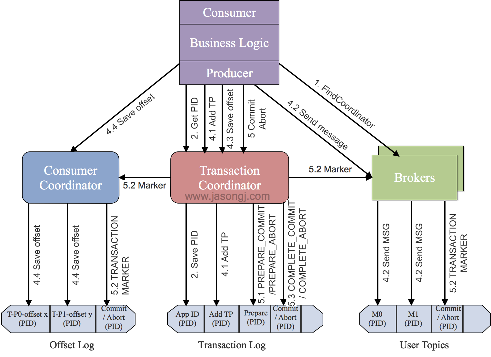

# MQ 的事务消息，exactly-once 语义等

## reference

- [Kafka消息送达语义详解](https://www.jianshu.com/p/0943bbf482e9)
- [Kafka事务特性详解](https://www.jianshu.com/p/64c93065473e)
- [Kafka设计解析（八）- Exactly Once语义与事务机制原理](http://www.jasongj.com/kafka/transaction/)
- [Exactly-Once Semantics Are Possible: Here’s How Kafka Does It](https://www.confluent.io/blog/exactly-once-semantics-are-possible-heres-how-apache-kafka-does-it/)
- [Transactions in Apache Kafka](https://www.confluent.io/blog/transactions-apache-kafka)
- [Exactly-Once Processing in Kafka explained](https://ssudan16.medium.com/exactly-once-processing-in-kafka-explained-66ecc41a8548)
- [KIP-98 - Exactly Once Delivery and Transactional Messaging](https://cwiki.apache.org/confluence/display/KAFKA/KIP-98+-+Exactly+Once+Delivery+and+Transactional+Messaging)
- [kafka distributed transaction with jdon-framework](https://github.com/banq/jdon-kafka)
- [kafka-exactly-once tutorial](https://github.com/koeninger/kafka-exactly-once)
- [Effectively-Once Semantics in Apache Pulsar](https://www.splunk.com/en_us/blog/it/effectively-once-semantics-in-apache-pulsar.html)
- [Using Kafka MockProducer](https://www.baeldung.com/kafka-mockproducer)

## Question

> 什么是 kafka 的事务？

Kafka提供事务主要是为了实现精确一次处理语义(exactly-once semantics, EOS)的，而EOS是实现流处理系统正确性(correctness)的基石，故Kafka事务被大量应用于Kafka Streams之中。不过用户当然也能够调用API实现自己的事务需求。

具体的场景包括：

1. producer端跨多分区的原子性写入
2. consumer端读取事务消息

> Flink-connector-kafka 是如何生成 transactionalId 的？


## 架构

### kafka


### RocketMQ


### Pulsar

>Pulsar 采用**计算与存储分离架构设计**，支持多租户、持久化存储、多机房跨区域数据复制，具有强一致性、高吞吐、低延时及高可扩展性等流数据存储特性


## [Kafka消息送达语义详解](https://www.jianshu.com/p/0943bbf482e9)

- At most once
- At least once
- Exactly once

### Producer

- **At most once意味着Producer发送完一条消息后，不会确认消息是否成功送达**。
- **At least once意味着Producer发送完一条消息后，会确认消息是否发送成功。如果Producer没有收到Broker的ack确认消息，那么会不断重试发送消息**。
- **Exactly once意味着Producer消息的发送是幂等的**。

#### Producer At least once && At Most once配置

- **acks=0**。`acks`配置项表示Producer期望的Broker的确认数。默认值为1。可选项：[0，1，all]。
- **retries=0**。`retires`配置项表示当消息发送失败时，Producer重发消息的次数。

>当配置了`retires`的值后，如果没有将`max.in.flight.requests.per.connection`配置的值设置为1，有可能造成消息乱序的结果。`max.in.flight.requests.per.connection`配置代表着一个Producer同时可以发送的未收到确认的消息数量。如果`max.in.flight.requests.per.connection`数量大于1，那么可能发送了message1后，在没有收到确认前就发送了message2，此时message1发送失败后触发重试，而message2直接发送成功，就造成了Broker上消息的乱序。`max.in.flight.requests.per.connection`的默认值为5。

#### Producer Exactly once配置

- **enable.idempotence=true**。`enable.idempotence`配置项表示是否使用幂等性。当`enable.idempotence`配置为true时，`acks`必须配置为all。并且建议`max.in.flight.requests.per.connection`的值小于5。
- **acks=all**

### Kafka如何实现消息发送幂等

> Kafka本身支持At least once消息送达语义，因此 **实现消息发送的幂等关键是要实现Broker端消息的去重。**

Kafka 引入了两个新的概念：

- PID。每个新的Producer在初始化的时候会被分配一个唯一的PID，这个PID对用户是不可见的。
- Sequence Numbler。对于每个PID，该Producer发送数据的每个<Topic, Partition>都对应一个从0开始单调递增的Sequence Number

Broker端在缓存中保存了这Sequence Numbler，对于接收的每条消息，如果其序号比Broker缓存中序号大于1则接受它，否则将其丢弃。这样就可以实现了消息重复提交了。但是，只能保证单个Producer对于同一个<Topic, Partition>的Exactly Once语义。不能保证同一个Producer一个topic不同的partion幂等。

>Kafka幂等性配置时要求 `max.in.flight.requests.per.connection` 小于等于 5 的主要原因是：Server 端的 ProducerStateManager 实例会缓存每个 PID 在每个 Topic-Partition 上发送的最近 5 个batch 数据。如果参数超过 5 的话，可能会导致部分数据在缓存中找不到对应的 batch 从而引起客户端无限重试。

### Consumer

- At-most once，**Consumer 在消费到数据后立即提交 offset**
- At-least once，**Consumer 在消费到数据并完成业务逻辑处理后提交 offset**
- Exactly-once，**表示 Consumer 消费数据之后，业务逻辑和提交offset 是原子的，即消息消费成功后offset改变，消息消费失败offset也能回滚**。

#### Consumer At least once配置

- **enable.auto.commit=false**。禁止后台自动提交offset
- 手动调用`consumer.commitSync()`来提交offset。手动调用保证了offset即时更新。

#### Consumer At most once配置

- **enable.auto.commit=true**。后台定时提交offset。
- **auto.commit.interval.ms**配置为一个很小的数值。`auto.commit.interval.ms`表示后台提交offset的时间间隔。

#### Consumer Exactly once配置

- **isolation.level=read_committed**。`isolation.level`表示何种类型的message对Consumer可见。下面会更详细的介绍这个参数。

一个常见的Exactly once的的使用场景是：当我们订阅了一个topic，然后往另一个topic里写入数据时，我们希望这两个操作是原子性的，即如果写入消息失败，那么我们希望读取消息的offset可以回滚。

此时可以通过Kafka的Transaction特性来实现。Kafka是在版本0.11之后开始提供事务特性的。我们可以将Consumer读取数据和Producer写入数据放进一个同一个事务中，在事务没有成功结束前，所有的这个事务中包含的消息都被标记为uncommitted。只有事务执行成功后，所有的消息才会被标记为committed。

我们知道，offset信息是以消息的方式存储在Broker的__consumer_offsets topic中的。因此在事务开始后，Consumer读取消息后，所有的offset消息都是uncommitted状态。所有的Producer写入的消息也都是uncommitted状态。

而Consumer可以通过配置`isolation.level`来决定uncommitted状态的message是否对Consumer可见。`isolation.level`拥有两个可选值：`read_committed`和`read_uncommitted`。默认值为`read_uncommitted`。

当我们将`isolation.level`配置为`read_committed`后，那么所有事务未提交的数据就都对Consumer不可见了，也就实现了Kafka的事务语义。

## [Kafka事务特性详解](https://www.jianshu.com/p/64c93065473e)

**Kafka事务特性是指一系列的生产者生产消息和消费者提交偏移量的操作在一个事务中，或者说是一个原子操作，生产消息和提交偏移量同时成功或者失败。**

### 1. kafka 事务

1. **生产者发送多条消息可以封装在一个事务中，形成一个原子操作。**
2. **read-process-write模式：将消息消费和生产封装在一个事务中，形成一个原子操作。**

kafka 提供的事务操作接口：

```java
    /**
     * 初始化事务
     */
    public void initTransactions();
 
    /**
     * 开启事务
     */
    public void beginTransaction() throws ProducerFencedException ;
 
    /**
     * 在事务内提交已经消费的偏移量
     */
    public void sendOffsetsToTransaction(Map<TopicPartition, OffsetAndMetadata> offsets, 
                                         String consumerGroupId) throws ProducerFencedException ;
 
    /**
     * 提交事务
     */
    public void commitTransaction() throws ProducerFencedException;
 
    /**
     * 丢弃事务
     */
    public void abortTransaction() throws ProducerFencedException ;
```

> 下面的 Producer 开启了一个事务，发送两条消息，要么两条全部发送成功，要么全部发送失败。

```java
KafkaProducer producer = createKafkaProducer(
  "bootstrap.servers", "localhost:9092",
  "transactional.id”, “my-transactional-id");

producer.initTransactions();
producer.beginTransaction();
producer.send("outputTopic", "message1");
producer.send("outputTopic", "message2");
producer.commitTransaction();
```

> 下面这段代码即为read-process-write模式，**在一个Kafka事务中，同时涉及到了生产消息和消费消息**。

```java
KafkaProducer producer = createKafkaProducer(
  "bootstrap.servers", "localhost:9092",
  "transactional.id", "my-transactional-id");

KafkaConsumer consumer = createKafkaConsumer(
  "bootstrap.servers", "localhost:9092",
  "group.id", "my-group-id",
  "isolation.level", "read_committed");

consumer.subscribe(singleton("inputTopic"));

producer.initTransactions();

while (true) {
  ConsumerRecords records = consumer.poll(Long.MAX_VALUE);
  producer.beginTransaction();
  for (ConsumerRecord record : records)
    producer.send(producerRecord(“outputTopic”, record));
  producer.sendOffsetsToTransaction(currentOffsets(consumer), group);  
  producer.commitTransaction();
}
```

注意：在理解消息的事务时，一直处于一个错误理解是，把操作db的业务逻辑跟操作消息当成是一个事务，如下所示：

```java
void  kakfa_in_tranction(){
  // 1.kafa的操作：读取消息或生产消息
  kafkaOperation();
  // 2.db操作
  dbOperation();
}
```

**一种数据源（如mysql，kafka）对应一个事务，所以它们是两个独立的事务。**

> kafka事务指kafka一系列 生产、消费消息等操作组成一个原子操作，db事务是指操作数据库的一系列增删改操作组成一个原子操作。

### 2. Kafka事务配置

- 对于Producer，需要设置`transactional.id`属性，这个属性的作用下文会提到。设置了`transactional.id`属性后，`enable.idempotence`属性会自动设置为true。
- 对于Consumer，需要设置`isolation.level = read_committed`，这样Consumer只会读取已经提交了事务的消息。另外，需要设置`enable.auto.commit = false`来关闭自动提交Offset功能。

### 3. Kafka事务特性

> Kafka的事务特性本质上代表了三个功能：**原子写操作**，**拒绝僵尸实例（Zombie fencing）和读事务消息**。

#### 3.1 原子写

kafka 的事务需要保证 **跨分区的多个写操作的原子性**

#### 3.2 僵尸实例

> 当某一个 instance 挂掉的时候，kafka 会用这个 instance 来代替这个节点。
>
> 挂掉的 instance 如果在之后的某个时刻恢复，但是它没有成为代替节点的副本，而是成为了一个与代替节点平行的副本，就称之为僵尸副本。
>
> Kafka事务特性通过`transaction-id`属性来解决僵尸实例问题。所有具有相同`transaction-id`的Producer都会被分配相同的pid，同时每一个Producer还会被分配一个递增的epoch。Kafka收到事务提交请求时，如果检查当前事务提交者的epoch不是最新的，那么就会拒绝该Producer的请求。从而达成拒绝僵尸实例的目标。

#### 3.3 读事务消息

为了保证事务特性，Consumer如果设置了`isolation.level = read_committed`，那么它只会读取已经提交了的消息。在Producer成功提交事务后，Kafka会将所有该事务中的消息的`Transaction Marker`从`uncommitted`标记为`committed`状态，从而所有的Consumer都能够消费。

### 4. kafka 的事务原理



#### transactional.id

The TransactionalId to use for transactional delivery. This enables reliability semantics which span multiple producer sessions since it allows the client to guarantee that transactions using the same TransactionalId have been completed prior to starting any new transactions. **If no TransactionalId is provided, then the producer is limited to idempotent delivery.** If a TransactionalId is configured, `enable.idempotence` is implied. By default the TransactionId is not configured, which means transactions cannot be used. Note that, by default, transactions require a cluster of at least three brokers which is the recommended setting for production; for development you can change this, by adjusting broker setting `transaction.state.log.replication.factor`.

> `transactional.id` 是在初始化 KafkaProducer 时的可选参数。

```java
        Properties props = new Properties();
        props.put(ProducerConfig.TRANSACTIONAL_ID_CONFIG, "my-transactional-id");
        producer = new KafkaProducer<String, String>(props);
```

#### producerId

> producerId 是每一个 KafkaProducer 实例都会分配；
>
> 但是只有在 kafka 开启了 `enable.idempotence` 或者 `transactional.id` 时才会分配。

```java
public class TestKafkaProducer {
    public static void main(String[] args) {
        // p1 和 p2 拥有不同的 PID
        Kafka09Sender p1 = new Kafka09Sender("test.dc.data.woa.com:9092", "test");
        Kafka09Sender p2 = new Kafka09Sender("test.dc.data.woa.com:9092", "test");
        p1.send("test", "hello");
        p2.send("test", "world");
    }
}
```

PID 和 epoch 存在 kafka 内部的一个类中

```java
class ProducerIdAndEpoch {
    static final ProducerIdAndEpoch NONE = new ProducerIdAndEpoch(NO_PRODUCER_ID, NO_PRODUCER_EPOCH);

    public final long producerId;
    public final short epoch;

    ProducerIdAndEpoch(long producerId, short epoch) {
        this.producerId = producerId;
        this.epoch = epoch;
    }

    public boolean isValid() {
        return NO_PRODUCER_ID < producerId;
    }

    @Override
    public String toString() {
        return "(producerId=" + producerId + ", epoch=" + epoch + ")";
    }
}
```

#### Sequence Number

> Sequnce Number 是在客户端生成的。

```java
public class TransactionManager {
    // The base sequence of the next batch bound for a given partition.
    private final Map<TopicPartition, Integer> nextSequence;

      /**
     * Returns the next sequence number to be written to the given TopicPartition.
     */
    synchronized Integer sequenceNumber(TopicPartition topicPartition) {
        Integer currentSequenceNumber = nextSequence.get(topicPartition);
        if (currentSequenceNumber == null) {
            currentSequenceNumber = 0;
            nextSequence.put(topicPartition, currentSequenceNumber);
        }
        return currentSequenceNumber;
    }
}
```

#### 事务性保证

> 对于Kafka Stream应用而言，典型的操作即是从某个Topic消费数据，经过一系列转换后写回另一个Topic，保证从源Topic的读取与向目标Topic的写入的原子性有助于从故障中恢复。

事务保证可使得应用程序将生产数据和消费数据当作一个原子单元来处理，要么全部成功，要么全部失败，即使该生产或消费跨多个`<Topic, Partition>`。

另外，有状态的应用也可以保证重启后从断点处继续处理，也即事务恢复。

为了实现这种效果，**应用程序必须提供一个稳定的（重启后不变）唯一的ID**，也即`Transaction ID`。`Transactin ID`与`PID`可能一一对应。区别在于`Transaction ID`由用户提供，而`PID`是内部的实现对用户透明。

另外，为了保证新的Producer启动后，旧的具有相同`Transaction ID`的Producer即失效，每次Producer通过`Transaction ID`拿到PID的同时，还会获取一个单调递增的epoch。由于旧的Producer的epoch比新Producer的epoch小，Kafka可以很容易识别出该Producer是老的Producer并拒绝其请求。

#### 事务机制原理

##### 事务性消息传递

这一节所说的事务主要指原子性，也即Producer将多条消息作为一个事务批量发送，要么全部成功要么全部失败。

为了实现这一点，Kafka 0.11.0.0引入了一个服务器端的模块，名为`Transaction Coordinator`，用于管理Producer发送的消息的事务性。

该`Transaction Coordinator`维护`Transaction Log`，该log存于一个内部的Topic内。由于Topic数据具有持久性，因此事务的状态也具有持久性。

Producer并不直接读写`Transaction Log`，它与`Transaction Coordinator`通信，然后由`Transaction Coordinator`将该事务的状态插入相应的`Transaction Log`。

`Transaction Log`的设计与`Offset Log`用于保存Consumer的Offset类似。

##### 事务中Offset的提交

许多基于Kafka的应用，尤其是Kafka Stream应用中同时包含Consumer和Producer，前者负责从Kafka中获取消息，后者负责将处理完的数据写回Kafka的其它Topic中。

为了实现该场景下的事务的原子性，Kafka需要保证对Consumer Offset的Commit与Producer对发送消息的Commit包含在同一个事务中。否则，如果在二者Commit中间发生异常，根据二者Commit的顺序可能会造成数据丢失和数据重复：

- 如果先Commit Producer发送数据的事务再Commit Consumer的Offset，即`At Least Once`语义，可能造成数据重复。
- 如果先Commit Consumer的Offset，再Commit Producer数据发送事务，即`At Most Once`语义，可能造成数据丢失。

##### 用于事务特性的控制型消息

为了区分写入Partition的消息被Commit还是Abort，Kafka引入了一种特殊类型的消息，即`Control Message`。该类消息的Value内不包含任何应用相关的数据，并且不会暴露给应用程序。它只用于Broker与Client间的内部通信。

对于Producer端事务，Kafka以Control Message的形式引入一系列的`Transaction Marker`。Consumer即可通过该标记判定对应的消息被Commit了还是Abort了，然后结合该Consumer配置的隔离级别决定是否应该将该消息返回给应用程序。

##### 事务处理样例代码

```java
Producer<String, String> producer = new KafkaProducer<String, String>(props);
    
// 初始化事务，包括结束该Transaction ID对应的未完成的事务（如果有）
// 保证新的事务在一个正确的状态下启动
producer.initTransactions();

// 开始事务
producer.beginTransaction();

// 消费数据
ConsumerRecords<String, String> records = consumer.poll(100);

try{
    // 发送数据
    producer.send(new ProducerRecord<String, String>("Topic", "Key", "Value"));
    
    // 发送消费数据的Offset，将上述数据消费与数据发送纳入同一个Transaction内
    producer.sendOffsetsToTransaction(offsets, "group1");

    // 数据发送及Offset发送均成功的情况下，提交事务
    producer.commitTransaction();
} catch (ProducerFencedException | OutOfOrderSequenceException | AuthorizationException e) {
    // 数据发送或者Offset发送出现异常时，终止事务
    producer.abortTransaction();
} finally {
    // 关闭Producer和Consumer
    producer.close();
    consumer.close();
}
```

##### 完整事务过程


###### 找到`Transaction Coordinator`

> 由于`Transaction Coordinator`是分配PID和管理事务的核心，因此Producer要做的第一件事情就是通过向任意一个Broker发送`FindCoordinator`请求找到`Transaction Coordinator`的位置。

###### 获取PID

找到`Transaction Coordinator`后，具有幂等特性的Producer必须发起`InitPidRequest`请求以获取PID。


**如果事务特性被开启**：`InitPidRequest`会发送给`Transaction Coordinator`。如果`Transaction Coordinator`是第一次收到包含有该`Transaction ID`的InitPidRequest请求，它将会把该`<TransactionID, PID>`存入`Transaction Log`，如上图中步骤2.1所示。这样可保证该对应关系被持久化，从而保证即使`Transaction Coordinator`宕机该对应关系也不会丢失。


