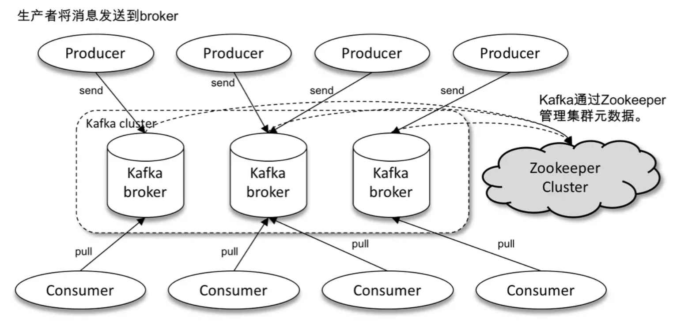
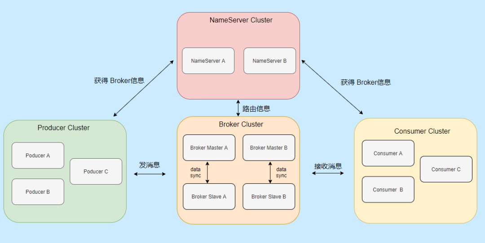
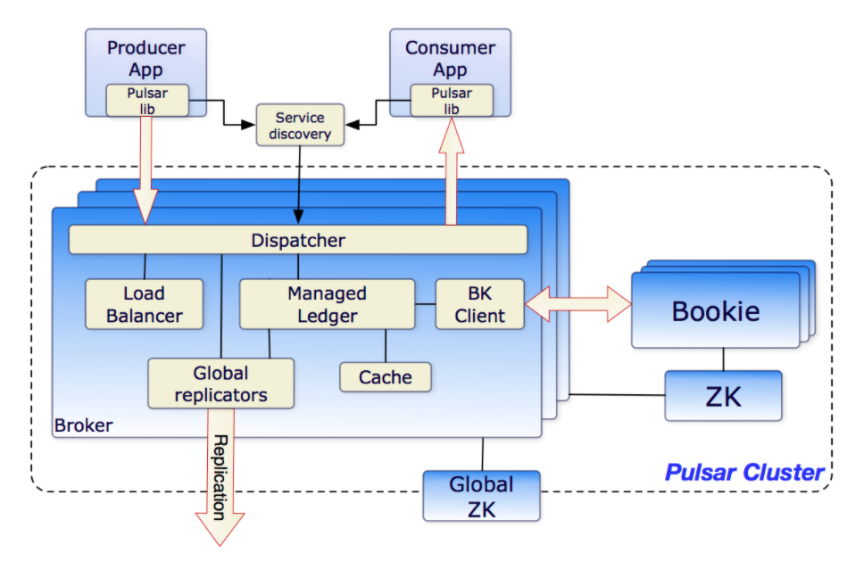

# MQ 的事务消息，exactly-once 语义等

## reference

- [Kafka消息送达语义详解](https://www.jianshu.com/p/0943bbf482e9)
- [Kafka事务特性详解](https://www.jianshu.com/p/64c93065473e)
- [Transactions in Apache Kafka](https://www.confluent.io/blog/transactions-apache-kafka)
- [Effectively-Once Semantics in Apache Pulsar](https://www.splunk.com/en_us/blog/it/effectively-once-semantics-in-apache-pulsar.html)
- [Exactly-Once Processing in Kafka explained](https://ssudan16.medium.com/exactly-once-processing-in-kafka-explained-66ecc41a8548)
- [KIP-98 - Exactly Once Delivery and Transactional Messaging](https://cwiki.apache.org/confluence/display/KAFKA/KIP-98+-+Exactly+Once+Delivery+and+Transactional+Messaging)
- [kafka distributed transaction with jdon-framework](https://github.com/banq/jdon-kafka)
- [kafka-exactly-once tutorial](https://github.com/koeninger/kafka-exactly-once)

## 架构

### kafka

### RocketMQ

### Pulsar

>Pulsar 采用**计算与存储分离架构设计**，支持多租户、持久化存储、多机房跨区域数据复制，具有强一致性、高吞吐、低延时及高可扩展性等流数据存储特性

# 

