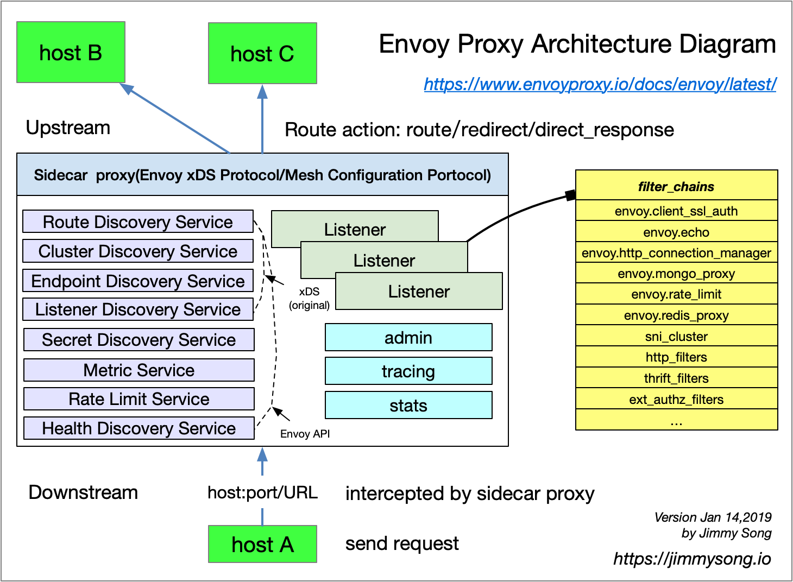
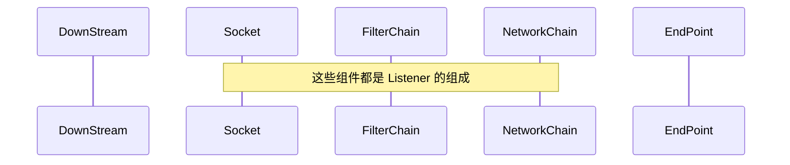

# envoy

## 架构





## tutorial

### Create Proxy Config

>we're building a configuration using the Static Configuration API. This means that all the settings are pre-defined within the configuration.

```yaml
# 静态配置
static_resources:
  # Listeners
  # A Listener is the networking configuration, such as IP address and ports, that Envoy listens to for requests.
  listeners:
  - name: listener_0
    address:
      socket_address: { address: 0.0.0.0, port_value: 10000 }
    
    # With Envoy listening for incoming traffic, the next stage is to define how to process the requests.
    filter_chains:
    # The aim of each filter is to find a match on the incoming request, to match it to the target destination.
    - filters:
      # The filter is using envoy.http_connection_manager, a built-in filter designed for HTTP connections.
      - name: envoy.http_connection_manager
        config:
          # The human-readable prefix to use when emitting statistics for the connection manager.
          stat_prefix: ingress_http
          # he configuration for the route. If the virtual host matches, then the route is checked. 
          # In this example, the route_config matches all incoming HTTP requests, no matter the host domain requested.
          route_config:
            name: local_route
            # If the virtual host matches, then the route is checked.
            virtual_hosts:
            - name: local_service
              domains: ["*"]
              # If the URL prefix is matched then a set of route rules defines what should happen next. In this case "/" means match the root of the request
              routes:
              - match: { prefix: "/" }
                # host_rewrite : Change the inbound Host header for the HTTP request.
                # cluster : The name of the cluster which will handle the request. The implementation is defined below.
                route: { host_rewrite: www.google.com, cluster: service_google }
          # The filter allows Envoy to adapt and modify the request as it is processed.
          http_filters:
          - name: envoy.router

  clusters:
  - name: service_google
    connect_timeout: 0.25s
    type: LOGICAL_DNS
    dns_lookup_family: V4_ONLY
    lb_policy: ROUND_ROBIN
    hosts: [{ socket_address: { address: google.com, port_value: 443 }}]
    tls_context: { sni: www.google.com }

admin:
  access_log_path: /tmp/admin_access.log
  address:
    socket_address: { address: 0.0.0.0, port_value: 9901 }
```

### Getting Started with Envoy

#### docker-compose.yaml

```yaml
version: '2'
services:

  front-envoy:
    build:
      context: .
      dockerfile: Dockerfile-frontenvoy
    volumes:
      - ./front-envoy.yaml:/etc/front-envoy.yaml
    networks:
      - envoymesh
    expose:
      - "80"
      - "8001"
    ports:
      - "8000:80"
      - "8001:8001"

  service1:
    build:
      context: .
      dockerfile: Dockerfile-service
    volumes:
      - ./service-envoy.yaml:/etc/service-envoy.yaml
    networks:
      envoymesh:
        aliases:
          - service1
    environment:
      - SERVICE_NAME=1
    expose:
      - "80"

  service2:
    build:
      context: .
      dockerfile: Dockerfile-service
    volumes:
      - ./service-envoy.yaml:/etc/service-envoy.yaml
    networks:
      envoymesh:
        aliases:
          - service2
    environment:
      - SERVICE_NAME=2
    expose:
      - "80"

networks:
  envoymesh: {}
```

#### service.py

```python
from flask import Flask
from flask import request
import socket
import os
import sys
import requests

app = Flask(__name__)

TRACE_HEADERS_TO_PROPAGATE = [
    'X-Ot-Span-Context',
    'X-Request-Id',

    # Zipkin headers
    'X-B3-TraceId',
    'X-B3-SpanId',
    'X-B3-ParentSpanId',
    'X-B3-Sampled',
    'X-B3-Flags',

    # Jaeger header (for native client)
    "uber-trace-id"
]

@app.route('/service/<service_number>')
def hello(service_number):
    return ('Hello from behind Envoy (service {})! hostname: {} resolved'
            'hostname: {}\n'.format(os.environ['SERVICE_NAME'], 
                                    socket.gethostname(),
                                    socket.gethostbyname(socket.gethostname())))

@app.route('/trace/<service_number>')
def trace(service_number):
    headers = {}
    # call service 2 from service 1
    if int(os.environ['SERVICE_NAME']) == 1 :
        for header in TRACE_HEADERS_TO_PROPAGATE:
            if header in request.headers:
                headers[header] = request.headers[header]
        ret = requests.get("http://localhost:9000/trace/2", headers=headers)
    return ('Hello from behind Envoy (service {})! hostname: {} resolved'
            'hostname: {}\n'.format(os.environ['SERVICE_NAME'], 
                                    socket.gethostname(),
                                    socket.gethostbyname(socket.gethostname())))

if __name__ == "__main__":
    app.run(host='127.0.0.1', port=8080, debug=True)

```

#### front-envoy.yaml

```yaml
static_resources:
  listeners:
  - address:
      socket_address:
        address: 0.0.0.0
        port_value: 80
    filter_chains:
    - filters:
      - name: envoy.http_connection_manager
        config:
          codec_type: auto
          stat_prefix: ingress_http
          route_config:
            name: local_route
            virtual_hosts:
            - name: backend
              domains:
              - "*"
              routes:
              - match:
                  prefix: "/service/1"
                route:
                  cluster: service1
              - match:
                  prefix: "/service/2"
                route:
                  cluster: service2
          http_filters:
          - name: envoy.router
            config: {}
  clusters:
  - name: service1
    connect_timeout: 0.25s
    type: strict_dns
    lb_policy: round_robin
    http2_protocol_options: {}
    hosts:
    - socket_address:
        address: service1
        port_value: 80
  - name: service2
    connect_timeout: 0.25s
    type: strict_dns
    lb_policy: round_robin
    http2_protocol_options: {}
    hosts:
    - socket_address:
        address: service2
        port_value: 80
admin:
  access_log_path: "/dev/null"
  address:
    socket_address:
      address: 0.0.0.0
      port_value: 8001
```

#### service-envoy.yaml

```yaml
static_resources:
  listeners:
  - address:
      socket_address:
        address: 0.0.0.0
        port_value: 80
    filter_chains:
    - filters:
      - name: envoy.http_connection_manager
        config:
          codec_type: auto
          stat_prefix: ingress_http
          route_config:
            name: local_route
            virtual_hosts:
            - name: service
              domains:
              - "*"
              routes:
              - match:
                  prefix: "/service"
                route:
                  cluster: local_service
          http_filters:
          - name: envoy.router
            config: {}
  clusters:
  - name: local_service
    connect_timeout: 0.25s
    type: strict_dns
    lb_policy: round_robin
    hosts:
    - socket_address:
        address: 127.0.0.1
        port_value: 8080
admin:
  access_log_path: "/dev/null"
  address:
    socket_address:
      address: 0.0.0.0
      port_value: 8081
```

#### start_service.sh

```bash
#!/bin/sh
python3 /code/service.py &
envoy -c /etc/service-envoy.yaml --service-cluster service${SERVICE_NAME}
```

### [Configuration: Dynamic from filesystem](https://www.envoyproxy.io/docs/envoy/latest/start/quick-start/configuration-dynamic-filesystem#configuration-dynamic-from-filesystem)

#### envoy-dynamic-filesystem-demo.yaml

```yaml
# uniquely identify the proxy node
node:
  cluster: test-cluster
  id: test-id

# tell Envoy where to find its dynamic configuration.
dynamic_resources:
  cds_config:
    path: /var/lib/envoy/cds.yaml
  lds_config:
    path: /var/lib/envoy/lds.yaml

admin:
  address:
    socket_address:
      address: 0.0.0.0
      port_value: 19000
```

#### envoy-dynamic-lds-demo.yaml

> the follwing example configures an `HTTP` [listener](https://www.envoyproxy.io/docs/envoy/latest/api-v3/config/listener/v3/listener.proto#envoy-v3-api-msg-config-listener-v3-listener) on port `10000`.

```yaml
resources:
- "@type": type.googleapis.com/envoy.config.listener.v3.Listener
  name: listener_0
  address:
    socket_address:
      address: 0.0.0.0
      port_value: 10000
  filter_chains:
  - filters:
    - name: envoy.http_connection_manager
      typed_config:
        "@type": type.googleapis.com/envoy.extensions.filters.network.http_connection_manager.v3.HttpConnectionManager
        stat_prefix: ingress_http
        http_filters:
        - name: envoy.router
        route_config:
          name: local_route
          virtual_hosts:
          - name: local_service
            domains:
            - "*"
            routes:
            - match:
                prefix: "/"
              route:
                host_rewrite_literal: www.envoyproxy.io
                cluster: example_proxy_cluster
```

#### envoy-dynamic-cds-demo.yaml

>In the following example of a `dynamic CDS file`, the `example_proxy_cluster` cluster proxies over `TLS` to [https://www.envoyproxy.io](https://www.envoyproxy.io/).

```yaml
resources:
- "@type": type.googleapis.com/envoy.config.cluster.v3.Cluster
  name: example_proxy_cluster
  type: STRICT_DNS
  typed_extension_protocol_options:
    envoy.extensions.upstreams.http.v3.HttpProtocolOptions:
      "@type": type.googleapis.com/envoy.extensions.upstreams.http.v3.HttpProtocolOptions
      explicit_http_config:
        http2_protocol_options: {}
  load_assignment:
    cluster_name: example_proxy_cluster
    endpoints:
    - lb_endpoints:
      - endpoint:
          address:
            socket_address:
              address: www.envoyproxy.io
              port_value: 443
  transport_socket:
    name: envoy.transport_sockets.tls
    typed_config:
      "@type": type.googleapis.com/envoy.extensions.transport_sockets.tls.v3.UpstreamTlsContext
      sni: www.envoyproxy.io
```

### [Configuration: Dynamic from control plane](https://www.envoyproxy.io/docs/envoy/latest/start/quick-start/configuration-dynamic-control-plane#configuration-dynamic-from-control-plane)

> There are a number of control planes compatible with Envoy’s API such as [Gloo](https://docs.solo.io/gloo/latest/) or [Istio](https://istio.io/).

#### [node](https://www.envoyproxy.io/docs/envoy/latest/start/quick-start/configuration-dynamic-control-plane#node)

```yaml
node:
  cluster: test-cluster
  id: test-id

dynamic_resources:
```

#### [dynamic_resources](https://www.envoyproxy.io/docs/envoy/latest/start/quick-start/configuration-dynamic-control-plane#dynamic-resources)

> The [dynamic_resources](https://www.envoyproxy.io/docs/envoy/latest/api-v3/config/bootstrap/v3/bootstrap.proto#envoy-v3-api-field-config-bootstrap-v3-bootstrap-dynamic-resources) specify the configuration to load dynamically, and the [cluster](https://www.envoyproxy.io/docs/envoy/latest/start/quick-start/configuration-dynamic-control-plane#start-quick-start-dynamic-static-resources) to connect for dynamic configuration updates.
>
> In this example, the configuration is provided by the `xds_cluster` configured below.

```yaml
  id: test-id

dynamic_resources:
  ads_config:
    api_type: GRPC
    transport_api_version: V3
    grpc_services:
    - envoy_grpc:
        cluster_name: xds_cluster
  cds_config:
    resource_api_version: V3
    ads: {}
  lds_config:
    resource_api_version: V3
    ads: {}

static_resources:
```

#### [static_resources](https://www.envoyproxy.io/docs/envoy/latest/start/quick-start/configuration-dynamic-control-plane#static-resources)

>The `xds_cluster` is configured to query a control plane at [http://my-control-plane:18000](http://my-control-plane:18000/) 

```yaml
    ads: {}

static_resources:
  clusters:
  - type: STRICT_DNS
    typed_extension_protocol_options:
      envoy.extensions.upstreams.http.v3.HttpProtocolOptions:
        "@type": type.googleapis.com/envoy.extensions.upstreams.http.v3.HttpProtocolOptions
        explicit_http_config:
          http2_protocol_options: {}
    name: xds_cluster
    load_assignment:
      cluster_name: xds_cluster
      endpoints:
      - lb_endpoints:
        - endpoint:
            address:
              socket_address:
                address: my-control-plane
                port_value: 18000

admin:
```

### Securing Envoy

#### [Upstream and downstream `TLS` contexts](https://www.envoyproxy.io/docs/envoy/latest/start/quick-start/securing#upstream-and-downstream-tls-contexts)

```yaml
static_resources:

  listeners:
  - name: listener_0
    address:
      socket_address:
        address: 0.0.0.0
        port_value: 10000
    filter_chains:
    - filters:
      - name: envoy.filters.network.http_connection_manager
        typed_config:
          "@type": type.googleapis.com/envoy.extensions.filters.network.http_connection_manager.v3.HttpConnectionManager
          stat_prefix: ingress_http
          http_filters:
          - name: envoy.filters.http.router
          route_config:
            name: local_route
            virtual_hosts:
            - name: local_service
              domains: ["*"]
              routes:
              - match:
                  prefix: "/"
                route:
                  host_rewrite_literal: www.envoyproxy.io
                  cluster: service_envoyproxy_io
      # Specifying a TLS context that clients can connect to is achieved by setting the DownstreamTLSContext in the transport_socket of a listener.
      transport_socket:
        name: envoy.transport_sockets.tls
        typed_config:
          "@type": type.googleapis.com/envoy.extensions.transport_sockets.tls.v3.DownstreamTlsContext
          common_tls_context:
            tls_certificates:
            - certificate_chain:
                filename: certs/servercert.pem
              private_key:
                filename: certs/serverkey.pem

  clusters:
  - name: service_envoyproxy_io
    type: LOGICAL_DNS
    # Comment out the following line to test on v6 networks
    dns_lookup_family: V4_ONLY
    load_assignment:
      cluster_name: service_envoyproxy_io
      endpoints:
      - lb_endpoints:
        - endpoint:
            address:
              socket_address:
                address: www.envoyproxy.io
                port_value: 443
    # Connecting to an “upstream” TLS service is conversely done by adding an UpstreamTLSContext to the transport_socket of a cluster.
    transport_socket:
      name: envoy.transport_sockets.tls
      typed_config:
        "@type": type.googleapis.com/envoy.extensions.transport_sockets.tls.v3.UpstreamTlsContext
```

#### [Validate an endpoint’s certificates when connecting](https://www.envoyproxy.io/docs/envoy/latest/start/quick-start/securing#validate-an-endpoint-s-certificates-when-connecting)


