#### 

#### Markdown Diagrams

## refrences

[Mermaid Document](https://mermaid-js.github.io/mermaid/#/)

[Mermaid Live Editor](https://mermaid.live/edit)

[WebSequenceDiagrams](https://www.websequencediagrams.com/)

[UML Association vs Aggregation vs Composition](https://www.visual-paradigm.com/guide/uml-unified-modeling-language/uml-aggregation-vs-composition/)

## examples

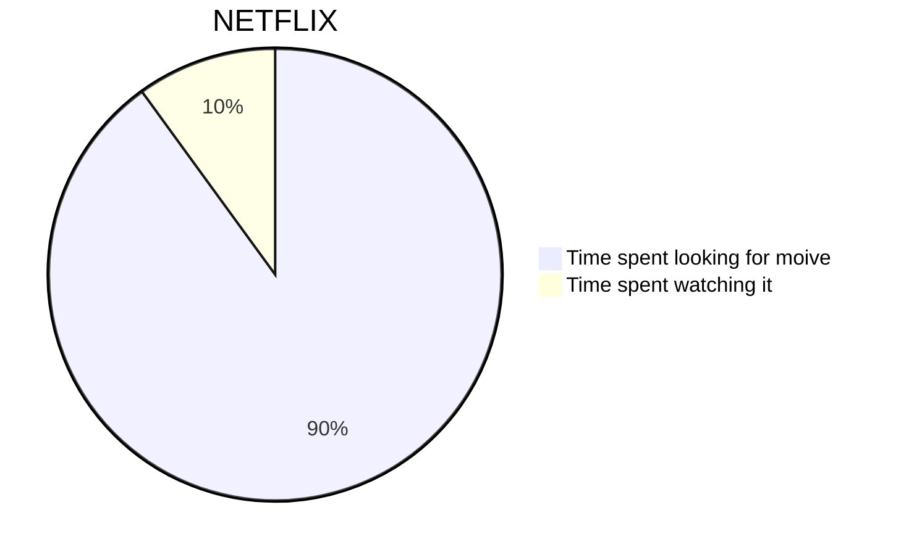

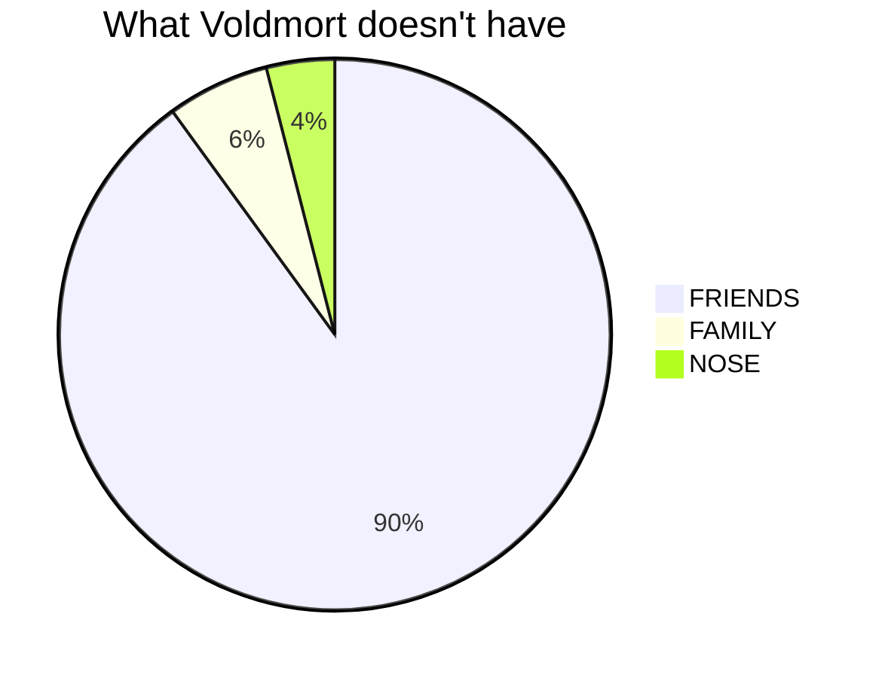

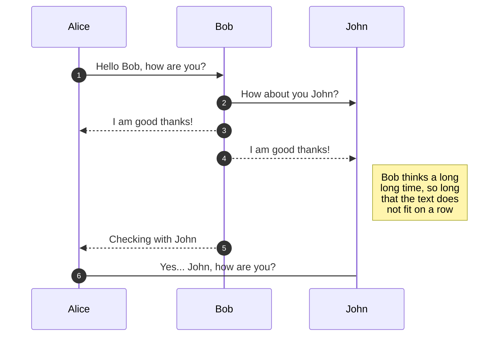

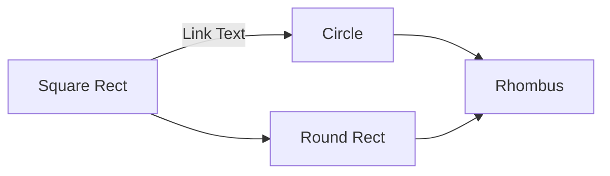

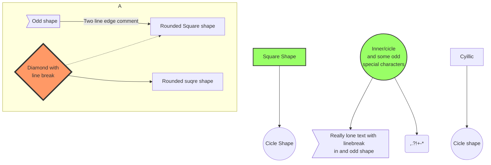

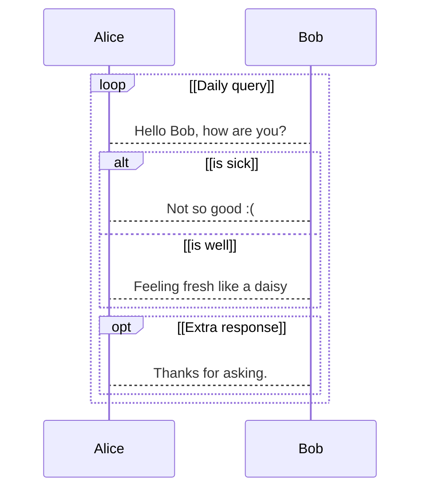

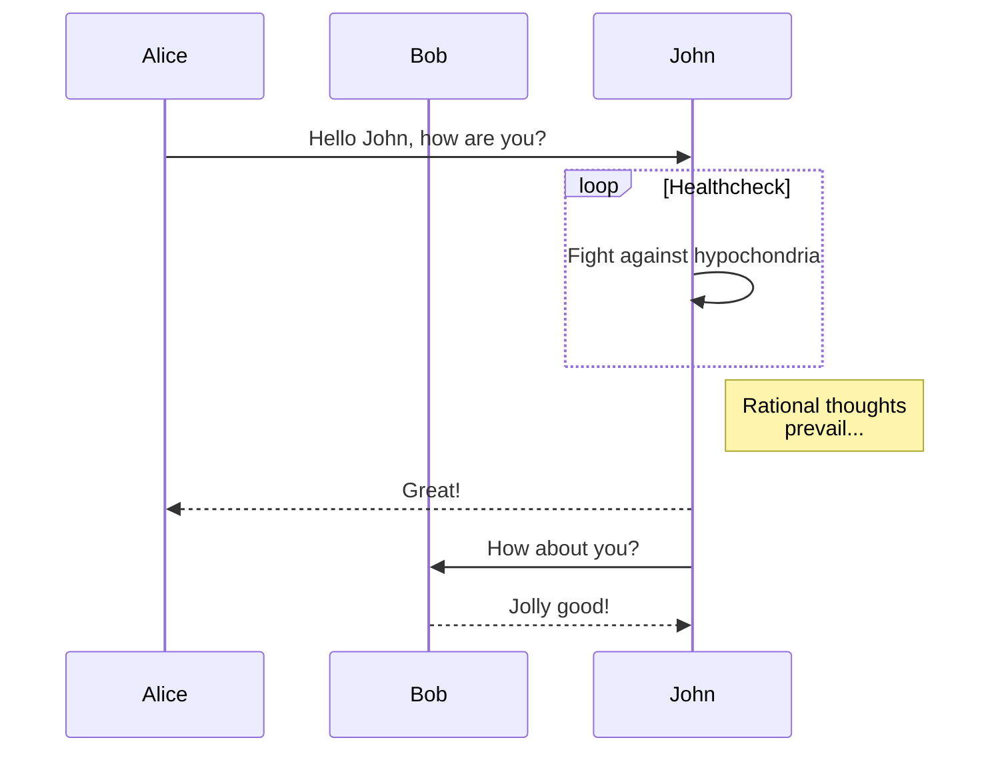


## Mermaid

### Flowcharts

#### [A node (default)](https://mermaid-js.github.io/mermaid/#/flowchart?id=a-node-default)

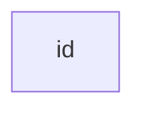

> **Note** The id is what is displayed in the box.

#### [A node with text](https://mermaid-js.github.io/mermaid/#/flowchart?id=a-node-with-text)

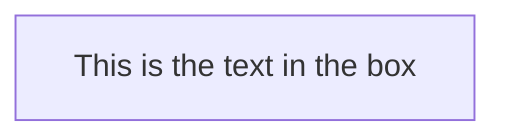

#### Graph

>This declares the flowchart is oriented from top to bottom (`TD` or `TB`).

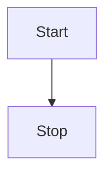

> left to right(`LR`)

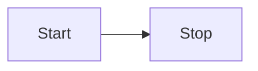

#### [Flowchart Orientation](https://mermaid-js.github.io/mermaid/#/flowchart?id=flowchart-orientation)

- TB - top to bottom
- TD - top-down/ same as top to bottom
- BT - bottom to top
- RL - right to left
- LR - left to right

#### [Node shapes](https://mermaid-js.github.io/mermaid/#/flowchart?id=node-shapes)

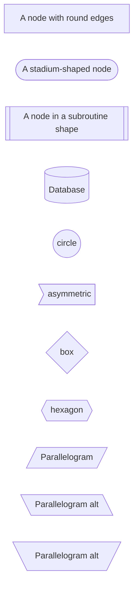

#### [Links between nodes](https://mermaid-js.github.io/mermaid/#/flowchart?id=links-between-nodes)

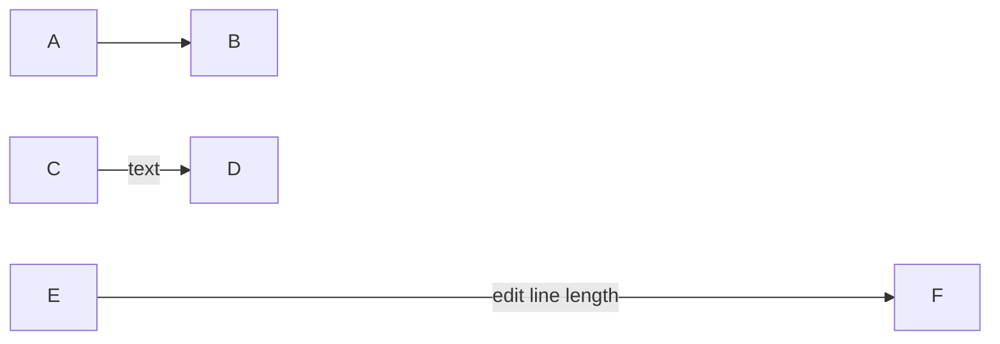

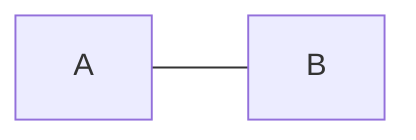

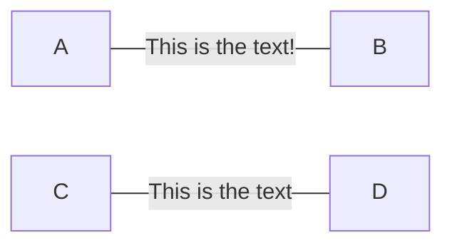

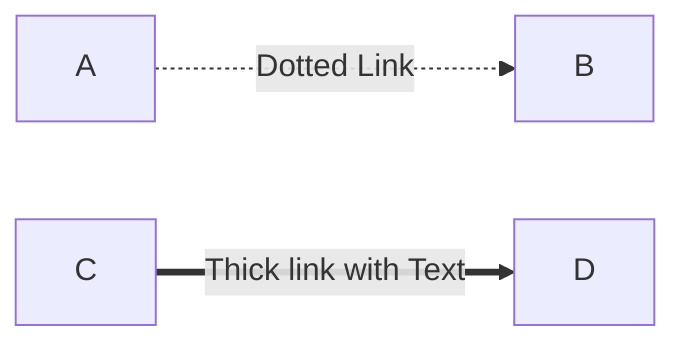

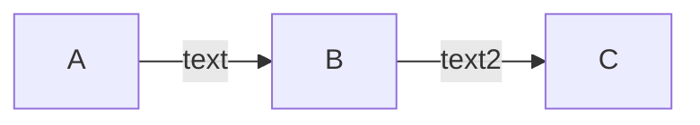

> It is also possible to declare multiple nodes links in the same line as per below;

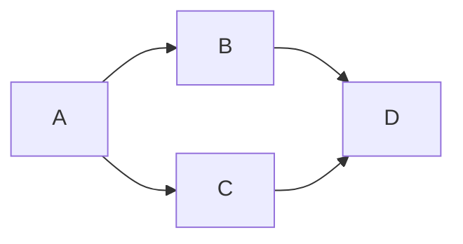

#### New arrow types

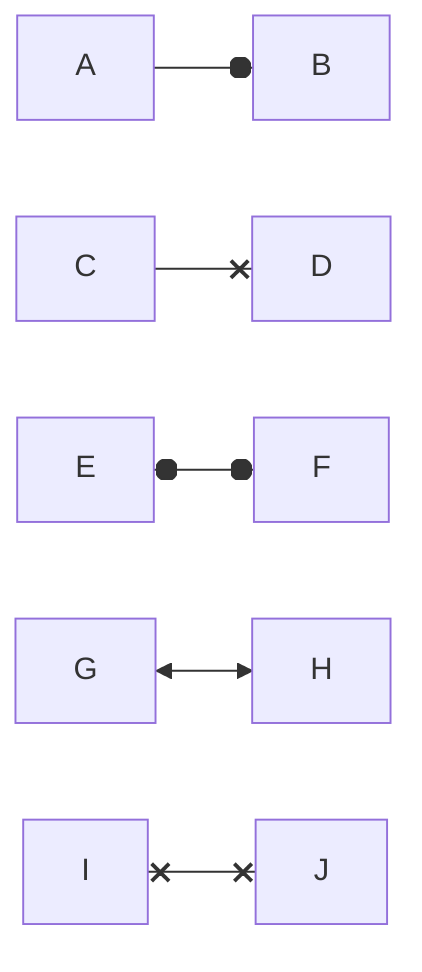

#### Minimum length of a link

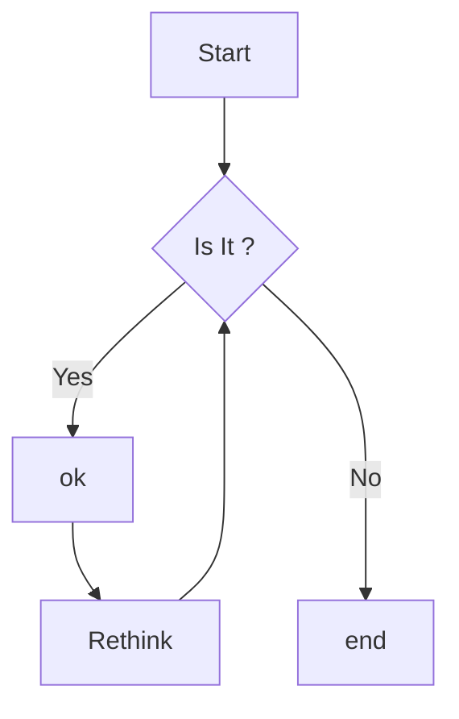

> For dotted or thick links, the characters to add are equals signs or dots, as summed up in the following table:

| Length            | 1      | 2       | 3        |
| ----------------- | ------ | ------- | -------- |
| Normal            | `---`  | `----`  | `-----`  |
| Normal with arrow | `-->`  | `--->`  | `---->`  |
| Thick             | `===`  | `====`  | `=====`  |
| Thick with arrow  | `==>`  | `===>`  | `====>`  |
| Dotted            | `-.-`  | `-..-`  | `-...-`  |
| Dotted with arrow | `-.->` | `-..->` | `-...->` |

```mermaid
    flowchart LR
        A["A double quote:#quot;"] -->B["A dec char:#9829;"]
```

#### Subgraphs

```mermaid
flowchart LR;

subgraph title
	a1 --> a2
end
```

```mermaid
flowchart TB
    c1-->a2
    
    subgraph one
    a1-->a2
    end
    
    subgraph two
    b1-->b2
    end
    
    subgraph three
    c1-->c2
    end
```

> You can also set an explicit id for the subgraph

```mermaid
flowchart TB;
	c1 --> a2;
	subgraph ide1[one]
	a1-->a2
	end
```

#### Direction in subgraphs

```mermaid
flowchart LR
  subgraph TOP
    %%direction TB
    subgraph B1
        %%direction RL
        i1 -->f1
    end
    subgraph B2
        %%direction BT
        i2 -->f2
    end
  end
  A --> TOP --> B
  B1 --> B2
```

```mermaid
flowchart LR;
    A-->B;
    B-->C;
    C-->D;
    %%click A callback "Tooltip for a callback"
    %%click B "http://www.github.com" "This is a tooltip for a link"
    %%click A call callback() "Tooltip for a callback"
    %%click B href "http://www.github.com" "This is a tooltip for a link
```

#### Styling and classes

```mermaid
flowchart LR
    id1(Start)-->id2(Stop)
    style id1 fill:#f9f,stroke:#333,stroke-width:4px
    style id2 fill:#bbf,stroke:#f66,stroke-width:2px,color:#fff,stroke-dasharray: 5 5
```

##### classes

```mermaid
flowchart LR
    classDef someclass fill:#f96;
    
    A:::someclass --> B --> C:::someclass
```

### Sequence diagram

> A Sequence diagram is an interaction diagram that shows how processes operate with one another and in what order.

```mermaid
sequenceDiagram
	Alice ->> John: Hello John, How are you?
	John -->> Alice: Great!
	Alice ->> John: See you later!
```

#### [Syntax](https://mermaid-js.github.io/mermaid/#/sequenceDiagram?id=syntax)

The participants can be defined implicitly as in the first example on this page. **The participants or actors are rendered in order of appearance in the diagram source text**. Sometimes you might want to show the participants in a different order than how they appear in the first message. It is possible to specify the actor's order of appearance by doing the following:

```mermaid
sequenceDiagram
    participant Alice
    participant Bob
    Bob->>Alice: Hi Alice
    Alice->>Bob: Hi Bob
```

```mermaid
sequenceDiagram
    Bob->>Alice: Hi Alice
    Alice->>Bob: Hi Bob
```

```mermaid
sequenceDiagram
    actor Alice
    actor Bob
    Alice->>Bob: Hi Bob
    Bob->>Alice: Hi Alice
```

```mermaid
sequenceDiagram
    participant A as Alice
    participant J as John
    A->>J: Hello John, how are you?
    J->>A: Great!
```

```mermaid
sequenceDiagram
	1 -> 2: Solid line without arrow
	1 --> 2: Dotted Line without arrow
	1 ->> 2: Solid line with arrow
	1 -->> 2 :Dotted line with arrow
	1 -x 2: Solid line with a cross at the end
	1 --x 2: Dotted line with a cross at the end
	1 -) 2: Solid line with an open arrow at the end (async)
    1 --) 2: Dotted line with an open arrow at the end (async)
```

#### [Activations](https://mermaid-js.github.io/mermaid/#/sequenceDiagram?id=activations)

```mermaid
sequenceDiagram
    Alice->>John: Hello John, how are you?
    activate John
    John-->>Alice: Great!
    deactivate John
```

> There is also a shortcut notation by appending `+`/`-` suffix to the message arrow:

```mermaid
sequenceDiagram
	Alice ->>+John: Hello John, how are you?
	John -->>- Alice: Gret!
```

>Activations can be stacked for same actor:

```mermaid
sequenceDiagram
	Alice ->>+ John: Hello John, how are you?
	Alice ->>+ John: John, can you hear me?
	John -->>- Alice: Hi Alice, I can hear you!
	John -->>- Alice: I fell great!
```

#### [Notes](https://mermaid-js.github.io/mermaid/#/sequenceDiagram?id=notes)

```mermaid
sequenceDiagram
	participant John
	Note right of John: Text in note
```

```mermaid
sequenceDiagram
	Alice -> John:Hello John, how are you?
	Note over Alice, John: A typical interaction
```

#### [Loops](https://mermaid-js.github.io/mermaid/#/sequenceDiagram?id=loops)

```
loop Loop text
	... statement ...
end
```

```mermaid
sequenceDiagram
	Alice ->> John : Hello John, how are you?
	loop Every minute
		John -->> Alice: Great!
	end
```

#### [Alt](https://mermaid-js.github.io/mermaid/#/sequenceDiagram?id=alt)

> It is possible to express `alternative` paths in a sequence diagram. This is done by the notation

```sql
alt Describing text
	... statements ...
else
	... statements ...
end

# or if there is sequence that is optional (if without else)

opt Describing text
.... statements ...
end
```

```mermaid
sequenceDiagram
	Alice ->> Bob : Hello Bob, how are you?
	alt is sick
		Bob -->> Alice: Not good!
	else is well
		Bob -->> Alice: Feeling fresh like a daisy
	end
	opt Extra response
		Bob -->> Alice: Thanks for asking
	end
```

#### [Parallel](https://mermaid-js.github.io/mermaid/#/sequenceDiagram?id=parallel)

```mermaid
sequenceDiagram
	par Alice to Bob
	Alice ->> Bob: Hello guys!
	and Alice To John
	Alice ->> John: Hello guys!
	end
	
	Bob -->> Alice: Hello Alice;
	John -->>Alice :Hello Alice;
```

> It is also possible to nest parallel blocks.

```mermaid
sequenceDiagram
	par Alice to Bob
		Alice ->> Bob: Go help John!
	and Alice to John
		Alice ->> John: I want this done today!
		par John to Charlie
			John ->> Charlie: Can we do this today!
		and John to Diana
			John ->> Diana: Can you help us today?
		end
	end
```

#### [Background Highlighting](https://mermaid-js.github.io/mermaid/#/sequenceDiagram?id=background-highlighting)

```mermaid
sequenceDiagram
rect rgb(0, 255, 0)
	Note right of Alice : Alice calls John.
	Alice ->> John : Hello John, how are you?
	rect rgba(0, 255, 255)
		Alice ->> John : John, can you hear me?
		activate  John
			John -->> Alice : Hi Alice, I can hear you!
	end
			John -->> Alice: I feel gret!
			deactivate John
end
	activate John
		Alice ->> John : Did you want to go the game tonight?
		John -->> Alice : Yeah! I see you there!
	deactivate John
```

#### Comments

> use `%%` as a comment statement

#### [Entity codes to escape characters](https://mermaid-js.github.io/mermaid/#/sequenceDiagram?id=entity-codes-to-escape-characters)

```mermaid
sequenceDiagram
    A->>B: I #9829; you!
    B->>A: I #9829; you #infin; times more!
```

#### [sequenceNumbers](https://mermaid-js.github.io/mermaid/#/sequenceDiagram?id=sequencenumbers)

> set `--mermaid-sequence-numbers: on;` in `/Applications/Typora.app/Contents/Resources/TypeMark/lib/diagram`;
>
> or use `autonumber` in sequenceDiagram

```mermaid
sequenceDiagram
    autonumber
    Alice->>John: Hello John, how are you?
    loop Healthcheck
        John->>John: Fight against hypochondria
    end
    Note right of John: Rational thoughts!
    John-->>Alice: Great!
    John->>Bob: How about you?
    Bob-->>John: Jolly good!
```

### class diagram

```mermaid
 classDiagram
 		%% class
      Animal <|-- Duck
      Animal <|-- Fish
      Animal <|-- Zebra
      
      Animal : +int age
      Animal : +String gender
      Animal: +isMammal()
      Animal: +mate()
      
      class Duck{
          +String beakColor
          +swim()
          +quack()
      }
      
      class Fish{
          -int sizeInFeet
          -canEat()
      }
      
      class Zebra{
          +bool is_wild
          +run()
      }
```

#### [Syntax](https://mermaid-js.github.io/mermaid/#/classDiagram?id=syntax)

```mermaid
classDiagram
	class BankAccount
	BankAccount : +String owner
	BankAccount : +BigDecimal balance
	BankAccount : +deposit(amount)
	BankAccount : +withdrawl(amount)
```

#### [Define a class](https://mermaid-js.github.io/mermaid/#/classDiagram?id=define-a-class)

There are two ways to define a class:

- Explicitly defining a class using keyword **class** like `class Animal`. This defines the Animal class
- Define two classes via a **relationship** between them `Vehicle <|-- Car`. This defines two classes Vehicle and Car along with their relationship.

```mermaid
classDiagram
    class Animal
    Vehicle <|-- Car
```

#### [Defining Members of a class](https://mermaid-js.github.io/mermaid/#/classDiagram?id=defining-members-of-a-class)

> Mermaid distinguishes between attributes and functions/methods based on if the **parenthesis** `()` are present or not. The ones with `()` are treated as functions/methods, and others as attributes.

```mermaid
classDiagram
	class BankAccount
	BankAccount : +String owner
	BankAccount : +BigDecimal balance
	BankAccount : +deposit(amount) bool
	BankAccount : +withdrawal(amount) int
	
class AnotherBankAccount{
    +String owner
    +BigDecimal balance
    +deposit(amount) bool
    +withdrawl(amount) int
}
```

> Members can be defined using generic types, such as `List<int>`, for fields, parameters and return types by enclosing the type within `~` (**tilde**). Note: **nested** type declarations (such as `List<List<int>>`) are not currently supported

```mermaid
classDiagram
	class Square~Shape~ {
		int id
		List~int~ position
		setPoints(List~int~ points)
		getPoints() List~int~
	}
	
	Square : -List~String~
	Square : +setMessages(List~String~ messages)
	Square : +getMessages() List~String~
```

##### Visibility

- `+` pulibc
- `-`private
- `#`projected
- `~` package

> *note* you can also include additional *classifiers* to a method definition by adding the following notations to the end of the method, i.e.: after the `()`:
>
> - `*` Abstract e.g.: `someAbstractMethod()*`
> - `$` Static e.g.: `someStaticMethod()$`

> *note* you can also include additional *classifiers* to a field definition by adding the following notations to the end of the field name:
>
> - `*` Static e.g.: `String someField$`

#### [Defining Relationship](https://mermaid-js.github.io/mermaid/#/classDiagram?id=defining-relationship)

[UML Association vs Aggregation vs Composition](https://www.visual-paradigm.com/guide/uml-unified-modeling-language/uml-aggregation-vs-composition/)

- **Aggregation** implies a relationship where the child can exist independently of the parent. Example: Class (parent) and Student (child). Delete the Class and the Students still exist.
- **Composition** implies a relationship where the child cannot exist independent of the parent. Example: House (parent) and Room (child). Rooms don't exist separate to a House.

```mermaid
classDiagram
	A <|-- Inheritance
	B *-- Composition
	C o-- Aggregation
	D <-- Association
	E -- Link
	F <.. Dependency
	G <|.. Realization
	H .. DashLink
```

#### [Labels on Relations](https://mermaid-js.github.io/mermaid/#/classDiagram?id=labels-on-relations)

```mermaid
classDiagram
	A <|-- B : implements
	
	C *-- D : Composition
	
	E <-- F : Association
```

#### [Cardinality / Multiplicity on relations](https://mermaid-js.github.io/mermaid/#/classDiagram?id=cardinality-multiplicity-on-relations)

> Multiplicity or cardinality in class diagrams indicates the number of instances of one class linked to one instance of the other class. For example, one company will have one or more employees, but each employee works for just one company.

```mermaid
classDiagram
    Customer "1" --> "*" Ticket
    Student "1" --> "1..*" Course
    Galaxy --> "many" Star : Contains
```

#### [Annotations on classes](https://mermaid-js.github.io/mermaid/#/classDiagram?id=annotations-on-classes)

```mermaid
classDiagram
	class IShape
	<<interface>> IShape
	
	class AbstractShape
	<<abstract>> AbstractShape
	
	class ShapeService
	<<service>> ShapeService
	
	class ColorEnum
	<<enumeration>> ColorEnum
	ColorEnum: Red
	ColorEnum: BLUE
	ColorEnum: GREEN
	ColorEnum: WHITE
	
	class Def
	<<ArtifactId>> Def
```

```mermaid
classDiagram
  direction RL
  class Student {
    -idCard : IdCard
  }
  class IdCard{
    -id : int
    -name : string
  }
  class Bike{
    -id : int
    -name : string
  }
  Student "1" --o "1" IdCard : carries
  Student "1" --o "1" Bike : rides
```

### State Diagram

```mermaid
stateDiagram-v2
    [*] --> Still
    Still --> [*]

    Still --> Moving
    Moving --> Still
    Moving --> Crash
    Crash --> [*]
```

#### [States](https://mermaid-js.github.io/mermaid/#/stateDiagram?id=states)

```mermaid
stateDiagram-v2
    s1
    state "This is a state description" as s2
    s3 : This is a state description
```

#### [Transitions](https://mermaid-js.github.io/mermaid/#/stateDiagram?id=transitions)

```mermaid
stateDiagram-v2
    s1 --> s2
    s3 --> s4 : A transition
```

#### [Start and End](https://mermaid-js.github.io/mermaid/#/stateDiagram?id=start-and-end)

```mermaid
stateDiagram-v2
    [*] --> s1
    s1 --> [*]
```

#### [Composite states](https://mermaid-js.github.io/mermaid/#/stateDiagram?id=composite-states)

> In order to define a composite state you need to use the `state` keyword followed by an id and the body of the composite state between `{}`. See the example below:

```mermaid
stateDiagram-v2
	[*] --> First
	state First {
		[*] --> Second
		Second --> [*]
	}
```

```mermaid
stateDiagram-v2
    [*] --> First

    state First {
        [*] --> Second

        state Second {
            [*] --> second
            second --> Third

            state Third {
                [*] --> third
                third --> [*]
            }
        }
    }
```

```mermaid
stateDiagram-v2
	[*] --> First
	First --> Second
	First --> Third
	
	state First {
		[*] --> fir
		fir --> [*]
	}
	
	state Second {
		[*] --> sec
		sec --> [*]
	}
	
	state Third {
		[*] --> thi
		thi --> [*]
	}
```

#### [Choice](https://mermaid-js.github.io/mermaid/#/stateDiagram?id=choice)

>Sometimes you need to model a choice between two or more paths, you can do so using `<<choice>>`.

```mermaid
stateDiagram-v2
   %% <<choice>> 这里不能改，否则选择框会显示为 if_state 并且是普通的长方体
	state if_state <<choice>>
	[*] --> IsPositive
	IsPositive --> if_state
	if_state --> False: if n < 0
	if_state --> True : if n >= 0
```

#### [Forks](https://mermaid-js.github.io/mermaid/#/stateDiagram?id=forks)

> It is possible to specify a fork in the diagram using `<<fork>>` `<<join>>`.

```mermaid
   stateDiagram-v2
    state fork_state <<fork>>
      [*] --> fork_state
      fork_state --> State2
      fork_state --> State3

      state join_state <<join>>
      State2 --> join_state
      State3 --> join_state
      join_state --> State4
      State4 --> [*]
```

#### [Notes](https://mermaid-js.github.io/mermaid/#/stateDiagram?id=notes)

```mermaid
    stateDiagram-v2
        State1: The state with a note
        note right of State1
            Important information! You can write
            notes.
        end note
        State1 --> State2
        note left of State2 : This is the note to the left.
```

#### [Concurrency](https://mermaid-js.github.io/mermaid/#/stateDiagram?id=concurrency)

```mermaid
stateDiagram-v2
	[*] --> Active
	
	state Active {
	     [*] --> NumLockOff
        NumLockOff --> NumLockOn : EvNumLockPressed
        NumLockOn --> NumLockOff : EvNumLockPressed
		--
        [*] --> CapsLockOff
        CapsLockOff --> CapsLockOn : EvCapsLockPressed
        CapsLockOn --> CapsLockOff : EvCapsLockPressed
        --
        [*] --> ScrollLockOff
        ScrollLockOff --> ScrollLockOn : EvScrollLockPressed
        ScrollLockOn --> ScrollLockOff : EvScrollLockPressed
	}
```

#### [Setting the direction of the diagram](https://mermaid-js.github.io/mermaid/#/stateDiagram?id=setting-the-direction-of-the-diagram)

```mermaid
stateDiagram
    direction LR
    [*] --> A
    A --> B
    B --> C
    state B {
      direction LR
      a --> b
    }
    B --> D
```

### User Journey Diagram

```mermaid
journey
    title My working day
    section Go to work
      Make tea: 5: Me
      Go upstairs: 3: Me
      Do work: 1: Me, Cat
    section Go home
      Go downstairs: 5: Me
      Sit down: 5: Me
```

### Gantt

```mermaid
gantt
    title A Gantt Diagram
    dateFormat  YYYY-MM-DD
    section Section
    	A task           :a1, 2014-01-01, 30d
    	Another task     :after a1  , 20d
    section Another
    	Task in sec      :2014-01-12  , 12d
    	another task      : 24d
```

```mermaid
gantt
    dateFormat  YYYY-MM-DD
    title       Adding GANTT diagram functionality to mermaid
    excludes    weekends
    %% (`excludes` accepts specific dates in YYYY-MM-DD format, days of the week ("sunday") or "weekends", but not the word "weekdays".)

    section A section
    Completed task            :done,    des1, 2014-01-06,2014-01-08
    Active task               :active,  des2, 2014-01-09, 3d
    Future task               :         des3, after des2, 5d
    Future task2              :         des4, after des3, 5d

    section Critical tasks
    Completed task in the critical line :crit, done, 2014-01-06,24h
    Implement parser and jison          :crit, done, after des1, 2d
    Create tests for parser             :crit, active, 3d
    Future task in critical line        :crit, 5d
    Create tests for renderer           :2d
    Add to mermaid                      :1d

    section Documentation
    Describe gantt syntax               :active, a1, after des1, 3d
    Add gantt diagram to demo page      :after a1  , 20h
    Add another diagram to demo page    :doc1, after a1  , 48h

    section Last section
    Describe gantt syntax               :after doc1, 3d
    Add gantt diagram to demo page      :20h
    Add another diagram to demo page    :48h
   
```

> It is possible to set multiple dependencies separated by space :

```mermaid
    gantt
        apple :a, 2017-07-20, 1w
        banana :crit, b, 2017-07-23, 1d
        cherry :active, c, after b a, 1d
```

### Pie chart diagrams

```mermaid
pie 

title Pets adopted by volunteers
    "Dogs" : 386
    "Cats" : 85
    "Rats" : 15
```

### Requirement Diagram

```mermaid
requirementDiagram

requirement test_req {
    id: 1
    text: the test text.
    risk: high
    verifymethod: test
}

element test_entity {
    type: simulation
}

test_entity - satisfies -> test_req
```


