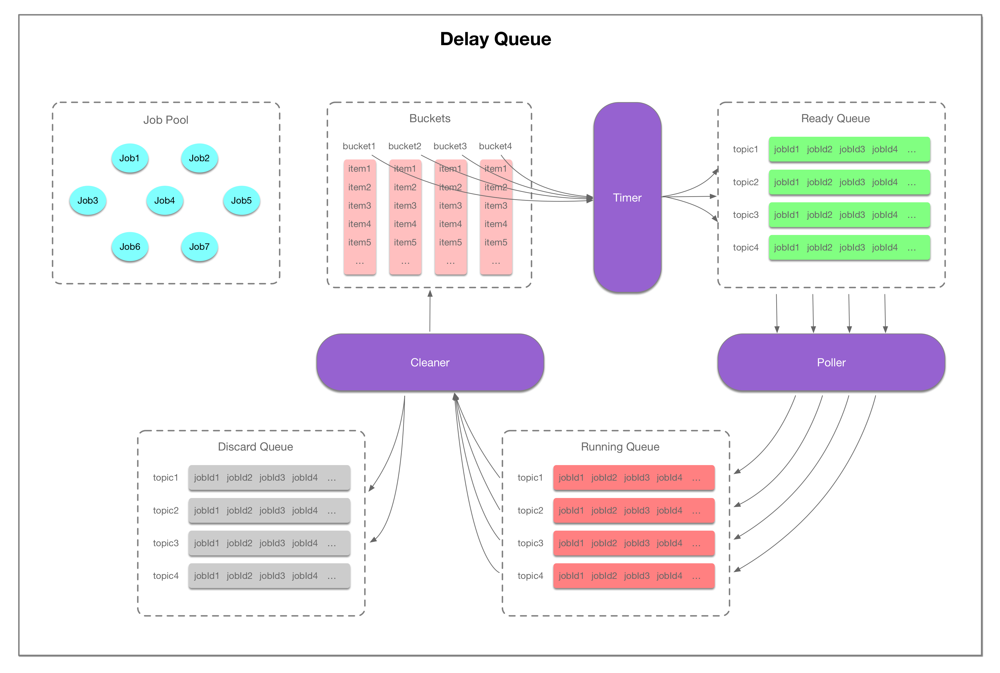

# 延迟队列

我们把客户端需要延时推送的消息称为一个延时任务，任务中包含任务id，任务具体信息，任务需要延迟的时间等。需要有一个任务池来存储任务信息，以任务id作为key，value就是整个任务详情。

因为要在指定的时间推送到期的任务，所以当客户端提交任务的时候，我们根据任务的延迟时间，计算出需要推送的时间，然后放入一个有序的队列，这个队列就是按任务到期时间从小到大排列的。有一个线程轮询扫描该队列，每次从队列中取出前几个任务，并判断是否已经到期，到期的就放到一个就绪队列，并从有序任务队列中删除。

客户端轮询拉取已到期的任务。从就绪队列拿任务时，是阻塞poll，只有当队列中有已就绪的任务或poll超时才会返回。需要考虑的一种情况是，如果从就绪队列取出任务后，服务端宕机导致消息未返回给客户端，或者客户端拿到消息后还未处理就宕机，就会导致消息丢失。因此我们还需要一个队列用来存储从就绪队列中取出来的任务，只有当客户端已经对任务ack或者消息投递超过重试次数时，才从该队列中删除该任务，我们称这个队列为运行时队列，即存储客户端正在执行的任务的队列。

对于投递超过重试次数，且客户端还未ack的任务，可能此时客户端一直处于宕机状态，最好也把这些任务放入一个丢弃队列，方便后续排查问题。因此还需要有一个线程专门来扫描运行时队列，判断客户端是否已经ack或是否超过重试次数，如果客户端未ack且未超过重试次数，则重新放入有序任务队列，在ttr时间后会被重新放入就绪队列。如果已超过重试次数，则放入丢弃队列。

