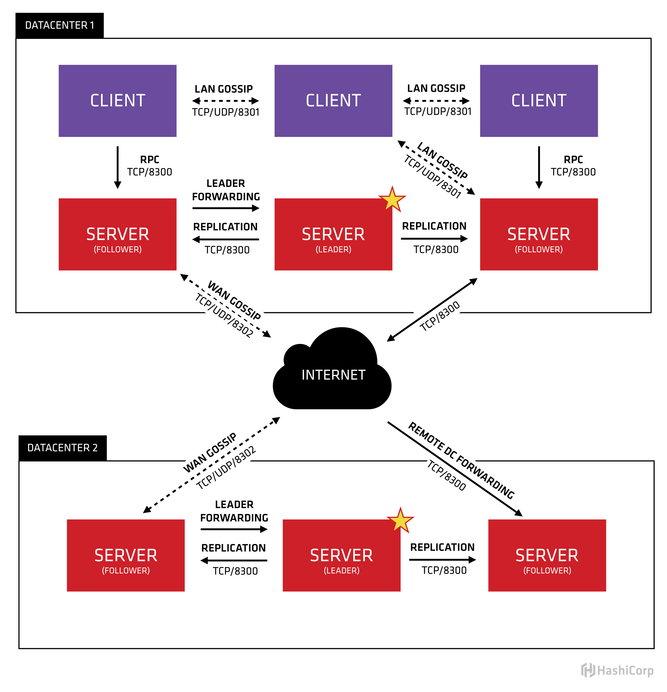

# consul

[Consul vs. zookeeper, doozerd, etcd](https://www.consul.io/intro/vs/zookeeper.html)

## consul 学习

- **Client**：表示 Consul 客户端模式，是 Consul 节点的一种模式，所有注册到 Client 节点的服务会被转发到 Server 。本身无状态不持久化如何数据。Client 通过 HTTP、DNS、GRPC 接口请求转发给局域网内的服务端集群。
- **Server**：表示 Consul 的服务端模式， Server 功能和 Client 都一样，不同的是 Server 持久化数据到本地。在局域网内与本地 Client 通讯，通过广域网与其他数据中心通讯。每个数据中心的 Server 数量推荐为 3 个或是 5 个。
- **Server-Leader** ：表示这个 Server 是它们的老大，它和其它 Server 不一样的一点是，它需要负责同步注册的信息给其它的 Server 节点，同时也要负责各个节点的健康监测。如果 Leader 宕机了，通数据中心的所有 Server 内部会使用 [`Raft`](https://www.jdon.com/artichect/raft.html) 算法来在其中选取一个 Leader 出来。
- **Agent** ：Agent 是 Consul 的核心进程，Agent 的工作是维护成员关系信息、注册服务、健康检查、响应查询等等。Consul 集群的每一个节点都必须运行 agent 进程。

下图是consul以数据中心维度的架构图，图中的SERVER是consul服务端高可用集群，CLIENT是consul客户端。consul客户端不保存数据，客户端将接收到的请求转发给响应的Server端。Server之间通过局域网或广域网通信实现数据一致性。每个Server或Client都是一个consul agent，或者说server和client只是agent所扮演的不同角色罢了。



从上图可知，consul使用gossip协议管理成员关系、广播消息到整个集群。

Consul利用两个不同的gossip pool。我们分别把他们称为局域网池(LAN Gossip Pool)或广域网池(WAN Gossip Pool)。每个Consul数据中心（Datacenter）都有一个包含所有成员（Server和Client）的LAN gossip pool。

**跨数据中心使用  `WAN GOSSIP`，同数据中心使用 `LAN GOSSIP`**

## 基于 docker 部署 consul 集群

### consul 基本配置

```bash
docker run consul agent --help
```

> Usage: consul agent [options]
>
>   Starts the Consul agent and runs until an interrupt is received. The
>   agent represents a single node in a cluster.
>
> HTTP API Options
>
>   -datacenter=<value>
>      Datacenter of the agent.
>
> Command Options
>
>   -advertise=<value>
>      Sets the advertise address to use.
>
>   -advertise-wan=<value>
>      Sets address to advertise on WAN instead of -advertise address.
>
>   -allow-write-http-from=<value>
>      Only allow write endpoint calls from given network. CIDR format,
>      can be specified multiple times.
>
>   -alt-domain=<value>
>      Alternate domain to use for DNS interface.
>
>   -bind=<value>
>      Sets the bind address for cluster communication.
>
>   -bootstrap
>      Sets server to bootstrap mode.
>
>   -bootstrap-expect=<value>
>      Sets server to expect bootstrap mode.
>
>   -check_output_max_size=<value>
>      Sets the maximum output size for checks on this agent
>
>   -client=<value>
>      Sets the address to bind for client access. This includes RPC, DNS,
>      HTTP, HTTPS and gRPC (if configured).
>
>   -config-dir=<value>
>      Path to a directory to read configuration files from. This
>      will read every file ending in '.json' as configuration in this
>      directory in alphabetical order. Can be specified multiple times.
>
>   -config-file=<value>
>      Path to a file in JSON or HCL format with a matching file
>      extension. Can be specified multiple times.
>
>   -config-format=<string>
>      Config files are in this format irrespective of their extension.
>      Must be 'hcl' or 'json'
>
>   -data-dir=<value>
>      Path to a data directory to store agent state.
>
>   -default-query-time=<value>
>      the amount of time a blocking query will wait before Consul will
>      force a response. This value can be overridden by the 'wait' query
>      parameter.
>
>   -dev
>      Starts the agent in development mode.
>
>   -disable-host-node-id
>      Setting this to true will prevent Consul from using information
>      from the host to generate a node ID, and will cause Consul to
>      generate a random node ID instead.
>
>   -disable-keyring-file
>      Disables the backing up of the keyring to a file.
>
>   -dns-port=<value>
>      DNS port to use.
>
>   -domain=<value>
>      Domain to use for DNS interface.
>
>   -enable-local-script-checks
>      Enables health check scripts from configuration file.
>
>   -enable-script-checks
>      Enables health check scripts.
>
>   -encrypt=<value>
>      Provides the gossip encryption key.
>
>   -grpc-port=<value>
>      Sets the gRPC API port to listen on (currently needed for Envoy xDS
>      only).
>
>   -hcl=<value>
>      hcl config fragment. Can be specified multiple times.
>
>   -http-port=<value>
>      Sets the HTTP API port to listen on.
>
>   -https-port=<value>
>      Sets the HTTPS API port to listen on.
>
>   -join=<value>
>      Address of an agent to join at start time. Can be specified
>      multiple times.
>
>   -join-wan=<value>
>      Address of an agent to join -wan at start time. Can be specified
>      multiple times.
>
>   -log-file=<value>
>      Path to the file the logs get written to
>
>   -log-json
>      Output logs in JSON format.
>
>   -log-level=<value>
>      Log level of the agent.
>
>   -log-rotate-bytes=<value>
>      Maximum number of bytes that should be written to a log file
>
>   -log-rotate-duration=<value>
>      Time after which log rotation needs to be performed
>
>   -log-rotate-max-files=<value>
>      Maximum number of log file archives to keep
>
>   -max-query-time=<value>
>      the maximum amount of time a blocking query can wait before Consul
>      will force a response. Consul applies jitter to the wait time. The
>      jittered time will be capped to MaxQueryTime.
>
>   -node=<value>
>      Name of this node. Must be unique in the cluster.
>
>   -node-id=<value>
>      A unique ID for this node across space and time. Defaults to a
>      randomly-generated ID that persists in the data-dir.
>
>   -node-meta=<key:value>
>      An arbitrary metadata key/value pair for this node, of the format
>      `key:value`. Can be specified multiple times.
>
>   -non-voting-server
>      (Enterprise-only) DEPRECATED: -read-replica should be used instead
>
>   -pid-file=<value>
>      Path to file to store agent PID.
>
>   -primary-gateway=<value>
>      Address of a mesh gateway in the primary datacenter to use to
>      bootstrap WAN federation at start time with retries enabled. Can be
>      specified multiple times.
>
>   -protocol=<value>
>      Sets the protocol version. Defaults to latest.
>
>   -raft-protocol=<value>
>      Sets the Raft protocol version. Defaults to latest.
>
>   -read-replica
>      (Enterprise-only) This flag is used to make the server not
>      participate in the Raft quorum, and have it only receive the data
>      replication stream. This can be used to add read scalability to
>      a cluster in cases where a high volume of reads to servers are
>      needed.
>
>   -recursor=<value>
>      Address of an upstream DNS server. Can be specified multiple times.
>
>   -rejoin
>      Ignores a previous leave and attempts to rejoin the cluster.
>
>   -retry-interval=<value>
>      Time to wait between join attempts.
>
>   -retry-interval-wan=<value>
>      Time to wait between join -wan attempts.
>
>   -retry-join=<value>
>      Address of an agent to join at start time with retries enabled. Can
>      be specified multiple times.
>
>   -retry-join-wan=<value>
>      Address of an agent to join -wan at start time with retries
>      enabled. Can be specified multiple times.
>
>   -retry-max=<value>
>      Maximum number of join attempts. Defaults to 0, which will retry
>      indefinitely.
>
>   -retry-max-wan=<value>
>      Maximum number of join -wan attempts. Defaults to 0, which will
>      retry indefinitely.
>
>   -segment=<value>
>      (Enterprise-only) Sets the network segment to join.
>
>   -serf-lan-allowed-cidrs=<value>
>      Networks (eg: 192.168.1.0/24) allowed for Serf LAN. Can be
>      specified multiple times.
>
>   -serf-lan-bind=<value>
>      Address to bind Serf LAN listeners to.
>
>   -serf-lan-port=<value>
>      Sets the Serf LAN port to listen on.
>
>   -serf-wan-allowed-cidrs=<value>
>      Networks (eg: 192.168.1.0/24) allowed for Serf WAN (other
>      datacenters). Can be specified multiple times.
>
>   -serf-wan-bind=<value>
>      Address to bind Serf WAN listeners to.
>
>   -serf-wan-port=<value>
>      Sets the Serf WAN port to listen on.
>
>   -server
>      Switches agent to server mode.
>
>   -server-port=<value>
>      Sets the server port to listen on.
>
>   -syslog
>      Enables logging to syslog.
>
>   -ui
>      Enables the built-in static web UI server.
>
>   -ui-content-path=<value>
>      Sets the external UI path to a string. Defaults to: /ui/
>
>   -ui-dir=<value>
>      Path to directory containing the web UI resources.

### tutorial

```yaml
version: '3'

services:

  # 初始化 consul 并将初始化的脚本写入到 consul-agent 以便于其他 agent 使用
  consul-agent-1: &consul-agent
    image: consul:latest
    networks:
      - consul-demo
    command: "agent -retry-join consul-server-bootstrap -client 0.0.0.0"

  consul-agent-2:
    <<: *consul-agent

  consul-agent-3:
    <<: *consul-agent

  # 初始化 consul server，并指定使用 consul-server-bootstrap 作为主
  consul-server-1: &consul-server
    <<: *consul-agent
    command: "agent -server -retry-join consul-server-bootstrap -client 0.0.0.0"

  consul-server-2:
    <<: *consul-server

  consul-server-bootstrap:
    <<: *consul-agent
    ports:
      - "8400:8400"
      - "8500:8500"
      - "8600:8600"
      - "8600:8600/udp"
    command: "agent -server -bootstrap-expect 3 -ui -client 0.0.0.0"

networks:
  consul-demo:
```

在上面的 `docker-compose.yml` 中，我们初始化了 `consul-agent-1`， `consul-agent-2`， `consul-agent-3` 三个 client，并通过 `retry-join consul-server-bootstrap` 将三个 agent 加入到 `consul-server-bootstrap`。

同时还初始化了 `consul-server-1`，`consul-server-2`,`consul-server-bootstrap`，三个 server，同时通过 `-bootstrap` 将consul-server-bootstrap 设置为主。


