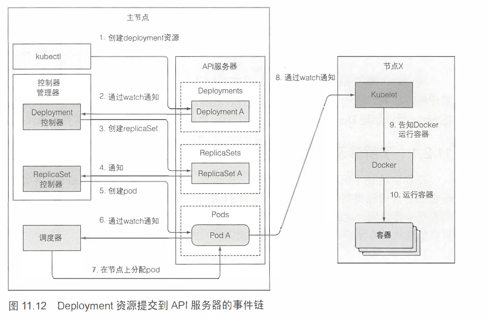

## 11. 了解 kubernetes 的机理


### 11.1 了解架构

> - control plane : The control plane's components make global decisions about the cluster (for example, scheduling), as well as detecting and responding to cluster events (for example, starting up a new [pod](https://kubernetes.io/docs/concepts/workloads/pods/) when a deployment's `replicas` field is unsatisfied).
>   - etcd
>   - api server
>   - scheduler
>   - controller manager
> - node : Node components run on every node, maintaining running pods and providing the Kubernetes runtime environment.
>   - kubelet
>   - Kube-proxy
> - addons
>   - DNS
>   - Web UI(dashboard)
>   - Container Resource Monitoring
>   - Cluster-level Logging

#### 11.1.1 kubernetes 组件的分布式特性


##### 组件如何通信

> 1. kubernetes 系统组件间只能通过 api server 通信，他们不会直接通信；
> 2. api server 是和 etcd 通信的唯一组件；

##### 单组件运行多实例

> 1. node 上的节点运行在一台机器上；
> 2. control plane 是分布式的；
> 3. etcd 和 api server 多实例并行工作；
> 4. scheduler 和 controller manager 单实例工作；

##### 组件是如何运行的

>1. Kube-porxy 可以直接部署在系统上或者作为pod来运行；
>2. kubelet 是唯一一直作为常规系统组件来运行的组件，它把其他的组件作为 pod 来运行；

```bash
k get pods -o custom-columns=POD:metadata.name,NODE:spec.nodeName --sort-by spec.nodeName -n kube-system
#POD                                NODE
#storage-provisioner                <none>
#coredns-74ff55c5b-qh8k5            <none>
#etcd-minikube                      minikube
#kube-proxy-vzc59                   minikube
#kindnet-smbws                      minikube
#kube-controller-manager-minikube   minikube
#kube-scheduler-minikube            minikube
#kube-apiserver-minikube            minikube
#kube-proxy-s2q4s                   minikube-m02
#kindnet-n2gn6                      minikube-m02
#kube-proxy-9srtz                   minikube-m03
#kindnet-cpvwn                      minikube-m03
```

##### 确保etcd集群一致性

> - 一致性算法要求集群大部分节点参与才能进行到下一个状态。
>   - 如果集群分裂为两个不互联的、节点数相同的节点组，两个组的状态不可能不一致，因为要从之前的状态变化到新的状态，需要有过半的节点参与状态变更。
>   - 如果一个组包含了大部分节点，那么另外一组只有少量节点成员。第一个组就可以更改集群状态，后者则不可以。
>   - 当两个组重新恢复连接，第二个节点会更新成为第一个组的节点的状态。

#### 11.1.3 api server 做了什么


> - 通过认证插件认证客户端
> - 通过授权插件授权客户端
> - 通过准入控制插件验证 AND/OR 修改资源请求

#### 11.1.4 api server 如何通知客户端资源变更


```bash
k get pods -o wide --watch

#打印变更的 yaml
k get pod -o yaml --watch
```

#### 11.1.5 shceudler

> 1. scheduler 利用 api server 的监听机制等待新创建的 pod，然后给每个新的、没有节点集的 pod 分配节点；
> 2. scheduler 通过 api server 更新 pod 的定义，然后 api server 再通知 kubelet 该 pod 已经被调度到某个节点，这个节点上的 kubelet 就创建并运行 pod 的容器；

##### 默认的调度算法


##### 查找可用节点

> scheduler 会给每个节点下发一组配置好的预测函数，并根据预测函数来判断节点是否可用。

#### 11.1.6 介绍 controller manager 中运行的控制器

> 控制器包括：
>
> - ReplicationController
> - ReplicaSet、DaemonSet 以及 Job 控制器
> - Deployment 控制器
> - Node 控制器
> - Service 控制器
> - Endpoints 控制器
> - Namespace 控制器
> - PersistentVolume 控制器
> - ...

> rc 实际上不会去运行 pod。而是通过创建新的 pod 清单，发布到 api server，再由 api server 通知 schduler 和 kubelet 来运行 pod。


#### 11.1.7 kubelet 做了什么

> kubelet 就是负责所有运行在 node 上的内容的组件：
>
> 1. 在 api server 中创建一个 Node 资源来注册该节点，然后持续监控 api server 是否把 pod 分配给自己，然后启动 pod 容器；
> 2. 持续监控运行的容器，向 api server 报告他们的状态、事件和资源消耗；
> 3. 运行容器存活探针，当探针报错时会重启容器；

#### 11.1.8 kubernetes service proxy 的作用

> kube-proxy 确保客户端可以通过 kubernetes API 连接到我们定义的服务；

#### 11.1.9 插件

##### DNS server 如何工作

> DNF server pod 通过 `kube-dns` 服务对外暴露，使得该 pod 能够轻松的通过名称查询到服务，甚至是无头服务 pod 的 IP 地址；服务的IP地址在集群每个容器的 /etc/reslv.conf 文件的 nameserver 中定义。
>
> `kube-dns` pod 利用 api server 的监控机制来订阅 service 和 endpoint 的变动，以及 DNS 记录的变更。

##### ingress 控制器如何工作

> ingress 运行一个反向代理服务器，根据集群中定义的 ingress、service 以及 endpoint 资源来配置该控制器。
>
> **尽管 ingress 资源 指向一个 service，但是 ingress 会将流量转发到服务的 pod 而经过服务IP。**

### 11.2 控制器如何写作

#### 11.2.1 了解涉及哪些组件


#### 11.2.2 事件链



#### 11.2.3 观察集群事件

```bash
k get events --watch
```

### 11.3 了解运行中的pod是什么

> 暂停容器，Pod infrastructure container 是一个基础容器，它的唯一目的就是保存所有的命名空间。


### 11.4 跨 pod 网络

> 网络是由系统管理员或者 Container Network Interface(CNI) 插件建立的。

#### 11.4.1 网络应该是什么样的

#### 11.4.3 引入容器网络接口

> CNI 插件
>
> - Calico
> - Flannel
> - Romana
> - Weave Net
> - 其他

### 11.5 服务是如何实现的

#### 11.5.1 引入 kube-proxy

> 1. IP 地址是虚拟的，没有被分配给任何网络接口。
> 2. kube-proxy 通过 iptables（默认模式）进行代理

#### 11.5.2 kube-proxy 如何使用 iptables

> 1. 当 api server 创建一个服务时，虚拟IP地址会立马分配给它；
> 2. kube-proxy 监听 api server 并发现有一个新服务已经被创建了；
> 3. kube-proxy 监听 api server 观察 endpoints 的变化；
> 4. kube-proxy 建立一些 iptables 规则，确保准备发送到 service 的包目的地址被修改后发送到对应的 pod；

> kube-proxy 拦截进来的请求，发现是在请求 service 的时候。把请求转发到对应的 pod；
>
> 因为 kube-proxy 监听了 api server，所以他是能做到这些的。


