## Kubernetes in Actions

## question

1. 因为 rc 是和 label 绑定的，那么 kubernetes 集群中是否会存在两个 label 一模一样的 pod？
2. 为什么需要使用 endpoint？
3. ClusterIP、PodId、ExternalIP 的区别？

### ClusterIP、PodId、ExternalIP 的区别？

[k8s之PodIP、ClusterIP和ExternalIP](https://www.cnblogs.com/embedded-linux/p/12657128.html)

## references

- [Kubernetes Components](https://kubernetes.io/docs/concepts/overview/components/)
- [Glossary - a comprehensive, standardized list of Kubernetes terminology](https://kubernetes.io/docs/reference/glossary/)
- [Kubernetes的三种外部访问方式：NodePort、LoadBalancer 和 Ingress](http://dockone.io/article/4884)

## roadmap

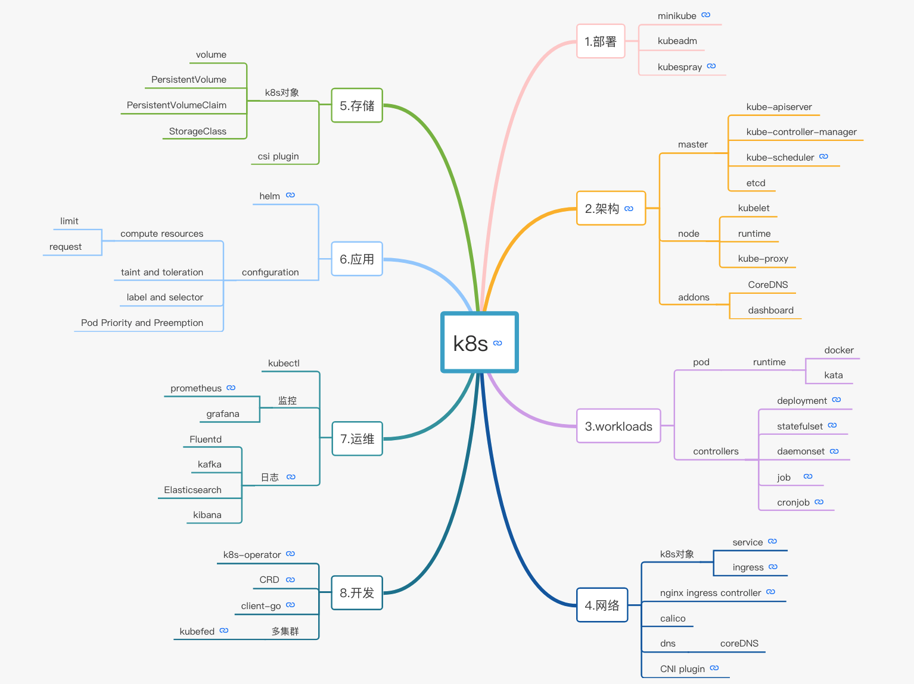

## components-of-kubernetes


## minikube

```bash
minikube start 
	--cpus=2
	--memory=2048mb
	--registry-mirror=https://t65rjofu.mirror.aliyuncs.com
	--driver=virtualbox
	--nodes=3
```

## 1. Kubernetes 介绍

1. Kubernetes 可以被当做集群的一个操作系统来看待；
2. 当 `API server` 处理应用的描述时，`scheduler` 调度指定组的容器到可用的工作节点上，调度是基于每组所需的计算资源，以及调度时每个节点未分配的资源。然后，那些节点上的 `Kubelet` 指示容器运行时（例如Docker ）拉取所需的镜像并运行容器。

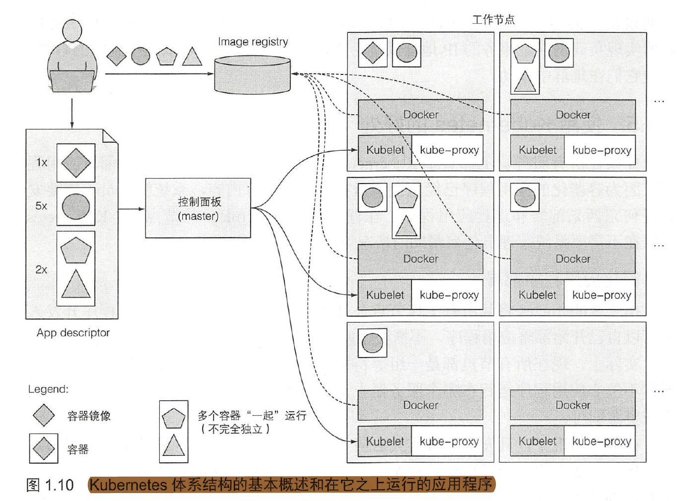

## 2. 开始使用 kubernetes 和 docker

```bash
docker run busybox echo ”Hello world”
```

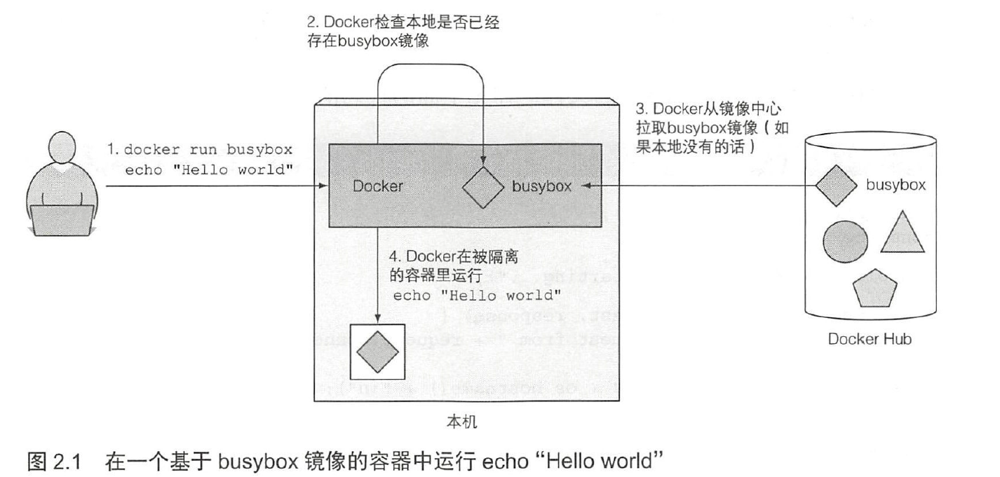

#### 2.1.2 创建一个简单的Node.js 应用

```javascript
const http = require('http');
const os   = require('os');

console.log('Kubia server starting...')

var handler = function(request, response) {
	console.log("Received request from " + request.connection.remoteAddress)
	response.writeHead(200)
	response.end("You've hit " + os.hostname() + "\n")
};

var www = http.createServer(handler);
www.listen(8080);
```

#### 构建容器镜像

> 在这个例子中，我们使用了 `node:7` 作为基础镜像，因为对于 node 应用来说 node 包含了运行应用所需的一切，所以我们无需使用：
>
> app.js
>
> node
>
> linux
>
> 这种层级的镜像结构。

```dockerfile
FROM node:7

ADD app.js /app.js
ENTRYPOINT ["node", "app.js"]
```

```bash
# 打包镜像
# 在当前目录构建一个建 kubia 的镜像，docker 会在当前目录寻找 Dockerfile 然后构建 docker 镜像。
docker build -t kubia .

docker images kubia
# REPOSITORY   TAG       IMAGE ID       CREATED              SIZE
# kubia        latest    4369322ecec2   About a minute ago   660MB

# 运行镜像
docker run --name kubia-container -p 8080:8080 -d kubia

# 复制 kubia 镜像，并使用 luksa/kubia 作为名字 
docker tag kubia luksa/kubia
```

#### 配置 kubernetes 集群

```bash
# 启动 minikube 虚拟机
minikube start
#😄  minikube v1.21.0 on Darwin 10.15.7
#✨  Using the docker driver based on existing profile
#👍  Starting control plane node minikube in cluster minikube
#🚜  Pulling base image ...
#🏃  Updating the running docker "minikube" container ...
#🐳  Preparing Kubernetes v1.20.7 on Docker 20.10.7 ...
#🔎  Verifying Kubernetes components...
#    ▪ Using image kubernetesui/metrics-scraper:v1.0.4
#    ▪ Using image gcr.io/k8s-minikube/storage-provisioner:v5
#    ▪ Using image kubernetesui/dashboard:v2.1.0
#🌟  Enabled addons: storage-provisioner, default-storageclass, dashboard
#🏄  Done! kubectl is now configured to use "minikube" cluster and "default" namespace by default

# 启动3个虚拟节点
minikube start --nodes=3
# 下面的命令会指定 profile 为 multinode-demo
#minikube start --nodes=3 -p multinode-demo

# 验证集群是否正常工作
kubectl cluster-info

# 列出集群节点
kubectl get nodes
# NAME                  STATUS     ROLES                  AGE     VERSION
# multinode-demo1       Ready      control-plane,master   2m24s   v1.20.7
# multinode-demo1-m02   Ready      <none>                 72s     v1.20.7
# multinode-demo1-m03   NotReady   <none>                 9s      v1.20.7

# 查看节点状态
kubectl describe node multinode-demo1
```

#### 在 kubernetes 上部署第一个应用

> 一个 pod 是一组紧密相关的容器，他们总是运行在同一个工作节点上，以及同一个 linux namespace。

```bash
# --image=luksa/kubia 显示的是指定要运行的容器镜像，
# --port=8080 告诉 kubernetes 应用正在监听 8080
kubectl run kubia --image=luksa/kubia --port=8080

# 列出 pod
kubectl get pods
# NAME    READY   STATUS    RESTARTS   AGE
# kubia   1/1     Running   0          5m41s

# Now kubectl run command creates standalone pod without ReplicationController. 
kubectl expose pod kubia --type=LoadBalancer --name kubia-http

# Connect to LoadBalancer services
minikube tunnel
# 🏃  Starting tunnel for service kubia-http.

kubectl get services
# NAME         TYPE           CLUSTER-IP      EXTERNAL-IP   PORT(S)          AGE
# kubernetes   ClusterIP      10.96.0.1       <none>        443/TCP          150m
# kubia-http   LoadBalancer   10.101.223.38   <pending>     8080:32161/TCP   96s
```

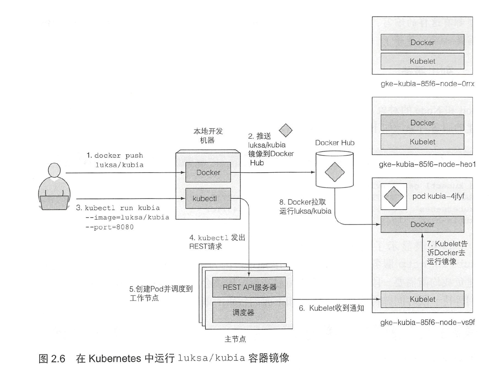

## 3. pod : 运行于 kubernetes 中的容器

### 3.1 介绍 pod

> 为何需要 pod 这种容器？
>
> 为何不直接使用容器？
>
> 为何甚至需要同时运行多个容器？难道不能把所有的进程都放在一个容器中吗？

容器被设计为每个容器只运行一个进程（除非进程自己产生新的进程）。如果在单个容器中运行多个不相关的进程，那么保持所有的进程运行、管理他们的日志将会是我们的责任。当容器崩溃时，容器内包含的进程全部输出到标准输出中，此时我们很难确定每个进程分别记录了什么。

由于不能将多个进程放在一个单独的容器中，所以我们需要另一种更高级的结构来将容器绑定到一起，并将他们作为一个单元进程管理。

**容器之间是完全隔离的，我们的期望是隔离容器组而不是单个容器，并且让每个容器组内的容器共享一些资源，而不是全部。kubernetes 通过配置 docker 让一个 pod 内的所有容器共享相同的linux namespace，而不是每个容器都有自己的一组 namespace。**

一个 pod 中的容器运行于相同的 network namespace，因此他们享有相同的ip和 port。因此对于在同一个 pod 下的多个进程不能绑定到相同的端口。

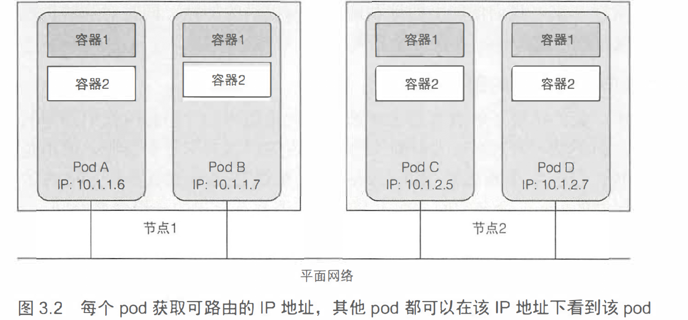

同一个 kubernetes 集群的 pod 在同一个 **共享网络地址空间**，这意味着每个 pod 都可以通过其他 pod 的 ip 地址来实现互相访问。

##### 将多层应用分散到多个pod中

> 对于一个有前端服务和后端数据库组成的多层应用程序，应该配置成单个pod还是多个pod呢？

如果我们放到一个 pod 中，那么意味着前端和后端的服务永远只能在一台机器上执行，无法充分的提高基础架构的使用率。

另外，kubernetes 的扩缩容也是基于 pod 的，前端和后端的服务放在一个 pod 下意味着我们无法针对前端服务以及后端服务的需求进行扩缩容。

##### 何时在 pod 中使用多个容器

> 使用单个 pod 包含多个容器的主要原因是：应用可能由一个主进程和一个或者多个辅助进程组成。

例如在微服务架构中的，主进程是业务逻辑，辅助进程是 envoy（或者其他网关）。

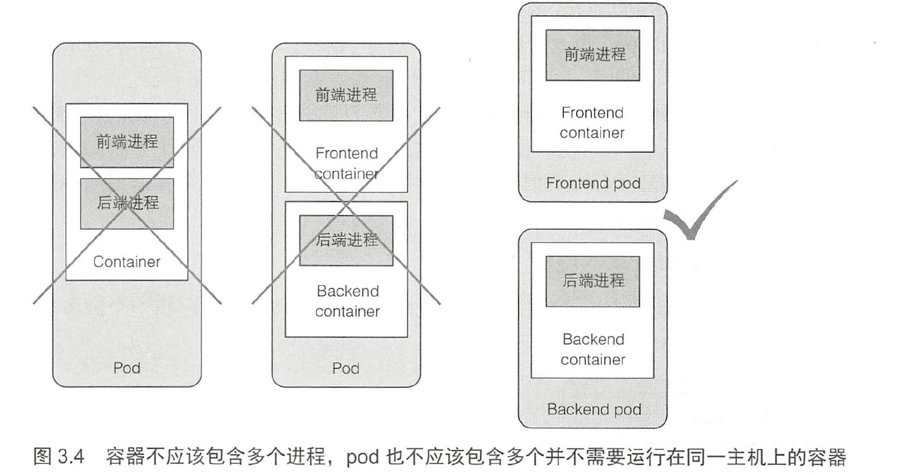

### 3.2 以 yaml 或 json 描述文件创建 pod

[kubernetes docs](https://kubernetes.io/docs/reference/)

```bash
# 使用 -o yaml 选项获取 pod 的整个定义 yaml
kubectl get po kubia -o yaml
```

```yaml
# yaml 描述文件所使用的 kubernetes API 版本
apiVersion: v1
# kubernetes 对象资源类型
kind: Pod
# pod 元数据（名称、标签和注解等）
metadata:
  creationTimestamp: "2021-10-27T07:33:55Z"
  labels:
    run: kubia
  managedFields:
  - apiVersion: v1
    fieldsType: FieldsV1
    fieldsV1:
      f:metadata:
        f:labels:
          .: {}
          f:run: {}
      f:spec:
        f:containers:
          k:{"name":"kubia"}:
            .: {}
            f:image: {}
            f:imagePullPolicy: {}
            f:name: {}
            f:ports:
              .: {}
              k:{"containerPort":8080,"protocol":"TCP"}:
                .: {}
                f:containerPort: {}
                f:protocol: {}
            f:resources: {}
            f:terminationMessagePath: {}
            f:terminationMessagePolicy: {}
        f:dnsPolicy: {}
        f:enableServiceLinks: {}
        f:restartPolicy: {}
        f:schedulerName: {}
        f:securityContext: {}
        f:terminationGracePeriodSeconds: {}
    manager: kubectl-run
    operation: Update
    time: "2021-10-27T07:33:55Z"
  - apiVersion: v1
    fieldsType: FieldsV1
    fieldsV1:
      f:status:
        f:conditions:
          k:{"type":"ContainersReady"}:
            .: {}
            f:lastProbeTime: {}
            f:lastTransitionTime: {}
            f:status: {}
            f:type: {}
          k:{"type":"Initialized"}:
            .: {}
            f:lastProbeTime: {}
            f:lastTransitionTime: {}
            f:status: {}
            f:type: {}
          k:{"type":"Ready"}:
            .: {}
            f:lastProbeTime: {}
            f:lastTransitionTime: {}
            f:status: {}
            f:type: {}
        f:containerStatuses: {}
        f:hostIP: {}
        f:phase: {}
        f:podIP: {}
        f:podIPs:
          .: {}
          k:{"ip":"10.244.2.2"}:
            .: {}
            f:ip: {}
        f:startTime: {}
    manager: kubelet
    operation: Update
    time: "2021-10-27T07:35:16Z"
  name: kubia
  namespace: default
  resourceVersion: "1110"
  uid: 29ed7476-3fff-4ddb-93c8-90a1fa81fda9
# pod 规格/内容（pod 的容器列表、volumn 等）
spec:
  containers:
  - image: luksa/kubia
    imagePullPolicy: Always
    name: kubia
    ports:
    - containerPort: 8080
      protocol: TCP
    resources: {}
    terminationMessagePath: /dev/termination-log
    terminationMessagePolicy: File
    volumeMounts:
    - mountPath: /var/run/secrets/kubernetes.io/serviceaccount
      name: default-token-zmmm2
      readOnly: true
  dnsPolicy: ClusterFirst
  enableServiceLinks: true
  nodeName: minikube-m03
  preemptionPolicy: PreemptLowerPriority
  priority: 0
  restartPolicy: Always
  schedulerName: default-scheduler
  securityContext: {}
  serviceAccount: default
  serviceAccountName: default
  terminationGracePeriodSeconds: 30
  tolerations:
  - effect: NoExecute
    key: node.kubernetes.io/not-ready
    operator: Exists
    tolerationSeconds: 300
  - effect: NoExecute
    key: node.kubernetes.io/unreachable
    operator: Exists
    tolerationSeconds: 300
  volumes:
  - name: default-token-zmmm2
    secret:
      defaultMode: 420
      secretName: default-token-zmmm2
# pod 机器内部容器的详细状态
status:
  conditions:
  - lastProbeTime: null
    lastTransitionTime: "2021-10-27T07:33:55Z"
    status: "True"
    type: Initialized
  - lastProbeTime: null
    lastTransitionTime: "2021-10-27T07:35:16Z"
    status: "True"
    type: Ready
  - lastProbeTime: null
    lastTransitionTime: "2021-10-27T07:35:16Z"
    status: "True"
    type: ContainersReady
  - lastProbeTime: null
    lastTransitionTime: "2021-10-27T07:33:55Z"
    status: "True"
    type: PodScheduled
  containerStatuses:
  - containerID: docker://56a21a88860f2a9afe9a4eaf66ae69f20eac03d238ae8d11738c052cdf5e1ae6
    image: luksa/kubia:latest
    imageID: docker-pullable://luksa/kubia@sha256:3f28e304dc0f63dc30f273a4202096f0fa0d08510bd2ee7e1032ce600616de24
    lastState: {}
    name: kubia
    ready: true
    restartCount: 0
    started: true
    state:
      running:
        startedAt: "2021-10-27T07:35:16Z"
  hostIP: 192.168.49.4
  phase: Running
  podIP: 10.244.2.2
  podIPs:
  - ip: 10.244.2.2
  qosClass: BestEffort
  startTime: "2021-10-27T07:33:55Z"
```

##### kubia-manual.yaml

> 下面的 yaml 描述了如下的一个 pod：
>
> 1. 使用 kubernetes v1 的 api
> 2. 资源类型是一个 pod
> 3. 容器的名称是 kubia-manual
> 4. pod 基于名为 luksa/kubia 的镜像组成，监听端口 8080 

```yaml
apiVersion: v1
kind: Pod
metadata:
  name: kubia-manual
spec:
  containers:
    - image: luksa/kubia
      name: kubia
      ports:
        - containerPort: 8080
          protocol: TCP
```

```bash
# 解释 pod 的字段
k explain pods
#KIND:     Pod
#VERSION:  v1
#
#DESCRIPTION:
#     Pod is a collection of containers that can run on a host. This resource is
#     created by clients and scheduled onto hosts.
#
#FIELDS:
#   apiVersion     <string>
#     APIVersion defines the versioned schema of this representation of an
#     object. Servers should convert recognized schemas to the latest internal
#     value, and may reject unrecognized values. More info:
#     https://git.k8s.io/community/contributors/devel/sig-architecture/api-conventions.md#resources
#
#   kind     <string>
#     Kind is a string value representing the REST resource this object
#     represents. Servers may infer this from the endpoint the client submits
#     requests to. Cannot be updated. In CamelCase. More info:
#     https://git.k8s.io/community/contributors/devel/sig-architecture/api-conventions.md#types-kinds
#
#   metadata <Object>
#     Standard object's metadata. More info:
#     https://git.k8s.io/community/contributors/devel/sig-architecture/api-conventions.md#metadata
#
#   spec     <Object>
#     Specification of the desired behavior of the pod. More info:
#     https://git.k8s.io/community/contributors/devel/sig-architecture/api-conventions.md#spec-and-status
#
#   status   <Object>
#     Most recently observed status of the pod. This data may not be up to date.
#     Populated by the system. Read-only. More info:
#     https://git.k8s.io/community/contributors/devel/sig-architecture/api-conventions.md#spec-and-status

# 解释 pods 下的 spec
k explain pods.spec
```

#### 3.2.3 使用 kubectl create 来创建 pod

```bash
# -f 表示资源文件
k create -f kubia-manual.yaml

k get pods
#NAME           READY   STATUS    RESTARTS   AGE
#kubia          1/1     Running   0          79m
#kubia-manual   1/1     Running   0          37s
```

> 我们通过 `kubia-manual.yaml` 创建的 pod **kubia-manual**，和我们最开始手动创建的 **kubia**，两个都绑定到了 8080 端口。但是我们之前提到的，不同的 pod 之间是在不同的 network namespace 下，所以他们不会冲突。

```bash
# 查看 pod 日志
kubectl logs kubia-manual

# 如果 pod 中有其他容器，可以通过 -c 指定容器
kubectl logs kubia-manual -c kubia
```

#### 3.2.5 向 pod 发送请求

前面我们使用了 `kubectl expose` 命令创建了一个 service，以便于在外部访问 pod。

除此之外，我们可以通过 **端口转发** 来实现这个功能。

```bash
# 将本机器的 8888 端口转发到 kubia-manual 的 8080 端口
kubectl port-forward kubia-manual 8888:8080
```

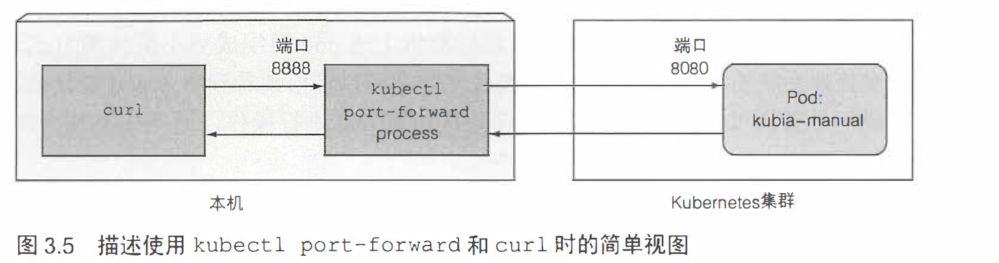

### 3.3 使用标签组织 pod

> 在实际的应用中，我们需要有一个简单的方法来区分所有的 pod。
>
> 例如，在灰度发布中，我们需要知道哪些 pod 是已经灰度的，哪些是没有灰度的。

#### 3.3.1 介绍标签

> 1. pod 可以组织 kubernetes 的所有资源；
> 2. pod 是可以附加到资源的任意键值对；

假设我们现在的 pod 有两个标签：

1. app
2. rel：显示应用程序版本是 stable、beta 还是 canary。

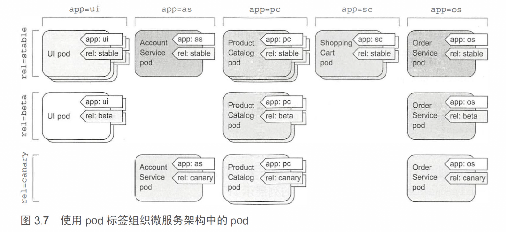

#### 3.3.2 创建pod时指定标签

```yaml
apiVersion: v1
kind: Pod
metadata:
  name: kubia-manual-with-labels
  # 指定标签
  labels:
    creation_method: manual
    env: prod
spec:
  containers:
    - image: luksa/kubia
      name: kubia
      ports:
        - containerPort: 8080
          protocol: TCP
```

```bash
# 创建带 labels 的 pod
k create -f kubia-manual-with-labels.yaml

k get po --show-labels
#NAME                       READY   STATUS    RESTARTS   AGE     LABELS
#kubia                      1/1     Running   0          135m    run=kubia
#kubia-manual               1/1     Running   0          57m     <none>
#kubia-manual-with-labels   1/1     Running   0          2m11s   creation_method=manual,env=prod

# -L 将我们感兴趣的标签显示在对应的列中
k get po -L creation_method,env
#NAME                       READY   STATUS    RESTARTS   AGE     CREATION_METHOD   ENV
#kubia                      1/1     Running   0          137m
#kubia-manual               1/1     Running   0          58m
#kubia-manual-with-labels   1/1     Running   0          3m43s   manual            prod

# 使用 selector 过滤
kubectl get pods -l creation_method=manual
#NAME                       READY   STATUS    RESTARTS   AGE
#kubia-manual-with-labels   1/1     Running   0          6m23s
```

#### 3.3.3 修改现有 pod 标签

```bash
# 修改标签
k label po kubia-manual creation_method=manual

kubectl get pods -l creation_method=manual
#NAME                       READY   STATUS    RESTARTS   AGE
#kubia-manual               1/1     Running   0          65m
#kubia-manual-with-labels   1/1     Running   0          10m

# 修改标签时必须增加 --overwrite
k label po kubia-manual-with-labels env=debug --overwrite

k get pods -l env=debug -L creation_method,env
#NAME                       READY   STATUS    RESTARTS   AGE     CREATION_METHOD   ENV
#kubia-manual-with-labels   1/1     Running   0          2m36s   manual            debug
```

#### 3.4 使用标签选择器

```bash
# 选择标签
k get po -l creation_method=manual

# 选择标签 env=deubg
k get po -l env=debug
#NAME                       READY   STATUS    RESTARTS   AGE
#kubia-manual-with-labels   1/1     Running   0          4m47s

# 选择不包含 env 标签的 pod
k get po -l '!env' --show-labels
#NAME           READY   STATUS    RESTARTS   AGE     LABELS
#kubia          1/1     Running   0          5m56s   run=kubia
#kubia-manual   1/1     Running   0          5m45s   <none>
```

- env!=debug
- env in (prd, dev)
- env notin(prd, dev)
- Creation_method=manual,env=debug

#### 3.5 使用标签和选择器来约束 pod 调度

> 当我们希望控制 pod 的调度的时候，我们不会说明 pod 应该被调度到哪个节点上，这会使得我们的应用程序和基础架构强耦合。
>
> 我们应该 **描述应用对节点的需求，使得 kubernetes 选择一些符合这些需求的节点。**
>
> 标签可以附加到 kubernetes 的任意对象上，**这也包括了我们新增加的节点。**

#### 3.5.1 使用标签分类工作节点

```bash
# 查询所有节点
k get nodes --show-labels
#NAME           STATUS   ROLES                  AGE   VERSION   LABELS
#minikube       Ready    control-plane,master   19h   v1.20.7   beta.kubernetes.io/arch=amd64,beta.kubernetes.io/os=linux,gpu=true,kubernetes.io/arch=amd64,kubernetes.io/hostname=minikube,kubernetes.io/os=linux,minikube.k8s.io/commit=76d74191d82c47883dc7e1319ef7cebd3e00ee11,minikube.k8s.io/name=minikube,minikube.k8s.io/updated_at=2021_10_27T15_26_02_0700,minikube.k8s.io/version=v1.21.0,node-role.kubernetes.io/control-plane=,node-role.kubernetes.io/master=
#minikube-m02   Ready    <none>                 25m   v1.20.7   beta.kubernetes.io/arch=amd64,beta.kubernetes.io/os=linux,kubernetes.io/arch=amd64,kubernetes.io/hostname=minikube-m02,kubernetes.io/os=linux
#minikube-m03   Ready    <none>                 25m   v1.20.7   beta.kubernetes.io/arch=amd64,beta.kubernetes.io/os=linux,kubernetes.io/arch=amd64,kubernetes.io/hostname=minikube-m03,kubernetes.io/os=linux

# 为 name=minikube 的节点增加标签 gpu=true
k label nodes minikube gpu=true

k get nodes -l gpu=true
#NAME       STATUS   ROLES                  AGE   VERSION
#minikube   Ready    control-plane,master   19h   v1.20.7
```

#### 3.5.2 将 pod 调度到特定节点

```yaml
apiVersion: v1
kind: Pod
metadata:
  name: kubia-gpu
spec:
  nodeSelector:
    gpu: "true"
  containers:
    - image: luksa/kubia
      name: kubia
```

#### 3.5.3 调度到一个特定节点

> 每个 node 包含一个唯一标签：`kubernetes.io/hostname`

```bash
k get nodes -L kubernetes.io/hostname
#NAME           STATUS   ROLES                  AGE   VERSION   HOSTNAME
#minikube       Ready    control-plane,master   19h   v1.20.7   minikube
#minikube-m02   Ready    <none>                 54m   v1.20.7   minikube-m02
#minikube-m03   Ready    <none>                 53m   v1.20.7   minikube-m03
```

### 3.6 注解 pod

1. 注解也是键值对；
2. 注解不能像标签一样对对象进行分组；
3. 一般来说，新功能的 alpha 和 beta 版本不会向API对象引入任何新的字段，因此使用的是注解而不是字段，一旦确定会引入新的字段并废弃注解；

#### 3.6.1 查找对象的注解

```bash
# 为 kubia-manual 添加注解
k annotate pod kubia-manual mycompany.com/someannotation="foo bar"

k get pods kubia-manual -o yaml | head -n 10
#apiVersion: v1
#kind: Pod
#metadata:
#  annotations:
#    mycompany.com/someannotation: foo bar
#  creationTimestamp: "2021-10-28T02:26:55Z"
#  managedFields:
#  - apiVersion: v1
#    fieldsType: FieldsV1
#    fieldsV1:
```

### 3.7 使用命名空间对资源进行分组

#### 3.7.1 了解对 namespace 的需求

通过 namesapce，我们可以将包含大量组件的复杂系统拆分为更小的不同组，例如我们可以将资源分配为 dev，prd 以及 QA。

#### 3.7.2 发现其他 namespace 以及 pod

```bash
# 查询所有namespace
k get ns
#NAME                   STATUS   AGE
#default                Active   22h
#kube-node-lease        Active   22h
#kube-public            Active   22h
#kube-system            Active   22h
#kubernetes-dashboard   Active   22h

# 查询对应 namespace 下的 pod
k get pods --namespace kube-system
#NAME                               READY   STATUS    RESTARTS   AGE
#coredns-74ff55c5b-klnsq            1/1     Running   1          22h
#etcd-minikube                      1/1     Running   1          22h
#kindnet-dpbdl                      1/1     Running   1          22h
#kindnet-f5sxx                      1/1     Running   1          22h
#kindnet-qn6vb                      1/1     Running   1          22h
#kube-apiserver-minikube            1/1     Running   1          22h
#kube-controller-manager-minikube   1/1     Running   1          22h
#kube-proxy-gvnp2                   1/1     Running   1          22h
#kube-proxy-mfpn4                   1/1     Running   1          22h
#kube-proxy-zqg4v                   1/1     Running   1          22h
#kube-scheduler-minikube            1/1     Running   1          22h
#storage-provisioner                1/1     Running   1          22h
```

#### 3.7.3 创建一个 namspace

```yaml
apiVersion: v1
kind: Namespace
metadata:
  name: custom-namespace
```

```bash
k create  -f custom-namespace.yaml
#namespace/custom-namespace created

# 也可以通过命令行直接创建
k create namespace custom-namespace-command
```

```bash
# 在对应的 namespace 下创建 pod
k create -f kubia-manual.yaml --namespace custom-namespace
```

#### 3.7.5 namespace 提供的隔离

namespace 将对象分隔到不同的组，只允许我们对属于特定 namespace 的对象进行操作，单实际上命名空间不提供对正在运行的对象的任何隔离。

例如，两个不同的命名空间的 pod 实际上是可以互相通信的。

```bash
# 获取 custom-namespace 下的 pod
k get pods --namespace custom-namespace -o wide
#NAME           READY   STATUS    RESTARTS   AGE   IP           NODE           NOMINATED NODE   READINESS GATES
#kubia-manual   1/1     Running   0          11m   10.244.1.4   minikube-m02   <none>           <none>

# 进入 default 下的 pod
k exec -it kubia -- /bin/bash

curl http://10.244.1.4:8080
# You've hit kubia-manual
```

### 3.8 停止和移除 pod

> 在删除 pod 的过程中，kubernetes 向进程发送一个 SIGTERM 信号并等待一定时间使其正常关闭。
>
> 如果没有及时关闭，则通过 SIGKILL 终止该进程。

```bash
# 停止和移除 pod
k delete pods kubia-gpu
```

#### 3.8.2 使用标签选择器删除 pod

```bash
k delete po -l creation_method=manual
# pod "kubia-manual-with-labels" deleted

k delete ns custom-namespace
```

```bash
# 删除操作也只会在当前 namesapce 执行
k delete po kubia-manual

k get pods --namespace custom-namespace -o wide
#NAME           READY   STATUS    RESTARTS   AGE   IP           NODE           NOMINATED NODE   READINESS GATES
#kubia-manual   1/1     Running   0          18m   10.244.1.4   minikube-m02   <none>           <none>

k delete po kubia-manual --namespace custom-namespace

k get pods --namespace custom-namespace -o wide
# No resources found in custom-namespace namespace.
```

#### 3.8.4 删除所有 pod

```bash
k delete po --all
```

## 4. 副本机制和其他控制器：部署托管的 pod

> 在实践中，我们基本不会手动创建 pod，而是创建 ReplicationController 或 Deployment 这样的资源，接着由他们创建并管理实际的 pod。
>
> 因为手动创建的 pod，而不是托管的 pod 可能会存在容灾方面的问题。

### 4.1 保持 pod 健康

> 只要将 pod 调度到某个节点，该节点上的 `kubelet` 就会运行 pod 的容器，从此只要该 pod 存在，就会保持运行。
>
> **如果容器的主进程崩溃（OOM 或者因为 BUG 导致的重启等），kubelet 会自动重启应用程序。**
>
> 但是，我们还是需要通过某种手段来保证 kubelet 能够探测容器的存活状态。因为假设我们的应用因为无限循环或者死锁而停止响应，为了确保应用程序在这种情况下可以重新启动，必须从外部程序检查应用程序的运行情况。

#### 4.1.1 介绍存活探针（liveness probe）

- HTTP GET 探针
- TCP Socket 探针
- Exec 探针

#### 4.1.2 创建基于 HTTP 的存活探针

```javascript
// 每五次请求会返回一次 500 错误码
const http = require('http');
const os = require('os');

console.log("Kubia server starting...");

var requestCount = 0;

var handler = function(request, response) {
  console.log("Received request from " + request.connection.remoteAddress);
  requestCount++;
  if (requestCount > 5) {
    response.writeHead(500);
    response.end("I'm not well. Please restart me!");
    return;
  }
  response.writeHead(200);
  response.end("You've hit " + os.hostname() + "\n");
};

var www = http.createServer(handler);
www.listen(8080);
```

```dockerfile
FROM node:7
ADD app.js /app.js
ENTRYPOINT ["node", "app.js"]
```

```yaml
apiVersion: v1
kind: Pod
metadata:
  name: kubia-liveness
spec:
  containers:
    - image: luksa/kubia-unhealthy
      name: kubia
      livenessProbe:
        httpGet:
          path: /
          port: 8080
```

```bash
# 打包镜像
docker build -t kubia-liveness .

docker tag kubia-liveness luksa/kubia-liveness

# 创建 pod
k create -f kubia-liveness-probe.yaml

# 隔一段时间查看一下 pod 状态，看看 pod 是否有重启
k get po kubia-liveness
#NAME             READY   STATUS    RESTARTS   AGE
#kubia-liveness   1/1     Running   1          3m34s

# 查看 pod 状态
k describe po kubia-liveness
```

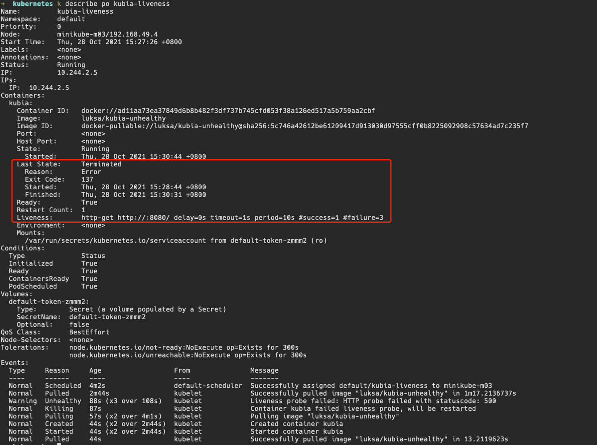

#### 4.1.4 配置存活探针的附加属性

- delay
- timeout
- period
- failure

#### 4.1.5 创建有效的存活探针

> 1. 存活探针不应该依赖于任何外部程序：例如，当服务器无法连接到后端数据库时，前端web服务器不应该返回失败。后端数据库的存活应该由数据库的存活探针来探测；
> 2. 存活探针应该足够轻量，避免消耗过多的资源；
> 3. 如果是任何基于 JVM 或者类似的应用，应该使用 HTTP GET 存货探针，如果是 exec 探针会因为启动过程而需要大量的计算资源。

### 4.2 了解 ReplicationController

> ReplicationController 用于确保 pod 始终运行，并且保证 pod 的数量不多不少。

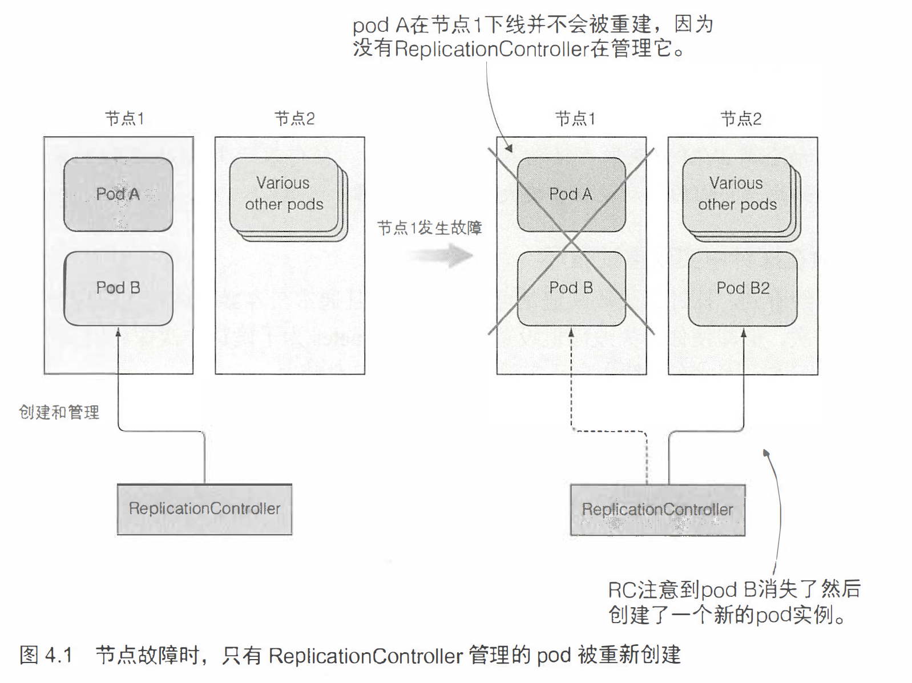

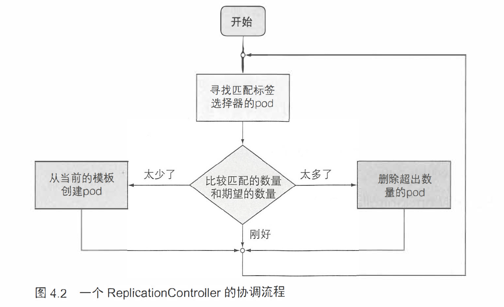

#### ReplicationController 的三个部分

- label selector
- replica count
- pod template

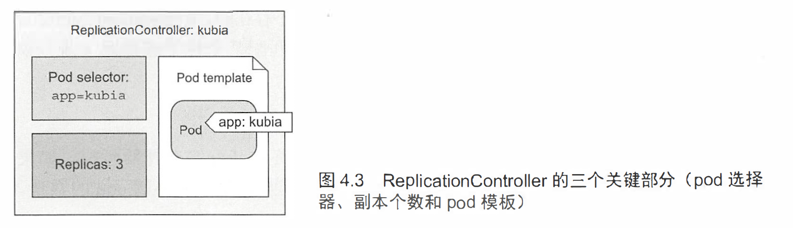

#### 更改控制器的标签选择器或 pod 模板的效果

> 更改标签选择器和 pod 模板对现有 pod 没有影响。更改标签选择器会使得现有的 pod 脱离 ReplicationController 的范围，因此ReplicationController会停止关注他们。
>
> 在创建 pod 之后，ReplicationController 也不关心 pod 的实际内容（容器环境、环境变量等）。

> 注意，ReplicationController 会创建一个新的 pod 实例，与正在替换的实例无关。

#### 4.2.2 创建一个 ReplicationController

> 下面的配置文件上传到 API server 时，kubernetes 会创建一个名为 kubia 的 rc，它确保符合标签 app=kubia 的 pod 始终是3个。

```yaml
apiVersion: v1
# 这里定义了 rc
kind: ReplicationController
metadata:
  # rc 的名字
  name: kubia
spec:
  # pod 实例数量
  replicas: 3
  # selector 决定了 rc 的操作对象
  selector:
    app: kubia
  # 创建新 pod 使用的模板
  template:
    metadata:
      labels:
        app: kubia
    spec:
      containers:
        - name: kubia
          image: luksa/kubia
          ports:
            - containerPort: 8080
```

> 上面是正确的配置文件，下面是一个错误的配置文件。会抛出如下异常：
>
> The ReplicationController "kubia-rc" is invalid: spec.template.metadata.labels: Invalid value: map[string]string{"app":"kubia"}: `selector` does not match template `labels`
>
> `spec.selector` 必须和 `spec.template.metadata.labels` 中的标签完全匹配，否则启动的新的 pod 将不会使得实际的副本数量接近期望的副本数量。

```yaml
apiVersion: v1
# 这里定义了 rc
kind: ReplicationController
metadata:
  name: kubia-rc
spec:
  # pod 实例数量
  replicas: 3
  # selector 决定了 rc 的操作对象
  selector:
    app: kubia-rc
  # 创建新 pod 使用的模板
  template:
    metadata:
      labels:
        app: kubia
    spec:
      containers:
        - name: kubia
          image: luksa/kubia
          ports:
            - containerPort: 8080
```

> 我们也可以不指定 selector，这样它会自动根据 pod 模板中的标签自动配置，这也是 kubernetes 推荐的做法。

#### 4.2.3 使用 ReplactionController

```bash
k get pods
#NAME             READY   STATUS    RESTARTS   AGE
#kubia-rc-54vwv   1/1     Running   0          4m16s
#kubia-rc-j9hxn   1/1     Running   0          4m16s
#kubia-rc-lkmfk   1/1     Running   0          4m16s

# 删除第一个 pod
k delete pod kubia-rc-54vwv
# pod "kubia-rc-54vwv" deleted

# 再次查看，发现有一个新的 pod 被拉起了
k get pods
#NAME             READY   STATUS    RESTARTS   AGE
#kubia-rc-2l2q5   1/1     Running   0          38s
#kubia-rc-j9hxn   1/1     Running   0          5m27s
#kubia-rc-lkmfk   1/1     Running   0          5m27s
```

#### 控制器如何创建新 pod

控制器并不对 delete 行为产生任何操作，而是因为 delete 导致的 pod 数量不足，rc 来创建新的 pod 保证 pod 数量。

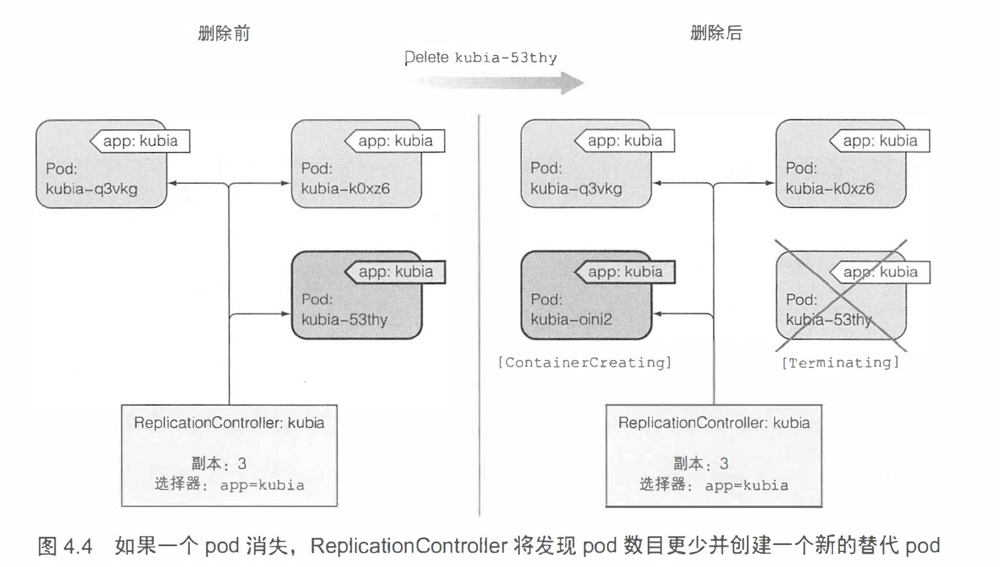

#### 应对节点故障

#### 4.2.4 将 pod 移入或移出 rc 的作用域

> 由 rc 创建的 pod 并不是绑定到 rc 上。而是 rc 管理所有 label 与之对应的 pod。
>
> 需要注意的问题是，只要 rc 的 `selector` 能匹配到 pod，就说明 pod 是正确的。

```bash
k get pod --show-labels
#NAME             READY   STATUS    RESTARTS   AGE   LABELS
#kubia-rc-2l2q5   1/1     Running   0          39m   app=kubia
#kubia-rc-j9hxn   1/1     Running   0          44m   app=kubia
#kubia-rc-lkmfk   1/1     Running   0          44m   app=kubia

# 为第一个 pod 增加一个新的标签
k label po kubia-rc-2l2q5 env=dev

# 查询之后发现，rc 没有拉起新的 pod，因为现在 rc 的 selector 还是能匹配到三个 pod 的
k get pod --show-labels
#NAME             READY   STATUS    RESTARTS   AGE   LABELS
#kubia-rc-2l2q5   1/1     Running   0          39m   app=kubia,env=dev
#kubia-rc-j9hxn   1/1     Running   0          44m   app=kubia
#kubia-rc-lkmfk   1/1     Running   0          44m   app=kubia

# 再次修改第一个
k label po kubia-rc-2l2q5 app=kubia-dev --overwrite

# 查询发现 rc 拉起了新的 pod，因为此时 selector 已经匹配不到三个 pod 了。
k get pod --show-labels
#NAME             READY   STATUS              RESTARTS   AGE   LABELS
#kubia-rc-2l2q5   1/1     Running             0          42m   app=kubia-dev,env=dev
#kubia-rc-hx8zx   0/1     ContainerCreating   0          2s    app=kubia
#kubia-rc-j9hxn   1/1     Running             0          47m   app=kubia
#kubia-rc-lkmfk   1/1     Running             0          47m   app=kubia
```

```yaml
apiVersion: v1
kind: Pod
metadata:
  name: kubia-gpu
  labels:
    app: "kubia"
    gpu: "true"
spec:
  containers:
    - image: luksa/kubia
      name: kubia
```

> 如果我们使用上面的配置重新拉起一个pod的话，我们可以发现找不到新的 labels，因为此时pod数量已经满足需求

```bash
# 查看 rc 状态，发现新创建的pod已经被删除
k get pod --show-labels
#NAME             READY   STATUS    RESTARTS   AGE   LABELS
#kubia-rc-2l2q5   1/1     Running   0          91m   app=kubia-dev,env=dev
#kubia-rc-hx8zx   1/1     Running   0          49m   app=kubia
#kubia-rc-j9hxn   1/1     Running   0          96m   app=kubia
#kubia-rc-jht4f   1/1     Running   0          32m   app=kubia

k describe rc kubia-rc
#Events:
#  Type    Reason            Age                 From                    Message
#  ----    ------            ----                ----                    -------
#  Normal  SuccessfulCreate  21m                 replication-controller  Created pod: kubia-rc-hx8zx
#  Normal  SuccessfulCreate  5m36s               replication-controller  Created pod: kubia-rc-jht4f
#  Normal  SuccessfulDelete  7s (x3 over 3m35s)  replication-controller  Deleted pod: kubia-gpu
```

现在 kubia-rc-2l2q5 已经完全脱离了 rc 的管控。

#### 4.2.5 修改 pod 模板

> 修改 pod 模板并不会影响已经创建的 pod。**要修改旧的pod，我们得删除他们后等 rc 拉起新的 pod**

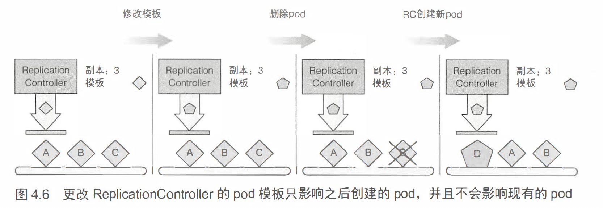

```bash
# 可以使用以下命令编辑 rc
k edit rc kubia-rc
```

#### 4.2.6 水平缩放 pod

> 调整 spec.replicas 即可达到水平缩放。
>
> kubernetes 的水平伸缩是 `声名式` 的。

#### ReplicationController 扩容

```bash
# 扩容
k scale rc kubia-rc --replicas=10

# 缩容
k scale rc kubia-rc --replicas=3
```

#### 4.2.7 删除 rc

> 删除 rc 会使得 pod 也会被删除，可以通过增加 --cascade=false 使得 pod 保留

```bash
k delete rc kubia-rc --cascade=false

k get pod --show-labels
#NAME             READY   STATUS    RESTARTS   AGE   LABELS
#kubia-rc-2l2q5   1/1     Running   0          16h   app=kubia-dev,env=dev
#kubia-rc-hx8zx   1/1     Running   0          15h   app=kubia
#kubia-rc-j9hxn   1/1     Running   0          16h   app=kubia
#kubia-rc-jht4f   1/1     Running   0          15h   app=kubia
#kubia-rc-txpcl   1/1     Running   0          42m   app=kubia

# 但是删除 pod 之后，又可以重建并通过 label 重新关联
k create -f kubia-rc.yaml
```

### 4.3 使用 ReplicaSet 而不是 ReplicationController

> rs 是 rc 的替代品，通常不会直接创建它们，而是在创建 Deployment 时自动的创建 rs

#### 4.3.1 比较 rs 和 rc

> rs 的匹配能力相对于 rc 说更强；

#### 4.3.2 定义 rs

```yaml
# 注意，这里不是 v1 的 api
# 这里使用 api组 -> apps
# 以及声明了实际的 api 版本 v1beta2
apiVersion: apps/v1beta2
kind: ReplicaSet
metadata:
  name: kubia
spec:
  replicas: 3
  selector:
    matchLabels:
      app: kubia
  template:
    metadata:
      labels:
        app: kubia
    spec:
      containers:
        - name: kubia
          image: luksa/kubia
```

```bash
# 执行
k create -f kubia-replicaset.yaml
# error: unable to recognize "kubia-replicaset.yaml": no matches for kind "ReplicaSet" in version "apps/v1beta2"

# 查询 kubernetes api 版本
k api-versions | grep apps
# apps/v1

# 修改 apiVersion 版本
k create -f kubia-replicaset.yaml
```

```bash
# 查询 pod
k get pod --show-labels
#NAME             READY   STATUS    RESTARTS   AGE    LABELS
#kubia-kk4n4      1/1     Running   0          118s   app=kubia
#kubia-pls4g      1/1     Running   0          118s   app=kubia
#kubia-rc-2l2q5   1/1     Running   0          16h    app=kubia-dev,env=dev
#kubia-rc-c7n88   1/1     Running   0          28m    app=kubia
#kubia-rc-hx8zx   1/1     Running   0          16h    app=kubia
#kubia-rc-j9hxn   1/1     Running   0          16h    app=kubia
#kubia-rc-jht4f   1/1     Running   0          15h    app=kubia
#kubia-rvm2w      1/1     Running   0          118s   app=kubia
```

#### 4.3.4 使用 rs 的标签选择器

- In
- NotIn
- Exists ：不指定 values
- DoesNotExist ： 不指定 values

```yaml
spec:
  replicas: 3
  selector:
    matchLabels:
      - key: app
        operator: in
        values:
          - kubia
```

### 4.4 使用 DaemonSet 在每个节点上运行一个 pod

> rs 和 rc 会在 kubernetes 上部署特定数量的 pod。但是有的时候我们可能希望在集群的每个节点上部署一个 pod 实例就需要用到 DaemonSet 了。

#### 4.4.1 使用 DaemonSet

> 1. DaemonSet 没有期望pod数的说法；
> 2. DaemonSet 在新节点加入节点时，会自动的新加pod；

#### 4.4.2 使用 DaemonSet 只在特定的节点上运行 pod

> DaemonSet 将 pod 部署到集群中的所有节点上，除非这些 pod 只在部分节点上运行 -- 也就是说 pod 设置了 nodeSelector 属性。

#### 用一个例子解释 DaemonSet

> 假设 ssd-monitor 需要在所有使用固态硬盘的节点上运行。
>
> 
>
> 下面的 yaml 声明了一个如下的 DaemonSet：
>
> DaemonSet 匹配包含标签 `app=ssd-monitor` 的 pod。
>
> template 存在一个 NODE_SELECTOR，保证 pod 只会部署在包含标签 `disk-ssd` 的机器上。

```yaml
apiVersion: apps/v1
# 指定类型为 DaemonSet
kind: DaemonSet
# DaemonSet 的名字为 ssd-monitor
metadata:
  name: ssd-monitor
spec:
  # DaemonSet 管理和 matchLabels 匹配的 pod
  selector:
    matchLabels:
      app: ssd-monitor
  # DaemonSet 的模板
  template:
    # 声明了 DaemonSet 的 label
    metadata:
      labels:
        app: ssd-monitor
    # 声明了选择器，表名只会在包含 disk=ssd 的 pod 上
    spec:
      nodeSelector:
        disk: ssd
      containers:
        - name: main
          image: luksa/ssd-monitor
```

```bash
k get ds
#NAME          DESIRED   CURRENT   READY   UP-TO-DATE   AVAILABLE   NODE SELECTOR   AGE
#ssd-monitor   0         0         0       0            0           disk=ssd        35s

# 没有自动拉起 pod
k get po
#No resources found in default namespace.

# 为机器打上标签
k label nodes minikube disk=ssd

# 很快就发现 pod 拉起了
k get po
#NAME                READY   STATUS              RESTARTS   AGE
#ssd-monitor-kvd2k   0/1     ContainerCreating   0          10s
```

### 4.5 运行执行单个任务的 pod

> 期望任务执行完之后就退出。

#### 4.5.1 Job 资源

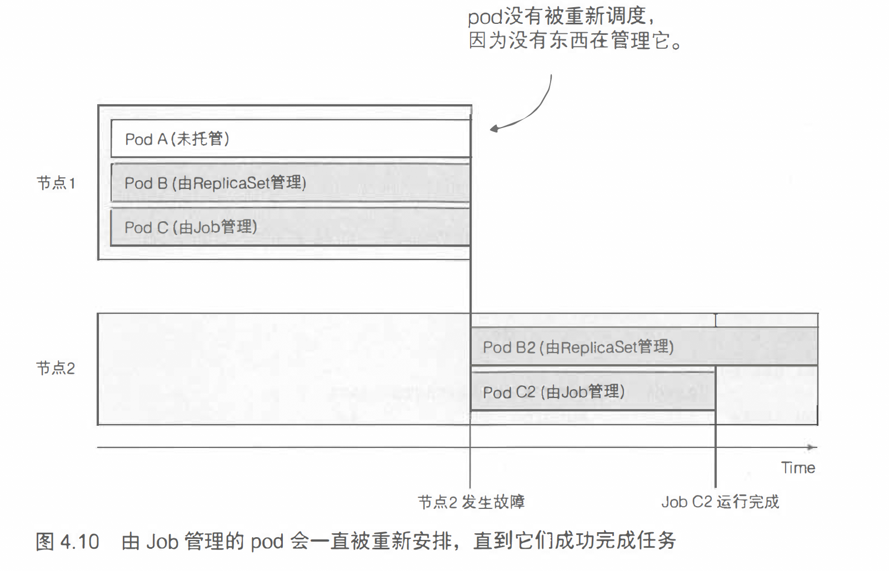

#### 4.5.2 定义 Job 资源

```yaml
apiVersion: batch/v1
kind: Job
metadata:
  name: batch-job
spec:
  template:
    metadata:
      labels:
        app: batch-job
    spec:
      # Job 不能使用默认的策略（always），因为他们不是要无限期的运行
      restartPolicy: OnFailure
      containers:
        - name: main
          image: luksa/batch-job
```

#### 4.5.3 看 Job 运行一个 pod

```bash
k create -f exporter.yaml

k get po --show-labels
#NAME                READY   STATUS        RESTARTS   AGE   LABELS
#batch-job-hpkmk     1/1     Running       0          19s   app=batch-job,controller-uid=95704705-974d-413c-a0bf-0d2a5db66dbc,job-name=batch-job

k logs batch-job-hpkmk
#Fri Oct 29 06:52:16 UTC 2021 Batch job starting
#Fri Oct 29 06:54:16 UTC 2021 Finished succesfully
```

#### 4.5.4 在 Job 中运行多个 pod 实例

> 作业可以配置为多个 pod 实例，并以并行或者串行的方式运行它们。

##### 顺序运行 Job pod

> 通过 completions: 5 使得 Job 运行多次

```yaml
apiVersion: batch/v1
kind: Job
metadata:
  name: multi-completion-batch-job
spec:
  completions: 5
  template:
    metadata:
      labels:
        app: batch-job
    spec:
      restartPolicy: OnFailure
      containers:
        - name: main
          image: luksa/batch-job
```

##### 并行运行 Job pod

> 通过 parallelism: 2 配置并行度为2

```yaml
apiVersion: batch/v1
kind: Job
metadata:
  name: multi-completion-batch-job
spec:
  completions: 5
  parallelism: 2
  template:
    metadata:
      labels:
        app: batch-job
    spec:
      restartPolicy: OnFailure
      containers:
        - name: main
          image: luksa/batch-job
```

#### 4.5.5 限制 Job pod 完成任务的时间

> 1. activeDeadlineSeconds 可以限制 pod 时间，避免永远不结束
> 2. 还可以通过 spec.backoffLimit 指定重试次数，默认为 6.

### 4.6 安排 Job 定期运行或者将来运行一次

```yaml
apiVersion: batch/v1beta1
kind: CronJob
metadata:
  name: batch-job-every-fifteen-minutes
spec:
  # crontab
  schedule: "0,15,30,45 * * * *"
  # pod 最迟必须在预定时间后15秒开始运行，超过这个时间任务将被标记为 failed
  startingDeadlineSeconds: 15
  jobTemplate:
    spec:
      template:
        metadata:
          labels:
            app: periodic-batch-job
        spec:
          restartPolicy: OnFailure
          containers:
          - name: main
            image: luksa/batch-job
```

## 5. 服务：让客户端发现 pod 并与之通信

### 目录

1. 创建服务资源，利用单个地址访问一组 pod；
2. 发现集群中的服务；
3. 将服务公开给外部的客户端；
4. 从集群内部连接外部服务；
5. 控制 pod 与服务关联；
6. 排除服务故障。

> 1. pod 通常需要接受集群内其他 pod 或者来自外部的客户端的http 的请求并作出响应；
> 2. pod 的特点
>    1. pod 会随时启动或者关闭；
>    2. kubernetes 在 pod 启动前会给已经调度到节点上的 pod 分配 ip 地址，因此客户端不能提前知道 pod 的地址；
>    3. pod 的数量是不固定的；
> 3. 基于 <2>，kubernetes 提供了一种资源类型 -- **服务（service）** 来解决与客户端或者其他 pod 通信的问题。

### 5.1 介绍 service

> service 是一种为一组功能相同的 pod 提供单一不变的接入点的资源。
>
> 当 service 存在时，他的 ip 和 port 不会变更，客户端可以通过这个 ip 和 port 连接服务而不需要在意后端 pod。

#### 结合实例解释服务

> 假设存在一个如下服务：
>
> 客户端 -> 前端 -> DB
>
> 那么我们需要做的是：
>
> 1. 为前端 pod 创建服务，并可以在集群外部访问，可以暴露一个单一不变的IP地址让客户端连接；
> 2. 为后端 pod 创建服务，并分配一个固定的ip地址，尽管后端 pod 会变，但是 service 的 ip 地址固定不变。

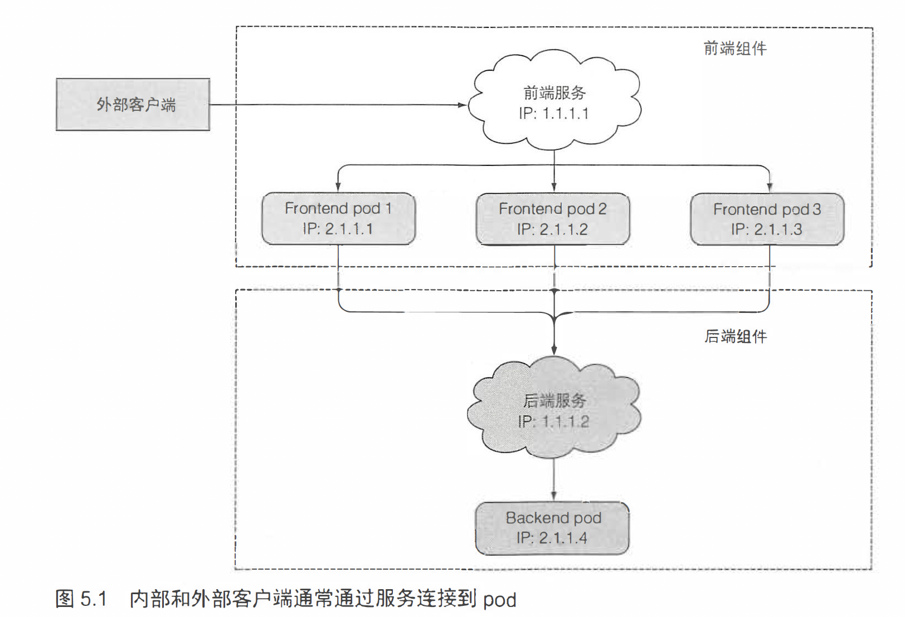

#### 5.1.1 创建服务

> rc 和其他的 pod 控制器中使用标签选择器来指定哪些 pod 属于同一组。service 使用相同的机制。

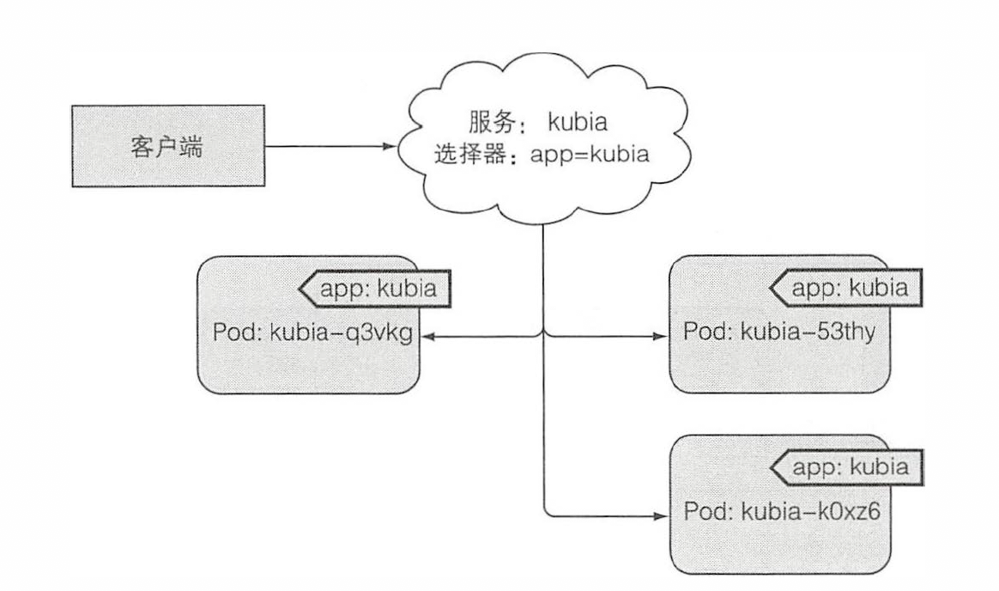

##### 通过 kubectl expose 创建服务

> 下面的配置会生成 service，service 将所有来自 80 端口的请求，转发到所有具有标签 `app=kubia` 的 pod 的 8080 端口。

```yaml
apiVersion: v1
# 指定类型为 service
kind: Service
metadata:
  name: kubia
spec:
  # service 将连接转发到容器的端口
  ports:
  - port: 80
    targetPort: 8080
  # 具有 app=kubia 标签的 pod 都属于该服务
  selector:
    app: kubia
```

```bash
k create -f kubia-svc.yaml
#service/kubia created

k get services --show-labels
#NAME         TYPE           CLUSTER-IP       EXTERNAL-IP   PORT(S)          AGE   LABELS
#kubernetes   ClusterIP      10.96.0.1        <none>        443/TCP          2d    component=apiserver,provider=kubernetes
#kubia        ClusterIP      10.100.127.78    <none>        80/TCP           20s   <none>
```

##### 在运行的容器中远程执行命令

> `--` 代表 kubectl 命令的结束。

```bash
# 找一台集群中running 的pod
k get pods
#NAME             READY   STATUS    RESTARTS   AGE
#kubia-rc-44mbb   1/1     Running   0          53s
#kubia-rc-f8fmq   1/1     Running   0          53s
#kubia-rc-fcbwn   1/1     Running   0          53s
#kubia-rc-rm4jl   1/1     Running   0          53s

# 执行 curl 指令
k exec kubia-rc-44mbb -- curl -s http://10.100.127.78:80
#You've hit kubia-rc-fcbwn

k exec kubia-rc-44mbb -- curl -s http://10.100.127.78:80
#You've hit kubia-rc-44mbb

k exec kubia-rc-44mbb -- curl -s http://10.100.127.78:80
#You've hit kubia-rc-rm4jl
```

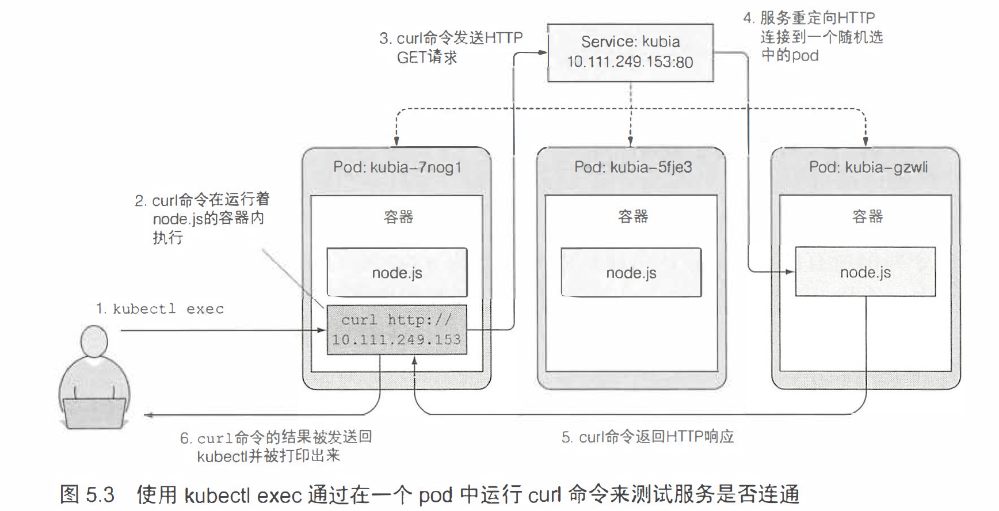

##### 配置service上的会话亲和性

> 由于负载均衡，请求的pod可能不固定。如果需要请求指向同一个ip，可以通过制定 sessionAffinity 属性为 ClientIP。

```yaml
apiVersion: v1
kind: Service
metadata:
  name: kubia
spec:
  sessionAffinity: ClientIP
  ports:
  - port: 80
    targetPort: 8080
  selector:
    app: kubia
```

```bash
k exec kubia-rc-44mbb -- curl -s http://10.96.8.104:80
#You've hit kubia-rc-rm4jl

k exec kubia-rc-44mbb -- curl -s http://10.96.8.104:80
#You've hit kubia-rc-rm4jl

k exec kubia-rc-44mbb -- curl -s http://10.96.8.104:80
#You've hit kubia-rc-rm4jl
```

##### 同一个服务暴露多个端口

```yaml
apiVersion: v1
kind: Service
metadata:
  name: kubia
spec:
  sessionAffinity: ClientIP
  ports:
  - port: 80
    name: http
    targetPort: 8080
  - port: 443
    name: https
    targetPort: 8443
  selector:
    app: kubia
```

> 端口的标签选择器应用于整个 service，不能对每个端口做单独的配置。

##### 使用命名的端口

> 在服务 spec 中也可以给不同的端口号命名

```yaml
# 在 pod 的定义中指定 port 名称
apiVersion: v1
kind: Pod
spec:
  containers:
    - name: kubia
      containerPort: 8080
    - name: https
      caontinerPort: 8443
```

```yaml
# 在服务中引用命名pod
apiVersion: v1
kind: Service
spec:
  ports:
    - name: http
      port: 80
      targetPort: http
    - name: https
      port: 443
      targetPort: https
```

#### 5.1.2 服务发现

> kubernetes 还为客户端提供了发现服务的IP和端口的方式。

##### 通过环境变量发现服务

> 环境变量是获得服务IP地址和端口的一种方式，我们还允许通过 DNS 来获得所有服务的IP和地址

```bash
# 查看环境变量
k exec kubia-rc-44mbb -- env
#...
# 服务的集群 ip 和 port
#KUBIA_SERVICE_HOST=10.100.127.78
#KUBIA_SERVICE_PORT=80
#...
```

##### 通过DNS发现服务

```bash
#coredns 是 kubernetes 内部的 DNS 服务
k get pod --show-labels --namespace kube-system
#coredns-74ff55c5b-klnsq            1/1     Running   1          5d    k8s-app=kube-dns,pod-template-hash=74ff55c5b
```

##### 通过FQDN(Fully Qualified Domain Name)连接服务

> 在我们前面的例子中，前端pod可以通过 `backend-database.default.svc.cluter.local` 访问后端数据服务
>
> - backend-database 对应于服务名称
> - default 表示服务的命名空间
> - svc.cluster.local 是在所有集群本地服务名中使用的可配置集群域后缀
>
> 如果前端pod和数据库pod在同一个命名空间下，可以省略 svc.cluster.local 后缀，甚至命名空间。

##### 在 pod 容器中运行 shell

```bash
# 进入 bash
k exec kubia-rc-44mbb -it -- /bin/bash

curl http://kubia.default.svc.cluster.local
#You've hit kubia-rc-rm4jl

curl http://kubia.default
#You've hit kubia-rc-rm4jl

curl http://kubia
#You've hit kubia-rc-rm4jl

cat /etc/resolv.conf
#nameserver 10.96.0.10
#search default.svc.cluster.local svc.cluster.local cluster.local
#options ndots:5
```

##### 无法ping通服务IP的原因

> 服务的集群IP是一个虚拟IP，并且只有和服务端口结合时才有意义。

### 5.2 连接集群外部的服务

#### 5.2.1 介绍服务 endpoint

> 服务并不是和pod直接相连的，有一种资源介于两者之间 -- endpoint。

```bash
k describe services kubia
#...
#Selector:          app=kubia
#Endpoints:         10.244.1.10:8080,10.244.2.19:8080,10.244.2.20:8080 + 1 more...
#...

k get endpoints kubia
#NAME    ENDPOINTS                                                        AGE
#kubia   10.244.1.10:8443,10.244.2.19:8443,10.244.2.20:8443 + 5 more...   2d22h

k describe endpoints kubia
```

#### 5.2.2 手动配置服务的 endpoint

> 如果创建了不包含 `selector` 的 service，kubernetes 将不会创建 endpoint 资源，因为缺少选择器，将无法确定 service 中包含了哪些 pod。

##### 创建没有选择器的服务

> 定义一个名为 external-service 的服务，接收端口 80 上的连接，并没有为服务选定一个 pod selector

```yaml
apiVersion: v1
kind: Service
metadata:
  name: external-service
spec:
  ports:
    - port: 80
```

##### 为没有选择器的服务创建 endpoint 资源

> 这样，上面没有 pod 选择器的 service 就可以连接到下面的这些 endpoint 了。

```yaml
apiVersion: v1
kind: Endpoints
# endpoint 的名称必须和服务的名称相匹配
metadata:
  name: external-service
subsets:
  - addresses:
    - ip: 11.11.11.11
    - ip: 22.22.22.22
    ports:
    - port: 80
```

#### 5.2.3 为外部服务创建别名

##### 创建 ExternalName 类型的服务

```yaml
apiVersion: v1
kind: Service
metadata:
  name: external-service
spec:
  type: ExternalName
  externalName: someapi.somecompany.com
  ports:
    - port: 80
```

### 5.3 将服务暴露给外部客户端

- 将服务类型设置为 NodePort，并将在该端口上接收到的流量重定向到基础服务；
- 将服务的类型设置成 LoadBalance，一种 NodePort 的扩展类型；
- 创建一个 ingress 资源。

#### 5.3.1 使用 NodePort 类型的服务

##### 创建 NodePort 类型的服务

```yaml
apiVersion: v1
kind: Service
metadata:
  name: kubia-nodeport
spec:
  type: NodePort
  ports:
  - port: 80
    targetPort: 8080
    nodePort: 30123
  selector:
    app: kubia
```

```bash
# 打开 minikube 的外部访问通道
minikube service kubia-nodeport --url

#🏃  Starting tunnel for service kubia-nodeport.
#|-----------|----------------|-------------|------------------------|
#| NAMESPACE |      NAME      | TARGET PORT |          URL           |
#|-----------|----------------|-------------|------------------------|
#| default   | kubia-nodeport |             | http://127.0.0.1:60965 |
#|-----------|----------------|-------------|------------------------|
#http://127.0.0.1:60965
#❗  Because you are using a Docker driver on darwin, the terminal needs to be open to run it.

curl http://127.0.0.1:60965
```

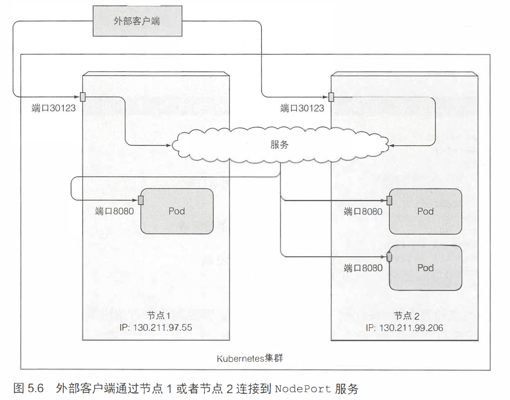

#### 5.3.2 通过负载均衡器将服务暴露出来

```yaml
apiVersion: v1
kind: Service
metadata:
  name: kubia-loadbalancer
spec:
  type: LoadBalancer
  ports:
  - port: 80
    targetPort: 8080
  selector:
    app: kubia
```

```bash
# 启动 minikube url
minikube service kubia-loadbalancer --url
```

##### SessionAffinity

我们可以通过浏览器和 curl 访问服务，但是我们发现一个有趣的现象：浏览器每次都是同一个pod，而 curl 则不一定，是否是因为设置了 sessionAffinity 呢？

结论是不是，是因为浏览器使用 keep-alive 连接，并通过单个连接发送所有请求。而 curl 每次都会打开一个新的连接。

**服务在连接级别工作**，所以不管是否设置 sessionAffinity，用户在浏览器中始终会使用相同的连接。

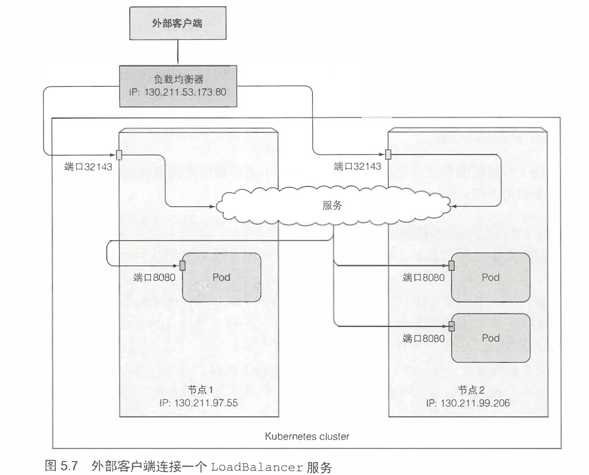

#### 5.3.3 了解外部连接的特性

##### 了解并防止不必要的网络跳数

> 客户端 -> LoadBalancer -> Service 这个链路中， LoadBalancer 和 Service 可能在两个不同的节点。
>
> 我们可以配置仅仅重定向到同节点的 pod。
>
> spec.externalTrafficPolicy

```bash
k explain service.spec.externalTrafficPolicy

#KIND:     Service
#VERSION:  v1
#
#FIELD:    externalTrafficPolicy <string>
#
#DESCRIPTION:
#     externalTrafficPolicy denotes if this Service desires to route external
#     traffic to node-local or cluster-wide endpoints. "Local" preserves the
#     client source IP and avoids a second hop for LoadBalancer and Nodeport type
#     services, but risks potentially imbalanced traffic spreading. "Cluster"
#     obscures the client source IP and may cause a second hop to another node,
#     but should have good overall load-spreading.
```

### 5.4 通过 ingress 暴露服务

#### 为什么需要 ingress

> 每个 LoadBalancer 都需要自己的负载均衡器，但是 ingress 可以为多个服务提供访问。

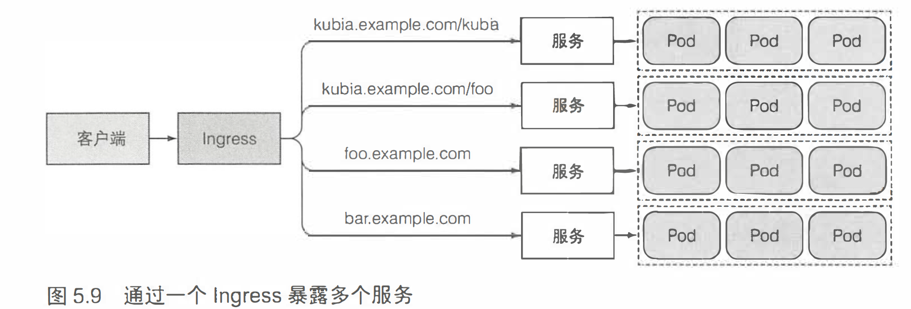

```bash
#查看 ingress
minikube addons list

#开启 ingress
minikube addons enable ingress
```

#### 5.4.1 创建 ingress 资源

> 最开始，我配置了 `serviceName: kubia-nodexport` 但是没有启动 `kubia-nodeexport`，所以一直 502.
>
> 配置 `/etc/host`使得 kubia.example.com -> 虚拟ip

```yaml
apiVersion: extensions/v1beta1
kind: Ingress
metadata:
  name: kubia
spec:
  rules:
  - host: kubia.example.com
    http:
      paths:
        - path: /
          backend:
            serviceName: kubia
            servicePort: 80
```

```bash
k get ingress
#NAME    CLASS    HOSTS               ADDRESS          PORTS   AGE   LABELS
#kubia   <none>   kubia.example.com   192.168.99.102   80      16s   <none>

curl http://kubia.example.com
#You've hit kubia-rc-xxh27

curl 192.168.99.102
# 404 异常
```

##### 了解 ingress 的工作原理

> ingress 控制器通过 http 请求的 header 确定客户端尝试访问哪个 service，**通过与该服务关联的 endpoint 对象查看 podId**。
>
> ingress 控制器不会把请求转发给服务，只用它来选择一个 pod。


#### 5.4.3 通过相同的 ingress 暴露多个服务

```yaml
apiVersion: extensions/v1beta1
kind: Ingress
metadata:
  name: kubia
spec:
  rules:
  - host: kubia.example.com
    http:
      paths:
        #        - path: /
        #          backend:
        #            serviceName: kubia
        #            servicePort: 80
        - path: /kubia
          backend:
            serviceName: kubia
            servicePort: 80
```

#### 5.4.4 配置 ingress 处理 TLS 传输

```bash
#创建私钥和证书
openssl req -new -x509 -key tls.key -out tls.cert -days 360 -subj
openssl req -new -x509 -key tls.key -out tls.cert -days 360 -subj /CN=kubia.example.com

#创建 Secret
#私钥和证书现在存储在名为 tls-secret 的 Secret 中。
kubectl create secret tls tls-secret --cert=tls.cert --key=tls.key
```

```yaml
apiVersion: extensions/v1beta1
kind: Ingress
metadata:
  name: kubia-tls
spec:
  # 配置 tls
  tls:
  - hosts:
    # 接受来自 kubia.example.com 主机的 tls 连接
    - kubia.example.com
    # 从 tls-secret 中获得之前创建的私钥和证书
    secretName: tls-secret
  rules:
  - host: kubia.example.com
    http:
      paths:
        #        - path: /
        #          backend:
        #            serviceName: kubia
        #            servicePort: 80
        - path: /kubia-tls
          backend:
            serviceName: kubia
            servicePort: 80
```

```bash
#访问 tls 服务
curl -k -v https://kubia.example.com/kubia-tls
#...
#You've hit kubia-rc-c7ngq
#* Connection #0 to host kubia.example.com left intact
#* Closing connection 0
```

### 5.5 pod 就绪后发出信号

#### 5.5.1 就绪探针

> 和存活探针一样，就绪探针有三种类型：
>
> 1. exec 探针
> 2. HTTP GET 探针
> 3. TCP socket 探针

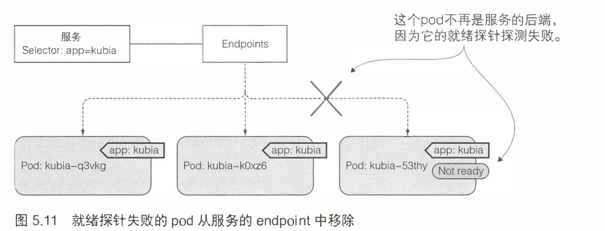

##### 添加就绪探针

> 下面的配置文件，因为初始没有 `/var/ready` 文件，所以 pod 的状态一直是错的。创建 `/var/ready` 文件

```yaml
apiVersion: v1
# 这里定义了 rc
kind: ReplicationController
metadata:
  name: kubia-rc-readiness-probe
spec:
  # pod 实例数量
  replicas: 1
  # selector 决定了 rc 的操作对象
  selector:
    app: kubia
  # 创建新 pod 使用的模板
  template:
    metadata:
      labels:
        app: kubia
    spec:
      containers:
        - name: kubia
          image: luksa/kubia
          ports:
            - containerPort: 8080
          # pod 中的每个容器都会有一个就绪探针
          readinessProbe:
            exec:
              command:
                - ls
                - /var/ready
```

```bash
k get pods --show-labels
#kubia-rc-readiness-probe-r6nxn   0/1     Running   0          2m23s   app=kubia

k exec kubia-rc-readiness-probe-r6nxn -it -- /bin/bash

touch /var/ready
```

### 5.6 使用 headless 服务来发现独立的 pod

```yaml
apiVersion: v1
kind: Service
metadata:
  name: kubia-headless
spec:
  # 使得服务成为 headless 服务
  clusterIP: None
  ports:
  - port: 80
    name: http
    targetPort: 8080
  selector:
    app: kubia
```

```bash
# kubia-headless 没有 ClusterIP
k get service --show-labels
#NAME                 TYPE           CLUSTER-IP       EXTERNAL-IP   PORT(S)          AGE     LABELS
#kubia-headless       ClusterIP      None             <none>        80/TCP           20s     <none>
#kubia-loadbalancer   LoadBalancer   10.107.136.228   <pending>     80:30062/TCP     3h33m   <none>
```

### 5.7 排除服务故障

1. 区分集群内IP和集群外IP；
2. 不通过 ping 来探测服务；
3. 就绪探针/存活探针不能出现错误；
4. 要确认某个容器是服务的一部分，可以通过 `kubectl get endpoints` 来检查相应的端点对象；
5. 当 FQDN 不起作用时，可以尝试一下使用IP访问服务；
6. 尝试直接连接到PodId确认pod正常工作；

##### 确认容器是服务的一部分

```bash
k get pods -o wide
#NAME                             READY   STATUS    RESTARTS   AGE     IP           NODE           NOMINATED NODE   READINESS GATES
#kubia-rc-c7ngq                   1/1     Running   0          3h52m   10.244.1.3   minikube-m02   <none>           <none>
#kubia-rc-ctjn9                   1/1     Running   0          3h52m   10.244.2.4   minikube-m03   <none>           <none>
#kubia-rc-readiness-probe-r6nxn   1/1     Running   0          36m     10.244.1.7   minikube-m02   <none>           <none>
#kubia-rc-xmb2w                   1/1     Running   0          3h52m   10.244.2.5   minikube-m03   <none>           <none>
#kubia-rc-xxh27                   1/1     Running   0          3h52m   10.244.1.4   minikube-m02   <none>           <none>

k get endpoints
#NAME                 ENDPOINTS                                                     AGE
#external-service     11.11.11.11:80,22.22.22.22:80                                 8m40s
#kubernetes           192.168.99.100:8443                                           4h
#kubia                10.244.1.3:8443,10.244.1.4:8443,10.244.1.7:8443 + 7 more...   3h54m
#kubia-headless       10.244.1.3:8080,10.244.1.4:8080,10.244.1.7:8080 + 2 more...   21m
#kubia-loadbalancer   10.244.1.3:8080,10.244.1.4:8080,10.244.1.7:8080 + 2 more...   3h54m

k describe endpoints kubia-headless
#Name:         kubia-headless
#Namespace:    default
#Labels:       service.kubernetes.io/headless=
#Annotations:  endpoints.kubernetes.io/last-change-trigger-time: 2021-11-02T07:38:47Z
#Subsets:
#  Addresses:          10.244.1.3,10.244.1.4,10.244.1.7,10.244.2.4,10.244.2.5
#  NotReadyAddresses:  <none>
#  Ports:
#    Name  Port  Protocol
#    ----  ----  --------
#    http  8080  TCP
#
#Events:  <none>
```

## 6. 卷：将磁盘挂载到容器上

> 1. 我们可能不希望 pod 的整个文件系统被持久化，又希望它能保存实际数据，为此 kubernetes 提供了 `卷`；
> 2. kubernetes 中卷是 pod 的一部分，和 pod 的生命周期一样 -- 在启动时创建，在 delete 时销毁；

### 6.1 介绍卷

#### 6.1.1 卷的应用示例

> 假设存在两个卷 `publicHtml` 和 `logVol`。
>
> /var/htdocs -> publicHtml
>
> /var/logs -> logVol
>
> /var/html -> publicHtml
>
> /var/logs -> logVol
>
> 这样三个容器就可以共享了数据了。

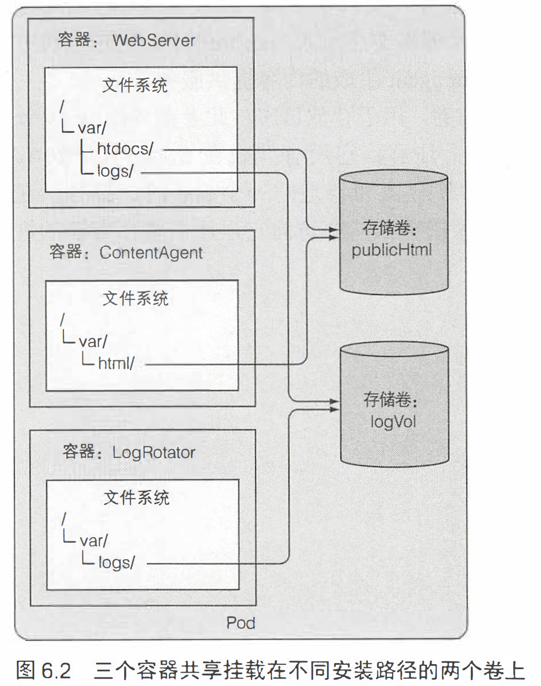

#### 6.1.2 介绍可用的卷类型

- emptyDir 存储临时数据的简单空目录
- hostPath 用于将目录从工作节点的文件系统挂在到pod上
- gitRepo 通过检出 git 仓库的内容来初始化的卷
- Nfs 怪哉到 pod 中的 NFS 共享卷
- ...

### 6.2 通过卷在容器之间共享数据

#### 6.2.1 使用 emptyDir 卷

##### 在 pod 中使用 emptyDir 卷

> 把上面的例子继续简化，只保留 WebServer 和 ContentAgent。
>
> 我们使用 nginx 作为 web 服务器和 UNIX fortune 命令来生成 html 内容。

```dockerfile
FROM ubuntu:latest

RUN apt-get update ; apt-get -y install fortune
ADD fortuneloop.sh /bin/fortuneloop.sh

ENTRYPOINT /bin/fortuneloop.sh
```

```bash
#!/bin/bash
trap "exit" SIGINT
mkdir /var/htdocs

while :
do
  echo $(date) Writing fortune to /var/htdocs/index.html
  /usr/games/fortune > /var/htdocs/index.html
  sleep 10
done
```

##### 创建pod

> 下面的配置创建了两个容器：html-generator 和 web-server。
>
> html-generator 每10s输出数据到 `/var/htdocs/index.html` 中，而 `/var/htdocs` 这个文件被挂载到了卷 html 下。
>
> web-server 从 `/user/share/nginx/html` 下读取数据，而这个文件也被挂载到了卷 html 下。

```yaml
apiVersion: v1
#创建一个pod
kind: Pod
#Pod 名是 fortune
metadata:
  name: fortune
spec:
  containers:
  - image: luksa/fortune
    #容器名是html-generator
    name: html-generator
    #名为html的卷挂载在容器/var/htdocs中
    volumeMounts:
    - name: html
      mountPath: /var/htdocs
  - image: nginx:alpine
    #容器名是web-server
    name: web-server
    volumeMounts:
    #名为html的卷挂载在容器/user/share/nginx/html中
    - name: html
      mountPath: /usr/share/nginx/html
      readOnly: true
    ports:
    - containerPort: 80
      protocol: TCP
  #一个名为html的单独emptyDir卷。
  volumes:
  - name: html
    emptyDir: {}
```

##### 指定用于 EMPTYDIR 的介质

```yaml
#指定基于 tmfs 文件系统（基于内存而非硬盘）创建。
  volumes:
  - name: html
    emptyDir: 
      medium: Memory
```

#### 6.2.2 使用 git 仓库作为 volumn

> gitRepo 的挂载在 git 复制之后，容器启动之前。所以git 的更新在 rc 重启 pod 时生效。

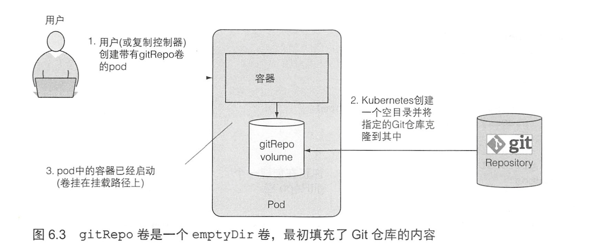

```yaml
apiVersion: v1
kind: Pod
metadata:
  name: gitrepo-volume-pod
spec:
  containers:
  - image: nginx:alpine
    name: web-server
    volumeMounts:
    - name: html
      mountPath: /usr/share/nginx/html
      readOnly: true
    #指定容器暴露的协议
    ports:
    - containerPort: 80
      protocol: TCP
  #声明一个名为 html 的 volumn，这个 volumn 是一个 gitRepo
  volumes:
  - name: html
    gitRepo:
      repository: https://github.com/luksa/kubia-website-example.git
      revision: master
      #指定当前目录为git路径的根目录，不指定的话将会存在一个 kubia-website-example 的文件夹
      directory: .
```

```bash
k port-forward gitrepo-volume-pod 8080:80

curl http://localhost:8080/
#<html>
#<body>
#Hello there.
#</body>
#</html>
```

##### 介绍 sidecar 容器

> **如果我们希望时刻保持 gitRepo 和 git 代码一致，我们通过增加一个 sidecar container 来实现。**
>
> git 同步进程不应该运行在与 nginx 相同的容器中，而是在第二个容器 -- **sidecar container**。
>
> 它是一种容器，增加了对 pod 主容器的操作。可以将一个 sidecar 添加到一个 pod 中，这样就可以使用现有的容器镜像，而不是将附加逻辑填入主应用程序的代码中，这会导致它过于复杂和不可用。

### 6.3 访问工作节点文件系统上的文件

> 一般 pod 不应该访问 node 的目录，因为这会导致 pod 和 node 绑定。

#### 6.3.1 介绍 hostPath 卷

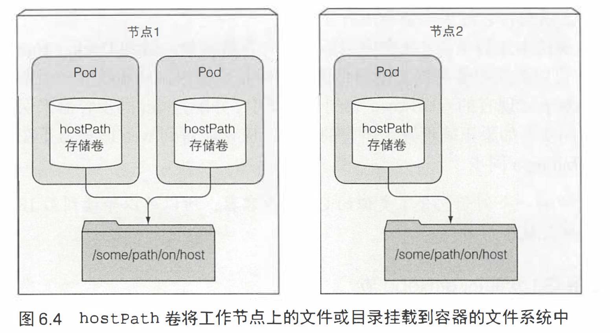

#### 6.3.2 检查使用 hostPath 卷的系统 pod

```bash
k describe po kindnet-bgpx8 --namespace kube-system

#Volumes:
#  cni-cfg:
#    Type:          HostPath (bare host directory volume)
#    Path:          /etc/cni/net.mk
#    HostPathType:  DirectoryOrCreate
#  xtables-lock:
#    Type:          HostPath (bare host directory volume)
#    Path:          /run/xtables.lock
#    HostPathType:  FileOrCreate
#  lib-modules:
#    Type:          HostPath (bare host directory volume)
#    Path:          /lib/modules
#    HostPathType:
#  kindnet-token-mtmvl:
#    Type:        Secret (a volume populated by a Secret)
#    SecretName:  kindnet-token-mtmvl
#    Optional:    false1-(11-03 09:36:18','1450004069','0','0','ozEm3uFeSXWxa0h6t2PVqFw09_Hs','398','13','1','95874014','398032001','1','10','2','10','100','0')
#
```

### 6.4 使用持久化存储

> 1. 为了保证 pod 不和 node 绑定，我们需要通过 NAS 保证每个 pod 都可以访问我们的持久化存储。
> 2. 因为我们使用 gcePersistentDisk，下面的 pod 是无法正常拉起的。

```yaml
apiVersion: v1
kind: Pod
metadata:
  name: mongodb 
spec:
  #声明一个名字为mongodb-data，类型为gcePersistentDisk
  #gcePersistentDisk 的 PD resource 类型是 mongondb，使用的文件系统是 ext4
  volumes:
  - name: mongodb-data
    gcePersistentDisk:
      pdName: mongodb
      fsType: ext4
  containers:
  - image: mongo
    name: mongodb
    #将mongodb的镜像 mount 到 /data/db
    volumeMounts:
    - name: mongodb-data
      mountPath: /data/db
    ports:
    - containerPort: 27017
      protocol: TCP
```

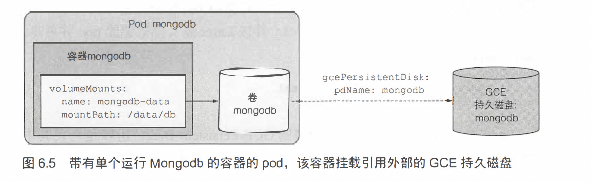

### 6.5 从底层存储技术解耦 pod

#### 6.5.1 介绍持久卷和持久卷声明

- PersistentVolume
- PersistentVolumeClaim，指定最低容量要求和访问模式

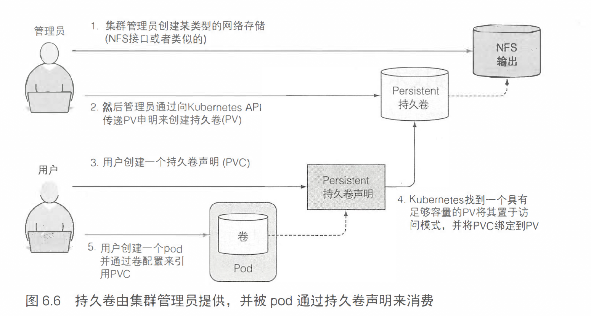

#### 6.5.2 创建持久卷

```yaml
apiVersion: v1
#声明PV
kind: PersistentVolume
metadata:
  name: mongodb-pv
spec:
  #声明PV大小
  capacity: 
    storage: 1Gi
  #访问模式
  #the volume can be mounted as read-write by a single node. ReadWriteOnce access mode still can allow multiple pods to access the volume when the pods are running on the same node.
  #the volume can be mounted as read-only by many nodes.
  accessModes:
    - ReadWriteOnce
    - ReadOnlyMany
  #PV将不执行清理和删除
  persistentVolumeReclaimPolicy: Retain
  hostPath:
    path: /tmp/mongodb
```

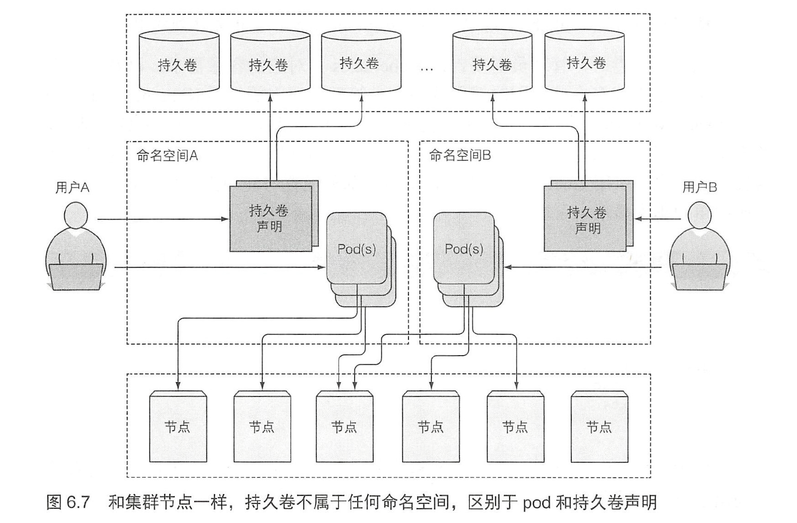

#### 6.5.3 通过创建 PVC 来获取持久卷

##### 创建持久卷声明

```yaml
apiVersion: v1
#声明PVC
kind: PersistentVolumeClaim
metadata:
  name: mongodb-pvc 
spec:
  #PVC 的资源要求
  resources:
    requests:
      storage: 1Gi
  accessModes:
  - ReadWriteOnce
  #和动态配置有关
  storageClassName: ""
```

```bash
#可以看到 PVC 和 PV 的状态都已经变成 Bound 了。

k get pvc
#NAME          STATUS   VOLUME       CAPACITY   ACCESS MODES   STORAGECLASS   AGE
#mongodb-pvc   Bound    mongodb-pv   1Gi        RWO,ROX                       105s

k get pv
#NAME         CAPACITY   ACCESS MODES   RECLAIM POLICY   STATUS   CLAIM                 STORAGECLASS   REASON   AGE
#mongodb-pv   1Gi        RWO,ROX        Retain           Bound    default/mongodb-pvc                           9m45s
```

#### 6.5.4 在 pod 中使用 PVC

```yaml
apiVersion: v1
kind: Pod
metadata:
  name: mongodb 
spec:
  containers:
  - image: mongo
    name: mongodb
    volumeMounts:
    - name: mongodb-data
      mountPath: /data/db
    ports:
    - containerPort: 27017
      protocol: TCP
  #使用 PVC
  volumes:
  - name: mongodb-data
    persistentVolumeClaim:
      claimName: mongodb-pvc
```

##### 访问 mongo

```bash
k exec -it mongodb -- mongo

use mystore
db.foo.insert({name:'foo'})
db.foo.find()
#{ "_id" : ObjectId("618205f0c383207666c6bdbb"), "name" : "foo" }
```

#### 6.5.5 了解使用 PV 和 PVC 的好处

> 直接使用的话，pod 和基础设施耦合了，在例子中，我们就必须使用GCE持久磁盘；
>
> 通过PVC和PV使用的话，我们的 pod 是可复用的，当需要修改基础设施的时候，只需要修改 PV 即可。

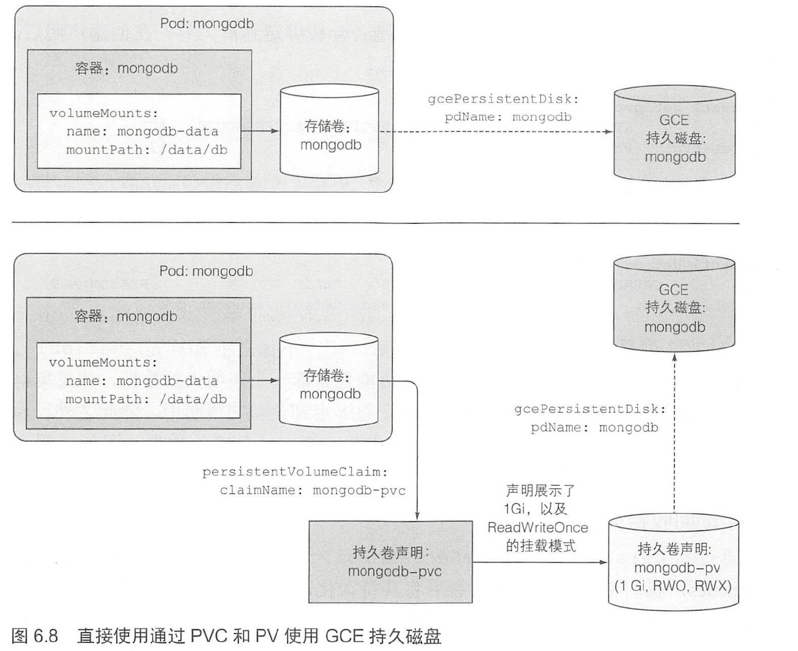

#### 6.5.6 回收 PV

> 通过 persistentVolumeReclaimPolicy 来控制持久卷的行为。

```bash
#删除 pod
k delete pods mongodb
#删除 pvc
k delete pvc mongodb-pvc

#重新创建pvc和pod
k create -f mongodb-pvc.yaml
k create -f mongodb-pod-pvc.yaml

#我们发现 pvc 的状态是 pending，因为 pv 还没有清理。
k get pvc
#NAME          STATUS    VOLUME   CAPACITY   ACCESS MODES   STORAGECLASS   AGE
#mongodb-pvc   Pending

#pv 的状态是 released 而不是 available
k get pv
#NAME         CAPACITY   ACCESS MODES   RECLAIM POLICY   STATUS     CLAIM                 STORAGECLASS   REASON   AGE
#mongodb-pv   1Gi        RWO,ROX        Retain           Released   default/mongodb-pvc                           176m
```

### 6.6 pv 的动态卷配置

> - StorageClass
> - provisioner

#### 6.6.1 通过 StorageClass 资源定义可用存储类型

> StorageClass 指定当 pvc 请求时应该使用哪个程序来提供 pv。
>
> - sc.provisioner:Provisioner indicates the type of the provisioner.
> - sc.parameters:Parameters holds the parameters for the provisioner that should create volumes of this storage class.

```yaml
apiVersion: storage.k8s.io/v1
#指定类型为StorageClass
kind: StorageClass
metadata:
  name: fast
#用于配置 pv 的卷插件
provisioner: k8s.io/minikube-hostpath
#传递给parameters的参数
parameters:
  type: pd-ssd
```

#### 6.6.2 请求 pvc 中的存储类

> 创建声明时，pv 由 `fast` StorageClass 资源中引用的 `provisioner` 创建。

```yaml
apiVersion: v1
kind: PersistentVolumeClaim
metadata:
  name: mongodb-pvc 
spec:
  #指定 StorageClass
  storageClassName: fast
  resources:
    requests:
      storage: 100Mi
  accessModes:
    - ReadWriteOnce
```

##### 创建一个没有指定存储类别的 PVC

> 不设置 storageClassName 将使用没有指定存储类别的 PVC

```yaml
apiVersion: v1
kind: PersistentVolumeClaim
metadata:
  name: mongodb-pvc2 
spec:
  resources:
    requests:
      storage: 100Mi
  accessModes:
    - ReadWriteOnce
```

##### 强制将 PVC 绑定到预配置的其中一个 PV

> 如果希望PVC使用预先配置的PV，请将 storageClassName 设置为 ""。
>
> storageClassName 声明为 "" 将禁用动态配置。

```bash
#可以看到
#设置 storageClassName: "" 的将不使用 StorageClass 而是匹配符合 PVC 条件的 PV
#不设置 storageClassName 的将使用 StorageClass: standard
#设置 storageClassName: fast 的将使用 storageClassName: fast
k. get pv
#NAME                 CAPACITY   ACCESS MODES   RECLAIM POLICY   STATUS     CLAIM                    STORAGECLASS   REASON   AGE
#mongodb-pv           1Gi        RWO,ROX        Retain           Bound      default/mongodb-pvc                              34s
#pvc-2ed965e5-5731-   100Mi      RWO            Delete           Bound      default/mongodb-pvc2     standard                30m
#pvc-6d13f5e1-ac80-   100Mi      RWO            Delete           Released   default/mongodb-pvc      fast                    4h7m
#pvc-6ef6feed-dde1-   100Mi      RWO            Delete           Bound      default/mongodb-pvc-dp   fast                    14m
```

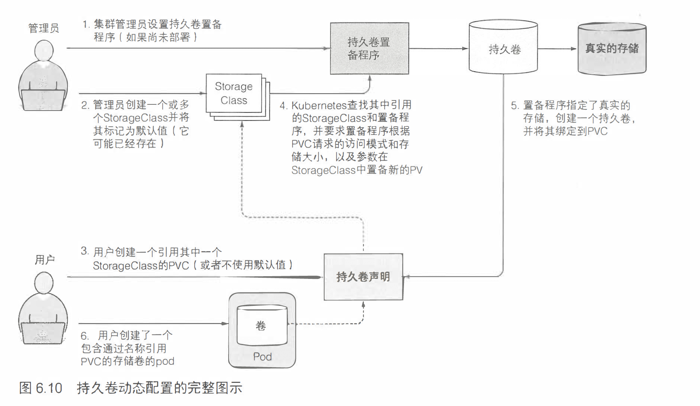

## 7. ConfigMap 和 Secret: 配置应用程序

### 7.1 配置容器化应用程序

> 为什么很多时候 docker 镜像通过环境变量传递配置参数?
>
> 1. 将配置文件打入镜像,这种类似于硬编码,每次变更需要重新 build 镜像；
> 2. 挂载卷,但是这种方式需要保证配置环境在容器启动之前写入到卷中。

### 7.2 向容器传递命令行参数

#### 7.2.1 在 docker 中定义命令与参数

##### 了解 ENTRYPOINT 和 CMD

[Dockerfile: ENTRYPOINT和CMD的区别](https://zhuanlan.zhihu.com/p/30555962)

> - 共同点
>   - ENTRYPOINT 和 CMD 都可以用来在 docker 镜像构建的过程中执行指令
> - 不同点
>   - CMD 更容易在 `docker run` 的过程中修改,而 ENTRYPOINT 需要通过 `--entrypoint` 覆盖

> 1. 永远使用 `ENTRYPOINT ["/bin/ping","-c","3"]` 这种 exec 表示法,因为 shell 表示法的主进程(PID=1) 是 shell 进程,而我们要启动的主进程反而是通过 shell 进程启动的.
> 2. `ENTRYPOINT` 和 `CMD` 可以混用,下面的例子中，CMD 将作为 ENTRYPOINT 的参数。

```docker
FROM ubuntu:trusty

ENTRYPOINT ["/bin/ping","-c","3"]
CMD ["localhost"] 
```

> 容器中运行的完整指令由两部分组成:命令与参数
>
> - ENTRYPOINT 定义容器启动时被调用的可执行程序;
> - CMD 指定传递给 ENTRYPOINT 的参数.

##### 可配置化 fortune 镜像中的间隔参数

```bash
#!/bin/bash
trap "exit" SIGINT

INTERVAL=$1
echo Configured to generate new fortune every $INTERVAL seconds

mkdir -p /var/htdocs

while :
do
  echo $(date) Writing fortune to /var/htdocs/index.html
  /usr/games/fortune > /var/htdocs/index.html
  sleep $INTERVAL
done
```

```dockerfi
FROM ubuntu:latest

RUN sed -i s@/archive.ubuntu.com/@/mirrors.aliyun.com/@g /etc/apt/sources.list
RUN apt-get clean
RUN apt-get update
RUN apt-get -y install fortune

ADD fortuneloop.sh /bin/fortuneloop.sh

RUN chmod 755 /bin/fortuneloop.sh

ENTRYPOINT ["/bin/fortuneloop.sh"]
CMD ["10"]
```

```bash
docker build -t docker.io/luksa/fortune:args .

docker push docker.io/luksa/fortune:args

docker run -it docker.io/luksa/fortune:args
#Configured to generate new fortune every 10 seconds
#Mon Nov 8 07:14:25 UTC 2021 Writing fortune to /var/htdocs/index.html

docker run -it docker.io/luksa/fortune:args 15
#Configured to generate new fortune every 15 seconds
#Mon Nov 8 07:16:18 UTC 2021 Writing fortune to /var/htdocs/index.html
```

#### 7.2.2 在 kubernetes 中覆盖命令和参数

> ENTRYPOINT 和 CMD 都可以被覆盖。

| Docker     | Kubernetes |
| ---------- | ---------- |
| ENTRYPOINT | command    |
| CMD        | args       |

```yaml
kind: Pod
spec:
  containers:
    - image: som/image
      command: ["/bin/command"]
      args: ["arg1", "arg2", "arg3"]
```

##### 用自定义间隔值运行 fortune pod

```yaml
apiVersion: v1
kind: Pod
metadata:
  name: fortune2s
spec:
  containers:
  - image: luksa/fortune:args
    #通过 args 修改参数
    args: ["2"]
    name: html-generator
    #挂载卷
    volumeMounts:
    - name: html
      mountPath: /var/htdocs
  - image: nginx:alpine
    name: web-server
    volumeMounts:
    - name: html
      mountPath: /usr/share/nginx/html
      readOnly: true
    ports:
    - containerPort: 80
      protocol: TCP
  #声明卷
  volumes:
  - name: html
    emptyDir: {}
```

### 7.3 为容器设置环境变量

```yaml
apiVersion: v1
kind: Pod
metadata:
  name: fortune-env
spec:
  containers:
  - image: luksa/fortune:env
    env:
    # 环境变量
    - name: INTERVAL
      value: "30"
    name: html-generator
    volumeMounts:
    - name: html
      mountPath: /var/htdocs
  - image: nginx:alpine
    name: web-server
    volumeMounts:
    - name: html
      mountPath: /usr/share/nginx/html
      readOnly: true
    ports:
    - containerPort: 80
      protocol: TCP
  volumes:
  - name: html
    emptyDir: {}
```

#### 7.3.2 引用其他环境变量

```yaml
env:
- name: FIRST_VAR
  value : "foo"
- name: SECOND_VAR
  value: "$(FIRST_VAR)bar"
```

### 7.4 ConfigMap 解耦配置

#### 7.4.1 ConfigMap 介绍

> ConfigMap 是 kubernetes 提供的单独的资源对象,通过环境变量或者卷文件传递给容器.

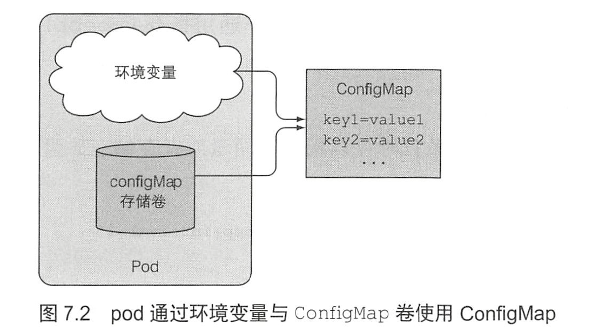

#### 7.4.2 创建 ConfigMap

```bash
# create ConfigMap
k create configmap fortune-config --from-literal=sleep-interval=25

k create configmap test-fortune-config --from-literal=foo=bar --from-literal=bar=foo --from-literal=on=two
```

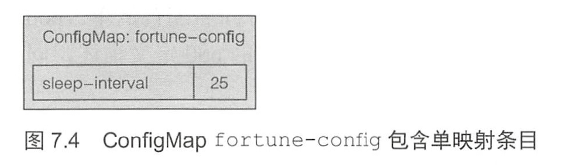

```bash
k get configmaps fortune-config -o yaml
```

##### 从内容文件创建 ConfigMap

```bash
# from config
k create configmap my-config --from-file=config-file.conf
```

#### 7.4.3 从容器传递 ConfigMap 作为环境变量

```yaml
apiVersion: v1
kind: Pod
metadata:
  name: fortune-env-from-configmap
spec:
  containers:
  - image: luksa/fortune:env
    env:
    #设置环境变量 INTERVAL
    - name: INTERVAL
      valueFrom: 
        #用 ConfigMap 初始化
        configMapKeyRef:
          #引用的 ConfigMap名称
          name: fortune-config
          #ConfigMap 下对应的键的值
          key: sleep-interval
# ...
```

#### 7.4.4 一次性传递 ConfigMap 的所有条目作为环境变量

> 假设 ConfigMap 包含了 FOO, BAR, FOO-BAR 

```yaml
spec:
  containers:
  - image: some-image
    # 使用 envFrom 字段而不是 env 字段
    envFrom:
    #所有环境变量均包含前缀 CONFIG_
    - prefix: CONFIG_
      configMapRef:
        #引用名为 my-config-map 的 ConfigMap
        name: my-config-map
```

> 对于上面的配置文件,我们就得到了 CONFIG_FOO, CONFIG_BAR
>
> 但是不会有 **CONFIG_FOO-BAR**,因为这不是一个合法的环境变量名,**创建环境变量时会忽略并且`不会`发出事件通知**

#### 7.4.5 传递 ConfigMap 条目作为命令行参数

```yaml
apiVersion: v1
kind: Pod
metadata:
  name: fortune-args-from-configmap
spec:
  containers:
  - image: luksa/fortune:args
    env:
    - name: INTERVAL
      valueFrom: 
        configMapKeyRef:
          name: fortune-config
          key: sleep-interval
    #在参数设置中引用环境变量
    args: ["$(INTERVAL)"]
#...
```

#### 7.4.6 使用 configMap 卷将条目暴露为文件

> 环境变量和参数适用于轻量的场景.configMap 中可以通过一种叫 configMap 的卷来实现重量级的配置功能.

##### my-nginx-config.conf

```config

server {
    listen              80;
    server_name         www.kubia-example.com;

    gzip on;
    gzip_types text/plain application/xml;

    location / {
        root   /usr/share/nginx/html;
        index  index.html index.htm;
    }

}
```

##### sleep-interval

```txt
25
```

```bash
k create configmap fortune-config --from-file=../configmap-files

k get cm fortune-config -o yaml
#apiVersion: v1
#data:
#  my-nginx-config.conf: |
#    server {
#        listen              80;
#        server_name         www.kubia-example.com;
#
#        gzip on;
#        gzip_types text/plain application/xml;
#
#        location / {
#            root   /usr/share/nginx/html;
#            index  index.html index.htm;
#        }
#
#    }
#  sleep-interval: |
#    25
#kind: ConfigMap
#metadata:
#  creationTimestamp: "2021-11-08T09:59:37Z"
#  managedFields:
#  - apiVersion: v1
#    fieldsType: FieldsV1
#    fieldsV1:
#      f:data:
#        .: {}
#        f:my-nginx-config.conf: {}
#        f:sleep-interval: {}
#    manager: kubectl-create
#    operation: Update
#    time: "2021-11-08T09:59:37Z"
#  name: fortune-config
#  namespace: default
#  resourceVersion: "241091"
#  uid: c759fb6e-8464-4513-9e24-4b5b8b950691
```

##### 在卷内使用 ConfigMap 的条目

```yaml
apiVersion: v1
kind: Pod
metadata:
  name: fortune-configmap-volume
spec:
  containers:
  - image: luksa/fortune:env
    #
    env:
    - name: INTERVAL
      valueFrom:
        #引用 ConfigMap fortune-config 的 sleep-interval
        configMapKeyRef:
          name: fortune-config
          key: sleep-interval
    name: html-generator
    volumeMounts:
    - name: html
      mountPath: /var/htdocs
  - image: nginx:alpine
    name: web-server
    volumeMounts:
    - name: html
      mountPath: /usr/share/nginx/html
      readOnly: true
    #挂在 configMap 到对应目录
    - name: config
      #nginx 会自动的载入 /etc/nginx/conf.d 目录下的所有 .conf 配置文件
      mountPath: /etc/nginx/conf.d
      readOnly: true
    #挂在 configMap 到对应目录
    - name: config
      mountPath: /tmp/whole-fortune-config-volume
      readOnly: true
    ports:
      - containerPort: 80
        name: http
        protocol: TCP
  volumes:
  - name: html
    emptyDir: {}
  #使用 ConfigMap volume
  - name: config
    configMap:
      name: fortune-config
```

##### 卷内暴露指定的 ConfigMap 条目

```yaml
apiVersion: v1
kind: Pod
metadata:
  name: fortune-configmap-volume-with-items
spec:
  containers:
  - image: luksa/fortune:env
    name: html-generator
    volumeMounts:
    - name: html
      mountPath: /var/htdocs
  - image: nginx:alpine
    name: web-server
    volumeMounts:
    - name: html
      mountPath: /usr/share/nginx/html
      readOnly: true
    - name: config
      mountPath: /etc/nginx/conf.d/
      readOnly: true
    ports:
    - containerPort: 80
      protocol: TCP
  volumes:
  - name: html
    emptyDir: {}
  - name: config
    configMap:
      #选择包含在卷中的条目
      name: fortune-config
      items:
      #该键对应的条目被包含
      - key: my-nginx-config.conf
        #条目的值被存储在该文件中
        path: gzip.conf
```

```bash
k exec fortune-configmap-volume-with-items -c web-server -- ls /etc/nginx/conf.d
#gzip.conf
```

### 7.5 使用 Secret 给容器传递敏感数据

> Secret 和 ConfigMap 类似,也是键值对.

## 8. 从应用访问pod元数据以及其他资源

### 8.1 通过 Downward API 传递元数据

> Downward API 允许我们通过环境变量或者文件(在 downwardAPI 卷中)传递 pod 的元数据

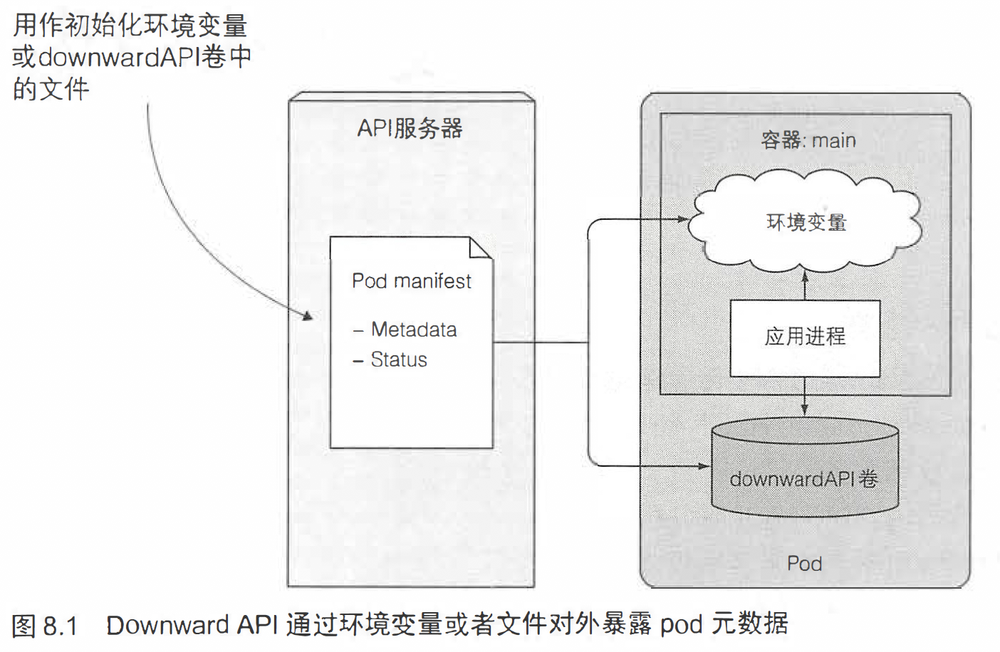

#### 8.1.2 通过环境变量暴露元数据

```yaml
apiVersion: v1
kind: Pod
metadata:
  name: downward
spec:
  containers:
  - name: main
    image: busybox
    command: ["sleep", "9999999"]
    resources:
      requests:
        cpu: 15m
        memory: 100Ki
      limits:
        cpu: 100m
        memory: 4Mi
    env:
    - name: POD_NAME
      #引用 pod manifest 中的元数据名称字段,而不是设定一个具体的值
      valueFrom:
        fieldRef:
          fieldPath: metadata.name
    - name: POD_NAMESPACE
      valueFrom:
        fieldRef:
          fieldPath: metadata.namespace
    - name: POD_IP
      valueFrom:
        fieldRef:
          fieldPath: status.podIP
    - name: NODE_NAME
      valueFrom:
        fieldRef:
          fieldPath: spec.nodeName
    - name: SERVICE_ACCOUNT
      valueFrom:
        fieldRef:
          fieldPath: spec.serviceAccountName
    - name: CONTAINER_CPU_REQUEST_MILLICORES
      valueFrom:
        #容器请求的CPU和内存使用量是引用 resourceFieldRef 字段而不是 fieldRef
        resourceFieldRef:
          resource: requests.cpu
          divisor: 1m
    #对于资源相关的字段,我们定义一个基数单位,从而生成每一部分的值
    - name: CONTAINER_MEMORY_LIMIT_KIBIBYTES
      valueFrom:
        resourceFieldRef:
          resource: limits.memory
          divisor: 1Ki
```

#### 8.1.3 通过 downwardAPI 卷来传递元数据

```yaml
apiVersion: v1
kind: Pod
metadata:
  #通过 downwardAPI 卷来暴露这些标签和注解
  name: downward
  labels:
    foo: bar
  annotations:
    key1: value1
    key2: |
      multi
      line
      value
spec:
  containers:
  - name: main
    image: busybox
    command: ["sleep", "9999999"]
    resources:
      requests:
        cpu: 15m
        memory: 100Ki
      limits:
        cpu: 100m
        memory: 4Mi
    #在 /etc/downward 下挂在 downward volume
    volumeMounts:
    - name: downward
      mountPath: /etc/downward
  volumes:
  #通过将卷名设定为 downward 来定义一个 downwardAPI 卷
  - name: downward
    downwardAPI:
      #将 manifest 文件中的 metadata.name 字段写入 podName
      items:
      - path: "podName"
        fieldRef:
          fieldPath: metadata.name
      - path: "podNamespace"
        fieldRef:
          fieldPath: metadata.namespace
      #pod 的标签将被保存到 /etc/downward/labels 文件中,因为 volume 被挂在在 /etc/downward 下
      - path: "labels"
        fieldRef:
          fieldPath: metadata.labels
      - path: "annotations"
        fieldRef:
          fieldPath: metadata.annotations
      - path: "containerCpuRequestMilliCores"
        resourceFieldRef:
          containerName: main
          resource: requests.cpu
          divisor: 1m
      - path: "containerMemoryLimitBytes"
        resourceFieldRef:
          #必须指定容器名
          containerName: main
          resource: limits.memory
          divisor: 1
```

```bash
k exec -it downward -- ls /etc/downward
#annotations                    labels
#containerCpuRequestMilliCores  podName
#containerMemoryLimitBytes      podNamespace

k exec -it downward -c main -- cat /etc/downward/annotations
#key1="value1"
#key2="multi\nline\nvalue\n"
#kubectl.kubernetes.io/default-container="main"
#...
```

##### 修改 labels 和 annotations

> 可以在pod运行时修改标签和注解,当标签和注解被修改之后kubernetes会更新存有相关信息的文件.但是通过环境变量运行时是不会修改的.
>
> 而我们通过 downwardAPI 卷则是通过 `fieldRef` 引用的是可以生效的

##### 在卷的定义中引用容器级的元数据

> 引用 `容器级` 的元数据,是因为我们对于卷的定义是 pod 级的而不是容器级的.

```yaml
spec:
  volumes:
  - name: downward
    downwardAPI:
      items:
      - path: "containerCpuRequestMilliCores"
        resourceFieldRef:
          #必须指定容器名
          containerName: main
          resource: requests.cpu
          divisor: 1m
```

### 8.2 与 kubernetes API 服务器交互

> 通过 downwardAPI 只能暴露一个 pod 自身的元数据,也只能暴露一部分元数据.
>
> 如果我们需要获取所有的 pod 的元数据,就需要直接与API服务器进行交互.

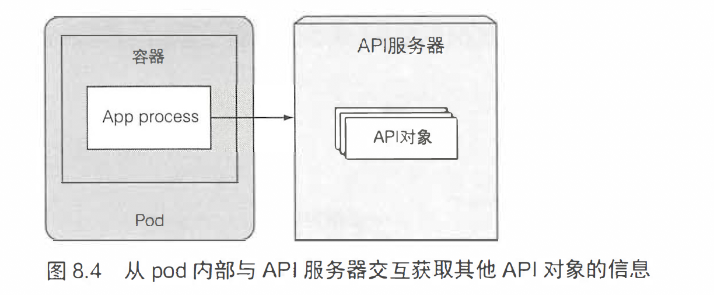

#### 8.2.1 探索 kubernetes REST API

```bash
# 获取服务集群信息
k cluster-info
#Kubernetes master is running at https://192.168.99.100:8443
#KubeDNS is running at https://192.168.99.100:8443/api/v1/namespaces/kube-system/services/kube-dns:dns/proxy
#
#To further debug and diagnose cluster problems, use 'kubectl cluster-info dump'.
```

##### 通过 kubectl proxy 访问 API 服务器

> kubectl proxy 启动一个代理服务器做代理.

```bash
k proxy
#Starting to serve on 127.0.0.1:8001
```

##### 通过 kubectl proxy 研究 kubernetes API

- `/api/v1` 对应 apiVersion

##### 研究批量API组的 REST endpoint

```bash
curl http://localhost:8001/apis/batch
```

```json
{
  "kind": "APIGroup",
  "apiVersion": "v1",
  "name": "batch",
  "versions": [
    {
      "groupVersion": "batch/v1",
      "version": "v1"
    },
    {
      "groupVersion": "batch/v1beta1",
      "version": "v1beta1"
    }
  ],
  "preferredVersion": {
    "groupVersion": "batch/v1",
    "version": "v1"
  }
}
```

> - versions 是一个长度为2的数组,因为它包含了 v1 和 v1beta 两个版本
> - preferredVersion 表示客户端应该使用 v1 版本

##### /apis/batch/v1

> - kind, apiVersion, groupVersion 是在 batch/v1 API 组中的API资源清单
> - resources 包含了这个组中所有的资源类型
> - resources[0].name 和 resources[1].name 分别表示了 job 资源以及 job 资源的状态
> - resources[].verbs 给出了资源对应可以使用的操作.

```bash
curl http://localhost:8001/apis/batch/v1
```

```json
{
  "kind": "APIResourceList",
  "apiVersion": "v1",
  "groupVersion": "batch/v1",
  "resources": [
    {
      "name": "jobs",
      "singularName": "",
      "namespaced": true,
      "kind": "Job",
      "verbs": [
        "create",
        "delete",
        "deletecollection",
        "get",
        "list",
        "patch",
        "update",
        "watch"
      ],
      "categories": [
        "all"
      ],
      "storageVersionHash": "mudhfqk/qZY="
    },
    {
      "name": "jobs/status",
      "singularName": "",
      "namespaced": true,
      "kind": "Job",
      "verbs": [
        "get",
        "patch",
        "update"
      ]
    }
  ]
}
```

##### 列举集群中所有的 job 实例

> 通过 kubernetes API 得到的结果和 kubectl 得到的结果是匹配的.

```bash
curl http://localhost:8001/apis/batch/v1/jobs

k get jobs -A
```

##### 通过名称restore一个指定的 job 实例

> job 实例
>
> - namespaces : ingress-nginx
> - name : ingress-nginx-admission-create

```bash
#Jobs
curl http://localhost:8001/apis/batch/v1/namespaces/ingress-nginx/jobs/ingress-nginx-admission-create
```

#### 8.2.2 从 pod 内部与 API 服务器交互

```yaml
apiVersion: v1
kind: Pod
metadata:
  name: curl
spec:
  containers:
  - name: main
    image: tutum/curl
    command: ["sleep", "9999999"]
```

```bash
# 进入 curl
k exec -it curl -c main -- bash

# 查看 ca 证书
ls /var/run/secrets//kubernetes.io/serviceaccount/

# 通过证书访问
curl --cacert /var/run/secrets//kubernetes.io/serviceaccount/ca.crt https://kubernetes

# export 证书，这样我们可以直接 curl
export CURL_CA_BUNDLE=var/run/secrets//kubernetes.io/serviceaccount/ca.crt

TOKEN=$(cat /var/run/secrets/kubernetes.io/serviceaccount/token)

curl -H "Authorization: Bearer $TOKEN" https://kubernetes
```

##### 关闭基于角色的控制访问（RBAC)

```bash
k create clusterrolebinding permissive-binding \
--clusterrole=cluster-admin \
--group=system:serviceaccounts
```

##### 获取当前运行 pod 所在的命名空间

```bash
NS=$(cat /var/run/secrets/kubernetes.io/serviceaccount/namespace)

# 获取命名空间下的所有 pods
curl -H "Authorization: Bearer $TOKEN" https://kubernetes/api/v1/namespaces/$NS/pods
```

#### 8.2.3 通过 ambassador 容器简化与 API 服务器的交互

##### ambassador 容器模式介绍


##### 运行带有附加 ambassador 容器的 CURL pod

```yaml
apiVersion: v1
kind: Pod
metadata:
  name: curl-with-ambassador
spec:
  containers:
  - name: main
    image: tutum/curl
    command: ["sleep", "9999999"]
  # 额外运行一个 ambassador 容器
  - name: ambassador
    image: luksa/kubectl-proxy:1.6.2
```

```bash
# 
k exec -it curl-with-ambassador -c main -- bash

# 直接访问 ambassador 容器内的 kubectl proxy
curl localhost:8001
```

#### 8.2.4 使用客户端库与API服务器交互

```go
package main

import (
	"context"
	"testing"
	"time"

	v1 "k8s.io/api/core/v1"
	metav1 "k8s.io/apimachinery/pkg/apis/meta/v1"
	"k8s.io/apimachinery/pkg/util/wait"
	"k8s.io/apimachinery/pkg/watch"
	"k8s.io/client-go/informers"
	"k8s.io/client-go/kubernetes/fake"
	clienttesting "k8s.io/client-go/testing"
	"k8s.io/client-go/tools/cache"
)

// TestFakeClient demonstrates how to use a fake client with SharedInformerFactory in tests.
func TestFakeClient(t *testing.T) {
	ctx, cancel := context.WithCancel(context.Background())
	defer cancel()

	watcherStarted := make(chan struct{})
	// Create the fake client.
	client := fake.NewSimpleClientset()
	// A catch-all watch reactor that allows us to inject the watcherStarted channel.
	client.PrependWatchReactor("*", func(action clienttesting.Action) (handled bool, ret watch.Interface, err error) {
		gvr := action.GetResource()
		ns := action.GetNamespace()
		watch, err := client.Tracker().Watch(gvr, ns)
		if err != nil {
			return false, nil, err
		}
		close(watcherStarted)
		return true, watch, nil
	})

	// We will create an informer that writes added pods to a channel.
	pods := make(chan *v1.Pod, 1)
	informers := informers.NewSharedInformerFactory(client, 0)
	podInformer := informers.Core().V1().Pods().Informer()
	podInformer.AddEventHandler(&cache.ResourceEventHandlerFuncs{
		AddFunc: func(obj interface{}) {
			pod := obj.(*v1.Pod)
			t.Logf("pod added: %s/%s", pod.Namespace, pod.Name)
			pods <- pod
		},
	})

	// Make sure informers are running.
	informers.Start(ctx.Done())

	// This is not required in tests, but it serves as a proof-of-concept by
	// ensuring that the informer goroutine have warmed up and called List before
	// we send any events to it.
	cache.WaitForCacheSync(ctx.Done(), podInformer.HasSynced)

	// The fake client doesn't support resource version. Any writes to the client
	// after the informer's initial LIST and before the informer establishing the
	// watcher will be missed by the informer. Therefore we wait until the watcher
	// starts.
	// Note that the fake client isn't designed to work with informer. It
	// doesn't support resource version. It's encouraged to use a real client
	// in an integration/E2E test if you need to test complex behavior with
	// informer/controllers.
	<-watcherStarted
	// Inject an event into the fake client.
	p := &v1.Pod{ObjectMeta: metav1.ObjectMeta{Name: "my-pod"}}
	_, err := client.CoreV1().Pods("test-ns").Create(context.TODO(), p, metav1.CreateOptions{})
	if err != nil {
		t.Fatalf("error injecting pod add: %v", err)
	}

	select {
	case pod := <-pods:
		t.Logf("Got pod from channel: %s/%s", pod.Namespace, pod.Name)
	case <-time.After(wait.ForeverTestTimeout):
		t.Error("Informer did not get the added pod")
	}
}
```

## 9. Deployment： 声明式的升级应用

> Deployment 是一种基于 ReplicaSet 的资源。

### 9.1 更新运行在pod内的应用程序

pod 在发布新版本时有两种方法：

- 删除现有pod，创新新 pod
- 创建新 pod，然后一次性删除老的 pod，或者按照顺序创建新的 pod，然后一次创建老的 pod

两种方法都有一定的问题：

1. 第一种方法会导致服务有一段时间不可用；
2. 第二种方法会导致服务版本不一致，如果存在状态（比如写入数据库）可能会导致数据异常；

#### 9.1.1 删除旧版本 pod，使用新版本 pod 替换

> 如果可以接受短暂服务不可用，那可以使用这个方案

#### 9.1.2 先创建新pod，再删除旧版本pod

> 下面就是所谓的 **蓝绿部署**

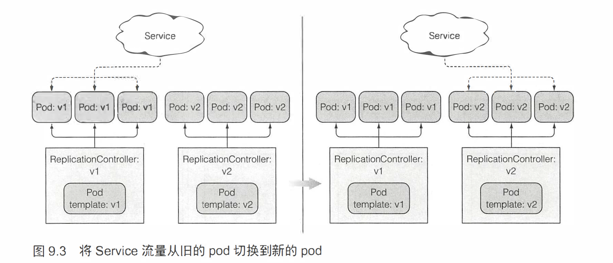

> 滚动升级

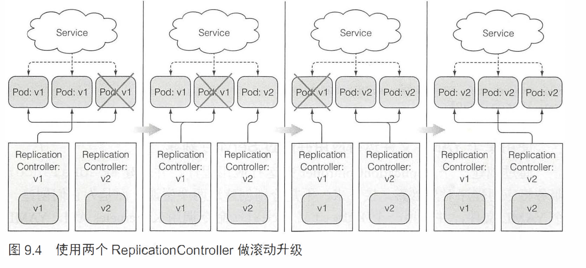

### 9.2 使用 rc 实现自动的滚动升级

> 这是一种相对过时的升级方式，不过不用引入新的概念。

#### 9.2.1 运行第一个版本的应用

```js
// app.js v1
const http = require('http');
const os = require('os');

console.log("Kubia server starting...");

var handler = function(request, response) {
  console.log("Received request from " + request.connection.remoteAddress);
  response.writeHead(200);
  response.end("This is v1 running in pod " + os.hostname() + "\n");
};

var www = http.createServer(handler);
www.listen(8080);

```

```yaml
apiVersion: v1
kind: ReplicationController
metadata:
  name: kubia-v1
spec:
  replicas: 3
  template:
    metadata:
      name: kubia
      labels:
        app: kubia
    spec:
      containers:
      - image: luksa/kubia:v1
        name: nodejs
---
apiVersion: v1
kind: Service
metadata:
  name: kubia
spec:
  type: LoadBalancer
  selector:
    app: kubia
  ports:
  - port: 80
    targetPort: 8080
```

#### 9.2.2 使用 kubectl 来执行滚动升级

##### 使用相同的 tag 推送更新过后的镜像

> 如果使用了一个非 latest 的镜像 tag，例如 v1。那么 kubernetes 在先拉取本地缓存。也就是说，可能会导致变更无法生效。
>
> 可以设置容器的 `imagePullPolicy` 设置为 always

```yaml
# 滚动升级，不过 rolling-update lastest 已经废弃
k rollout kubia-v1 kubia-v2 --image=luksa/kubia:v2
```

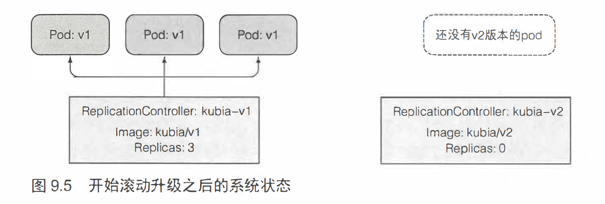

##### 了解滚动升级前 kubectl 所执行的操作

> 在滚动升级前，kubernetes 会修改这些属性：
>
> 1. 为 v2 rc 的 selector 增加 `deployment=xxx`，这是为了防止 v2 rc 匹配到老的 v1 pod
> 2. 为 v1 rc 的 selector 增加 `deployment=yyy`，这是为了防止 v1 rc 匹配到 v2 pod
> 3. 为 v1 pod 增加 `deployment=yyy`，防止 v1 rc 匹配不到 pod

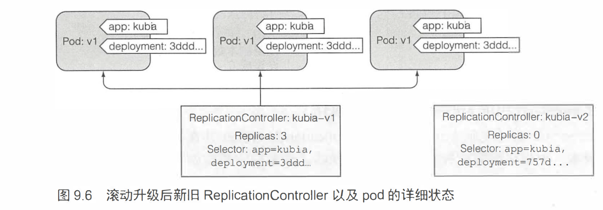

##### 通过伸缩两个 rc 完成滚动升级

> 不断的通过减小 v1 pod 的副本数，然后增大 v2 pod 的副本数。直到 v1 pod 副本数减小到 0.

#### 9.2.3 为什么 rolling-update 过时了

> 1. 这个过程会直接修改创建的对象（会修改 pod 和 rc 的标签）
> 2. **kubectl 只是执行滚动升级的客户端**，例如：在上面的过程中，kubectl 会给服务端发送三次修改 v1 pod 副本数的命令，而不是 kubernetes master 执行的。

### 9.3 使用 Deployment 声明式的升级应用

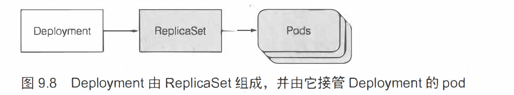

> 为什么要在 rs 或者 rc 上引入一个对象？
>
> 因为在 <9.2> 的例子中，我们要升级一个应用的时候，需要引入一个额外的 rc，并协调两个 rc。
>
> Deployment 就是为了负责解决这个问题。

#### 9.3.1 创建一个 Deployment

```yaml
apiVersion: apps/v1
kind: Deployment
metadata:
  name: kubia
spec:
  replicas: 3
  template:
    metadata:
      name: kubia
      labels:
        app: kubia
    spec:
      containers:
      - image: luksa/kubia:v1
        name: nodejs
  selector:
    matchLabels:
      app: kubia
```

##### 创建 Deployment 资源

```bash
# --record 会记录历史版本号
k create -f kubia-deployment-v1.yaml --record
```

##### 展示 Deployment 滚动过程中的状态

```bash
# 状态
k rollout status deployment kubia
```

##### 了解 Deployment 如何创建 rs 以及 pod

> rs 包含了 pod 模板的哈希值。

```bash
k get deploy -o wide --show-labels
#kubia   3/3     3            3           138m   nodejs       luksa/kubia:v1   app=kubia   <none>


k get rs -o wide --show-labels
#kubia-74967b5695   3         3         3       140m   nodejs       luksa/kubia:v1   app=kubia,pod-template-hash=74967b5695   app=kubia,pod-template-hash=74967b5695

k get pods -o wide --show-labels
#kubia-74967b5695   3         3         3       139m   nodejs       luksa/kubia:v1   app=kubia,pod-template-hash=74967b5695   app=kubia,pod-template-hash=74967b5695
```

##### 通过 service 访问 pod

> deploy 创建了 rs，rs 创建了 pod。
>
> deploy 通过 `app=kubia` 匹配 rs，rs 通过 `app=kubia,pod-template-hash=74967b5695` 来匹配 pods

#### 9.3.2 升级 Deployment

##### 不同的 Deployment 升级策略

> - RollingUpdate（默认）
> - Recreate

##### 演示如何减慢滚动升级速度

```bash
k patch deploy kubia -p '{"spec": {"minReadySeconds": 10}}'
```

##### 触发滚动升级

```bash
#触发滚动升级
#nodejs 是 deploy.spec.template.spec.containers.name
k set image deployment kubia nodejs=luksa/kubia:v2
```

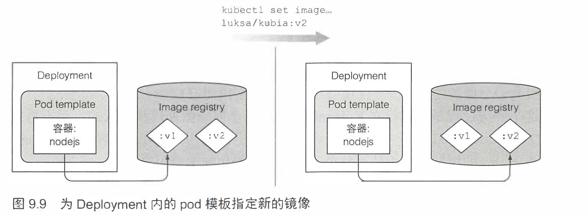

##### Deployment 的优点

> 注意，deployment 引用 ConfigMap 或者 Secret，更改 ConfigMap 或 Secret 不会触发升级操作。
>
> 可以创建一个新的 ConfigMap，并修改 pod 模板引用新的 ConfigMap 来实现更新。

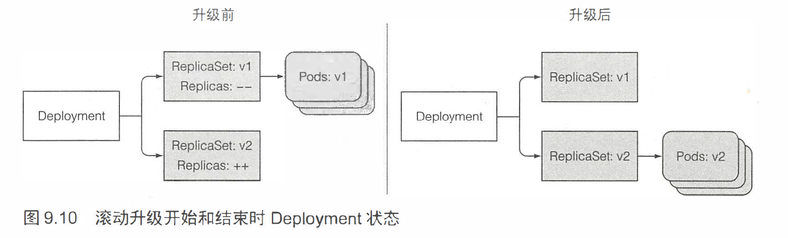

#### 9.3.3 回滚deployment

```bash
# 部署 v3 版本
k set image deployment kubia nodejs=luksa/kubia:v3

# 查看回滚日志
k rollout status deployment kubia

# 回滚升级
k rollout undo deployment kubia

# 显示滚动升级历史
k rollout history deployment kubia

# 切换到指定版本
k rollout undo deployment kubia --to-revision=1
```

#### 9.3.5 暂停滚动升级

```bash
# 滚动升级到 v4
k set image deployment kubia nodejs=luksa/kubia:v4

# 暂停滚动升级
k rollout pause deployment kubia

# 恢复滚动升级
k rollout resume deployment kubia
```

#### 9.3.6 组织出错版本的滚动升级

##### 了解 minReadySeconds 的用处

> minReadySeconds 指定 pod 至少运行成功多久之后，才能将其视为可用。在这之前，滚动升级的过程不会继续。 

##### 配置就绪指针阻止全部 v3 版本的滚动部署

> pod 在状态 **保持就绪，并持续10s** 才会开始部署下一个 pod。

```yaml
apiVersion: apps/v1beta1
kind: Deployment
metadata:
  name: kubia
spec:
  replicas: 3
  # 设置 pod 至少需要运行成功 10s
  minReadySeconds: 10
  strategy:
    rollingUpdate:
      maxSurge: 1
      # 设置集群内最大不可以 pod 数
      maxUnavailable: 0
    type: RollingUpdate
  template:
    metadata:
      name: kubia
      labels:
        app: kubia
    spec:
      containers:
      - image: luksa/kubia:v3
        name: nodejs
        readinessProbe:
          # 就绪指针每秒执行一次
          periodSeconds: 1
          # http 指针
          httpGet:
            path: /
            port: 8080
```

## 10. StatefulSet：部署有状态的多副本应用

### 10.1 复制有状态 pod

> rs 是在 `template` 里关联 pvc 的，又会依据 `template` 实例化多个 pod，则不能对每个副本都指定独立的 pvc。

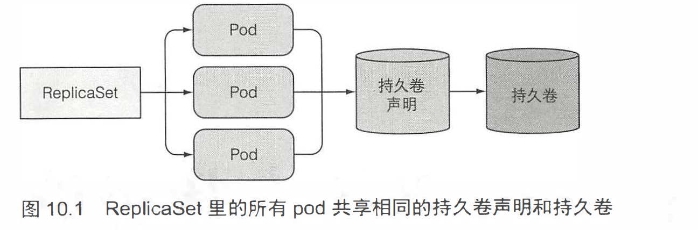

#### 10.1.2 每个 pod 都提供稳定的标识

> 当启动的实例拥有全新的网络标识，但是还使用旧实例的数据可能会引起问题。
>
> 所以我们希望 pod 拥有稳定的标识（例如重启之后IP不会变更）。

### 10.2 StatefulSet

> 使用 StatefulSet 代替 ReplicaSet

#### 10.2.2 提供稳定的网络标识

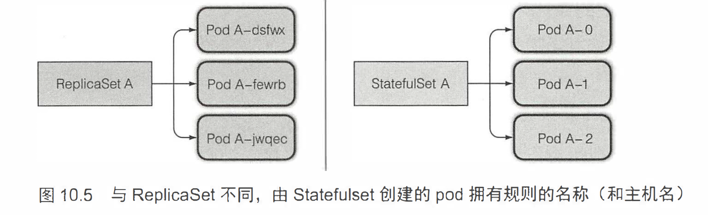

##### 控制服务介绍

> 对于有状态的服务来说，我们通常是希望操作的是 Set 中 **特定的一个**

##### 替换消失的 pod

> 通常来说，假设一个 `pod A-0` 所在的 node 发生故障，那么 `pod A-0` 会在一个全新的节点上启动，并且他的名字还是 `pod A-0`

##### 扩缩容 StatefulSet

> - 扩容时将使用下一个没有被使用的索引
> - 缩容时将删除当前最大的索引

> **StatefulSet 在缩容时只会操作一个 pod 实例，并且在集群有不健康节点的时候也不允许执行缩容操作。**

#### 为每个有状态实例提供稳定的专属存储

##### 在 pod 模板中添加卷声明模板

> pvc 会在**创建pod前**创建出来并绑定到一个pod实例上。

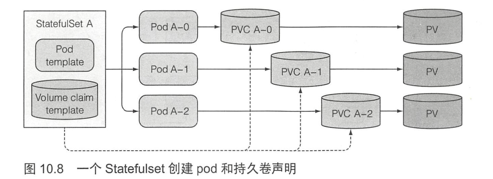

##### 持久卷的创建和删除

> - 扩容 StatefulSet 时，会创建一个 pod 和一个或多个 pvc
> - 缩容时，会删除 pod 并保留 pvc，因为删除 pvc 会导致 pv 被删除，上面的数据会丢失。因此我们需要手动的删除 pvc。

##### 重新挂载持久卷声明到相同pod的新实例上

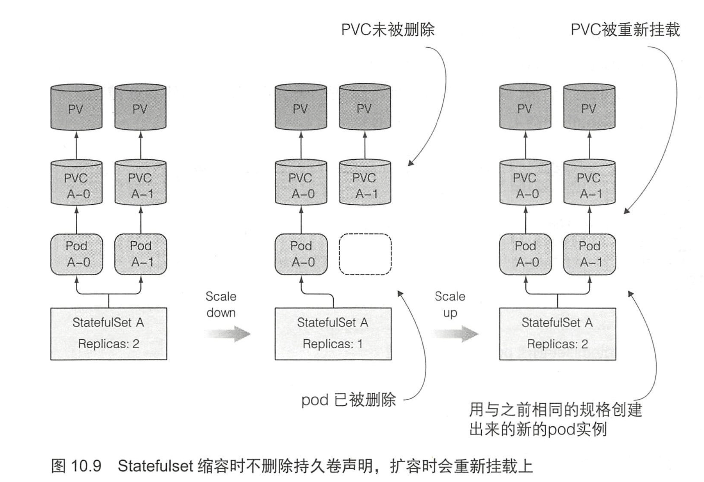

#### 10.2.4 StatefulSet 的保障

##### 稳定标识和独立存储的影响

> - 对于 StatefulSet，kubernetes 总是保证它会被一个完全一致的 pod 替换（相同的名称，主机名和存储等）；

### 10.3 使用 Stateful

#### 10.3.1 创建应用和容器镜像

```javascript
const http = require('http');
const os = require('os');
const fs = require('fs');

const dataFile = "/var/data/kubia.txt";

function fileExists(file) {
  try {
    fs.statSync(file);
    return true;
  } catch (e) {
    return false;
  }
}

var handler = function(request, response) {
  // 在post请求中把body存储到一个文件
  if (request.method == 'POST') {
    var file = fs.createWriteStream(dataFile);
    file.on('open', function (fd) {
      request.pipe(file);
      console.log("New data has been received and stored.");
      response.writeHead(200);
      response.end("Data stored on pod " + os.hostname() + "\n");
    });
  } else {
	// 在 get 请求中返回主机名和数据文件的内容
    var data = fileExists(dataFile) ? fs.readFileSync(dataFile, 'utf8') : "No data posted yet";
    response.writeHead(200);
    response.write("You've hit " + os.hostname() + "\n");
    response.end("Data stored on this pod: " + data + "\n");
  }
};

var www = http.createServer(handler);
www.listen(8080);
```

#### 10.3.2 通过 StatefulSet 来部署应用

##### 为什么需要 headless server

> 与普通的 pod 不一样的是，有状态的 pod 有时候需要通过主机名来定位，而无状态的 pod 则不需要。对于有状态的 pod 来说，我们通常希望操作的是其中特定的一个。
>
> 基于以上原因，一个 StatefulSet 通常要求我们创建一个用来记录每个 pod 网络标记的 headless service。通过这个 service 每个 pod 将拥有独立的 DNS 记录。
>
> 比如，一个在 default 命名空间，名为 foo 的控制服务，它的一个 pod 名称为 A-0，那么可以通过 **a-0.foo.default.svc.cluster.local** 来访问，这在 rs 中是行不通的。

##### 创建 pv

```yaml
#描述需要创建三个 pv
kind: List
apiVersion: v1
items:
- apiVersion: v1
  #指定需要创建的是 pv
  kind: PersistentVolume
  metadata:
    name: pv-a
  spec:
    capacity:
      storage: 1Mi
    accessModes:
      - ReadWriteOnce
    #当卷被声明释放后，空间会被回收再利用
    #所以，我们在和 StatefulSet 合并使用的时候，ss 不会自动的清理 pvc 以避免该卷被回收
    persistentVolumeReclaimPolicy: Recycle
    hostPath:
      path: /tmp/pv-a
- apiVersion: v1
  kind: PersistentVolume
  metadata:
    name: pv-b
  spec:
    capacity:
      storage: 1Mi
    accessModes:
      - ReadWriteOnce
    persistentVolumeReclaimPolicy: Recycle
    hostPath:
      path: /tmp/pv-b
- apiVersion: v1
  kind: PersistentVolume
  metadata:
    name: pv-c
  spec:
    capacity:
      storage: 1Mi
    accessModes:
      - ReadWriteOnce
    persistentVolumeReclaimPolicy: Recycle
    hostPath:
      path: /tmp/pv-c
```

##### 创建控制 service

```yaml
apiVersion: v1
kind: Service
metadata:
  name: kubia
spec:
  #指定 headless 模式
  clusterIP: None
  selector:
    app: kubia
  ports:
  - name: http
    #这里注意一个问题，我们不需要配置 targetPort: 8080，而是在访问时手动的加上 8080 端口
    #因为这是 headless 模式，我们是直连 pod 的。
    port: 80
```

##### 创建 StatefulSet 清单

```yaml
apiVersion: apps/v1
#指定使用 ss
kind: StatefulSet
metadata:
  name: kubia
spec:
  serviceName: kubia
  replicas: 2
  #StatefulSet 创建的 pod 都带有 app=kubia 标签
  selector:
    matchLabels:
      # has to match .spec.template.metadata.labels
      app: kubia
  template:
    metadata:
      labels:
        app: kubia
    spec:
      containers:
      - name: kubia
        image: luksa/kubia-pet
        ports:
        - name: http
          containerPort: 8080
        volumeMounts:
        - name: data
          #指定 pv 被绑定到 /var/data
          mountPath: /var/data
  volumeClaimTemplates:
  - metadata:
      name: data
    spec:
      resources:
        requests:
          storage: 1Mi
      accessModes:
      - ReadWriteOnce
```

##### 关联 StatefulSet

> StatefulSet 会等待第一个 pod 启动并就绪之后再启动第二个 pod。

#### 10.3.3 使用 pod

##### 通过API服务器与pod通信

```bash
#开启 proxy
k proxy

#发送请求到 kubia-0 pod
curl localhost:8001/api/v1/namespaces/default/pods/kubia-0/proxy/

curl -X POST -d "Hey there! This greeting was submitted to kubia-0." localhost:8001/api/v1/namespaces/default/pods/kubia-0/proxy/

curl localhost:8001/api/v1/namespaces/default/pods/kubia-0/proxy/
#You've hit kubia-0
#Data stored on this pod: Hey there! This greeting was submitted to kubia-0.
```

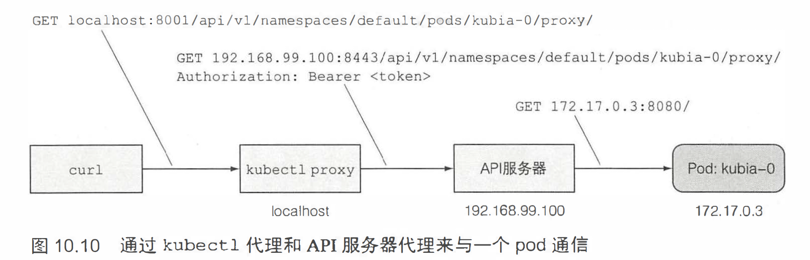

##### 扩缩容 StatefulSet

> 缩容一个会首先删除最高索引的 pod，等这个 pod 被完全终止之后才会开始删除拥有次高索引的 pod。

##### 通过非headless的service暴露StatefulSet的pod

> 通过 API 服务器，我们可以随机的访问 StatefulSet 的 pod，后续我们会改进它。

```yaml
apiVersion: v1
kind: Service
metadata:
  name: kubia-public
spec:
  selector:
    app: kubia
  ports:
  - port: 80
    targetPort: 8080
```

```bash
k proxy

curl localhost:8001/api/v1/namespaces/default/services/kubia-public/proxy/
#You've hit kubia-1
#Data stored on this pod: No data posted yet

curl localhost:8001/api/v1/namespaces/default/services/kubia-public/proxy/
#You've hit kubia-0
#Data stored on this pod: Hey there! This greeting was submitted to kubia-0.
```

### 10.4 在 StatefulSet 中发现伙伴节点

##### 介绍SRV记录

> SRV记录用来指向提供指定服务的服务器的主机名和端口号，kubernetes 通过一个 headless service 创建 SRV 记录来指向 pod 的主机名

```bash
#
k run --rm -it srvlookup --image=tutum/dnsutils --restart=Never -- dig SRV kubia.default.svc.cluster.local
```

>;; ANSWER SECTION:
>kubia.default.svc.cluster.local. 30 IN	SRV	0 50 8080 kubia-0.kubia.default.svc.cluster.local.
>kubia.default.svc.cluster.local. 30 IN	SRV	0 50 8080 kubia-1.kubia.default.svc.cluster.local.
>
>
>
>;; ADDITIONAL SECTION:
>kubia-1.kubia.default.svc.cluster.local. 30 IN A 10.244.3.30
>kubia-0.kubia.default.svc.cluster.local. 30 IN A 10.244.3.29

#### 10.4.1 通过DNS实现伙伴间的彼此发现

```javascript
const http = require('http');
const os = require('os');
const fs = require('fs');
const dns = require('dns');

const dataFile = "/var/data/kubia.txt";
const serviceName = "kubia.default.svc.cluster.local";
const port = 8080;


function fileExists(file) {
  try {
    fs.statSync(file);
    return true;
  } catch (e) {
    return false;
  }
}

// 对于 get 请求返回
function httpGet(reqOptions, callback) {
  return http.get(reqOptions, function(response) {
    var body = '';
    response.on('data', function(d) { body += d; });
    response.on('end', function() { callback(body); });
  }).on('error', function(e) {
    callback("Error: " + e.message);
  });
}

var handler = function(request, response) {
  // 如果是 POST 请求那么将数据写入文件
  if (request.method == 'POST') {
    var file = fs.createWriteStream(dataFile);
    file.on('open', function (fd) {
      request.pipe(file);
      response.writeHead(200);
      response.end("Data stored on pod " + os.hostname() + "\n");
    });
  } else {
    response.writeHead(200);
	// 如果 url 以 /data 结尾则返回存储的数据
    if (request.url == '/data') {
      var data = fileExists(dataFile) ? fs.readFileSync(dataFile, 'utf8') : "No data posted yet";
      response.end(data);
    } else {
      response.write("You've hit " + os.hostname() + "\n");
      response.write("Data stored in the cluster:\n");
	  // 与SRV记录对应的每个pod通信获取其数据
      dns.resolveSrv(serviceName, function (err, addresses) {
        if (err) {
          response.end("Could not look up DNS SRV records: " + err);
          return;
        }
        var numResponses = 0;
        if (addresses.length == 0) {
          response.end("No peers discovered.");
        } else {
          addresses.forEach(function (item) {
            var requestOptions = {
              host: item.name,
              port: port,
              path: '/data'
            };
            httpGet(requestOptions, function (returnedData) {
              numResponses++;
              response.write("- " + item.name + ": " + returnedData + "\n");
              if (numResponses == addresses.length) {
                response.end();
              }
            });
          });
        }
      });
    }
  }
};

var www = http.createServer(handler);
www.listen(port);
```

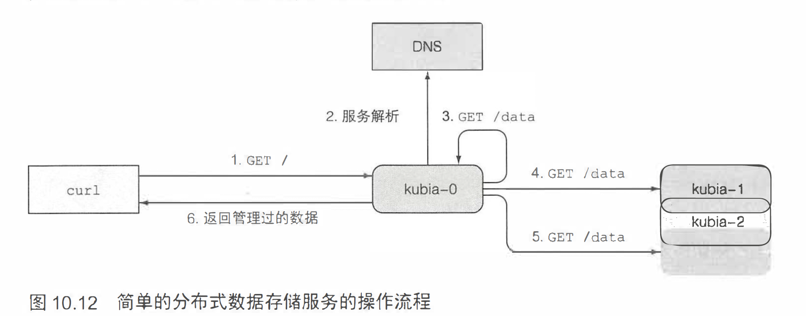

#### 10.4.2 更新 StatefulSet

#### 10.4.3 尝试集群数据存储

```bash
#多次执行写入数据
curl -X POST -d "The sun is shining" localhost:8001/api/v1/namespaces/default/services/kubia-public/proxy/
curl -X POST -d "The sun is shining" localhost:8001/api/v1/namespaces/default/services/kubia-public/proxy/
curl -X POST -d "The sun is shining" localhost:8001/api/v1/namespaces/default/services/kubia-public/proxy/
#...

#分布式查询
curl localhost:8001/api/v1/namespaces/default/services/kubia-public/proxy/
#You've hit kubia-0
#Data stored in the cluster:
#- kubia-0.kubia.default.svc.cluster.local: The sun is shining
#- kubia-1.kubia.default.svc.cluster.local: The sun is shining
#- kubia-2.kubia.default.svc.cluster.local: No data posted yet
```

### 10.5 了解 StatefulSet 如何处理故障节点

> StatefulSet 在节点故障的时候，由于节点无法通信，所以节点状态会变成 `unknown` ，在持续一段时间之后，master节点上的K8S控制平面就会自动将Pod从故障节点上驱逐，但是因为故障节点上的Kubelet连不上master节点了，Pod的状态就一直保持在`Terminating`，Pod还会继续运行。
>
> 这时候即使你主动执行`kubectl delete po`删除Pod，也并不会起作用，Pod的状态还是`Terminating`，因为API server收不到Kubelet真实删除Pod的反馈。所以只能执行强制删除Pod的命令：

```bash
# --grace-period=0，Pod会在其进程完成后正常终止，K8S默认正常终止时间段为30s，删除Pod时可以替换此宽限期，将--grace-period标志设置为强制终止Pod之前等待Pod终止的秒数
kubectl delete po kubia-0 --force --grace-period=0
# 如果执行了上面的命令后Pod还是卡在Unknown的状态，用下面的命令将Pod从集群中移除
kubectl patch pod <pod> -p '{"metadata":{"finalizers":null}}'
```


