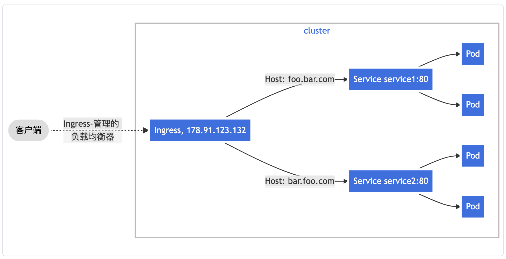

#### kubernetes 

## reference

[kubernetes ingress](https://kubernetes.io/zh/docs/concepts/services-networking/ingress/)

[在 Minikube 环境中使用 NGINX Ingress 控制器配置 Ingress](https://kubernetes.io/zh/docs/tasks/access-application-cluster/ingress-minikube/)

## tips

### ingress 和 service 的区别

> `Kubernetes`在集群接入层设计并提供了两种原生资源`Service`和`Ingress`，分别负责四层和七层的网络接入层配置。传统的做法是创建Ingress或LoadBalancer类型的Service来绑定腾讯云的负载均衡将服务对外暴露。这种做法将用户流量负载到用户节点的NodePort上，通过KubeProxy组件转发到容器网络中，但这种方案在业务的性能和能力支持会有所局限。

## kubernetes ingress

> minimal-ingress

> Ingress 经常使用注解（annotations）来配置一些选项，具体取决于 Ingress 控制器，例如 [重写目标注解](https://github.com/kubernetes/ingress-nginx/blob/master/docs/examples/rewrite/README.md)。

```yaml
apiVersion: networking.k8s.io/v1
kind: Ingress
metadata:
  name: minimal-ingress
  annotations:
    nginx.ingress.kubernetes.io/rewrite-target: /
spec:
  rules:
  - http:
      paths:
      - path: /testpath
        pathType: Prefix
        backend:
          service:
            name: test
            port:
              number: 80
```

### ingress 规则

- 可选的 `host`。在此示例中，未指定 `host`，因此该规则适用于通过指定 IP 地址的所有入站 HTTP 通信。 如果提供了 `host`（例如 foo.bar.com），则 `rules` 适用于该 `host`。
- 路径列表 paths（例如，`/testpath`）,每个路径都有一个由 `serviceName` 和 `servicePort` 定义的关联后端。 在负载均衡器将流量定向到引用的服务之前，主机和路径都必须匹配传入请求的内容。
- `backend`（后端）是 [Service 文档](https://kubernetes.io/zh/docs/concepts/services-networking/service/)中所述的服务和端口名称的组合。 与规则的 `host` 和 `path` 匹配的对 Ingress 的 HTTP（和 HTTPS ）请求将发送到列出的 `backend`。

#### 资源后端

`Resource` 后端是一个 `ObjectRef`，指向同一名字空间中的另一个 Kubernetes，将其作为 Ingress 对象。`Resource` 与 `Service` 配置是互斥的，在 二者均被设置时会无法通过合法性检查。 `Resource` 后端的一种常见用法是将所有入站数据导向带有静态资产的对象存储后端。

```yaml
apiVersion: networking.k8s.io/v1
kind: Ingress
metadata:
  name: ingress-resource-backend
spec:
  defaultBackend:
    resource:
      apiGroup: k8s.example.com
      kind: StorageBucket
      name: static-assets
  rules:
    - http:
        paths:
          - path: /icons
            pathType: ImplementationSpecific
            backend:
              resource:
                apiGroup: k8s.example.com
                kind: StorageBucket
                name: icon-assets
```

#### 路径类型

Ingress 中的每个路径都需要有对应的路径类型（Path Type）。未明确设置 `pathType` 的路径无法通过合法性检查。当前支持的路径类型有三种：

- `ImplementationSpecific`：对于这种路径类型，匹配方法取决于 IngressClass。 具体实现可以将其作为单独的 `pathType` 处理或者与 `Prefix` 或 `Exact` 类型作相同处理。
- `Exact`：精确匹配 URL 路径，且区分大小写。
- `Prefix`：基于以 `/` 分隔的 URL 路径前缀匹配。匹配区分大小写，并且对路径中的元素逐个完成。 路径元素指的是由 `/` 分隔符分隔的路径中的标签列表。 如果每个 *p* 都是请求路径 *p* 的元素前缀，则请求与路径 *p* 匹配。

> **说明：** 如果路径的最后一个元素是请求路径中最后一个元素的子字符串，则不会匹配 （例如：`/foo/bar` 匹配 `/foo/bar/baz`, 但不匹配 `/foo/barbaz`）。

#### 多重匹配

> 在某些情况下，Ingress 中的多条路径会匹配同一个请求。 这种情况下最长的匹配路径优先。 如果仍然有两条同等的匹配路径，则精确路径类型优先于前缀路径类型。

### 主机名通配符

主机名可以是精确匹配（例如“`foo.bar.com`”）或者使用通配符来匹配 （例如“`*.foo.com`”）。 精确匹配要求 HTTP `host` 头部字段与 `host` 字段值完全匹配。 通配符匹配则要求 HTTP `host` 头部字段与通配符规则中的后缀部分相同。

| 主机        | host 头部         | 匹配与否？                          |
| ----------- | ----------------- | ----------------------------------- |
| `*.foo.com` | `bar.foo.com`     | 基于相同的后缀匹配                  |
| `*.foo.com` | `baz.bar.foo.com` | 不匹配，通配符仅覆盖了一个 DNS 标签 |
| `*.foo.com` | `foo.com`         | 不匹配，通配符仅覆盖了一个 DNS 标签 |

```yaml
apiVersion: networking.k8s.io/v1
kind: Ingress
metadata:
  name: ingress-wildcard-host
spec:
  rules:
  - host: "foo.bar.com"
    http:
      paths:
      - pathType: Prefix
        path: "/bar"
        backend:
          service:
            name: service1
            port:
              number: 80
  - host: "*.foo.com"
    http:
      paths:
      - pathType: Prefix
        path: "/foo"
        backend:
          service:
            name: service2
            port:
              number: 80
```

### ingress 类

> Ingress 可以由不同的 `controller` 实现，通常使用不同的配置。 每个 Ingress 应当指定一个类，也就是一个对 IngressClass 资源的引用。 IngressClass 资源包含额外的配置，其中包括应当实现该类的控制器名称。

```yaml
apiVersion: networking.k8s.io/v1
kind: IngressClass
metadata:
  name: external-lb
spec:
  controller: example.com/ingress-controller
  parameters:
    apiGroup: k8s.example.com
    kind: IngressParameters
    name: external-lb
```

### fanout

> 一个扇出（fanout）配置根据请求的 HTTP URI 将来自同一 IP 地址的流量路由到多个 Service。 Ingress 允许你将负载均衡器的数量降至最低。例如，这样的设置：


```yaml
apiVersion: networking.k8s.io/v1
kind: Ingress
metadata:
  name: simple-fanout-example
spec:
  rules:
  - host: foo.bar.com
    http:
      paths:
      - path: /foo
        pathType: Prefix
        backend:
          service:
            name: service1
            port:
              number: 4200
      - path: /bar
        pathType: Prefix
        backend:
          service:
            name: service2
            port:
              number: 8080
```

### 基于名称的虚拟托管

> 基于名称的虚拟主机支持将针对多个主机名的 HTTP 流量路由到同一 IP 地址上。



```yaml
apiVersion: networking.k8s.io/v1
kind: Ingress
metadata:
  name: name-virtual-host-ingress
spec:
  rules:
  - host: foo.bar.com
    http:
      paths:
      - pathType: Prefix
        path: "/"
        backend:
          service:
            name: service1
            port:
              number: 80
  - host: bar.foo.com
    http:
      paths:
      - pathType: Prefix
        path: "/"
        backend:
          service:
            name: service2
            port:
              number: 80
```

如果你创建的 Ingress 资源没有在 `rules` 中定义的任何 `hosts`，则可以匹配指向 Ingress 控制器 IP 地址的任何网络流量，而无需基于名称的虚拟主机。

例如，以下 Ingress 会将针对 `first.bar.com` 的请求流量路由到 `service1`， 将针对 `second.bar.com` 的请求流量路由到 `service2`， 而针对该 IP 地址的、没有在请求中定义主机名的请求流量会被路由（即，不提供请求标头） 到 `service3`。

```yaml
apiVersion: networking.k8s.io/v1
kind: Ingress
metadata:
  name: name-virtual-host-ingress-no-third-host
spec:
  rules:
  - host: first.bar.com
    http:
      paths:
      - pathType: Prefix
        path: "/"
        backend:
          service:
            name: service1
            port:
              number: 80
  - host: second.bar.com
    http:
      paths:
      - pathType: Prefix
        path: "/"
        backend:
          service:
            name: service2
            port:
              number: 80
  - http:
      paths:
      - pathType: Prefix
        path: "/"
        backend:
          service:
            name: service3
            port:
              number: 80
```

## 在 Minikube 环境中使用 NGINX Ingress 控制器配置 Ingress

```bash
minikube start --cpus=2 --registry-mirror=https://t65rjofu.mirror.aliyuncs.com --nodes=3

# 启动 ingress
minikube addons enable ingress

# 检查 ingress 进程
k get pods -A | grep ingress
#ingress-nginx   ingress-nginx-controller-5f66978484-lggpj   1/1     Running     0          2m7s
```

### 部署一个 hello world 应用

```bash
kubectl create deployment web --image=gcr.io/google-samples/hello-app:1.0

kubectl expose deployment web --type=NodePort --port=8080

#使用节点端口信息访问服务
minikube service web --url

kubectl create deployment web-app --image=gcr.io/google-samples/hello-app:1.0

kubectl expose deployment web-app --type=NodePort --port=8080

#使用节点端口信息访问服务
minikube service web-app --url
```

### 创建一个 ingress 资源

> 注意，下面这个例子在 macos 上跑不通

```yaml
apiVersion: networking.k8s.io/v1
kind: Ingress
metadata:
  name: example-ingress
  annotations:
    nginx.ingress.kubernetes.io/rewrite-target: /$1
spec:
  rules:
    - host: hello-world.info
      http:
        paths:
          - path: /
            pathType: Prefix
            backend:
              service:
                name: web
                port:
                  number: 8080
```

```bash
#启动ingress
k apply -f example-ingress.yaml
#查看ingress，可以看到默认的 ingress 是 nginx
k get ingress example-ingress -o wide
#NAME              CLASS   HOSTS              ADDRESS     PORTS   AGE
#example-ingress   nginx   hello-world.info   localhost   80      2m13s
minikube ip
#9.134.115.20
#编辑 /etc/hosts 并增加
#9.134.115.20 hello-world.info
curl hello-world.info
```

### 创建第二个 ingress 资源

```bash
kubectl apply -f example-ingress.yaml

kubectl create deployment web2 --image=gcr.io/google-samples/hello-app:2.0

kubectl expose deployment web2 --port=8080 --type=NodePort
```

```yaml
apiVersion: networking.k8s.io/v1
kind: Ingress
metadata:
  name: example-ingress
  annotations:
    nginx.ingress.kubernetes.io/rewrite-target: /$1
spec:
  rules:
    - host: hello-world.info
      http:
        paths:
          - path: /
            pathType: Prefix
            backend:
              service:
                name: web
                port:
                  number: 8080
          - path: /v2
            pathType: Prefix
              backend:
                service:
                name: web2
                port:
                  number: 8080
```

## 基于弹性网卡直连Pod的网络负载均衡

> `Kubernetes`在集群接入层设计并提供了两种原生资源`Service`和`Ingress`，分别负责四层和七层的网络接入层配置。传统的做法是创建Ingress或LoadBalancer类型的Service来绑定腾讯云的负载均衡将服务对外暴露。这种做法将用户流量负载到用户节点的NodePort上，通过KubeProxy组件转发到容器网络中，但这种方案在业务的性能和能力支持会有所局限。

### 传统模式面临的问题与挑战

`KubeProxy`在集群中会将用户`NodePort`的流量通过NAT的方式转发到集群网络中。这个NAT转发带来了以下一些问题。

1. NAT转发导致请求在性能上有一定的损失。
   1. 进行NAT操作本身会带来性能上的损失。
   2. NAT转发的目的地址可能会使得流量在容器网络内跨节点转发。
2. NAT转发导致请求的来源IP被修改了，客户端无法获取来源IP。
3. 当负载均衡的流量集中到几个NodePort时。过于集中的流量会导致NodePort的SNAT转发过多，使得源端口耗尽流量异常。还可能导致 conntrack 插入冲突导致丢包，影响性能。
4. `KubeProxy`的转发具有随机性，无法支持会话保持。
5. `KubeProxy`的每个NodePort其实也起到独立的负载均衡作用，由于负载均衡无法收敛到一个地方，所以难以达到全局的负载均衡。

#### 传统NodePort模式


1. 请求流量进入负载均衡
2. 请求被负载均衡转发到某一个节点的NodePort
3. KubeProxy将来自NodePort的流量进行NAT转发，目的地址是随机的一个Pod。
4. 请求进入容器网络，并根据Pod地址转发到对应节点。
5. 请求来到Pod所属节点，转发到Pod。

#### 新的Pod直连模式


1. 请求流量进入负载均衡
2. 请求被负载均衡转发到某一个Pod的ENI弹性网卡

#### 直连与Local访问的区别

1. 从性能上区别不大，开启Local访问时，流量不会进行NAT操作也不会进行跨节点转发，所以仅仅多了一个到容器网络的路由。
2. 没有进行NAT操作，来源IP就能够正确获取了。会话保持功能可能会有以下问题，当一个节点上存在多个Pod时，流量到哪一个Pod是随机的，这个机制可能会使话保持出现问题。


