# 《programming kubernetes》

## 第一章 导论

### 基于 Kubernetes 编程什么意思？

> “基于 Kubernetes 编程”的定义为：您将开发一个 Kubernetes 原生应用程序，该应用程序直接与 API 服务器交互，查询资源状态并/或更新其状态。而其他的程序则是通过 kubelet 来和 API Server 通信。
>
> - COTS 商用现成程序

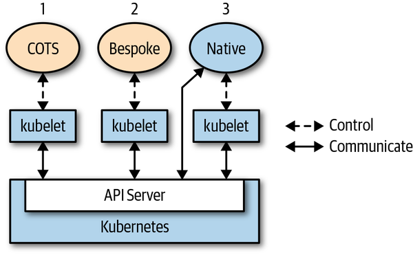

如您所见，在 Kubernetes 上您可以使用不同种类的应用：

1. 当诸如 Rocket Chat 之类的商业现成应用程序（COTS）运行在 Kubernetes 上时。该应用程序本身并不关心它是否在 Kubernetes 上运行，通常也不一定运行在 Kubernetes 上。Kubernetes 控制着应用程序的生命周期，找到可运行的节点，拉取镜像，启动容器，执行健康检查，挂载卷等——仅此而已。
2. 以定制的应用程序（Bespoke）为例，该应用程序是您从头开始编写的，无论有没有考虑把 Kubernetes 作为运行时环境，都可以在 Kubernetes 上运行它。并且与 COTS 一样的操作管理方式。
3. 本书关注的是一个云原生或 Kubernetes 原生应用程序，该应用程序完全感知到它正在 Kubernetes 上运行，并在一定程度上调用了 Kubernetes API 和资源。

### 引导示例

为了演示 Kubernetes 原生应用程序的强大功能，假设您要实现一个 [at](https://en.wikipedia.org/wiki/At_(command)) 指令——在指定的时间执行预定的命令。

我们称其为 `cnat` 或云原生 `at`。假设您要在 2019 年 7 月 3 日凌晨 2 点执行命令 `echo "Kubernetes native rocks!"`，使用 `cnat` 实现此目标的操作如下：

```yaml
apiVersion: cnat.programming-kubernetes.info/v1alpha1
kind: At
metadata:
  name: cnrex
spec:
  schedule: "2019-07-03T02:00:00Z"
  containers:
  - name: shell
    image: centos:7
    command:
    - "bin/bash"
    - "-c"
    - echo "Kubernetes native rocks!"
```

```bash
kubectl apply -f cnat-rocks-example.yaml
```

在后台，涉及以下组件：

- 名为 `cnat.programming-kubernetes.info/cnrex` 的 **自定义资源**，它描述了调度计划。
- Controller，它在指定的时间执行调度计划的命令。

### 扩展模式

在本书的上下文中，我们重点介绍自定义资源，controller，webhooks 和自定义 API Server，以及 Kubernetes [扩展模式](http://bit.ly/2L2SJ1C)。

### Controller 和 Operator

根据 [Kubernetes Glossary](https://kubernetes.io/docs/reference/glossary/?fundamental=true)，*Controller* 实现控制循环，通过 API Server 监听集群的共享状态，并尝试进行更改以**将当前状态转为期望状态。**

### 控制循环（The Control Loop）

> 读取资源状态 > 改变环境对象 > 更新资源状态

1. 读取资源的状态，最好是事件驱动的（使用监听方式，如[第 3 章](https://git.code.oa.com/HappyStudioOpen/programming-kubernetes/tree/master/第 3 章)所述）。 有关详细信息，请参见[“事件”](https://git.code.oa.com/HappyStudioOpen/programming-kubernetes/tree/master/第 1 章#事件)和[“边缘和水平驱动的触发器”](https://git.code.oa.com/HappyStudioOpen/programming-kubernetes/tree/master/第 1 章#边缘触发和水平触发器)。
2. 更改集群内或集群外的对象状态。例如，启动 Pod，创建网络端点（network endpoint）或查询云 API（cloud API）。有关详细信息，请参见[“更改集群内或集群外部对象”](https://git.code.oa.com/HappyStudioOpen/programming-kubernetes/tree/master/第 1 章#更新集群内或集群外对象)。
3. 通过 API server 更新步骤 1 中的资源状态，并存储在 `etcd` 中。 有关详细信息，请参见[“乐观并发”](https://git.code.oa.com/HappyStudioOpen/programming-kubernetes/tree/master/第 1 章#乐观的并发控制)。
4. 重复循环；返回步骤 1。

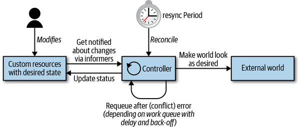

### 事件（Events）

Kubernetes 控制平面大量使用事件和松散耦合的组件。 其他分布式系统使用远程调用（RPC）来触发行为。 但 Kubernetes 并没有这么做。**Kubernetes Controller 监听 API server 中 Kubernetes 对象的操作：添加，更新和删除**。 当发生此类事件时，Controller 将执行其相应的业务逻辑。

例如，为了通过 Deployment 来启动 Pod，就涉及到许多 Controller 和其他控制平面组件协同工作：

1. Deployment Controller（在 `kube-controller-manager` 内部）感知到（通过 Deployment Informer）用户创建了一个 Deployment。根据其业务逻辑，它将创建一个 Replica Set。
2. Replica Set Controller（同样在 `kube-controller-manager` 内部）感知到（通过 Replica Set Informer）新的 Replica Set 被创建了。并随后运行其业务逻辑，它将创建一个 Pod 对象。
3. Scheduler（在 `kube-scheduler` 二进制文件内部）——同样是一个 Controller，感知到（通过 Pod Informer）Pod 设置了一个空的 `spec.nodeName` 字段（**nodeName 是kubernetes节点的名字，由 Scheduler 和 kubelet 共同决定**）。根据其业务逻辑，它将该 Pod 放入其调度队列中。
4. 与此同时，另一个 Controller `kubelet`（通过其 Pod Informer）感知到有新的 Pod 出现，但是新 Pod 的 `spec.nodeName` 字段为空，因此与 `kubelet` 的 Node name 不匹配。它会忽视该 Pod 并返回休眠状态（直到下一个事件出现）。
5. Scheduler 更新 Pod 中的 `spec.nodeName` 字段，并将该字段写入 API server，由此将 Pod 从工作队列中移出，并调度到具有足够可用资源的 Node 上。
6. 由于 Pod 的更新事件，`kubelet` 将被再次唤醒，这次再将 Pod 的 `spec.nodeName` 与自己的 Node name 进行比较，会发现是匹配的，接着 `kubelet` 将启动 Pod 中的容器，并将容器已启动的信息写入 Pod status 中， 由此上报给 API server。
7. Replica Set Controller 会感知到已更新的 Pod，但并不会做什么。
8. 如果 Pod 终止，`kubelet` 将感知到该事件，进而从 API server 获取 Pod 对象，并把 Pod Status 设置为 “terminated”，然后将其写回到 API server。
9. Replica Set Controller 会感知到终止的 Pod，并决定必须更换此 Pod。它将在 API server 上删除终止了的 Pod，然后创建一个新的 Pod。
10. 依此类推。

#### 监听事件 VS `Event` 对象

>监听事件和 Kubernetes 中的顶级 `Event` 对象是两个不同的东西：
>
>- 监听事件是通过 API server 和 Controller 之间的 HTTP 长连接发送，从而驱动 Informer。
>- 顶级的 `Event` 对象是诸如 Pod，Deployments 或 Services 之类的资源，具有特殊的属性，它的生存时间为一个小时，然后自动从 `etcd` 中清除。

`Event` 对象只是用户可见的日志记录机制。 许多 Controller 创建这些事件，以便将其业务逻辑的各个方面传达给用户。 例如，`kubelet` 报告 Pod 的生命周期事件（即，容器启动，重启和终止的时间）。

您可以使用 `kubectl` 列出集群中发生的事件。通过发出以下命令，您可以看到 `kube-system` 命名空间中正在发生什么：

```bash
k get events
#LAST SEEN   TYPE     REASON    OBJECT                       MESSAGE
#22m         Normal   Pulling   pod/podset-sample-podr57nz   Pulling image "busybox"
#22m         Normal   Created   pod/podset-sample-podr57nz   Created container busybox
#22m         Normal   Started   pod/podset-sample-podr57nz   Started container busybox
#22m         Normal   Pulled    pod/podset-sample-podr57nz   Successfully pulled image "busybox" in 373.6179ms
```

### 边缘驱动触发 VS 水平驱动触发

>- **Kubernetes 是基于事件的模式（即边缘驱动触发）**
>- 边缘驱动触发（Edge-driven triggers）在状态变化发生的时间点，将触发处理程序。例如，从无 Pod 运行到 Pod 运行。
>- 水平驱动触发（Level-driven triggers）定期检查状态，如果满足某些条件（例如，Pod 正在运行），则会触发处理程序。

在 Kubernetes 控制平面中，许多组件会更改 API server 上的对象，每次更改都会导致事件的产生（即边缘）。 我们称这些组件为事件源（*event sources*）或事件生产者（*event producers*）。 另一方面，在 Controller 的上下文中，我们对事件的消费感兴趣，即何时对事件做出何种响应（通过 Informer）。

在一个分布式的系统中，事件可能以任意的顺序异步到达。我们很容易出现丢失事件。有几个不同的处理模型：

1. 仅使用边缘驱动逻辑的示例，其中可能错过第二个的状态更改事件。
2. 边缘触发逻辑的示例，在处理事件时始终会获取最新状态（即水平）。换句话说，逻辑是边缘触发的（edge-triggered），但是水平驱动的（level-driven）。
3. 该示例的逻辑是边缘触发，水平驱动的，但同时还附加了定时同步的能力。

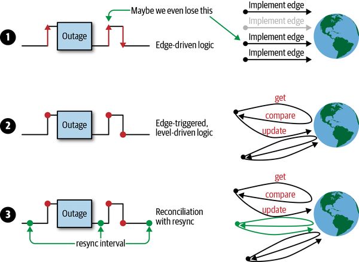

> kubernetes 通常使用第三种方案，这样可以保证在因为网络中断或者其他的事件发生的时候不会出现事件丢失，并且也保证在应用程序运行稳定，不会产生很多的 pod 事件时能够应对变化。

### 更改集群内或集群外对象

在此小节，Controller 将更改其管理对象的状态。 例如，[controller manager](http://bit.ly/2WUAEVy) 中的 `ReplicaSet` Controller 正管理着 Pod。 在每个事件（边缘触发）处理上，它观察当前 Pod 的状态，并与目标状态进行比较（水平驱动）。

> 以下是 `replica_set.go` 下的 ReplicSet controller 的完整逻辑（注意，是 kubernetes 的代码而不是 Kubernetes-client 的）。
>
> 下面的代码实现了对 Pod 数量的管理：
>
> 1. 根据 `diff := len(filteredPods) - int(*(rs.Spec.Replicas))` 来判断是扩容还是缩容
> 2. 根据 `getPodsToDelete` 选择合适的删除对象

```go
// manageReplicas checks and updates replicas for the given ReplicaSet.
// Does NOT modify <filteredPods>.
// It will requeue the replica set in case of an error while creating/deleting pods.
func (rsc *ReplicaSetController) manageReplicas(filteredPods []*v1.Pod, rs *apps.ReplicaSet) error {
	diff := len(filteredPods) - int(*(rs.Spec.Replicas))
	rsKey, err := controller.KeyFunc(rs)
	if err != nil {
		utilruntime.HandleError(fmt.Errorf("Couldn't get key for %v %#v: %v", rsc.Kind, rs, err))
		return nil
	}
	if diff < 0 {
		diff *= -1
		if diff > rsc.burstReplicas {
			diff = rsc.burstReplicas
		}
		// TODO: Track UIDs of creates just like deletes. The problem currently
		// is we'd need to wait on the result of a create to record the pod's
		// UID, which would require locking *across* the create, which will turn
		// into a performance bottleneck. We should generate a UID for the pod
		// beforehand and store it via ExpectCreations.
		rsc.expectations.ExpectCreations(rsKey, diff)
		klog.V(2).Infof("Too few replicas for %v %s/%s, need %d, creating %d", rsc.Kind, rs.Namespace, rs.Name, *(rs.Spec.Replicas), diff)
		// Batch the pod creates. Batch sizes start at SlowStartInitialBatchSize
		// and double with each successful iteration in a kind of "slow start".
		// This handles attempts to start large numbers of pods that would
		// likely all fail with the same error. For example a project with a
		// low quota that attempts to create a large number of pods will be
		// prevented from spamming the API service with the pod create requests
		// after one of its pods fails.  Conveniently, this also prevents the
		// event spam that those failures would generate.
		successfulCreations, err := slowStartBatch(diff, controller.SlowStartInitialBatchSize, func() error {
			err := rsc.podControl.CreatePodsWithControllerRef(rs.Namespace, &rs.Spec.Template, rs, metav1.NewControllerRef(rs, rsc.GroupVersionKind))
			if err != nil && errors.IsTimeout(err) {
				// Pod is created but its initialization has timed out.
				// If the initialization is successful eventually, the
				// controller will observe the creation via the informer.
				// If the initialization fails, or if the pod keeps
				// uninitialized for a long time, the informer will not
				// receive any update, and the controller will create a new
				// pod when the expectation expires.
				return nil
			}
			return err
		})

		// Any skipped pods that we never attempted to start shouldn't be expected.
		// The skipped pods will be retried later. The next controller resync will
		// retry the slow start process.
		if skippedPods := diff - successfulCreations; skippedPods > 0 {
			klog.V(2).Infof("Slow-start failure. Skipping creation of %d pods, decrementing expectations for %v %v/%v", skippedPods, rsc.Kind, rs.Namespace, rs.Name)
			for i := 0; i < skippedPods; i++ {
				// Decrement the expected number of creates because the informer won't observe this pod
				rsc.expectations.CreationObserved(rsKey)
			}
		}
		return err
	} else if diff > 0 {
		if diff > rsc.burstReplicas {
			diff = rsc.burstReplicas
		}
		klog.V(2).Infof("Too many replicas for %v %s/%s, need %d, deleting %d", rsc.Kind, rs.Namespace, rs.Name, *(rs.Spec.Replicas), diff)

		// Choose which Pods to delete, preferring those in earlier phases of startup.
		podsToDelete := getPodsToDelete(filteredPods, diff)

		// Snapshot the UIDs (ns/name) of the pods we're expecting to see
		// deleted, so we know to record their expectations exactly once either
		// when we see it as an update of the deletion timestamp, or as a delete.
		// Note that if the labels on a pod/rs change in a way that the pod gets
		// orphaned, the rs will only wake up after the expectations have
		// expired even if other pods are deleted.
		rsc.expectations.ExpectDeletions(rsKey, getPodKeys(podsToDelete))

		errCh := make(chan error, diff)
		var wg sync.WaitGroup
		wg.Add(diff)
		for _, pod := range podsToDelete {
			go func(targetPod *v1.Pod) {
				defer wg.Done()
				if err := rsc.podControl.DeletePod(rs.Namespace, targetPod.Name, rs); err != nil {
					// Decrement the expected number of deletes because the informer won't observe this deletion
					podKey := controller.PodKey(targetPod)
					klog.V(2).Infof("Failed to delete %v, decrementing expectations for %v %s/%s", podKey, rsc.Kind, rs.Namespace, rs.Name)
					rsc.expectations.DeletionObserved(rsKey, podKey)
					errCh <- err
				}
			}(pod)
		}
		wg.Wait()

		select {
		case err := <-errCh:
			// all errors have been reported before and they're likely to be the same, so we'll only return the first one we hit.
			if err != nil {
				return err
			}
		default:
		}
	}

	return nil
}
```

### 乐观并发

> Kubernetes API server 使用乐观并发控制（译者注：乐观锁），这意味着如果且当 API server 检测到有并发写，它将拒绝两个写操作中的后者。 然后由客户端（Controller，Scheduler，`kubectl` 等）来处理写冲突并重试写操作。

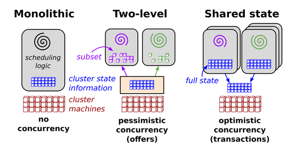

> 以下代码段展示了 Kubernetes 中的乐观并发的处理方式：

```go
var err error
for retries := 0; retries < 10; retries++ {
    foo, err = client.Get("foo", metav1.GetOptions{})
    if err != nil {
        break
    }

    <update-the-world-and-foo>

    _, err = client.Update(foo)
    if err != nil && errors.IsConflict(err) {
        continue
    } else if err != nil {
        break
    }
}
```

### operator

> 一个 operator 需要满足以下三个条件：
>
> - 您需要将一些特定领域的操作方式进行自动化。
>
> - 这些领域操作方式的最佳实践是已知的，并可实现的——例如，对于 Cassandra Operator，是何时以及如何重新平衡节点，或者对于服务网格（service mesh）的 Operator，则是如何创建一条路由。
>
> - 在 Operator 中附带的组件概念是：
>
>   - 一组“*自定义资源定义*”（CRD），用于正确表达该特定领域的 schema 和自定义资源。
>
>   - 一个自定义 Controller，监控自定义资源（可能与核心资源一块）。例如，自定义 Controller 可能会操作一个 Pod。

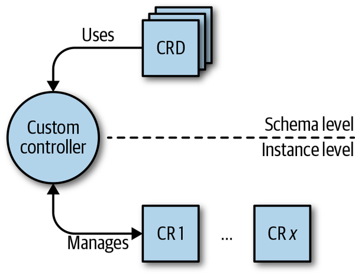

## 第二章 - Kubernetes API 基础

### API Server

> 主节点的控制面由 API Server，controller manager 和 scheduler 组成。API Server 是系统的中央管理实体（central management entity），它是系统中唯一个与分布式存储组件 `etcd` 进行直接交互的组件。

API Server 的核心职责如下：

- 提供 Kebernetes API。这些 API 供集群内的主控组件、工作节点、Kubernetes 原生应用，以及外部客户端（比如 `kubectl`）调用。
- 代理集群组件，比如 Kubernetes 仪表板，流式日志， 服务端口，`kubectl exec` 会话。

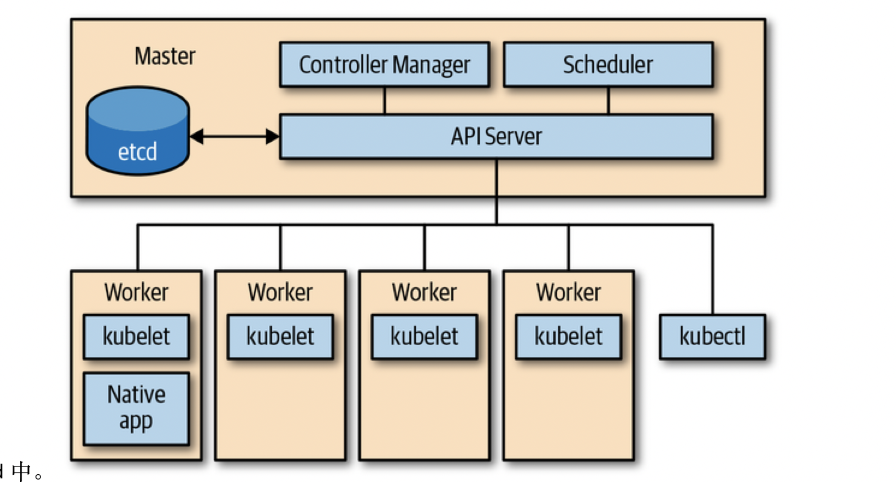

### API Server 的 HTTP 接口

### API 术语

#### Kind

> 告诉客户端（比如 `kubectl`）实体是什么类型，比如说这是一个 pod。其中有三种Kind 类型：
>
> - Object 代表*系统中的持久实体*——例如，`Pod` 或者 `Endpoints`。Object 有名字，并且他们大多数位于 namespace 中。
> - List 代表一个或多个类型实体的集合。List 有一组有限的通用元数据（common metadata）。例如，`PodList` 或者 `NodeList`。当你执行 **`kubectl get pods`**，语义即精确表达你将获取的内容。
> - 特殊用途类型（Special-purpose kinds）主要用于 Object 和非持久实体的特定操作，例如 `/binding` 或者 `/scale`。Kubernetes 使用 `APIGroup` 和 `APIResource` 用于资源发现，使用 `Status` 类型返回错误结果.

#### API Group

> 逻辑相关的 Kind 集合。比如，所有的 batch 对象 如 `Job` 或者 `ScheduledJob`，都在 batch API Group 里。

#### Version

> 每个 API Group 可以同时存在多个版本。

#### Resource

>通常是小写复数形式的单词（比如 `pods`），用以标识一组 HTTP endpoints (路径)，以此暴露系统中某个对象类型的 CRUD（创建、读取、更新、删除）语义的接口。 

Resource 和 Kind 经常被混淆，注意以下明显的区别：

- Resource 会有对应的 HTTP 路径。
- Kind 是被这些 endpoints（HTTP路径）所返回或者接收的对象的类型，会持久化存储在 `etcd` 中。

Resource 永远是 API Group 和 version 的一部分。统称为 *GroupVersionResource*（GVR）。一个 GVR 唯一定义一个 HTTP 路径。一个固定的路径，例如，在 `default` 的 namespace 中，它会是 */apis/batch/v1/namespaces/default/jobs*。 [图 2-3](opeb://d58e58466846688f166eb8dac58d1898/epubbook.xhtml#text图片prku_0203.png) 展示了一个 GVR 例子，它标识了从属于某个 namespace 的 `jobs` 资源。

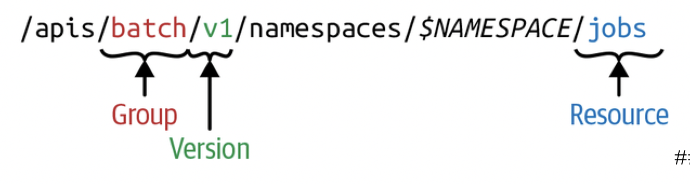

与 `jobs` 的 GVR 不同的是，集群层面的资源，比如 node（节点）和 namespace 本身，它们的路径是没有 *$NAMESPACE* 的。例如，`nodes` 的 GVR 看起来可能是这样的：*/api/v1/nodes*。注意，namespace 会在显示在其他资源 HTTP 路径中，但 namespace 本身也是一种资源，可通过 */api/v1/namespaces* 访问。

与 GVR 类似，每种 kind 也存在于 API Group 之下，且有版本标记，且通过 *GroupVersionKind*（GVK） 标识。

### 声明式状态（Declarative State）管理

大多数 API 对象区分 *specification* 定义的资源的期望状态（*desired state*）和对象的当前状态（*current status*）。*specification*（简称 *spec*）是对资源的期望状态的完整描述，*spec* 通常会持久化存储，一般存到 `etcd` 中。

### 通过命令行使用 API

> - spec 中可以看到我们期望的状态
> - status 中可以看到我们当前状态

```bash
kubectl -n kube-system get deploy/coredns -o=yaml
```

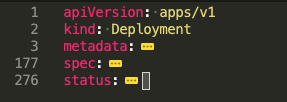

```bash
# 查看资源
k api-resources
# 查看不同资源版本
k api-versions
```

## 第三章 client-go 基础知识

### The Client Library

[client-go](https://github.com/kubernetes/client-go)

### API Machinery

[API Machinery](https://github.com/kubernetes/apimachinery) 包括用于实现类似 Kubernetes 的 API 的所有通用构建模块。 API Machinery 不限于容器管理，因此，例如，它可以用于为在线商店或任何其他特定业务领域构建 API。

无论如何，您将在 Kubernetes 原生 Go 代码中遇到很多 API Machinery 软件包，其中重要的一个是*k8s.io/apimachinery/pkg/apis/meta/v1* 。 它包含许多通用的 API 类型，例如 `ObjectMeta`，`TypeMeta`，`GetOptions` 和 `ListOptions`。

### 创建和使用客户端

> - 使用 metav1 以访问 metav1.GetOptions{}
> - 使用 clientgo 读取和解析 kubeconfig
> - 使用 kubernetes 初始化 `ClientSet`，之所以叫 ClientSet，是因为它包含了所有原生 kubernetes 资源的多个客户端

```go
import (
	"context"
	"flag"
	"log"
	metav1 "k8s.io/apimachinery/pkg/apis/meta/v1"
	"k8s.io/client-go/kubernetes"
	"k8s.io/client-go/tools/clientcmd"
)

func first(ctx context.Context) {
	kubeconfig := flag.String("kubeconfig", "~/.kube/config", "kubeconfig file")
	flag.Parse()
	config, err := clientcmd.BuildConfigFromFlags("", *kubeconfig)
	if err != nil {
		log.Println("error build config")
	}
	clientSet, err := kubernetes.NewForConfig(config)

	pod, err := clientSet.CoreV1().Pods("book").Get(ctx, "example", metav1.GetOptions{})
	if err != nil {
		log.Println(pod)
	}
}
```

### Go语言中的 Kubernetes 对象

```yaml
apiVersion: v1
kind: Pod
metadata:
  namespace: default
  name: example
spec:
  containers:
  - name: hello
    image: debian:latest
    command:
    - /bin/sh
    args:
    - -c
    - echo "hello world"; sleep 10000
```

> Kubernetes 资源（或更确切地说是对象）是某种类型（kind）[1](https://learning.oreilly.com/library/view/programming-kubernetes/9781492047094/ch03.html#idm46336866123400)的实例，被 API Server 作为资源提供。在 Go 中，是 struct，不同种类的资源，struct 的 field 当然不同。

> *k8s.io/apimachinery/pkg/runtime*

```go
// Object interface must be supported by all API types registered with Scheme.
// Since objects in a scheme are expected to be serialized to the wire, the
// interface an Object must provide to the Scheme allows serializers to set
// the kind, version, and group the object is represented as. An Object may
// choose to return a no-op ObjectKindAccessor in cases where it is not
// expected to be serialized.
type Object interface {
    GetObjectKind() schema.ObjectKind
    DeepCopyObject() Object
}
```

> *k8s.io/apimachinery/pkg/runtime/schema*

```go
// All objects that are serialized from a Scheme encode their type information.
// This interface is used by serialization to set type information from the
// Scheme onto the serialized version of an object. For objects that cannot
// be serialized or have unique requirements, this interface may be a no-op.
type ObjectKind interface {
    // SetGroupVersionKind sets or clears the intended serialized kind of an
    // object. Passing kind nil should clear the current setting.
    SetGroupVersionKind(kind GroupVersionKind)
    // GroupVersionKind returns the stored group, version, and kind of an
    // object, or nil if the object does not expose or provide these fields.
    GroupVersionKind() GroupVersionKind
}
```

### TypeMeta

> `runtime.Object` 只是一个接口，我们想知道它是如何实现的。 *k8s.io/api* 中的 Kubernetes 对象通过嵌入*k8s.io/apimachinery/meta/v1* 包中的`metav1.TypeMeta` struct来实现 `schema.ObjectKind` 的类型获取器和设置器：

```go
// TypeMeta describes an individual object in an API response or request
// with strings representing the type of the object and its API schema version.
// Structures that are versioned or persisted should inline TypeMeta.
//
// +k8s:deepcopy-gen=false
type TypeMeta struct {
    // Kind is a string value representing the REST resource this object
    // represents. Servers may infer this from the endpoint the client submits
    // requests to.
    // Cannot be updated.
    // In CamelCase.
    // +optional
    Kind string `json:"kind,omitempty" protobuf:"bytes,1,opt,name=kind"`

    // APIVersion defines the versioned schema of this representation of an
    // object. Servers should convert recognized schemas to the latest internal
    // value, and may reject unrecognized values.
    // +optional
    APIVersion string `json:"apiVersion,omitempty"`
}
```

> Pod 声明如下

```go
// Pod is a collection of containers that can run on a host. This resource is created
// by clients and scheduled onto hosts.
type Pod struct {
	metav1.TypeMeta `json:",inline"`
	// Standard object's metadata.
	// More info: https://git.k8s.io/community/contributors/devel/sig-architecture/api-conventions.md#metadata
	// +optional
	metav1.ObjectMeta `json:"metadata,omitempty" protobuf:"bytes,1,opt,name=metadata"`

	// Specification of the desired behavior of the pod.
	// More info: https://git.k8s.io/community/contributors/devel/sig-architecture/api-conventions.md#spec-and-status
	// +optional
	Spec PodSpec `json:"spec,omitempty" protobuf:"bytes,2,opt,name=spec"`

	// Most recently observed status of the pod.
	// This data may not be up to date.
	// Populated by the system.
	// Read-only.
	// More info: https://git.k8s.io/community/contributors/devel/sig-architecture/api-conventions.md#spec-and-status
	// +optional
	Status PodStatus `json:"status,omitempty" protobuf:"bytes,3,opt,name=status"`
}
```

### ObjectMeta

> 在 json 或者 yaml 中，这些字段位于 metadata 下。

```go
// ObjectMeta is metadata that all persisted resources must have, which includes all objects
// users must create.
type ObjectMeta struct {
	// Name must be unique within a namespace. Is required when creating resources, although
	// some resources may allow a client to request the generation of an appropriate name
	// automatically. Name is primarily intended for creation idempotence and configuration
	// definition.
	// Cannot be updated.
	// More info: http://kubernetes.io/docs/user-guide/identifiers#names
	// +optional
	Name string `json:"name,omitempty" protobuf:"bytes,1,opt,name=name"`

	// GenerateName is an optional prefix, used by the server, to generate a unique
	// name ONLY IF the Name field has not been provided.
	// If this field is used, the name returned to the client will be different
	// than the name passed. This value will also be combined with a unique suffix.
	// The provided value has the same validation rules as the Name field,
	// and may be truncated by the length of the suffix required to make the value
	// unique on the server.
	//
	// If this field is specified and the generated name exists, the server will
	// NOT return a 409 - instead, it will either return 201 Created or 500 with Reason
	// ServerTimeout indicating a unique name could not be found in the time allotted, and the client
	// should retry (optionally after the time indicated in the Retry-After header).
	//
	// Applied only if Name is not specified.
	// More info: https://git.k8s.io/community/contributors/devel/sig-architecture/api-conventions.md#idempotency
	// +optional
	GenerateName string `json:"generateName,omitempty" protobuf:"bytes,2,opt,name=generateName"`
   // ...
}
```

### spec 和 status

> `spec` 是用户的愿望，而 `status`是该愿望的结果，通常由系统中的控制器填充。

### ClientSets

### Watches

> `Watch` 为对象的所有更改（添加，删除和更新）提供了一个事件接口。 从 `k8s.io/apimachinery/pkg/watch` 返回的 `watch.Interface`看起来像这样：
>
> 一般我们不直接使用这个接口，而是使用 `Informer`：通知者是本事件接口和带索引的内存缓存的组合。 目前为止最常用的watch场景是：通知者首先在客户端调用 `List` 来获取所有对象的集合（作为缓存的基线），然后通过 `Watch`来更新缓存。 这样通知者可以正确处理错误情况，从网络问题或其他集群问题中恢复。

```go
// 任何需要watch和上报更新的结构可以实现这个接口
type Interface interface {
    // 停止Watch方法，关闭由 ResultChan() 函数返回的 channel。释放 watch 中使用的所有资源
    Stop()

    // 返回一个接收事件的channel。
    // 如果发生错误或者 Stop()函数被调用，这个 channel 会被关闭，这中情况下watch应该彻底清理。
    ResultChan() <-chan Event
}
```

### Informer 和 Caching

> 通知者针对 `watch` 的最常见用例提供更高级的编程接口：内存中缓存以及按名称或内存中其他属性进行的对象的快速索引查找。

- 从API服务器获取输入作为事件
- 提供一个类客户端的接口，称之为 `Lister`，从内存缓存中获取和列出对象。
- 对增加、删除和修改注册事件处理器
- 使用 `store` 实现内存缓存

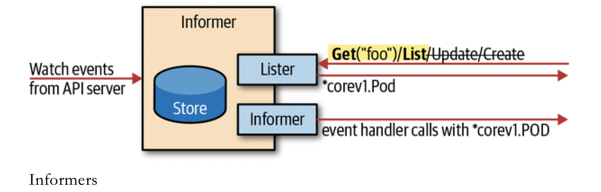

> - 尽管通知者优于轮询，但通知者会增加API服务器的负载。在 每个 `GroupVersionResource` 中，**一个二进制文件应该仅实例化一个通知程序**。 为了使通知者易于共享，我们可以使用共享的通知者工厂实例化通知者。
> - 共享的通知者工厂允许在应用程序中相同的资源共享一个通知者。 换句话说，不同的控制循环访问API服务器可以使用相同的监听的连接。 

```go
func CreateInformer() {
	fmt.Println("create informer")
	informerFactory := informers.NewSharedInformerFactory(clientSet, time.Second*30)
	podInformer := informerFactory.Core().V1().Pods()
	podInformer.Informer().AddEventHandler(cache.ResourceEventHandlerFuncs{
		AddFunc: func(obj interface{}) {
			pod := obj.(*v1.Pod)
			log.Println("add pod : ", pod.Name)
		},
		UpdateFunc: func(oldObj, newObj interface{}) {
			pod := newObj.(*v1.Pod)
			log.Println("update pod : ", pod.Name)
		},
		DeleteFunc: func(obj interface{}) {
			pod := obj.(*v1.Pod)
			log.Println("delete pod : ", pod.Name)
		},
	})

	// 注册处理程序后，必须启动共享的通知者工厂。 底层有Go协程，可以对API服务器进行实际调用。
	// Start方法（具有控制生命周期的 stop channel）启动这些Go协程，而 WaitForCacheSync() 方法使代码等待对客户端的第一个 List调用完成。
	// 如果控制器逻辑要求缓存填充，则 WaitForCacheSync 调用必不可少。
	informerFactory.Start(wait.NeverStop)
	informerFactory.WaitForCacheSync(wait.NeverStop)

	pods, err := podInformer.Lister().Pods("default").List(labels.NewSelector())
	if err != nil {
		return
	}
	for _, pod := range pods {
		log.Println("informer found pod : ", pod.Name)
	}
}
```

> 可以通过 `NewSharedInformerFactoryWithOptions` 来进行过滤

```go
func CreateInformer() {
	fmt.Println("create informer")
	withNamespace := informers.WithNamespace("default")
	informerFactory := informers.NewSharedInformerFactoryWithOptions(clientSet, time.Second*30, withNamespace)

    // ...
}
```

### 工作队列

> 在  [k8s.io/client-go/util/workqueue](http://bit.ly/2IV0JPz) 中提供了一个优先级队列以及其他的扩展队列

### API Machinery 进阶

> `API Machinery` 代码库实现了 `Kubernetes` 基础类型系统。

#### Kinds

> 在 [API Terminology](https://learning.oreilly.com/library/view/programming-kubernetes/9781492047094/ch02.html#terminology) 中已经看到的，kinds 被分为 API 组和版本。 因此，`API Machinery` 代码库中的核心术语是 GroupVersionKind，简称 GVK。

#### Resources

> 在 [API Terminology](https://learning.oreilly.com/library/view/programming-kubernetes/9781492047094/ch02.html#terminology) 中看到的与kinds 同级的是概念是 resource。Resources 再次进行分组和版本控制，因此有术语 GroupVersionResource 或简称为 GVR。

#### REST Mapping

> 一个 GVK 到一个 GVR 的映射被称为 REST mapping。

```go
// RESTMapping contains the information needed to deal with objects of a specific
// resource and kind in a RESTful manner.
type RESTMapping struct {
	// Resource is the GroupVersionResource (location) for this endpoint
	Resource schema.GroupVersionResource

	// GroupVersionKind is the GroupVersionKind (data format) to submit to this endpoint
	GroupVersionKind schema.GroupVersionKind

	// Scope contains the information needed to deal with REST Resources that are in a resource hierarchy
	Scope RESTScope
}
```

#### Scheme

> `scheme` 将 Golang 的世界与 GVK 连接在一起。 `scheme` 的主要特征是将 Golang 类型映射到可能的 GVK ：

```go
// Scheme defines methods for serializing and deserializing API objects, a type
// registry for converting group, version, and kind information to and from Go
// schemas, and mappings between Go schemas of different versions. A scheme is the
// foundation for a versioned API and versioned configuration over time.
//
// In a Scheme, a Type is a particular Go struct, a Version is a point-in-time
// identifier for a particular representation of that Type (typically backwards
// compatible), a Kind is the unique name for that Type within the Version, and a
// Group identifies a set of Versions, Kinds, and Types that evolve over time. An
// Unversioned Type is one that is not yet formally bound to a type and is promised
// to be backwards compatible (effectively a "v1" of a Type that does not expect
// to break in the future).
//
// Schemes are not expected to change at runtime and are only threadsafe after
// registration is complete.
type Scheme struct {
	// gvkToType allows one to figure out the go type of an object with
	// the given version and name.
	gvkToType map[schema.GroupVersionKind]reflect.Type

	// typeToGVK allows one to find metadata for a given go object.
	// The reflect.Type we index by should *not* be a pointer.
	typeToGVK map[reflect.Type][]schema.GroupVersionKind

	// unversionedTypes are transformed without conversion in ConvertToVersion.
	unversionedTypes map[reflect.Type]schema.GroupVersionKind

	// unversionedKinds are the names of kinds that can be created in the context of any group
	// or version
	// TODO: resolve the status of unversioned types.
	unversionedKinds map[string]reflect.Type

	// Map from version and resource to the corresponding func to convert
	// resource field labels in that version to internal version.
	fieldLabelConversionFuncs map[schema.GroupVersionKind]FieldLabelConversionFunc

	// defaulterFuncs is a map to funcs to be called with an object to provide defaulting
	// the provided object must be a pointer.
	defaulterFuncs map[reflect.Type]func(interface{})

	// converter stores all registered conversion functions. It also has
	// default converting behavior.
	converter *conversion.Converter

	// versionPriority is a map of groups to ordered lists of versions for those groups indicating the
	// default priorities of these versions as registered in the scheme
	versionPriority map[string][]string

	// observedVersions keeps track of the order we've seen versions during type registration
	observedVersions []schema.GroupVersion

	// schemeName is the name of this scheme.  If you don't specify a name, the stack of the NewScheme caller will be used.
	// This is useful for error reporting to indicate the origin of the scheme.
	schemeName string
}
```

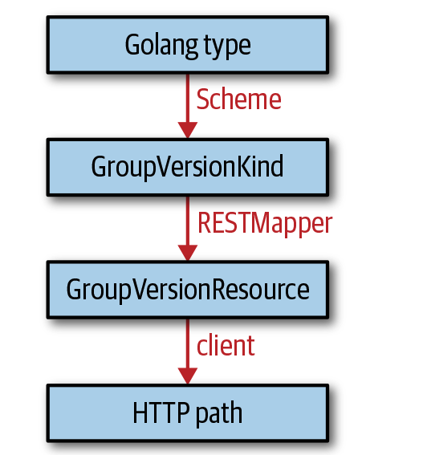

### 第四章 - 使用自定义资源(Custom Resources)

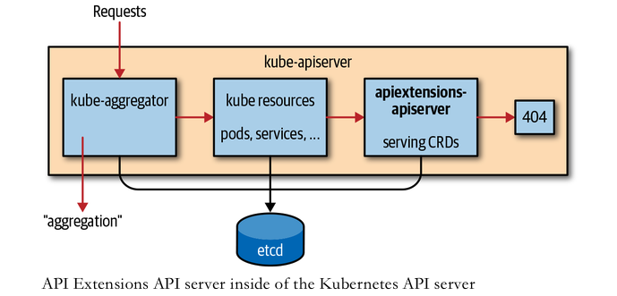

> 第一个自定义 CRD

```yaml
apiVersion: apiextensions.k8s.io/v1
kind: CustomResourceDefinition
metadata:
  # name must match the spec fields below, and be in the form: <plural>.<group>
  name: crontabs.stable.example.com
spec:
  # group name to use for REST API: /apis/<group>/<version>
  group: stable.example.com
  # list of versions supported by this CustomResourceDefinition
  versions:
    - name: v1
      # Each version can be enabled/disabled by Served flag.
      served: true
      # One and only one version must be marked as the storage version.
      storage: true
      schema:
        openAPIV3Schema:
          type: object
          properties:
            spec:
              type: object
              properties:
                cronSpec:
                  type: string
                image:
                  type: string
                replicas:
                  type: integer
  # either Namespaced or Cluster
  scope: Namespaced
  names:
    # plural name to be used in the URL: /apis/<group>/<version>/<plural>
    plural: crontabs
    # singular name to be used as an alias on the CLI and for display
    singular: crontab
    # kind is normally the CamelCased singular type. Your resource manifests use this.
    kind: CronTab
    # shortNames allow shorter string to match your resource on the CLI
    shortNames:
    - ct
```

#### 感知信息

> 通过以上的 xml 可以创建 CRD。

```bash
k apply -f resourcedefinition.yaml

k api-resources | grep crontabs
#crontabs                          ct           stable.example.com             true         CronTab
```

>1. 最初，kubectl 并不知道 `crontabs` 是什么。
>2. 因此，kubectl 使用 `/apis` 感知 endpoint 的方式，向 API server 查询所有的 API groups。
>3. 接着，kubectl 使用 /apis/group version 感知 endpoints 的方式，向 API server 查询所有 API groups 中的资源。
>4. 然后，kubectl 将给定的类型 `crontabs` 转换成以下 3 种形式：
>   1. Group（在此为 table.example.com）
>   2. Version（在此为 v1alpha1）
>   3. Resource（在此为 ats）


