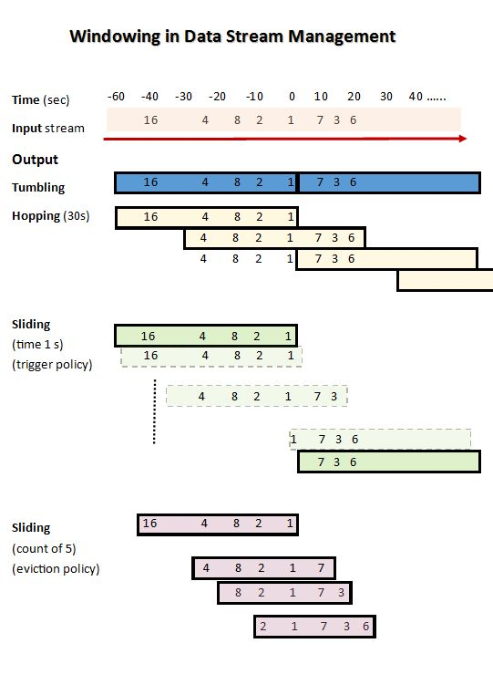

# window

## reference

[Sliding Vs Tumbling Windows](https://stackoverflow.com/questions/12602368/sliding-vs-tumbling-windows)

## Sliding Vs Tumbling Windows 

1. Tumbling repeats at a non-overlapping interval.
2. Hopping is simlar to tumbling, but hopping generally has an overlapping interveral.
3. Time Sliding triggers at regular interval.
4. Eviction Sliding triggers on a count.

Below is a graphical representation showing different types of Data Stream Management System (DSMS) window - tumbling, hopping, timing policy sliding, and eviction policy(count) sliding. I used the above example to create the image (making assumptions).

