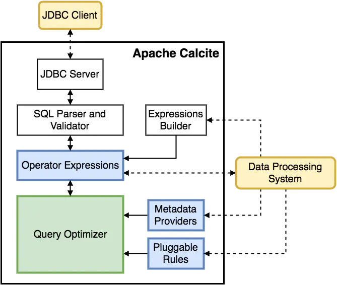
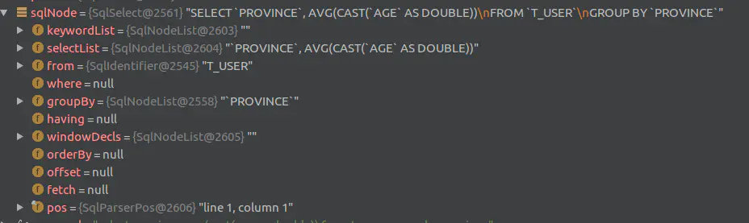

# calcite教程

## calcite教程01-calcite的基本概念

### 1.背景

Apache Calcite是一个面向Hadoop新的查询引擎，它提供了标准的SQL语言，多种查询和优化，它的 SQL Parser 层、Optimizer 层等都可以单独使用。

### 2.Calcite的架构

> calcite 只做 Parser 和Optimizer，不做数据存储。



>calcite最核心的就是optimizer优化器，一个optimizer engine包含三个组成部分：

- rules:也就是匹配规则，calcite目前内置上百种rule来优化relations expression,也支持自定义的rules
- Metadata providers:主要向优化器提供信息,有助于指导优化器向着目标（减少整体cost）进行优化，信息可以包括行数，table哪一列是唯一列，也包括计算relNode树，执行subexpression cost的函数。
- Planner engines:触发rules来达到指定目标，比如cost-base expression optimizer(CBO)的目标是减少cost（减少数据行数，CPU cost,IO cost等）。

>对SQL执行完整流程，分为4部分


- Parser: 解析，calcite通过javaCC将SQL解析成未经校验的AST(Abstract Syntax Tree,即抽象语法树)。
- Validate: 验证，主要负责校验上一步parser是否合法，如验证SQL的schema信息，字段，函数等是否存在，SQL是否合法，此步骤完成后生成RelNode。
- Optimize：优化，也是整个核心所在，将逻辑计划RelNode转化为物理计划，主要涉及SQL优化：基于规则优化（RBO），基于代价优化（CBO）,optimizer按道理是可以选的。此步骤得到物理计划
- Execute：执行阶段，将物理计划转成程序，变成自己平台的可执行代码。

### 3.Calcite的相关概念

#### 3.1 catalog

>主要定义被SQL访问的命名空间，主要包括以下两点：

- chema: 主要定义schema与表的结合，有点像database，但是sechma不一定是强制的，比如同名表T1就需要加上A.T1,B.T1.
- table：对应数据库的表
- RelDataType：代表表的数据定义，对应表的数据列名和类型。

```java
/**
 * A namespace for tables and functions.
 *
 * <p>A schema can also contain sub-schemas, to any level of nesting. Most
 * providers have a limited number of levels; for example, most JDBC databases
 * have either one level ("schemas") or two levels ("database" and
 * "catalog").</p>
 *
 * <p>There may be multiple overloaded functions with the same name but
 * different numbers or types of parameters.
 * For this reason, {@link #getFunctions} returns a list of all
 * members with the same name. Calcite will call
 * {@link Schemas#resolve(org.apache.calcite.rel.type.RelDataTypeFactory, String, java.util.Collection, java.util.List)}
 * to choose the appropriate one.</p>
 *
 * <p>The most common and important type of member is the one with no
 * arguments and a result type that is a collection of records. This is called a
 * <dfn>relation</dfn>. It is equivalent to a table in a relational
 * database.</p>
 *
 * <p>For example, the query</p>
 *
 * <blockquote>select * from sales.emps</blockquote>
 *
 * <p>is valid if "sales" is a registered
 * schema and "emps" is a member with zero parameters and a result type
 * of <code>Collection(Record(int: "empno", String: "name"))</code>.</p>
 *
 * <p>A schema may be nested within another schema; see
 * {@link Schema#getSubSchema(String)}.</p>
 */
public interface Schema {
}
```

```java
/**
 * Table.
 *
 * <p>The typical way for a table to be created is when Calcite interrogates a
 * user-defined schema in order to validate names appearing in a SQL query.
 * Calcite finds the schema by calling {@link Schema#getSubSchema(String)} on
 * the connection's root schema, then gets a table by calling
 * {@link Schema#getTable(String)}.</p>
 *
 * <p>Note that a table does not know its name. It is in fact possible for
 * a table to be used more than once, perhaps under multiple names or under
 * multiple schemas. (Compare with the
 * <a href="http://en.wikipedia.org/wiki/Inode">i-node</a> concept in the UNIX
 * filesystem.)</p>
 *
 * <p>A particular table instance may also implement {@link Wrapper},
 * to give access to sub-objects.
 *
 * @see TableMacro
 */
public interface Table {
}
```

```java
/**
 * RelDataType represents the type of a scalar expression or entire row returned
 * from a relational expression.
 *
 * <p>This is a somewhat "fat" interface which unions the attributes of many
 * different type classes into one. Inelegant, but since our type system was
 * defined before the advent of Java generics, it avoids a lot of typecasting.
 */
public interface RelDataType {
}
```

#### 3.2 SQL Parse(SQL -> SQL Node)

>Calcite使用javaCC作为SQL解析，javaCC通过Calcite中定义的Parse.jj文件，生成一系列的java代码，生成的代码会把SQL转换成AST的数据结构（SQL Node类型）

javaCC要实现一个SQL parser，他的功能有两点，这里都需要在 jj 文件中定义

1. 设计词法和语义，定义SQL中的具体元素。
2. 实现词法分析器（Lexer）和语法分析器（Parse）,完成对SQL的解析，完成相应的转换。

```java
//org.apache.calcite.prepare.CalcitePrepareImpl
//... 
//解析sql->SqlNode
SqlParser parser = createParser(query.sql,  parserConfig);
      SqlNode sqlNode;
      try {
        sqlNode = parser.parseStmt();
        statementType = getStatementType(sqlNode.getKind());
      } catch (SqlParseException e) {
        throw new RuntimeException(
            "parse failed: " + e.getMessage(), e);
      }
//...
```

经过上述代码sql经过parser.parseStmt解析之后，会生成一个SqlNode,Debug后的对象如图所示



#### 3.3 验证和转换 （SQL Node -> RelNode）

> 经过上面的解析，会将SQL翻译成SQL 的抽象语法树 AST,SQL Node就是抽象语法树的节点Node,而Rel代表关系表达式（Relation Expression）,所以从sql node -> rel node 的过程，是一个转换，一个校验的过程。

```java
//org.apache.calcite.prepare. Prepare
//function prepareSql
RelRoot root =
        sqlToRelConverter.convertQuery(sqlQuery, needsValidation, true);
```

##### 3.3.1 校验Validate

语法检查前我们要先知道元信息，这个检查会包括表名，字段名，字段类型，函数名，进行语法检查的实现如下：

```java
//org.apache.calcite.sql.validate.SqlValidatorImpl
 public SqlNode validate(SqlNode topNode) {
    SqlValidatorScope scope = new EmptyScope(this);
    scope = new CatalogScope(scope, ImmutableList.of("CATALOG"));
    final SqlNode topNode2 = validateScopedExpression(topNode, scope);
    final RelDataType type = getValidatedNodeType(topNode2);
    Util.discard(type);
    return topNode2;
  }
```

在对SQL node的校验过程中，会对AST的语法进行补充，例如：

```sql
# 校验前
select province,avg(cast(age as double)) from t_user group by province
# 校验后
SELECT `T_USER`.`PROVINCE`, AVG(CAST(`T_USER`.`AGE` AS DOUBLE))
FROM `TEST_PRO`.`T_USER` AS `T_USER`
GROUP BY `T_USER`.`PROVINCE`
```

##### 3.3.2 SQL Node->Rel Node

> 在经过上面进行合法的补充了一定语义的AST树之后，而validate中已经准备好各种映射信息后，就开始具体的RelNode的转换了。

```java
//org.apache.calcite.sql2rel.SqlToRelConverter
 protected RelRoot convertQueryRecursive(SqlNode query, boolean top,
      RelDataType targetRowType) {
    final SqlKind kind = query.getKind();
    switch (kind) {
    case SELECT:
      return RelRoot.of(convertSelect((SqlSelect) query, top), kind);
    case INSERT:
      return RelRoot.of(convertInsert((SqlInsert) query), kind);
    case DELETE:
      return RelRoot.of(convertDelete((SqlDelete) query), kind);
    case UPDATE:
      return RelRoot.of(convertUpdate((SqlUpdate) query), kind);
    case MERGE:
      return RelRoot.of(convertMerge((SqlMerge) query), kind);
    case UNION:
    case INTERSECT:
    case EXCEPT:
      return RelRoot.of(convertSetOp((SqlCall) query), kind);
    case WITH:
      return convertWith((SqlWith) query, top);
    case VALUES:
      return RelRoot.of(convertValues((SqlCall) query, targetRowType), kind);
    default:
      throw new AssertionError("not a query: " + query);
    }
 }
```

> 测试SQL

```sql
select province,avg(cast(age as double)) from t_user group by province
```

> 得到的语法树

```
Plan after converting SqlNode to RelNode
LogicalAggregate(group=[{0}], EXPR$1=[AVG($1)])
  LogicalProject(PROVINCE=[$3], $f1=[CAST($2):DOUBLE])
    LogicalTableScan(table=[[TEST_PRO, T_USER]])
```

#### 3.4 优化 Optimizer

在calcite中有两种优化器

- HepPlanner(RBO)(Rule-Based Optimizer)：它是一个启发式的优化器，按照规则进行匹配，知道达到次数限制，或者遍历一遍，不在出现rule match为止。
- VolcanoPlanner(RBO+CBO)(Cost-Based Optimizer)：他会一直迭代rule,知道找到最小的cost的plan

## calcite教程02-calcite的快速入门

> 本章主要介绍一个简单的CSV适配器如何一步一步的创建和连接到calcite的，这个适配器将一个目录下面csv文件表现成包含各种表的schema信息，calcite已经实现了rest接口，也提供了一整套SQL接口。

CSV主要包含几个重要的概念：

- 通过Schema Factory和Schema接口实现自定义的schema
- 使用json文件描述schema
- 使用json文件描述视图view
- 通过接口定义表
- 确定表的记录类型
- 创建一个表的简单方法是，使用scannableTable接口直接列举所有行
- 创建一个表的更高级的方法是，使用FilterTable接口，并根据简单的规则进行过滤
- 创建一个表的更高级的方法是，使用TranslateTable接口，这个类能使规划规则转换成关系操作符

## calcite教程03-calcite实现自定义SQL

### 1.效果演示


