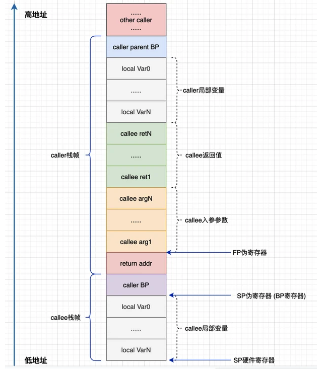
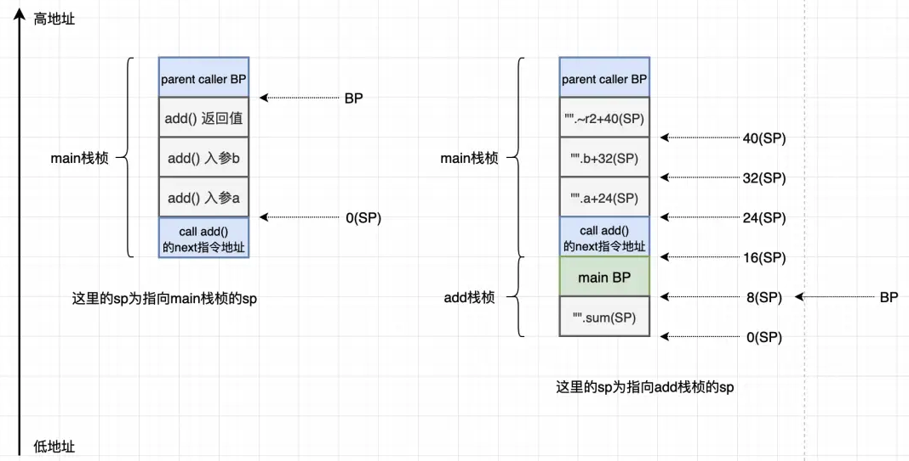

# golang 汇编基础知识

## reference

- [汇编是深入理解 Go 的基础](https://segmentfault.com/a/1190000039753236)
- [golang汇编基础知识](https://guidao.github.io/asm.html)
- [A Quick Guide to Go's Assembler](https://go.dev/doc/asm)
- [Golang Plan9 汇编入门](https://mioto.me/2021/01/plan9-assembly/)
- [Go Assembly 示例](https://colobu.com/goasm/)
- [frame pointer及其用途](https://www.cnblogs.com/hustdc/p/7631370.html)
- [汇编语言中mov和lea的区别有哪些？](https://www.zhihu.com/question/40720890)

## 汇编是深入理解 Go 的基础

> 1. `pc`,`fp` 等寄存器；
> 2. `go tool compile -N -S assembler.go` 编译时记得通过 `-N` 关闭优化；
> 3. 记住一个问题，`1` 和 `2` 这种参数也会使用栈的数据；
> 4. `BP` BP称为指针寄存器，与SS连用，为访问现行堆栈段提供方便。通常BP寄存器在间接寻址中使用，操作数在堆栈段中，由SS段寄存器和BP组合形成操作数的地址，即BP中存放现行堆栈段中一个数据区的“基址”的偏移量，所以称BP为基址指针。
> 5. Stack Segment，SS被称为[堆栈](https://baike.baidu.com/item/堆栈)段寄存器，用于存放堆栈段的基值。
> 6. Go 汇编使用的是`caller-save`模式，被调用函数的参数、返回值、栈位置都需要由调用者维护、准备
> 7. 汇编语言使用 `symbol+offset(FP)` 的方式，例如 `"".a+32(SP)` 表示的其实就是 `32(SP)`，而 `"".a` 其实只是一个 `symbol` 以便于用户可以更直观的阅读代码；

>一般来说，函数调用的前几行大概形式都是：
>
>```asm
>        0x0000 00000 (assembler.go:3)   SUBQ    $24, SP                                         ;; 这里是 callee 的栈帧，callee 的栈帧只包含了 caller BP 和 local var
>        0x0004 00004 (assembler.go:3)   MOVQ    BP, 16(SP)                                      ;; 将BP存放到刚才我们开辟的栈空间的第一个位置，这样我们才知道当函数退出时应该从哪里继续
>        0x0009 00009 (assembler.go:3)   LEAQ    16(SP), BP                                      ;; 修改BP让BP指向我们函数的栈，这样后续执行的时候才知道执行哪里的代码
>```
>
>最主要是，需要将 caller BP 存储在开辟的栈的第一个位置，然后修改 callee BP 到新开辟的栈的第二个位置。



>"".add STEXT nosplit size=70 args=0x10 locals=0x18 funcid=0x0 align=0x0
>
>- `"".add` 表示了 `add` 函数，在链接期，`""`这个空字符会被替换为当前的包名: 也就是说，`"".add` 在链接到二进制文件后会变成 main.add
>- `STEXT` 代表这是一段代码
>- `size=70` 表示代码的长度是 70
>- `args=0x10` 函数有两个 int 类型的参数，大小是 16
>- `locals` 代表了本地变量的大小
>- `NOSPLIT:` 向编译器表明不应该插入 stack-split 的用来检查栈需要扩张的前导指令。在我们 add 函数的这种情况下，编译器自己帮我们插入了这个标记: 它足够聪明地意识到，由于 add 没有任何局部变量且没有它自己的栈帧，所以一定不会超出当前的栈。不然，每次调用函数时，在这里执行栈检查就是完全浪费 CPU 时间了。
>- `$24-16`中：24 表示函数的帧栈大小，16 表示的是函数的参数大小。注意，函数的帧栈包括了（BP，输入参数，本地变量）；

```go
package main
    
func add(a, b int) int{
    sum := 0 // 不设置该局部变量sum，add栈空间大小会是0
    sum = a+b
    return sum
}
func main(){
    println(add(1,2))
}
```

> 执行 `go tool compile -N -l -S assembler.go > assembler.s` 编译

```assembly
"".add STEXT nosplit size=70 args=0x10 locals=0x18 funcid=0x0 align=0x0
        ;; $24-16
        ;; 24 表示的是函数的栈帧大小，16 表示的是函数的参数大小
        0x0000 00000 (assembler.go:3)   TEXT    "".add(SB), NOSPLIT|ABIInternal, $24-16
        0x0000 00000 (assembler.go:3)   SUBQ    $24, SP                                         ;; 这里是 callee 的栈帧，callee 的栈帧只包含了 caller BP 和 local var
        0x0004 00004 (assembler.go:3)   MOVQ    BP, 16(SP)                                      ;; 将BP存放到刚才我们开辟的栈空间的第一个位置，这样我们才知道当函数退出时应该从哪里继续
        0x0009 00009 (assembler.go:3)   LEAQ    16(SP), BP                                      ;; 修改BP让BP指向我们函数的栈，这样后续执行的时候才知道执行哪里的代码
        ;; ignore FUNCDATA segment, it used to work in conjunction with GC ...
        0x000e 00014 (assembler.go:3)   MOVQ    AX, "".a+32(SP)                                 ;; 复制参数 a 到栈
        0x0013 00019 (assembler.go:3)   MOVQ    BX, "".b+40(SP)                                 ;; 赋值参数 b 到栈
        0x0018 00024 (assembler.go:3)   MOVQ    $0, "".~r0(SP)                                  ;; 清零返回值
        0x0020 00032 (assembler.go:4)   MOVQ    $0, "".sum+8(SP)                                ;; 为 sum 赋值
        0x0029 00041 (assembler.go:5)   MOVQ    "".a+32(SP), AX                                 ;; AX = a
        0x002e 00046 (assembler.go:5)   ADDQ    "".b+40(SP), AX                                 ;; AX += b
        0x0033 00051 (assembler.go:5)   MOVQ    AX, "".sum+8(SP)                                ;; sum = AX
        0x0038 00056 (assembler.go:6)   MOVQ    AX, "".~r0(SP)                                  ;; 修改返回值
        0x003c 00060 (assembler.go:6)   MOVQ    16(SP), BP                                      ;; 恢复BP到调用前
        0x0041 00065 (assembler.go:6)   ADDQ    $24, SP                                         ;; 恢复SP到调用前
        0x0045 00069 (assembler.go:6)   RET                                                     ;; 返回
        0x0000 48 83 ec 18 48 89 6c 24 10 48 8d 6c 24 10 48 89  H...H.l$.H.l$.H.
        0x0010 44 24 20 48 89 5c 24 28 48 c7 04 24 00 00 00 00  D$ H.\$(H..$....
        0x0020 48 c7 44 24 08 00 00 00 00 48 8b 44 24 20 48 03  H.D$.....H.D$ H.
        0x0030 44 24 28 48 89 44 24 08 48 89 04 24 48 8b 6c 24  D$(H.D$.H..$H.l$
        0x0040 10 48 83 c4 18 c3                                .H....
        ;; ...
```

> 注意，下面的这个图是原文中的图，而这个图和我们实际的栈帧有差别。



## golang汇编基础知识

### 1.1 前言

> golang的汇编基于plan9汇编,是一个中间汇编方式

### 1.2 寄存器

- FP: Frame pointer: arguments and locals.(指向当前栈帧)
- PC: Program counter: jumps and branches.(指向指令地址)
- SB: Static base pointer: global symbols.(指向全局符号表)
- SP: Stack pointer: top of stack.(指向当前栈顶部)

注意: 栈是向下整长 golang的汇编是调用者维护参数返回值跟返回地址。所以FP的值小于参数跟返回值。

> Tutorial01.go

```go
package main
//go:noinline
func add(a, b int32) (int32, bool) {
  return a + b, true
}
func main() {
  add(10, 32)
}
```

```bash
go tool compile -N -l -S tutorial01.go > tutorial01.asm
```

> Tutorial01.asm

```assembly
# add 函数
"".add STEXT nosplit size=71 args=0x8 locals=0x10 funcid=0x0
	0x0000 00000 (tutorial01.go:3)	TEXT	"".add(SB), NOSPLIT|ABIInternal, $16-8
	0x0000 00000 (tutorial01.go:3)	SUBQ	$16, SP
	0x0004 00004 (tutorial01.go:3)	MOVQ	BP, 8(SP)
	0x0009 00009 (tutorial01.go:3)	LEAQ	8(SP), BP
	0x000e 00014 (tutorial01.go:3)	FUNCDATA	$0, gclocals·33cdeccccebe80329f1fdbee7f5874cb(SB)
	0x000e 00014 (tutorial01.go:3)	FUNCDATA	$1, gclocals·33cdeccccebe80329f1fdbee7f5874cb(SB)
	0x000e 00014 (tutorial01.go:3)	FUNCDATA	$5, "".add.arginfo1(SB)
	0x000e 00014 (tutorial01.go:3)	MOVL	AX, "".a+24(SP)
	0x0012 00018 (tutorial01.go:3)	MOVL	BX, "".b+28(SP)
	0x0016 00022 (tutorial01.go:3)	MOVL	$0, "".~r2+4(SP)
	0x001e 00030 (tutorial01.go:3)	MOVB	$0, "".~r3+3(SP)
	0x0023 00035 (tutorial01.go:4)	MOVL	"".a+24(SP), CX
	0x0027 00039 (tutorial01.go:4)	ADDL	"".b+28(SP), CX
	0x002b 00043 (tutorial01.go:4)	MOVL	CX, "".~r2+4(SP)
	0x002f 00047 (tutorial01.go:4)	MOVB	$1, "".~r3+3(SP)
	0x0034 00052 (tutorial01.go:4)	MOVL	"".~r2+4(SP), AX
	0x0038 00056 (tutorial01.go:4)	MOVL	$1, BX
	0x003d 00061 (tutorial01.go:4)	MOVQ	8(SP), BP
	0x0042 00066 (tutorial01.go:4)	ADDQ	$16, SP
	0x0046 00070 (tutorial01.go:4)	RET
	0x0000 48 83 ec 10 48 89 6c 24 08 48 8d 6c 24 08 89 44  H...H.l$.H.l$..D
	0x0010 24 18 89 5c 24 1c c7 44 24 04 00 00 00 00 c6 44  $..\$..D$......D
	0x0020 24 03 00 8b 4c 24 18 03 4c 24 1c 89 4c 24 04 c6  $...L$..L$..L$..
	0x0030 44 24 03 01 8b 44 24 04 bb 01 00 00 00 48 8b 6c  D$...D$......H.l
	0x0040 24 08 48 83 c4 10 c3                             $.H....
	
"".main STEXT size=54 args=0x0 locals=0x10 funcid=0x0
	0x0000 00000 (tutorial01.go:6)	TEXT	"".main(SB), ABIInternal, $16-0
	0x0000 00000 (tutorial01.go:6)	CMPQ	SP, 16(R14)
	0x0004 00004 (tutorial01.go:6)	PCDATA	$0, $-2
	0x0004 00004 (tutorial01.go:6)	JLS	47
	0x0006 00006 (tutorial01.go:6)	PCDATA	$0, $-1
	0x0006 00006 (tutorial01.go:6)	SUBQ	$16, SP
	0x000a 00010 (tutorial01.go:6)	MOVQ	BP, 8(SP)
	0x000f 00015 (tutorial01.go:6)	LEAQ	8(SP), BP
	0x0014 00020 (tutorial01.go:6)	FUNCDATA	$0, gclocals·33cdeccccebe80329f1fdbee7f5874cb(SB)
	0x0014 00020 (tutorial01.go:6)	FUNCDATA	$1, gclocals·33cdeccccebe80329f1fdbee7f5874cb(SB)
	0x0014 00020 (tutorial01.go:7)	MOVL	$10, AX
	0x0019 00025 (tutorial01.go:7)	MOVL	$32, BX
	0x001e 00030 (tutorial01.go:7)	PCDATA	$1, $0
	0x001e 00030 (tutorial01.go:7)	NOP
	0x0020 00032 (tutorial01.go:7)	CALL	"".add(SB)
	0x0025 00037 (tutorial01.go:8)	MOVQ	8(SP), BP
	0x002a 00042 (tutorial01.go:8)	ADDQ	$16, SP
	0x002e 00046 (tutorial01.go:8)	RET
	0x002f 00047 (tutorial01.go:8)	NOP
	0x002f 00047 (tutorial01.go:6)	PCDATA	$1, $-1
	0x002f 00047 (tutorial01.go:6)	PCDATA	$0, $-2
	0x002f 00047 (tutorial01.go:6)	CALL	runtime.morestack_noctxt(SB)
	0x0034 00052 (tutorial01.go:6)	PCDATA	$0, $-1
	0x0034 00052 (tutorial01.go:6)	JMP	0
	0x0000 49 3b 66 10 76 29 48 83 ec 10 48 89 6c 24 08 48  I;f.v)H...H.l$.H
	0x0010 8d 6c 24 08 b8 0a 00 00 00 bb 20 00 00 00 66 90  .l$....... ...f.
	0x0020 e8 00 00 00 00 48 8b 6c 24 08 48 83 c4 10 c3 e8  .....H.l$.H.....
	0x0030 00 00 00 00 eb ca                                ......
	rel 33+4 t=7 "".add+0
	rel 48+4 t=7 runtime.morestack_noctxt+0
go.cuinfo.packagename. SDWARFCUINFO dupok size=0
	0x0000 6d 61 69 6e                                      main
""..inittask SNOPTRDATA size=24
	0x0000 00 00 00 00 00 00 00 00 00 00 00 00 00 00 00 00  ................
	0x0010 00 00 00 00 00 00 00 00                          ........
gclocals·33cdeccccebe80329f1fdbee7f5874cb SRODATA dupok size=8
	0x0000 01 00 00 00 00 00 00 00                          ........
"".add.arginfo1 SRODATA static dupok size=5
	0x0000 00 04 04 04 ff                                   .....
```

