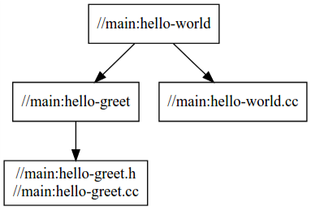

# bazel

## reference

- [test-bazel-cpp-tutorial](https://github.com/0x822a5b87/test-bazel-cpp-tutorial)

## 术语

### Workspace

Workspace 是项目组织源代码、构建软件的目录，标志是该目录下有`WORKSPACE`文件，子目录里边的WORKSPACE会被忽略。

### Repositories

WORKSPACE文件里边的依赖的规则，依赖规则通常制定外部仓库，即Repositories。通常被依赖的仓库也有WORKSPACE，但是会被忽略，而且依赖的仓库的里边的依赖，不会自动的被添加。

使用 `@` 来指定仓库。

### Packages

有关联代码的基础组织单元，有BUILD或者BUILD.bazel文件

### Targets

包是Target的容器，Target是组成包的基本元素，最主要的两种Target是文件和规则，另外一种是Package Group，不常用

```
Package
|── Target
|   |── File
|   |   |── Source files
|   |   |── Generated files
|   |
|   |── Rules
|   |   |── Attributes
|   |── Package Group
        |──  Contents
```

### Package Group

使用`package_group`定义的组。

### Labels

所有的Targets都属于特定的一个包，某个包里Target的名字就是Label，分为绝对路径、相对路径的label。

```bazel
@myrepo//my/app/main:app_binary
```

- 如果package名和target名相同，则可以省略掉`:target_name`，比如这里的`//absl/strings`等价于`//absl/strings:strings`
- 如果是根目录下的与workspace同名的target，也可以省略掉`:target_name`，比如这里的`"@zlib"`等价于`"@zlib//:zlib"`
- 如果和BUILD相同目录的target，则可以省略掉`//package-name`，比如下边这个在GRPC的网站上更清晰的解释


### Rules

rules定义输入和输出的产生过程。输入可能是source file, generated file, other rules. 三种常见的rule: `*_binary`、`*_test`、`*_library`. 以cc_binary为例，规则可能是：

1. 接受一批 `.cpp` 文件作为输入
2. 执行 `g++` 编译
3. 返回一个可执行文件

### BUILD Files

BUILD是用[Starlark](https://github.com/bazelbuild/starlark/)语言写的短小的程序，用来具体说明从源文件如何构建出目标，其中定义数据、使用函数，但是不会定义函数、if、for等逻辑块（也有特例），这些应该放在.bzl文件中定义。

### `.bzl` files

Bazel 的扩展文件，也是用Starlark写的，**常量、函数、rule、逻辑块**不放BUILD中，放到`.bzl`文件中。

BUILD文件中使用`load`函数导入扩展中的符号(变量、函数)，`_`开头的符号不能被导入。

```python
load("//foo/bar:file.bzl", "some_library")
load("@bazel_tools//tools/build_defs/repo:http.bzl", "http_archive")
```

`@bazel_tools` 是hazel内建的external repository。从github上clonebazel项目，可以看到，bazel_tools是由//:compile.sh中创建的bazel_tools的WORKSPACE，//:tools/build_defs/repo/http.bzl文件实现的具体内容。

### Functions

用来做某些功能动作的函数，可以是定义在.bzl文件中的函数，也可以是内置的函数，如：`package/package_group/licenses/exports_files/glob/select/workspace`.

和Rules的区别是(?)：不会构建出文件

rule就是通过`rule()`函数来创建的，调用`rule()`函数的时候都需要传入一个function作为`implementation`的参数，This function contains the actual logic of the rule and is executed strictly in the [analysis phase](https://docs.bazel.build/versions/master/skylark/concepts.html#evaluation-model).

## stage

### stage1

> 再回忆一下之前的 Targets 的描述：
>
> 1. hello-world.cc 对应于目录结构的 `Source FIles`
> 2. `cc_binary` 对应于 `Rules`
> 3. `name` 和 `srcs` 对应于 `Attributes`
>
> 以及对于我们的 labels `@myrepo//my/app/main:app_binary` ： `//main:hello-world`
>
> 1. `WORKSPACE` 使用默认
> 2. `main` 是我们的 `filesystem root`，是我们到 `root of workspace` 的相对路径，而 `main:` 构成了我们的 `package`
> 3. `package` 下的所有 `BUILD` 文件就是包含了我们的 `RULES`
> 4. `hello-world` 使我们的 `target name`

> In the target label, the `//main:` part is the location of the BUILD file relative to the root of the workspace, and `hello-world` is the target name in the BUILD file. 

```python
cc_binary(
    name = "hello-world",
    srcs = ["hello-world.cc"],
)
```

```bash
bazel build //main:hello-world
```

### stage2

> With this `BUILD` file, Bazel first builds the `hello-greet` library (using Bazel’s built-in [`cc_library` rule](https://docs.bazel.build/versions/main/be/c-cpp.html#cc_library)), then the `hello-world` binary. The `deps` attribute in the `hello-world` target tells Bazel that the `hello-greet` library is required to build the `hello-world` binary.

```python
cc_library(
    name = "hello-greet",
    srcs = ["hello-greet.cc"],
    hdrs = ["hello-greet.h"],
)

cc_binary(
    name = "hello-world",
    srcs = ["hello-world.cc"],
    deps = [
        ":hello-greet",
    ],
)
```

Looking at the dependency graph, you can see that `hello-world` depends on the same inputs as it did before, but the structure of the build is different:



### stage3

> You can split the project into multiple packages. Take a look at the contents of the `cpp-tutorial/stage3` directory:

```
└──stage3
   ├── main
   │   ├── BUILD
   │   ├── hello-world.cc
   │   ├── hello-greet.cc
   │   └── hello-greet.h
   ├── lib
   │   ├── BUILD
   │   ├── hello-time.cc
   │   └── hello-time.h
   └── WORKSPACE
```

#### lib/BUILD

```python
cc_library(
    name = "hello-time",
    srcs = ["hello-time.cc"],
    hdrs = ["hello-time.h"],
    visibility = ["//main:__pkg__"],
)
```

#### main/BUILD

> 依赖了一个 `Target`： `//lib:hello-time`

```python
cc_library(
    name = "hello-greet",
    srcs = ["hello-greet.cc"],
    hdrs = ["hello-greet.h"],
)

cc_binary(
    name = "hello-world",
    srcs = ["hello-world.cc"],
    deps = [
        ":hello-greet",
        "//lib:hello-time",
    ],
)
```

### stage4 本地外部依赖

> Stage4中分别将stage3中的两个依赖分别独立成两个独立的项目，hello-greet 为 non-Bazel项目，hello-time 为Bazel项目。目录结构如下：


> 我们在 stage4 中，通过 `WORKSPACE` 文件指定了组织源代码，构建软件的目录。


> `WORKSPACE` 文件，在这个文件中，我们声明了在 `stage4` 中依赖的源码：
>
> 1. non-bazel 的仓库 `hello_greet_lib`，我们通过 `new_local_repository` 来声明；
> 2. bazel 仓库 `hello_time_lib`，我们通过 `local_repository` 来声明；
>
> **non-bazel 的仓库，需要指定 build_file**

```python
new_local_repository(
    name = "hello_greet_lib",
    build_file = "//:greet.BUILD",
    path = "../hello-greet-lib",
)

local_repository(
    name = "hello_time_lib",
    path = "../hello-time-lib",
)
```

> **greet.BUILD**

```python
cc_library(
    name = "hello-greet",
    srcs = ["hello-greet.cc"],
    hdrs = ["hello-greet.h"],
    visibility = ["//visibility:public"],
)
```

> `main/BUILD`
>
> 在这里，我们引入了 `WORKSPACE` 中声明的两个仓库：
>
> 1. `@hello_time_lib`
> 2. `@hello_greet_lib`
>
> 可以看到，我们在引入使用的仓库时，可以使用 `labels` 引用依赖

```python
cc_binary(
    name = "hello-world",
    srcs = ["hello-world.cc"],
    deps = [
        "@hello_time_lib//lib:hello-time",
        "@hello_greet_lib//:hello-greet",
    ],
)
```

> `hello-world.cc`
>
> 再引入所有的依赖之后，就可以直接在我们的C++代码中引用这些依赖了：
>
> 1. `#include "lib/hello-time.h"` 我们通过 `@hello_time_lib//lib:hello-time` 引入了 hello-time，注意，引入的还是位于 `WORKSPACE` 同层级的目录下；
> 2. `#include "hello-greet.h"` 我们通过 `@hello_greet_lib//:hello-greet` 和 `greet.BUILD` 引入了 hello-greet，同样的，引入的依赖位于 `WORKSPACE` 下，只不过这个 `WORKSPACE` 是 `greet.BUILD` 生成的。

```c++
#include <iostream>
#include <string>

#include "lib/hello-time.h"
#include "hello-greet.h"

int main(int argc, char **argv)
{
	std::string who = "world";
	if (argc > 1)
	{
		who = argv[1];
	}
	std::cout << get_greet(who) << std::endl;
	print_localtime();
	return 0;
}
```

### stage5 远程外部依赖 ： zlib

> `zlib` 和 `absl` 分别是一个用于数据压缩和google开源的一个基础类库，其中 `zlib` 是 non-bazel project，而 `absl`是 bazel project
>
> - [zlib github](https://github.com/madler/zlib)
> - [abseil-cpp github](https://github.com/abseil/abseil-cpp)


> `stage5/BUILD` 为空

> `stage5/WORKSPACE`
>
> 1. 在这里，我们通过 load 函数导入扩展中的符号(变量、函数)；
> 2. 我们通过 `http_archive` 分别导入了 `absl`、`zlib` 两个不同的依赖。
>
> 同时我们还要注意以下几个地方，[http_archive document ](https://docs.bazel.build/versions/main/repo/http.html):The following functions can be loaded from `@bazel_tools//tools/build_defs/repo:http.bzl`.
>
> 1. http_archive : Downloads a Bazel repository as a compressed archive file, decompresses it, and makes its targets available for binding.
> 2. strip_prefix : 在 `url` 中我指定了一个下载链接，通过这个链接下载的文件我们可以使用 `strip_prefix` 来保留部分文件。
> 3. url ：A URL to a file that will be made available to Bazel.
> 4. build_file_content : The content for the BUILD file for this repository. Either build_file or build_file_content can be specified, but not both.
> 5. cc_library/glob ： glob is a bazel function，see [glob function](https://docs.bazel.build/versions/main/be/functions.html#glob)

```python
load("@bazel_tools//tools/build_defs/repo:http.bzl", "http_archive")

http_archive(
    name = "com_google_absl",
    sha256 = "84b4277a9b56f9a192952beca535313497826c6ff2e38b2cac7351a3ed2ae780",
    strip_prefix = "abseil-cpp-c476da141ca9cffc2137baf85872f0cae9ffa9ad",
    url = "https://github.com/abseil/abseil-cpp/archive/c476da141ca9cffc2137baf85872f0cae9ffa9ad.zip",
)

http_archive(
    name = "zlib",
    #build_file = "//:zlib.BUILD.bazel",
    build_file_content = """
cc_library(
    name = "zlib",
    srcs = glob(["*.c", "*.h"]),
    includes = ["."],
    visibility = ["//visibility:public"],
)
    """,
    sha256 = "c3e5e9fdd5004dcb542feda5ee4f0ff0744628baf8ed2dd5d66f8ca1197cb1a1",
    strip_prefix = "zlib-1.2.11",
    urls = ["https://mirror.bazel.build/zlib.net/zlib-1.2.11.tar.gz"],
)
```

> `stage5/main/BUILD`

```python
cc_binary(
    name = "hello-world",
    srcs = ["hello-world.cc"],
    deps = [
        "@com_google_absl//absl/strings:strings",
        "@zlib",
    ],
)
```

> `stage5/main/hello-world.cc`

```cpp
#include "absl/strings/str_join.h"
#include "zlib.h"
#include <iostream>
#include <string>
#include <vector>

std::string get_greet(const std::string &who)
{
	std::vector<std::string> v = {"Hello"};
	v.push_back(who);
	return absl::StrJoin(v, " ");
}

int main(int argc, char **argv)
{
	std::string who = "world";
	if (argc > 1)
	{
		who = argv[1];
	}
	std::string greet_str = get_greet(who);
	std::cout << greet_str << std::endl;
	printf("Uncompressed greet_str size is: %lu\n", greet_str.length());

	char compressed_greet_cstr[100];

	// zlib struct
	z_stream defstream;
	defstream.zalloc = Z_NULL;
	defstream.zfree  = Z_NULL;
	defstream.opaque = Z_NULL;
	// setup "a" as the input and "b" as the compressed output
	defstream.avail_in =
			greet_str.length() + 1; // size of input, string + terminator
	defstream.next_in   = (Bytef *) greet_str.data();             // input char array
	defstream.avail_out = (uInt) sizeof(compressed_greet_cstr); // size of output
	defstream.next_out  = (Bytef *) compressed_greet_cstr; // output char array

	// the actual compression work.
	deflateInit(&defstream, Z_BEST_COMPRESSION);
	deflate(&defstream, Z_FINISH);
	deflateEnd(&defstream);

	// print the size of the output.
	printf("Uncompressed greet_str size is: %lu\n", defstream.total_out);

	return 0;
}
```

### Stage 6: 使用.bzl文件

> 简单的将 `WORKSPACE` 中的文件迁移到了 `deps.bzl`；
>
> 注意，我们在这里使用了 [bazel native function](https://docs.bazel.build/versions/main/skylark/lib/native.html)

```python
load("@bazel_tools//tools/build_defs/repo:http.bzl", "http_archive")

def load_deps():
    if "com_google_absl" not in native.existing_rules():
        http_archive(
            name = "com_google_absl",
            sha256 = "84b4277a9b56f9a192952beca535313497826c6ff2e38b2cac7351a3ed2ae780",
            strip_prefix = "abseil-cpp-c476da141ca9cffc2137baf85872f0cae9ffa9ad",
            url = "https://github.com/abseil/abseil-cpp/archive/c476da141ca9cffc2137baf85872f0cae9ffa9ad.zip",
        )

    if "zlib" not in native.existing_rules():
        http_archive(
            name = "zlib",
            build_file_content = """
cc_library(
    name = "zlib",
    srcs = glob(["*.c", "*.h"]),
    includes = ["."],
    visibility = ["//visibility:public"],
)
            """,
            sha256 = "c3e5e9fdd5004dcb542feda5ee4f0ff0744628baf8ed2dd5d66f8ca1197cb1a1",
            strip_prefix = "zlib-1.2.11",
            urls = ["https://mirror.bazel.build/zlib.net/zlib-1.2.11.tar.gz"],
        )
```

### 使用Bazel构建gRPC项目

> [gRPC](https://github.com/grpc/grpc/tree/master/examples) 项目中包含了很多例子。我们将使用examples/cpp/helloworld中的greeter_client例子，根据Makefile新写一个可用的WORKSPACE和BUILD。
>
> [greeter_client.cc](https://github.com/grpc/grpc/tree/master/examples/cpp/helloworld)

> Makefile中主要主要关注以下几点：
>
> - 依赖protoc产生helloworld.pb.{h,cc}文件和helloworld.grpc.pb.{h,cc}
> - 使用`-std=c++11`编译选项
> - 依赖一些库`-lprotobuf -pthread -lgrpc++ -lgrpc -lgrpc++_reflection -ldl`
>
> 下面会将**pb相关文件的生成**作为Stage7，将**编译生成greeter_client**作为Stage8.

### Stage 7: 生成pb文件


#### stage7/WORKSPACE

> 我们做了这几件事：
>
> 1. 初始化 http_archive 用于下载依赖；
> 2. 初始化 `protobuf_deps`，`grpc_deps`，`grpc_extra_deps` 下载 protobuf 以及 grpc 的依赖；
> 3. 绑定 `target`

```python
# 读取 http_archive 函数
load("@bazel_tools//tools/build_defs/repo:http.bzl", "http_archive")

# 引入 com_google_protobuf
http_archive(
    # required by proto_library
    name = "com_google_protobuf",
    strip_prefix = "protobuf-master",
    urls = ["https://github.com/protocolbuffers/protobuf/archive/master.zip"],
)

# 读取 com_google_protobuf 依赖的 protobuf-master/protobuf_deps.bzl 文件作为 protobuf_deps 函数
load("@com_google_protobuf//:protobuf_deps.bzl", "protobuf_deps")

# 调用 protobuf_deps，Load dependencies needed to compile the protobuf library as a 3rd-party consumer.
protobuf_deps()

# 读取 grpc 相关依赖
http_archive(
    name = "com_github_grpc_grpc",
    strip_prefix = "grpc-1.27.0",
    urls = ["https://github.com/grpc/grpc/archive/v1.27.0.tar.gz"],
)

load("@com_github_grpc_grpc//bazel:grpc_deps.bzl", "grpc_deps")

grpc_deps()

load("@com_github_grpc_grpc//bazel:grpc_extra_deps.bzl", "grpc_extra_deps")

grpc_extra_deps()

http_archive(
    name = "bazel_skylib",
    sha256 = "bbccf674aa441c266df9894182d80de104cabd19be98be002f6d478aaa31574d",
    strip_prefix = "bazel-skylib-2169ae1c374aab4a09aa90e65efe1a3aad4e279b",
    urls = ["https://github.com/bazelbuild/bazel-skylib/archive/2169ae1c374aab4a09aa90e65efe1a3aad4e279b.tar.gz"],
)

bind(
    # required by cc_proto_library
    name = "com_google_protobuf_cc",
    actual = "@com_google_protobuf",
)

bind(
    name = "protobuf",
    actual = "@com_google_protobuf//:protobuf",
)

bind(
    name = "protobuf_clib",
    actual = "@com_google_protobuf//:protoc_lib",
)

bind(
    name = "protobuf_headers",
    actual = "@com_google_protobuf//:protobuf_headers",
)

bind(
    name = "protocol_compiler",
    actual = "@com_google_protobuf//:protoc",
)
```

#### stage7/BUILD

> 1. 读取 `cc_grpc_library.bzl`："""Generates and compiles C++ grpc stubs from proto_library rules."""
> 2. 读取 `helloworld.proto` 并设定 target name 为 `helloworld_proto`
> 3.  读取 `helloworld_proto` 并设定 target name 为 `helloworld_cc_proto`
> 4. 使用<1>加载的 `cc_grpc_library` 
>    1. name (str): Name of rule.
>    2. srcs (list): A single .proto file which contains services definitions, or if grpc_only parameter is True, a single proto_library which contains services descriptors.
>    3. grpc_only (bool): if True, generate only grpc library, expecting protobuf messages library (cc_proto_library target) to be passed as deps. False by default (will become True by default eventually). **kwargs: rest of arguments, e.g., compatible_with and visibility
>    4. deps (list): A list of C++ proto_library (or cc_proto_library) which provides the compiled code of any message that the services depend on.

```python
load("@com_github_grpc_grpc//bazel:cc_grpc_library.bzl", "cc_grpc_library")

# Use `proto_library` to define libraries of protocol buffers which may be used from multiple languages.
proto_library(
    name = "helloworld_proto",
    srcs = [":helloworld.proto"],
)

# cc_proto_library generates C++ code from .proto files.
cc_proto_library(
    name = "helloworld_cc_proto",
    deps = [":helloworld_proto"],
)

cc_grpc_library(
    name = "helloworld_cc_grpc",
    srcs = [":helloworld_proto"],
    grpc_only = True,
    deps = [":helloworld_cc_proto"],
)
```

### Stage 8: 编译与链接选项

> 需要


#### stage8/src/BUILD

```python
cc_binary(
    name = "greeter_client",
    srcs = ["greeter_client.cc"],
    copts = [
        "-std=c++11",
    ],
    linkopts = [
        "-lpthread",
        "-ldl",
    ],
    deps = [
        "//protos:helloworld_cc_grpc",
        "@com_google_grpc//:grpc++",
    ],
)
```

#### stage8/src/greeter_client.cc

```cpp
#include <iostream>
#include <memory>
#include <string>

#include <grpcpp/grpcpp.h>

#include "protos/helloworld.grpc.pb.h"

using grpc::Channel;
using grpc::ClientContext;
using grpc::Status;
using helloworld::Greeter;
using helloworld::HelloReply;
using helloworld::HelloRequest;

class GreeterClient {
public:
  GreeterClient(std::shared_ptr<Channel> channel)
      : stub_(Greeter::NewStub(channel)) {}

  // Assembles the client's payload, sends it and presents the response back
  // from the server.
  std::string SayHello(const std::string &user) {
    // Data we are sending to the server.
    HelloRequest request;
    request.set_name(user);

    // Container for the data we expect from the server.
    HelloReply reply;

    // Context for the client. It could be used to convey extra information to
    // the server and/or tweak certain RPC behaviors.
    ClientContext context;

    // The actual RPC.
    Status status = stub_->SayHello(&context, request, &reply);

    // Act upon its status.
    if (status.ok()) {
      return reply.message();
    } else {
      std::cout << status.error_code() << ": " << status.error_message()
                << std::endl;
      return "RPC failed";
    }
  }

private:
  std::unique_ptr<Greeter::Stub> stub_;
};

int main(int argc, char **argv) {
  // Instantiate the client. It requires a channel, out of which the actual RPCs
  // are created. This channel models a connection to an endpoint (in this case,
  // localhost at port 50051). We indicate that the channel isn't authenticated
  // (use of InsecureChannelCredentials()).
  GreeterClient greeter(grpc::CreateChannel(
      "localhost:50051", grpc::InsecureChannelCredentials()));
  std::string user("world");
  std::string reply = greeter.SayHello(user);
  std::cout << "Greeter received: " << reply << std::endl;

  return 0;
}
```


