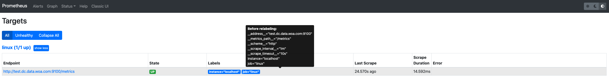
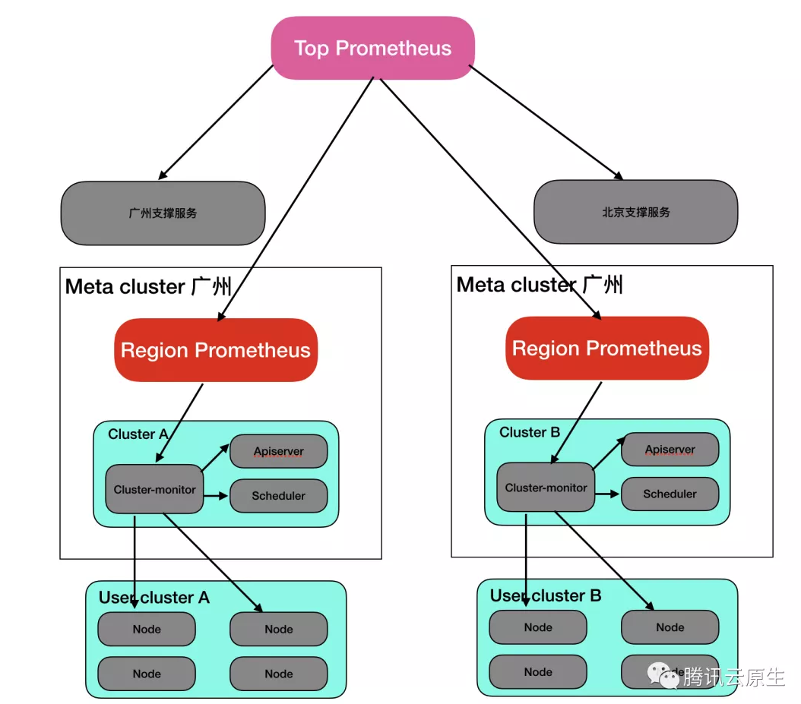
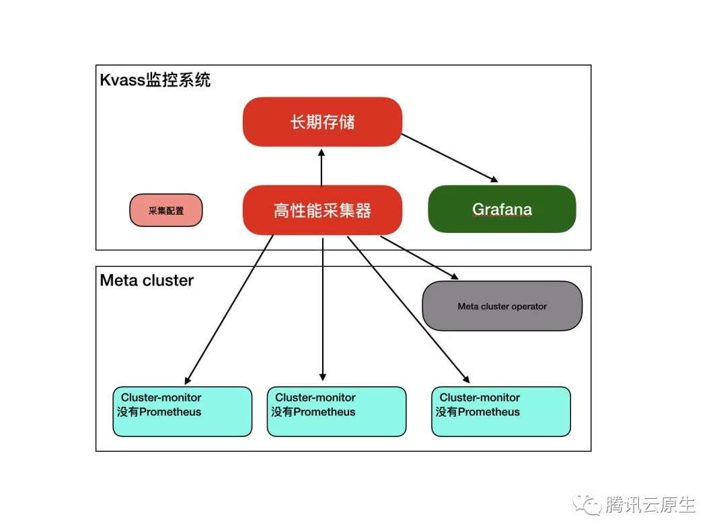
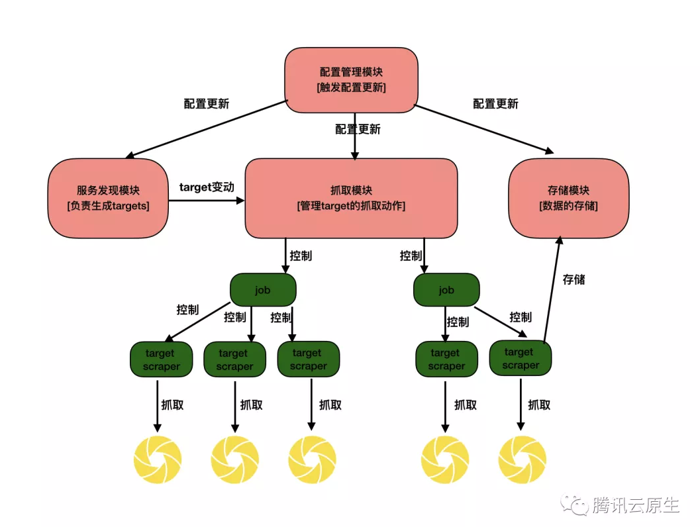
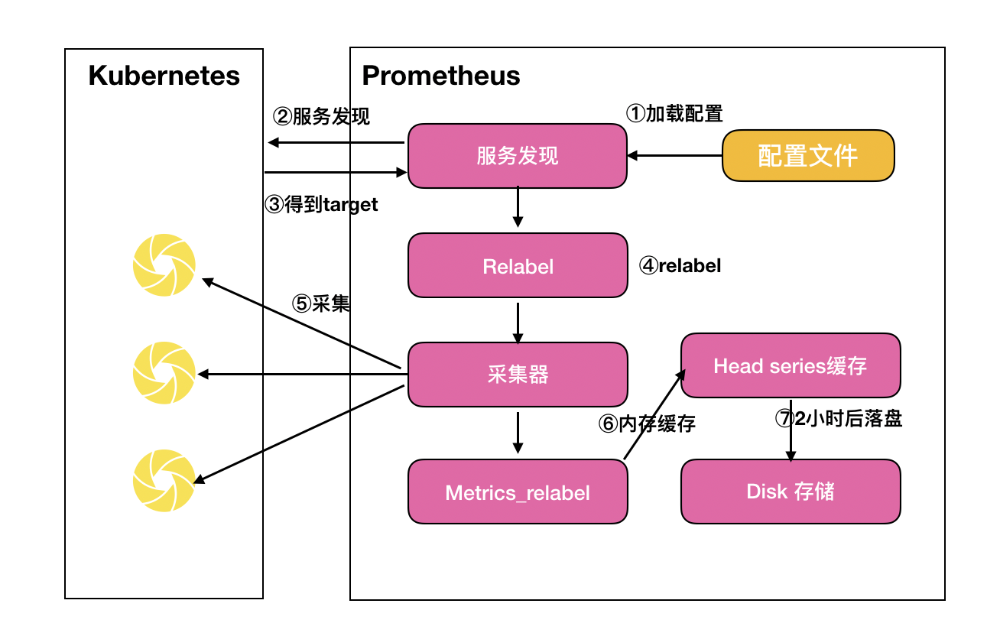
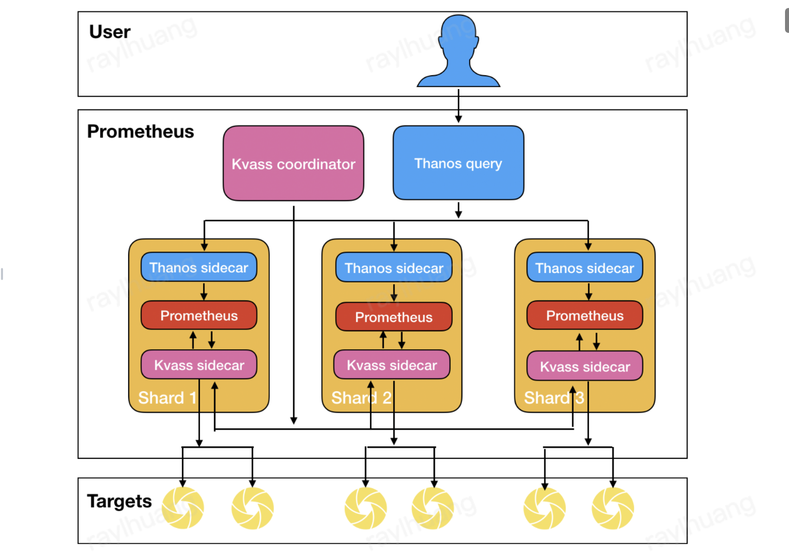
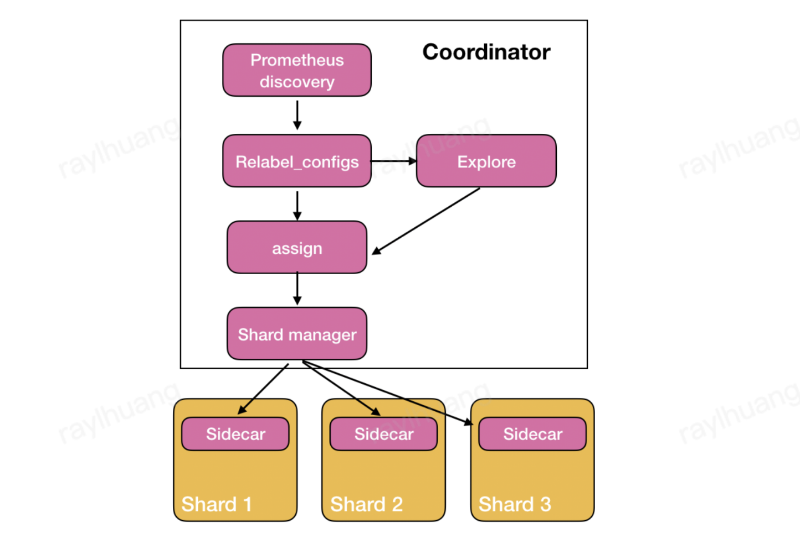
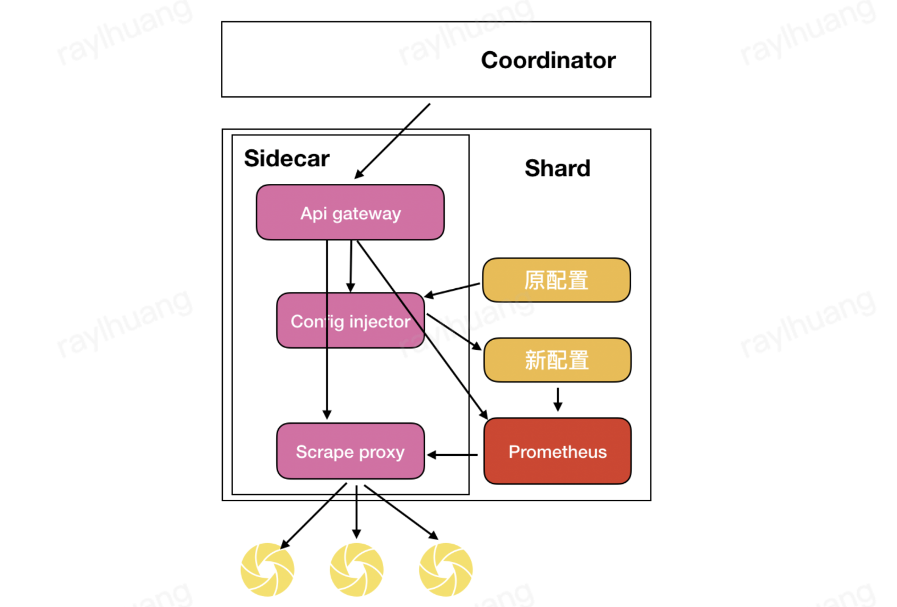
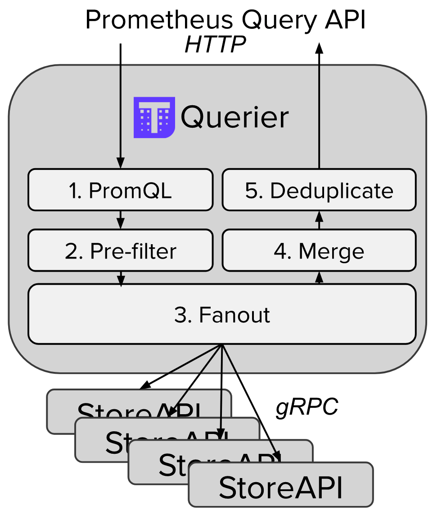

# prometheus 集群化方案

## reference

- [**服务发现与Relabel**](https://yunlzheng.gitbook.io/prometheus-book/part-ii-prometheus-jin-jie/sd/service-discovery-with-relabel)
- [Thanos - Open source, highly available Prometheus setup with long term storage capabilities.](https://thanos.io/)
- [Cortex - Horizontally scalable, highly available, multi-tenant, long term storage for Prometheus.](https://cortexmetrics.io/)
- [kvass - Kvass is a Prometheus horizontal auto-scaling solution , which uses Sidecar to generate special config file only containes part of targets assigned from Coordinator for every Prometheus shard.](https://github.com/tkestack/kvass)
- [如何扩展单个Prometheus实现近万Kubernetes集群监控？](https://mp.weixin.qq.com/s?__biz=Mzg5NjA1MjkxNw==&mid=2247486068&idx=1&sn=1da847461cbd2b9a92cba9f51818d9db&chksm=c007b1aef77038b84d3da5fd7a50fc2e7eb51253042c67a3b7f3db2f08130ca7425d8d953a28&mpshare=1&scene=1&srcid=0812musJWcQzfAEf7bDwGmIn&sharer_sharetime=1597215750359&sharer_shareid=c36e4807e52bb0fd28e7ef15200507a3&rd2werd=1#wechat_redirect)

## **服务发现与Relabel**

### Prometheus的Relabeling机制

>在Prometheus所有的Target实例中，都包含一些默认的Metadata标签信息。可以通过Prometheus UI的Targets页面中查看这些实例的Metadata标签的内容：



默认情况下，当Prometheus加载Target实例完成后，这些Target时候都会包含一些默认的标签：

- `__address__`：当前Target实例的访问地址`<host>:<port>
- `__scheme__`：采集目标服务访问地址的HTTP Scheme，HTTP或者HTTPS
- `__metrics_path__`：采集目标服务访问地址的访问路径
- `__param_<name>`：采集任务目标服务的中包含的请求参数

> relabel 是发生在 **采集样本数据之前，对Target实例的标签进行重写的机制**


### 使用replace/labelmap重写标签

#### 最简单的重写标签

> 我们原始配置是

```yaml
global:
  scrape_interval:     60s
  evaluation_interval: 60s

scrape_configs:
  - job_name: linux
    static_configs:
      - targets: ['test.dc.data.woa.com:9100']
        labels:
          instance: localhost
```

> 此时我们上报的数据为

```
process_cpu_seconds_total{instance="localhost", job="linux"}
```

> 增加 relabel 之后的配置是

```yaml
global:
  scrape_interval:     60s
  evaluation_interval: 60s

scrape_configs:
  - job_name: linux
    static_configs:
      - targets: ['test.dc.data.woa.com:9100']
        labels:
          instance: localhost
    relabel_configs:
    - source_labels:  ["__address_"]
      target_label: "dev"
```

> 此时上报的数据变成了

```
process_cpu_seconds_total{dev="test.dc.data.woa.com:9100", instance="localhost", job="linux"}
```

### 完整的relabel_config配置如下所示：

```yaml
# The source labels select values from existing labels. Their content is concatenated
# using the configured separator and matched against the configured regular expression
# for the replace, keep, and drop actions.
[ source_labels: '[' <labelname> [, ...] ']' ]

# Separator placed between concatenated source label values.
[ separator: <string> | default = ; ]

# Label to which the resulting value is written in a replace action.
# It is mandatory for replace actions. Regex capture groups are available.
[ target_label: <labelname> ]

# Regular expression against which the extracted value is matched.
[ regex: <regex> | default = (.*) ]

# Modulus to take of the hash of the source label values.
[ modulus: <uint64> ]

# Replacement value against which a regex replace is performed if the
# regular expression matches. Regex capture groups are available.
[ replacement: <string> | default = $1 ]

# Action to perform based on regex matching.
[ action: <relabel_action> | default = replace ]
```

### 使用keep/drop过滤Target实例

```yaml
global:
  scrape_interval:     60s
  evaluation_interval: 60s

scrape_configs:
  - job_name: linux
    static_configs:
      - targets: ['test.dc.data.woa.com:9100']
        labels:
          instance: localhost
    relabel_configs:
    - source_labels:  ["__address_"]
      target_label: "dev"
      action: drop
```

### 使用hashmod计算source_labels的Hash值

> 当relabel_config设置为hashmod时，Prometheus会根据modulus的值作为系数，计算source_labels值的hash值。例如：
>
> 根据当前Target实例`__address__`的值以4作为系数，这样每个Target实例都会包含一个新的标签tmp_hash，并且该值的范围在1~4之间，查看Target实例的标签信息，可以看到如下的结果，每一个Target实例都包含了一个新的tmp_hash值：

```yaml
scrape_configs:
- job_name: 'file_ds'
  relabel_configs:
    - source_labels: [__address__]
      modulus:       4
      target_label:  tmp_hash
      action:        hashmod
  file_sd_configs:
  - files:
    - targets.json
```


> 上面这段配置，表示只接受 hash(gcs_app) % N == 0 的target。

```yaml
 relabel_configs:
    - source_labels: [app]
      modulus:       N
      target_label:  __tmp_hash
      action:        hashmod
    - source_labels: [__tmp_hash]
      regex:         ^0$  #0,N)
      action:        keep
```

> 配置

```yaml
  - job_name: 'cadvisor-1'
    metrics_path: /metrics/cadvisor
    scheme: https

    # 请求 kubelet metrics 接口也需要认证和授权，通常会用 webhook 方式让 apiserver 代理进行 RBAC 校验，所以还是用 ServiceAccount 的 token
    bearer_token_file: /var/run/secrets/kubernetes.io/serviceaccount/token

    kubernetes_sd_configs:
    - role: node

    # 通常不校验 kubelet 的 server 证书，避免报 x509: certificate signed by unknown authority
    tls_config:
      insecure_skip_verify: true

    relabel_configs:
    - source_labels: [__address__]
      modulus:       4    # 将节点分片成 4 个 group
      target_label:  __tmp_hash
      action:        hashmod
    - source_labels: [__tmp_hash]
      regex:         ^1$  # 只抓第 2 个 group 中节点的数据(序号 0 为第 1 个 group)
      action:        keep
```


## 如何扩展单个Prometheus实现近万Kubernetes集群监控？

### 总结

> 1. 使用 kubernetes in kubernetes 的方案，支持的 series 量少，管理复杂，并且下游的prometheus集群没有办法监控到地域级别的数据（所以需要在地域级别的prometheus集群上再新增一个全网级别的prometheus）；
> 2. prometheus 的内存占用主要是因为两个模块：`存储模块` 和 `抓取模块`；
>    1. 存储模块需要缓存所有 series 的 label 信息；
>    2. 抓取模块每个series只有第一次被存储的时候才会把series的label信息传给存储模块，存储模块会返回一个id，target scraper就会将series进行hash并与id对应，后续抓取时，本series只需将id和值告诉存储模块即可。hash与id的对应表也比较占内存。
> 3. 负载的来源是源于 target scraper 过多，通过引入一个单独的 `协调器` 去协调来协调 target scraper；
> 4. 存储方案有 **Cortex** 和 **Thanos**：
>    1. **Thanos** 收集 prometheus 落在本地的数据到远程存储，但是查询时优先从各Prometheus处查询数据，如果没查到，则从对象存储中查询历史数据；
>    2. **Cortex** 是兼容 Prometheus 的 TSDB

### 核心名词

- **Meta Cluster** 托管其他集群的apiserver，controller-manager，scheduler，监控套件等非业务组件
- **Cluster-monitor** 单集群级别的监控采集套件
- **Barad**：云监控提供的多维监控系统，是云上其他服务主要使用的监控系统，其相对成熟稳定，但是不灵活，指标和label都需要提前在系统上设置好。
- **Argus**：云监控团队提供的多维业务监控系统，其特点是支持较为灵活的指标上报机制和强大的告警能力。这是TKE团队主要使用的监控系统。
- **Region Prometheus**： 因为 Cluster-monitor 只能采集集群自身的监控数据，但是一个 region 可能会包含多个不同的 cluster，所以可能需要 Region Prometheus 来采集 region 的相关数据。
- **Top Prometheus**：所有地域的Region Prometheus数据再聚合得到全网级别指标
- **job**: Prometheus的采集任务由配置文件中一个个的Job组成，一个Job里包含该Job下的所有监控目标的公共配置，比如使用哪种服务发现去获取监控目标，比如抓取时使用的证书配置，请求参数配置等等。
- **target**: 一个监控目标就是一个target，一个job通过服务发现会得到多个需要监控的target及其label集合用于描述target的一些属性。
- **relabel_configs**: 每个job都可以配置一个或多个relabel_config，relabel_config会对target的label集合进行处理，可以根据label过滤一些target或者修改，增加，删除一些label。**relabel_config过程发生在target开始进行采集之前,针对的是通过服务发现得到的label集合**。
- **metrics_relabel_configs**：每个job还可以配置一个或者多个metrics_relabel_config，其配置方式和relabel_configs一模一样，**但是其用于处理的是从target采集到的数据中的label**。
- **series**：一个series就是指标名+label集合，在面板中，表现为一条曲线。
- **head series**：Prometheus会将近2小时的series缓存在内存中，称为head series。

### 架构图

> 原始架构



> kvass
>
> - 去掉了Cluster-monitor中的Prometheus
> - 去掉了Region Prometheus




### kvass

#### 高性能采集

> **Prometheus采集原理**




## 如何不修改Prometheus代码实现横向扩缩容

### prometheus 原理简介

- **服务发现**：Prometheus周期性得以pull的形式对target进行指标采集，而监控目标集合是通过配置文件中所定义的服务发现机制来动态生成的。
- **relabel**：当服务发现得到所有target后，Prometheus会根据job中的relabel_configs配置对target进行relabel操作，得到target最终的label集合。
- **采集**：进行完上述操作后，Prometheus为这些target创建采集循环，按配置文件里配置的采集间隔进行周期性拉取，采集到的数据根据Job中的metrics_relabel_configs进行relabel，然后再加入上边得到的target最终label集合，综合后得到最终的数据。
- **存储**：Prometheus不会将采集到的数据直接落盘，而是会将近2小时的series缓存在内存中，2小时后，Prometheus会进行一次数据压缩，将内存中的数据落盘。



### Kvass

- **Kvass sidecar:** 用于接收Coordinator下发的采集任务，生成新的配置文件给Prometheus，也服务维护target负载情况。
- **Kvass coordinator:** 该组件是集群的中心控制器，负责服务发现，负载探测，targets下发等。
- **Thanos 组件:** 图中只使用了Thanos sidecar与Thanos query，用于对分片的数据进行汇总，得到统一的数据视图。



### Kvass Coordinator



### Kvass Sidecar

> **Sidecar 只使用 `static_configs`，而这个 `static_configs` 里面配置的IP，每个IP都是由 Coordinator 去发现的。所以 Sidecar 需要负责生成该分片的 target 列表对应的配置文件并提供给 Prometheus 使用。**
>
> 每个分片都会有一个Kvass sidecar，其核心功能包括从Kvass coordinator接受本分片负责的target列表，生成新的配置文件给该分片的Prometheus使用。另外，Kvass sidecar还会劫持抓取请求，维护target最新负载。Kvass sidecar还作为PrometheusAPI的网关，修正部分请求结果。



## thanos


### Thanos Query

> 实现了 Prometheus API，将来自下游组件提供的数据进行聚合最终返回给查询数据的 client (如 grafana)，类似数据库中间件。
>
> 
>
> **很容易看到，Thanos Query 需要同时查询多个 prom 和 Store，因为 prom 的 head series 是没有持久化的到 Store 的。**因为每个 prom 实例只能感知到自己的数据。

#### StoreAPI

> Thanos 内部的 gRPC 接口，`Thanos Sidecar` 通过 StoreAPI 暴露数据给 Query

#### Proxy

> Thanos Query 代理

#### Query API

> Thanos 对外暴露的查询协议。



### Thanos Sidecar

> 连接 Prometheus，将其数据提供给 Thanos Query 查询，并且/或者将其上传到对象存储，以供长期存储。

### Thanos Store Gateway

> 将对象存储的数据暴露给 Thanos Query 去查询。

### Thanos Ruler

> 对监控数据进行评估和告警，还可以计算出新的监控数据，将这些新数据提供给 Thanos Query 查询并且/或者上传到对象存储，以供长期存储。

### Thanos Compact

> 将对象存储中的数据进行压缩和降低采样率，加速大时间区间监控数据查询的速度。


