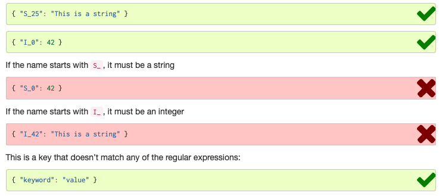
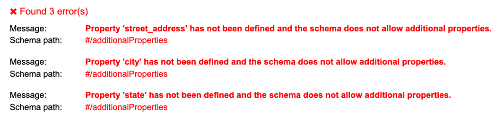

# JSON Schema and so on

## references

- [test json schema](https://github.com/0x822a5b87/test-json-schema)
- [JSON Schema](https://json-schema.org/)
- [JSON Schema Validator](https://github.com/everit-org/json-schema)
- [**JSON Schema: A Media Type for Describing JSON Documents**](https://json-schema.org/draft/2020-12/json-schema-core.html)
- [Getting Started Step-By-Step](https://json-schema.org/learn/getting-started-step-by-step.html)
- [Miscellaneous Examples](https://json-schema.org/learn/miscellaneous-examples.html)
- [Understanding JSON Schema](https://json-schema.org/understanding-json-schema/)
- [JSON Schema Reference](https://json-schema.org/understanding-json-schema/reference/index.html)
- [Structuring a complex schema](https://json-schema.org/understanding-json-schema/structuring.html)
- [Liquid Studio: How to write a JSON schema $ref to another file](https://stackoverflow.com/questions/42999230/liquid-studio-how-to-write-a-json-schema-ref-to-another-file)

## Glossary

> [The "$id" keyword](https://json-schema.org/draft/2020-12/json-schema-core.html#id-keyword)

The "$id" keyword identifies a schema resource with its [canonical](https://json-schema.org/draft/2020-12/json-schema-core.html#RFC6596) URI.

**Note that this URI is an identifier and not necessarily a network locator. **In the case of a network-addressable URL, a schema need not be downloadable from its canonical URI.

> [The "$schema" Keyword](https://json-schema.org/draft/2020-12/json-schema-core.html#keyword-schema)

The "$schema" keyword is both used as a JSON Schema dialect identifier and as the identifier of a resource which is itself a JSON Schema, which describes the set of valid schemas written for this particular dialect.

The value of this keyword MUST be a [URI](https://json-schema.org/draft/2020-12/json-schema-core.html#RFC3986) (containing a scheme) and this URI MUST be normalized. The current schema MUST be valid against the meta-schema identified by this URI.

If this URI identifies a retrievable resource, that resource SHOULD be of media type "application/schema+json".

## JSON Schema

### Getting Started Step-By-Step

#### Introduction

>Let’s pretend we’re interacting with a JSON based product catalog. This catalog has a product which has:

- An identifier: `productId`
- A product name: `productName`
- A selling cost for the consumer: `price`
- An optional set of tags: `tags`.

```json
{
  "productId": 1,
  "productName": "A green door",
  "price": 12.50,
  "tags": [ "home", "green" ]
}
```

#### Starting the schema

- The [`$schema`](https://json-schema.org/draft/2020-12/json-schema-core.html#rfc.section.8.1.1) keyword states that this schema is written according to a specific draft of the standard and used for a variety of reasons, primarily version control.
- The [`$id`](https://json-schema.org/draft/2020-12/json-schema-core.html#rfc.section.8.2.1) keyword defines a URI for the schema, and the base URI that other URI references within the schema are resolved against.
- The [`title`](https://json-schema.org/draft/2020-12/json-schema-validation.html#rfc.section.9.1) and [`description`](https://json-schema.org/draft/2020-12/json-schema-validation.html#rfc.section.9.1) annotation keywords are descriptive only. They do not add constraints to the data being validated. The intent of the schema is stated with these two keywords.
- The [`type`](https://json-schema.org/draft/2020-12/json-schema-validation.html#rfc.section.6.1.1) validation keyword defines the first constraint on our JSON data and in this case it has to be a JSON Object.

```json
{
  "$schema": "https://json-schema.org/draft/2020-12/schema",
  "$id": "https://example.com/product.schema.json",
  "title": "Product",
  "description": "A product in the catalog",
  "type": "object"
}
```

#### Defining the properties

> `productId` is a numeric value that uniquely identifies a product. Since this is the canonical identifier for a product, it doesn’t make sense to have a product without one, so it is required.

```json
{
  "$schema": "https://json-schema.org/draft/2020-12/schema",
  "$id": "https://example.com/product.schema.json",
  "title": "Product",
  "description": "A product from Acme's catalog",
  "type": "object",
  "properties": {
    "productId": {
      "description": "The unique identifier for a product",
      "type": "integer"
    }
  },
  "required": [ "productId" ]
}
```

- `productName` is a string value that describes a product. Since there isn’t much to a product without a name it also is required.
- Since the `required` validation keyword is an array of strings we can note multiple keys as required; We now include `productName`.
- There isn’t really any difference between `productId` and `productName` – we include both for completeness since computers typically pay attention to identifiers and humans typically pay attention to names.

```json
{
  "$schema": "https://json-schema.org/draft/2020-12/schema",
  "$id": "https://example.com/product.schema.json",
  "title": "Product",
  "description": "A product from Acme's catalog",
  "type": "object",
  "properties": {
    "productId": {
      "description": "The unique identifier for a product",
      "type": "integer"
    },
    "productName": {
      "description": "Name of the product",
      "type": "string"
    }
  },
  "required": [ "productId", "productName" ]
}
```

#### Going deeper with properties

>According to the store owner there are no free products. ;)
>
>- The `price` key is added with the usual `description` schema annotation and `type` validation keywords covered previously. It is also included in the array of keys defined by the `required` validation keyword.
>- We specify the value of `price` must be something other than zero using the `exclusiveMinimum` validation keyword.
>  - If we wanted to include zero as a valid price we would have specified the [`minimum`](https://json-schema.org/draft/2020-12/json-schema-validation.html#rfc.section.6.2.4) validation keyword.

 ```json
 {
   "$schema": "https://json-schema.org/draft/2020-12/schema",
   "$id": "https://example.com/product.schema.json",
   "title": "Product",
   "description": "A product from Acme's catalog",
   "type": "object",
   "properties": {
     "productId": {
       "description": "The unique identifier for a product",
       "type": "integer"
     },
     "productName": {
       "description": "Name of the product",
       "type": "string"
     },
     "price": {
       "description": "The price of the product",
       "type": "number",
       "exclusiveMinimum": 0
     }
   },
   "required": [ "productId", "productName", "price" ]
 }
 ```

> Next, we come to the `tags` key.

The store owner has said this:

- If there are tags there must be at least one tag,
- All tags must be unique; no duplication within a single product.
- All tags must be text.
- Tags are nice but they aren’t required to be present.

Therefore:

- The `tags` key is added with the usual annotations and keywords.
- This time the `type` validation keyword is `array`.
- We introduce the [`items`](https://json-schema.org/draft/2020-12/json-schema-core.html#rfc.section.10.3.1.2) validation keyword so we can define what appears in the array. In this case: `string` values via the `type` validation keyword.
- The [`minItems`](https://json-schema.org/draft/2020-12/json-schema-validation.html#rfc.section.6.4.2) validation keyword is used to make sure there is at least one item in the array.
- The [`uniqueItems`](https://json-schema.org/draft/2020-12/json-schema-validation.html#rfc.section.6.4.3) validation keyword notes all of the items in the array must be unique relative to one another.
- We did not add this key to the `required` validation keyword array because it is optional.

```json
{
  "$schema": "https://json-schema.org/draft/2020-12/schema",
  "$id": "https://example.com/product.schema.json",
  "title": "Product",
  "description": "A product from Acme's catalog",
  "type": "object",
  "properties": {
    "productId": {
      "description": "The unique identifier for a product",
      "type": "integer"
    },
    "productName": {
      "description": "Name of the product",
      "type": "string"
    },
    "price": {
      "description": "The price of the product",
      "type": "number",
      "exclusiveMinimum": 0
    },
    "tags": {
      "description": "Tags for the product",
      "type": "array",
      "items": {
        "type": "string"
      },
      "minItems": 1,
      "uniqueItems": true
    }
  },
  "required": [ "productId", "productName", "price" ]
}
```

#### Nesting data structures

> - The `dimensions` key is added using the concepts we’ve previously discovered. Since the `type` validation keyword is `object` we can use the `properties` validation keyword to define a nested data structure.
>   - We omitted the `description` annotation keyword for brevity in the example. While it’s usually preferable to annotate thoroughly in this case the structure and key names are fairly familiar to most developers.
> - You will note the scope of the `required` validation keyword is applicable to the dimensions key and not beyond.

```json
{
  "$schema": "https://json-schema.org/draft/2020-12/schema",
  "$id": "https://example.com/product.schema.json",
  "title": "Product",
  "description": "A product from Acme's catalog",
  "type": "object",
  "properties": {
    "productId": {
      "description": "The unique identifier for a product",
      "type": "integer"
    },
    "productName": {
      "description": "Name of the product",
      "type": "string"
    },
    "price": {
      "description": "The price of the product",
      "type": "number",
      "exclusiveMinimum": 0
    },
    "tags": {
      "description": "Tags for the product",
      "type": "array",
      "items": {
        "type": "string"
      },
      "minItems": 1,
      "uniqueItems": true
    },
    "dimensions": {
      "type": "object",
      "properties": {
        "length": {
          "type": "number"
        },
        "width": {
          "type": "number"
        },
        "height": {
          "type": "number"
        }
      },
      "required": [ "length", "width", "height" ]
    }
  },
  "required": [ "productId", "productName", "price" ]
}
```

#### References outside the schema

> So far our JSON schema has been wholly self contained. It is very common to share JSON schema across many data structures for reuse, readability and maintainability among other reasons.

For this example we introduce a new JSON Schema resource and for both properties therein:

- We use the `minimum` validation keyword noted earlier.
- We add the [`maximum`](https://json-schema.org/draft/2020-12/json-schema-validation.html#rfc.section.6.2.2) validation keyword.
- Combined, these give us a range to use in validation.

```json
{
  "$id": "https://example.com/geographical-location.schema.json",
  "$schema": "https://json-schema.org/draft/2020-12/schema",
  "title": "Longitude and Latitude",
  "description": "A geographical coordinate on a planet (most commonly Earth).",
  "required": [ "latitude", "longitude" ],
  "type": "object",
  "properties": {
    "latitude": {
      "type": "number",
      "minimum": -90,
      "maximum": 90
    },
    "longitude": {
      "type": "number",
      "minimum": -180,
      "maximum": 180
    }
  }
```

> Next we add a reference to this new schema so it can be incorporated.

```json
{
  "$schema": "https://json-schema.org/draft/2020-12/schema",
  "$id": "https://example.com/product.schema.json",
  "title": "Product",
  "description": "A product from Acme's catalog",
  "type": "object",
  "properties": {
    "productId": {
      "description": "The unique identifier for a product",
      "type": "integer"
    },
    "productName": {
      "description": "Name of the product",
      "type": "string"
    },
    "price": {
      "description": "The price of the product",
      "type": "number",
      "exclusiveMinimum": 0
    },
    "tags": {
      "description": "Tags for the product",
      "type": "array",
      "items": {
        "type": "string"
      },
      "minItems": 1,
      "uniqueItems": true
    },
    "dimensions": {
      "type": "object",
      "properties": {
        "length": {
          "type": "number"
        },
        "width": {
          "type": "number"
        },
        "height": {
          "type": "number"
        }
      },
      "required": [ "length", "width", "height" ]
    },
    "warehouseLocation": {
      "description": "Coordinates of the warehouse where the product is located.",
      "$ref": "https://example.com/geographical-location.schema.json"
    }
  },
  "required": [ "productId", "productName", "price" ]
}
```

#### Taking a look at data for our defined JSON Schema

> We’ve certainly expanded on the concept of a product since our earliest sample data (scroll up to the top). Let’s take a look at data which matches the JSON Schema we have defined.

```json
  {
    "productId": 1,
    "productName": "An ice sculpture",
    "price": 12.50,
    "tags": [ "cold", "ice" ],
    "dimensions": {
      "length": 7.0,
      "width": 12.0,
      "height": 9.5
    },
    "warehouseLocation": {
      "latitude": -78.75,
      "longitude": 20.4
    }
  }
```

## Modeling a file system with JSON Schema

### Introduction

> This example shows a possible JSON Schema representation of file system mount points as represented in an [`/etc/fstab`](https://en.wikipedia.org/wiki/Fstab) file.

An entry in an fstab file can have many different forms; Here is an example:

```json
{
  "/": {
    "storage": {
      "type": "disk",
      "device": "/dev/sda1"
    },
    "fstype": "btrfs",
    "readonly": true
  },
  "/var": {
    "storage": {
      "type": "disk",
      "label": "8f3ba6f4-5c70-46ec-83af-0d5434953e5f"
    },
    "fstype": "ext4",
    "options": [ "nosuid" ]
  },
  "/tmp": {
    "storage": {
      "type": "tmpfs",
      "sizeInMB": 64
    }
  },
  "/var/www": {
    "storage": {
      "type": "nfs",
      "server": "my.nfs.server",
      "remotePath": "/exports/mypath"
    }
  }
}
```

### Creating the `fstab` schema

> *You will notice that the regular expression is explicitly anchored (with* `^` *and* `$`*): in JSON Schema, regular expressions (in* `patternProperties` *and in* `pattern`*) are not anchored by default.*

```json
{
  "$id": "https://example.com/fstab",
  "$schema": "https://json-schema.org/draft/2020-12/schema",
  "type": "object",
  "required": [ "/" ],
  "properties": {
    "/": {}
  },
  "patternProperties": {
    "^(/[^/]+)+$": {}
  },
  "additionalProperties": false,
}
```

### Starting the `entry` schema

> We will start with an outline of the JSON schema which adds new concepts to what we’ve already demonstrated.
>
> To this we add:
>
> - The [`oneOf`](https://json-schema.org/draft/2020-12/json-schema-core.html#rfc.section.10.2.1.3) keyword.
> - The [`$ref`](https://json-schema.org/draft/2020-12/json-schema-core.html#rfc.section.8.2.3.1) keyword.
>   - In this case, all references used are local to the schema using a relative fragment URI (`#/...`).
> - The [`$defs`](https://json-schema.org/draft/2020-12/json-schema-core.html#rfc.section.8.2.4) keyword.
>   - Including several key names which we will define later.

```json
{
  "$id": "https://example.com/entry-schema",
  "$schema": "https://json-schema.org/draft/2020-12/schema",
  "description": "JSON Schema for an fstab entry",
  "type": "object",
  "required": [ "storage" ],
  "properties": {
    "storage": {
      "type": "object",
      "oneOf": [
        { "$ref": "#/$defs/diskDevice" },
        { "$ref": "#/$defs/diskUUID" },
        { "$ref": "#/$defs/nfs" },
        { "$ref": "#/$defs/tmpfs" }
      ]
    }
  },
  "$defs": {
    "diskDevice": {},
    "diskUUID": {},
    "nfs": {},
    "tmpfs": {}
  }
}
```

### Constraining an entry

> - Our `fstype` key uses the [`enum`](https://json-schema.org/draft/2020-12/json-schema-validation.html#rfc.section.6.1.2) validation keyword.
> - `options` must be an array, and the items therein must be strings, there must be at least one item, and all items should be unique.
> - We have a `readonly` key.

```json
{
  "$id": "https://example.com/entry-schema",
  "$schema": "https://json-schema.org/draft/2020-12/schema",
  "description": "JSON Schema for an fstab entry",
  "type": "object",
  "required": [ "storage" ],
  "properties": {
    "storage": {
      "type": "object",
      "oneOf": [
        { "$ref": "#/$defs/diskDevice" },
        { "$ref": "#/$defs/diskUUID" },
        { "$ref": "#/$defs/nfs" },
        { "$ref": "#/$defs/tmpfs" }
      ]
    },
    "fstype": {
      "enum": [ "ext3", "ext4", "btrfs" ]
    },
    "options": {
      "type": "array",
      "minItems": 1,
      "items": {
        "type": "string"
      },
      "uniqueItems": true
    },
    "readonly": {
      "type": "boolean"
    }
  },
  "$defs": {
    "diskDevice": {},
    "diskUUID": {},
    "nfs": {},
    "tmpfs": {}
  }
}
```

### The `diskDevice` definition

> The [`pattern`](https://json-schema.org/draft/2020-12/json-schema-validation.html#rfc.section.6.3.3) validation keyword notes the `device` key must be an absolute path starting with */dev*.

```json
{
  "diskDevice": {
    "properties": {
      "type": {
        "enum": [ "disk" ]
      },
      "device": {
        "type": "string",
        "pattern": "^/dev/[^/]+(/[^/]+)*$"
      }
    },
    "required": [ "type", "device" ],
    "additionalProperties": false
  }
}
```

### The `diskUUID` definition

> We do have a new key: `label` and the `pattern` validation keyword states it must be a valid UUID.

```json
{
  "diskUUID": {
    "properties": {
      "type": {
        "enum": [ "disk" ]
      },
      "label": {
        "type": "string",
        "pattern": "^[a-fA-F0-9]{8}-[a-fA-F0-9]{4}-[a-fA-F0-9]{4}-[a-fA-F0-9]{4}-[a-fA-F0-9]{12}$"
      }
    },
    "required": [ "type", "label" ],
    "additionalProperties": false
  }
}
```

### The `nfs` definition

> The [`format`](https://json-schema.org/draft/2020-12/json-schema-validation.html#rfc.section.7) annotation and assertion keyword.

```json
{
  "nfs": {
    "properties": {
      "type": { "enum": [ "nfs" ] },
      "remotePath": {
        "type": "string",
        "pattern": "^(/[^/]+)+$"
      },
      "server": {
        "type": "string",
        "oneOf": [
          { "format": "hostname" },
          { "format": "ipv4" },
          { "format": "ipv6" }
        ]
      }
    },
    "required": [ "type", "server", "remotePath" ],
    "additionalProperties": false
  }
}
```

### The `tmpfs` definition

```json
{
  "tmpfs": {
    "properties": {
      "type": { "enum": [ "tmpfs" ] },
      "sizeInMB": {
        "type": "integer",
        "minimum": 16,
        "maximum": 512
      }
    },
    "required": [ "type", "sizeInMB" ],
    "additionalProperties": false
  }
}
```

### The full entry schema

```json
{
  "$id": "https://example.com/entry-schema",
  "$schema": "https://json-schema.org/draft/2020-12/schema",
  "description": "JSON Schema for an fstab entry",
  "type": "object",
  "required": [ "storage" ],
  "properties": {
    "storage": {
      "type": "object",
      "oneOf": [
        { "$ref": "#/$defs/diskDevice" },
        { "$ref": "#/$defs/diskUUID" },
        { "$ref": "#/$defs/nfs" },
        { "$ref": "#/$defs/tmpfs" }
      ]
    },
    "fstype": {
      "enum": [ "ext3", "ext4", "btrfs" ]
    },
    "options": {
      "type": "array",
      "minItems": 1,
      "items": {
        "type": "string"
      },
      "uniqueItems": true
    },
    "readonly": {
      "type": "boolean"
    }
  },
  "$defs": {
    "diskDevice": {
      "properties": {
        "type": {
          "enum": [ "disk" ]
        },
        "device": {
          "type": "string",
          "pattern": "^/dev/[^/]+(/[^/]+)*$"
        }
      },
      "required": [ "type", "device" ],
      "additionalProperties": false
    },
    "diskUUID": {
      "properties": {
        "type": {
          "enum": [ "disk" ]
        },
        "label": {
          "type": "string",
          "pattern": "^[a-fA-F0-9]{8}-[a-fA-F0-9]{4}-[a-fA-F0-9]{4}-[a-fA-F0-9]{4}-[a-fA-F0-9]{12}$"
        }
      },
      "required": [ "type", "label" ],
      "additionalProperties": false
    },
    "nfs": {
      "properties": {
        "type": { "enum": [ "nfs" ] },
        "remotePath": {
          "type": "string",
          "pattern": "^(/[^/]+)+$"
        },
        "server": {
          "type": "string",
          "oneOf": [
            { "format": "hostname" },
            { "format": "ipv4" },
            { "format": "ipv6" }
          ]
        }
      },
      "required": [ "type", "server", "remotePath" ],
      "additionalProperties": false
    },
    "tmpfs": {
      "properties": {
        "type": { "enum": [ "tmpfs" ] },
        "sizeInMB": {
          "type": "integer",
          "minimum": 16,
          "maximum": 512
        }
      },
      "required": [ "type", "sizeInMB" ],
      "additionalProperties": false
    }
  }
}
```

### Referencing the `entry` schema in the `fstab` schema

> Coming full circle we use the `$ref` keyword to add our entry schema into the keys left empty at the start of the exercise:
>
> - The `/` key.
> - The `^(/[^/]+)+$` key..

```json
{
  "$id": "https://example.com/fstab",
  "$schema": "https://json-schema.org/draft/2020-12/schema",
  "type": "object",
  "required": [ "/" ],
  "properties": {
    "/": { "$ref": "https://example.com/entry-schema" }
  },
  "patternProperties": {
    "^(/[^/]+)+$":  { "$ref": "https://example.com/entry-schema" }
  },
  "additionalProperties": false
}
```

## Miscellaneous Examples

### Basic

```json
{
  "$id": "https://example.com/person.schema.json",
  "$schema": "https://json-schema.org/draft/2020-12/schema",
  "title": "Person",
  "type": "object",
  "properties": {
    "firstName": {
      "type": "string",
      "description": "The person's first name."
    },
    "lastName": {
      "type": "string",
      "description": "The person's last name."
    },
    "age": {
      "description": "Age in years which must be equal to or greater than zero.",
      "type": "integer",
      "minimum": 0
    }
  }
}
```

#### Data

```json
{
  "firstName": "John",
  "lastName": "Doe",
  "age": 21
}
```

### Describing geographical coordinates.

```json
{
  "$id": "https://example.com/geographical-location.schema.json",
  "$schema": "https://json-schema.org/draft/2020-12/schema",
  "title": "Longitude and Latitude Values",
  "description": "A geographical coordinate.",
  "required": [ "latitude", "longitude" ],
  "type": "object",
  "properties": {
    "latitude": {
      "type": "number",
      "minimum": -90,
      "maximum": 90
    },
    "longitude": {
      "type": "number",
      "minimum": -180,
      "maximum": 180
    }
  }
}
```

#### Data

```json
{
  "latitude": 48.858093,
  "longitude": 2.294694
}
```

### Arrays of things

```json
{
  "$id": "https://example.com/arrays.schema.json",
  "$schema": "https://json-schema.org/draft/2020-12/schema",
  "description": "A representation of a person, company, organization, or place",
  "type": "object",
  "properties": {
    "fruits": {
      "type": "array",
      "items": {
        "type": "string"
      }
    },
    "vegetables": {
      "type": "array",
      "items": { "$ref": "#/$defs/veggie" }
    }
  },
  "$defs": {
    "veggie": {
      "type": "object",
      "required": [ "veggieName", "veggieLike" ],
      "properties": {
        "veggieName": {
          "type": "string",
          "description": "The name of the vegetable."
        },
        "veggieLike": {
          "type": "boolean",
          "description": "Do I like this vegetable?"
        }
      }
    }
  }
}
```

#### Data

```json
{
  "fruits": [ "apple", "orange", "pear" ],
  "vegetables": [
    {
      "veggieName": "potato",
      "veggieLike": true
    },
    {
      "veggieName": "broccoli",
      "veggieLike": false
    }
  ]
}
```

## Understanding JSON Schema

### [The basics](https://json-schema.org/understanding-json-schema/basics.html)

#### The type keyword

```json
{ "type": "string" }
```

##### legal

```json
"I'm a string"
```

##### illegal

```json
42
```

#### [Declaring a JSON Schema](https://json-schema.org/understanding-json-schema/basics.html#id3)

> It’s not always easy to tell which draft a JSON Schema is using. You can use the `$schema` keyword to declare which version of the JSON Schema specification the schema is written to. See [$schema](https://json-schema.org/understanding-json-schema/reference/schema.html#schema) for more information. It’s generally good practice to include it, though it is not required.

```json
{ "$schema": "https://json-schema.org/draft/2020-12/schema" }
```

#### [Declaring a unique identifier](https://json-schema.org/understanding-json-schema/basics.html#id4)

> It is also best practice to include an `$id` property as a unique identifier for each schema. For now, just set it to a URL at a domain you control, for example:

```json
{ "$id": "http://yourdomain.com/schemas/myschema.json" }
```

### JSON Schema Reference

#### Type-specific keywords

> - [string](https://json-schema.org/understanding-json-schema/reference/string.html#string)
> - [number](https://json-schema.org/understanding-json-schema/reference/numeric.html#number)
> - [integer](https://json-schema.org/understanding-json-schema/reference/numeric.html#integer)
> - [object](https://json-schema.org/understanding-json-schema/reference/object.html#object)
> - [array](https://json-schema.org/understanding-json-schema/reference/array.html#array)
> - [boolean](https://json-schema.org/understanding-json-schema/reference/boolean.html#boolean)
> - [null](https://json-schema.org/understanding-json-schema/reference/null.html#null)

```json
{ "type": "number" }
```


```json
{ "type": ["number", "string"] }
```


#### string

> The `string` type is used for strings of text. It may contain Unicode characters.

##### length

```json
{
  "type": "string",
  "minLength": 2,
  "maxLength": 3
}
```


##### [Regular Expressions](https://json-schema.org/understanding-json-schema/reference/string.html#id6)

> The following example matches a simple North American telephone number with an optional area code:

```json
{
   "type": "string",
   "pattern": "^(\\([0-9]{3}\\))?[0-9]{3}-[0-9]{4}$"
}
```


##### [Format](https://json-schema.org/understanding-json-schema/reference/string.html#id7)

> The `format` keyword allows for basic semantic identification of certain kinds of string values that are commonly used. For example, because JSON doesn’t have a “DateTime” type, dates need to be encoded as strings. `format` allows the schema author to indicate that the string value should be interpreted as a date. By default, `format` is just an annotation and does not effect validation.

##### [Built-in formats](https://json-schema.org/understanding-json-schema/reference/string.html#id8)

- "date-time"
- "time"
- "date"
- "duration"
- "email"
- "hostname"
- "ipv4"
- ...

```json
{
    "$schema": "https://json-schema.org/draft/2019-09/schema",
    "type": "string",
    "format": "date-time"
}
```

```json
"2018-11-13T20:20:39+00:00"
```

#### Regular Expressions

> https://json-schema.org/understanding-json-schema/reference/regular_expressions.html

#### Numeric types

##### integer

```json
{ "type": "integer" }
```


##### number

```json
{ "type": "number" }
```


##### multiples

> Numbers can be restricted to a multiple of a given number, using the `multipleOf` keyword. It may be set to any positive number.

```json
{
    "type": "number",
    "multipleOf" : 10
}
```


##### range

> Ranges of numbers are specified using a combination of the `minimum` and `maximum` keywords, (or `exclusiveMinimum` and `exclusiveMaximum` for expressing exclusive range).
>
> If *x* is the value being validated, the following must hold true:
>
> > - *x* ≥ `minimum`
> >
> > - *x* > `exclusiveMinimum`
> > - *x* ≤ `maximum`
> > - *x* < `exclusiveMaximum`

```json
{
  "type": "number",
  "minimum": 0,
  "exclusiveMaximum": 100
}
```


#### object

> Objects are the mapping type in JSON. They map “keys” to “values”. In JSON, the “keys” must always be strings. Each of these pairs is conventionally referred to as a “property”.

```json
{ "type": "object" }
```


##### properties

> The value of `properties` is an object, where each key is the name of a property and each value is a schema used to validate that property. Any property that doesn’t match any of the property names in the `properties` keyword is ignored by this keyword.

```json
{
  "type": "object",
  "properties": {
    "number": { "type": "number" },
    "street_name": { "type": "string" },
    "street_type": { "enum": ["Street", "Avenue", "Boulevard"] }
  }
}
```

##### [Pattern Properties](https://json-schema.org/understanding-json-schema/reference/object.html#id4)

> Sometimes you want to say that, given a particular kind of property name, the value should match a particular schema. That’s where `patternProperties` comes in: it maps regular expressions to schemas. If a property name matches the given regular expression, the property value must validate against the corresponding schema.

```json
{
  "type": "object",
  "patternProperties": {
    "^S_": { "type": "string" },
    "^I_": { "type": "integer" }
  }
}
```



##### [Additional Properties](https://json-schema.org/understanding-json-schema/reference/object.html#id5)

> The `additionalProperties` keyword is used to control the handling of extra stuff, that is, properties whose names are not listed in the `properties` keyword or match any of the regular expressions in the `patternProperties` keyword. By default any additional properties are allowed.

```json
{
  "type": "object",
  "properties": {
    "number": { "type": "number" },
    "street_name": { "type": "string" },
    "street_type": { "enum": ["Street", "Avenue", "Boulevard"] }
  },
  "additionalProperties": false
}
```


> You can use non-boolean schemas to put more complex constraints on the additional properties of an instance. For example, one can allow additional properties, but only if they are each a string:

```json
{
  "type": "object",
  "properties": {
    "number": { "type": "number" },
    "street_name": { "type": "string" },
    "street_type": { "enum": ["Street", "Avenue", "Boulevard"] }
  },
  "additionalProperties": { "type": "string" }
}
```


> You can use `additionalProperties` with a combination of `properties` and `patternProperties`. In the following example, based on the example from [Pattern Properties](https://json-schema.org/understanding-json-schema/reference/object.html#patternproperties), we add a `"builtin"` property, which must be a number, and declare that all additional properties (that are neither defined by `properties` nor matched by `patternProperties`) must be strings:

```json
{
  "type": "object",
  "properties": {
    "builtin": { "type": "number" }
  },
  "patternProperties": {
    "^S_": { "type": "string" },
    "^I_": { "type": "integer" }
  },
  "additionalProperties": { "type": "string" }
}
```


##### Extending Closed Schemas

> **It’s important to note that `additionalProperties` only recognizes properties declared in the same subschema as itself.**
>
> So, `additionalProperties` can restrict you from “extending” a schema using [Schema Composition](https://json-schema.org/understanding-json-schema/reference/combining.html#combining) keywords such as [allOf](https://json-schema.org/understanding-json-schema/reference/combining.html#allof). In the following example, we can see how the `additionalProperties` can cause attempts to extend the address schema example to fail.

```json
{
  "allOf": [
    {
      "type": "object",
      "properties": {
        "street_address": { "type": "string" },
        "city": { "type": "string" },
        "state": { "type": "string" }
      },
      "required": ["street_address", "city", "state"],
      "additionalProperties": false
    }
  ],

  "properties": {
    "type": { "enum": [ "residential", "business" ] }
  },
  "required": ["type"]
}
```


```json
{
  "allOf": [
    {
      "type": "object",
      "properties": {
        "street_address": { "type": "string" },
        "city": { "type": "string" },
        "state": { "type": "string" }
      },
      "required": ["street_address", "city", "state"],
    }
  ],

  "properties": {
    "type": { "enum": [ "residential", "business" ] }
  },
  "required": ["type"],
  "additionalProperties": false
}
```

```json
{
        "street_address": "",
        "city": "",
        "state": "",
        "type": "residential"
}
```



##### [Unevaluated Properties](https://json-schema.org/understanding-json-schema/reference/object.html#id7)

> The `unevaluatedProperties` keyword is similar to `additionalProperties` except that it can recognize properties declared in subschemas. So, the example from the previous section can be rewritten without the need to redeclare properties.

```json
{
  "allOf": [
    {
      "type": "object",
      "properties": {
        "street_address": { "type": "string" },
        "city": { "type": "string" },
        "state": { "type": "string" }
      },
      "required": ["street_address", "city", "state"]
    }
  ],

  "properties": {
    "type": { "enum": ["residential", "business"] }
  },
  "required": ["type"],
  "unevaluatedProperties": false
}
```


##### [Property names](https://json-schema.org/understanding-json-schema/reference/object.html#id9)

> The names of properties can be validated against a schema, irrespective of their values. This can be useful if you don’t want to enforce specific properties, but you want to make sure that the names of those properties follow a specific convention. You might, for example, want to enforce that all names are valid ASCII tokens so they can be used as attributes in a particular programming language.

```json
{
  "type": "object",
  "propertyNames": {
    "pattern": "^[A-Za-z_][A-Za-z0-9_]*$"
  }
}
```


##### size

> The number of properties on an object can be restricted using the `minProperties` and `maxProperties` keywords. Each of these must be a non-negative integer.

```json
{
  "type": "object",
  "minProperties": 2,
  "maxProperties": 3
}
```


#### array

>There are two ways in which arrays are generally used in JSON:
>
>- **List validation:** a sequence of arbitrary length where each item matches the same schema.
>- **Tuple validation:** a sequence of fixed length where each item may have a different schema. In this usage, the index (or location) of each item is meaningful as to how the value is interpreted. (This usage is often given a whole separate type in some programming languages, such as Python’s `tuple`).

##### [Items](https://json-schema.org/understanding-json-schema/reference/array.html#id6)

> List validation is useful for arrays of arbitrary length where each item matches the same schema. For this kind of array, set the `items` keyword to a single schema that will be used to validate all of the items in the array.

```json
{
  "type": "array",
  "items": {
    "type": "number"
  }
}
```


##### [Tuple validation](https://json-schema.org/understanding-json-schema/reference/array.html#id7)

> Tuple validation is useful when the array is a collection of items where each has a different schema and the ordinal index of each item is meaningful.
>
> For example, you may represent a street address such as:
>
> ```
> 1600 Pennsylvania Avenue NW
> ```
>
> as a 4-tuple of the form:
>
> > [number, street_name, street_type, direction]
>
> To do this, we use the `prefixItems` keyword. **`prefixItems` is an array, where each item is a schema that corresponds to each index of the document’s array.** That is, an array where the first element validates the first element of the input array, the second element validates the second element of the input array, etc.

```json
{
  "type": "array",
  "prefixItems": [
    { "type": "number" },
    { "type": "string" },
    { "enum": ["Street", "Avenue", "Boulevard"] },
    { "enum": ["NW", "NE", "SW", "SE"] }
  ]
}
```


##### [Additional Items](https://json-schema.org/understanding-json-schema/reference/array.html#id8)

> The `items` keyword can be used to control whether it’s valid to have additional items in a tuple beyond what is defined in `prefixItems`. The value of the `items` keyword is a schema that all additional items must pass in order for the keyword to validate.

```json
{
  "type": "array",
  "prefixItems": [
    { "type": "number" },
    { "type": "string" },
    { "enum": ["Street", "Avenue", "Boulevard"] },
    { "enum": ["NW", "NE", "SW", "SE"] }
  ],
  "items": false
}
```


> You can express more complex constraints by using a non-boolean schema to constrain what value additional items can have. In that case, we could say that additional items are allowed, as long as they are all strings:

```json
{
  "type": "array",
  "prefixItems": [
    { "type": "number" },
    { "type": "string" },
    { "enum": ["Street", "Avenue", "Boulevard"] },
    { "enum": ["NW", "NE", "SW", "SE"] }
  ],
  "items": { "type": "string" }
}
```


##### [Contains](https://json-schema.org/understanding-json-schema/reference/array.html#id10)

> While the `items` schema must be valid for every item in the array, the `contains` schema only needs to validate against one or more items in the array.

```json
{
   "type": "array",
   "contains": {
     "type": "number"
   }
}
```


##### [minContains / maxContains](https://json-schema.org/understanding-json-schema/reference/array.html#id11)

```json
{
  "type": "array",
  "contains": {
    "type": "number"
  },
  "minContains": 2,
  "maxContains": 3
}
```


##### [Length](https://json-schema.org/understanding-json-schema/reference/array.html#id12)

> The length of the array can be specified using the `minItems` and `maxItems` keywords. The value of each keyword must be a non-negative number. These keywords work whether doing list-validation or [Tuple validation](https://json-schema.org/understanding-json-schema/reference/array.html#tuple-validation).

```json
{
  "type": "array",
  "minItems": 2,
  "maxItems": 3
}
```


##### [Uniqueness](https://json-schema.org/understanding-json-schema/reference/array.html#id13)

> A schema can ensure that each of the items in an array is unique. Simply set the `uniqueItems` keyword to `true`.

```json
{
  "type": "array",
  "uniqueItems": true
}
```


#### boolean

```json
{ "type": "boolean" }
```


#### null

> When a schema specifies a `type` of `null`, it has only one acceptable value: `null`.

#### Generic keywords

> This chapter lists some miscellaneous properties that are available for all JSON types.

##### [Annotations](https://json-schema.org/understanding-json-schema/reference/generic.html#id2)

> JSON Schema includes a few keywords, that aren’t strictly used for validation, but are used to describe parts of a schema. None of these “annotation” keywords are required, but they are encouraged for good practice, and can make your schema “self-documenting”.

- The `title` and `description` keywords must be strings. A “title” will preferably be short, whereas a “description” will provide a more lengthy explanation about the purpose of the data described by the schema.
- The `default` keyword specifies a default value. 
-  The `examples` keyword is a place to provide an array of examples that validate against the schema. 
- `readOnly` indicates that a value should not be modified. 
- `writeOnly` indicates that a value may be set, but will remain hidden. 
- The `deprecated` keyword is a boolean that indicates that the instance value the keyword applies to should not be used and may be removed in the future.

```json
{
  "title": "Match anything",
  "description": "This is a schema that matches anything.",
  "default": "Default value",
  "examples": [
    "Anything",
    4035
  ],
  "deprecated": true,
  "readOnly": true,
  "writeOnly": false
}
```

##### [Comments](https://json-schema.org/understanding-json-schema/reference/generic.html#id3)

> The `$comment` keyword is strictly intended for adding comments to a schema.

##### [Enumerated values](https://json-schema.org/understanding-json-schema/reference/generic.html#id4)

```json
{
  "enum": ["red", "amber", "green", null, 42]
}
```


##### [Constant values](https://json-schema.org/understanding-json-schema/reference/generic.html#id5)

```json
{
  "properties": {
    "country": {
      "const": "United States of America"
    }
  }
}
```


#### [Media: string-encoding non-JSON data](https://json-schema.org/understanding-json-schema/reference/non_json_data.html)

> JSON schema has a set of keywords to describe and optionally validate non-JSON data stored inside JSON strings.

#### [Schema Composition](https://json-schema.org/understanding-json-schema/reference/combining.html#schema-composition)

>- [allOf](https://json-schema.org/understanding-json-schema/reference/combining.html#allof): (AND) Must be valid against *all* of the subschemas
>- [anyOf](https://json-schema.org/understanding-json-schema/reference/combining.html#anyof): (OR) Must be valid against *any* of the subschemas
>- [oneOf](https://json-schema.org/understanding-json-schema/reference/combining.html#oneof): (XOR) Must be valid against *exactly one* of the subschemas
>- [not](https://json-schema.org/understanding-json-schema/reference/combining.html#not): (NOT) Must *not* be valid against the given schema

##### allOf

```json
{
  "allOf": [
    { "type": "string" },
    { "maxLength": 5 }
  ]
}
```


##### [anyOf](https://json-schema.org/understanding-json-schema/reference/combining.html#id6)

```json
{
  "anyOf": [
    { "type": "string", "maxLength": 5 },
    { "type": "number", "minimum": 0 }
  ]
}
```


##### oneOf

```json
{
  "oneOf": [
    { "type": "number", "multipleOf": 5 },
    { "type": "number", "multipleOf": 3 }
  ]
}
```


##### not

```json
{ "not": { "type": "string" } }
```


#### [Applying Subschemas Conditionally](https://json-schema.org/understanding-json-schema/reference/conditionals.html)

##### dependentRequired

> The `dependentRequired` keyword conditionally requires that certain properties must be present if a given property is present in an object. 
>
> In the following example, whenever a `credit_card` property is provided, a `billing_address` property must also be present:

```json
{
  "type": "object",

  "properties": {
    "name": { "type": "string" },
    "credit_card": { "type": "number" },
    "billing_address": { "type": "string" }
  },

  "required": ["name"],

  "dependentRequired": {
    "credit_card": ["billing_address"]
  }
}
```


> To fix the last issue above (that dependencies are not bidirectional), you can, of course, define the bidirectional dependencies explicitly:

```json
{
  "type": "object",

  "properties": {
    "name": { "type": "string" },
    "credit_card": { "type": "number" },
    "billing_address": { "type": "string" }
  },

  "required": ["name"],

  "dependentRequired": {
    "credit_card": ["billing_address"],
    "billing_address": ["credit_card"]
  }
}
```

##### dependentSchema

> The `dependentSchemas` keyword conditionally applies a subschema when a given property is present.
>
> 下面的例子表明：**credit_card** 依赖于一个 "string" 类型的 "billing_address" 字段。

```json
{
  "type": "object",

  "properties": {
    "name": { "type": "string" },
    "credit_card": { "type": "number" }
  },

  "required": ["name"],

  "dependentSchemas": {
    "credit_card": {
      "properties": {
        "billing_address": { "type": "string" }
      },
      "required": ["billing_address"]
    }
  }
}
```

##### If-Then-Else

> For more information, check this out : [If-Then-Else](https://json-schema.org/understanding-json-schema/reference/conditionals.html#id6)
>
> The `if`, `then` and `else` keywords allow the application of a subschema based on the outcome of another schema, much like the `if`/`then`/`else` constructs you’ve probably seen in traditional programming languages.

```json
{
  "type": "object",
  "properties": {
    "street_address": {
      "type": "string"
    },
    "country": {
      "default": "United States of America",
      "enum": ["United States of America", "Canada"]
    }
  },
  "if": {
    "properties": { "country": { "const": "United States of America" } }
  },
  "then": {
    "properties": { "postal_code": { "pattern": "[0-9]{5}(-[0-9]{4})?" } }
  },
  "else": {
    "properties": { "postal_code": { "pattern": "[A-Z][0-9][A-Z] [0-9][A-Z][0-9]" } }
  }
}
```

##### implication

> Before Draft 7, you can express an “if-then” conditional using the [Schema Composition](https://json-schema.org/understanding-json-schema/reference/combining.html#combining) keywords and a boolean algebra concept called “implication”.
>
> `A -> B` (pronounced, A implies B) means that if A is true, then B must also be true. It can be expressed as `!A || B` which can be expressed as a JSON Schema.and `if`/`then`/`else` can be expressed as `A -> B AND !A -> C`.

```json
{
  "type": "object",
  "properties": {
    "restaurantType": { "enum": ["fast-food", "sit-down"] },
    "total": { "type": "number" },
    "tip": { "type": "number" }
  },
  "anyOf": [
    {
      "not": {
        "properties": { "restaurantType": { "const": "sit-down" } },
        "required": ["restaurantType"]
      }
    },
    { "required": ["tip"] }
  ]
}
```

#### Declaring a Dialect

> A version of JSON Schema is called a dialect.

```json
"$schema": "https://json-schema.org/draft/2020-12/schema"
```

### Structuring a complex schema

##### Schema Identification

> Like any other code, schemas are easier to maintain if they can be broken down into logical units that reference each other as necessary. In order to reference a schema, we need a way to identify a schema. Schema documents are identified by non-relative URIs.

## [liquid-studio-how-to-write-a-json-schema-ref-to-another-file](https://stackoverflow.com/questions/42999230/liquid-studio-how-to-write-a-json-schema-ref-to-another-file)

### main.json

```json
{
    "$schema": "http://json-schema.org/draft-04/schema#",
    "type": "object",
    "additionalProperties": false,
    "properties": {
        "ReferenceToLocalSchema": {
            "$ref": "#/definitions/LocalType"
        },
        "ReferenceToExternalSchema": {
            "$ref": "Common.json#/definitions/ExternalType"
        }
    },
    "definitions": {
        "LocalType": {
            "type": "object",
            "additionalProperties": false,
            "properties": {
                "no-write": {
                    "type": "boolean",
                    "default": false
                }
            }
        }
    }
}
```

### Common.json

```json
{
    "$schema": "http://json-schema.org/draft-04/schema#",
    "type": "object",
    "additionalProperties": false,
    "definitions": {
        "ExternalType": {
            "type": "object",
            "additionalProperties": false,
            "properties": {
                "src": {
                    "type": "array",
                    "items": {
                        "type": "string",
                        "minLength": 1
                    }
                }
            },
            "required": [
                "src"
            ]
        }
    }
}
```

> Notice the reference to the local schema

```json
"$ref": "#/definitions/LocalType"
```

> and the remote schema

```json
"$ref": "Common.json#/definitions/ExternalType"
```

> I've shown this with a relative url, but it could be a fully qualified url

```json
"$ref": "file:///Common.json#/definitions/ExternalType"
```


