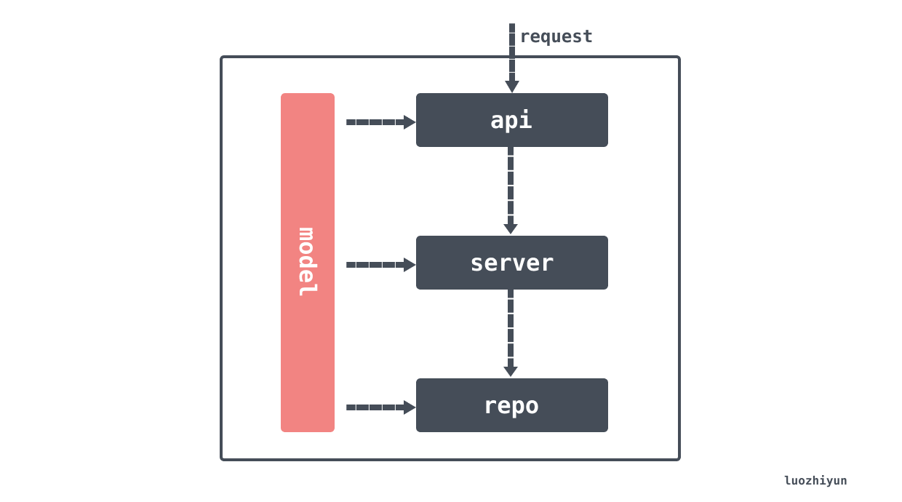

# Golang 简洁架构实战

## 个人理解

>1. router 层配置中间件
>1. controller 层处理 router 层转发来的请求，我的框架是gin 就专门解析 gin 的参数，获取数据 做 数据校验等，最后吐给 service 层可用且合法的数据
>1. service 层解决具体的业务逻辑
>1. model 层处理 db 问题
## 分包的第一种形式

```
├── cmd/
│   └── main.go //启动函数
├── etc
│   └── dev_conf.yaml              // 配置文件 
├── global
│   └── global.go //全局变量引用，如数据库、kafka等
├── internal/
│       └── service/
│           └── xxx_service.go //业务逻辑处理类
│           └── xxx_service_test.go 
│       └── model/
│           └── xxx_info.go//结构体
│       └── api/
│           └── xxx_api.go//路由对应的接口实现
│       └── router/
│           └── router.go//路由
│       └── pkg/
│           └── datetool//时间工具类
│           └── jsontool//json 工具类
```

> 其实上面的这个划分只是简单的将功能分了一下包，在项目实践的过程中还是有很多问题。比如：

- 对于功能实现我是通过 function 的参数传递还是通过结构体的变量传递？
- 使用一个数据库的全局变量引用传递是否安全？是否存在过度耦合？
- 在代码实现过程中几乎全部都是依赖于实现，而不是依赖于接口，那么将MySQL切换为 MongDB 是不是要修改所有的实现？
- 所以现在在我们工作中随着代码越来越多，代码中各种 init，function，struct，全局变量感觉也越来越乱。
- 每个模块不独立，看似按逻辑分了模块，但没有明确的上下层关系，数据流的流向和逻辑也不明确，很难看清代码调用情况。

## The Clean Architecture

> 我的项目也分为了四层：
>
> - `models` 封装了各种实体类对象，与数据库交互的、与UI交互的等等，任何的实体类都应该放在这里
> - `repo` 这里存放的是数据库操作类，数据库CRUD都在这里。需要注意的是，这里不包含任何的业务逻辑代码
> - `service` 这里是业务逻辑层，所有的业务过程处理代码都应该放在这里。这一层会决定是请求 repo 层的什么代码，是操作数据库还是调用其他服务；所有的业务数据计算也应该放在这里；这里接受的入参应该是controller传入的。
> - `api` 这里是接收外部请求的代码，如：gin对应的handler、gRPC、其他REST API 框架接入层等等。



## 面向接口编程

> 除了 models 层，层与层之间应该通过接口交互，而不是实现。如果要用 service 调用 repo 层，那么应该调用 repo 的接口。那么修改底层实现的时候我们上层的基类不需要变更，只需要更换一下底层实现即可。


