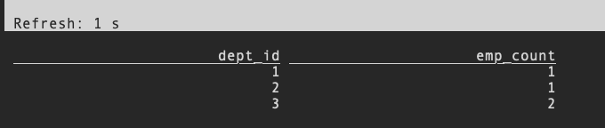
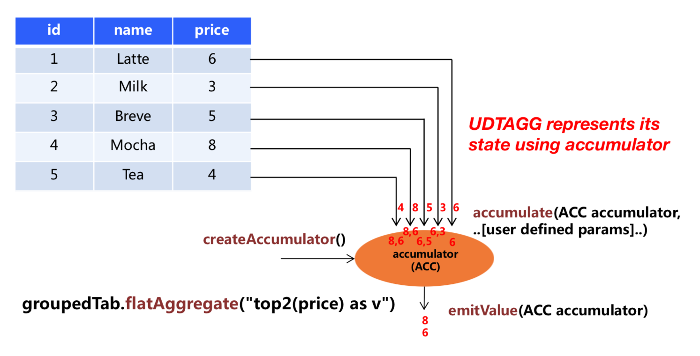

# flink sql tutorial

## reference

- [flink sql get started](https://nightlies.apache.org/flink/flink-docs-release-1.13/zh/docs/dev/table/sql/gettingstarted/)
- [Apache Kafka SQL 连接器](https://nightlies.apache.org/flink/flink-docs-master/zh/docs/connectors/table/kafka/)
- [flink sql UDF](https://nightlies.apache.org/flink/flink-docs-release-1.13/zh/docs/dev/table/functions/udfs/)
- [User-defined Functions](https://nightlies.apache.org/flink/flink-docs-release-1.14/docs/dev/table/functions/udfs/)
- [FlinkCEP - Complex event processing for Flink](https://nightlies.apache.org/flink/flink-docs-release-1.14/docs/libs/cep/)
- [通俗易懂的学会：SQL窗口函数](https://zhuanlan.zhihu.com/p/92654574)

## 准备

> 注意，flink 的默认安装包是不包含 `kafka-connector` 及其依赖的，必须在复制所有依赖到 `${flink-path}/lib` 目录下之后才可以使用。

```bash
##########################################
#                       启动kafka
##########################################

##########################################
#                       准备jar包
##########################################

cp ~/Downloads/flink-connector-kafka_2.12-1.13.2.jar ./lib
cp ~/Downloads/kafka-clients-0.11.0.0.jar ./lib

##########################################
#                       启动 flink
##########################################
cd ${flink-path}

# 启动 flink
./bin/start-cluster.sh

# 启动 sql-client
./bin/sql-client.sh
```

## 入门

### 第一个例子

> Flink 数据处理流水线开始于 source 表。source 表产生在查询执行期间可以被操作的行；
>
> 它们是查询时 `FROM` 子句中引用的表。这些表可能是 Kafka 的 topics，数据库，文件系统，或者任何其它 Flink 知道如何消费的系统。

#### 建立 source 表

```sql
CREATE TABLE employee_information (
    emp_id INT,
    name VARCHAR,
    dept_id INT)
WITH ('connector' = 'kafka',
	  'topic' = 'employee_test',
	  'properties.bootstrap.servers' = 'test.dc.data.woa.com:9092',
	  'format' = 'json');
```

```sql
select * from employee_information where emp_id = 1;
```

#### 生产数据

> 在生产数据之后，可以在 `sql-client` 命令行看到输出的数据。

```bash
kafka-console-producer.sh --broker-list test.dc.data.woa.com:9092 --topic employee_test < data.json
```

#### data.json

```json
{"emp_id": 1,"name": "xxx","dept_id": 1}
{"emp_id": 2,"name": "yyy","dept_id": 2}
{"emp_id": 3,"name": "zzz","dept_id": 3}
{"emp_id": 4,"name": "uuu","dept_id": 3}
```

### 第二个例子

>消费 kafka 写入 mysql

#### 创建kafka数据源

```sql
CREATE TABLE kafka_source (
                            `user_id` BIGINT,
                            `item_id` BIGINT,
                            `behavior` STRING
) WITH (
    'connector' = 'kafka',
    'topic' = 'test',
    'properties.bootstrap.servers' = 'test.dc.data.woa.com:9092',

    'properties.group.id' = 'testGroup',
    'scan.startup.mode' = 'latest-offset',
    'json.fail-on-missing-field' = 'false',
    'json.ignore-parse-errors' = 'true',
    'format' = 'json'
)
```

#### 创建mysql sink

```sql
CREATE TABLE kafka_sink_table
(
    `user_id` BIGINT,
    `item_id` BIGINT,
    `behavior` STRING
)
WITH (
    'connector' = 'jdbc',
    'url' = 'jdbc:mysql://127.0.0.1:3306/test',
    'username'= 'root',
    'password'= '123456',
    'table-name' = 'kafka_sink_table'
)
```

#### 完整代码

```java
public class UserSink2Mysql {

    public static void main(String[] args) {
        EnvironmentSettings settings = EnvironmentSettings.newInstance().build();
        TableEnvironment    tEnv     = TableEnvironment.create(settings);
        TableResult tableResult = tEnv.executeSql("CREATE TABLE kafka_source (\n" +
                                                  "                            `user_id` BIGINT,\n" +
                                                  "                            `item_id` BIGINT,\n" +
                                                  "                            `behavior` STRING\n" +
                                                  // "                            `ts` TIMESTAMP(3) METADATA FROM 'timestamp'\n" +
                                                  ") WITH (\n" +
                                                  "    'connector' = 'kafka',\n" +
                                                  "    'topic' = 'test',\n" +
                                                  "    'properties.bootstrap.servers' = 'test.dc.data.woa.com:9092'," +
                                                  "\n" +
                                                  "    'properties.group.id' = 'testGroup',\n" +
                                                  "    'scan.startup.mode' = 'latest-offset',\n" +
                                                  "    'json.fail-on-missing-field' = 'false'," +
                                                  "    'json.ignore-parse-errors' = 'true'," +
                                                  "    'format' = 'json'\n" +
                                                  ')');
        Table kafkaJsonSource = tEnv.from("kafka_source");
//        tEnv.executeSql("CREATE TABLE print_table WITH ('connector' = 'print')\n" +
//                        "LIKE kafka_source (EXCLUDING ALL)");


        TableResult result = tEnv.executeSql("CREATE TABLE kafka_sink_table\n" +
                                                  "(\n" +
                                                  "    `user_id` BIGINT,\n" +
                                                  "    `item_id` BIGINT,\n" +
                                                  "    `behavior` STRING\n" +
                                                  ")\n" +
                                                  "WITH (\n" +
                                                  "    'connector' = 'jdbc',\n" +
                                                  "    'url' = 'jdbc:mysql://127.0.0.1:3306/test',\n" +
                                                  "    'username'= 'root',\n" +
                                                  "    'password'= '123456',\n" +
                                                  "    'table-name' = 'kafka_sink_table'\n" +
                                                  ")");

//        kafkaJsonSource.select($("user_id"),
//                               $("item_id"),
//                               $("behavior"))
//                       .execute()
//                       .print();

        kafkaJsonSource.select($("user_id"),
                               $("item_id"),
                               $("behavior"))
                       .executeInsert("kafka_sink_table")
                       .print();
    }
}
```

#### 代码分析

> 1. 代码中包含了 `TableResult` 和 `Table` ，其中 `TableResult` 表示语句执行的结果，而 `Table` 则是 Table API 的抽象；
> 2. 注释的那一部分代码，会使得 `executeInsert` 相关的语句消费不到数据。

### 连续查询

> 一个[连续查询](https://nightlies.apache.org/flink/flink-docs-release-1.13/zh/docs/dev/table/concepts/dynamic_tables/#continuous-queries)永远不会终止，并会产生一个动态表作为结果。[动态表](https://nightlies.apache.org/flink/flink-docs-release-1.13/zh/docs/dev/table/concepts/dynamic_tables/#continuous-queries)是 Flink 中 Table API 和 SQL 对流数据支持的核心概念。
>
> 连续流上的聚合需要在查询执行期间不断地存储聚合的结果。例如，假设你需要从传入的数据流中计算每个部门的员工人数。查询需要维护每个部门最新的计算总数，以便在处理新行时及时输出结果。
>
> 这样的查询被认为是 *有状态的*。Flink 的高级容错机制将维持内部状态和一致性，因此即使遇到硬件故障，查询也始终返回正确结果。

```sql
SELECT 
   dept_id,
   COUNT(*) as emp_count 
FROM employee_information 
GROUP BY dept_id;
```



### Sink 表

```sql
INSERT INTO department_counts
SELECT 
   dept_id,
   COUNT(*) as emp_count 
FROM employee_information;
```

## 自定义 format 函数

> 我们可以通过实现自定义的 `fomrat` 函数，来实现自定义的 encode 以及 decode。
>
> - 需要在 `resources/META-INF/services` 下增加文件 `org.apache.flink.table.factories.Factory` 加载对应的工厂类，

```sql
CREATE TABLE kafka_sink2_kafka_table (
                            `user_id` BIGINT,
                            `item_id` BIGINT,
                            `behavior` STRING
) WITH (
    'connector' = 'kafka',
    'topic' = 'test_output',
    'properties.bootstrap.servers' = 'test.dc.data.woa.com:9092',
    'format' = 'tglog'
)
```

#### org.apache.flink.table.factories.Factory

```
#factory

com.xxx.flink.word.factory.ChangelogCsvFormatFactory
com.xxx.flink.word.factory.TglogSerializationFormatFactory
```

#### TglogSerializationFormatFactory

```java
public class TglogSerializationFormatFactory implements SerializationFormatFactory {

    private final static String TGLOG_IDENTIFIER = "tglog";

    /**
     * define all options statically, default use |
     */
    public static final ConfigOption<String> COLUMN_DELIMITER = ConfigOptions.key("column-delimiter")
                                                                             .stringType()
                                                                             .defaultValue("|");

    @Override
    public EncodingFormat<SerializationSchema<RowData>> createEncodingFormat(DynamicTableFactory.Context context,
                                                                             ReadableConfig formatOptions) {
        // either implement your custom validation logic here ...
        // or use the provided helper method
        FactoryUtil.validateFactoryOptions(this, formatOptions);

        // get the validated options
        final String columnDelimiter = formatOptions.get(COLUMN_DELIMITER);

        // create and return the format
        return new TglogEncodeFormat(context.getObjectIdentifier().getObjectName(), columnDelimiter);
    }

    @Override
    public String factoryIdentifier() {
        return TGLOG_IDENTIFIER;
    }

    @Override
    public Set<ConfigOption<?>> requiredOptions() {
        return Collections.emptySet();
    }

    @Override
    public Set<ConfigOption<?>> optionalOptions() {
        final Set<ConfigOption<?>> options = new HashSet<>();
        options.add(COLUMN_DELIMITER);
        return options;
    }
}
```

#### TglogEncodeFormat

```java
public class TglogEncodeFormat implements EncodingFormat<SerializationSchema<RowData>> {

    private final String identifierName;
    private final String columnDelimiter;

    public TglogEncodeFormat(String identifierName, String columnDelimiter) {
        this.identifierName  = identifierName;
        this.columnDelimiter = columnDelimiter;
    }

    @Override
    public SerializationSchema<RowData> createRuntimeEncoder(DynamicTableSink.Context context, DataType physicalDataType) {

        return new TglogSerializer(identifierName, columnDelimiter, physicalDataType);
    }

    @Override
    public ChangelogMode getChangelogMode() {
        return ChangelogMode.newBuilder()
                            .addContainedKind(RowKind.INSERT)
                            .build();
    }
}
```

#### TglogSerializer

```java
public class TglogSerializer implements SerializationSchema<RowData> {

    private final String identifierName;

    private final String columnDelimiter;

    private final DataType physicalDataType;

    private RowData.FieldGetter[] fieldGetters;

    public TglogSerializer(String identifierName, String columnDelimiter, DataType physicalDataType) {
        this.identifierName   = identifierName;
        this.columnDelimiter  = columnDelimiter;
        this.physicalDataType = physicalDataType;
    }

    @Override
    public void open(InitializationContext context) throws Exception {
        SerializationSchema.super.open(context);
        RowType logicalType = (RowType) physicalDataType.getLogicalType();
        int     fieldCount  = logicalType.getFieldCount();
        final LogicalType[] fieldTypes =
                logicalType.getFields().stream()
                           .map(RowType.RowField::getType)
                           .toArray(LogicalType[]::new);
        fieldGetters = new RowData.FieldGetter[fieldTypes.length];
        for (int i = 0; i < fieldCount; i++) {
            fieldGetters[i] = RowData.createFieldGetter(fieldTypes[i], i);
        }
    }

    @Override
    public byte[] serialize(RowData element) {
        RowType      type       = (RowType) physicalDataType.getLogicalType();
        StringBuilder sb        = new StringBuilder(identifierName);
        sb.append(columnDelimiter);
        for (int i = 0; i < type.getFieldCount(); i++) {
            Object        fieldOrNull = fieldGetters[i].getFieldOrNull(element);
            sb.append(fieldOrNull == null ? "" : fieldOrNull.toString())
              .append(columnDelimiter);
        }
        return sb.toString().getBytes();
    }
}
```

## Queries 查询

### 概览

> `SELECT` statements and `VALUES` statements are specified with the `sqlQuery()` method of the `TableEnvironment`.The method returns the result of the SELECT statement (or the VALUES statements) as a `Table`. A `Table` can be used in [subsequent SQL and Table API queries](https://nightlies.apache.org/flink/flink-docs-release-1.13/zh/docs/dev/table/common/#mixing-table-api-and-sql), be [converted into a DataStream](https://nightlies.apache.org/flink/flink-docs-release-1.13/zh/docs/dev/table/common/#integration-with-datastream), or [written to a TableSink](https://nightlies.apache.org/flink/flink-docs-release-1.13/zh/docs/dev/table/common/#emit-a-table). SQL and Table API queries can be seamlessly mixed and are holistically optimized and translated into a single program.

#### query_data.json

```json
{"user": 1,"product": "xxx","amount": 1}
```

#### program

```java
/**
 * @author 0x822a5b87
 */
public class SpecifyingQuery {

    public static void main(String[] args) {
        ObjectMapper               mapper   = new ObjectMapper();
        StreamExecutionEnvironment env      = StreamExecutionEnvironment.getExecutionEnvironment();
        StreamTableEnvironment     tableEnv = StreamTableEnvironment.create(env);

        // ingest a DataStream from an external source
        DataStream<Tuple3<Integer, String, Integer>> dataSource
                = env.socketTextStream("localhost", 9999)
                     .map(new MapFunction<String, Tuple3<Integer, String, Integer>>() {
                         @Override
                         public Tuple3<Integer, String, Integer> map(String message) throws Exception {
                             Map<String, Object> map = mapper.readValue(message, Map.class);

                             return new Tuple3<>(
                                     (Integer) map.get("user"),
                                     (String) map.get("product"),
                                     (Integer) map.get("amount"));
                         }
                     });


        // SQL queries with an inlined (unregistered) table
        Schema schema = Schema.newBuilder()
                              .columnByExpression("user", "f0")
                              .columnByExpression("product", "f1")
                              .columnByExpression("amount", "f2")
                              .build();
        Table table = tableEnv.fromDataStream(dataSource, schema);
        Table result = tableEnv.sqlQuery(
                "SELECT SUM(amount) as total_amount FROM " + table + " WHERE product LIKE '%Rubber%'");
        result.execute().print();
    }

}
```

### Hints

>SQL hints 一般可以用于以下：
>
>- 增强 planner：没有完美的 planner，所以实现 SQL hints 让用户更好地控制执行是非常有意义的；
>- 增加元数据（或者统计信息）：如"已扫描的表索引"和"一些混洗键（shuffle keys）的倾斜信息"的一些统计数据对于查询来说是动态的，用 hints 来配置它们会非常方便，因为我们从 planner 获得的计划元数据通常不那么准确；
>- 算子（Operator）资源约束：在许多情况下，我们会为执行算子提供默认的资源配置，即最小并行度或托管内存（UDF 资源消耗）或特殊资源需求（GPU 或 SSD 磁盘）等，可以使用 SQL hints 非常灵活地为每个查询（非作业）配置资源。

#### 语法

> 为了不破坏 SQL 兼容性，我们使用 Oracle 风格的 SQL hints 语法：

```sql
table_path /*+ OPTIONS(key=val [, key=val]*) */

key:
    stringLiteral
val:
    stringLiteral
```

#### 示例

```sql
CREATE TABLE kafka_table1 (id BIGINT, name STRING, age INT) WITH (...);
CREATE TABLE kafka_table2 (id BIGINT, name STRING, age INT) WITH (...);

-- 覆盖查询语句中源表的选项
select id, name from kafka_table1 /*+ OPTIONS('scan.startup.mode'='earliest-offset') */;

-- 覆盖 join 中源表的选项
select * from
    kafka_table1 /*+ OPTIONS('scan.startup.mode'='earliest-offset') */ t1
    join
    kafka_table2 /*+ OPTIONS('scan.startup.mode'='earliest-offset') */ t2
    on t1.id = t2.id;

-- 覆盖插入语句中结果表的选项
insert into kafka_table1 /*+ OPTIONS('sink.partitioner'='round-robin') */ select * from kafka_table2;
```

### WITH 语句

> `WITH` provides a way to write auxiliary statements for use in a larger query. 
>
> These statements, which are often referred to as Common Table Expression (CTE), can be thought of as defining temporary views that exist just for one query.

```sql
WITH <with_item_definition> [ , ... ]
SELECT ... FROM ...;

<with_item_defintion>:
    with_item_name (column_name[, ...n]) AS ( <select_query> )
```

```sql
WITH orders_with_total AS (
    SELECT order_id, price + tax AS total
    FROM Orders
)
SELECT order_id, SUM(total)
FROM orders_with_total
GROUP BY order_id;
```

### SELECT & WHERE clause

```sql
SELECT order_id, price FROM (VALUES (1, 2.0), (2, 3.1))  AS t (order_id, price)
```

### [Windowing table-valued functions (Windowing TVFs) ](https://nightlies.apache.org/flink/flink-docs-release-1.13/zh/docs/dev/table/sql/queries/window-tvf/)

> Windows are at the heart of processing infinite streams. **Windows split the stream into “buckets” of finite size, over which we can apply computations. **This document focuses on how windowing is performed in Flink SQL and how the programmer can benefit to the maximum from its offered functionality.
>
> - [Tumble Windows](https://nightlies.apache.org/flink/flink-docs-release-1.13/zh/docs/dev/table/sql/queries/window-tvf/#tumble)
> - [Hop Windows](https://nightlies.apache.org/flink/flink-docs-release-1.13/zh/docs/dev/table/sql/queries/window-tvf/#hop)
> - [Cumulate Windows](https://nightlies.apache.org/flink/flink-docs-release-1.13/zh/docs/dev/table/sql/queries/window-tvf/#cumulate)
> - Session Windows

#### TUMBLE

> The `TUMBLE` function assigns a window for each row of a relation based on a [time attribute](https://nightlies.apache.org/flink/flink-docs-release-1.13/zh/docs/dev/table/concepts/time_attributes/) column. 
>
> The return value of `TUMBLE` is a new relation that includes all columns of original relation as well as additional 3 columns named “window_start”, “window_end”, “window_time” to indicate the assigned window. The original time attribute “timecol” will be a regular timestamp column after window TVF.


> `TUMBLE` function takes three required parameters:

```sql
TUMBLE(TABLE data, DESCRIPTOR(timecol), size)
```

>- `data`: is a table parameter that can be any relation with a time attribute column.
>- `timecol`: is a column descriptor indicating which [time attributes](https://nightlies.apache.org/flink/flink-docs-release-1.13/zh/docs/dev/table/concepts/time_attributes/) column of data should be mapped to tumbling windows.
>- `size`: is a duration specifying the width of the tumbling windows.

Here is an example invocation on the `Bid` table:

```sql
-- tables must have time attribute, e.g. `bidtime` in this table
Flink SQL> desc Bid;
+-------------+------------------------+------+-----+--------+---------------------------------+
|        name |                   type | null | key | extras |                       watermark |
+-------------+------------------------+------+-----+--------+---------------------------------+
|     bidtime | TIMESTAMP(3) *ROWTIME* | true |     |        | `bidtime` - INTERVAL '1' SECOND |
|       price |         DECIMAL(10, 2) | true |     |        |                                 |
|        item |                 STRING | true |     |        |                                 |
+-------------+------------------------+------+-----+--------+---------------------------------+

Flink SQL> SELECT * FROM Bid;
+------------------+-------+------+
|          bidtime | price | item |
+------------------+-------+------+
| 2020-04-15 08:05 |  4.00 | C    |
| 2020-04-15 08:07 |  2.00 | A    |
| 2020-04-15 08:09 |  5.00 | D    |
| 2020-04-15 08:11 |  3.00 | B    |
| 2020-04-15 08:13 |  1.00 | E    |
| 2020-04-15 08:17 |  6.00 | F    |
+------------------+-------+------+

-- NOTE: Currently Flink doesn't support evaluating individual window table-valued function,
--  window table-valued function should be used with aggregate operation,
--  this example is just used for explaining the syntax and the data produced by table-valued function.
Flink SQL> SELECT * FROM TABLE(
   TUMBLE(TABLE Bid, DESCRIPTOR(bidtime), INTERVAL '10' MINUTES));
-- or with the named params
-- note: the DATA param must be the first
Flink SQL> SELECT * FROM TABLE(
   TUMBLE(
     DATA => TABLE Bid,
     TIMECOL => DESCRIPTOR(bidtime),
     SIZE => INTERVAL '10' MINUTES));
+------------------+-------+------+------------------+------------------+-------------------------+
|          bidtime | price | item |     window_start |       window_end |            window_time  |
+------------------+-------+------+------------------+------------------+-------------------------+
| 2020-04-15 08:05 |  4.00 | C    | 2020-04-15 08:00 | 2020-04-15 08:10 | 2020-04-15 08:09:59.999 |
| 2020-04-15 08:07 |  2.00 | A    | 2020-04-15 08:00 | 2020-04-15 08:10 | 2020-04-15 08:09:59.999 |
| 2020-04-15 08:09 |  5.00 | D    | 2020-04-15 08:00 | 2020-04-15 08:10 | 2020-04-15 08:09:59.999 |
| 2020-04-15 08:11 |  3.00 | B    | 2020-04-15 08:10 | 2020-04-15 08:20 | 2020-04-15 08:19:59.999 |
| 2020-04-15 08:13 |  1.00 | E    | 2020-04-15 08:10 | 2020-04-15 08:20 | 2020-04-15 08:19:59.999 |
| 2020-04-15 08:17 |  6.00 | F    | 2020-04-15 08:10 | 2020-04-15 08:20 | 2020-04-15 08:19:59.999 |
+------------------+-------+------+------------------+------------------+-------------------------+

-- apply aggregation on the tumbling windowed table
Flink SQL> SELECT window_start, window_end, SUM(price)
  FROM TABLE(
    TUMBLE(TABLE Bid, DESCRIPTOR(bidtime), INTERVAL '10' MINUTES))
  GROUP BY window_start, window_end;
+------------------+------------------+-------+
|     window_start |       window_end | price |
+------------------+------------------+-------+
| 2020-04-15 08:00 | 2020-04-15 08:10 | 11.00 |
| 2020-04-15 08:10 | 2020-04-15 08:20 | 10.00 |
+------------------+------------------+-------+
```

#### HOP


```sql
HOP(TABLE data, DESCRIPTOR(timecol), slide, size [, offset ])
```

>- `data`: is a table parameter that can be any relation with an time attribute column.
>- `timecol`: is a column descriptor indicating which [time attributes](https://nightlies.apache.org/flink/flink-docs-release-1.13/zh/docs/dev/table/concepts/time_attributes/) column of data should be mapped to hopping windows.
>- `slide`: is a duration specifying the duration between the start of sequential hopping windows
>- `size`: is a duration specifying the width of the hopping windows.

```sql
-- NOTE: Currently Flink doesn't support evaluating individual window table-valued function,
--  window table-valued function should be used with aggregate operation,
--  this example is just used for explaining the syntax and the data produced by table-valued function.
> SELECT * FROM TABLE(
    HOP(TABLE Bid, DESCRIPTOR(bidtime), INTERVAL '5' MINUTES, INTERVAL '10' MINUTES));
-- or with the named params
-- note: the DATA param must be the first
> SELECT * FROM TABLE(
    HOP(
      DATA => TABLE Bid,
      TIMECOL => DESCRIPTOR(bidtime),
      SLIDE => INTERVAL '5' MINUTES,
      SIZE => INTERVAL '10' MINUTES));
+------------------+-------+------+------------------+------------------+-------------------------+
|          bidtime | price | item |     window_start |       window_end |           window_time   |
+------------------+-------+------+------------------+------------------+-------------------------+
| 2020-04-15 08:05 |  4.00 | C    | 2020-04-15 08:00 | 2020-04-15 08:10 | 2020-04-15 08:09:59.999 |
| 2020-04-15 08:05 |  4.00 | C    | 2020-04-15 08:05 | 2020-04-15 08:15 | 2020-04-15 08:14:59.999 |
| 2020-04-15 08:07 |  2.00 | A    | 2020-04-15 08:00 | 2020-04-15 08:10 | 2020-04-15 08:09:59.999 |
| 2020-04-15 08:07 |  2.00 | A    | 2020-04-15 08:05 | 2020-04-15 08:15 | 2020-04-15 08:14:59.999 |
| 2020-04-15 08:09 |  5.00 | D    | 2020-04-15 08:00 | 2020-04-15 08:10 | 2020-04-15 08:09:59.999 |
| 2020-04-15 08:09 |  5.00 | D    | 2020-04-15 08:05 | 2020-04-15 08:15 | 2020-04-15 08:14:59.999 |
| 2020-04-15 08:11 |  3.00 | B    | 2020-04-15 08:05 | 2020-04-15 08:15 | 2020-04-15 08:14:59.999 |
| 2020-04-15 08:11 |  3.00 | B    | 2020-04-15 08:10 | 2020-04-15 08:20 | 2020-04-15 08:19:59.999 |
| 2020-04-15 08:13 |  1.00 | E    | 2020-04-15 08:05 | 2020-04-15 08:15 | 2020-04-15 08:14:59.999 |
| 2020-04-15 08:13 |  1.00 | E    | 2020-04-15 08:10 | 2020-04-15 08:20 | 2020-04-15 08:19:59.999 |
| 2020-04-15 08:17 |  6.00 | F    | 2020-04-15 08:10 | 2020-04-15 08:20 | 2020-04-15 08:19:59.999 |
| 2020-04-15 08:17 |  6.00 | F    | 2020-04-15 08:15 | 2020-04-15 08:25 | 2020-04-15 08:24:59.999 |
+------------------+-------+------+------------------+------------------+-------------------------+

-- apply aggregation on the hopping windowed table
> SELECT window_start, window_end, SUM(price)
  FROM TABLE(
    HOP(TABLE Bid, DESCRIPTOR(bidtime), INTERVAL '5' MINUTES, INTERVAL '10' MINUTES))
  GROUP BY window_start, window_end;
+------------------+------------------+-------+
|     window_start |       window_end | price |
+------------------+------------------+-------+
| 2020-04-15 08:00 | 2020-04-15 08:10 | 11.00 |
| 2020-04-15 08:05 | 2020-04-15 08:15 | 15.00 |
| 2020-04-15 08:10 | 2020-04-15 08:20 | 10.00 |
| 2020-04-15 08:15 | 2020-04-15 08:25 |  6.00 |
+------------------+------------------+-------+
```

#### CUMULATE

```sql
CUMULATE(TABLE data, DESCRIPTOR(timecol), step, size)
```

>`data`: is a table parameter that can be any relation with an time attribute column.
>
>`timecol`: is a column descriptor indicating which [time attributes](https://nightlies.apache.org/flink/flink-docs-release-1.13/zh/docs/dev/table/concepts/time_attributes/) column of data should be mapped to tumbling windows.
>
>`step`: is a duration specifying the increased window size between the end of sequential cumulating windows.
>
>`size`: is a duration specifying the max width of the cumulating windows. size must be an integral multiple of step .

```sql
-- NOTE: Currently Flink doesn't support evaluating individual window table-valued function,
--  window table-valued function should be used with aggregate operation,
--  this example is just used for explaining the syntax and the data produced by table-valued function.
> SELECT * FROM TABLE(
    CUMULATE(TABLE Bid, DESCRIPTOR(bidtime), INTERVAL '2' MINUTES, INTERVAL '10' MINUTES));
-- or with the named params
-- note: the DATA param must be the first
> SELECT * FROM TABLE(
    CUMULATE(
      DATA => TABLE Bid,
      TIMECOL => DESCRIPTOR(bidtime),
      STEP => INTERVAL '2' MINUTES,
      SIZE => INTERVAL '10' MINUTES));
+------------------+-------+------+------------------+------------------+-------------------------+
|          bidtime | price | item |     window_start |       window_end |            window_time  |
+------------------+-------+------+------------------+------------------+-------------------------+
| 2020-04-15 08:05 |  4.00 | C    | 2020-04-15 08:00 | 2020-04-15 08:06 | 2020-04-15 08:05:59.999 |
| 2020-04-15 08:05 |  4.00 | C    | 2020-04-15 08:00 | 2020-04-15 08:08 | 2020-04-15 08:07:59.999 |
| 2020-04-15 08:05 |  4.00 | C    | 2020-04-15 08:00 | 2020-04-15 08:10 | 2020-04-15 08:09:59.999 |
| 2020-04-15 08:07 |  2.00 | A    | 2020-04-15 08:00 | 2020-04-15 08:08 | 2020-04-15 08:07:59.999 |
| 2020-04-15 08:07 |  2.00 | A    | 2020-04-15 08:00 | 2020-04-15 08:10 | 2020-04-15 08:09:59.999 |
| 2020-04-15 08:09 |  5.00 | D    | 2020-04-15 08:00 | 2020-04-15 08:10 | 2020-04-15 08:09:59.999 |
| 2020-04-15 08:11 |  3.00 | B    | 2020-04-15 08:10 | 2020-04-15 08:12 | 2020-04-15 08:11:59.999 |
| 2020-04-15 08:11 |  3.00 | B    | 2020-04-15 08:10 | 2020-04-15 08:14 | 2020-04-15 08:13:59.999 |
| 2020-04-15 08:11 |  3.00 | B    | 2020-04-15 08:10 | 2020-04-15 08:16 | 2020-04-15 08:15:59.999 |
| 2020-04-15 08:11 |  3.00 | B    | 2020-04-15 08:10 | 2020-04-15 08:18 | 2020-04-15 08:17:59.999 |
| 2020-04-15 08:11 |  3.00 | B    | 2020-04-15 08:10 | 2020-04-15 08:20 | 2020-04-15 08:19:59.999 |
| 2020-04-15 08:13 |  1.00 | E    | 2020-04-15 08:10 | 2020-04-15 08:14 | 2020-04-15 08:13:59.999 |
| 2020-04-15 08:13 |  1.00 | E    | 2020-04-15 08:10 | 2020-04-15 08:16 | 2020-04-15 08:15:59.999 |
| 2020-04-15 08:13 |  1.00 | E    | 2020-04-15 08:10 | 2020-04-15 08:18 | 2020-04-15 08:17:59.999 |
| 2020-04-15 08:13 |  1.00 | E    | 2020-04-15 08:10 | 2020-04-15 08:20 | 2020-04-15 08:19:59.999 |
| 2020-04-15 08:17 |  6.00 | F    | 2020-04-15 08:10 | 2020-04-15 08:18 | 2020-04-15 08:17:59.999 |
| 2020-04-15 08:17 |  6.00 | F    | 2020-04-15 08:10 | 2020-04-15 08:20 | 2020-04-15 08:19:59.999 |
+------------------+-------+------+------------------+------------------+-------------------------+

-- apply aggregation on the cumulating windowed table
> SELECT window_start, window_end, SUM(price)
  FROM TABLE(
    CUMULATE(TABLE Bid, DESCRIPTOR(bidtime), INTERVAL '2' MINUTES, INTERVAL '10' MINUTES))
  GROUP BY window_start, window_end;
+------------------+------------------+-------+
|     window_start |       window_end | price |
+------------------+------------------+-------+
| 2020-04-15 08:00 | 2020-04-15 08:06 |  4.00 |
| 2020-04-15 08:00 | 2020-04-15 08:08 |  6.00 |
| 2020-04-15 08:00 | 2020-04-15 08:10 | 11.00 |
| 2020-04-15 08:10 | 2020-04-15 08:12 |  3.00 |
| 2020-04-15 08:10 | 2020-04-15 08:14 |  4.00 |
| 2020-04-15 08:10 | 2020-04-15 08:16 |  4.00 |
| 2020-04-15 08:10 | 2020-04-15 08:18 | 10.00 |
| 2020-04-15 08:10 | 2020-04-15 08:20 | 10.00 |
+------------------+------------------+-------+
```

#### Window Aggregation

> Window aggregations are defined in the `GROUP BY` clause contains “window_start” and “window_end” columns of the relation applied [Windowing TVF](https://nightlies.apache.org/flink/flink-docs-release-1.13/zh/docs/dev/table/sql/queries/window-tvf/). 
>
> 
>
> Just like queries with regular `GROUP BY` clauses, queries with a group by window aggregation will compute a single result row per group.

```sql
SELECT ...
FROM <windowed_table> -- relation applied windowing TVF
GROUP BY window_start, window_end, ...
```

```sql
-- tables must have time attribute, e.g. `bidtime` in this table
Flink SQL> desc Bid;
+-------------+------------------------+------+-----+--------+---------------------------------+
|        name |                   type | null | key | extras |                       watermark |
+-------------+------------------------+------+-----+--------+---------------------------------+
|     bidtime | TIMESTAMP(3) *ROWTIME* | true |     |        | `bidtime` - INTERVAL '1' SECOND |
|       price |         DECIMAL(10, 2) | true |     |        |                                 |
|        item |                 STRING | true |     |        |                                 |
| supplier_id |                 STRING | true |     |        |                                 |
+-------------+------------------------+------+-----+--------+---------------------------------+

Flink SQL> SELECT * FROM Bid;
+------------------+-------+------+-------------+
|          bidtime | price | item | supplier_id |
+------------------+-------+------+-------------+
| 2020-04-15 08:05 | 4.00  | C    | supplier1   |
| 2020-04-15 08:07 | 2.00  | A    | supplier1   |
| 2020-04-15 08:09 | 5.00  | D    | supplier2   |
| 2020-04-15 08:11 | 3.00  | B    | supplier2   |
| 2020-04-15 08:13 | 1.00  | E    | supplier1   |
| 2020-04-15 08:17 | 6.00  | F    | supplier2   |
+------------------+-------+------+-------------+

-- tumbling window aggregation
Flink SQL> SELECT window_start, window_end, SUM(price)
  FROM TABLE(
    TUMBLE(TABLE Bid, DESCRIPTOR(bidtime), INTERVAL '10' MINUTES))
  GROUP BY window_start, window_end;
+------------------+------------------+-------+
|     window_start |       window_end | price |
+------------------+------------------+-------+
| 2020-04-15 08:00 | 2020-04-15 08:10 | 11.00 |
| 2020-04-15 08:10 | 2020-04-15 08:20 | 10.00 |
+------------------+------------------+-------+

-- hopping window aggregation
Flink SQL> SELECT window_start, window_end, SUM(price)
  FROM TABLE(
    HOP(TABLE Bid, DESCRIPTOR(bidtime), INTERVAL '5' MINUTES, INTERVAL '10' MINUTES))
  GROUP BY window_start, window_end;
+------------------+------------------+-------+
|     window_start |       window_end | price |
+------------------+------------------+-------+
| 2020-04-15 08:00 | 2020-04-15 08:10 | 11.00 |
| 2020-04-15 08:05 | 2020-04-15 08:15 | 15.00 |
| 2020-04-15 08:10 | 2020-04-15 08:20 | 10.00 |
| 2020-04-15 08:15 | 2020-04-15 08:25 | 6.00  |
+------------------+------------------+-------+

-- cumulative window aggregation
Flink SQL> SELECT window_start, window_end, SUM(price)
  FROM TABLE(
    CUMULATE(TABLE Bid, DESCRIPTOR(bidtime), INTERVAL '2' MINUTES, INTERVAL '10' MINUTES))
  GROUP BY window_start, window_end;
+------------------+------------------+-------+
|     window_start |       window_end | price |
+------------------+------------------+-------+
| 2020-04-15 08:00 | 2020-04-15 08:06 | 4.00  |
| 2020-04-15 08:00 | 2020-04-15 08:08 | 6.00  |
| 2020-04-15 08:00 | 2020-04-15 08:10 | 11.00 |
| 2020-04-15 08:10 | 2020-04-15 08:12 | 3.00  |
| 2020-04-15 08:10 | 2020-04-15 08:14 | 4.00  |
| 2020-04-15 08:10 | 2020-04-15 08:16 | 4.00  |
| 2020-04-15 08:10 | 2020-04-15 08:18 | 10.00 |
| 2020-04-15 08:10 | 2020-04-15 08:20 | 10.00 |
+------------------+------------------+-------+
```

#### GROUPING SETS

> `GROUPING SETS` 表示的是一个 `group 合集`，例如：
>
> ```sql
> select a,b from t1 GROUPING SETS((a), (b));
> ```
>
> 等价于
>
> ```sql
> select a, b from t1 group by a;
> union all
> select a, b from t1 group by b;
> ```

```sql
Flink SQL> SELECT window_start, window_end, supplier_id, SUM(price) as price
  FROM TABLE(
    TUMBLE(TABLE Bid, DESCRIPTOR(bidtime), INTERVAL '10' MINUTES))
  GROUP BY window_start, window_end, GROUPING SETS ((supplier_id), ());
+------------------+------------------+-------------+-------+
|     window_start |       window_end | supplier_id | price |
+------------------+------------------+-------------+-------+
| 2020-04-15 08:00 | 2020-04-15 08:10 |      (NULL) | 11.00 |
| 2020-04-15 08:00 | 2020-04-15 08:10 |   supplier2 |  5.00 |
| 2020-04-15 08:00 | 2020-04-15 08:10 |   supplier1 |  6.00 |
| 2020-04-15 08:10 | 2020-04-15 08:20 |      (NULL) | 10.00 |
| 2020-04-15 08:10 | 2020-04-15 08:20 |   supplier2 |  9.00 |
| 2020-04-15 08:10 | 2020-04-15 08:20 |   supplier1 |  1.00 |
+------------------+------------------+-------------+-------+
```

#### ROLLUP

> `ROLLUP` is a shorthand notation for specifying a common type of grouping set. It represents the given list of expressions and all prefixes of the list, including the empty list.

```sql
SELECT window_start, window_end, supplier_id, SUM(price) as price
FROM TABLE(
    TUMBLE(TABLE Bid, DESCRIPTOR(bidtime), INTERVAL '10' MINUTES))
GROUP BY window_start, window_end, ROLLUP (supplier_id);
```

#### cube

> `CUBE` is a shorthand notation for specifying a common type of grouping set. It represents the given list and all of its possible subsets - the power set.
>
> For example, the following two queries are equivalent.

```sql
SELECT window_start, window_end, item, supplier_id, SUM(price) as price
  FROM TABLE(
    TUMBLE(TABLE Bid, DESCRIPTOR(bidtime), INTERVAL '10' MINUTES))
  GROUP BY window_start, window_end, CUBE (supplier_id, item);

SELECT window_start, window_end, item, supplier_id, SUM(price) as price
  FROM TABLE(
    TUMBLE(TABLE Bid, DESCRIPTOR(bidtime), INTERVAL '10' MINUTES))
  GROUP BY window_start, window_end, GROUPING SETS (
      (supplier_id, item),
      (supplier_id      ),
      (             item),
      (                 )
)
```

#### Cascading Window Aggregation

```sql
-- tumbling 5 minutes for each supplier_id
CREATE VIEW window1 AS
SELECT window_start, window_end, window_time as rowtime, SUM(price) as partial_price
  FROM TABLE(
    TUMBLE(TABLE Bid, DESCRIPTOR(bidtime), INTERVAL '5' MINUTES))
  GROUP BY supplier_id, window_start, window_end, window_time;

-- tumbling 10 minutes on the first window
SELECT window_start, window_end, SUM(partial_price) as total_price
  FROM TABLE(
      TUMBLE(TABLE window1, DESCRIPTOR(rowtime), INTERVAL '10' MINUTES))
  GROUP BY window_start, window_end;
```

### Group Aggregation

```sql
SELECT COUNT(*) FROM Orders

SELECT COUNT(*)
FROM Orders
GROUP BY order_id
```

#### GROUPING SETS

```sql
SELECT supplier_id, rating, COUNT(*) AS total
FROM (VALUES
    ('supplier1', 'product1', 4),
    ('supplier1', 'product2', 3),
    ('supplier2', 'product3', 3),
    ('supplier2', 'product4', 4))
AS Products(supplier_id, product_id, rating)
GROUP BY GROUPING SETS ((supplier_id, rating), (supplier_id), ())
```

```sql
+-------------+--------+-------+
| supplier_id | rating | total |
+-------------+--------+-------+
|   supplier1 |      4 |     1 |
|   supplier1 | (NULL) |     2 |
|      (NULL) | (NULL) |     4 |
|   supplier1 |      3 |     1 |
|   supplier2 |      3 |     1 |
|   supplier2 | (NULL) |     2 |
|   supplier2 |      4 |     1 |
+-------------+--------+-------+
```

#### ROLLUP

```sql
SELECT supplier_id, rating, COUNT(*)
FROM (VALUES
    ('supplier1', 'product1', 4),
    ('supplier1', 'product2', 3),
    ('supplier2', 'product3', 3),
    ('supplier2', 'product4', 4))
AS Products(supplier_id, product_id, rating)
GROUP BY ROLLUP (supplier_id, rating)
```

```sql
                    supplier_id                         rating                         EXPR$2
                      supplier1                              4                              1
                      supplier1                              3                              1
                      supplier1                         (NULL)                              2
                      supplier2                              3                              1
                      supplier2                              4                              1
                      supplier2                         (NULL)                              2
                         (NULL)                         (NULL)                              4
```

#### CUBE

```sql
SELECT supplier_id, rating, product_id, COUNT(*)
FROM (VALUES
    ('supplier1', 'product1', 4),
    ('supplier1', 'product2', 3),
    ('supplier2', 'product3', 3),
    ('supplier2', 'product4', 4))
AS Products(supplier_id, product_id, rating)
GROUP BY CUBE (supplier_id, rating, product_id)

SELECT supplier_id, rating, product_id, COUNT(*)
FROM (VALUES
    ('supplier1', 'product1', 4),
    ('supplier1', 'product2', 3),
    ('supplier2', 'product3', 3),
    ('supplier2', 'product4', 4))
AS Products(supplier_id, product_id, rating)
GROUP BY GROUPING SET (
    ( supplier_id, product_id, rating ),
    ( supplier_id, product_id         ),
    ( supplier_id,             rating ),
    ( supplier_id                     ),
    (              product_id, rating ),
    (              product_id         ),
    (                          rating ),
    (                                 )
)
```

### Over Aggregation

> The following query computes for every order the sum of amounts of all orders for the same product that were received within one hour before the current order.
>
> 以下查询为每个订单计算在当前订单前一小时内收到的同一产品的所有订单金额的总和。

```sql
SELECT order_id, order_time, amount,
  SUM(amount) OVER (
    PARTITION BY product
    ORDER BY order_time
    RANGE BETWEEN INTERVAL '1' HOUR PRECEDING AND CURRENT ROW
  ) AS one_hour_prod_amount_sum
FROM Orders
```

> The syntax for an `OVER` window is summarized below.

```sql
SELECT
  agg_func(agg_col) OVER (
    [PARTITION BY col1[, col2, ...]]
    ORDER BY time_col
    range_definition),
  ...
FROM ...
```

### Joins

##### Regular Joins

```sql
SELECT * FROM Orders
INNER JOIN Product
ON Orders.productId = Product.id
```

### Window Join

#### INNER/LEFT/RIGHT/FULL OUTER

```sql
SELECT ...
FROM L [LEFT|RIGHT|FULL OUTER] JOIN R -- L and R are relations applied windowing TVF
ON L.window_start = R.window_start AND L.window_end = R.window_end AND ...
```

```sql
Flink SQL> desc LeftTable;
+----------+------------------------+------+-----+--------+----------------------------------+
|     name |                   type | null | key | extras |                        watermark |
+----------+------------------------+------+-----+--------+----------------------------------+
| row_time | TIMESTAMP(3) *ROWTIME* | true |     |        | `row_time` - INTERVAL '1' SECOND |
|      num |                    INT | true |     |        |                                  |
|       id |                 STRING | true |     |        |                                  |
+----------+------------------------+------+-----+--------+----------------------------------+

Flink SQL> SELECT * FROM LeftTable;
+------------------+-----+----+
|         row_time | num | id |
+------------------+-----+----+
| 2020-04-15 12:02 |   1 | L1 |
| 2020-04-15 12:06 |   2 | L2 |
| 2020-04-15 12:03 |   3 | L3 |
+------------------+-----+----+

Flink SQL> desc RightTable;
+----------+------------------------+------+-----+--------+----------------------------------+
|     name |                   type | null | key | extras |                        watermark |
+----------+------------------------+------+-----+--------+----------------------------------+
| row_time | TIMESTAMP(3) *ROWTIME* | true |     |        | `row_time` - INTERVAL '1' SECOND |
|      num |                    INT | true |     |        |                                  |
|       id |                 STRING | true |     |        |                                  |
+----------+------------------------+------+-----+--------+----------------------------------+

Flink SQL> SELECT * FROM RightTable;
+------------------+-----+----+
|         row_time | num | id |
+------------------+-----+----+
| 2020-04-15 12:01 |   2 | R2 |
| 2020-04-15 12:04 |   3 | R3 |
| 2020-04-15 12:05 |   4 | R4 |
+------------------+-----+----+

Flink SQL> SELECT L.num as L_Num, L.id as L_Id, R.num as R_Num, R.id as R_Id, L.window_start, L.window_end
           FROM (
               SELECT * FROM TABLE(TUMBLE(TABLE LeftTable, DESCRIPTOR(row_time), INTERVAL '5' MINUTES))
           ) L
           FULL JOIN (
               SELECT * FROM TABLE(TUMBLE(TABLE RightTable, DESCRIPTOR(row_time), INTERVAL '5' MINUTES))
           ) R
           ON L.num = R.num AND L.window_start = R.window_start AND L.window_end = R.window_end;
+-------+------+-------+------+------------------+------------------+
| L_Num | L_Id | R_Num | R_Id |     window_start |       window_end |
+-------+------+-------+------+------------------+------------------+
|     1 |   L1 |  null | null | 2020-04-15 12:00 | 2020-04-15 12:05 |
|  null | null |     2 |   R2 | 2020-04-15 12:00 | 2020-04-15 12:05 |
|     3 |   L3 |     3 |   R3 | 2020-04-15 12:00 | 2020-04-15 12:05 |
|     2 |   L2 |  null | null | 2020-04-15 12:05 | 2020-04-15 12:10 |
|  null | null |     4 |   R4 | 2020-04-15 12:05 | 2020-04-15 12:10 |
+-------+------+-------+------+------------------+------------------+
```

### Set Operations

#### data

```sql
create view t1(s) as values ('c'), ('a'), ('b'), ('b'), ('c');
create view t2(s) as values ('d'), ('e'), ('a'), ('b'), ('b');
```

#### UNION

> `UNION` and `UNION ALL` return the rows that are found in either table. `UNION` takes only distinct rows while `UNION ALL` does not remove duplicates from the result rows.

```sql
Flink SQL> (SELECT s FROM t1) UNION (SELECT s FROM t2);
+---+
|  s|
+---+
|  c|
|  a|
|  b|
|  d|
|  e|
+---+

Flink SQL> (SELECT s FROM t1) UNION ALL (SELECT s FROM t2);
+---+
|  c|
+---+
|  c|
|  a|
|  b|
|  b|
|  c|
|  d|
|  e|
|  a|
|  b|
|  b|
+---+
```

#### INTERSECT

> `INTERSECT` and `INTERSECT ALL` return the rows that are found in both tables. `INTERSECT` takes only distinct rows while `INTERSECT ALL` does not remove duplicates from the result rows.

```sql
Flink SQL> (SELECT s FROM t1) EXCEPT (SELECT s FROM t2);
+---+
| s |
+---+
| c |
+---+

Flink SQL> (SELECT s FROM t1) EXCEPT ALL (SELECT s FROM t2);
+---+
| s |
+---+
| c |
| c |
+---+
```

#### IN

> Returns true if an expression exists in a given table sub-query. The sub-query table must consist of one column. This column must have the same data type as the expression.

```sql
SELECT user, amount
FROM Orders
WHERE product IN (
    SELECT product FROM NewProducts
)
```

#### EXISTS

> Returns true if the sub-query returns at least one row. Only supported if the operation can be rewritten in a join and group operation.

```sql
SELECT user, amount
FROM Orders
WHERE product EXISTS (
    SELECT product FROM NewProducts
)
```

### Top-N

> Top-N queries ask for the N smallest or largest values ordered by columns.
>
> Flink uses the combination of a OVER window clause and a filter condition to express a Top-N query. With the power of OVER window `PARTITION BY` clause, Flink also supports per group Top-N. 
>
> For example, the top five products per category that have the maximum sales in realtime. Top-N queries are supported for SQL on batch and streaming tables.

```sql
SELECT [column_list]
FROM (
   SELECT [column_list],
     ROW_NUMBER() OVER ([PARTITION BY col1[, col2...]]
       ORDER BY col1 [asc|desc][, col2 [asc|desc]...]) AS rownum
   FROM table_name)
WHERE rownum <= N [AND conditions]
```

>**Parameter Specification:**

- `ROW_NUMBER()`: Assigns an unique, sequential number to each row, starting with one, according to the ordering of rows within the partition. Currently, we only support `ROW_NUMBER` as the over window function. In the future, we will support `RANK()` and `DENSE_RANK()`.
- `PARTITION BY col1[, col2...]`: Specifies the partition columns. Each partition will have a Top-N result.
- `ORDER BY col1 [asc|desc][, col2 [asc|desc]...]`: Specifies the ordering columns. The ordering directions can be different on different columns.
- `WHERE rownum <= N`: The `rownum <= N` is required for Flink to recognize this query is a Top-N query. The N represents the N smallest or largest records will be retained.
- `[AND conditions]`: It is free to add other conditions in the where clause, but the other conditions can only be combined with `rownum <= N` using `AND` conjunction.

> The following examples show how to specify SQL queries with Top-N on streaming tables. This is an example to get “**the top five products per category that have the maximum sales in realtime**” we mentioned above.

```sql
CREATE TABLE ShopSales (
  product_id   STRING,
  category     STRING,
  product_name STRING,
  sales        BIGINT
) WITH (...);

SELECT *
FROM (
  SELECT *,
    ROW_NUMBER() OVER (PARTITION BY category ORDER BY sales DESC) AS row_num
  FROM ShopSales)
WHERE row_num <= 5
```

#### No Ranking Output Optimization

> As described above, the `rownum` field will be written into the result table as one field of the unique key, which may lead to a lot of records being written to the result table. For example, when the record (say `product-1001`) of ranking 9 is updated and its rank is upgraded to 1, all the records from ranking 1 ~ 9 will be output to the result table as update messages. If the result table receives too many data, it will become the bottleneck of the SQL job.
>
> The optimization way is omitting rownum field in the outer SELECT clause of the Top-N query. This is reasonable because the number of the top N records is usually not large, thus the consumers can sort the records themselves quickly. Without rownum field, in the example above, only the changed record (`product-1001`) needs to be sent to downstream, which can reduce much IO to the result table.

```sql
CREATE TABLE ShopSales (
  product_id   STRING,
  category     STRING,
  product_name STRING,
  sales        BIGINT
) WITH (...);

-- omit row_num field from the output
SELECT product_id, category, product_name, sales
FROM (
  SELECT *,
    ROW_NUMBER() OVER (PARTITION BY category ORDER BY sales DESC) AS row_num
  FROM ShopSales)
WHERE row_num <= 5
```

### window Top-N

> For streaming queries, unlike regular Top-N on continuous tables, window Top-N does not emit intermediate results but only a final result, the total top N records at **the end of the window**.

```sql
SELECT [column_list]
FROM (
   SELECT [column_list],
     ROW_NUMBER() OVER (PARTITION BY window_start, window_end [, col_key1...]
       ORDER BY col1 [asc|desc][, col2 [asc|desc]...]) AS rownum
   FROM table_name) -- relation applied windowing TVF
WHERE rownum <= N [AND conditions]
```

#### example

> The following example shows how to calculate Top 3 suppliers who have the highest sales for every tumbling 10 minutes window.

```sql
-- tables must have time attribute, e.g. `bidtime` in this table
Flink SQL> desc Bid;
+-------------+------------------------+------+-----+--------+---------------------------------+
|        name |                   type | null | key | extras |                       watermark |
+-------------+------------------------+------+-----+--------+---------------------------------+
|     bidtime | TIMESTAMP(3) *ROWTIME* | true |     |        | `bidtime` - INTERVAL '1' SECOND |
|       price |         DECIMAL(10, 2) | true |     |        |                                 |
|        item |                 STRING | true |     |        |                                 |
| supplier_id |                 STRING | true |     |        |                                 |
+-------------+------------------------+------+-----+--------+---------------------------------+

Flink SQL> SELECT * FROM Bid;
+------------------+-------+------+-------------+
|          bidtime | price | item | supplier_id |
+------------------+-------+------+-------------+
| 2020-04-15 08:05 |  4.00 |    A |   supplier1 |
| 2020-04-15 08:06 |  4.00 |    C |   supplier2 |
| 2020-04-15 08:07 |  2.00 |    G |   supplier1 |
| 2020-04-15 08:08 |  2.00 |    B |   supplier3 |
| 2020-04-15 08:09 |  5.00 |    D |   supplier4 |
| 2020-04-15 08:11 |  2.00 |    B |   supplier3 |
| 2020-04-15 08:13 |  1.00 |    E |   supplier1 |
| 2020-04-15 08:15 |  3.00 |    H |   supplier2 |
| 2020-04-15 08:17 |  6.00 |    F |   supplier5 |
+------------------+-------+------+-------------+

Flink SQL> SELECT *
  FROM (
    SELECT *, ROW_NUMBER() OVER (PARTITION BY window_start, window_end ORDER BY price DESC) as rownum
    FROM (
      SELECT window_start, window_end, supplier_id, SUM(price) as price, COUNT(*) as cnt
      FROM TABLE(
        TUMBLE(TABLE Bid, DESCRIPTOR(bidtime), INTERVAL '10' MINUTES))
      GROUP BY window_start, window_end, supplier_id
    )
  ) WHERE rownum <= 3;
+------------------+------------------+-------------+-------+-----+--------+
|     window_start |       window_end | supplier_id | price | cnt | rownum |
+------------------+------------------+-------------+-------+-----+--------+
| 2020-04-15 08:00 | 2020-04-15 08:10 |   supplier1 |  6.00 |   2 |      1 |
| 2020-04-15 08:00 | 2020-04-15 08:10 |   supplier4 |  5.00 |   1 |      2 |
| 2020-04-15 08:00 | 2020-04-15 08:10 |   supplier2 |  4.00 |   1 |      3 |
| 2020-04-15 08:10 | 2020-04-15 08:20 |   supplier5 |  6.00 |   1 |      1 |
| 2020-04-15 08:10 | 2020-04-15 08:20 |   supplier2 |  3.00 |   1 |      2 |
| 2020-04-15 08:10 | 2020-04-15 08:20 |   supplier3 |  2.00 |   1 |      3 |
+------------------+------------------+-------------+-------+-----+--------+
```

## User-defined Functions

> User-defined functions (UDFs) are extension points to call frequently used logic or custom logic that cannot be expressed otherwise in queries.

#### Overview

Currently, Flink distinguishes between the following kinds of functions:

- *Scalar functions* map scalar values to a new scalar value.
- *Table functions* map scalar values to new rows.
- *Aggregate functions* map scalar values of multiple rows to a new scalar value.
- *Table aggregate functions* map scalar values of multiple rows to new rows.
- *Async table functions* are special functions for table sources that perform a lookup.

```java
public class SubstringFunction extends ScalarFunction {
    /**
     * define function logic
     */
    public static class SubstringFunction2 extends ScalarFunction {
        public String eval(String s, Integer begin, Integer end) {
            return StringUtils.substring(s, begin, end);
        }
    }

    public static void main(String[] args) {
        StreamExecutionEnvironment execEnv    = StreamExecutionEnvironment.getExecutionEnvironment();
        StreamTableEnvironment     tableEnv   = StreamTableEnvironment.create(execEnv);
        DataStreamSource<String>   dataSource = execEnv.fromCollection(Arrays.asList("hello", "world", "1", "a long sentence from SubstringFunction"));

        Schema schema = Schema.newBuilder().columnByExpression("myField", "f0").build();
        Table  table  = tableEnv.fromDataStream(dataSource, schema);

        // call function "inline" without registration in Table API
        table.select(call(SubstringFunction2.class, $("myField"), 5, 12));

        // register function
        tableEnv.createTemporarySystemFunction("SubstringFunction2", SubstringFunction2.class);

        // call registered function in Table API
        table.select(call("SubstringFunction2", $("myField"), 5, 12));

        // call registered function in SQL
        tableEnv.sqlQuery("SELECT SubstringFunction2(myField, 5, 12) FROM " + table)
                .execute()
                .print();
    }
}
```

```java
public class AnotherSubstringFunction extends ScalarFunction {
    private final boolean endInclusive;

    public AnotherSubstringFunction(boolean endInclusive) {
        this.endInclusive = endInclusive;
    }

    public String eval(String s, Integer begin, Integer end) {
        return StringUtils.substring(s, begin, endInclusive ? end + 1 : end);
    }

    public static void main(String[] args) {
        EnvironmentSettings settings = EnvironmentSettings.newInstance().build();
        TableEnvironment    env      = TableEnvironment.create(settings);
        env.executeSql("CREATE TABLE MyTable (\n"
                       + "                            `name` STRING\n"
                       + ") WITH (\n"
                       + "    'connector' = 'kafka',\n"
                       + "    'topic' = 'test',\n"
                       + "    'properties.bootstrap.servers' = 'test.dc.data.woa.com:9092',\n"
                       + "\n"
                       + "    'properties.group.id' = 'testGroup',\n"
                       + "    'scan.startup.mode' = 'latest-offset',\n"
                       + "    'json.fail-on-missing-field' = 'false',\n"
                       + "    'json.ignore-parse-errors' = 'true',\n"
                       + "    'format' = 'json'\n"
                       + ")\n");

        env.createTemporarySystemFunction("SubstringFunction2", new AnotherSubstringFunction(true));

        env.executeSql("select SubstringFunction2(name, 0, 10) from MyTable")
           .print();
    }
}
```

> You can use star `*` expression as one argument of the function call to act as a wildcard in Table API, all columns in the table will be passed to the function at the corresponding position.

#### Implementation Guide

> - 默认提供了 `open()`, `close()`, or `isDeterministic()`；
> - 业务逻辑根据不同的 `function类型` 通过实现 `eval()`, `accumulate()`, or `retract()`；

```java
import org.apache.flink.table.functions.ScalarFunction;

// function with overloaded evaluation methods
public static class SumFunction extends ScalarFunction {

  public Integer eval(Integer a, Integer b) {
    return a + b;
  }

  public Integer eval(String a, String b) {
    return Integer.valueOf(a) + Integer.valueOf(b);
  }

  public Integer eval(Double... d) {
    double result = 0;
    for (double value : d)
      result += value;
    return (int) result;
  }
}
```

#### Type Inference

> The table ecosystem (similar to the SQL standard) is a strongly typed API. Therefore, both function parameters and return types must be mapped to a [data type](https://nightlies.apache.org/flink/flink-docs-release-1.14/docs/dev/table/types/).

##### **`@DataTypeHint`**

```java
public class OverloadedFunction extends ScalarFunction {
    /**
     * no hint required
     */
    public Long eval(long a, long b) {
        return a + b;
    }

    /**
     * define the precision and scale of a decimal
     */
    public @DataTypeHint("DECIMAL(12, 3)") BigDecimal eval(double a, double b) {
        return BigDecimal.valueOf(a + b);
    }

    /**
     * define a nested data type
     */
    @DataTypeHint("ROW<s STRING, t TIMESTAMP_LTZ(3)>")
    public Row eval(int i) {
        return Row.of(String.valueOf(i), Instant.ofEpochSecond(i));
    }

    /**
     * allow wildcard input and customly serialized output
     */
    @DataTypeHint(value = "RAW", bridgedTo = ByteBuffer.class)
    public ByteBuffer eval(@DataTypeHint(inputGroup = InputGroup.ANY) Object o) {
        return ByteBuffer.wrap(String.valueOf(o).getBytes());
    }
}
```

##### **`@FunctionHint`**

> `@FunctionHint`注释可以提供从参数数据类型到结果数据类型的映射。

```java
/**
 * @author 0x822a5b87
 * function with overloaded evaluation methods but globally defined output type
 */
@FunctionHint(output = @DataTypeHint("ROW<s STRING, i INT>"))
public class OverloadedFunction2 extends TableFunction<Row> {

    public void eval(int a, int b) {
        collect(Row.of("Sum", a + b));
    }

    public void eval() {
        collect(Row.of("Empty args", -1));
    }

}
```

>以下代码暂时无法正常执行：Logical output type of function call should be a ROW wrapping an atomic type.

```java
/**
 * @author 0x822a5b87
 * decouples the type inference from evaluation methods,
 * the type inference is entirely determined by the function hints
 */
@FunctionHint(
        input = {@DataTypeHint("INT"), @DataTypeHint("INT")},
        output = @DataTypeHint("INT")
)
@FunctionHint(
        input = {@DataTypeHint("BIGINT"), @DataTypeHint("BIGINT")},
        output = @DataTypeHint("BIGINT")
)
@FunctionHint(
        input = {},
        output = @DataTypeHint("BOOLEAN")
)
public class OverloadedFunction3 extends TableFunction<Row> {
    /**
     * an implementer just needs to make sure that a method exists that can be called by the JVM
     */
    public boolean eval(Object... o) {
        System.out.println("test");
        collect(Row.of(false));
        return false;
    }

    public static void main(String[] args) {
        EnvironmentSettings settings = EnvironmentSettings.newInstance().build();
        TableEnvironment    env      = TableEnvironment.create(settings);
        env.executeSql("CREATE TABLE MyTable (\n"
                       + "                            `name` STRING\n"
                       + ") WITH (\n"
                       + "    'connector' = 'kafka',\n"
                       + "    'topic' = 'test',\n"
                       + "    'properties.bootstrap.servers' = 'test.dc.data.woa.com:9092',\n"
                       + "\n"
                       + "    'properties.group.id' = 'testGroup',\n"
                       + "    'scan.startup.mode' = 'latest-offset',\n"
                       + "    'json.fail-on-missing-field' = 'false',\n"
                       + "    'json.ignore-parse-errors' = 'true',\n"
                       + "    'format' = 'json'\n"
                       + ")\n");

        env.createTemporarySystemFunction("OverloadedFunction3", new OverloadedFunction3());

        env.executeSql("select OverloadedFunction3() from MyTable")
           .print();
    }

}
```

##### TypeInference

```java
public class LiteralFunction extends ScalarFunction {
    public Object eval(String s, String type) {
        switch (type) {
            case "INT":
                return Integer.valueOf(s);
            case "DOUBLE":
                return Double.valueOf(s);
            case "STRING":
            default:
                return s;
        }
    }

    /**
     * the automatic, reflection-based type inference is disabled and replaced by the following logic
     */
    @Override
    public TypeInference getTypeInference(DataTypeFactory typeFactory) {
        return TypeInference.newBuilder()
                            // specify typed arguments
                            // parameters will be casted implicitly to those types if necessary
                            .typedArguments(DataTypes.STRING(), DataTypes.STRING())
                            // specify a strategy for the result data type of the function
                            .outputTypeStrategy(callContext -> {
                                if (!callContext.isArgumentLiteral(1) || callContext.isArgumentNull(1)) {
                                    throw callContext.newValidationError("Literal expected for second argument.");
                                }
                                // return a data type based on a literal
                                final String literal = callContext.getArgumentValue(1, String.class).orElse("STRING");
                                switch (literal) {
                                    case "INT":
                                        return Optional.of(DataTypes.INT().notNull());
                                    case "DOUBLE":
                                        return Optional.of(DataTypes.DOUBLE().notNull());
                                    case "STRING":
                                    default:
                                        return Optional.of(DataTypes.STRING());
                                }
                            })
                            .build();
    }
}
```

##### isDeterministic

> 每个用户定义的函数类都可以通过重写方法来声明它是否产生确定性结果`isDeterministic()`。如果函数不是纯函数式的（如`random()`、`date()`或`now()`），则该方法必须返回`false`。默认情况下，`isDeterministic()`返回`true`.

#### 运行时集成

> Sometimes it might be necessary for a user-defined function to get global runtime information or do some setup/clean-up work before the actual work. User-defined functions provide `open()` and `close()` methods that can be overridden and provide similar functionality as the methods in `RichFunction` of DataStream API.

```java
public class HashCodeFunction extends ScalarFunction {

    private int factor = 0;

    @Override
    public void open(FunctionContext context) throws Exception {
        // access the global "hashcode_factor" parameter
        // "12" would be the default value if the parameter does not exist
        factor = Integer.parseInt(context.getJobParameter("hashcode_factor", "12"));
    }

    public int eval(String s) {
        return s.hashCode() * factor;
    }

    public static void main(String[] args) {
        EnvironmentSettings settings = EnvironmentSettings.newInstance().build();
        TableEnvironment    env      = TableEnvironment.create(settings);
        env.executeSql("CREATE TABLE MyTable (\n"
                       + "                            `name` STRING\n"
                       + ") WITH (\n"
                       + "    'connector' = 'kafka',\n"
                       + "    'topic' = 'test',\n"
                       + "    'properties.bootstrap.servers' = 'test.dc.data.woa.com:9092',\n"
                       + "\n"
                       + "    'properties.group.id' = 'testGroup',\n"
                       + "    'scan.startup.mode' = 'latest-offset',\n"
                       + "    'json.fail-on-missing-field' = 'false',\n"
                       + "    'json.ignore-parse-errors' = 'true',\n"
                       + "    'format' = 'json'\n"
                       + ")\n");

        env.createTemporarySystemFunction("HashCodeFunction", new HashCodeFunction());

        env.executeSql("select HashCodeFunction(name) as name_hash from MyTable")
           .print();
    }
}
```

#### Scalar Functions

> A  user-defined scalar function maps zero, one, or multiple scalar values to a new scalar value. 

#### Table Functions

> a user-defined table function (*UDTF*) takes zero, one, or multiple scalar values as input arguments. However, it can return an arbitrary number of rows (or structured types) as output instead of a single value.
>
> **flink sql 的 Table Functions 必须要结合 `LATERAL TABLE` 一起使用。和 ScalarFunction 不一样，他使用的对象是 Table**。
>
> ```sql
> #ScalarFunction
> select scalar_function(field) from table_name;
> 
> #TableFunction
> select * from table_name, LATERAL TABLE(table_name);
> ```
>
> 

```java
@FunctionHint(output = @DataTypeHint("ROW<word STRING, length INT>"))
public class SplitFunction extends TableFunction<Row> {

    public static final String SEPARATOR = " ";

    public void eval(String str) {
        for (String s : str.split(SEPARATOR)) {
            // use collect(...) to emit a row
            collect(Row.of(s, s.length()));
        }
    }
}
```

```java
// call function "inline" without registration in Table API
env
  .from("MyTable")
  .joinLateral(call(SplitFunction.class, $("myField")))
  .select($("myField"), $("word"), $("length"));
env
  .from("MyTable")
  .leftOuterJoinLateral(call(SplitFunction.class, $("myField")))
  .select($("myField"), $("word"), $("length"));

// rename fields of the function in Table API
env
  .from("MyTable")
  .leftOuterJoinLateral(call(SplitFunction.class, $("myField")).as("newWord", "newLength"))
  .select($("myField"), $("newWord"), $("newLength"));

// register function
env.createTemporarySystemFunction("SplitFunction", SplitFunction.class);

// call registered function in Table API
env
  .from("MyTable")
  .joinLateral(call("SplitFunction", $("myField")))
  .select($("myField"), $("word"), $("length"));
env
  .from("MyTable")
  .leftOuterJoinLateral(call("SplitFunction", $("myField")))
  .select($("myField"), $("word"), $("length"));

// call registered function in SQL
env.sqlQuery(
  "SELECT myField, word, length " +
  "FROM MyTable, LATERAL TABLE(SplitFunction(myField))");
env.sqlQuery(
  "SELECT myField, word, length " +
  "FROM MyTable " +
  "LEFT JOIN LATERAL TABLE(SplitFunction(myField)) ON TRUE");

// rename fields of the function in SQL
env.sqlQuery(
  "SELECT myField, newWord, newLength " +
  "FROM MyTable " +
  "LEFT JOIN LATERAL TABLE(SplitFunction(myField)) AS T(newWord, newLength) ON TRUE");
```

#### Aggregate Functions

> A user-defined aggregate function (*UDAGG*) maps scalar values of multiple rows to a new scalar value.
>
> 具体可以参考 `org.apache.flink.table.functions.AggregateFunction` 的注释
>
> 在示例中，我们假设一个包含饮料数据的表。该表由三列（`id`、`name`和`price`）和 5 行组成。我们想找到表中所有饮料的最高价格，即进行`max()`聚合。我们需要考虑 5 行中的每一行。结果是单个数值。


```java
    public static class CountFunction extends AggregateFunction<String, CountFunction.MyAccumulator> {
        public static class MyAccumulator {
            public long count = 0L;
        }

        @Override
        public MyAccumulator createAccumulator() {
            return new MyAccumulator();
        }

        public void accumulate(MyAccumulator accumulator, Integer i) {
            if (i != null) {
                accumulator.count += i;
            }
        }

        @Override
        public String getValue(MyAccumulator accumulator) {
            return "Result: " + accumulator.count;
        }
    }
```

> 必要的方法：
>
> - `createAccumulator()`
> - `accumulate(...)`
> - `getValue(...)`
>
> 非必要的方法：
>
> - `retract(ACC accumulator, [user defined inputs])` Retracts the input values from the accumulator instance. The current design assumes the   inputs are the values that have been previously accumulated. The method retract can be   overloaded with different custom types and arguments. This method must be implemented for bounded OVER aggregates over unbounded tables
> - ` merge(ACC accumulator, java.lang.Iterable<ACC> iterable)` Merges a group of accumulator instances into one accumulator instance. This method must be   implemented for unbounded session window and hop window grouping aggregates and   bounded grouping aggregates. Besides, implementing this method will be helpful for optimizations.   For example, two phase aggregation optimization requires all the {@link AggregateFunction}s   support "merge" method.

#### 表聚合函数

> 用户定义的表聚合函数 ( *UDTAGG* ) 将多行的标量值映射到零、一或多行（或结构化类型）。返回的记录可能包含一个或多个字段。如果输出记录仅包含单个字段，则可以省略结构化记录，并且可以发出一个标量值，该值将由运行时隐式包装成一行。
>
> 在示例中，我们假设一个包含饮料数据的表。该表由三列（`id`、`name`和`price`）和 5 行组成。我们想找到表中所有饮料的最高价格的 2 个，即进行`TOP2()`表聚合。我们需要考虑 5 行中的每一行。结果是一个包含前 2 个值的表。



```java
public class Top2Function extends TableAggregateFunction<Tuple2<Integer, Integer>, Top2Function.Top2Accumulator> {

    @Override
    public Top2Accumulator createAccumulator() {
        return new Top2Accumulator();
    }

    public void accumulate(Top2Accumulator acc, Integer value) {
        if (value > acc.first) {
            acc.second = acc.first;
            acc.first = value;
        } else if (value > acc.second) {
            acc.second = value;
        }
    }

    public void merge(Top2Accumulator acc, Iterable<Top2Accumulator> it) {
        for (Top2Accumulator otherAcc : it) {
            accumulate(acc, otherAcc.first);
            accumulate(acc, otherAcc.second);
        }
    }

    public void emitValue(Top2Accumulator acc, Collector<Tuple2<Integer, Integer>> out) {
        // emit the value and rank
        if (acc.first != Integer.MIN_VALUE) {
            out.collect(Tuple2.of(acc.first, 1));
        }
        if (acc.second != Integer.MIN_VALUE) {
            out.collect(Tuple2.of(acc.second, 2));
        }
    }

    public static class Top2Accumulator {
        public Integer first;
        public Integer second;
    }
}
```

##### 撤回示例

>以下示例显示了如何使用该`emitUpdateWithRetract(...)`方法仅发出增量更新。为此，累加器保留旧的和新的前 2 值。
>
>如果 Top N 的 N 很大，则同时保留旧值和新值可能效率低下。解决这种情况的一种方法是仅将输入记录存储在`accumulate`方法中的累加器中，然后在中执行计算`emitUpdateWithRetract`。

```java
import org.apache.flink.api.java.tuple.Tuple2;
import org.apache.flink.table.functions.TableAggregateFunction;

public static class Top2WithRetractAccumulator {
  public Integer first;
  public Integer second;
  public Integer oldFirst;
  public Integer oldSecond;
}

public static class Top2WithRetract
    extends TableAggregateFunction<Tuple2<Integer, Integer>, Top2WithRetractAccumulator> {

  @Override
  public Top2WithRetractAccumulator createAccumulator() {
    Top2WithRetractAccumulator acc = new Top2WithRetractAccumulator();
    acc.first = Integer.MIN_VALUE;
    acc.second = Integer.MIN_VALUE;
    acc.oldFirst = Integer.MIN_VALUE;
    acc.oldSecond = Integer.MIN_VALUE;
    return acc;
  }

  public void accumulate(Top2WithRetractAccumulator acc, Integer v) {
    if (v > acc.first) {
      acc.second = acc.first;
      acc.first = v;
    } else if (v > acc.second) {
      acc.second = v;
    }
  }

  public void emitUpdateWithRetract(
      Top2WithRetractAccumulator acc,
      RetractableCollector<Tuple2<Integer, Integer>> out) {
    if (!acc.first.equals(acc.oldFirst)) {
      // if there is an update, retract the old value then emit a new value
      if (acc.oldFirst != Integer.MIN_VALUE) {
          out.retract(Tuple2.of(acc.oldFirst, 1));
      }
      out.collect(Tuple2.of(acc.first, 1));
      acc.oldFirst = acc.first;
    }
    if (!acc.second.equals(acc.oldSecond)) {
      // if there is an update, retract the old value then emit a new value
      if (acc.oldSecond != Integer.MIN_VALUE) {
          out.retract(Tuple2.of(acc.oldSecond, 2));
      }
      out.collect(Tuple2.of(acc.second, 2));
      acc.oldSecond = acc.second;
    }
  }
}
```


