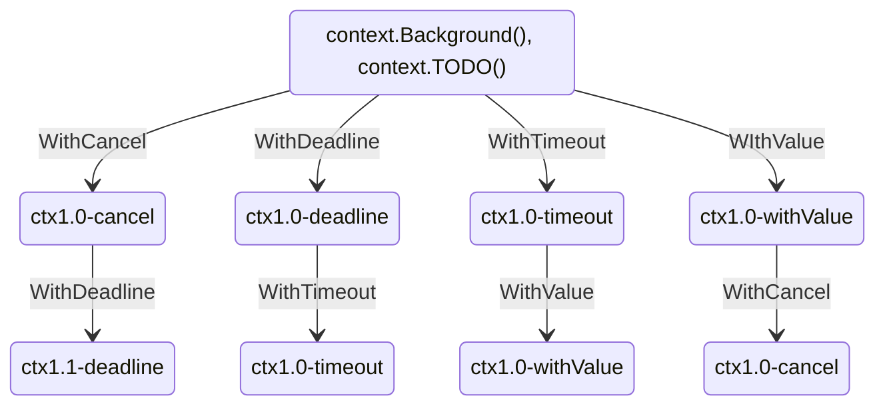

# [小白也能看懂的context包详解：从入门到精通](https://mp.weixin.qq.com/s/_5gBIwvtXKJME7AV2W2bqQ)

> 可以看到，在下面的代码中，`ctx` 退出了，但是子协程还是正常运行。

```go
package context

import (
	"context"
	"fmt"
	"time"
)

func TimeoutContext() {
	ctx, cancel := context.WithTimeout(context.Background(), 10*time.Second)
	defer cancel()
	go Monitor(ctx)

	select {
	case <-ctx.Done():
		fmt.Println("context done!")
	}

	time.Sleep(20 * time.Second)
}

func Monitor(ctx context.Context) {
	i := 0
	for {
		fmt.Printf("%d\n", i)
		i++
		time.Sleep(1 * time.Second)
	}
}

//0
//1
//2
//3
//4
//5
//6
//7
//8
//9
//context done!
//10
//11
//...
```

## `context`包的起源与作用

> 1. `context`可以用来在`goroutine`之间传递上下文信息，相同的`context`可以传递给运行在不同`goroutine`中的函数
> 2. 上下文对于多个`goroutine`同时使用是安全的
> 3. context包定义了上下文类型，可以使用background、TODO创建一个上下文，在函数调用链之间传播context
> 4. 也可以使用`WithDeadline`、`WithTimeout`、`WithCancel` 或 `WithValue` 创建的修改副本替换它

## context的使用

>`context`包主要提供了两种方式创建`context`:
>
>- `context.Backgroud()`
>- `context.TODO()`
>
>这两个函数其实只是互为别名，没有差别，官方给的定义是：
>
>- `context.Background` 是上下文的默认值，所有其他的上下文都应该从它衍生（Derived）出来。
>- `context.TODO` 应该只在不确定应该使用哪种上下文时使用；
>
>上面的两种方式是创建根context，不具备任何功能，具体实践还是要依靠context包提供的With系列函数来进行派生：

```go
func WithCancel(parent Context) (ctx Context, cancel CancelFunc)
func WithDeadline(parent Context, deadline time.Time) (Context, CancelFunc)
func WithTimeout(parent Context, timeout time.Duration) (Context, CancelFunc)
func WithValue(parent Context, key, val interface{}) Context
```

> 这四个函数都要基于父`Context`衍生，通过这些函数，就创建了一颗Context树，树的每个节点都可以有任意多个子节点，节点层级可以有任意多个，画个图表示一下：



## WithValue携带数据

>在使用`withVaule`时要注意四个事项：
>
>- 不建议使用`context`值传递关键参数，关键参数应该显示的声明出来，不应该隐式处理，`context`中最好是携带签名、`trace_id`这类值。
>- 因为携带`value`也是`key`、`value`的形式，为了避免`context`因多个包同时使用`context`而带来冲突，`key`建议采用内置类型。
>- 上面的例子我们获取`trace_id`是直接从当前`ctx`获取的，实际我们也可以获取父`context`中的`value`，在获取键值对是，我们先从当前`context`中查找，没有找到会在从父`context`中查找该键对应的值直到在某个父`context`中返回 `nil` 或者查找到对应的值。
>- `context`传递的数据中`key`、`value`都是`interface`类型，这种类型编译期无法确定类型，所以不是很安全，所以在类型断言时别忘了保证程序的健壮性。

```go
package context

import (
	"context"
	"fmt"
	"github.com/pborman/uuid"
	"strconv"
	"strings"
	"time"
)

const (
	KEY = "trace_id"
)

func NewRequestID() string {
	return strings.Replace(uuid.New(), "-", "", -1)
}

func NewContextWithTraceID() context.Context {
	ctx := context.WithValue(context.Background(), KEY, NewRequestID())
	for i := 0; i < 10; i++ {
		fmt.Printf("key = %s, value = %s\n", strconv.Itoa(i), strconv.Itoa(i))
		ctx = context.WithValue(ctx, strconv.Itoa(i), strconv.Itoa(i))
	}
	return ctx
}

func PrintLog(ctx context.Context, message string) {
	fmt.Printf("%s|info|trace_id=%s|%s\n", time.Now().Format("2006-01-02 15:04:05"), GetContextValue(ctx, KEY), message)
	for i := 0; i < 10; i++ {
		fmt.Printf("key = %s, value = %s\n", strconv.Itoa(i), GetContextValue(ctx, strconv.Itoa(i)))
	}
}

func GetContextValue(ctx context.Context, k string) string {
	v, ok := ctx.Value(k).(string)
	if !ok {
		return ""
	}
	return v
}

func ProcessEnter(ctx context.Context) {
	PrintLog(ctx, "Golang梦工厂")
}
```

## 超时控制

> - 一些`web`框架或`rpc`框架都会采用`withTimeout`或者`withDeadline`来做超时控制
> - `withTimeout`和`withDeadline`作用是一样的，就是传递的时间参数不同
> - 他们都会返回一个`cancelFunc`方法，通过调用这个方法可以达到提前进行取消

```go
func main()  {
 HttpHandler()
}

func NewContextWithTimeout() (context.Context,context.CancelFunc) {
 return context.WithTimeout(context.Background(), 3 * time.Second)
}

func HttpHandler()  {
 ctx, cancel := NewContextWithTimeout()
 defer cancel()
 deal(ctx)
}

func deal(ctx context.Context)  {
 for i:=0; i< 10; i++ {
  time.Sleep(1*time.Second)
  select {
  case <- ctx.Done():
   fmt.Println(ctx.Err())
   return
  default:
   fmt.Printf("deal time is %d\n", i)
  }
 }
}
```

> 输出结果

```
deal time is 0
deal time is 1
context deadline exceeded
```

> 使用`cancel()`提前取消

```go
func main()  {
 HttpHandler1()
}

func NewContextWithTimeout1() (context.Context,context.CancelFunc) {
 return context.WithTimeout(context.Background(), 3 * time.Second)
}

func HttpHandler1()  {
 ctx, cancel := NewContextWithTimeout1()
 defer cancel()
 deal1(ctx, cancel)
}

func deal1(ctx context.Context, cancel context.CancelFunc)  {
 for i:=0; i< 10; i++ {
  time.Sleep(1*time.Second)
  select {
  case <- ctx.Done():
   fmt.Println(ctx.Err())
   return
  default:
   fmt.Printf("deal time is %d\n", i)
   cancel()
  }
 }
}
```

> 输出结果

```
deal time is 0
context canceled
```

## withCancel取消控制

> `WithCancel` 会返回 `context` 和 `cancel`，调用 cancel 可以提前结束 `context`

```go
package context

import (
	"context"
	"fmt"
	"time"
)

func CancelSpeak() {
	ctx, cancel := context.WithCancel(context.Background())
	go Speak(ctx)
	time.Sleep(5 * time.Second)
	cancel()
	time.Sleep(1 * time.Second)
}

func Speak(ctx context.Context) {
	for range time.Tick(time.Second) {
		select {
		case <-ctx.Done():
			fmt.Println("我要闭嘴了")
			return
		default:
			fmt.Println("bala bala bala bala")
		}
	}
}
```

## 源码

```go
type Context interface {
 Deadline() (deadline time.Time, ok bool)
 Done() <-chan struct{}
 Err() error
 Value(key interface{}) interface{}
}
```

>- `Deadlne`方法：当`Context`自动取消或者到了取消时间被取消后返回
>- `Done`方法：当`Context`被取消或者到了`deadline`返回一个被关闭的`channel`
>- `Err`方法：当`Context`被取消或者关闭后，返回`context`取消的原因
>- `Value`方法：获取设置的`key`对应的值


