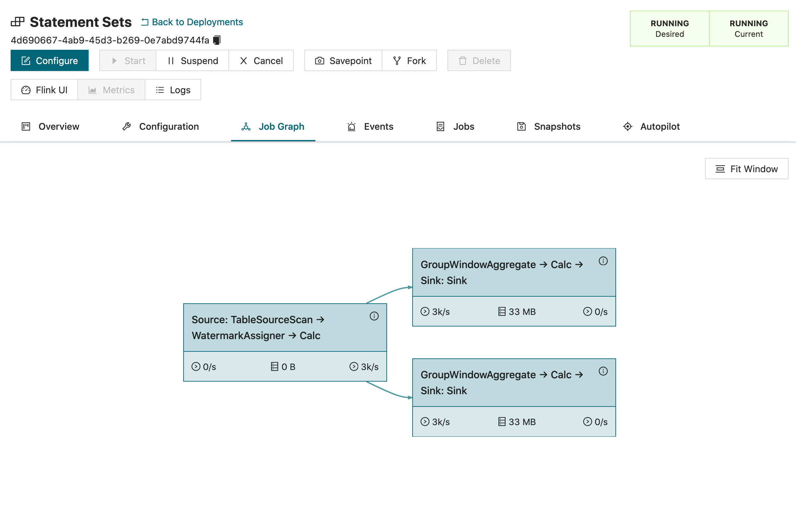
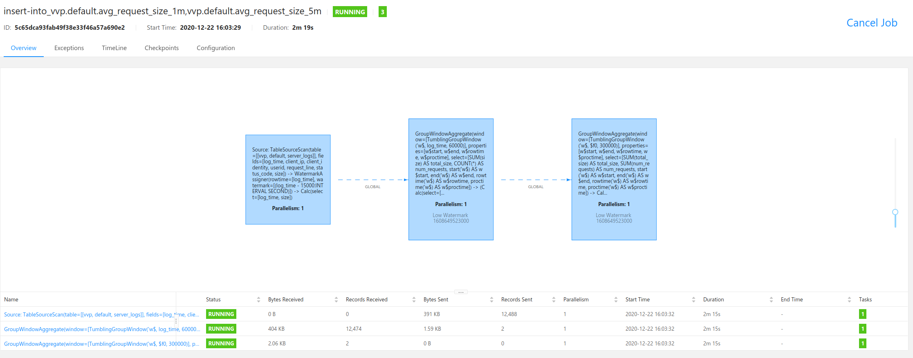

# flink-sql-cookbook

## Foundations

### 05 Aggregating Data

> use `count()`, `sum()`, `avg()`, `min()`, `max(0)` function.

```sql
CREATE TABLE server_logs ( 
    client_ip STRING,
    client_identity STRING, 
    userid STRING, 
    user_agent STRING,
    log_time TIMESTAMP(3),
    request_line STRING, 
    status_code STRING, 
    size INT
) WITH (
  'connector' = 'faker', 
  'fields.client_ip.expression' = '#{Internet.publicIpV4Address}',
  'fields.client_identity.expression' =  '-',
  'fields.userid.expression' =  '-',
  'fields.user_agent.expression' = '#{Internet.userAgentAny}',
  'fields.log_time.expression' =  '#{date.past ''15'',''5'',''SECONDS''}',
  'fields.request_line.expression' = '#{regexify ''(GET|POST|PUT|PATCH){1}''} #{regexify ''(/search\.html|/login\.html|/prod\.html|cart\.html|/order\.html){1}''} #{regexify ''(HTTP/1\.1|HTTP/2|/HTTP/1\.0){1}''}',
  'fields.status_code.expression' = '#{regexify ''(200|201|204|400|401|403|301){1}''}',
  'fields.size.expression' = '#{number.numberBetween ''100'',''10000000''}'
);

-- Sample user_agent: Mozilla/5.0 (Macintosh; Intel Mac OS X 10_9_3) AppleWebKit/537.75.14 (KHTML, like Gecko) Version/7.0.3 Safari/7046A194A
-- Regex pattern: '[^\/]+' (Match everything before '/')
SELECT 
  REGEXP_EXTRACT(user_agent,'[^\/]+') AS browser,
  status_code, 
  COUNT(*) AS cnt_status
FROM server_logs
GROUP BY 
  REGEXP_EXTRACT(user_agent,'[^\/]+'),
  status_code;
```

### 07 Encapsulating Logic with (Temporary) Views

```sql
CREATE VIEW successful_requests AS 
SELECT * 
FROM server_logs
WHERE status_code SIMILAR TO '[2,3][0-9][0-9]';

SELECT * FROM successful_requests;
```

### 08 Writing Results into Multiple Tables

```sql
-- This is a shared view that will be used by both 
-- insert into statements
CREATE TEMPORARY VIEW browsers AS  
SELECT 
  REGEXP_EXTRACT(user_agent,'[^\/]+') AS browser,
  status_code,
  log_time
FROM server_logs;

BEGIN STATEMENT SET;
INSERT INTO realtime_aggregations
SELECT
    browser,
    status_code,
    TUMBLE_ROWTIME(log_time, INTERVAL '5' MINUTE) AS end_time,
    COUNT(*) requests
FROM browsers
GROUP BY 
    browser,
    status_code,
    TUMBLE(log_time, INTERVAL '5' MINUTE);
INSERT INTO offline_datawarehouse
SELECT
    browser,
    status_code,
    DATE_FORMAT(TUMBLE_ROWTIME(log_time, INTERVAL '1' HOUR), 'yyyy-MM-dd') AS `dt`,
    DATE_FORMAT(TUMBLE_ROWTIME(log_time, INTERVAL '1' HOUR), 'HH') AS `hour`,
    COUNT(*) requests
FROM browsers
GROUP BY 
    browser,
    status_code,
    TUMBLE(log_time, INTERVAL '1' HOUR);
END;
```




### 09 Convert timestamps with timezones

>We create the table first, then use the CONVERT_TZ function to convert the timestamp to UTC. The CONVERT_TZ function requires the input timestamp to be passed as string, thus we apply the cast function to iot_timestamp.

```sql
SELECT 
  device_ip, 
  device_timezone,
  iot_timestamp,
  convert_tz(cast(iot_timestamp as string), device_timezone, 'UTC') iot_timestamp_utc,
  status_code
FROM iot_status;
```

## Aggregations and Analytics

### 01 Aggregating Time Series Data

> To count the number of DISTINCT IP addresses seen each minute, rows need to be grouped based on a time attribute. Grouping based on time is special, because time always moves forward, which means Flink can generate final results after the minute is completed.

**Window aggregations are defined in the GROUP BY clause contains “window_start” and “window_end” columns of the relation applied Windowing TVF**

```sql
SELECT window_start, window_end, COUNT(DISTINCT client_ip) AS ip_addresses
  FROM TABLE(
    TUMBLE(TABLE server_logs, DESCRIPTOR(log_time), INTERVAL '1' MINUTE))
  GROUP BY window_start, window_end;
```

### 02 Watermarks

> 在我们日常处理事件中，事件并不是一定有序的，`watermark` 告诉选择一个 `timestamp` 并表示flink接受的最大延迟。
> 在这个例子中，我们告诉 flink 接受的最大延迟是 15s
> 
> 另外，我们还需要理解什么是 watermark：
> watermark 是 flink 处理乱序数据时，处理部分因为网络原因或其他原因导致的延迟数据。
> 假如我们设置10s的时间窗口（window），那么0~10s，10~20s都是一个窗口。
> 以0~10s为例，0为start-time，10为end-time。
> 假如有4个数据的event-time分别是8(A),12.5(B),9(C),13.5(D)，我们设置Watermarks为当前所有到达数据event-time的最大值减去延迟值3.5秒
> 当A到达的时候，Watermarks为max{8}-3.5=8-3.5 = 4.5 < 10,不会触发计算
> 当B到达的时候，Watermarks为max(12.5,8)-3.5=12.5-3.5 = 9 < 10,不会触发计算
> 当C到达的时候，Watermarks为max(12.5,8,9)-3.5=12.5-3.5 = 9 < 10,不会触发计算
> 当D到达的时候，Watermarks为max(13.5,12.5,8,9)-3.5=13.5-3.5 = 10 = 10,触发计算
> 随后 A 和 C 会进入计算，其中 C 是延迟到达的数据。
> 假设D到达之后，又来了一个 6(E)，那么它会根据我们的策略进行处理，默认是直接丢弃，因为此时时间窗已经关闭。
> 我们可以通过配置让flink来进行处理：
> 1. 重新激活已经关闭的窗口并重新计算以修正结果。
> 2. 将迟到事件收集起来另外处理。
> 3. 将迟到事件视为错误消息并丢弃。

#### 2. WaterMark设定方法

`标点水位线(Punctuated Watermark)` 标点水位线（Punctuated Watermark）通过数据流中某些特殊标记事件来触发新水位线的生成。这种方式下窗口的触发与时间无关，而是决定于何时收到标记事件。

在实际的生产中Punctuated方式在TPS很高的场景下会产生大量的Watermark在一定程度上对下游算子造成压力，所以只有在实时性要求非常高的场景才会选择Punctuated的方式进行Watermark的生成。

`定期水位线(Periodic Watermark)` 周期性的（允许一定时间间隔或者达到一定的记录条数）产生一个Watermark。水位线提升的时间间隔是由用户设置的，在两次水位线提升时隔内会有一部分消息流入，用户可以根据这部分数据来计算出新的水位线。

在实际的生产中Periodic的方式必须结合时间和积累条数两个维度继续周期性产生Watermark，否则在极端情况下会有很大的延时。

举个例子，最简单的水位线算法就是取目前为止最大的事件时间，然而这种方式比较暴力，对乱序事件的容忍程度比较低，容易出现大量迟到事件。

#### 标识函数

| 窗口标识函数                                    | 返回类型                     | 描述                                                                                                                                           |
|-------------------------------------------|--------------------------|----------------------------------------------------------------------------------------------------------------------------------------------|
| TUMBLE_START(time-attr, size-interval)    | TIMESTAMP                | 返回窗口的起始时间（包含边界）。例如[00:10,00:15]窗口，返回00:10。                                                                                                   |
| TUMBLE_END(time-attr, size-interval)      | TIMESTAMP                | 返回窗口的结束时间（包含边界）。例如[00:00, 00:15]窗口，返回00:15。                                                                                                  |
| TUMBLE_ROWTIME(time-attr, size-interval)  | TIMESTAMP(rowtime-attr)	 | 返回窗口的结束时间（不包含边界）。例如(00:00, 00:15)窗口，返回00:14:59.999。返回值是一个rowtime attribute，即可以基于该字段做时间属性的操作，例如，级联窗口只能用在基于Event Time的Window上，详情请参见级联窗口。       |
| TUMBLE_PROCTIME(time-attr, size-interval) | TIMESTAMP(rowtime-attr)	 | 返回窗口的结束时间（不包含边界）。例如(00:00, 00:15)窗口，返回00:14:59.999。返回值是一个Proctime Attribute，即可以基于该字段做时间属性的操作。例如，级联窗口只能用在基于Processing Time的Window上，详情请参见级联窗口。 |

```sql
CREATE TABLE doctor_sightings (
  doctor        STRING,
  sighting_time TIMESTAMP(3),
  WATERMARK FOR sighting_time AS sighting_time - INTERVAL '15' SECONDS
)
WITH (
  'connector' = 'faker', 
  'fields.doctor.expression' = '#{dr_who.the_doctors}',
  'fields.sighting_time.expression' = '#{date.past ''15'',''SECONDS''}'
);

SELECT 
    doctor,
    TUMBLE_ROWTIME(sighting_time, INTERVAL '1' MINUTE) AS sighting_time,
    COUNT(*) AS sightings
FROM doctor_sightings
GROUP BY 
    TUMBLE(sighting_time, INTERVAL '1' MINUTE),
    doctor;
```

### 03 Analyzing Sessions in Time Series Data

> 计算用户在一次session中收到的http 403错误的次数，session windows 设置为10s，也就是说，如果用户连续10s没有任何请求，那么该session断开。

```sql
SELECT  
  userid,
  SESSION_START(log_time, INTERVAL '10' SECOND) AS session_beg,
  SESSION_ROWTIME(log_time, INTERVAL '10' SECOND) AS session_end,
  COUNT(request_line) AS request_cnt
FROM server_logs
WHERE status_code = '403'
GROUP BY 
  userid, 
  SESSION(log_time, INTERVAL '10' SECOND);
```

### 04 Rolling Aggregations on Time Series Data

> `OVER window` 和 `group by` 的区别是， `OVER window` 会为输入的每一行都生成一个输出。
> 具体可以参考这个回答： [How GROUP BY and OVER WINDOW differ in FlinkSQL?](https://stackoverflow.com/questions/62049291/how-group-by-and-over-window-differ-in-flinksql)

#### Fink SQL 实践之OVER窗口

先看一个例子，例子来自于 [Fink SQL 实践之OVER窗口](https://www.cnblogs.com/pyx0/p/flink-sql-over.html)

```sql
CREATE TABLE `user_action` (
                               `user_id` VARCHAR,
                               `page_id` VARCHAR,
                               `action_type` VARCHAR,
                               `event_time` TIMESTAMP,
                               WATERMARK FOR event_time AS event_time - INTERVAL '5' SECOND
) WITH (
      'connector.type' = 'kafka',
      'connector.topic' = 'user_action',
      'connector.version' = '0.11',
      'connector.properties.0.key' = 'bootstrap.servers',
      'connector.properties.0.value' = 'xxx:9092',
      'connector.startup-mode' = 'latest-offset',
      'update-mode' = 'append',
      '...' = '...'
      );

CREATE TABLE `agg_result` (
                              `user_id` VARCHAR,
                              `page_id` VARCHAR,
                              `result_type` VARCHAR,
                              `result_value` BIGINT
) WITH (
      'connector.type' = 'kafka',
      'connector.topic' = 'agg_result',
      '...' = '...'
      );
```

> 场景一，实时触发的最近2小时用户+页面维度的点击量，注意窗口是向前2小时，类似于实时触发的滑动窗口。
> 他和 group by 的区别是，group by 会将所有相同 group 的数据聚合成一行，而 OVER 窗口则为每一条用户点击生成一条输出
> 该输出表示了某个用户，从当前这条点击日志，往前追溯两个小时的所有点击。

```sql
insert into
    agg_result
select
    user_id,
    page_id,
    'click-type1' as result_type
    count(1) OVER (
        PARTITION BY user_id, page_id
        ORDER BY event_time 
        RANGE BETWEEN INTERVAL '2' HOUR PRECEDING AND CURRENT ROW
    ) as result_value
from
    user_action
where
    action_type = 'click'
```

> 场景二，实时触发的当天用户+页面维度的浏览量，这就是开篇问题解法，其中多了一个日期维度分组条件，这样就做到输出结果从滑动时间转为固定时间（根据时间区间分组），因为 WATERMARK 机制，今天并不会有昨天数据到来（如果有都被自动抛弃），因此只会输出今天的分组结果。

```sql
insert into
    agg_result
select
    user_id,
    page_id,
    'view-type1' as result_type
    count(1) OVER (
        PARTITION BY user_id, page_id, DATE_FORMAT(event_time, 'yyyyMMdd')
        ORDER BY event_time 
        RANGE BETWEEN INTERVAL '1' DAY PRECEDING AND CURRENT ROW
    ) as result_value
from
    user_action
where
    action_type = 'view'
```

#### script

> 下面的例子，OVER window 计算了每一条日志到达时，城市维度下的，从本条日志往前追溯一分钟的平均温度，最高温度，最低温度，温度的标准偏差。
> 与之对应的 group by 计算了在滑动时间窗口内的城市维度下的平均温度，最高温度，最低温度，温度的标准偏差，
> 有以下几个区别：
> 1. group by 语句中不能 select measurement_time 和 temperature；
> 2. group by 只会为每个 group 生成一条输出，而 over window 会产生多条输出。

```sql
CREATE TEMPORARY TABLE temperature_measurements (
  measurement_time TIMESTAMP(3),
  city STRING,
  temperature FLOAT, 
  WATERMARK FOR measurement_time AS measurement_time - INTERVAL '15' SECONDS
)
WITH (
  'connector' = 'faker',
  'fields.measurement_time.expression' = '#{date.past ''15'',''SECONDS''}',
  'fields.temperature.expression' = '#{number.numberBetween ''0'',''50''}',
  'fields.city.expression' = '#{regexify ''(Chicago|Munich|Berlin|Portland|Hangzhou|Seatle|Beijing|New York){1}''}'
);

SELECT 
  measurement_time,
  city, 
  temperature,
  AVG(CAST(temperature AS FLOAT)) OVER last_minute AS avg_temperature_minute,
  MAX(temperature) OVER last_minute AS min_temperature_minute,
  MIN(temperature) OVER last_minute AS max_temperature_minute,
  STDDEV(CAST(temperature AS FLOAT)) OVER last_minute AS stdev_temperature_minute
FROM temperature_measurements 
WINDOW last_minute AS (
  PARTITION BY city
  ORDER BY measurement_time
  RANGE BETWEEN INTERVAL '1' MINUTE PRECEDING AND CURRENT ROW 
);


SELECT
    city,
    AVG(CAST(temperature AS FLOAT)) AS avg_temperature_minute,
        MAX(temperature) AS min_temperature_minute,
        MIN(temperature) AS max_temperature_minute,
        STDDEV(CAST(temperature AS FLOAT)) AS stdev_temperature_minute
FROM temperature_measurements 
group by 
city,
TUMBLE(measurement_time, INTERVAL '1' MINUTES);
```

### 05 Continuous Top-N

> wizard -> 女巫
> spell -> 施法id
> 现在需要统计每个女巫的施法id的排行前二。
> 我们的思路如下：
> 1. 通过 group by wizard, spell 来对女巫施法进行 count()，得到女巫施法ID的分组结果
> 2. 再对<1>的结果进行 over window partition by wizard 查询，由于 over window 的特性会得到针对每一条输入生成一个输出，并且每一行都有 row_num()
> 3. 通过 row_num() 过滤剩余的用户数据。

```sql
CREATE TABLE spells_cast (
    wizard STRING,
    spell  STRING
) WITH (
  'connector' = 'faker',
  'fields.wizard.expression' = '#{harry_potter.characters}',
  'fields.spell.expression' = '#{harry_potter.spells}'
);

SELECT wizard, spell, times_cast
from (
         select *,
                row_number() over (partition by wizard order by times_cast desc) as rank_num
         from
                 (select wizard, spell, count(*) as times_cast from spells_cast group by wizard, spell)
         )
where rank_num <= 2;
```

### 06 Deduplication

> As a first step, you can use a combination of the COUNT function and the HAVING clause to check if and which orders have more than one event; and then filter out these events using ROW_NUMBER(). In practice, deduplication is a special case of Top-N aggregation, where N is 1 (rownum = 1) and the ordering column is either the processing or event time of events.

```sql
CREATE TABLE orders (
  id INT,
  order_time AS CURRENT_TIMESTAMP,
  WATERMARK FOR order_time AS order_time - INTERVAL '5' SECONDS
)
WITH (
  'connector' = 'datagen',
  'rows-per-second'='10',
  'fields.id.kind'='random',
  'fields.id.min'='1',
  'fields.id.max'='100'
);
```

```sql
--Check for duplicates in the `orders` table
SELECT id AS order_id,
       COUNT(*) AS order_cnt
FROM orders o
GROUP BY id
HAVING COUNT(*) > 1;

--Use deduplication to keep only the latest record for each `order_id`
SELECT
    order_id,
    order_time
FROM (
         SELECT id AS order_id,
                order_time,
                ROW_NUMBER() OVER (PARTITION BY id ORDER BY order_time) AS rownum
         FROM orders
     )
WHERE rownum = 1;
```

### 07 Chained (Event) Time Windows

> 使用 Statement set 来串联多个不同的时间窗口。
> 例如我们需要计算 1min 的窗口和 5min 的窗口，那么可以先计算1min的窗口的输入，然后把输出作为 5min 的窗口的输入。

```sql
CREATE TEMPORARY TABLE server_logs ( 
    log_time TIMESTAMP(3),
    client_ip STRING,
    client_identity STRING, 
    userid STRING, 
    request_line STRING, 
    status_code STRING, 
    size INT, 
    WATERMARK FOR log_time AS log_time - INTERVAL '15' SECONDS
) WITH (
  'connector' = 'faker', 
  'fields.log_time.expression' =  '#{date.past ''15'',''5'',''SECONDS''}',
  'fields.client_ip.expression' = '#{Internet.publicIpV4Address}',
  'fields.client_identity.expression' =  '-',
  'fields.userid.expression' =  '-',
  'fields.request_line.expression' = '#{regexify ''(GET|POST|PUT|PATCH){1}''} #{regexify ''(/search\.html|/login\.html|/prod\.html|cart\.html|/order\.html){1}''} #{regexify ''(HTTP/1\.1|HTTP/2|/HTTP/1\.0){1}''}',
  'fields.status_code.expression' = '#{regexify ''(200|201|204|400|401|403|301){1}''}',
  'fields.size.expression' = '#{number.numberBetween ''100'',''10000000''}'
);
```

```sql
-- 1m 维度的结果表
CREATE TEMPORARY TABLE avg_request_size_1m (
  window_start TIMESTAMP(3),
  window_end TIMESTAMP(3),
  avg_size BIGINT
)
WITH (
  'connector' = 'blackhole'
);

-- 5m 维度的结果表
CREATE TEMPORARY TABLE avg_request_size_5m (
  window_start TIMESTAMP(3),
  window_end TIMESTAMP(3),
  avg_size BIGINT
)
WITH (
  'connector' = 'blackhole'
);

-- 1m 维度的临时表，此时只需要 count(*) 即可知道request数量
CREATE TEMPORARY VIEW server_logs_window_1m AS 
SELECT  
  TUMBLE_START(log_time, INTERVAL '1' MINUTE) AS window_start,
  TUMBLE_ROWTIME(log_time, INTERVAL '1' MINUTE) AS window_end,
  SUM(size) AS total_size,
  COUNT(*) AS num_requests
FROM server_logs
GROUP BY 
  TUMBLE(log_time, INTERVAL '1' MINUTE);

-- 5m 维度的临时表，此时需要 sum()
CREATE TEMPORARY VIEW server_logs_window_5m AS 
SELECT 
  TUMBLE_START(window_end, INTERVAL '5' MINUTE) AS window_start,
  TUMBLE_ROWTIME(window_end, INTERVAL '5' MINUTE) AS window_end,
  SUM(total_size) AS total_size,
  SUM(num_requests) AS num_requests
FROM server_logs_window_1m
GROUP BY 
  TUMBLE(window_end, INTERVAL '5' MINUTE);

-- 开启 statement set
BEGIN STATEMENT SET;

INSERT INTO avg_request_size_1m SELECT
  window_start,
  window_end, 
  total_size/num_requests AS avg_size
FROM server_logs_window_1m;

INSERT INTO avg_request_size_5m SELECT
  window_start,
  window_end, 
  total_size/num_requests AS avg_size
FROM server_logs_window_5m;

END;
```



### 08 Detecting patterns with MATCH_RECOGNIZE

```sql
CREATE TABLE subscriptions ( 
    id STRING,
    user_id INT,
    type STRING,
    start_date TIMESTAMP(3),
    end_date TIMESTAMP(3),
    payment_expiration TIMESTAMP(3),
    proc_time AS PROCTIME()
) WITH (
  'connector' = 'faker',
  'fields.id.expression' = '#{Internet.uuid}', 
  'fields.user_id.expression' = '#{number.numberBetween ''1'',''50''}',
  'fields.type.expression'= '#{regexify ''(basic|premium|platinum){1}''}',
  'fields.start_date.expression' = '#{date.past ''30'',''DAYS''}',
  'fields.end_date.expression' = '#{date.future ''15'',''DAYS''}',
  'fields.payment_expiration.expression' = '#{date.future ''365'',''DAYS''}'
);

SELECT * 
FROM subscriptions
     MATCH_RECOGNIZE (PARTITION BY user_id 
                      ORDER BY proc_time
                      MEASURES
                        LAST(PREMIUM.type) AS premium_type,
                        AVG(TIMESTAMPDIFF(DAY,PREMIUM.start_date,PREMIUM.end_date)) AS premium_avg_duration,
                        BASIC.start_date AS downgrade_date
                      AFTER MATCH SKIP PAST LAST ROW
                      --Pattern: one or more 'premium' or 'platinum' subscription events (PREMIUM)
                      --followed by a 'basic' subscription event (BASIC) for the same `user_id`
                      PATTERN (PREMIUM+ BASIC)
                      DEFINE PREMIUM AS PREMIUM.type IN ('premium','platinum'),
                             BASIC AS BASIC.type = 'basic');
```

### 09 Maintaining Materialized Views with Change Data Capture (CDC) and Debezium

In the world of analytics, databases are still mostly seen as static sources of data — like a collection of business state(s) just sitting there, waiting to be queried. The reality is that most of the data stored in these databases is continuously produced and is continuously changing, so...why not stream it?

Change Data Capture (CDC) allows you to do just that: track and propagate changes in a database based on its changelog (e.g. the Write-Ahead-Log in Postgres) to downstream consumers. Debezium is a popular tool for CDC that Flink supports through 1) the Kafka SQL Connector and 2) a set of "standalone" Flink CDC Connectors.

```sql
CREATE TABLE accident_claims (
    claim_id INT,
    claim_total FLOAT,
    claim_total_receipt VARCHAR(50),
    claim_currency VARCHAR(3),
    member_id INT,
    accident_date VARCHAR(20),
    accident_type VARCHAR(20),
    accident_detail VARCHAR(20),
    claim_date VARCHAR(20),
    claim_status VARCHAR(10),
    ts_created VARCHAR(20),
    ts_updated VARCHAR(20)
) WITH (
  'connector' = 'postgres-cdc',
  'hostname' = 'postgres',
  'port' = '5432',
  'username' = 'postgres',
  'password' = 'postgres',
  'database-name' = 'postgres',
  'schema-name' = 'claims',
  'table-name' = 'accident_claims'
 );

SELECT accident_detail,
       SUM(claim_total) AS agg_claim_costs
FROM accident_claims
WHERE claim_status <> 'DENIED'
GROUP BY accident_detail;
```

### 10 Hopping Time Windows

> **Group Window Aggregation is deprecated. It’s encouraged to use Window TVF Aggregation which is more powerful and effective.**
> HOP 相比于 tumble 有一个滑动时间可能比窗口大小要小，假设每30s计算一次一个窗口为1m的实时数据，我们可以使用 hop window

```sql
CREATE TABLE bids ( 
    bid_id STRING,
    currency_code STRING,
    bid_price DOUBLE, 
    transaction_time TIMESTAMP(3),
    WATERMARK FOR transaction_time AS transaction_time - INTERVAL '5' SECONDS
) WITH (
  'connector' = 'faker',
  'fields.bid_id.expression' = '#{Internet.UUID}',
  'fields.currency_code.expression' = '#{regexify ''(EUR|USD|CNY)''}',
  'fields.bid_price.expression' = '#{Number.randomDouble ''2'',''1'',''150''}',
  'fields.transaction_time.expression' = '#{date.past ''30'',''SECONDS''}',
  'rows-per-second' = '100'
);

SELECT window_start, window_end, currency_code, ROUND(AVG(bid_price),2) AS MovingAverageBidPrice
FROM TABLE(
        HOP(TABLE bids, DESCRIPTOR(transaction_time), INTERVAL '30' SECONDS, INTERVAL '1' MINUTE))
GROUP BY window_start, window_end, currency_code;
```

### 11 Window Top-N

> The difference between the regular Top-N and this Window Top-N, is that Window Top-N only emits final results, which is the total top N records at the end of the window.

```sql
CREATE TABLE orders ( 
    bidtime TIMESTAMP(3),
    price DOUBLE, 
    item STRING,
    supplier STRING,
    WATERMARK FOR bidtime AS bidtime - INTERVAL '5' SECONDS
) WITH (
  'connector' = 'faker',
  'fields.bidtime.expression' = '#{date.past ''30'',''SECONDS''}',
  'fields.price.expression' = '#{Number.randomDouble ''2'',''1'',''150''}',
  'fields.item.expression' = '#{Commerce.productName}',
  'fields.supplier.expression' = '#{regexify ''(Alice|Bob|Carol|Alex|Joe|James|Jane|Jack)''}',
  'rows-per-second' = '100'
);
```

> 1. 使用 tumble window 计算在一个时间窗内所有供应商的 aggregated value；
> 2. 使用 over window 对<1>中计算出来的结果按照 price 进行排序；
> 3. 使用 where 条件过滤非目标数据的用户

```sql
SELECT *
    FROM (
        SELECT *, ROW_NUMBER() OVER (PARTITION BY window_start, window_end ORDER BY price DESC) as rownum
        FROM (
            SELECT window_start, window_end, supplier, SUM(price) as price, COUNT(*) as cnt
            FROM TABLE(
                TUMBLE(TABLE orders, DESCRIPTOR(bidtime), INTERVAL '10' MINUTES))
            GROUP BY window_start, window_end, supplier
        )
    ) WHERE rownum <= 3;
```

### 12 Retrieve previous row value without self-join

> 在这个例子中，我们通过 flink sql 判断股票是涨还是跌。

```sql
CREATE TABLE fake_stocks ( 
    stock_name STRING,
    stock_value double, 
    log_time AS PROCTIME()
) WITH (
  'connector' = 'faker', 
  'fields.stock_name.expression' = '#{regexify ''(Deja\ Brew|Jurassic\ Pork|Lawn\ \&\ Order|Pita\ Pan|Bread\ Pitt|Indiana\ Jeans|Thai\ Tanic){1}''}',
  'fields.stock_value.expression' =  '#{number.randomDouble ''2'',''10'',''20''}',
  'fields.log_time.expression' =  '#{date.past ''15'',''5'',''SECONDS''}',
  'rows-per-second' = '10'
);
```

> 1. 使用 over window 对每一支 `stock_name` 进行分组，并按照时间排序；
> 2. 使用 lag 函数找到上一条股票的数量；
> 3. 查询临时表，并比较 stock_value 和 previous_value

```sql
WITH current_and_previous as (
    select 
        stock_name,
        log_time, 
        stock_value, 
        lag(stock_value, 1) over (partition by stock_name order by log_time) previous_value 
    from fake_stocks
)
select *, 
    case 
        when stock_value > previous_value then '▲'
        when stock_value < previous_value then '▼'
        else '=' 
    end as trend 
from current_and_previous;
```

## Other Built-in Functions & Operators

### 01 Working with Dates and Timestamps

> 1. TO_TIMESTAMP(string[, format]): converts a STRING value to a TIMESTAMP using the specified format (default: 'yyyy-MM-dd HH:mm:ss')
> 2. FROM_UNIXTIME(numeric[, string]): converts an epoch to a formatted STRING (default: 'yyyy-MM-dd HH:mm:ss')
> 3. DATE_FORMAT(timestamp, string): converts a TIMESTAMP to a STRING using the specified format 
> 4. EXTRACT(timeintervalunit FROM temporal): returns a LONG extracted from the specified date part of a temporal field (e.g. DAY,MONTH,YEAR)
> 5. TIMESTAMPDIFF(unit, timepoint1, timepoint2): returns the number of time units (SECOND, MINUTE, HOUR, DAY, MONTH or YEAR) between timepoint1 and timepoint2 
> 6. CURRENT_TIMESTAMP: returns the current SQL timestamp (UTC) (with type `TIMESTAMP_LTZ`)

```sql
select CURRENT_TIMESTAMP,
       date_format(current_timestamp , 'yyyy-MM-dd HH:mm:ss'),
       FROM_UNIXTIME(1655629493, 'yyyy-MM-dd HH:mm:ss'),
       TO_TIMESTAMP(date_format(current_timestamp , 'yyyy-MM-dd HH:mm:ss'), 'yyyy-MM-dd HH:mm:ss') as current_datetime,
       EXTRACT(DAY FROM CURRENT_TIMESTAMP) AS exp_day,     --same as DAYOFMONTH(ts)
       EXTRACT(MONTH FROM CURRENT_TIMESTAMP) AS exp_month, --same as MONTH(ts)
       EXTRACT(YEAR FROM CURRENT_TIMESTAMP) AS exp_year    --same as YEAR(ts),
       TIMESTAMPDIFF(HOUR, CURRENT_TIMESTAMP, TIMESTAMPADD(DAY, -1, CURRENT_TIMESTAMP))
       ;
```

### 02 Building the Union of Multiple Streams

### 03 过滤掉迟到的数据

> 使用 CURRENT_WATERMARK 过滤迟到数据
> 

```sql
-- Create a view with non-late data
CREATE TEMPORARY VIEW `mobile_data` AS
    SELECT * FROM mobile_usage
    WHERE CURRENT_WATERMARK(log_time) IS NULL
          OR log_time > CURRENT_WATERMARK(log_time);

-- Create a view with late data
CREATE TEMPORARY VIEW `late_mobile_data` AS 
    SELECT * FROM mobile_usage
        WHERE CURRENT_WATERMARK(log_time) IS NOT NULL
              AND log_time <= CURRENT_WATERMARK(log_time);
```

### 04 Overriding table options

> 通过 `/**/` 可以覆盖默认的参数

```sql
SELECT * FROM `airports` /*+ OPTIONS('csv.ignore-parse-errors'='true') */ WHERE `LATITUDE` IS NULL;
```

### 05 Expanding arrays into new rows

> 如果数据类型是 `map`, `array`, `row` 之类的，我们可以使用 **CROSS JOIN UNNSET** 之类的语句转换。

```sql
-- Create source table
CREATE TABLE `HarryPotter` (
  `character` STRING,
  `spells` ARRAY<STRING>
) WITH (
  'connector' = 'faker',
  'fields.character.expression' = '#{harry_potter.character}',
  'fields.spells.expression' = '#{harry_potter.spell}',
  'fields.spells.length' = '3'
);
```

```sql
CREATE TEMPORARY VIEW `SpellsPerCharacter` AS
  SELECT `HarryPotter`.`character`, `SpellsTable`.`spell`
  FROM HarryPotter 
  CROSS JOIN UNNEST(HarryPotter.spells) AS SpellsTable (spell);
```

### 06 Split strings into maps

> In this recipe, we'll convert two STRING columns containing a postal_address and a residential_address into a MAP column.

```sql
-- Create source table
CREATE TABLE `customers` (
  `identifier` STRING,
  `fullname` STRING,
  `postal_address` STRING,
  `residential_address` STRING
) WITH (
  'connector' = 'faker',
  'fields.identifier.expression' = '#{Internet.uuid}',
  'fields.fullname.expression' = '#{Name.firstName} #{Name.lastName}',
  'fields.postal_address.expression' = '#{Address.fullAddress}',
  'fields.residential_address.expression' = '#{Address.fullAddress}',
  'rows-per-second' = '1'
);
```

```sql
SELECT 
  `identifier`,
  `fullname`,
  STR_TO_MAP('postal_address:' || postal_address || ';residential_address:' || residential_address,';',':') AS `addresses`
FROM `customers`;
```

## Joins

### 01 Regular Joins

> Regular joins are the most generic and flexible type of join. These include the standard INNER and [FULL|LEFT|RIGHT] OUTER joins that are available in most modern databases.

```sql
CREATE TABLE NOC (
  agent_id STRING,
  codename STRING
)
WITH (
  'connector' = 'faker',
  'fields.agent_id.expression' = '#{regexify ''(1|2|3|4|5){1}''}',
  'fields.codename.expression' = '#{superhero.name}',
  'number-of-rows' = '10'
);

CREATE TABLE RealNames (
  agent_id STRING,
  name     STRING
)
WITH (
  'connector' = 'faker',
  'fields.agent_id.expression' = '#{regexify ''(1|2|3|4|5){1}''}',
  'fields.name.expression' = '#{Name.full_name}',
  'number-of-rows' = '10'
);

SELECT
    name,
    codename
FROM NOC
INNER JOIN RealNames ON NOC.agent_id = RealNames.agent_id;
```

### 02 Interval Joins

> An interval join is defined by a join predicate that checks if the time attributes of the input events are within certain time constraints (i.e. a time window).

```sql
CREATE TABLE orders (
  id INT,
  order_time AS TIMESTAMPADD(DAY, CAST(FLOOR(RAND()*(1-5+1)+5)*(-1) AS INT), CURRENT_TIMESTAMP)
)
WITH (
  'connector' = 'datagen',
  'rows-per-second'='10',
  'fields.id.kind'='sequence',
  'fields.id.start'='1',
  'fields.id.end'='1000'
);


CREATE TABLE shipments (
  id INT,
  order_id INT,
  shipment_time AS TIMESTAMPADD(DAY, CAST(FLOOR(RAND()*(1-5+1)) AS INT), CURRENT_TIMESTAMP)
)
WITH (
  'connector' = 'datagen',
  'rows-per-second'='5',
  'fields.id.kind'='random',
  'fields.id.min'='0',
  'fields.order_id.kind'='sequence',
  'fields.order_id.start'='1',
  'fields.order_id.end'='1000'
);
```

```sql
SELECT
  o.id AS order_id,
  o.order_time,
  s.shipment_time,
  TIMESTAMPDIFF(DAY,o.order_time,s.shipment_time) AS day_diff
FROM orders o
JOIN shipments s ON o.id = s.order_id
WHERE 
    o.order_time BETWEEN s.shipment_time - INTERVAL '3' DAY AND s.shipment_time;
```

### 03 Temporal Table Join between a non-compacted and compacted Kafka Topic

### 04 Lookup Joins


