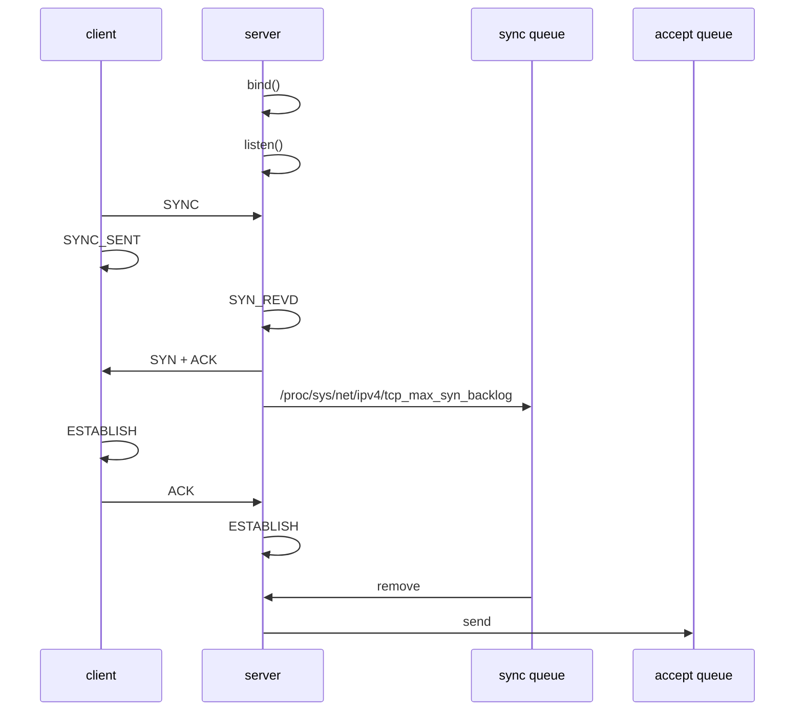

# tcp connect

## reference

[tcp的全连接队列与半连接队列满会发生什么](https://www.cnblogs.com/xiaolincoding/p/12995358.html)

## desc

tcp 的连接状态如图所示，如果在server收到第二个ack时， `accept queue` 满了，会发生什么呢？

全连接队列满时，对client三次握手最后一个ACK包的处理方式，通过一个内核参数 `tcp_abort_on_overflow` 决定。

1. tcp_abort_on_overflow = 0，（当前linux的默认配置），如果server端全连接队列满，会将client端发送的最后一个ACK包忽略。
   1. 如果配置 tcp_abort_on_overflow = 1 则直接向客户端恢复 RST
2. 如果client端传送数据时，server端记录的socket的状态已经被回收清理，则会回复reset，重新建立连接；

client 可能会对没有收到的SYNC进行重传。
