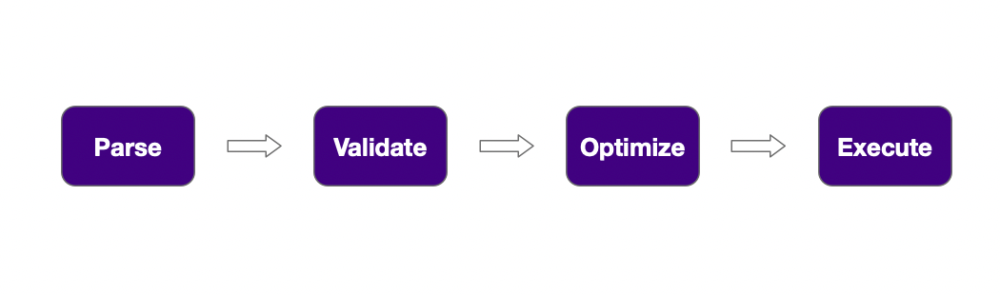
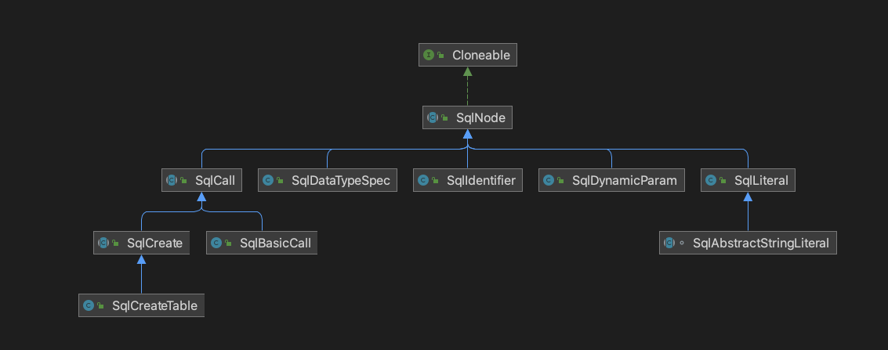
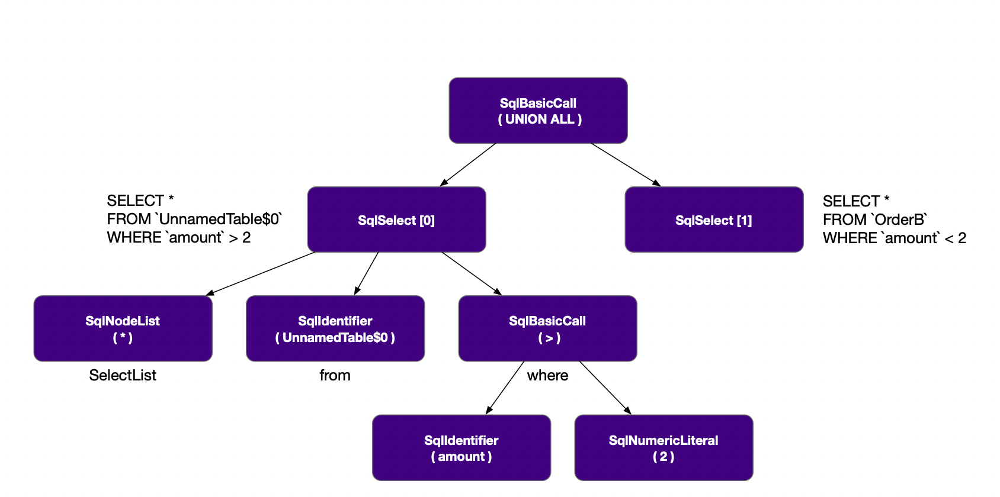

# Flink SQL 原理解析

## StreamSQLExample

> 这个是官方的一个 example，我们通过这个例子来分析一下 StreamSQL

```java
/**
 * Simple example for demonstrating the use of SQL on a table backed by a {@link DataStream} in Java
 * DataStream API.
 *
 * <p>In particular, the example shows how to
 *
 * <ul>
 *   <li>convert two bounded data streams to tables,
 *   <li>register a table as a view under a name,
 *   <li>run a stream SQL query on registered and unregistered tables,
 *   <li>and convert the table back to a data stream.
 * </ul>
 *
 * <p>The example executes a single Flink job. The results are written to stdout.
 */
public final class StreamSQLExample {

    // *************************************************************************
    //     PROGRAM
    // *************************************************************************

    public static void main(String[] args) throws Exception {

        // set up the Java DataStream API
        final StreamExecutionEnvironment env = StreamExecutionEnvironment.getExecutionEnvironment();

        // set up the Java Table API
        final StreamTableEnvironment tableEnv = StreamTableEnvironment.create(env);

        final DataStream<Order> orderA =
                env.fromCollection(
                        Arrays.asList(
                                new Order(1L, "beer", 3),
                                new Order(1L, "diaper", 4),
                                new Order(3L, "rubber", 2)));

        final DataStream<Order> orderB =
                env.fromCollection(
                        Arrays.asList(
                                new Order(2L, "pen", 3),
                                new Order(2L, "rubber", 3),
                                new Order(4L, "beer", 1)));

        // convert the first DataStream to a Table object
        // it will be used "inline" and is not registered in a catalog
        final Table tableA = tableEnv.fromDataStream(orderA);

        // convert the second DataStream and register it as a view
        // it will be accessible under a name
        tableEnv.createTemporaryView("TableB", orderB);

        // union the two tables
        final Table result =
                tableEnv.sqlQuery(
                        "SELECT * FROM "
                                + tableA
                                + " WHERE amount > 2 UNION ALL "
                                + "SELECT * FROM TableB WHERE amount < 2");

        // convert the Table back to an insert-only DataStream of type `Order`
        tableEnv.toDataStream(result, Order.class).print();

        // after the table program is converted to a DataStream program,
        // we must use `env.execute()` to submit the job
        env.execute();
    }

    // *************************************************************************
    //     USER DATA TYPES
    // *************************************************************************

    /** Simple POJO. */
    public static class Order {
        public Long user;
        public String product;
        public int amount;

        // for POJO detection in DataStream API
        public Order() {}

        // for structured type detection in Table API
        public Order(Long user, String product, int amount) {
            this.user = user;
            this.product = product;
            this.amount = amount;
        }

        @Override
        public String toString() {
            return "Order{"
                    + "user="
                    + user
                    + ", product='"
                    + product
                    + '\''
                    + ", amount="
                    + amount
                    + '}';
        }
    }
}
```

## **Apache Calcite 是什么？**

> [Apache Calcite](https://calcite.apache.org/)：它是一个通用的动态数据管理框架，可以以统一的 SQL 查询语言进行数据的管理



- Parse：语法解析阶段，将用户传入的 SQL 语句转化为 `SqlNode`
- Validate：语法校验阶段，通过类似Catelog等进行元数据的合法验证，此时还是 SqlNode
- Optimize：执行计划优化阶段，将 SqlNode 转化为 RelNode，并利用规则优化器进行等价转化等操作，最后得到优化过后的执行计划
- Execute：将逻辑查询计划，生成可执行的代码，提交运行

## **Flink SQL 的执行过程**

```java
        // union the two tables
        final Table result =
                tableEnv.sqlQuery(
                        "SELECT * FROM "
                                + tableA
                                + " WHERE amount > 2 UNION ALL "
                                + "SELECT * FROM TableB WHERE amount < 2");

        // convert the Table back to an insert-only DataStream of type `Order`
        tableEnv.toDataStream(result, Order.class).print();
```

### 语法解析

> SQL 语句被解析成

```sql
SELECT * FROM UnnamedTable$0 WHERE amount > 2
UNION ALL
SELECT * FROM TableB WHERE amount < 2
```

> 调用栈被解析为：
>
> TableEnvironment#sqlQuery(String query)
>
> --> ParserImpl#parse(String statement)
>
> ​    --> CalciteParser#parse(String sql)
>
> ​    --> SqlToOperationConverter.convert(FlinkPlannerImpl flinkPlanner, CatalogManager catalogManager, SqlNode sqlNode)



- SqlIdentifier：SQL中的Id标示符
- SqlCall：是对操作符的调用. 操作符可以用来描述任何语法结构，SQL解析树中的每个非叶节点都是某种类型的SqlCall
- SqlDataTypeSpec：SQL数据类型规范
- SqlLiteral：SQL中的常量, 表示输入的常量
- SqlDynamicParam：SQL语句中的动态参数标记
- SqlKind：SqlNode类型
- SqlOperator：SQL解析的节点类型,包括：函数，操作符(=)，语法结构(case)等操作

>我们通过一个简单里的例子去理解，例如：

```sql
select id, cast(score as int), 'hello' from T where id < ?
```

在上面的SQL中，id、score、T 等为 SqlIdentifier，cast() 为 SqlCall，int 为SqlDataTypeSpec，‘hello’ 为 SqlLiteral，’?’ 为SqlDynamicParam，所有的操作都是一个 SqlCall, 例如查询是一个 SqlSelect、删除是一个 SqlDelete 等等。

在 `StreamSQLExample` 中的 SQL 被转换为：



### 元数据校验

经过上面的解析分析之后，需要通过catalogManager进行元数据上面的校验，这里通过FlinkCalciteSqlValidator.validate进行语法的合法解析，

```java
    public static Optional<Operation> convert(
            FlinkPlannerImpl flinkPlanner,
            CatalogManager catalogManager,
            SqlNode sqlNode) {
        // validate the query
        final SqlNode validated = flinkPlanner.validate(sqlNode);
        SqlToOperationConverter converter = new SqlToOperationConverter(flinkPlanner, catalogManager);
...
    }
```

经过合法性验证，补充了相应的元数据

```sql
SELECT `UnnamedTable$0`.`user`, `UnnamedTable$0`.`product`, `UnnamedTable$0`.`amount`
FROM `default_catalog`.`default_database`.`UnnamedTable$0` AS `UnnamedTable$0`
WHERE `UnnamedTable$0`.`amount` > 2
UNION ALL
SELECT `OrderB`.`user`, `OrderB`.`product`, `OrderB`.`amount`
FROM `default_catalog`.`default_database`.`OrderB` AS `OrderB`
WHERE `OrderB`.`amount` < 2
```


