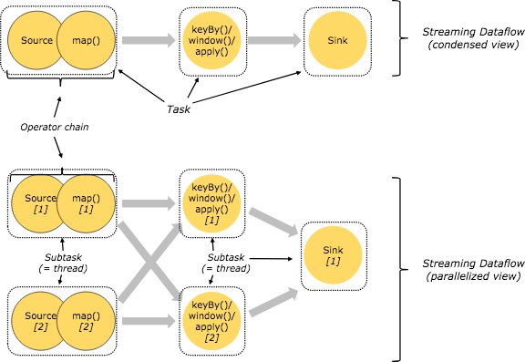
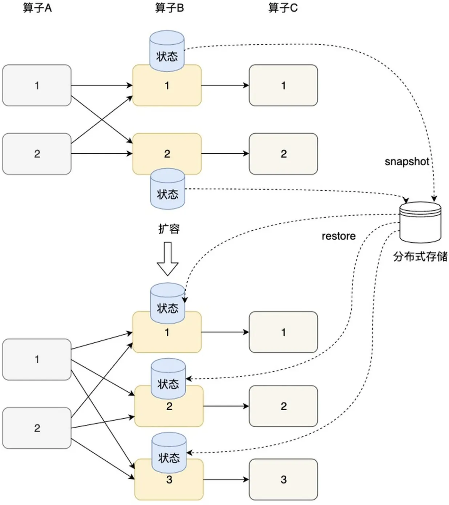

- # readme

  > 本文测试代码在 [test-flink](https://github.com/0x822a5b87/test-flink.git) 内包含。

  ## 引用

  - [Flink状态管理详解：`Keyed State` 和`Operator List State`深度解析](https://zhuanlan.zhihu.com/p/104171679)
  - [Flink状态的缩放（rescale）与键组（Key Group）设计](https://blog.csdn.net/nazeniwaresakini/article/details/104220138)
  - [Data exchange between tasks](https://cwiki.apache.org/confluence/display/FLINK/Data+exchange+between+tasks)
  - [Timely Stream Processing](https://nightlies.apache.org/flink/flink-docs-master/docs/concepts/time/)
  - [Flink Checkpoint机制原理剖析与参数配置](https://zhuanlan.zhihu.com/p/104601440)
  - [Flink架构](https://zhuanlan.zhihu.com/p/92721430)
  - [Flink 原理与实现：理解 Flink 中的计算资源](http://wuchong.me/blog/2016/05/09/flink-internals-understanding-execution-resources/)
  - [[Difference between job, task and subtask in flink](https://stackoverflow.com/questions/53610342/difference-between-job-task-and-subtask-in-flink)

  ## 入门

  ### flink模型

  

  `flink` 程序把实时计算抽象成了很多模块，其中：

  - `source operator` 负责从数据源中消费数据，数据源可以是 kafka 之类的消息流，也可以是文件，socket，hdfs 等；
  - `transformation operators` 负责消费到数据之后对数据进行处理，例如 `sum`, `avg` 等，在计算的过程中，也会存在一些状态，flink 会负责维护这些状态（在checkpoint中）；
  - `sink operator` 在完成计算之后，flink 需要将数据输出，输出可以是一个持久化的DB（例如redis或者mysql），也可以是简单的输出到 `stdout`。

  > Flink 中的执行图可以分成四层：StreamGraph -> JobGraph -> ExecutionGraph -> 物理执行图。
  >
  > - **StreamGraph：**是根据用户通过 Stream API 编写的代码生成的最初的图。用来表示程序的拓扑结构。
  > - **JobGraph：**StreamGraph经过优化后生成了 JobGraph，提交给 JobManager 的数据结构。主要的优化为，**将多个符合条件的节点 chain 在一起作为一个节点**，这样可以减少数据在节点之间流动所需要的序列化/反序列化/传输消耗。
  > - **ExecutionGraph：**JobManager 根据 JobGraph 生成ExecutionGraph。ExecutionGraph是JobGraph的并行化版本，是调度层最核心的数据结构。
  > - **物理执行图：**JobManager 根据 ExecutionGraph 对 Job 进行调度后，在各个TaskManager 上部署 Task 后形成的“图”，并不是一个具体的数据结构。

  假设我们存在如下 `SocketTextStreamWordCount` 代码：

  ```java
  public static void main(String[] args) throws Exception {
    // 检查输入
    final ParameterTool params = ParameterTool.fromArgs(args);
    ...
  
    // set up the execution environment
    final StreamExecutionEnvironment env = StreamExecutionEnvironment.getExecutionEnvironment();
  
    // get input data
    DataStream<String> text =
        env.socketTextStream(params.get("hostname"), params.getInt("port"), '\n', 0);
  
    DataStream<Tuple2<String, Integer>> counts =
        // split up the lines in pairs (2-tuples) containing: (word,1)
        text.flatMap(new Tokenizer())
            // group by the tuple field "0" and sum up tuple field "1"
            .keyBy(0)
            .sum(1);
    counts.print();
    
    // execute program
    env.execute("WordCount from SocketTextStream Example");
  }
  ```

  > StreamGraph

  整个job的结构分为如下几个 `operator`:

  1. 使用 `socket` 作为 job 的 `source`；
  2. 使用 `Tokenizer()` 将 `source` 中收到的数据拆分为不同的单词，这里是一个 `flatMap`；
  3. 将 `flatMap` 生成的单词进行分组，并进行 `sum`，这里是一个 `Keyed Aggregation`；
  4. 输出数据到 stdout，这里就是 `sink`;

  **这几个 `operator` 加上 `Edge`，就形成了我们的 `StreamGrpah`**

  > JobGraph

  如果把 `StreamGraph` 里的每一个节点都当成一个真实的线程的话，那么我们一定会存在大量的线程/进程/网络间的IO开销，所以我们可以在这一步将一些符合条件的节点进行合并。

  例如，我们可以将 `Keyed Aggregation` 和 `sink` 进行合并。

  但是，我们注意到的是，`flat map` -> `Keyed Aggregation` 是不可合并的。

  此外，JobGraph 还会生成一些中间数据集 `Intermediate DataSet`，这是用于存储计算的中间数据的。

  > ExecutionGraph

  `JobGraph` 的问题在于，他所有的进程资源都是单线程/单进程的，在生成 `ExectuionGraph` 的过程中，我们会将每一个 `operator` 根据配置变成并行的。

  此外，值得注意的是 `Intermediate Result Partition` 也是并行的。

  > 物理执行图

  物理执行图相对于 `ExecutionGraph` 有几个变化：

  1. `IRP` 被拆分为多个 `RSP`，因为一个 `operator` 可能会对象多个下游的 `operator`；
  2. `ExecutionEdge` 被替换为真实的输入 `InputChannel` 进行通信。

  

  ### flink的重要概念

  > 1. flink是一个主从结构的分布式程序，它由client和cluster两部分组成；
  > 2. cluster由主节点 `JobManager`（JM）和从节点 `TaskManager` 组成(TM)；
  >    1. `JobManager` 负责协调分布式执行：调度Task、协调检查点、协调失效恢复等工作；
  >    2. `TaskManager` 负责执行一个具体的Dataflow的Task，缓存并交换streams等工作。
  > 3. client属于flink架构的一部分，但不属于flink集群。它的工作是连接user和cluster.
  > 4. `TaskManager` 在启动的时候就设置好了槽位数（`slot`），每个 `slot` 能启动一个 `Task`，Task 为线程。从 JobManager 处接收需要部署的 Task，部署启动后，与自己的上游建立 Netty 连接，接收数据并处理。

  ### flink 中的计算资源

  

  - A task is an abstraction representing a chain of operators that could be executed in a single thread. 
  - A subtask is one parallel slice of a task. **This is the schedulable, runable unit of execution.** In the diagram above, the application is to be run with a parallelism of two for the source/map and keyBy/Window/apply tasks, and a parallelism of one for the sink -- resulting in a total of 5 subtasks.
  - 也就是说，`subtask` 就是 `task` 的并行化；

  下图中，分为 **数据流（逻辑视图）**，**数据流（并行化视图）**，**数据流（优化后视图）**，图中每一个虚线框都代表一个 `SubTask`，而这个 `SubTask` 也就是一个 `Thread`。

  - 数据流（逻辑视图）类似于StreamGraph，没有任何优化；
  - 数据流（并行化视图）是将逻辑视图进行并行化处理之后生成的结果；
  - 数据流（优化后视图）将 `operator` 组合成了 `operator chain`

  

  ### flink 计算资源的总结

  > flink中一个 `job` 的计算资源涉及到以下这个这些概念：
  >
  > - `TaskManager`
  > - `slot`
  > - `operator`
  > - `task`
  > - `subtask`
  > - `slotSharing`
  > - `parrallelism`
  > - `thread`
  >
  > 1. 一个 flink 集群会有很多的 `TM`，`JM` 在发布任务的时候，会选择空闲的 `TM` 并生成物理执行图；
  >
  > 2. 一个 `TM` 会包含多个 `slot`，每个 `slot` 都是单线程的，对应一个单独的JVM进程；
  > 3. 在生成 `StreamGraph` 时，会根据代码生成不同的 `operator`，这些 `operator` 经过优化后，会生成 `operator chain`，而这个 `operator chain` 就是对应的我们的实际的 `task`；
  > 4. 然而，在实际的运行过程中，我们通过设置 `parallelism` 参数可以修改程序的并行度，当并行度为1的时候，我们的 `task` 看起来就是 `subtask`；
  > 5. 但是当我们的并行度 > 1 时，我们 `operator` 就会产生多个实例，这个实例就是 `subtask`；
  > 6. 这些 `subtask` 运行在 `slot` 上，具体来说，当一个 slot 启动时，Flink 会为该 slot 创建一个主线程，并将该 slot 的所有 subtask 分配给这个主线程。然后，主线程会在同一个线程中执行所有的 subtask,每个 subtask 都会占用一定的 CPU 时间和内存资源。因此，共享 slot 的 subtask 通常都是在一个线程内执行的。

  ### Flink的状态、状态分区、状态缩放（rescale）和Key Group

  #### 托管状态（Managed State）

  > Managed State是由Flink直接管理的，由Flink帮忙存储、恢复和优化；

  #### 原生状态（Raw State）

  > Raw State是开发者自己管理的，需要自己序列化。实际上，在绝大多数场景下我们都不需要自行维护状态

  #### Keyed State

  > 在flink中，当我们使用 `keyBy` 对 stream 进行分组时，我们将得到一个 `KeyedStream`；
  >
  > 而我们每一个相同的 `id`（也就是我们 keyBy 中选择的 key）都会共享一个独一无二的状态；
  >
  > 这个状态就是 `Keyed State`。

  

  #### Operator State

  > `operator state` 就是算子的状态，准确来说是每个 `subtask` 或者说 `operator实例` 的状态。**但是一般来说，都会用来管理 source 和 sink 的状态**，用来保存流入数据的偏移量或对输出数据做缓存，以保证Flink应用的Exactly-Once语义。
  >
  > 举例说明，假设我们存在一个场景，从kafka消费数据，在下游的 operator 中取 sum，最后通过 redis-sink 写入到 redis，那么我们的数据链路是：
  >
  > > `kafka-source` -> `sum-function` -> `redis-sink`
  >
  > 我们的 `kafka-source` 和 `redis-sink` 是有状态的，而 `sum-function` 则是无状态的，所以如果我们需要保证 exactly-once 语义，那么我们只需要通过 `operator state` 管理 `kafka-source` 和 `redis-sink` 的状态即可。
  >
  > 例如，我们有如下流程：
  >
  > 1. 通过 checkpoint 机制，保存 kafka-source 此时的 offset，redis-sink 的值等信息，这个是 snapshot-v1；
  > 2. 正常消费 kafka-source，正常提交 kafka offset，修改 redis；
  > 3. 如果程序此时一切正常，则会进入下一次 checkpoint，此时我们得到 snapshot-v2；
  > 4. 但是，如果在生成下一次checkpoint之前出现异常，我们只需要将 kafka-source 以及 redis-sink 的状态回退到 snapshot-v1 的状态下，再重新计算一次结果即可。因为 sum-function 是无状态的。
  >
  > 实际的 exactly-once 保障比这个复杂很多，但是思想基本都是，记录有副作用的operator的状态，在出现异常的时候回退到异常前的状态，再通过无状态的function重新计算。

  

  #### 状态的缩放

  > flink的扩缩容，就是修改operator的并行，同时也可以修改job使用的CPU核数和内存分配；
  >
  > 在扩缩容的过程中，我们的 operator state 和 keyed state 都有各自的重新分配策略。

  

  #### Operator State的重新分配机制

  > **operator state** 的分配策略有两种：
  >
  > 1. 均匀分配；
  > 2. 将所有的状态合并后重新分配；
  >
  > 比如下面的operator state，假设并行度从 1 增加到 2，我们只需要将刚才的每个分区的offset均匀的分配到新增的subtask上即可。

  

  #### Keyed State的重新分配

  > 首先，flink的keyBy策略一般是使用key计算hash值，之后对下游的subtask数量取模。伪代码如下
  >
  > ```java
  > public SubTask keyedBy(String key) {
  > // 声明并行度
  > 	int parallelism = 10;
  > 	// 声明subtask
  > 	SubTask[] subtasks = new SubTask[parallelism];
  > 	// 计算index
  > 	int index = hash(key) % parallelism;
  > 
  > 	return SubTask[index];
  > }
  > ```
  >
  > 在执行checkpoint的时候，所以的keyed state会被存入，并在调整完之后读取；在恢复的过程中，很多的 key 所处的 subtask 都变化了，所以恢复过程会非常的慢。
  >
  > 为了优化keyed state的性能，flink引入了 `key group`。

  

  

  #### Key Group

  > `key group` 是 `keyed state` 分配的原子单位，并且 key group 是一个长度等于 max_parallelism 的数组，**max_parallelism** 是在flink部署时在配置中指定的，也就是我们可以认为 max_parallelism 是一个常量。
  >
  > 
  >
  > 我们首先将 key group 均匀的分布到每一个 subtask 上，在执行 keyBy 时，我们先计算 key 的 hash 值，随后根据 hash 值将我们的 key 分配到 key group 上。

  

  #### KeyGroupRange

  > key group 在源码中以 `KeyGroupRange` 的形式实现，key group 是一个逻辑概念，而 `KeyGroupRange` 则是实体，每个 `KeyGroupRange` 都表示 key group 中的一段，多个 KeyGroupRange 就组合成了 key group。
  >
  > ```java
  > // KeyGroup 和 KeyGroupRange 的伪代码
  > // KeyGroupRange 表示了 KeyGroup 中 subtasks[start] 到 subtasks[end] 这个区间的值。
  > public class KeyGroupRange {
  >   int start;
  >   int end;
  > }
  > 
  > public class KeyGroup {
  >   SubTask[] subtasks;
  > }
  > ```

  ```java
  public class KeyGroupRange implements KeyGroupsList, Serializable {
  
      public static final KeyGroupRange EMPTY_KEY_GROUP_RANGE = new KeyGroupRange();
   
      private final int startKeyGroup;
      private final int endKeyGroup;
   
    	// 空的 key group，通过该构造器构造的 key group 将不包含任何的 key。
      private KeyGroupRange() {
          this.startKeyGroup = 0;
          this.endKeyGroup = -1;
      }
   
      public KeyGroupRange(int startKeyGroup, int endKeyGroup) {
          this.startKeyGroup = startKeyGroup;
          this.endKeyGroup = endKeyGroup;
      }
   
      // 表示当前KeyGroupRange是否包含该 keyGroup，并且左右都是闭区间。
      @Override
      public boolean contains(int keyGroup) {
          return keyGroup >= startKeyGroup && keyGroup <= endKeyGroup;
      }
   
      public KeyGroupRange getIntersection(KeyGroupRange other) {
          int start = Math.max(startKeyGroup, other.startKeyGroup);
          int end = Math.min(endKeyGroup, other.endKeyGroup);
          return start <= end ? new KeyGroupRange(start, end) : EMPTY_KEY_GROUP_RANGE;
      }
   
      // 获取当前KeyGroupRange表示的 key group 长度
      public int getNumberOfKeyGroups() {
          return 1 + endKeyGroup - startKeyGroup;
      }
   
      public int getStartKeyGroup() {
          return startKeyGroup;
      }
   
      public int getEndKeyGroup() {
          return endKeyGroup;
      }
   
      @Override
      public int getKeyGroupId(int idx) {
          if (idx < 0 || idx > getNumberOfKeyGroups()) {
              throw new IndexOutOfBoundsException("Key group index out of bounds: " + idx);
          }
          return startKeyGroup + idx;
      }
   
      public static KeyGroupRange of(int startKeyGroup, int endKeyGroup) {
          return startKeyGroup <= endKeyGroup ? new KeyGroupRange(startKeyGroup, endKeyGroup) : EMPTY_KEY_GROUP_RANGE;
      }
  }
  ```

  #### 引入KeyGroup之后如何对Key进行分区

  > 通过 `KeyGroupRangeAssignment` 分配。

  ```java
  		// 通过 Object 的 key 计算 key group 索引
  		public static int assignToKeyGroup(Object key, int maxParallelism) {
          return computeKeyGroupForKeyHash(key.hashCode(), maxParallelism);
      }
   
      // 通过key的hash值以及maxParallelism计算 key group 的索引
      public static int computeKeyGroupForKeyHash(int keyHash, int maxParallelism) {
          return MathUtils.murmurHash(keyHash) % maxParallelism;
      }
  ```

  #### 如何将KeyGroup映射到SubTask

  > 通过 `KeyGroupRangeAssignment` 分配，通过代码我们可以看到，我们尽量的将KeyGroup均匀的分布到每一个 subtask 实例中。
  >
  > 假设有两个连续的 operator，则他们的 operatorIndex 分别为 `operatorIndex` 和 `operatorIndex + `，那么他们的 KeyGroupRange 应该分别为：
  >
  > ```java
  >         int start0 = ((operatorIndex * maxParallelism + parallelism - 1) / parallelism);
  >         int end0 = ((operatorIndex + 1) * maxParallelism - 1) / parallelism;
  > 
  >         int start1 = (((operatorIndex + 1) * maxParallelism + parallelism - 1) / parallelism);
  >         int end1 = ((operatorIndex + 1) * maxParallelism - 1) / parallelism;
  > ```
  >
  > 那么 `start1 - end0` 等于 **1**，也就是说两个相邻的 operator 负责的 KeyGroupRange 不会有交集，因为KeyGroupRange左右都是闭区间。

  ```java
  		// 计算每一个subtask需要处理哪些KeyGroup
  		public static KeyGroupRange computeKeyGroupRangeForOperatorIndex(
          int maxParallelism,
          int parallelism,
          int operatorIndex) {
   
        	// ...
   
          int start = ((operatorIndex * maxParallelism + parallelism - 1) / parallelism);
          int end = ((operatorIndex + 1) * maxParallelism - 1) / parallelism;
          return new KeyGroupRange(start, end);
      }
  ```

  #### 为什么引入KeyGroup之后可以解决分区的问题

  > 这是因为`KeyGroup`的分配机制和`Key`的分配机制不一样引起的：
  >
  > - `KeyGroup` 的分配机制是：**尽量均匀、连续的分配到SubTask**
  > - `Key` 的分配机制是：算了hash值之后分配到SubTask
  >
  > 而在我们的应用开发中，KeyGroup 的数量是和 `maxParamllism（最大并行度）`绑定的，这个值是不会轻易改变的，所以每一个Key他绑定的KeyGrou也是不会轻易改变的。
  >
  > 当我们修改并行度时，因为KeyGroup是均匀、连续的分配到SubTask的，假设并行度是3，而KeyGroup是10，那么现在的KeyGroup分配应该是类似于
  >
  > - SubTask1 -> {1, 2, 3}
  > - SubTask2 -> {4, 5, 6}
  > - SubTask3 -> {7, 8, 9, 10}
  >
  > 当并行度从3增加到5时，可能得分配就类似于：
  >
  > - SubTask1 -> {1, 2, 3}
  > - SubTask2 -> {4, 5, 6}
  > - SubTask3 -> {7, 8}
  > - SubTask4 -> {9, 10}
  >
  > 这样需要迁移的Key就比较少了。

  ### 时间语义

  #### ProcessingTime（处理时间）

  > 处理事件的时间；

  #### EventTime（事件时间）

  > 事件发生的时间，一般是事件自带的时间戳；

  #### IngestionTime（**摄入时间**）

  > 数据从source中消费到的时间；

  #### Window Processing Time（）

  #### Watermark

  > 为什么我们需要 `watermark`?
  >
  > **支持事件时间的流处理引擎需要一种度量事件时间进度的方式。例如，一个 `operator` 基于大小为一小时的事件时间窗口进行计算，需要被告知到达下一个完整小时的时间点（因为事件时间不依赖于`当前节点的时钟`），以便该运算符可以结束当前窗口。**

  > 在flink任务中，可能会出现事件时间滞后于处理时间的情况（例如消息延迟了），所以我们需要一个策略来指定，我们应该怎么去处理这些延迟的数据。
  >
  > `watermark` 声明 `EventTime` 已经达到时间 `t0`，假设接下来收到的消息的 `EventTime` 是 `t1`，那么意味着：
  >
  > 1. 当 `t1` < `t0`，我们认为该消息已经不是正常的消息了，此时我们可以针对这种不正常的消息来执行我们指定的策略。

  #### Watermarks in Parallel Streams

  

  > 在上面的示例图中，我们可以看到：
  >
  > - watermark 一般从 source function 生成，并经由 EE 流动到 EV；
  >
  > - 每一个 operator 都有自己的 watermark，例如 **Source(1)** 的 watermark 是 `33`；
  > - 每一个 operator 的 watermark 是独立的；
  > - Operator 在生成 watermark 之后，会将 watermark 向下游的 operator 发送，下游的 operator 收到上游的 watermark 之后也会更新（advanced）自己的 watermark。
  > - 一部分 operator 有多个上游 operator，它的 watermark 是它所有输入的 watermark 的最小值。

  ### 时间窗口

  > 对于聚合事件（**aggregating events**），例如 `count`， `sum` 操作我们没办法计算整个流的长度。因为流是无界的，所以我们需要窗口。

  #### 固定窗口（Tumbling Windows）

  #### **滑动窗口（Sliding Windows）**

  #### **会话窗口（Session Windows）**

  #### late element

  > 什么是 `late element`

  > flink 怎么处理 `late element`

  > 一个实际的例子

  ```java
  DataStream<Tuple2<String, Integer>> counts = ...
  
  counts
      .keyBy(0)
      .window(TumblingEventTimeWindows.of(Time.minutes(10)))
      .allowedLateness(Time.minutes(1))
      .sum(1);
  ```

  ### exactly once

  > 如何实现 excatly once？
  >
  > **首先，对于 `恰好一次` 语义，它意味着系统的快照必须提供这样的保证：在恢复时，每条记录只对运算符状态产生一次影响。**
  >
  > 例如，如果有一个用户在流中应用元素计数函数，那么统计的结果将总是跟流中元素的真实个数一致，不管有没有发生执行失败还是恢复。需要注意的是，这并不意味着每条数据流过处理引擎仅仅一次。
  >
  > **另外，这里的“`恰好一次` 语义主要指的是Flink自身提供的保证，但并不一定能保证Flink跟外部系统交互时的行为也满足“`恰好一次` 语义，这属于端到端（end to end）的语义范畴。**
  >
  > 

  ### Checkpoint和savepoint

  #### 一个简单的checkpoint包含的流程

  ### 旁路流

  ```java
  private static final OutputTag<T> outputTag = new OutputTag<>("tagName", TypeInformation.of(T.class));   //T为类泛型，具体业务中替换
  
  SingleOutputStreamOperator<T> mainDataStream = entityDataStream
                   .process(new ProcessFunction<T,T>() {
                      @Override
                      public void processElement(T entity, Context context,
                              Collector<T> collector) throws Exception {
                          //collector为常规流
                          collector.collect(entity);
                          //旁路流
                          context.output(outputTag, entity);
                      }
                  });
  
  //旁路输出流
  DataStream<ActivityActionEntity> entityDataStream outputStream = mainDataStream.getSideOutput(ipRiskCalcTag);
  ```

  ### Flink数据交换

  > 参考 **flink模型** 这一节中对于 `StreamGraph`、`JobGraph`、`ExecutionGraph`、物理执行图的生成流程。

  

  

  

  

  #### ExecutionVertex（EV）

  #### IntermediateResultPartition（IRP）

  #### ExecutionEdge（EE）

  #### ResultPartition（RP）

  #### ResultSubpartition（RSP）

  #### BufferWriter

  #### RecordWriter

  #### RecordSerializer

- https://stackoverflow.com/questions/53610342/difference-between-job-task-and-subtask-in-flink)
